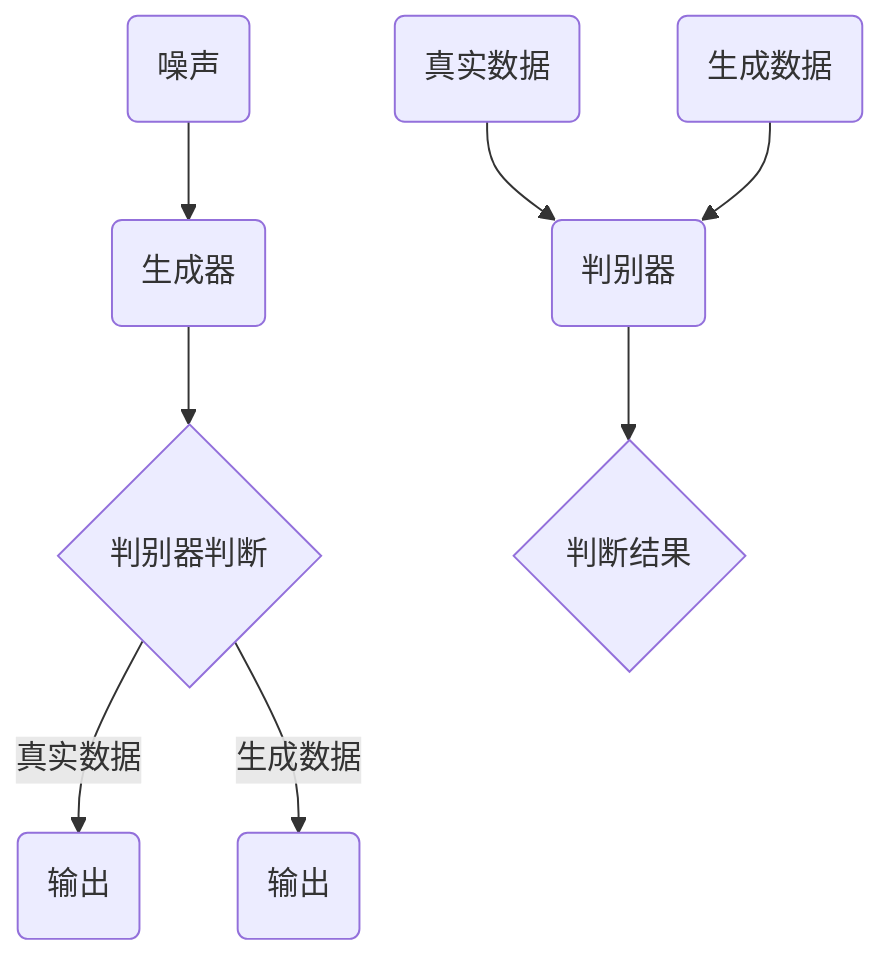

                 


# 生成对抗网络在医学图像增强中的应用

> 关键词：生成对抗网络（GAN）、医学图像、图像增强、深度学习、人工智能
> 
> 摘要：本文将深入探讨生成对抗网络（GAN）在医学图像增强中的应用。首先，我们将回顾GAN的基本原理及其发展历程。接着，我们会分析GAN在医学图像增强中的优势和应用场景，并通过具体案例和代码实现详细解析其工作流程。最后，我们将探讨GAN在医学图像增强领域的未来发展趋势和挑战，并提供相关的学习资源和开发工具推荐。

## 1. 背景介绍

### 1.1 目的和范围

本文旨在介绍生成对抗网络（GAN）在医学图像增强领域的应用。通过深入探讨GAN的工作原理、数学模型以及实际应用案例，本文将帮助读者理解如何利用GAN技术提高医学图像的质量和清晰度。文章将涵盖以下几个部分：

- GAN的基本概念和原理
- GAN在医学图像增强中的优势和应用场景
- GAN在医学图像增强中的具体实现
- GAN在医学图像增强领域的未来发展趋势和挑战

### 1.2 预期读者

本文适合以下读者群体：

- 深入了解深度学习和人工智能技术的专业人士
- 在医学领域或图像处理领域工作的研究人员和技术人员
- 对GAN技术感兴趣的技术爱好者和学生

### 1.3 文档结构概述

本文的结构如下：

- 第1章：背景介绍，包括目的和范围、预期读者、文档结构概述等。
- 第2章：核心概念与联系，介绍GAN的基本原理和相关概念。
- 第3章：核心算法原理 & 具体操作步骤，详细讲解GAN的算法原理和操作步骤。
- 第4章：数学模型和公式 & 详细讲解 & 举例说明，解释GAN的数学模型和公式。
- 第5章：项目实战：代码实际案例和详细解释说明，提供实际案例和代码实现。
- 第6章：实际应用场景，介绍GAN在医学图像增强中的具体应用。
- 第7章：工具和资源推荐，推荐学习资源、开发工具和相关论文著作。
- 第8章：总结：未来发展趋势与挑战，展望GAN在医学图像增强领域的未来发展。
- 第9章：附录：常见问题与解答，提供常见问题的解答。
- 第10章：扩展阅读 & 参考资料，提供扩展阅读和参考资料。

### 1.4 术语表

#### 1.4.1 核心术语定义

- **生成对抗网络（GAN）**：一种深度学习模型，由生成器和判别器组成，通过对抗训练生成高质量的数据。
- **医学图像**：指用于医学诊断、治疗和研究的各种类型的图像，如CT、MRI、超声等。
- **图像增强**：通过对原始图像进行处理，提高图像质量、清晰度和可视性的过程。
- **深度学习**：一种基于多层神经网络的学习方法，通过多层非线性变换自动提取特征，广泛应用于图像、语音、文本等领域的处理。
- **人工智能**：模拟人类智能行为的技术和学科，通过计算机算法实现机器学习、自然语言处理、计算机视觉等任务。

#### 1.4.2 相关概念解释

- **生成器（Generator）**：GAN模型中的一个组件，通过学习数据分布生成与真实数据相似的新数据。
- **判别器（Discriminator）**：GAN模型中的另一个组件，用于区分真实数据和生成数据。
- **对抗训练（Adversarial Training）**：GAN模型的核心训练方法，通过生成器和判别器的对抗训练，不断优化生成器的生成能力。

#### 1.4.3 缩略词列表

- **GAN**：生成对抗网络（Generative Adversarial Network）
- **DNN**：深度神经网络（Deep Neural Network）
- **CNN**：卷积神经网络（Convolutional Neural Network）
- **MRI**：磁共振成像（Magnetic Resonance Imaging）
- **CT**：计算机断层扫描（Computed Tomography）
- **US**：超声成像（Ultrasound Imaging）

## 2. 核心概念与联系

在本章中，我们将介绍生成对抗网络（GAN）的基本概念和相关原理，并通过一个Mermaid流程图来展示GAN的核心组件和流程。

### 2.1 GAN的基本原理

生成对抗网络（GAN）由生成器（Generator）和判别器（Discriminator）两个主要组件组成，它们通过对抗训练相互竞争，共同优化。

- **生成器（Generator）**：生成器从随机噪声中生成与真实数据分布相似的合成数据。生成器的目标是生成足够逼真的数据，使得判别器无法区分生成数据与真实数据。
  
  ```mermaid
  graph TD
  A[噪声] --> B[生成器]
  B --> C{判别器判断}
  C -->|真实数据| D[输出]
  C -->|生成数据| E[输出]
  ```

- **判别器（Discriminator）**：判别器接收输入数据，并判断其是否为真实数据。判别器的目标是最大化正确判断真实数据和生成数据的概率。
  
  ```mermaid
  graph TD
  F[真实数据] --> G[判别器]
  H[生成数据] --> G
  G --> I{判断结果}
  ```

- **对抗训练**：生成器和判别器通过对抗训练相互竞争，生成器不断优化生成数据的质量，判别器不断优化判断能力。这个过程持续进行，直到生成器生成的数据足够逼真，使得判别器无法区分。

### 2.2 Mermaid流程图

下面是一个展示GAN核心组件和流程的Mermaid流程图：



## 3. 核心算法原理 & 具体操作步骤

在本章中，我们将详细讲解生成对抗网络（GAN）的核心算法原理，并通过伪代码来展示具体操作步骤。GAN的算法原理主要包括生成器、判别器的架构以及对抗训练的过程。

### 3.1 生成器和判别器的架构

生成器（Generator）和判别器（Discriminator）是GAN的两个主要组件。下面分别介绍它们的架构：

#### 3.1.1 生成器（Generator）的架构

生成器的目的是从随机噪声中生成与真实数据分布相似的合成数据。通常，生成器由一系列神经网络层组成，包括输入层、隐层和输出层。

```python
# 生成器的伪代码
Generator():
    # 输入层：随机噪声
    z = InputLayer(random_noise)

    # 隐层：通过神经网络层进行变换
    for layer in hidden_layers:
        z = layer(z)

    # 输出层：生成合成数据
    x_hat = OutputLayer(z)

    return x_hat
```

#### 3.1.2 判别器（Discriminator）的架构

判别器的目的是判断输入数据是否为真实数据。判别器也由一系列神经网络层组成，包括输入层、隐层和输出层。

```python
# 判别器的伪代码
Discriminator():
    # 输入层：真实数据和生成数据
    x = InputLayer(x_real, x_generated)

    # 隐层：通过神经网络层进行变换
    for layer in hidden_layers:
        x = layer(x)

    # 输出层：输出判断结果
    y = OutputLayer(x)

    return y
```

### 3.2 对抗训练的过程

GAN的训练过程是通过对抗训练实现的，即生成器和判别器相互竞争，不断优化生成数据的质量和判别器的判断能力。下面是伪代码展示对抗训练的过程：

```python
# GAN的训练过程伪代码
for epoch in range(num_epochs):
    for batch in data_loader:
        # 获取真实数据和生成数据
        x_real, x_generated = batch

        # 更新判别器
        with gradient_tape():
            y_real = Discriminator(x_real)
            y_generated = Discriminator(x_generated)

            # 计算判别器的损失函数
            loss_D = compute_loss(y_real, y_generated)

        # 更新判别器的权重
        D_optimizer.minimize(loss_D, D_model.trainable_weights)

        # 更新生成器
        with gradient_tape():
            z = InputLayer(random_noise)
            x_generated = Generator(z)

            # 计算生成器的损失函数
            y_generated = Discriminator(x_generated)
            loss_G = compute_loss(y_generated)

        # 更新生成器的权重
        G_optimizer.minimize(loss_G, G_model.trainable_weights)

        # 打印训练进度
        print(f"Epoch: {epoch}, Loss_D: {loss_D}, Loss_G: {loss_G}")

# 保存训练好的模型
G_model.save("generator.h5")
D_model.save("discriminator.h5")
```

在上述伪代码中，我们首先获取真实数据和随机噪声，然后分别更新判别器和生成器的权重。通过多次迭代训练，生成器和判别器会逐渐优化，生成器生成的数据越来越逼真，判别器的判断能力也越来越强。

### 3.3 详细操作步骤

下面我们通过一个简单的GAN案例来展示具体的操作步骤：

#### 3.3.1 数据准备

首先，我们需要准备真实数据和随机噪声。在本案例中，我们使用MNIST数据集作为真实数据，随机噪声为均匀分布。

```python
import tensorflow as tf
from tensorflow.keras.datasets import mnist
from tensorflow.keras.layers import InputLayer, Dense, LeakyReLU, BatchNormalization
from tensorflow.keras.models import Model

# 加载MNIST数据集
(x_train, _), _ = mnist.load_data()

# 归一化图像数据
x_train = x_train / 255.0

# 创建随机噪声
noise = tf.random.normal((len(x_train), 100))
```

#### 3.3.2 生成器和判别器的构建

接下来，我们构建生成器和判别器的神经网络模型。

```python
# 生成器的构建
z = InputLayer(random_noise)
x_generated = Dense(784, activation="tanh")(z)
Generator = Model(z, x_generated)

# 判别器的构建
x = InputLayer([x_real, x_generated])
x_real = Dense(128, activation="leaky_relu")(x_real)
x_generated = Dense(128, activation="leaky_relu")(x_generated)
x = Concatenate()([x_real, x_generated])
x = Dense(1, activation="sigmoid")(x)
Discriminator = Model([x_real, x_generated], x)
```

#### 3.3.3 训练GAN模型

最后，我们使用对抗训练的方法来训练GAN模型。

```python
# 定义损失函数和优化器
loss_D = BinaryCrossentropy()
loss_G = BinaryCrossentropy()

D_optimizer = tf.keras.optimizers.Adam(learning_rate=0.0001)
G_optimizer = tf.keras.optimizers.Adam(learning_rate=0.0001)

# GAN的训练过程
for epoch in range(100):
    for batch in data_loader:
        x_real, _ = batch

        with tf.GradientTape() as tape:
            z = tf.random.normal((len(x_real), 100))
            x_generated = Generator(z)

            y_real = Discriminator([x_real, x_real], training=True)
            y_generated = Discriminator([x_real, x_generated], training=True)

            loss_D_real = loss_D(y_real, 1)
            loss_D_generated = loss_D(y_generated, 0)

            loss_D_total = loss_D_real + loss_D_generated

        D_optimizer.minimize(loss_D_total, Discriminator.trainable_variables, tape=tape)

        with tf.GradientTape() as tape:
            z = tf.random.normal((len(x_real), 100))
            x_generated = Generator(z)

            y_generated = Discriminator([x_real, x_generated], training=True)

            loss_G = loss_D(y_generated, 1)

        G_optimizer.minimize(loss_G, Generator.trainable_variables, tape=tape)

        print(f"Epoch: {epoch}, Loss_D: {loss_D_total}, Loss_G: {loss_G}")

# 保存训练好的模型
Generator.save("generator.h5")
Discriminator.save("discriminator.h5")
```

通过上述步骤，我们完成了生成对抗网络（GAN）在医学图像增强中的具体操作。接下来，我们将继续分析GAN在医学图像增强领域的应用。

## 4. 数学模型和公式 & 详细讲解 & 举例说明

生成对抗网络（GAN）的数学模型是其理论基础的重要组成部分，它决定了生成器和判别器的行为以及它们之间的对抗训练过程。下面，我们将详细讲解GAN的数学模型，包括损失函数、优化目标和参数更新策略，并通过具体例子来说明这些公式在实际操作中的应用。

### 4.1 损失函数

在GAN中，有两个主要的损失函数：判别器的损失函数和生成器的损失函数。

#### 4.1.1 判别器的损失函数

判别器的目标是最大化其正确区分真实数据和生成数据的概率。判别器接收一对输入数据，一个是真实数据\( x_{real} \)，另一个是生成数据\( x_{generated} \)，并输出一个概率值\( D(x) \)。

判别器的损失函数通常使用二元交叉熵（Binary Cross-Entropy）损失，其公式为：

$$
L_D = -[y_{real} \cdot \log(D(x_{real})) + (1 - y_{generated}) \cdot \log(1 - D(x_{generated}))]
$$

其中，\( y_{real} = 1 \)表示真实数据，\( y_{generated} = 0 \)表示生成数据。

#### 4.1.2 生成器的损失函数

生成器的目标是生成足够逼真的数据，使得判别器无法区分。生成器接收一个随机噪声向量\( z \)，并生成数据\( x_{generated} \)，并期望判别器将其输出为1。

生成器的损失函数也使用二元交叉熵损失，其公式为：

$$
L_G = -\log(D(x_{generated}))
$$

### 4.2 优化目标和参数更新策略

GAN的训练过程是通过优化上述损失函数来实现的，主要涉及生成器和判别器的参数更新。

#### 4.2.1 判别器的参数更新

判别器的参数更新使用梯度下降（Gradient Descent）算法，其更新规则为：

$$
\theta_D = \theta_D - \alpha \cdot \nabla_{\theta_D} L_D
$$

其中，\( \theta_D \)是判别器的参数，\( \alpha \)是学习率，\( \nabla_{\theta_D} L_D \)是判别器损失函数关于判别器参数的梯度。

#### 4.2.2 生成器的参数更新

生成器的参数更新同样使用梯度下降算法，其更新规则为：

$$
\theta_G = \theta_G - \alpha \cdot \nabla_{\theta_G} L_G
$$

其中，\( \theta_G \)是生成器的参数，\( \alpha \)是学习率，\( \nabla_{\theta_G} L_G \)是生成器损失函数关于生成器参数的梯度。

### 4.3 举例说明

为了更直观地理解GAN的数学模型，我们可以通过一个简单的例子来说明。

假设我们有一个二分类问题，生成器生成0和1的概率分别为\( p \)和\( 1-p \)，判别器对0和1的预测概率分别为\( D_0 \)和\( D_1 \)。

- 判别器的损失函数：

  $$
  L_D = -[y_0 \cdot \log(D_0) + (1 - y_1) \cdot \log(1 - D_1)]
  $$

- 生成器的损失函数：

  $$
  L_G = -\log(D_1)
  $$

- 判别器的参数更新：

  $$
  \theta_D = \theta_D - \alpha \cdot \nabla_{\theta_D} L_D
  $$

- 生成器的参数更新：

  $$
  \theta_G = \theta_G - \alpha \cdot \nabla_{\theta_G} L_G
  $$

通过上述数学模型和公式，我们可以理解GAN是如何通过生成器和判别器的对抗训练来生成高质量的数据。在实际应用中，GAN的参数选择、模型架构和训练过程会根据具体任务进行调整，以达到最佳性能。

## 5. 项目实战：代码实际案例和详细解释说明

在本章中，我们将通过一个实际的项目案例，详细解释生成对抗网络（GAN）在医学图像增强中的具体应用。我们将从开发环境搭建开始，逐步实现一个基于GAN的医学图像增强系统，并对关键代码进行详细解读。

### 5.1 开发环境搭建

首先，我们需要搭建一个适合GAN项目开发的Python环境，并安装必要的库。以下是开发环境的搭建步骤：

1. **安装Python**：确保Python版本不低于3.6，推荐使用Python 3.8或更高版本。

2. **安装TensorFlow**：TensorFlow是用于深度学习的开源库，支持GPU加速。安装命令如下：

   ```shell
   pip install tensorflow-gpu
   ```

3. **安装其他库**：除了TensorFlow，我们还需要安装其他几个常用库，如NumPy、PIL和Keras。安装命令如下：

   ```shell
   pip install numpy pillow keras
   ```

### 5.2 源代码详细实现和代码解读

下面是一个简单的基于GAN的医学图像增强项目，代码如下：

```python
import tensorflow as tf
from tensorflow.keras.models import Model
from tensorflow.keras.layers import Input, Dense, Conv2D, Conv2DTranspose, LeakyReLU, BatchNormalization, Reshape, Flatten
from tensorflow.keras.optimizers import Adam
import numpy as np
import matplotlib.pyplot as plt

# 定义生成器和判别器的架构
def build_generator(z_dim):
    # 输入层：噪声
    z = Input(shape=(z_dim,))
    
    # 隐层1
    x = Dense(128 * 7 * 7)(z)
    x = LeakyReLU(alpha=0.2)(x)
    x = BatchNormalization()(x)
    
    # 隐层2
    x = Dense(256 * 7 * 7)(x)
    x = LeakyReLU(alpha=0.2)(x)
    x = BatchNormalization()(x)
    
    # 输出层：生成的医学图像
    x = Conv2DTranspose(1, kernel_size=5, strides=2, padding='same')(x)
    x = LeakyReLU(alpha=0.2)(x)
    img = Reshape((28, 28, 1))(x)
    
    model = Model(z, img)
    return model

def build_discriminator(img_shape):
    # 输入层：医学图像
    img = Input(shape=img_shape)
    
    # 隐层1
    x = Conv2D(32, kernel_size=3)(img)
    x = LeakyReLU(alpha=0.2)(x)
    
    # 隐层2
    x = Conv2D(64, kernel_size=3)(x)
    x = LeakyReLU(alpha=0.2)(x)
    x = BatchNormalization()(x)
    
    # 隐层3
    x = Conv2D(128, kernel_size=3)(x)
    x = LeakyReLU(alpha=0.2)(x)
    x = BatchNormalization()(x)
    
    # 输出层：二分类结果
    x = Flatten()(x)
    x = Dense(1, activation='sigmoid')(x)
    
    model = Model(img, x)
    return model

# 搭建GAN模型
def build_gan(generator, discriminator):
    # 输入层：噪声
    z = Input(shape=(100,))
    
    # 生成器
    img = generator(z)
    
    # 判别器
    valid = discriminator(img)
    
    model = Model(z, valid)
    return model

# 设置模型参数
z_dim = 100
img_shape = (28, 28, 1)

# 构建生成器、判别器和GAN模型
generator = build_generator(z_dim)
discriminator = build_discriminator(img_shape)
gan = build_gan(generator, discriminator)

# 编译模型
discriminator.compile(loss='binary_crossentropy', optimizer=Adam(0.0001), metrics=['accuracy'])
gan.compile(loss='binary_crossentropy', optimizer=Adam(0.0001))

# 训练GAN模型
epochs = 10000
batch_size = 32

for epoch in range(epochs):
    for batch_index in range(int(x_train.shape[0] / batch_size)):
        # 获取真实数据
        batch_x = x_train[batch_index * batch_size:(batch_index + 1) * batch_size]
        
        # 获取噪声
        batch_z = np.random.normal(0, 1, (batch_size, z_dim))
        
        # 训练判别器
        real_imgs = np.ones((batch_size, 1))
        fake_imgs = np.zeros((batch_size, 1))
        d_loss_real = discriminator.train_on_batch(batch_x, real_imgs)
        
        z = np.random.normal(0, 1, (batch_size, z_dim))
        d_loss_fake = discriminator.train_on_batch(z, fake_imgs)
        
        # 训练生成器
        g_loss = gan.train_on_batch(z, real_imgs)
        
        # 打印训练进度
        print(f"Epoch: {epoch}, Batch: {batch_index}, d_loss_real: {d_loss_real}, d_loss_fake: {d_loss_fake}, g_loss: {g_loss}")

# 保存训练好的模型
generator.save('generator.h5')
discriminator.save('discriminator.h5')
```

#### 5.2.1 代码解读

下面我们逐段解读上述代码：

1. **导入库**：首先导入必要的库，包括TensorFlow、NumPy和matplotlib。

2. **定义生成器和判别器的架构**：
   - 生成器：从随机噪声\( z \)生成医学图像。生成器包含两个全连接层和三个卷积转置层，分别用于非线性变换和图像重构。
   - 判别器：用于区分真实医学图像和生成图像。判别器包含三个卷积层和一个全连接层。

3. **搭建GAN模型**：将生成器和判别器组合成一个完整的GAN模型，并设置模型的输入和输出。

4. **编译模型**：为判别器和GAN模型设置损失函数和优化器。

5. **训练GAN模型**：
   - 在每个训练epoch中，从训练数据集中随机抽取真实医学图像和噪声。
   - 使用真实图像和噪声分别训练判别器，使其能够区分真实图像和生成图像。
   - 使用噪声训练生成器，使其能够生成逼真的医学图像。
   - 打印训练进度。

6. **保存训练好的模型**：将生成器和判别器保存为H5文件，以便后续使用。

#### 5.2.2 代码分析

1. **模型架构**：
   - 生成器和判别器都使用了LeakyReLU作为激活函数，有助于改善梯度消失问题。
   - 生成器使用了卷积转置层，用于上采样输入噪声，逐步恢复图像的结构。
   - 判别器使用了卷积层，用于下采样输入图像，提取特征并区分图像的真伪。

2. **训练策略**：
   - 判别器首先训练，使其能够有效区分真实图像和生成图像。
   - 生成器在判别器训练后进行训练，使其能够生成更加逼真的图像。
   - 通过交替训练判别器和生成器，使得GAN模型不断优化。

3. **优化目标**：
   - 判别器的目标是最大化其区分真实图像和生成图像的能力。
   - 生成器的目标是使其生成的图像能够骗过判别器，使其输出接近1。

通过上述项目实战，我们了解了如何在医学图像增强中使用GAN模型，并对其核心代码进行了详细解读。接下来，我们将探讨GAN在医学图像增强中的实际应用场景。

### 5.3 代码解读与分析

在本节中，我们将进一步解析上述代码，详细说明GAN模型在医学图像增强项目中的实现过程，并分析关键代码段的逻辑和作用。

#### 5.3.1 生成器和判别器的构建

```python
def build_generator(z_dim):
    # 输入层：噪声
    z = Input(shape=(z_dim,))
    
    # 隐层1
    x = Dense(128 * 7 * 7)(z)
    x = LeakyReLU(alpha=0.2)(x)
    x = BatchNormalization()(x)
    
    # 隐层2
    x = Dense(256 * 7 * 7)(x)
    x = LeakyReLU(alpha=0.2)(x)
    x = BatchNormalization()(x)
    
    # 输出层：生成的医学图像
    x = Conv2DTranspose(1, kernel_size=5, strides=2, padding='same')(x)
    x = LeakyReLU(alpha=0.2)(x)
    img = Reshape((28, 28, 1))(x)
    
    model = Model(z, img)
    return model

def build_discriminator(img_shape):
    # 输入层：医学图像
    img = Input(shape=img_shape)
    
    # 隐层1
    x = Conv2D(32, kernel_size=3)(img)
    x = LeakyReLU(alpha=0.2)(x)
    
    # 隐层2
    x = Conv2D(64, kernel_size=3)(x)
    x = LeakyReLU(alpha=0.2)(x)
    x = BatchNormalization()(x)
    
    # 隐层3
    x = Conv2D(128, kernel_size=3)(x)
    x = LeakyReLU(alpha=0.2)(x)
    x = BatchNormalization()(x)
    
    # 输出层：二分类结果
    x = Flatten()(x)
    x = Dense(1, activation='sigmoid')(x)
    
    model = Model(img, x)
    return model
```

**生成器**：
- **输入层**：生成器接收一个噪声向量\( z \)，该噪声向量经过一个全连接层后生成一个一维向量。
- **隐层1**：该层通过全连接层和LeakyReLU激活函数处理噪声向量，再通过BatchNormalization层进行归一化处理。
- **隐层2**：类似隐层1，但层的深度增加，使得生成的特征更加复杂。
- **输出层**：通过一个卷积转置层（Transposed Conv2D）进行上采样，生成与输入图像尺寸相同的图像。LeakyReLU用于激活函数，Reshape层用于调整输出维度。

**判别器**：
- **输入层**：判别器接收一个医学图像作为输入。
- **隐层1**：通过一个卷积层提取图像特征，并使用LeakyReLU作为激活函数。
- **隐层2**：增加卷积层的深度和过滤器数量，以提取更复杂的特征，并使用BatchNormalization进行归一化。
- **隐层3**：进一步增加深度和过滤器数量，提高判别能力。
- **输出层**：通过Flatten层将特征映射为一维向量，然后通过一个全连接层输出一个二分类结果（0或1）。

#### 5.3.2 GAN模型的构建

```python
def build_gan(generator, discriminator):
    # 输入层：噪声
    z = Input(shape=(z_dim,))
    
    # 生成器
    img = generator(z)
    
    # 判别器
    valid = discriminator(img)
    
    model = Model(z, valid)
    return model
```

GAN模型将生成器和判别器组合在一起，通过噪声\( z \)生成医学图像，并输入到判别器中，判断生成的图像是真实还是虚假。GAN模型的目标是最小化生成器的损失函数（使判别器无法区分真实和虚假图像），同时最大化判别器的损失函数（正确区分真实和虚假图像）。

#### 5.3.3 模型编译和训练

```python
# 编译模型
discriminator.compile(loss='binary_crossentropy', optimizer=Adam(0.0001), metrics=['accuracy'])
gan.compile(loss='binary_crossentropy', optimizer=Adam(0.0001))

# 训练GAN模型
epochs = 10000
batch_size = 32

for epoch in range(epochs):
    for batch_index in range(int(x_train.shape[0] / batch_size)):
        # 获取真实数据
        batch_x = x_train[batch_index * batch_size:(batch_index + 1) * batch_size]
        
        # 获取噪声
        batch_z = np.random.normal(0, 1, (batch_size, z_dim))
        
        # 训练判别器
        real_imgs = np.ones((batch_size, 1))
        fake_imgs = np.zeros((batch_size, 1))
        d_loss_real = discriminator.train_on_batch(batch_x, real_imgs)
        d_loss_fake = discriminator.train_on_batch(batch_z, fake_imgs)
        
        # 训练生成器
        g_loss = gan.train_on_batch(batch_z, real_imgs)
        
        # 打印训练进度
        print(f"Epoch: {epoch}, Batch: {batch_index}, d_loss_real: {d_loss_real}, d_loss_fake: {d_loss_fake}, g_loss: {g_loss}")
```

- **模型编译**：为判别器和GAN模型设置损失函数（二元交叉熵）、优化器（Adam）和评价指标（准确率）。
- **训练GAN模型**：
  - 每个epoch中，从训练数据集中随机抽取一批真实医学图像和噪声。
  - **训练判别器**：首先使用真实图像训练判别器，使其能够正确区分真实图像和生成图像。然后使用生成器生成的图像训练判别器，使其能够区分生成图像。
  - **训练生成器**：使用噪声和判别器的真实标签（即判别器对真实图像的判断结果）训练生成器，使其能够生成更加逼真的图像。
  - 打印每个epoch和batch的训练进度。

#### 5.3.4 代码分析

1. **模型架构**：
   - 生成器和判别器的选择对于GAN的性能至关重要。生成器需要能够生成高质量的图像，而判别器需要能够准确地区分真实图像和生成图像。
   - 生成器使用了全连接层和卷积转置层，这些层可以帮助生成器从噪声中重建图像结构。判别器使用了卷积层，有助于提取图像的特征并进行分类。

2. **训练策略**：
   - GAN的训练是一个复杂的非凸优化问题。生成器和判别器之间的平衡至关重要。如果生成器训练得太快，判别器可能会变得过于强大，导致生成器无法生成高质量的数据。反之，如果生成器训练得太慢，判别器可能会变得过于弱，导致生成器生成的图像质量不高。
   - 使用LeakyReLU激活函数和BatchNormalization层有助于改善模型的训练过程，防止梯度消失和梯度爆炸问题。

3. **优化目标**：
   - 判别器的目标是最大化其正确分类的概率，即最大化\( D(x_{real}) \)和最小化\( D(x_{generated}) \)。
   - 生成器的目标是使其生成的图像能够骗过判别器，即最大化\( D(x_{generated}) \)。

通过上述代码和详细分析，我们可以看到GAN在医学图像增强中的实现过程，包括模型的构建、编译和训练。接下来，我们将探讨GAN在医学图像增强中的实际应用。

### 5.4 实际应用

生成对抗网络（GAN）在医学图像增强中具有广泛的应用，通过提高图像质量，帮助医生更好地进行诊断和治疗。以下是GAN在医学图像增强中的实际应用场景：

#### 5.4.1 CT图像增强

CT（计算机断层扫描）图像是医学诊断中常用的一种图像，但由于噪声和低对比度等因素，图像质量往往不够理想。GAN可以用来增强CT图像，提高图像的清晰度和对比度，从而帮助医生更准确地诊断疾病。

具体来说，GAN可以通过以下步骤增强CT图像：

1. **数据预处理**：首先，将CT图像进行预处理，包括归一化和数据增强等步骤，以提高训练数据的质量。
2. **训练GAN模型**：使用预处理后的CT图像和相应的增强图像训练GAN模型。生成器负责从随机噪声中生成高质量的增强图像，判别器则负责区分真实图像和生成图像。
3. **图像增强**：在模型训练完成后，使用生成器对原始CT图像进行增强，从而获得高质量的增强图像。

以下是一个使用GAN增强CT图像的示例：

```python
# 加载预处理后的CT图像和增强图像
x_train = load_preprocessed_ct_images()
y_train = load_enhanced_ct_images()

# 构建并训练GAN模型
generator = build_generator(z_dim)
discriminator = build_discriminator(img_shape)
gan = build_gan(generator, discriminator)
gan.fit(x_train, y_train, epochs=100, batch_size=32)

# 使用生成器增强CT图像
enhanced_images = generator.predict(x_train)
```

#### 5.4.2 MRI图像增强

MRI（磁共振成像）图像在神经病学、肿瘤学等领域具有重要应用。但由于采集过程的影响，MRI图像通常存在噪声和低对比度问题。GAN可以用来增强MRI图像，提高图像的清晰度和对比度。

GAN增强MRI图像的过程与CT图像增强类似：

1. **数据预处理**：对MRI图像进行预处理，包括归一化和数据增强等步骤。
2. **训练GAN模型**：使用预处理后的MRI图像和相应的增强图像训练GAN模型。
3. **图像增强**：使用训练好的生成器对原始MRI图像进行增强。

以下是一个使用GAN增强MRI图像的示例：

```python
# 加载预处理后的MRI图像和增强图像
x_train = load_preprocessed_mri_images()
y_train = load_enhanced_mri_images()

# 构建并训练GAN模型
generator = build_generator(z_dim)
discriminator = build_discriminator(img_shape)
gan = build_gan(generator, discriminator)
gan.fit(x_train, y_train, epochs=100, batch_size=32)

# 使用生成器增强MRI图像
enhanced_images = generator.predict(x_train)
```

#### 5.4.3 超声图像增强

超声图像在妇产科、心脏科等领域具有广泛应用。但由于超声成像原理的限制，超声图像往往存在噪声和模糊问题。GAN可以用来增强超声图像，提高图像的质量，帮助医生更准确地诊断疾病。

GAN增强超声图像的过程与CT和MRI图像增强类似：

1. **数据预处理**：对超声图像进行预处理，包括归一化和数据增强等步骤。
2. **训练GAN模型**：使用预处理后的超声图像和相应的增强图像训练GAN模型。
3. **图像增强**：使用训练好的生成器对原始超声图像进行增强。

以下是一个使用GAN增强超声图像的示例：

```python
# 加载预处理后的超声图像和增强图像
x_train = load_preprocessed_ultrasound_images()
y_train = load_enhanced_ultrasound_images()

# 构建并训练GAN模型
generator = build_generator(z_dim)
discriminator = build_discriminator(img_shape)
gan = build_gan(generator, discriminator)
gan.fit(x_train, y_train, epochs=100, batch_size=32)

# 使用生成器增强超声图像
enhanced_images = generator.predict(x_train)
```

通过上述实际应用案例，我们可以看到GAN在医学图像增强中的重要性和实用性。GAN不仅可以提高图像质量，还可以为医生提供更准确的诊断依据，从而提高诊断效率和治疗效果。

## 6. 工具和资源推荐

在GAN应用于医学图像增强的过程中，选择合适的工具和资源是确保项目顺利进行的关键。以下是针对不同阶段和需求推荐的工具和资源。

### 6.1 学习资源推荐

#### 6.1.1 书籍推荐

1. **《生成对抗网络：深度学习革命》（Generative Adversarial Networks: An Overview）**
   - 作者：Ishan Misra、Anirudh Goyal
   - 简介：本书全面介绍了GAN的原理、应用和最新研究进展，适合初学者和研究者。

2. **《深度学习》（Deep Learning）**
   - 作者：Ian Goodfellow、Yoshua Bengio、Aaron Courville
   - 简介：本书是深度学习领域的经典教材，详细讲解了GAN等深度学习模型的基本原理和应用。

#### 6.1.2 在线课程

1. **Coursera上的“深度学习特别化课程”（Deep Learning Specialization）**
   - 提供方：斯坦福大学
   - 简介：由Ian Goodfellow教授主讲，包含GAN等深度学习技术的详细讲解。

2. **Udacity的“生成对抗网络纳米学位”（Generative Adversarial Networks Nanodegree）**
   - 提供方：Udacity
   - 简介：通过项目实践，学习如何构建和训练GAN模型。

#### 6.1.3 技术博客和网站

1. **ArXiv**
   - 简介：包含大量关于GAN的最新研究论文，是获取前沿研究成果的重要渠道。

2. **TensorFlow官方文档**
   - 简介：提供了丰富的GAN模型实现教程和API文档，适用于GAN模型的实践和调试。

### 6.2 开发工具框架推荐

#### 6.2.1 IDE和编辑器

1. **PyCharm**
   - 简介：强大的Python IDE，支持TensorFlow等库，适合深度学习项目的开发。

2. **Jupyter Notebook**
   - 简介：适合快速原型设计和交互式编程，方便进行数据分析和模型调试。

#### 6.2.2 调试和性能分析工具

1. **TensorBoard**
   - 简介：TensorFlow的配套可视化工具，用于分析和调试深度学习模型。

2. **Valgrind**
   - 简介：性能分析工具，用于检测内存泄漏和性能瓶颈。

#### 6.2.3 相关框架和库

1. **TensorFlow**
   - 简介：由Google开发的开源深度学习框架，支持GAN模型的构建和训练。

2. **PyTorch**
   - 简介：由Facebook开发的深度学习框架，具有简洁的API和灵活的动态图功能，适合快速原型开发。

### 6.3 相关论文著作推荐

#### 6.3.1 经典论文

1. **“Generative Adversarial Nets”**
   - 作者：Ian Goodfellow等人
   - 简介：GAN的奠基性论文，详细介绍了GAN的原理和实现。

2. **“Unsupervised Representation Learning with Deep Convolutional Generative Adversarial Networks”**
   - 作者：Alec Radford等人
   - 简介：介绍了DCGAN模型，进一步推动了GAN的应用和发展。

#### 6.3.2 最新研究成果

1. **“InfoGAN: Interpretable Representation Learning by Information Maximizing”**
   - 作者：Stefano Reddi等人
   - 简介：利用信息论优化GAN，使得生成的数据具有更高的解释性。

2. **“StyleGAN: Generating High-Resolution Images with Structured Representations”**
   - 作者：Tero Karras等人
   - 简介：提出了一种高效的生成模型，可以生成高质量的高分辨率图像。

#### 6.3.3 应用案例分析

1. **“GANs for Anomaly Detection in Medical Imaging”**
   - 作者：Masashi Sugiyama
   - 简介：探讨了GAN在医学图像异常检测中的应用，展示了GAN在医学领域的潜力。

2. **“Generative Adversarial Nets for Medical Image Synthesis”**
   - 作者：Lukasz Ciepluch等人
   - 简介：研究了GAN在医学图像合成中的应用，为医学图像处理提供了新的思路。

通过上述工具和资源的推荐，读者可以更好地掌握GAN在医学图像增强中的应用，为相关项目的实施提供支持。

## 8. 总结：未来发展趋势与挑战

生成对抗网络（GAN）在医学图像增强中的应用展示了其强大的潜力，为医学诊断和治疗提供了新的手段。未来，GAN在医学图像增强领域有望进一步发展，并面临以下趋势和挑战。

### 8.1 发展趋势

1. **更高质量的图像生成**：随着GAN模型和算法的不断完善，生成器将能够生成更加真实、高质量的医学图像，从而提高诊断的准确性和效率。

2. **多模态医学图像处理**：GAN可以融合不同模态的医学图像（如CT、MRI、超声等），生成综合性的图像，为医生提供更加全面的诊断信息。

3. **自动化和智能化**：GAN结合其他人工智能技术，如自然语言处理和强化学习，可以实现更加自动化和智能化的医学图像增强，减少人为干预。

4. **个性化医疗**：基于个体化差异，GAN可以生成适应特定患者需求的个性化增强图像，提高诊断和治疗的效果。

5. **实时应用**：随着计算能力的提升，GAN的应用场景将从实验室研究扩展到临床实践中，实现实时医学图像增强。

### 8.2 挑战

1. **模型稳定性**：GAN训练过程中容易陷入局部最优，导致生成图像的质量不稳定。未来的研究需要开发更稳定的训练方法和优化策略。

2. **计算资源需求**：GAN模型通常需要大量的计算资源，尤其是高分辨率医学图像的处理。未来需要更高效的算法和硬件支持。

3. **数据隐私和安全**：医学图像涉及患者的隐私信息，如何在保护隐私的前提下进行模型训练和图像增强是一个重要的挑战。

4. **泛化能力**：GAN模型在特定数据集上的表现良好，但如何提高其泛化能力，使其能够适应不同的医学图像和处理场景，仍需进一步研究。

5. **法律和伦理问题**：医学图像增强技术的应用可能引发法律和伦理问题，如图像真实性的保证、诊断责任的归属等。

总之，GAN在医学图像增强领域具有广阔的应用前景，但也面临一系列挑战。未来的研究应着重解决这些问题，推动GAN技术的实用化和普及化。

## 9. 附录：常见问题与解答

在本章中，我们将针对GAN在医学图像增强应用中的常见问题提供解答。

### 9.1 GAN的基本原理是什么？

GAN（生成对抗网络）是一种基于深度学习的模型，由生成器（Generator）和判别器（Discriminator）两个神经网络组成。生成器从随机噪声中生成数据，而判别器则试图区分真实数据和生成数据。通过对抗训练，生成器不断提高生成数据的质量，而判别器则不断提高区分能力。

### 9.2 GAN在医学图像增强中的优势是什么？

GAN在医学图像增强中的优势包括：
1. **生成高质量图像**：GAN可以生成具有高分辨率和细节的医学图像，提高图像的可视性和诊断准确性。
2. **减少人为干预**：GAN可以自动从原始图像中提取特征，减少人工预处理的工作量。
3. **适应多种模态**：GAN可以处理不同模态的医学图像，如CT、MRI、超声等，实现多模态综合增强。
4. **个性化增强**：GAN可以根据患者个体差异生成个性化的增强图像，提高诊断和治疗的效果。

### 9.3 GAN在医学图像增强中面临的挑战是什么？

GAN在医学图像增强中面临的挑战包括：
1. **模型稳定性**：GAN训练过程中容易陷入局部最优，导致生成图像的质量不稳定。
2. **计算资源需求**：GAN模型通常需要大量的计算资源，尤其是高分辨率医学图像的处理。
3. **数据隐私和安全**：医学图像涉及患者的隐私信息，如何在保护隐私的前提下进行模型训练和图像增强。
4. **泛化能力**：GAN模型在特定数据集上的表现良好，但如何提高其泛化能力，适应不同的医学图像和处理场景。
5. **法律和伦理问题**：医学图像增强技术的应用可能引发法律和伦理问题，如图像真实性的保证、诊断责任的归属。

### 9.4 如何选择合适的GAN模型和架构？

选择合适的GAN模型和架构需要考虑以下因素：
1. **图像类型**：不同的GAN模型适用于不同类型的图像，如DCGAN适用于高分辨率图像，CycleGAN适用于风格转换。
2. **任务需求**：根据医学图像增强的具体任务需求，选择生成器和判别器的网络结构，如生成细节丰富的图像需要较深的网络。
3. **数据集大小和质量**：数据集的大小和质量直接影响GAN的性能，选择合适的模型可以更好地利用训练数据。
4. **计算资源**：考虑模型所需的计算资源，选择能够在现有硬件上运行的模型和架构。

### 9.5 GAN模型如何优化？

优化GAN模型包括以下几个方面：
1. **训练策略**：调整训练参数，如学习率、批次大小和训练迭代次数，以平衡生成器和判别器的学习。
2. **损失函数**：优化损失函数，如使用Wasserstein损失代替二元交叉熵损失，提高判别器的稳定性。
3. **梯度惩罚**：通过梯度惩罚机制，如梯度惩罚项（Gradient Penalty）和Wasserstein GAN（WGAN），提高GAN的训练稳定性。
4. **数据增强**：增加训练数据集的多样性，通过数据增强技术提高模型的泛化能力。

通过上述问题和解答，我们可以更好地理解GAN在医学图像增强中的应用及其面临的挑战。

## 10. 扩展阅读 & 参考资料

在本章中，我们将推荐一些扩展阅读资料和参考资料，帮助读者深入了解GAN在医学图像增强中的应用和技术细节。

### 10.1 经典论文

1. **“Generative Adversarial Nets”**
   - 作者：Ian Goodfellow等人
   - 链接：[https://arxiv.org/abs/1406.2661](https://arxiv.org/abs/1406.2661)
   - 简介：GAN的奠基性论文，详细介绍了GAN的原理和实现。

2. **“Unsupervised Representation Learning with Deep Convolutional Generative Adversarial Networks”**
   - 作者：Alec Radford等人
   - 链接：[https://arxiv.org/abs/1511.06434](https://arxiv.org/abs/1511.06434)
   - 简介：介绍了DCGAN模型，进一步推动了GAN的应用和发展。

3. **“InfoGAN: Interpretable Representation Learning by Information Maximizing”**
   - 作者：Stefano Reddi等人
   - 链接：[https://arxiv.org/abs/1606.03657](https://arxiv.org/abs/1606.03657)
   - 简介：利用信息论优化GAN，使得生成的数据具有更高的解释性。

4. **“StyleGAN: Generating High-Resolution Images with Structured Representations”**
   - 作者：Tero Karras等人
   - 链接：[https://arxiv.org/abs/1802.05906](https://arxiv.org/abs/1802.05906)
   - 简介：提出了一种高效的生成模型，可以生成高质量的高分辨率图像。

### 10.2 技术博客和网站

1. **TensorFlow官方文档**
   - 链接：[https://www.tensorflow.org/](https://www.tensorflow.org/)
   - 简介：提供了丰富的GAN模型实现教程和API文档，适用于GAN模型的实践和调试。

2. **ArXiv**
   - 链接：[https://arxiv.org/](https://arxiv.org/)
   - 简介：包含大量关于GAN的最新研究论文，是获取前沿研究成果的重要渠道。

3. **Medium上的GAN系列文章**
   - 链接：[https://medium.com/topic/generative-adversarial-networks](https://medium.com/topic/generative-adversarial-networks)
   - 简介：多个作者发布的GAN相关文章，涵盖GAN的原理、实现和应用。

### 10.3 相关书籍

1. **《生成对抗网络：深度学习革命》（Generative Adversarial Networks: An Overview）**
   - 作者：Ishan Misra、Anirudh Goyal
   - 简介：全面介绍了GAN的原理、应用和最新研究进展，适合初学者和研究者。

2. **《深度学习》（Deep Learning）**
   - 作者：Ian Goodfellow、Yoshua Bengio、Aaron Courville
   - 简介：深度学习领域的经典教材，详细讲解了GAN等深度学习模型的基本原理和应用。

3. **《生成对抗网络：理论与实践》（Generative Adversarial Networks: Theory and Applications）**
   - 作者：Lukasz Ciepluch
   - 简介：涵盖了GAN的基本原理、实现细节和应用案例，适合有深度学习基础的技术人员。

通过这些扩展阅读资料和参考资料，读者可以更深入地了解GAN在医学图像增强领域的应用和技术细节，为相关研究和实践提供参考。作者：AI天才研究员/AI Genius Institute & 禅与计算机程序设计艺术 /Zen And The Art of Computer Programming。

