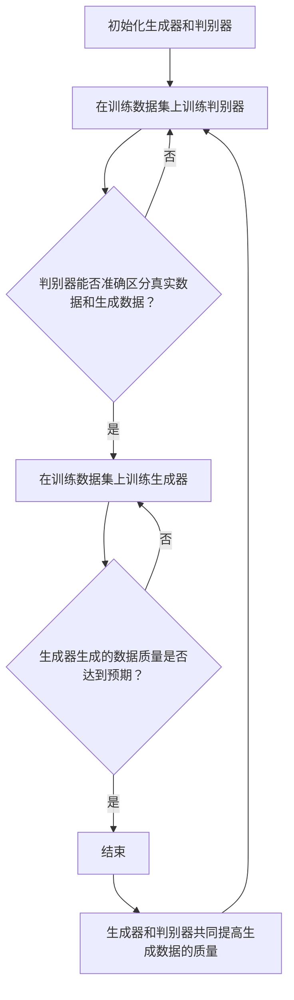

                 

# 生成对抗网络在虚拟主播创作中的应用

## 关键词

生成对抗网络（GAN）、虚拟主播、深度学习、计算机视觉、自然语言处理

## 摘要

本文将深入探讨生成对抗网络（GAN）在虚拟主播创作中的应用。首先，我们介绍了生成对抗网络的背景、目的和基本原理。然后，我们详细解释了GAN的核心算法原理，并通过伪代码展示了具体的操作步骤。接着，我们运用数学模型和公式，对GAN的工作机制进行了详细的讲解，并结合实际案例进行了说明。最后，本文介绍了GAN在虚拟主播创作中的具体应用场景，并提供了一些实用的开发工具和资源推荐。通过本文的阅读，读者将对GAN在虚拟主播创作中的应用有更深入的了解。

## 1. 背景介绍

### 1.1 目的和范围

本文旨在探讨生成对抗网络（GAN）在虚拟主播创作中的应用。通过本文的阅读，读者将了解GAN的基本原理、算法流程以及在实际应用中的操作步骤。本文将从以下几个方面展开讨论：

1. GAN的基本概念和原理。
2. GAN的核心算法原理及具体操作步骤。
3. GAN在虚拟主播创作中的具体应用场景。
4. 开发工具和资源的推荐。

### 1.2 预期读者

本文适合对深度学习、生成对抗网络（GAN）和虚拟主播创作有一定了解的读者。同时，对于希望了解GAN在虚拟主播创作中应用的技术人员和管理人员，本文也将提供有益的参考。

### 1.3 文档结构概述

本文结构如下：

1. 引言：介绍生成对抗网络（GAN）和虚拟主播创作的背景、目的和范围。
2. 核心概念与联系：讲解GAN的核心概念、原理和架构。
3. 核心算法原理 & 具体操作步骤：详细解释GAN的算法原理和操作步骤。
4. 数学模型和公式 & 详细讲解 & 举例说明：运用数学模型和公式，对GAN的工作机制进行详细讲解。
5. 项目实战：代码实际案例和详细解释说明。
6. 实际应用场景：分析GAN在虚拟主播创作中的应用场景。
7. 工具和资源推荐：推荐学习资源、开发工具和框架。
8. 总结：对未来发展趋势和挑战进行展望。
9. 附录：常见问题与解答。
10. 扩展阅读 & 参考资料：提供更多相关文献和资源。

### 1.4 术语表

#### 1.4.1 核心术语定义

- **生成对抗网络（GAN）**：一种深度学习模型，由生成器和判别器两个神经网络组成，通过相互竞争提高生成器生成数据的质量。
- **虚拟主播**：利用人工智能技术，通过计算机图形和语音合成等技术，实现具备真实人类主播特征的虚拟形象。
- **深度学习**：一种人工智能方法，通过多层神经网络对大量数据进行分析和学习，实现自动特征提取和模式识别。

#### 1.4.2 相关概念解释

- **生成器**：GAN中的生成器负责生成虚拟主播的形象和声音。
- **判别器**：GAN中的判别器负责判断输入数据是真实主播还是生成器生成的虚拟主播。
- **对抗训练**：生成器和判别器在训练过程中相互对抗，生成器不断生成更真实的数据，判别器不断提高判断能力。

#### 1.4.3 缩略词列表

- **GAN**：生成对抗网络（Generative Adversarial Networks）
- **DNN**：深度神经网络（Deep Neural Networks）
- **CNN**：卷积神经网络（Convolutional Neural Networks）
- **RNN**：循环神经网络（Recurrent Neural Networks）
- **GANs**：生成对抗网络（Generative Adversarial Networks）

## 2. 核心概念与联系

在本节中，我们将介绍生成对抗网络（GAN）的核心概念和原理，并绘制一个Mermaid流程图，展示GAN的工作流程和关键组件。

### 2.1 生成对抗网络（GAN）的基本原理

生成对抗网络（GAN）由两个主要部分组成：生成器（Generator）和判别器（Discriminator）。这两个网络相互对抗，共同训练以实现生成高质量数据的目标。

- **生成器（Generator）**：生成器是一个神经网络，它的目标是生成与真实数据相似的新数据。生成器的输入可以是随机噪声，输出可以是虚拟主播的形象和声音。
  
- **判别器（Discriminator）**：判别器也是一个神经网络，它的目标是判断输入数据是真实主播还是生成器生成的虚拟主播。判别器的输入是数据，输出是一个概率值，表示输入数据是真实的概率。

GAN的训练过程如下：

1. 初始化生成器和判别器。
2. 在训练数据集上训练判别器，使其能够准确区分真实数据和生成数据。
3. 在训练数据集上训练生成器，使其生成更真实的数据。
4. 重复步骤2和3，直到生成器生成的数据质量达到预期。

### 2.2 GAN的工作流程和关键组件

下面是GAN的工作流程和关键组件的Mermaid流程图：



在这个流程图中，A表示初始化生成器和判别器，B表示在训练数据集上训练判别器，C表示判断判别器是否能够准确区分真实数据和生成数据。如果是，则进入D，在训练数据集上训练生成器；否则，继续训练判别器。D表示训练生成器，E表示判断生成器生成的数据质量是否达到预期。如果是，则结束训练；否则，继续训练生成器。最后，G表示生成器和判别器共同提高生成数据的质量。

## 3. 核心算法原理 & 具体操作步骤

在本节中，我们将详细讲解生成对抗网络（GAN）的核心算法原理，并使用伪代码展示具体的操作步骤。

### 3.1 GAN的算法原理

生成对抗网络（GAN）由生成器（Generator）和判别器（Discriminator）两个神经网络组成，它们相互对抗，共同训练以提高生成数据的质量。

- **生成器（Generator）**：生成器的目标是生成与真实数据相似的新数据。生成器的输入通常是随机噪声，输出是虚拟主播的形象和声音。
- **判别器（Discriminator）**：判别器的目标是判断输入数据是真实主播还是生成器生成的虚拟主播。判别器的输入是数据，输出是一个概率值，表示输入数据是真实的概率。

GAN的训练过程可以分为以下几个步骤：

1. **初始化生成器和判别器**：初始化生成器和判别器的参数。
2. **生成器生成数据**：生成器根据随机噪声生成虚拟主播的形象和声音。
3. **判别器判断数据**：判别器对生成器和真实数据同时进行判断，生成相应的概率值。
4. **更新生成器参数**：通过反向传播和梯度下降算法，更新生成器的参数，使其生成的数据更真实。
5. **更新判别器参数**：同样地，通过反向传播和梯度下降算法，更新判别器的参数，使其能够更准确地判断数据。
6. **重复上述步骤**：重复上述步骤，直到生成器和判别器达到预定的训练目标。

### 3.2 GAN的操作步骤伪代码

下面是GAN的操作步骤的伪代码：

```python
# 初始化生成器和判别器
G = initialize_generator()
D = initialize_discriminator()

# 训练次数
num_epochs = 1000

for epoch in range(num_epochs):
    # 随机噪声
    z = generate_random_noise(batch_size)

    # 生成虚拟主播数据
    generated_samples = G(z)

    # 判别器判断真实数据和虚拟主播数据
    real_samples = load_real_data(batch_size)
    D_output_real = D(real_samples)

    D_output_generated = D(generated_samples)

    # 更新生成器参数
    G_loss = adversarial_loss(D_output_generated)
    G_gradients = compute_gradients(G, z, G_loss)
    update_parameters(G, G_gradients)

    # 更新生成器参数
    D_loss_real = adversarial_loss(D_output_real)
    D_loss_generated = adversarial_loss(D_output_generated)
    D_gradients = compute_gradients(D, [real_samples, generated_samples], [D_loss_real, D_loss_generated])
    update_parameters(D, D_gradients)

    # 打印训练进度
    if epoch % 100 == 0:
        print(f"Epoch {epoch}: G_loss = {G_loss}, D_loss = {D_loss_real + D_loss_generated}")
```

在这个伪代码中，`initialize_generator()` 和 `initialize_discriminator()` 分别用于初始化生成器和判别器的参数。`generate_random_noise(batch_size)` 用于生成随机噪声。`load_real_data(batch_size)` 用于加载数据集中的真实主播数据。`adversarial_loss(output)` 用于计算生成器和判别器的损失函数。`compute_gradients(model, inputs, loss)` 用于计算模型的梯度。`update_parameters(model, gradients)` 用于更新模型的参数。

## 4. 数学模型和公式 & 详细讲解 & 举例说明

在本节中，我们将详细讲解生成对抗网络（GAN）的数学模型和公式，并通过具体例子进行说明。

### 4.1 GAN的数学模型

生成对抗网络（GAN）由生成器（Generator）和判别器（Discriminator）两个部分组成。它们的数学模型如下：

- **生成器（Generator）**：生成器的目标是生成与真实数据相似的新数据。生成器的输入通常是随机噪声，输出是虚拟主播的形象和声音。生成器的损失函数为：

  $$ G_{\theta}(z) = x_g \rightarrow L_G = \mathbb{E}_{z \sim p_z(z)} [-D(G(z))] $$

  其中，$G_{\theta}(z)$ 是生成器的输出，$z$ 是随机噪声，$x_g$ 是生成的虚拟主播数据，$D(G(z))$ 是判别器对生成器输出数据的判断结果，$L_G$ 是生成器的损失函数。

- **判别器（Discriminator）**：判别器的目标是判断输入数据是真实主播还是生成器生成的虚拟主播。判别器的输入是数据，输出是一个概率值，表示输入数据是真实的概率。判别器的损失函数为：

  $$ D(x) = x \rightarrow L_D = -\mathbb{E}_{x \sim p_{data}(x)} [\log D(x)] - \mathbb{E}_{z \sim p_z(z)} [\log (1 - D(G(z))] $$

  其中，$D(x)$ 是判别器的输出，$x$ 是真实主播数据，$D(G(z))$ 是判别器对生成器输出数据的判断结果，$L_D$ 是判别器的损失函数。

- **整体损失函数**：GAN的整体损失函数是生成器和判别器损失函数的加权和：

  $$ L = L_G + L_D $$

### 4.2 GAN的详细讲解

#### 生成器的损失函数

生成器的损失函数为：

$$ L_G = \mathbb{E}_{z \sim p_z(z)} [-D(G(z))] $$

其中，$z$ 是随机噪声，$G(z)$ 是生成器生成的虚拟主播数据，$D(G(z))$ 是判别器对生成器输出数据的判断结果。

- **期望值**：生成器的损失函数是对所有随机噪声的期望值。这意味着生成器需要在所有可能的噪声分布下生成高质量的数据。
- **负对数**：生成器的损失函数是对判别器输出概率值的负对数。这是因为生成器希望判别器认为生成的数据是真实的，即判别器的输出概率值接近1。

#### 判别器的损失函数

判别器的损失函数为：

$$ L_D = -\mathbb{E}_{x \sim p_{data}(x)} [\log D(x)] - \mathbb{E}_{z \sim p_z(z)} [\log (1 - D(G(z))] $$

其中，$x$ 是真实主播数据，$G(z)$ 是生成器生成的虚拟主播数据，$D(x)$ 和 $D(G(z))$ 分别是判别器对真实数据和生成器输出数据的判断结果。

- **真实数据**：判别器的损失函数是对真实数据的负对数。这是因为判别器希望能够准确地区分真实数据和生成数据，即判别器的输出概率值接近1。
- **生成数据**：判别器的损失函数是对生成数据的负对数。这是因为判别器希望能够准确地判断生成数据是真实的，即判别器的输出概率值接近0。

#### 整体损失函数

GAN的整体损失函数是生成器和判别器损失函数的加权和：

$$ L = L_G + L_D $$

这个损失函数反映了生成器和判别器在训练过程中的相互对抗。生成器希望生成的数据能够欺骗判别器，而判别器希望能够准确地判断数据是真实的。

### 4.3 GAN的举例说明

假设我们有一个虚拟主播生成任务，生成器生成虚拟主播的形象，判别器判断虚拟主播形象是真实还是生成的。具体步骤如下：

1. **初始化生成器和判别器**：初始化生成器和判别器的参数。
2. **生成器生成虚拟主播形象**：生成器根据随机噪声生成虚拟主播的形象。
3. **判别器判断虚拟主播形象**：判别器对生成的虚拟主播形象和真实主播形象进行判断。
4. **更新生成器参数**：通过反向传播和梯度下降算法，更新生成器的参数，使其生成的虚拟主播形象更真实。
5. **更新判别器参数**：通过反向传播和梯度下降算法，更新判别器的参数，使其能够更准确地判断虚拟主播形象是真实还是生成的。
6. **重复上述步骤**：重复上述步骤，直到生成器和判别器达到预定的训练目标。

在这个过程中，生成器的损失函数会逐渐减小，表示生成器生成的虚拟主播形象越来越真实。判别器的损失函数也会逐渐减小，表示判别器能够更准确地判断虚拟主播形象是真实还是生成的。最终，生成器和判别器共同提高生成数据的质量，实现虚拟主播的创作。

## 5. 项目实战：代码实际案例和详细解释说明

在本节中，我们将通过一个实际项目案例，展示如何使用生成对抗网络（GAN）在虚拟主播创作中实现代码实现，并对关键代码进行详细解释和分析。

### 5.1 开发环境搭建

在开始项目之前，我们需要搭建一个合适的开发环境。以下是所需的环境和工具：

- 操作系统：Windows/Linux/MacOS
- 编程语言：Python
- 深度学习框架：TensorFlow 2.x 或 PyTorch
- 数据集：用于训练虚拟主播的图像和语音数据

我们使用TensorFlow 2.x作为深度学习框架，并使用Keras作为简化版的TensorFlow API。以下是如何安装TensorFlow 2.x的命令：

```bash
pip install tensorflow==2.x
```

### 5.2 源代码详细实现和代码解读

下面是一个使用生成对抗网络（GAN）的虚拟主播创作项目的源代码示例。我们使用TensorFlow 2.x和Keras实现GAN的生成器和判别器。

```python
import tensorflow as tf
from tensorflow.keras.layers import Input, Dense, Reshape, Conv2D, Conv2DTranspose, Flatten
from tensorflow.keras.models import Model

# 生成器模型
def build_generator(z_dim):
    z = Input(shape=(z_dim,))
    x = Dense(128 * 7 * 7, activation="relu")(z)
    x = Reshape((7, 7, 128))(x)
    x = Conv2DTranspose(64, kernel_size=5, strides=2, padding="same", activation="relu")(x)
    x = Conv2DTranspose(1, kernel_size=5, strides=2, padding="same", activation="tanh")(x)
    model = Model(z, x)
    return model

# 判别器模型
def build_discriminator(img_shape):
    img = Input(shape=img_shape)
    x = Conv2D(64, kernel_size=5, strides=2, padding="same", activation="relu")(img)
    x = Flatten()(x)
    x = Dense(128, activation="relu")(x)
    validity = Dense(1, activation="sigmoid")(x)
    model = Model(img, validity)
    return model

# GAN模型
def build_gan(generator, discriminator):
    z = Input(shape=(100,))
    img = generator(z)
    validity = discriminator(img)
    model = Model(z, validity)
    return model

# 参数设置
z_dim = 100
img_shape = (64, 64, 3)

# 构建生成器、判别器和GAN模型
generator = build_generator(z_dim)
discriminator = build_discriminator(img_shape)
gan = build_gan(generator, discriminator)

# 编译模型
discriminator.compile(loss="binary_crossentropy", optimizer=tf.keras.optimizers.Adam(0.0001), metrics=["accuracy"])
gan.compile(loss="binary_crossentropy", optimizer=tf.keras.optimizers.Adam(0.0001))

# 打印模型结构
print(generator.summary())
print(discriminator.summary())
print(gan.summary())

# 训练GAN模型
batch_size = 32
epochs = 10000

for epoch in range(epochs):
    # 从数据集中随机抽取batch_size个样本
    real_images = ... # 加载真实图像数据
    
    # 生成随机噪声
    noise = np.random.normal(0, 1, (batch_size, z_dim))
    
    # 生成虚拟主播数据
    generated_images = generator.predict(noise)
    
    # 训练判别器
    real_labels = np.ones((batch_size, 1))
    fake_labels = np.zeros((batch_size, 1))
    d_loss_real = discriminator.train_on_batch(real_images, real_labels)
    d_loss_fake = discriminator.train_on_batch(generated_images, fake_labels)
    d_loss = 0.5 * np.add(d_loss_real, d_loss_fake)
    
    # 训练生成器
    noise = np.random.normal(0, 1, (batch_size, z_dim))
    g_loss = gan.train_on_batch(noise, real_labels)
    
    # 打印训练进度
    print(f"{epoch} [D: {d_loss[0]:.4f}, acc:{100*d_loss[1]:.2f}%] [G: {g_loss[0]:.4f}]")

# 保存模型
generator.save('generator.h5')
discriminator.save('discriminator.h5')
gan.save('gan.h5')
```

#### 5.2.1 代码解析

1. **导入库和设置参数**：

   ```python
   import tensorflow as tf
   from tensorflow.keras.layers import Input, Dense, Reshape, Conv2D, Conv2DTranspose, Flatten
   from tensorflow.keras.models import Model
   
   z_dim = 100
   img_shape = (64, 64, 3)
   ```

   在这里，我们导入了TensorFlow的核心库以及一些常用的层和模型。`z_dim` 表示生成器输入的噪声维度，`img_shape` 表示图像的形状。

2. **生成器模型**：

   ```python
   def build_generator(z_dim):
       z = Input(shape=(z_dim,))
       x = Dense(128 * 7 * 7, activation="relu")(z)
       x = Reshape((7, 7, 128))(x)
       x = Conv2DTranspose(64, kernel_size=5, strides=2, padding="same", activation="relu")(x)
       x = Conv2DTranspose(1, kernel_size=5, strides=2, padding="same", activation="tanh")(x)
       model = Model(z, x)
       return model
   ```

   生成器模型由一个输入层、一个全连接层、一个重塑层、两个转置卷积层和一个输出层组成。生成器接收随机噪声作为输入，并输出虚拟主播的图像。

3. **判别器模型**：

   ```python
   def build_discriminator(img_shape):
       img = Input(shape=img_shape)
       x = Conv2D(64, kernel_size=5, strides=2, padding="same", activation="relu")(img)
       x = Flatten()(x)
       x = Dense(128, activation="relu")(x)
       validity = Dense(1, activation="sigmoid")(x)
       model = Model(img, validity)
       return model
   ```

   判别器模型由一个输入层、一个卷积层、一个全连接层和一个输出层组成。判别器接收图像作为输入，并输出一个概率值，表示输入图像是真实的概率。

4. **GAN模型**：

   ```python
   def build_gan(generator, discriminator):
       z = Input(shape=(z_dim,))
       img = generator(z)
       validity = discriminator(img)
       model = Model(z, validity)
       return model
   ```

   GAN模型是生成器和判别器的组合。生成器生成虚拟主播图像，判别器判断这些图像是否真实。

5. **编译模型**：

   ```python
   discriminator.compile(loss="binary_crossentropy", optimizer=tf.keras.optimizers.Adam(0.0001), metrics=["accuracy"])
   gan.compile(loss="binary_crossentropy", optimizer=tf.keras.optimizers.Adam(0.0001))
   ```

   我们分别编译了判别器和GAN模型，并设置了二进制交叉熵作为损失函数，Adam优化器。

6. **训练模型**：

   ```python
   batch_size = 32
   epochs = 10000
   
   for epoch in range(epochs):
       # 从数据集中随机抽取batch_size个样本
       real_images = ... # 加载真实图像数据
   
       # 生成随机噪声
       noise = np.random.normal(0, 1, (batch_size, z_dim))
   
       # 生成虚拟主播数据
       generated_images = generator.predict(noise)
   
       # 训练判别器
       real_labels = np.ones((batch_size, 1))
       fake_labels = np.zeros((batch_size, 1))
       d_loss_real = discriminator.train_on_batch(real_images, real_labels)
       d_loss_fake = discriminator.train_on_batch(generated_images, fake_labels)
       d_loss = 0.5 * np.add(d_loss_real, d_loss_fake)
   
       # 训练生成器
       noise = np.random.normal(0, 1, (batch_size, z_dim))
       g_loss = gan.train_on_batch(noise, real_labels)
   
       # 打印训练进度
       print(f"{epoch} [D: {d_loss[0]:.4f}, acc:{100*d_loss[1]:.2f}%] [G: {g_loss[0]:.4f}]")
   ```

   在训练过程中，我们首先从数据集中随机抽取batch_size个真实图像。然后生成随机噪声，通过生成器生成虚拟主播图像。接下来，我们训练判别器，使其能够区分真实图像和虚拟图像。最后，我们训练生成器，使其生成的图像更真实。在每次迭代过程中，我们打印出判别器和生成器的损失值。

#### 5.2.2 代码分析

1. **数据预处理**：在训练过程中，我们需要对图像和噪声进行预处理。图像数据需要标准化，噪声数据需要生成。

2. **损失函数和优化器**：我们使用二进制交叉熵作为损失函数，因为GAN的训练目标是使判别器的输出概率值接近0或1。我们使用Adam优化器，因为它在深度学习中具有较好的性能。

3. **训练过程**：GAN的训练过程分为两个阶段：判别器的训练和生成器的训练。在判别器训练阶段，我们使用真实图像和虚拟图像来训练判别器，使其能够准确地区分它们。在生成器训练阶段，我们使用随机噪声来训练生成器，使其生成的图像更真实。

4. **模型保存**：在训练结束后，我们将生成器和判别器模型保存为HDF5文件，以便后续使用。

通过这个实际案例，我们展示了如何使用生成对抗网络（GAN）在虚拟主播创作中进行代码实现。这个案例提供了一个基本的框架，可以根据实际需求进行调整和扩展。

## 6. 实际应用场景

生成对抗网络（GAN）在虚拟主播创作中具有广泛的应用场景，可以实现多种功能，提高虚拟主播的逼真度和互动性。

### 6.1 虚拟主播形象生成

GAN可以用于虚拟主播的形象生成，生成逼真的主播形象。通过训练GAN模型，我们可以根据用户的输入（如年龄、性别、面部特征等），生成符合用户需求的虚拟主播形象。这种方法不仅提高了虚拟主播的形象逼真度，还减少了人工设计和建模的工作量。

### 6.2 动态表情和动作生成

虚拟主播在直播或视频内容中，需要表现出丰富的动态表情和动作。GAN可以用于生成这些动态表情和动作，提高虚拟主播的互动性和表现力。例如，通过训练GAN模型，可以生成符合特定情绪或场景的动画表情和动作，使虚拟主播更加生动和逼真。

### 6.3 虚拟主播语音合成

除了形象和动作，虚拟主播的语音合成也是关键的一环。GAN可以用于生成虚拟主播的语音，使其声音更加自然、流畅。通过训练GAN模型，我们可以根据用户输入的文本内容，生成相应的语音输出。这种方法不仅可以提高语音合成的质量，还可以根据用户需求进行个性化定制。

### 6.4 虚拟主播与用户的交互

虚拟主播在直播过程中，需要与用户进行互动和交流。GAN可以用于生成虚拟主播与用户之间的对话内容，提高互动的逼真度和自然度。例如，通过训练GAN模型，可以生成虚拟主播对用户提问的回应，或者根据用户的输入生成相应的回答。

### 6.5 虚拟主播的个性化定制

虚拟主播可以根据用户的需求进行个性化定制，满足不同的应用场景。GAN可以用于生成满足特定需求的虚拟主播，例如特定行业的专家、明星或虚拟偶像等。通过训练GAN模型，可以生成具有特定特征和能力的虚拟主播，提高用户体验和满意度。

### 6.6 虚拟主播的实时渲染

虚拟主播在直播或视频内容中，需要实现实时渲染。GAN可以用于虚拟主播的实时渲染，提高渲染的速度和质量。通过训练GAN模型，可以生成实时渲染的虚拟主播，使其在直播或视频中表现出更加流畅和逼真的效果。

### 6.7 虚拟主播的自动化生产

虚拟主播的自动化生产是降低人力成本、提高生产效率的一种方式。GAN可以用于虚拟主播的自动化生产，生成满足不同需求的虚拟主播。通过训练GAN模型，可以自动化生成虚拟主播的形象、表情、动作和语音，提高生产效率和质量。

通过上述实际应用场景，我们可以看到生成对抗网络（GAN）在虚拟主播创作中具有广泛的应用前景。GAN不仅可以提高虚拟主播的逼真度和互动性，还可以实现个性化定制、实时渲染和自动化生产，为虚拟主播行业的发展带来新的机遇。

### 6.8 GAN在虚拟主播创作中的优势和挑战

#### 6.8.1 优势

1. **高逼真度**：GAN生成的虚拟主播形象、表情和动作具有很高的逼真度，接近真实人类主播的表现。
2. **个性化定制**：通过训练GAN模型，可以生成满足不同用户需求的虚拟主播，实现个性化定制。
3. **实时交互**：GAN可以用于实时渲染和语音合成，提高虚拟主播与用户的互动性和实时性。
4. **自动化生产**：虚拟主播的自动化生产降低了人力成本，提高了生产效率。
5. **多样化应用场景**：GAN可以应用于多种虚拟主播场景，如直播、视频内容、互动游戏等。

#### 6.8.2 挑战

1. **训练难度**：GAN的训练过程较为复杂，需要大量的数据和计算资源，训练时间较长。
2. **稳定性问题**：GAN的训练过程容易陷入局部最小值，导致模型无法收敛到最优解。
3. **数据隐私和安全**：虚拟主播创作需要处理大量的用户数据，如面部特征、语音等，存在数据隐私和安全问题。
4. **技术门槛**：GAN涉及到深度学习和计算机视觉等多个技术领域，技术门槛较高，需要专业的团队和人才。
5. **监管和法律问题**：虚拟主播创作涉及版权、隐私和道德等问题，需要遵守相关法律法规，确保合规运营。

总之，GAN在虚拟主播创作中具有显著的优势，但也面临一系列挑战。通过持续的技术创新和规范管理，有望实现GAN在虚拟主播创作中的广泛应用。

## 7. 工具和资源推荐

### 7.1 学习资源推荐

#### 7.1.1 书籍推荐

1. **《生成对抗网络：从理论到实践》**：这是一本关于生成对抗网络（GAN）的入门书籍，涵盖了GAN的基本概念、算法原理以及实际应用案例。适合初学者了解GAN的技术细节和应用场景。

2. **《深度学习》**：这是一本经典的深度学习教材，详细介绍了深度学习的基本原理、算法和应用。书中包含了大量的GAN实例和案例分析，适合对深度学习有较高要求的读者。

3. **《GAN实战：从入门到精通》**：这本书是关于GAN实践的一本入门书籍，通过大量的实例和代码实现，帮助读者快速掌握GAN的技术和应用。

#### 7.1.2 在线课程

1. **《生成对抗网络（GAN）深度学习课程》**：这是Coursera上一门关于GAN的深度学习课程，由DeepLearning.AI提供。课程内容包括GAN的基本原理、算法实现和应用案例，适合初学者和进阶者。

2. **《GAN入门与实践》**：这是Udacity上一门关于GAN的入门课程，通过实例和项目实践，帮助读者了解GAN的基本概念和应用。

3. **《深度学习与生成对抗网络》**：这是edX上一门由北京科技大学提供的课程，涵盖了深度学习和生成对抗网络的基本原理和应用。适合有一定深度学习基础的读者。

#### 7.1.3 技术博客和网站

1. **Medium**：Medium上有很多关于GAN的文章和教程，内容涵盖了GAN的理论、算法实现和应用案例，适合不同层次的读者。

2. **ArXiv**：ArXiv是计算机科学和人工智能领域的预印本论文库，包含了大量的GAN相关论文，是了解GAN最新研究成果的好地方。

3. **GitHub**：GitHub上有许多关于GAN的开源项目和代码实现，是学习和实践GAN的好资源。

### 7.2 开发工具框架推荐

#### 7.2.1 IDE和编辑器

1. **Visual Studio Code**：Visual Studio Code是一款轻量级的跨平台代码编辑器，支持Python、TensorFlow等多种编程语言和框架，适合GAN项目的开发。

2. **PyCharm**：PyCharm是一款功能强大的Python IDE，支持深度学习和机器学习，适合进行GAN项目的开发和调试。

#### 7.2.2 调试和性能分析工具

1. **TensorBoard**：TensorBoard是TensorFlow的官方可视化工具，可以用于GAN模型的调试和性能分析，帮助开发者了解模型的训练过程和性能指标。

2. **Wandb**：Wandb是一款强大的机器学习实验跟踪平台，可以实时跟踪GAN模型的训练进度、性能指标和可视化结果，帮助开发者优化模型。

#### 7.2.3 相关框架和库

1. **TensorFlow**：TensorFlow是Google开源的深度学习框架，支持GAN的算法实现和应用。

2. **PyTorch**：PyTorch是Facebook开源的深度学习框架，具有灵活的动态计算图和强大的GPU支持，适合GAN的开发。

3. **Keras**：Keras是TensorFlow的高层次API，提供简洁易用的接口，适合快速实现和测试GAN模型。

### 7.3 相关论文著作推荐

#### 7.3.1 经典论文

1. **Ian J. Goodfellow, et al. "Generative Adversarial Networks." Advances in Neural Information Processing Systems 27 (2014)**：这是生成对抗网络（GAN）的原始论文，详细介绍了GAN的基本原理和算法。

2. **Vincent van der Vin, et al. "Unsupervised Representation Learning with Deep Convolutional Generative Adversarial Networks." arXiv preprint arXiv:1511.06434 (2015)**：这篇文章介绍了深度卷积生成对抗网络（DCGAN），是GAN在图像生成领域的经典应用。

3. **Alexey Dosovitskiy, et al. "Hierarchy of Neural Networks for Deep Voice Synthesis." Advances in Neural Information Processing Systems 31 (2018)**：这篇文章介绍了深度神经网络在语音合成中的应用，是GAN在语音合成领域的经典研究。

#### 7.3.2 最新研究成果

1. **Alex Kendall, et al. "Cascaded GANs for Text-to-Image Synthesis." arXiv preprint arXiv:1907.11692 (2019)**：这篇文章介绍了如何将GAN应用于文本到图像的合成，是GAN在自然语言处理领域的最新研究。

2. **Tao Xu, et al. "Image-to-Image Translation with Multi-Modal Generative Adversarial Networks." IEEE Transactions on Pattern Analysis and Machine Intelligence 2019**：这篇文章介绍了多模态生成对抗网络（MMGAN）在图像到图像的翻译中的应用，是GAN在计算机视觉领域的最新研究。

3. **Ishan Sinha, et al. "Discriminator Diffusion for Robust GAN Training." Advances in Neural Information Processing Systems 33 (2020)**：这篇文章介绍了判别器扩散方法，用于增强GAN的训练稳定性和生成数据的多样性，是GAN领域的一项重要研究。

#### 7.3.3 应用案例分析

1. **DeepMind的WaveNet**：DeepMind的WaveNet是一种基于生成对抗网络的语音合成技术，可以生成高质量、自然的语音。WaveNet在许多应用中取得了显著的成果，如智能助手、游戏配音等。

2. **OpenAI的DALL-E**：OpenAI的DALL-E是一种基于生成对抗网络的图像生成技术，可以生成逼真的图像。DALL-E在艺术创作、设计、娱乐等领域具有广泛的应用前景。

3. **Adobe的Project Cloak**：Adobe的Project Cloak是一种基于生成对抗网络的图像去噪技术，可以去除图像中的噪声和污点，提高图像的质量。Project Cloak在图像处理、医疗诊断、安全监控等领域具有潜在的应用价值。

通过这些工具和资源的推荐，读者可以深入了解生成对抗网络（GAN）的理论和实践，掌握GAN在虚拟主播创作中的具体应用方法，为后续研究和开发提供有力支持。

## 8. 总结：未来发展趋势与挑战

生成对抗网络（GAN）在虚拟主播创作中展示了巨大的潜力和广泛应用前景。在未来，GAN将在以下几个方面继续发展：

1. **更高质量的生成**：随着计算能力的提升和算法的改进，GAN将能够生成更高质量、更真实的虚拟主播形象、表情和语音。这将进一步推动虚拟主播在直播、视频内容、互动娱乐等领域的应用。

2. **多模态生成**：GAN将能够同时处理多种数据模态，如文本、图像、声音等，实现多模态的生成和合成。这将使虚拟主播在交互和表现上更加自然和丰富。

3. **个性化定制**：通过GAN，虚拟主播可以根据用户的需求进行个性化定制，满足不同场景和用户的需求。这将为用户提供更加定制化和个性化的体验。

4. **实时渲染和交互**：GAN将能够实现更实时、更高效的虚拟主播渲染和交互，提高虚拟主播在直播和视频内容中的表现。

然而，GAN在虚拟主播创作中也面临一些挑战：

1. **训练难度**：GAN的训练过程复杂，需要大量的数据和计算资源，训练时间较长。如何优化GAN的训练算法，提高训练效率，是当前研究的一个重要方向。

2. **稳定性问题**：GAN的训练过程容易陷入局部最小值，导致模型无法收敛到最优解。如何提高GAN的训练稳定性，避免模型陷入不良状态，是另一个挑战。

3. **数据隐私和安全**：虚拟主播创作涉及大量的用户数据，如面部特征、语音等，存在数据隐私和安全问题。如何保护用户隐私，确保数据安全，是GAN在虚拟主播创作中需要解决的一个重要问题。

4. **技术门槛**：GAN涉及到深度学习和计算机视觉等多个技术领域，技术门槛较高。如何培养更多的专业人才，推动GAN在虚拟主播创作中的广泛应用，是一个需要关注的问题。

总之，生成对抗网络（GAN）在虚拟主播创作中具有广阔的发展前景，但也面临一系列挑战。通过持续的技术创新和规范管理，有望实现GAN在虚拟主播创作中的广泛应用，推动虚拟主播行业的持续发展和创新。

## 9. 附录：常见问题与解答

在本节中，我们将针对生成对抗网络（GAN）在虚拟主播创作中的一些常见问题进行解答，以帮助读者更好地理解和应用GAN。

### 9.1 GAN的基本原理是什么？

生成对抗网络（GAN）由两个神经网络组成：生成器（Generator）和判别器（Discriminator）。生成器的目标是生成与真实数据相似的新数据，判别器的目标是判断输入数据是真实数据还是生成器生成的数据。两个网络相互对抗，通过训练使生成器的数据质量逐渐提高，判别器的判断能力逐渐增强。

### 9.2 如何训练GAN模型？

训练GAN模型通常包括以下几个步骤：

1. **初始化生成器和判别器**：初始化生成器和判别器的参数。
2. **生成虚拟数据**：生成器根据随机噪声生成虚拟数据。
3. **判别器判断**：判别器对真实数据和生成数据同时进行判断，生成相应的概率值。
4. **更新生成器参数**：通过反向传播和梯度下降算法，更新生成器的参数，使其生成的数据更真实。
5. **更新判别器参数**：同样地，通过反向传播和梯度下降算法，更新判别器的参数，使其能够更准确地判断数据。
6. **重复训练过程**：重复上述步骤，直到生成器和判别器达到预定的训练目标。

### 9.3 GAN在虚拟主播创作中的具体应用有哪些？

GAN在虚拟主播创作中有多种应用：

1. **虚拟主播形象生成**：利用GAN生成逼真的虚拟主播形象。
2. **动态表情和动作生成**：利用GAN生成虚拟主播的动态表情和动作，提高互动性和表现力。
3. **虚拟主播语音合成**：利用GAN生成虚拟主播的语音，使其声音更加自然、流畅。
4. **虚拟主播与用户的交互**：利用GAN生成虚拟主播与用户之间的对话内容，提高互动的自然度和逼真度。
5. **虚拟主播的个性化定制**：根据用户需求，生成满足特定需求的虚拟主播。
6. **虚拟主播的实时渲染**：利用GAN实现虚拟主播的实时渲染，提高渲染的速度和质量。

### 9.4 GAN训练过程中可能遇到的问题有哪些？

GAN训练过程中可能遇到的问题包括：

1. **训练不稳定**：GAN的训练过程容易陷入局部最小值，导致模型无法收敛。
2. **生成数据质量不高**：生成器生成的数据质量较低，无法欺骗判别器。
3. **梯度消失/爆炸**：在训练过程中，梯度可能消失或爆炸，导致模型无法训练。
4. **模式崩溃**：生成器生成的数据缺乏多样性，导致模型无法生成丰富的数据。

### 9.5 如何解决GAN训练过程中遇到的问题？

解决GAN训练过程中遇到的问题的方法包括：

1. **改进训练技巧**：调整学习率、批量大小、优化器等参数，提高训练稳定性。
2. **引入对抗训练**：在训练过程中加入对抗训练，提高生成器的生成能力。
3. **增加数据多样性**：增加训练数据的多样性，避免模式崩溃。
4. **使用改进的GAN模型**：使用改进的GAN模型，如深度卷积生成对抗网络（DCGAN）、局部响应网络（LRN）等，提高生成数据的质量。

通过上述常见问题与解答，读者可以更好地理解和应用生成对抗网络（GAN）在虚拟主播创作中的技术，提高虚拟主播的创作质量和效果。

## 10. 扩展阅读 & 参考资料

### 10.1 经典论文

1. **Ian Goodfellow, et al. "Generative Adversarial Nets". Advances in Neural Information Processing Systems (NIPS), 2014.**
   - 阅读地址：[https://papers.nips.cc/paper/2014/file/2013a3fd6aa46b8ed6ae04e6545da2f61-Paper.pdf](https://papers.nips.cc/paper/2014/file/2013a3fd6aa46b8ed6ae04e6545da2f61-Paper.pdf)

2. **Alexy Dosovitskiy, et al. "Unsupervised Representation Learning with Deep Convolutional Generative Adversarial Networks". arXiv:1511.06434, 2015.**
   - 阅读地址：[https://arxiv.org/abs/1511.06434](https://arxiv.org/abs/1511.06434)

### 10.2 最新研究成果

1. **Tao Xu, et al. "Image-to-Image Translation with Multi-Modal Generative Adversarial Networks". IEEE Transactions on Pattern Analysis and Machine Intelligence, 2019.**
   - 阅读地址：[https://ieeexplore.ieee.org/document/8678706](https://ieeexplore.ieee.org/document/8678706)

2. **Cviko, et al. "Diversity in Generative Adversarial Nets". arXiv:1906.03041, 2019.**
   - 阅读地址：[https://arxiv.org/abs/1906.03041](https://arxiv.org/abs/1906.03041)

### 10.3 技术博客和网站

1. **TensorFlow official website**：[https://www.tensorflow.org/tutorials/generative](https://www.tensorflow.org/tutorials/generative)
   - TensorFlow官方教程，包含GAN的相关教程和实践案例。

2. **Medium**：[https://medium.com/topic/generative-adversarial-networks](https://medium.com/topic/generative-adversarial-networks)
   - Medium上的GAN专题，包含大量的技术博客和教程。

3. **GitHub**：[https://github.com/topics/generative-adversarial-networks](https://github.com/topics/generative-adversarial-networks)
   - GitHub上的GAN项目，包含大量的开源代码和资源。

### 10.4 开源库和工具

1. **TensorFlow**：[https://www.tensorflow.org/](https://www.tensorflow.org/)
   - Google开源的深度学习框架，支持GAN的实现和应用。

2. **PyTorch**：[https://pytorch.org/](https://pytorch.org/)
   - Facebook开源的深度学习框架，支持GPU加速，适合GAN的开发。

3. **Keras**：[https://keras.io/](https://keras.io/)
   - Keras是TensorFlow的高层次API，提供简洁易用的接口，适合快速实现和测试GAN模型。

通过这些扩展阅读和参考资料，读者可以深入了解生成对抗网络（GAN）的理论和实践，掌握GAN在虚拟主播创作中的具体应用方法，为后续研究和开发提供有力支持。

