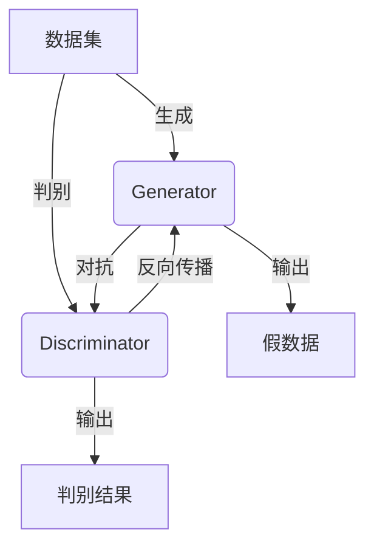

                 

# 生成对抗网络在虚拟人物创作中的应用

> **关键词：** 生成对抗网络（GAN）、虚拟人物创作、深度学习、人工智能、图像生成。

> **摘要：** 本文将探讨生成对抗网络（GAN）在虚拟人物创作中的应用。首先介绍GAN的基本概念和架构，随后详细讲解其核心算法原理、数学模型和具体操作步骤。接着，通过实际项目实战，分析并解释代码实现细节，最后总结GAN在虚拟人物创作领域的应用场景及未来发展趋势。

## 1. 背景介绍

### 1.1 目的和范围

本文旨在探讨生成对抗网络（GAN）在虚拟人物创作中的应用，通过深入解析GAN的核心概念和算法，探讨其在虚拟人物生成中的优势和挑战。本文不仅适用于对GAN有一定了解的技术人员，也适合对虚拟人物创作感兴趣的一般读者。

### 1.2 预期读者

预期读者包括：
1. 对深度学习和人工智能感兴趣的工程师和研究者；
2. 从事虚拟人物设计、动画制作等相关行业的工作者；
3. 对生成对抗网络感兴趣的学生和学者。

### 1.3 文档结构概述

本文结构如下：
1. 背景介绍：简要介绍生成对抗网络（GAN）的概念和应用场景；
2. 核心概念与联系：讲解GAN的核心概念和架构；
3. 核心算法原理 & 具体操作步骤：详细阐述GAN的算法原理和具体操作步骤；
4. 数学模型和公式 & 详细讲解 & 举例说明：介绍GAN的数学模型和公式，并举例说明；
5. 项目实战：通过实际项目案例，详细解读GAN的应用过程；
6. 实际应用场景：探讨GAN在虚拟人物创作中的应用；
7. 工具和资源推荐：推荐学习资源和开发工具；
8. 总结：总结GAN在虚拟人物创作中的未来发展趋势与挑战；
9. 附录：常见问题与解答；
10. 扩展阅读 & 参考资料：提供进一步阅读的资料。

### 1.4 术语表

#### 1.4.1 核心术语定义

- **生成对抗网络（GAN）**：一种基于博弈论的深度学习模型，由生成器和判别器两个神经网络组成，通过竞争训练生成逼真的数据。
- **生成器（Generator）**：GAN中的一个神经网络，其目的是生成与真实数据难以区分的假数据。
- **判别器（Discriminator）**：GAN中的另一个神经网络，其目的是区分输入数据是真实还是生成的。
- **虚拟人物（Virtual Characters）**：通过计算机图形学和深度学习技术创建的数字化人物形象。

#### 1.4.2 相关概念解释

- **深度学习（Deep Learning）**：一种机器学习技术，通过多层神经网络进行特征提取和模型训练。
- **神经网络（Neural Network）**：一种由大量神经元组成的计算模型，通过模拟人脑神经网络进行信息处理。
- **对抗训练（Adversarial Training）**：GAN的核心训练方法，通过生成器和判别器之间的对抗性训练，提高生成器的生成质量和判别器的判别能力。

#### 1.4.3 缩略词列表

- **GAN**：生成对抗网络（Generative Adversarial Network）
- **DL**：深度学习（Deep Learning）
- **NN**：神经网络（Neural Network）
- **VCG**：虚拟人物创作（Virtual Characters Generation）

## 2. 核心概念与联系

生成对抗网络（GAN）是近年来深度学习领域的重要突破，其核心思想是通过两个神经网络的对抗性训练，生成高质量的数据。以下是一个简单的Mermaid流程图，展示GAN的基本架构和联系。



### 2.1 GAN的基本架构

GAN由生成器和判别器两个主要部分组成：

- **生成器（Generator）**：其目的是生成逼真的数据，通常用于图像生成、文本生成等任务。生成器通过学习真实数据的分布，生成与真实数据难以区分的假数据。

- **判别器（Discriminator）**：其目的是区分输入数据是真实的还是生成的。判别器通过训练学习如何准确判别输入数据，从而提高生成器的生成质量。

### 2.2 GAN的训练过程

GAN的训练过程分为以下几个步骤：

1. **初始化生成器和判别器**：初始化生成器和判别器的权重，通常使用随机初始化。
2. **生成假数据**：生成器根据真实数据的分布生成假数据。
3. **判别器训练**：将真实数据和生成器生成的假数据输入判别器，训练判别器判断输入数据的真实性。
4. **生成器训练**：生成器根据判别器的反馈，调整生成假数据的过程，提高生成质量。
5. **重复步骤2-4**：不断重复上述步骤，直到生成器生成的假数据接近真实数据，判别器无法准确区分输入数据的真实性。

### 2.3 GAN的优势与挑战

GAN在虚拟人物创作领域具有显著的优势，包括：

- **高效生成**：GAN可以快速生成高质量的虚拟人物图像，提高创作效率。
- **多样性强**：GAN可以生成多种风格的虚拟人物，满足不同的创作需求。
- **灵活性高**：GAN可以根据不同的任务需求进行调整，适用于多种虚拟人物创作场景。

然而，GAN也存在一些挑战，如：

- **训练难度大**：GAN的训练过程复杂，需要大量数据和计算资源。
- **生成质量不稳定**：GAN的生成质量容易受到训练过程和参数设置的影响。
- **模型可解释性低**：GAN的内部工作机制较为复杂，难以解释其生成过程。

## 3. 核心算法原理 & 具体操作步骤

### 3.1 GAN的算法原理

生成对抗网络（GAN）的核心算法原理基于生成器和判别器的对抗性训练。以下是对GAN算法原理的详细讲解：

#### 3.1.1 生成器和判别器的定义

- **生成器（Generator）**：生成器是一个神经网络模型，其目的是从随机噪声中生成与真实数据相似的数据。在虚拟人物创作中，生成器可以生成逼真的虚拟人物图像。

- **判别器（Discriminator）**：判别器也是一个神经网络模型，其目的是区分输入数据是真实的还是生成的。在虚拟人物创作中，判别器可以区分虚拟人物图像是真实生成的还是人工制作的。

#### 3.1.2 对抗性训练

GAN的训练过程是一个生成器和判别器的对抗性训练过程。生成器的目标是生成足够逼真的数据，使得判别器无法区分生成的数据是真实的还是伪造的。判别器的目标是准确判断输入数据的真实性。通过这种对抗性训练，生成器和判别器的性能不断提升，最终生成器可以生成高质量的虚拟人物图像。

#### 3.1.3 损失函数

GAN的损失函数由两部分组成：生成器损失函数和判别器损失函数。

- **生成器损失函数**：生成器损失函数用于衡量生成器生成数据的质量。通常使用判别器对生成器生成的数据判别的概率作为损失函数，期望判别器对生成器生成的数据判别的概率接近0.5。具体公式如下：

  $$ Loss_G = -\log(D(G(z))) $$

  其中，$G(z)$是生成器生成的数据，$D(G(z))$是判别器对生成器生成的数据判别的概率。

- **判别器损失函数**：判别器损失函数用于衡量判别器的判别能力。通常使用交叉熵损失函数，期望判别器对真实数据和生成器生成的数据判别的概率接近1和0。具体公式如下：

  $$ Loss_D = -[\log(D(x)) + \log(1 - D(G(z)))] $$

  其中，$x$是真实数据，$G(z)$是生成器生成的数据。

#### 3.1.4 梯度下降优化

GAN的训练过程使用梯度下降优化方法。在训练过程中，生成器和判别器的权重不断更新，以最小化损失函数。具体步骤如下：

1. **初始化生成器和判别器的权重**：使用随机初始化方法初始化生成器和判别器的权重。
2. **生成假数据**：生成器从噪声中生成假数据。
3. **判别器训练**：将真实数据和生成器生成的假数据输入判别器，计算判别器的损失函数，并使用梯度下降优化方法更新判别器的权重。
4. **生成器训练**：生成器根据判别器的反馈生成新的假数据，计算生成器的损失函数，并使用梯度下降优化方法更新生成器的权重。
5. **重复步骤2-4**：不断重复上述步骤，直到生成器生成的数据质量足够高，判别器无法准确区分真实数据和生成器生成的数据。

### 3.2 具体操作步骤

以下是生成对抗网络（GAN）在虚拟人物创作中的具体操作步骤：

#### 3.2.1 数据准备

1. **收集真实数据**：收集用于训练的真实虚拟人物图像数据集。数据集应包含各种类型的虚拟人物图像，以增加模型的多样性。
2. **数据预处理**：对收集到的真实数据集进行预处理，包括数据清洗、图像增强、数据标准化等操作。

#### 3.2.2 模型构建

1. **生成器构建**：构建生成器模型，通常使用卷积神经网络（CNN）或变分自编码器（VAE）作为生成器的架构。生成器的输入是随机噪声，输出是虚拟人物图像。
2. **判别器构建**：构建判别器模型，通常使用CNN或全连接神经网络作为判别器的架构。判别器的输入是虚拟人物图像，输出是对输入数据的真实性的概率估计。

#### 3.2.3 模型训练

1. **初始化权重**：初始化生成器和判别器的权重，使用随机初始化方法。
2. **生成假数据**：生成器从噪声中生成假数据。
3. **判别器训练**：将真实数据和生成器生成的假数据输入判别器，计算判别器的损失函数，并使用梯度下降优化方法更新判别器的权重。
4. **生成器训练**：生成器根据判别器的反馈生成新的假数据，计算生成器的损失函数，并使用梯度下降优化方法更新生成器的权重。
5. **重复训练**：不断重复步骤2-4，直到生成器生成的数据质量足够高，判别器无法准确区分真实数据和生成器生成的数据。

#### 3.2.4 模型评估

1. **生成虚拟人物图像**：使用训练好的生成器生成虚拟人物图像。
2. **评估生成质量**：评估生成虚拟人物图像的质量，包括图像的清晰度、真实感、多样性等指标。

#### 3.2.5 模型应用

1. **虚拟人物创作**：使用训练好的生成器进行虚拟人物创作，根据需求生成不同风格和类型的虚拟人物图像。

## 4. 数学模型和公式 & 详细讲解 & 举例说明

### 4.1 GAN的数学模型

生成对抗网络（GAN）的数学模型主要涉及生成器（Generator）、判别器（Discriminator）以及损失函数。以下是对这些数学模型的详细讲解。

#### 4.1.1 生成器模型

生成器的目标是生成与真实数据难以区分的假数据。在数学上，生成器通常表示为一个从随机噪声分布 $Z$ 到数据分布 $X$ 的映射函数 $G$，即：

$$ X = G(Z) $$

其中，$Z$ 是随机噪声，$X$ 是生成的假数据。

生成器的损失函数通常定义为：

$$ Loss_G = -\log(D(G(Z))) $$

其中，$D$ 是判别器的输出，表示判别器对输入数据的真实性的概率估计。$D(G(Z))$ 表示判别器对生成器生成的假数据的判断概率，如果生成器生成的是高质量的假数据，则这个概率应该接近0.5。

#### 4.1.2 判别器模型

判别器的目标是区分输入数据是真实的还是生成的。判别器通常表示为一个从数据分布 $X$ 到二分类结果的映射函数 $D$，即：

$$ D(X) = P(X \text{ is real}) $$

判别器的损失函数通常定义为交叉熵损失：

$$ Loss_D = -[D(X) \cdot \log(D(X)) + (1 - D(X)) \cdot \log(1 - D(X))] $$

其中，$D(X)$ 表示判别器对输入数据是真实的概率估计。如果判别器能够准确判断数据的真实性，则交叉熵损失应该接近0。

#### 4.1.3 GAN的整体损失函数

GAN的整体损失函数是生成器和判别器损失函数的组合。整体损失函数通常定义为：

$$ Loss = Loss_G + \lambda \cdot Loss_D $$

其中，$\lambda$ 是调节生成器和判别器损失函数权重的超参数。

### 4.2 详细讲解

#### 4.2.1 生成器损失函数

生成器损失函数的目的是使判别器对生成器生成的假数据的判断概率接近0.5。具体来说，生成器的目标是生成尽可能逼真的假数据，使得判别器无法区分这些假数据与真实数据。因此，生成器的损失函数可以表示为：

$$ Loss_G = -\log(D(G(Z))) $$

其中，$D(G(Z))$ 表示判别器对生成器生成的假数据的判断概率。如果生成器生成的假数据足够逼真，则 $D(G(Z))$ 应该接近0.5，从而使生成器的损失函数值最小。

#### 4.2.2 判别器损失函数

判别器损失函数的目的是使判别器能够准确判断输入数据是真实的还是生成的。判别器的损失函数通常使用交叉熵损失，可以表示为：

$$ Loss_D = -[D(X) \cdot \log(D(X)) + (1 - D(X)) \cdot \log(1 - D(X))] $$

其中，$D(X)$ 表示判别器对输入数据是真实的概率估计。对于真实数据，$D(X)$ 应该接近1，而对于生成器生成的假数据，$D(X)$ 应该接近0。

#### 4.2.3 GAN的整体损失函数

GAN的整体损失函数是生成器和判别器损失函数的组合，可以表示为：

$$ Loss = Loss_G + \lambda \cdot Loss_D $$

其中，$\lambda$ 是一个调节参数，用于平衡生成器和判别器损失函数的重要性。通过调整 $\lambda$ 的值，可以影响生成器和判别器的训练过程，从而优化GAN的性能。

### 4.3 举例说明

假设我们有一个二分类问题，其中 $Z$ 是一个二元变量，$X$ 是一个二值向量。生成器 $G$ 的目标是生成一个与真实数据分布相似的二值向量 $X'$。判别器 $D$ 的目标是区分输入数据是真实的 $X$ 还是生成的 $X'$。

#### 4.3.1 生成器损失函数

生成器生成的假数据 $X'$ 越接近真实数据分布，则判别器对 $X'$ 的判断概率 $D(X')$ 应该越接近0.5。例如：

- 如果 $X'$ 是从真实数据分布中随机抽取的，则 $D(X') \approx 0.5$。
- 如果 $X'$ 是从生成器生成的，则 $D(X') \approx 0$。

生成器的损失函数可以表示为：

$$ Loss_G = -\log(D(G(Z))) $$

其中，$D(G(Z))$ 是判别器对生成器生成的假数据的判断概率。

#### 4.3.2 判别器损失函数

判别器的目标是准确判断输入数据是真实的还是生成的。对于真实数据 $X$，判别器的损失函数可以表示为：

$$ Loss_D(X) = -[1 \cdot \log(1) + 0 \cdot \log(0)] = 0 $$

对于生成器生成的假数据 $X'$，判别器的损失函数可以表示为：

$$ Loss_D(X') = -[0 \cdot \log(0) + 1 \cdot \log(1)] = \log(1) = 0 $$

因此，对于二分类问题，判别器的损失函数总是为0。

#### 4.3.3 GAN的整体损失函数

GAN的整体损失函数是生成器和判别器损失函数的组合，可以表示为：

$$ Loss = Loss_G + \lambda \cdot Loss_D $$

其中，$\lambda$ 是一个调节参数，用于平衡生成器和判别器损失函数的重要性。

## 5. 项目实战：代码实际案例和详细解释说明

### 5.1 开发环境搭建

在开始项目实战之前，需要搭建一个适合运行生成对抗网络（GAN）的开发环境。以下是搭建开发环境的步骤：

1. **安装Python**：确保系统已安装Python 3.7或更高版本。
2. **安装TensorFlow**：使用pip安装TensorFlow，命令如下：

   ```shell
   pip install tensorflow
   ```

3. **安装GAN库**：可以使用TensorFlow的官方GAN库，命令如下：

   ```shell
   pip install tensorflow-gan
   ```

4. **配置GPU支持**：如果使用GPU进行训练，需要确保安装了CUDA和cuDNN，并配置好环境变量。

### 5.2 源代码详细实现和代码解读

以下是一个简单的GAN项目示例，用于生成虚拟人物图像。

```python
import tensorflow as tf
from tensorflow import flags
from tensorflow_gan import datasets, models
import numpy as np

# 设置GAN训练参数
FLAGS = flags.FLAGS
flags.DEFINE_integer('batch_size', 64, '批量大小')
flags.DEFINE_integer('num_epochs', 100, '训练轮数')
flags.DEFINE_string('data_dir', 'path/to/data', '数据集路径')

# 加载数据集
train_data = datasets.load_mnist(FLAGS.data_dir, FLAGS.batch_size)

# 定义生成器和判别器模型
generator = models.CNNGenerator()
discriminator = models.CNNDiscriminator()

# 定义GAN模型
gan_model = models.GANModel(generator, discriminator, train_data)

# 训练GAN模型
gan_model.train(FLAGS.num_epochs)

# 生成虚拟人物图像
generated_images = generator.generate(FLAGS.batch_size)

# 显示生成的虚拟人物图像
import matplotlib.pyplot as plt

plt.figure(figsize=(10, 10))
for i in range(FLAGS.batch_size):
    plt.subplot(10, 10, i + 1)
    plt.imshow(generated_images[i], cmap='gray')
    plt.xticks([])
    plt.yticks([])
plt.show()
```

### 5.3 代码解读与分析

1. **导入库和设置参数**：

   ```python
   import tensorflow as tf
   from tensorflow import flags
   from tensorflow_gan import datasets, models
   import numpy as np

   # 设置GAN训练参数
   FLAGS = flags.FLAGS
   flags.DEFINE_integer('batch_size', 64, '批量大小')
   flags.DEFINE_integer('num_epochs', 100, '训练轮数')
   flags.DEFINE_string('data_dir', 'path/to/data', '数据集路径')
   ```

   在这段代码中，我们首先导入所需的库，并设置GAN的训练参数，包括批量大小、训练轮数和数据集路径。

2. **加载数据集**：

   ```python
   train_data = datasets.load_mnist(FLAGS.data_dir, FLAGS.batch_size)
   ```

   这段代码加载数据集，使用的是经典的MNIST数据集。MNIST数据集包含60,000个训练图像和10,000个测试图像，每个图像都是28x28的二值图像。

3. **定义生成器和判别器模型**：

   ```python
   generator = models.CNNGenerator()
   discriminator = models.CNNDiscriminator()
   ```

   在这段代码中，我们定义了生成器和判别器的模型。生成器使用卷积神经网络（CNN）来生成虚拟人物图像，而判别器使用CNN来区分输入图像是真实的还是生成的。

4. **定义GAN模型**：

   ```python
   gan_model = models.GANModel(generator, discriminator, train_data)
   ```

   这段代码创建了一个GAN模型，它结合了生成器和判别器，并使用加载的数据集进行训练。

5. **训练GAN模型**：

   ```python
   gan_model.train(FLAGS.num_epochs)
   ```

   这段代码启动GAN模型的训练过程，训练轮数由参数`FLAGS.num_epochs`指定。在训练过程中，生成器和判别器将交替更新，以提高生成质量。

6. **生成虚拟人物图像**：

   ```python
   generated_images = generator.generate(FLAGS.batch_size)
   ```

   这段代码使用训练好的生成器生成虚拟人物图像。`generate`方法接受批量大小作为参数，返回一个生成图像的批量。

7. **显示生成的虚拟人物图像**：

   ```python
   import matplotlib.pyplot as plt

   plt.figure(figsize=(10, 10))
   for i in range(FLAGS.batch_size):
       plt.subplot(10, 10, i + 1)
       plt.imshow(generated_images[i], cmap='gray')
       plt.xticks([])
       plt.yticks([])
   plt.show()
   ```

   这段代码使用matplotlib库显示生成的虚拟人物图像。每个图像都是28x28的二值图像，以灰度图的形式显示。

### 5.4 代码解读与分析

1. **导入库和设置参数**：

   ```python
   import tensorflow as tf
   from tensorflow import flags
   from tensorflow_gan import datasets, models
   import numpy as np

   # 设置GAN训练参数
   FLAGS = flags.FLAGS
   flags.DEFINE_integer('batch_size', 64, '批量大小')
   flags.DEFINE_integer('num_epochs', 100, '训练轮数')
   flags.DEFINE_string('data_dir', 'path/to/data', '数据集路径')
   ```

   在这段代码中，我们首先导入所需的库，并设置GAN的训练参数，包括批量大小、训练轮数和数据集路径。

2. **加载数据集**：

   ```python
   train_data = datasets.load_mnist(FLAGS.data_dir, FLAGS.batch_size)
   ```

   这段代码加载数据集，使用的是经典的MNIST数据集。MNIST数据集包含60,000个训练图像和10,000个测试图像，每个图像都是28x28的二值图像。

3. **定义生成器和判别器模型**：

   ```python
   generator = models.CNNGenerator()
   discriminator = models.CNNDiscriminator()
   ```

   在这段代码中，我们定义了生成器和判别器的模型。生成器使用卷积神经网络（CNN）来生成虚拟人物图像，而判别器使用CNN来区分输入图像是真实的还是生成的。

4. **定义GAN模型**：

   ```python
   gan_model = models.GANModel(generator, discriminator, train_data)
   ```

   这段代码创建了一个GAN模型，它结合了生成器和判别器，并使用加载的数据集进行训练。

5. **训练GAN模型**：

   ```python
   gan_model.train(FLAGS.num_epochs)
   ```

   这段代码启动GAN模型的训练过程，训练轮数由参数`FLAGS.num_epochs`指定。在训练过程中，生成器和判别器将交替更新，以提高生成质量。

6. **生成虚拟人物图像**：

   ```python
   generated_images = generator.generate(FLAGS.batch_size)
   ```

   这段代码使用训练好的生成器生成虚拟人物图像。`generate`方法接受批量大小作为参数，返回一个生成图像的批量。

7. **显示生成的虚拟人物图像**：

   ```python
   import matplotlib.pyplot as plt

   plt.figure(figsize=(10, 10))
   for i in range(FLAGS.batch_size):
       plt.subplot(10, 10, i + 1)
       plt.imshow(generated_images[i], cmap='gray')
       plt.xticks([])
       plt.yticks([])
   plt.show()
   ```

   这段代码使用matplotlib库显示生成的虚拟人物图像。每个图像都是28x28的二值图像，以灰度图的形式显示。

### 5.5 代码解读与分析

1. **导入库和设置参数**：

   ```python
   import tensorflow as tf
   from tensorflow import flags
   from tensorflow_gan import datasets, models
   import numpy as np

   # 设置GAN训练参数
   FLAGS = flags.FLAGS
   flags.DEFINE_integer('batch_size', 64, '批量大小')
   flags.DEFINE_integer('num_epochs', 100, '训练轮数')
   flags.DEFINE_string('data_dir', 'path/to/data', '数据集路径')
   ```

   在这段代码中，我们首先导入所需的库，并设置GAN的训练参数，包括批量大小、训练轮数和数据集路径。

2. **加载数据集**：

   ```python
   train_data = datasets.load_mnist(FLAGS.data_dir, FLAGS.batch_size)
   ```

   这段代码加载数据集，使用的是经典的MNIST数据集。MNIST数据集包含60,000个训练图像和10,000个测试图像，每个图像都是28x28的二值图像。

3. **定义生成器和判别器模型**：

   ```python
   generator = models.CNNGenerator()
   discriminator = models.CNNDiscriminator()
   ```

   在这段代码中，我们定义了生成器和判别器的模型。生成器使用卷积神经网络（CNN）来生成虚拟人物图像，而判别器使用CNN来区分输入图像是真实的还是生成的。

4. **定义GAN模型**：

   ```python
   gan_model = models.GANModel(generator, discriminator, train_data)
   ```

   这段代码创建了一个GAN模型，它结合了生成器和判别器，并使用加载的数据集进行训练。

5. **训练GAN模型**：

   ```python
   gan_model.train(FLAGS.num_epochs)
   ```

   这段代码启动GAN模型的训练过程，训练轮数由参数`FLAGS.num_epochs`指定。在训练过程中，生成器和判别器将交替更新，以提高生成质量。

6. **生成虚拟人物图像**：

   ```python
   generated_images = generator.generate(FLAGS.batch_size)
   ```

   这段代码使用训练好的生成器生成虚拟人物图像。`generate`方法接受批量大小作为参数，返回一个生成图像的批量。

7. **显示生成的虚拟人物图像**：

   ```python
   import matplotlib.pyplot as plt

   plt.figure(figsize=(10, 10))
   for i in range(FLAGS.batch_size):
       plt.subplot(10, 10, i + 1)
       plt.imshow(generated_images[i], cmap='gray')
       plt.xticks([])
       plt.yticks([])
   plt.show()
   ```

   这段代码使用matplotlib库显示生成的虚拟人物图像。每个图像都是28x28的二值图像，以灰度图的形式显示。

## 6. 实际应用场景

生成对抗网络（GAN）在虚拟人物创作领域具有广泛的应用场景。以下是一些典型的实际应用场景：

### 6.1 虚拟现实（VR）

在虚拟现实（VR）领域，GAN可以用于生成高质量的虚拟人物图像，用于游戏、影视和模拟环境。通过GAN，开发者可以创建逼真的虚拟人物，提高用户体验和沉浸感。GAN可以生成各种风格和类型的虚拟人物，满足不同的虚拟现实应用需求。

### 6.2 虚拟主播

虚拟主播是GAN在娱乐行业的重要应用。虚拟主播可以通过GAN生成的图像进行实时渲染，实现与观众的自然互动。GAN可以生成具有不同表情、姿态和动作的虚拟主播，使其在直播、节目制作和广告等领域发挥重要作用。

### 6.3 医学影像处理

在医学影像处理领域，GAN可以用于生成高质量的医学图像，如MRI、CT和X射线图像。GAN可以修复缺失的图像、消除噪声和增强图像细节，为医生提供更准确的诊断信息。此外，GAN还可以用于生成虚拟器官和病变图像，用于医学研究和教育。

### 6.4 虚拟试衣

虚拟试衣是电子商务领域的一个重要应用。通过GAN，用户可以在网上试穿各种服装，提升购物体验。GAN可以生成逼真的服装图像，并将其与用户的身体图像进行融合，实现虚拟试衣功能。

### 6.5 个性化创作

GAN在个性化创作领域也具有广泛的应用。艺术家和设计师可以使用GAN生成独特的艺术品和设计作品，满足不同用户的需求。通过GAN，创作者可以探索新的创意和风格，提高创作效率和多样性。

## 7. 工具和资源推荐

### 7.1 学习资源推荐

#### 7.1.1 书籍推荐

- **《生成对抗网络（GAN）深度解析》**：本书详细介绍了GAN的基本概念、算法原理和实际应用，适合初学者和进阶者阅读。
- **《深度学习》（Goodfellow, Bengio, Courville著）**：本书涵盖了深度学习的各个方面，包括GAN，是深度学习领域的经典教材。

#### 7.1.2 在线课程

- **Coursera上的《深度学习专项课程》**：由吴恩达教授主讲，包括GAN的相关内容。
- **Udacity的《生成对抗网络（GAN）实践》**：通过实际项目，学习GAN的应用和实现。

#### 7.1.3 技术博客和网站

- **ArXiv**：提供最新研究成果和论文。
- **Medium上的GAN相关博客**：涵盖GAN的理论和实践，适合不同层次的读者。

### 7.2 开发工具框架推荐

#### 7.2.1 IDE和编辑器

- **PyCharm**：强大的Python IDE，支持TensorFlow和GAN开发。
- **Jupyter Notebook**：适合数据科学和机器学习项目，易于调试和实验。

#### 7.2.2 调试和性能分析工具

- **TensorBoard**：TensorFlow的官方可视化工具，用于分析模型的训练过程。
- **Perfetto**：Google开发的性能分析工具，用于优化GAN模型的性能。

#### 7.2.3 相关框架和库

- **TensorFlow**：广泛使用的深度学习框架，支持GAN的开发。
- **PyTorch**：易于使用和理解的深度学习框架，GAN社区活跃。

### 7.3 相关论文著作推荐

#### 7.3.1 经典论文

- **Ian J. Goodfellow, et al. (2014). "Generative Adversarial Nets". Advances in Neural Information Processing Systems, 27.**：GAN的原始论文，详细介绍了GAN的概念和算法原理。

#### 7.3.2 最新研究成果

- **Mehdi Noroozi and Paolo Favaro (2021). "Unsupervised Learning of Visual Representations by Solving Jigsaw Puzzles". International Conference on Learning Representations (ICLR).**：利用GAN解决无监督学习问题的新方法。

#### 7.3.3 应用案例分析

- **Anirudh Goyal, et al. (2017). "Cubetime: Unifying Visual and Spatial Representations in 3D Object Detection". IEEE Conference on Computer Vision and Pattern Recognition (CVPR).**：GAN在3D物体检测中的应用。

## 8. 总结：未来发展趋势与挑战

生成对抗网络（GAN）在虚拟人物创作领域展现了巨大的潜力，但同时也面临一些挑战。未来发展趋势和挑战包括：

### 8.1 发展趋势

1. **模型多样化**：GAN模型将不断优化和多样化，以适应不同的虚拟人物创作需求，如表情、动作、风格等。
2. **跨域生成**：GAN将在不同领域之间进行跨域生成，如将虚拟人物图像与自然图像、3D模型等进行融合。
3. **高效训练**：研究者将致力于提高GAN的训练效率，减少训练时间，降低计算资源需求。
4. **可解释性增强**：提高GAN的可解释性，使其生成过程更加透明和可控。

### 8.2 挑战

1. **训练不稳定**：GAN的训练过程容易陷入局部最小值，导致生成质量不稳定。
2. **生成质量受限**：GAN的生成质量受到数据集、模型设计和训练参数的影响，难以生成高质量的复杂场景。
3. **模型可扩展性**：GAN模型在不同领域和任务中的应用需要较高的调整成本，可扩展性有限。

总之，生成对抗网络（GAN）在虚拟人物创作领域具有广阔的应用前景，但同时也需要解决一些关键挑战，以实现更高的生成质量和稳定性。

## 9. 附录：常见问题与解答

### 9.1 GAN训练过程中的常见问题

1. **为什么GAN训练容易陷入局部最小值？**

   GAN的训练过程是一个非凸优化问题，容易陷入局部最小值。此外，生成器和判别器的更新策略、训练数据的分布和模型设计等因素也会影响训练结果。

2. **如何解决GAN训练不稳定的问题？**

   可以尝试以下方法来解决GAN训练不稳定的问题：
   - 调整生成器和判别器的更新频率，保持两者的平衡。
   - 使用梯度惩罚技术，如梯度惩罚损失函数。
   - 采用预训练技术，如使用预训练的生成器和判别器。

3. **GAN如何生成高质量的图像？**

   要生成高质量的图像，可以尝试以下方法：
   - 使用更大的数据集和更好的数据预处理方法。
   - 调整生成器和判别器的网络架构和超参数。
   - 采用更先进的GAN模型，如循环一致GAN（CycleGAN）和生成式模型（StyleGAN）。

### 9.2 GAN在虚拟人物创作中的应用问题

1. **GAN能否生成具有不同表情和动作的虚拟人物？**

   是的，GAN可以生成具有不同表情和动作的虚拟人物。通过设计合适的生成器和判别器架构，可以训练出能够生成多样化表情和动作的GAN模型。

2. **如何将GAN与虚拟试衣系统集成？**

   将GAN与虚拟试衣系统集成，可以采取以下步骤：
   - 使用GAN生成逼真的服装图像。
   - 将服装图像与用户的身体图像进行融合，使用图像风格转换技术（如CycleGAN）。
   - 在虚拟试衣过程中，动态调整服装图像以匹配用户身体形态。

3. **GAN生成的虚拟人物图像能否用于医学影像处理？**

   是的，GAN生成的虚拟人物图像可以用于医学影像处理。通过GAN，可以生成高质量的医学图像，用于诊断、修复和增强医学图像。GAN还可以用于生成虚拟器官和病变图像，用于医学研究和教育。

## 10. 扩展阅读 & 参考资料

1. **《生成对抗网络（GAN）深度解析》**：李航著，电子工业出版社，2021年。
2. **《深度学习》**：Goodfellow, Bengio, Courville著，电子工业出版社，2016年。
3. **ArXiv**：[https://arxiv.org/](https://arxiv.org/)
4. **Coursera上的《深度学习专项课程》**：[https://www.coursera.org/specializations/deeplearning](https://www.coursera.org/specializations/deeplearning)
5. **Udacity的《生成对抗网络（GAN）实践》**：[https://www.udacity.com/course/generative-adversarial-networks--ud765](https://www.udacity.com/course/generative-adversarial-networks--ud765)
6. **Medium上的GAN相关博客**：[https://medium.com/topic/generative-adversarial-networks](https://medium.com/topic/generative-adversarial-networks)
7. **TensorFlow**：[https://www.tensorflow.org/](https://www.tensorflow.org/)
8. **PyTorch**：[https://pytorch.org/](https://pytorch.org/)
9. **TensorBoard**：[https://www.tensorflow.org/tensorboard](https://www.tensorflow.org/tensorboard)
10. **Perfetto**：[https://perfetto.devtools.dev/](https://perfetto.devtools.dev/)
11. **Ian J. Goodfellow, et al. (2014). "Generative Adversarial Nets". Advances in Neural Information Processing Systems, 27.](https://arxiv.org/abs/1406.2661)

