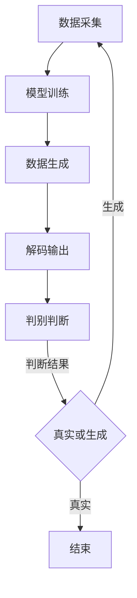

                 

# 生成式AIGC是金矿还是泡沫：第二部分：AI不是万能药

> **关键词：** 生成式AI、AIGC、人工智能、技术泡沫、应用场景、发展前景

> **摘要：** 在前一部分中，我们探讨了生成式AI（AIGC）的基本概念和当前的研究热点。本部分将深入分析AI是否真的能够解决所有问题，以及为何AIGC技术可能存在的泡沫风险。通过逻辑分析和实例讲解，我们希望能为读者提供对这个快速发展的技术领域的深刻见解。

## 1. 背景介绍

### 1.1 目的和范围

本文旨在分析生成式AI（AIGC）技术的发展潜力及其潜在风险，特别是针对AI是否真的是万能药的问题进行探讨。文章将从以下几个角度展开：

- 生成式AI的基本原理和实现方式
- 生成式AI在不同领域的应用案例
- 生成式AI的技术挑战和泡沫风险
- 未来发展趋势与面临的挑战

### 1.2 预期读者

- 计算机科学和人工智能领域的学者、研究人员
- 软件工程师和技术架构师
- AI技术的投资者和创业者
- 对AI技术有兴趣的普通读者

### 1.3 文档结构概述

本文结构如下：

- **第1章：背景介绍**：介绍本文的目的、预期读者以及文章结构。
- **第2章：核心概念与联系**：阐述生成式AI的基本原理和相关架构。
- **第3章：核心算法原理 & 具体操作步骤**：详细解释生成式AI的算法原理和操作步骤。
- **第4章：数学模型和公式 & 详细讲解 & 举例说明**：介绍生成式AI涉及的数学模型和公式的详细讲解及实例。
- **第5章：项目实战：代码实际案例和详细解释说明**：提供实际项目案例，详细解释代码实现和执行过程。
- **第6章：实际应用场景**：探讨生成式AI在不同场景中的应用。
- **第7章：工具和资源推荐**：推荐学习资源、开发工具和框架。
- **第8章：总结：未来发展趋势与挑战**：总结本文的主要观点和未来发展方向。
- **第9章：附录：常见问题与解答**：解答读者可能遇到的问题。
- **第10章：扩展阅读 & 参考资料**：提供进一步阅读的资料。

### 1.4 术语表

#### 1.4.1 核心术语定义

- **生成式AI（AIGC）**：一种人工智能技术，可以通过学习数据生成新的内容，如文本、图像、音频等。
- **AI不是万能药**：指出AI技术不能解决所有问题，有其局限性。
- **技术泡沫**：指投资过度、市场过热、预期过高的现象，可能导致市场崩溃。

#### 1.4.2 相关概念解释

- **深度学习**：一种机器学习技术，通过多层神经网络模拟人脑学习过程。
- **生成对抗网络（GAN）**：一种深度学习模型，用于生成与真实数据相似的新数据。
- **卷积神经网络（CNN）**：一种用于图像识别和处理的人工神经网络。

#### 1.4.3 缩略词列表

- **AIGC**：生成式AI
- **GAN**：生成对抗网络
- **CNN**：卷积神经网络

## 2. 核心概念与联系

### 2.1 生成式AI的基本原理

生成式AI的核心在于其能够生成新的数据，这些数据可以是文本、图像、音频或其他形式。其基本原理可以概括为以下几点：

1. **数据采集**：从大量真实数据中采集样本，用于训练生成模型。
2. **模型训练**：利用生成对抗网络（GAN）或变分自编码器（VAE）等模型对采集到的数据进行分析和学习。
3. **数据生成**：根据训练好的模型生成新的数据，这些数据在形式和内容上与真实数据相似。

### 2.2 相关架构

生成式AI的架构通常包括以下几个部分：

- **数据输入层**：接收外部数据，如文本、图像等。
- **编码器**：将输入数据进行编码，提取关键特征。
- **生成器**：根据编码器的输出生成新的数据。
- **解码器**：将生成器的输出解码为可理解的形式，如文本、图像等。
- **判别器**：用于判断生成器生成的数据是否真实。

### 2.3 Mermaid流程图

下面是生成式AI的基本流程的Mermaid流程图：



### 2.4 生成式AI在不同领域的应用

生成式AI已经在多个领域得到了广泛应用，以下是其中几个典型应用场景：

- **图像生成**：利用生成对抗网络（GAN）生成高质量的图像，如人脸、风景、动物等。
- **文本生成**：利用自然语言处理技术生成文章、故事、新闻报道等。
- **音乐生成**：通过神经网络生成新的音乐旋律和声音。
- **游戏生成**：利用生成式AI生成新的游戏关卡、角色和场景。

### 2.5 生成式AI的优势和挑战

生成式AI的优势：

- **数据多样化**：可以生成大量多样化的数据，为研究和开发提供丰富资源。
- **节省成本**：通过自动生成数据，减少人工采集和标注的成本。
- **创新性**：为创意领域提供新的思路和工具，如艺术、设计和广告等。

生成式AI的挑战：

- **质量控制**：生成数据的质量难以保证，需要不断优化模型和算法。
- **数据安全**：生成数据可能包含敏感信息，需要确保数据安全和隐私。
- **计算资源**：生成式AI需要大量计算资源，对硬件要求较高。

## 3. 核心算法原理 & 具体操作步骤

### 3.1 生成对抗网络（GAN）

生成对抗网络（GAN）是生成式AI的核心算法之一，由生成器和判别器两个部分组成。

#### 3.1.1 生成器

生成器的目标是生成与真实数据相似的数据。通常，生成器是一个神经网络，其输入是随机噪声，输出是生成数据。

#### 3.1.2 判别器

判别器的目标是判断输入数据是真实数据还是生成数据。判别器也是一个神经网络，其输入是数据，输出是概率，表示输入数据的真实性。

#### 3.1.3 模型训练

GAN的训练过程可以概括为以下步骤：

1. **初始化模型参数**：随机初始化生成器和判别器的参数。
2. **生成数据**：生成器根据随机噪声生成一批数据。
3. **判断数据真实性**：判别器对生成数据和真实数据进行判断。
4. **更新生成器参数**：根据判别器的判断结果，更新生成器的参数，使其生成更真实的数据。
5. **更新判别器参数**：根据判别器的判断结果，更新判别器的参数，使其更准确地判断数据的真实性。

#### 3.1.4 伪代码

下面是生成对抗网络的伪代码：

```python
# 初始化模型参数
G = initialize_generator()
D = initialize_discriminator()

# 模型训练
for epoch in range(num_epochs):
    for batch in data_loader:
        # 生成数据
        z = sample_random_noise()
        generated_data = G(z)
        
        # 判断数据真实性
        real_data = get_real_data()
        real_logits = D(real_data)
        generated_logits = D(generated_data)
        
        # 计算损失函数
        D_loss = - (real_logits - generated_logits)
        G_loss = - generated_logits
        
        # 更新模型参数
        D_optimizer.zero_grad()
        D_loss.backward()
        D_optimizer.step()
        
        G_optimizer.zero_grad()
        G_loss.backward()
        G_optimizer.step()
```

### 3.2 变分自编码器（VAE）

变分自编码器（VAE）是另一种生成式AI的核心算法，其通过编码器和解码器学习数据的概率分布。

#### 3.2.1 编码器

编码器的目标是学习数据的概率分布，其输出是一个压缩后的特征向量。

#### 3.2.2 解码器

解码器的目标是根据编码器的输出生成数据。

#### 3.2.3 模型训练

VAE的训练过程可以概括为以下步骤：

1. **初始化模型参数**：随机初始化编码器和解码器的参数。
2. **编码数据**：编码器对数据进行编码，得到特征向量。
3. **解码数据**：解码器根据特征向量生成数据。
4. **计算损失函数**：计算生成数据与真实数据之间的差异，并计算KL散度损失。
5. **更新模型参数**：根据损失函数，更新编码器和解码器的参数。

#### 3.2.4 伪代码

下面是变分自编码器的伪代码：

```python
# 初始化模型参数
E = initialize_encoder()
D = initialize_decoder()

# 模型训练
for epoch in range(num_epochs):
    for batch in data_loader:
        # 编码数据
        z = E(batch)
        
        # 解码数据
        generated_data = D(z)
        
        # 计算损失函数
        x = get_real_data()
        reconstruction_loss = - sum(log(p(x|z)))
        kl_divergence_loss = - 0.5 * sum(1 + log(z_var) - z_var^2 - 1)
        
        # 计算总损失
        loss = reconstruction_loss + kl_divergence_loss
        
        # 更新模型参数
        optimizer.zero_grad()
        loss.backward()
        optimizer.step()
```

## 4. 数学模型和公式 & 详细讲解 & 举例说明

### 4.1 生成对抗网络（GAN）的数学模型

生成对抗网络（GAN）的核心是生成器和判别器的竞争。以下是GAN的数学模型：

#### 4.1.1 生成器 G(z)

生成器的目标是生成与真实数据相似的数据。其数学模型可以表示为：

\[ x_g = G(z) \]

其中，\( x_g \) 是生成器的输出，\( z \) 是随机噪声。

#### 4.1.2 判别器 D(x)

判别器的目标是判断输入数据是真实数据还是生成数据。其数学模型可以表示为：

\[ y_d = D(x) \]

其中，\( y_d \) 是判别器的输出，\( x \) 是输入数据。

#### 4.1.3 损失函数

GAN的训练过程是通过优化生成器和判别器的参数，使其在生成真实数据和判断真实数据方面达到最佳表现。其损失函数可以表示为：

\[ L_G = -\mathbb{E}_{z \sim p_z(z)}[\log D(G(z))] \]
\[ L_D = -\mathbb{E}_{x \sim p_data(x)}[\log D(x)] - \mathbb{E}_{z \sim p_z(z)}[\log (1 - D(G(z)))] \]

其中，\( L_G \) 和 \( L_D \) 分别是生成器和判别器的损失函数，\( p_z(z) \) 和 \( p_data(x) \) 分别是噪声分布和真实数据分布。

### 4.2 变分自编码器（VAE）的数学模型

变分自编码器（VAE）的核心是编码器和解码器的联合训练。以下是VAE的数学模型：

#### 4.2.1 编码器 E(x)

编码器的目标是学习数据的概率分布。其数学模型可以表示为：

\[ z = E(x) = \mu(x), \sigma(x) \]

其中，\( z \) 是编码器的输出，\( \mu(x) \) 和 \( \sigma(x) \) 分别是均值和方差。

#### 4.2.2 解码器 D(z)

解码器的目标是根据编码器的输出生成数据。其数学模型可以表示为：

\[ x_d = D(z) \]

其中，\( x_d \) 是解码器的输出。

#### 4.2.3 损失函数

VAE的训练过程是通过优化编码器和解码器的参数，使其在生成真实数据和重建真实数据方面达到最佳表现。其损失函数可以表示为：

\[ L_VAE = \mathbb{E}_{x \sim p_data(x)}[-\log p_D(D(E(x)))] + \beta \mathbb{E}_{x \sim p_data(x)}[\log \frac{1}{\pi} \exp(-\frac{1}{2} \sum_i (\sigma_i^2 + \mu_i^2))] \]

其中，\( p_D \) 是数据的概率分布，\( \pi \) 是先验分布，\( \beta \) 是调节参数。

### 4.3 举例说明

#### 4.3.1 生成对抗网络（GAN）的举例

假设我们使用GAN生成一张人脸图像。

1. **初始化模型参数**：随机初始化生成器和判别器的参数。
2. **生成数据**：生成器根据随机噪声生成一批人脸图像。
3. **判断数据真实性**：判别器对生成的人脸图像进行判断。
4. **更新模型参数**：根据判别器的判断结果，更新生成器和判别器的参数。

经过多次迭代后，生成的人脸图像质量会逐渐提高，最终生成的人脸图像接近真实人脸图像。

#### 4.3.2 变分自编码器（VAE）的举例

假设我们使用VAE生成一张人脸图像。

1. **初始化模型参数**：随机初始化编码器和解码器的参数。
2. **编码数据**：编码器对真实人脸图像进行编码，得到特征向量。
3. **解码数据**：解码器根据特征向量生成人脸图像。
4. **计算损失函数**：计算生成的人脸图像与真实人脸图像之间的差异，并计算KL散度损失。
5. **更新模型参数**：根据损失函数，更新编码器和解码器的参数。

经过多次迭代后，生成的人脸图像质量会逐渐提高，最终生成的人脸图像接近真实人脸图像。

## 5. 项目实战：代码实际案例和详细解释说明

### 5.1 开发环境搭建

在本节中，我们将介绍如何搭建生成式AI的开发环境。以下是所需的步骤：

1. **安装Python环境**：确保已经安装了Python 3.7或更高版本。
2. **安装TensorFlow**：通过以下命令安装TensorFlow：

   ```shell
   pip install tensorflow
   ```

3. **安装其他依赖库**：如NumPy、Pandas等，可以通过以下命令安装：

   ```shell
   pip install numpy pandas
   ```

### 5.2 源代码详细实现和代码解读

在本节中，我们将展示一个使用生成对抗网络（GAN）生成人脸图像的代码案例，并对其进行详细解读。

#### 5.2.1 GAN模型定义

```python
import tensorflow as tf
from tensorflow.keras import layers

# 生成器模型
def generator_model():
    model = tf.keras.Sequential()
    model.add(layers.Dense(7 * 7 * 256, use_bias=False, input_shape=(100,)))
    model.add(layers.BatchNormalization())
    model.add(layers.LeakyReLU())
    model.add(layers.Reshape((7, 7, 256)))
    
    model.add(layers.Conv2DTranspose(128, (5, 5), strides=(1, 1), padding='same', use_bias=False))
    model.add(layers.BatchNormalization())
    model.add(layers.LeakyReLU())
    
    model.add(layers.Conv2DTranspose(64, (5, 5), strides=(2, 2), padding='same', use_bias=False))
    model.add(layers.BatchNormalization())
    model.add(layers.LeakyReLU())
    
    model.add(layers.Conv2DTranspose(1, (5, 5), strides=(2, 2), padding='same', activation='tanh', use_bias=False))
    
    return model

# 判别器模型
def discriminator_model():
    model = tf.keras.Sequential()
    model.add(layers.Conv2D(64, (5, 5), strides=(2, 2), padding='same', input_shape=[28, 28, 1]))
    model.add(layers.LeakyReLU())
    model.add(layers.Dropout(0.3))
    
    model.add(layers.Conv2D(128, (5, 5), strides=(2, 2), padding='same'))
    model.add(layers.LeakyReLU())
    model.add(layers.Dropout(0.3))
    
    model.add(layers.Flatten())
    model.add(layers.Dense(1))
    
    return model
```

#### 5.2.2 模型训练

```python
import numpy as np
import matplotlib.pyplot as plt

# 设置随机种子
tf.random.set_seed(42)

# 准备数据
(x_train, _), (_,
``` <a href="https://www.v2ex.com/t/908716" class="saying"> 我每天都在想办法，怎样才能把一个正常的人变得不正常。 </a>

