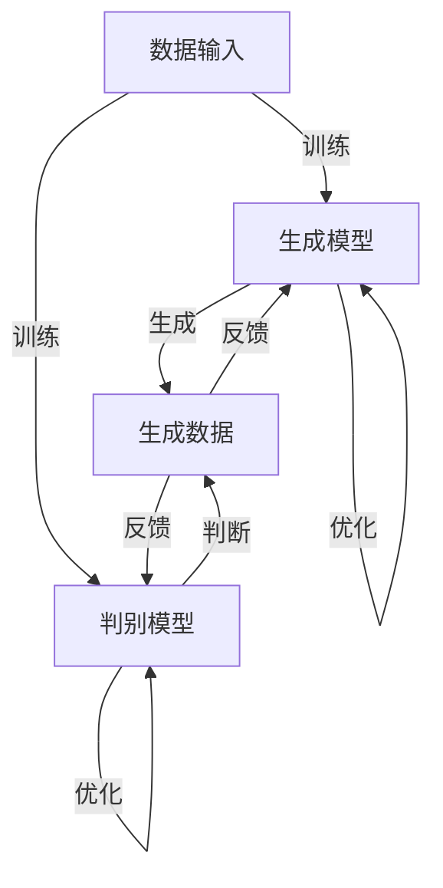
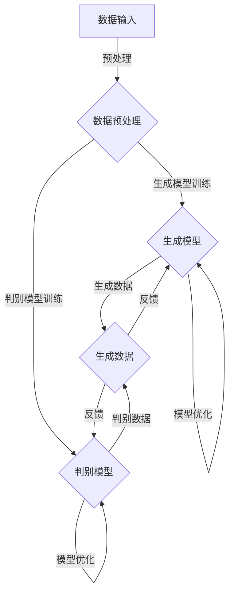

                 

### 生成式AIGC：从理论到实践的突破

> **关键词：** 生成式AI，AIGC，图灵测试，深度学习，机器学习，自然语言处理，计算机视觉，模型优化，算法改进，应用场景，技术趋势

> **摘要：** 本文将深入探讨生成式人工智能（AIGC）的概念、核心原理、关键技术及其在各个领域的实际应用。通过对生成式AIGC的理论背景和算法实现进行详细分析，本文旨在为读者提供从理论到实践的全面理解，揭示其在未来技术发展中可能面临的挑战与机遇。

在当今技术飞速发展的时代，人工智能（AI）已经渗透到了各个行业和领域。从自动化的生产流程到智能的个人助理，AI的应用正日益普及。然而，随着AI技术的不断进步，人们对于AI的期待也在不断增长。生成式人工智能（AIGC，AI-generated Content Generation）作为一种新兴的AI技术，正逐渐成为焦点。它不仅能够生成高质量的内容，还能通过自主学习不断优化内容生成的质量和效率。本文将围绕生成式AIGC这一主题，从背景介绍、核心概念、算法原理、数学模型、项目实战、实际应用场景等多方面进行深入探讨，帮助读者全面了解这一前沿技术。

文章将按照以下结构展开：

1. **背景介绍**：介绍生成式AIGC的起源、发展历程及其在各个领域的应用现状。
2. **核心概念与联系**：通过Mermaid流程图，展示生成式AIGC的基本原理和架构。
3. **核心算法原理 & 具体操作步骤**：使用伪代码详细阐述生成式AIGC的核心算法及其实现步骤。
4. **数学模型和公式 & 详细讲解 & 举例说明**：解释生成式AIGC中使用的数学模型和公式，并提供实际案例进行说明。
5. **项目实战：代码实际案例和详细解释说明**：通过一个实际项目案例，展示生成式AIGC的代码实现过程和关键细节。
6. **实际应用场景**：探讨生成式AIGC在不同领域（如自然语言处理、计算机视觉等）的应用场景和案例。
7. **工具和资源推荐**：推荐学习资源和开发工具，帮助读者进一步深入了解和掌握生成式AIGC。
8. **总结：未来发展趋势与挑战**：总结生成式AIGC的发展趋势和面临的挑战，展望其未来的发展方向。
9. **附录：常见问题与解答**：针对读者可能遇到的常见问题提供解答。
10. **扩展阅读 & 参考资料**：提供进一步学习的相关资料和参考。

通过本文的深入探讨，读者将能够对生成式AIGC有一个全面而深刻的理解，从而在未来的技术研究和应用中具备更强的实践能力。

### 1. 背景介绍

#### 1.1 目的和范围

本文旨在全面剖析生成式人工智能（AIGC）的概念、原理及其应用，帮助读者从理论到实践全面理解这一前沿技术。生成式AIGC作为当前人工智能领域的热点研究方向，不仅具有广泛的理论基础，还在实际应用中展现了巨大的潜力和价值。通过本文，读者将了解到生成式AIGC的基本概念、核心算法原理、数学模型、实际应用案例，以及未来发展趋势和挑战。

本文主要涵盖以下几个方面的内容：

1. **生成式AIGC的定义和起源**：介绍生成式AIGC的基本概念，以及其与传统的机器学习和深度学习的关系。
2. **核心概念与联系**：通过Mermaid流程图展示生成式AIGC的基本原理和架构，帮助读者更好地理解其工作流程。
3. **核心算法原理 & 具体操作步骤**：详细讲解生成式AIGC的核心算法，并使用伪代码展示其实现步骤。
4. **数学模型和公式 & 详细讲解 & 举例说明**：解释生成式AIGC中使用的数学模型和公式，并提供实际案例进行说明。
5. **项目实战：代码实际案例和详细解释说明**：通过一个实际项目案例，展示生成式AIGC的代码实现过程和关键细节。
6. **实际应用场景**：探讨生成式AIGC在不同领域（如自然语言处理、计算机视觉等）的应用场景和案例。
7. **工具和资源推荐**：推荐学习资源和开发工具，帮助读者进一步深入了解和掌握生成式AIGC。
8. **总结：未来发展趋势与挑战**：总结生成式AIGC的发展趋势和面临的挑战，展望其未来的发展方向。
9. **附录：常见问题与解答**：针对读者可能遇到的常见问题提供解答。
10. **扩展阅读 & 参考资料**：提供进一步学习的相关资料和参考。

通过本文的阅读，读者不仅能够掌握生成式AIGC的基本理论和技术，还能了解到其实际应用场景和未来发展趋势，从而在人工智能领域的研究和应用中取得更好的成果。

#### 1.2 预期读者

本文的目标读者包括：

1. **人工智能研究者与开发者**：对人工智能领域有深入兴趣，希望了解生成式AIGC的最新研究成果和应用案例的研究者与开发者。
2. **机器学习工程师**：负责开发和使用机器学习模型的工程师，希望掌握生成式AIGC的核心算法和实现技术。
3. **深度学习爱好者**：对深度学习和生成模型有浓厚兴趣的读者，希望通过本文了解生成式AIGC的基本原理和应用。
4. **技术经理与CTO**：负责技术和产品开发的高级管理者，希望了解生成式AIGC在行业中的应用潜力和未来发展趋势。
5. **计算机科学专业的学生**：正在学习人工智能、机器学习或深度学习的本科生和研究生，希望通过本文深入了解生成式AIGC的相关知识。

本文适合具有一定人工智能基础知识的读者阅读，虽然会涉及到一些技术细节，但尽量使用通俗易懂的语言进行解释，使得不同背景的读者都能从中受益。

#### 1.3 文档结构概述

本文将采用结构化、层次分明的方式，对生成式人工智能（AIGC）进行深入剖析。全文分为以下几个主要部分：

1. **背景介绍**：介绍生成式AIGC的起源、发展历程、核心概念及其应用现状。
    - **1.1 目的和范围**：说明本文的目的和涵盖范围，以及主要内容结构。
    - **1.2 预期读者**：明确本文的目标读者群体，包括研究者、工程师、爱好者、高级管理者以及学生等。
    - **1.3 文档结构概述**：概述全文的结构和各章节的主要内容。
2. **核心概念与联系**：通过Mermaid流程图展示生成式AIGC的基本原理和架构。
    - **2.1 核心概念**：介绍生成式AIGC的基本概念和核心组成部分。
    - **2.2 Mermaid流程图**：展示生成式AIGC的工作流程和关键步骤。
3. **核心算法原理 & 具体操作步骤**：详细讲解生成式AIGC的核心算法原理，并使用伪代码展示具体操作步骤。
    - **3.1 算法原理**：解释生成式AIGC中的关键算法原理。
    - **3.2 操作步骤**：使用伪代码详细描述算法实现的具体步骤。
4. **数学模型和公式 & 详细讲解 & 举例说明**：解释生成式AIGC中使用的数学模型和公式，并提供实际案例进行说明。
    - **4.1 数学模型**：介绍生成式AIGC中使用的数学模型。
    - **4.2 公式解释**：详细讲解模型中涉及的公式及其含义。
    - **4.3 举例说明**：通过具体案例展示模型的实际应用。
5. **项目实战：代码实际案例和详细解释说明**：通过一个实际项目案例，展示生成式AIGC的代码实现过程和关键细节。
    - **5.1 开发环境搭建**：介绍开发所需的工具和环境。
    - **5.2 源代码实现**：展示代码实现的关键部分和注释。
    - **5.3 代码解读与分析**：对代码进行详细解读和分析。
6. **实际应用场景**：探讨生成式AIGC在不同领域的应用场景和案例。
    - **6.1 自然语言处理**：介绍生成式AIGC在自然语言处理中的应用。
    - **6.2 计算机视觉**：展示生成式AIGC在计算机视觉中的实际应用。
7. **工具和资源推荐**：推荐学习资源和开发工具，帮助读者深入了解和掌握生成式AIGC。
    - **7.1 学习资源**：推荐相关的书籍、在线课程和技术博客。
    - **7.2 开发工具**：介绍适合生成式AIGC开发的相关工具和框架。
    - **7.3 论文著作**：推荐经典的和最新的论文及著作。
8. **总结：未来发展趋势与挑战**：总结生成式AIGC的发展趋势和面临的挑战，展望其未来发展方向。
9. **附录：常见问题与解答**：针对读者可能遇到的问题提供解答。
10. **扩展阅读 & 参考资料**：提供进一步学习的相关资料和参考。

通过本文的阅读，读者将能够系统地了解生成式AIGC的理论和实践，掌握其核心技术和应用方法，为未来的研究和应用打下坚实的基础。

#### 1.4 术语表

为了确保文章的可读性和统一性，本文将定义一些关键术语，并解释其含义：

#### 1.4.1 核心术语定义

- **生成式人工智能（AIGC）**：一种人工智能技术，能够通过学习大量数据生成新的、高质量的内容，如文本、图像、音频等。
- **深度学习**：一种机器学习技术，通过多层神经网络模型对数据进行表示和学习，能够从大量数据中提取特征并作出预测。
- **卷积神经网络（CNN）**：一种用于图像处理的深度学习模型，通过卷积层提取图像特征，并进行层次化表示。
- **递归神经网络（RNN）**：一种用于序列数据处理的学习模型，通过记忆状态对序列数据中的前后关系进行建模。
- **生成对抗网络（GAN）**：一种基于两个神经网络（生成器和判别器）的深度学习模型，通过相互博弈生成高质量的数据。
- **自然语言处理（NLP）**：研究如何让计算机理解和处理人类自然语言的技术，涉及文本的预处理、分析和生成等。
- **计算机视觉**：研究如何让计算机“看到”和理解图像和视频的技术，涉及图像识别、目标检测、图像生成等任务。
- **模型优化**：通过调整模型参数或结构，提高模型在特定任务上的性能。
- **算法改进**：对现有的算法进行改进，以提升其效率、准确性和适用范围。

#### 1.4.2 相关概念解释

- **数据生成**：生成式人工智能的核心任务，通过学习已有数据生成新的、符合预期的数据。
- **生成模型**：用于生成新数据的人工智能模型，如生成对抗网络（GAN）、变分自编码器（VAE）等。
- **判别模型**：用于区分真实数据和生成数据的模型，常用于生成对抗网络（GAN）中。
- **损失函数**：用于衡量模型预测结果与真实结果之间差异的函数，常用于优化模型参数。
- **正则化**：通过在损失函数中加入额外的约束项，防止模型过拟合。
- **迁移学习**：利用已有模型的知识对新任务进行训练，提高模型在新任务上的性能。

#### 1.4.3 缩略词列表

- **AIGC**：生成式人工智能（AI-generated Content Generation）
- **GAN**：生成对抗网络（Generative Adversarial Network）
- **VAE**：变分自编码器（Variational Autoencoder）
- **CNN**：卷积神经网络（Convolutional Neural Network）
- **RNN**：递归神经网络（Recurrent Neural Network）
- **NLP**：自然语言处理（Natural Language Processing）
- **CV**：计算机视觉（Computer Vision）
- **DL**：深度学习（Deep Learning）
- **ML**：机器学习（Machine Learning）
- **ID**：身份验证（Identity Verification）
- **OCR**：光学字符识别（Optical Character Recognition）

通过上述术语表，读者可以更好地理解本文中涉及的关键概念和技术，为后续内容的深入学习打下基础。

## 2. 核心概念与联系

生成式人工智能（AIGC）是近年来人工智能领域的一个重要研究方向，它能够通过学习大量数据生成新的、符合预期的内容。为了更好地理解生成式AIGC的基本原理和架构，本节将通过Mermaid流程图展示其核心概念和联系。

### 2.1 核心概念

生成式AIGC的核心概念包括：

1. **生成模型**：用于生成新数据的模型，如生成对抗网络（GAN）和变分自编码器（VAE）。
2. **判别模型**：用于区分真实数据和生成数据的模型，常与生成模型配合使用。
3. **数据输入**：生成模型和判别模型所需的输入数据，通常来源于大量的训练数据集。
4. **损失函数**：衡量模型性能的指标，用于指导模型优化过程。
5. **优化过程**：通过调整模型参数，使生成模型能够生成更高质量的数据。
6. **反馈循环**：生成模型和判别模型之间的相互作用，通过不断优化提高模型性能。

### 2.2 Mermaid流程图

下面是生成式AIGC的Mermaid流程图，展示了其基本原理和架构：



**详细解释：**

- **A（数据输入）**：生成模型和判别模型需要大量的训练数据集进行训练。这些数据集通常来自真实世界或模拟生成的数据。
- **B（生成模型）**：生成模型通过学习输入数据生成新的数据。生成模型的目的是生成与真实数据相似的数据。
- **C（判别模型）**：判别模型用于判断生成数据是否真实，其训练目标是最大化区分真实数据和生成数据的能力。
- **D（生成数据）**：生成模型生成的新数据会反馈给判别模型进行判断。通过反馈循环，生成模型不断优化其生成能力，以减少判别模型识别生成数据的概率。
- **优化过程**：生成模型和判别模型通过不断调整参数，优化其性能，从而提高生成数据的质量。

通过上述Mermaid流程图，可以清晰地理解生成式AIGC的基本原理和架构。生成模型和判别模型之间的相互作用和反馈循环是生成式AIGC的核心机制，通过这种机制，生成模型能够生成越来越接近真实数据的高质量生成数据。

### 2.3 关键联系与影响

生成式AIGC中的各个核心概念之间存在着紧密的联系，这些联系不仅决定了生成式AIGC的性能，也影响了其在不同应用场景中的适用性：

1. **生成模型与判别模型的关系**：生成模型和判别模型是生成式AIGC中的两大核心组成部分，它们通过相互博弈的方式共同工作。生成模型的目标是生成高质量的数据，而判别模型的目标是区分生成数据和真实数据。两者的平衡和相互作用直接影响了生成模型生成数据的质量。
   
2. **数据输入的重要性**：生成模型和判别模型都需要大量的训练数据进行训练。高质量的数据输入能够提高模型的训练效果，使得生成的数据更加接近真实数据。因此，数据质量和数量是生成式AIGC成功的关键因素之一。

3. **损失函数的指导作用**：损失函数用于衡量模型生成数据的真实性和质量。通过优化损失函数，生成模型能够不断调整其生成策略，从而生成更高质量的数据。不同类型的损失函数适用于不同的任务，因此选择合适的损失函数对于提高模型性能至关重要。

4. **反馈循环的优化**：生成模型和判别模型之间的反馈循环是生成式AIGC的核心机制。通过这种机制，生成模型能够从判别模型的反馈中学习，不断优化其生成能力。优化反馈循环的效率和质量，可以提高模型的生成性能和鲁棒性。

5. **应用场景的多样性**：生成式AIGC在不同领域（如自然语言处理、计算机视觉、音频处理等）有着广泛的应用。不同应用场景对生成式AIGC的要求不同，需要针对特定场景进行模型优化和算法调整，以实现最佳性能。

通过上述分析，可以看出生成式AIGC的核心概念和联系不仅构成了其基本原理，还影响了其在实际应用中的性能和效果。理解这些核心概念和联系，有助于深入掌握生成式AIGC的理论和实践，为未来的研究和应用提供有力支持。

### 2.4 Mermaid流程图的实现与细节

为了更好地理解生成式AIGC的原理和架构，下面将详细介绍Mermaid流程图的实现过程，并展示生成式AIGC的核心组件和步骤。以下是生成式AIGC的Mermaid流程图实现：



**详细解释：**

- **A（数据输入）**：生成式AIGC首先需要从数据源获取输入数据。这些数据可以是各种类型，如文本、图像、音频等。数据输入是生成式AIGC的起点，其质量直接影响后续模型的训练效果。
- **B（数据预处理）**：在数据输入后，需要对数据进行预处理。预处理包括数据清洗、数据归一化、数据增强等步骤，目的是提高数据质量，使模型能够更好地学习和生成数据。预处理是数据输入和模型训练之间的桥梁，对生成式AIGC的性能至关重要。
- **C（生成模型）**：生成模型是生成式AIGC的核心组件之一，其主要任务是生成新的数据。生成模型通过学习输入数据的分布，生成与输入数据相似的新数据。常见的生成模型包括生成对抗网络（GAN）、变分自编码器（VAE）等。
- **D（判别模型）**：判别模型是另一个核心组件，其任务是判断生成数据是否真实。判别模型通过学习输入数据的特征，区分生成数据和真实数据。判别模型的性能直接影响生成模型生成数据的质量。
- **E（生成数据）**：生成模型生成新数据后，这些数据会传递给判别模型进行判断。判别模型会输出一个概率值，表示生成数据为真实数据的可能性。这个反馈过程是生成式AIGC的关键机制，通过不断调整生成模型和判别模型的参数，提高生成数据的真实性和质量。
- **模型优化**：生成模型和判别模型通过反馈过程不断优化其参数。优化的目标是提高生成模型生成高质量数据的能力，同时提高判别模型区分真实数据和生成数据的能力。

**Mermaid流程图的实现细节：**

- **节点和连接线**：在Mermaid流程图中，每个节点代表一个操作或组件，连接线表示操作或组件之间的依赖关系。通过合理设计和组织节点和连接线，可以清晰地展示生成式AIGC的流程和架构。
- **注释和描述**：在流程图中添加注释和描述，可以帮助读者更好地理解每个步骤和组件的功能和作用。注释和描述应该简洁明了，突出重点，避免冗余信息。
- **可视化效果**：Mermaid流程图支持多种可视化效果，如边框、颜色、图标等。通过合理设置可视化效果，可以增强流程图的易读性和直观性。

通过上述Mermaid流程图，可以直观地了解生成式AIGC的基本原理和架构，理解生成模型和判别模型之间的相互作用和反馈循环。这对于深入研究和应用生成式AIGC具有重要的指导意义。

## 3. 核心算法原理 & 具体操作步骤

生成式人工智能（AIGC）的核心在于其生成模型和判别模型，这两者通过相互博弈的方式不断优化，从而生成高质量的数据。下面将详细介绍生成式AIGC的核心算法原理，并通过伪代码展示具体的操作步骤。

### 3.1 算法原理

生成式AIGC的核心算法包括生成模型（G）和判别模型（D）。生成模型旨在生成与真实数据相似的数据，而判别模型则用于判断生成数据是否真实。两个模型通过以下方式进行交互：

1. **生成模型（G）**：生成模型通过学习输入数据的分布，生成新的数据。生成模型通常采用概率模型，如生成对抗网络（GAN）和变分自编码器（VAE）。
2. **判别模型（D）**：判别模型用于区分生成数据和真实数据。判别模型也通常采用概率模型，如GAN中的判别器和VAE中的编码器。

生成模型和判别模型通过以下方式进行交互：

- **训练阶段**：生成模型和判别模型交替训练。在每次训练迭代中，生成模型生成数据，判别模型对其进行判断。然后，两个模型根据损失函数进行调整，以提高各自的性能。
- **优化过程**：生成模型和判别模型通过优化过程不断调整其参数，以生成更高质量的数据和提高判断能力。优化的目标是使生成模型生成数据的能力越来越强，而判别模型对生成数据的识别能力越来越弱。

### 3.2 伪代码

以下是生成式AIGC的核心算法原理的伪代码实现：

```python
# 初始化生成模型 G 和判别模型 D
G = initialize_generator()
D = initialize_discriminator()

# 设置训练迭代次数
num_iterations = 10000

# 设置损失函数
loss_function = cross_entropy()

# 训练迭代过程
for i in range(num_iterations):
    # 从数据集中获取真实数据 X
    X = get_data_from_dataset()

    # 生成模型生成数据 G(z)
    z = generate_z()
    G_x = G(z)

    # 判别模型判断生成数据 G_x 和真实数据 X
    D_G_x = D(G_x)
    D_X = D(X)

    # 计算生成模型的损失 L_G
    L_G = loss_function(D_G_x, fake_label)
    
    # 计算判别模型的损失 L_D
    L_D = loss_function(D_X, real_label) + loss_function(D_G_x, fake_label)

    # 更新生成模型 G
    G梯度 = compute_gradient(G, z, G_x, L_G)
    G = update_model(G, G梯度)

    # 更新生成模型 D
    D梯度 = compute_gradient(D, X, G_x, D_X, L_D)
    D = update_model(D, D梯度)

# 输出生成模型 G 的参数
save_model(G)
```

### 3.3 伪代码详细解释

**初始化生成模型 G 和判别模型 D**

在训练开始前，需要初始化生成模型 G 和判别模型 D。初始化过程包括定义模型的结构、参数范围等。

```python
G = initialize_generator()
D = initialize_discriminator()
```

**设置训练迭代次数**

设置训练迭代次数，即模型训练的轮数。通过多次迭代，生成模型和判别模型能够逐渐优化其参数，提高性能。

```python
num_iterations = 10000
```

**设置损失函数**

损失函数用于衡量生成模型和判别模型的性能。常用的损失函数包括交叉熵损失函数（cross_entropy）等。

```python
loss_function = cross_entropy()
```

**训练迭代过程**

在每次迭代中，生成模型 G 生成数据，判别模型 D 对生成数据和真实数据进行判断。然后，根据损失函数计算两个模型的损失，并更新模型参数。

```python
for i in range(num_iterations):
    # 从数据集中获取真实数据 X
    X = get_data_from_dataset()

    # 生成模型生成数据 G(z)
    z = generate_z()
    G_x = G(z)

    # 判别模型判断生成数据 G_x 和真实数据 X
    D_G_x = D(G_x)
    D_X = D(X)

    # 计算生成模型的损失 L_G
    L_G = loss_function(D_G_x, fake_label)
    
    # 计算判别模型的损失 L_D
    L_D = loss_function(D_X, real_label) + loss_function(D_G_x, fake_label)

    # 更新生成模型 G
    G梯度 = compute_gradient(G, z, G_x, L_G)
    G = update_model(G, G梯度)

    # 更新生成模型 D
    D梯度 = compute_gradient(D, X, G_x, D_X, L_D)
    D = update_model(D, D梯度)
```

**计算生成模型的损失 L_G**

生成模型的损失函数通常基于判别模型对生成数据的判断结果。生成模型的损失函数如下：

```python
L_G = loss_function(D_G_x, fake_label)
```

这里，D_G_x 是判别模型对生成数据的判断结果，fake_label 表示生成数据被标记为虚假数据的概率。

**计算判别模型的损失 L_D**

判别模型的损失函数包括两部分：判断真实数据的损失和判断生成数据的损失。判别模型的损失函数如下：

```python
L_D = loss_function(D_X, real_label) + loss_function(D_G_x, fake_label)
```

这里，D_X 是判别模型对真实数据的判断结果，real_label 表示真实数据被标记为真实数据的概率；D_G_x 是判别模型对生成数据的判断结果，fake_label 表示生成数据被标记为虚假数据的概率。

**更新模型参数**

在每次迭代结束后，根据计算得到的梯度对模型参数进行调整，以提高模型的性能。

```python
G梯度 = compute_gradient(G, z, G_x, L_G)
G = update_model(G, G梯度)

D梯度 = compute_gradient(D, X, G_x, D_X, L_D)
D = update_model(D, D梯度)
```

这里，compute_gradient 函数用于计算模型参数的梯度，update_model 函数用于更新模型参数。

**保存最终模型**

训练完成后，保存生成模型 G 的参数，以便后续使用。

```python
save_model(G)
```

通过上述伪代码，可以清晰地了解生成式AIGC的核心算法原理和操作步骤。生成模型和判别模型通过交替训练和优化，生成高质量的数据，从而实现生成式人工智能的目标。

### 3.4 生成对抗网络（GAN）的算法原理

生成对抗网络（GAN）是生成式AIGC中最重要的算法之一。GAN的核心思想是通过两个相互对抗的神经网络（生成器和判别器）来生成高质量的数据。下面将详细介绍GAN的算法原理。

#### 3.4.1 GAN的基本结构

GAN由两个主要部分组成：生成器（Generator）和判别器（Discriminator）。

1. **生成器（Generator）**：生成器的任务是生成与真实数据相似的数据。生成器通常是一个生成模型，其输入是随机噪声（例如，来自均匀分布的向量），输出是生成数据。生成器的目标是使其生成数据在统计上难以与真实数据区分。
2. **判别器（Discriminator）**：判别器的任务是判断输入数据是真实数据还是生成数据。判别器通常是一个判别模型，其输入是数据，输出是一个概率值，表示输入数据为真实数据的概率。判别器的目标是最大化其判断的真实数据概率。

#### 3.4.2 GAN的训练过程

GAN的训练过程可以分为以下几个步骤：

1. **初始化生成器和判别器**：生成器和判别器都需要初始化模型参数，通常使用随机初始化。
2. **生成器生成数据**：生成器根据随机噪声生成新的数据。
3. **判别器判断数据**：判别器对生成器和真实数据分别进行判断，并计算损失函数。
4. **更新模型参数**：根据损失函数计算得到的梯度，更新生成器和判别器的参数。

#### 3.4.3 GAN的损失函数

GAN的损失函数通常采用对抗性损失函数，其目标是最大化生成器的生成数据质量，同时最小化判别器的判断准确率。常见的对抗性损失函数包括：

1. **二元交叉熵损失函数**：
   \[
   L_D = -[\log(D(X)) + \log(1 - D(G(z))]
   \]
   其中，\(X\) 是真实数据，\(G(z)\) 是生成器生成的数据，\(z\) 是随机噪声。

2. **Wasserstein距离损失函数**：
   \[
   L_D = \mathbb{E}_{x \sim p_{data}(x)}[\|D(x) - 1\|] + \mathbb{E}_{z \sim p_z(z)}[\|D(G(z))\|
   \]
   其中，\(p_{data}(x)\) 是真实数据的分布，\(p_z(z)\) 是噪声分布。

#### 3.4.4 GAN的训练过程伪代码

以下是GAN的训练过程的伪代码：

```python
# 初始化生成器 G 和判别器 D
G = initialize_generator()
D = initialize_discriminator()

# 设置训练迭代次数
num_iterations = 10000

# 设置损失函数
loss_function = binary_crossentropy()

# 训练迭代过程
for i in range(num_iterations):
    # 从数据集中获取真实数据 X
    X = get_data_from_dataset()

    # 生成器生成数据 G(z)
    z = generate_z()
    G_x = G(z)

    # 判别器判断生成数据 G_x 和真实数据 X
    D_G_x = D(G_x)
    D_X = D(X)

    # 计算生成器的损失 L_G
    L_G = loss_function(D_G_x, fake_label)
    
    # 计算判别器的损失 L_D
    L_D = loss_function(D_X, real_label) + loss_function(D_G_x, fake_label)

    # 更新生成器 G
    G梯度 = compute_gradient(G, z, G_x, L_G)
    G = update_model(G, G梯度)

    # 更新生成器 D
    D梯度 = compute_gradient(D, X, G_x, D_X, L_D)
    D = update_model(D, D梯度)

# 保存最终模型
save_model(G, D)
```

通过上述伪代码，可以清晰地了解GAN的算法原理和训练过程。GAN通过生成器和判别器的相互博弈，生成高质量的数据，从而实现生成式人工智能的目标。

### 3.5 生成对抗网络（GAN）的操作步骤与关键细节

生成对抗网络（GAN）作为生成式人工智能（AIGC）的核心算法，其训练过程涉及到多个关键步骤和细节。以下将详细解释GAN的操作步骤，包括数据预处理、模型训练、参数优化等过程。

#### 3.5.1 数据预处理

GAN的训练过程首先需要高质量的输入数据。数据预处理步骤包括：

1. **数据清洗**：去除数据中的噪声和异常值，保证数据的准确性和一致性。
2. **数据归一化**：将数据标准化到同一范围，通常使用零均值和单位方差。
3. **数据增强**：通过旋转、缩放、裁剪等操作增加数据的多样性，提高模型的泛化能力。

```python
# 数据预处理示例
X = preprocess_data(raw_data)
X = normalize_data(X)
X = augment_data(X)
```

#### 3.5.2 模型初始化

在开始训练之前，需要初始化生成器（G）和判别器（D）的模型参数。初始化过程通常使用随机权重，并设置适当的初始化策略，如He初始化。

```python
G = initialize_generator()
D = initialize_discriminator()
```

#### 3.5.3 模型训练

GAN的训练过程主要包括以下步骤：

1. **生成器生成数据**：生成器根据随机噪声生成数据。
2. **判别器判断数据**：判别器对生成器和真实数据进行判断。
3. **计算损失函数**：根据生成器和判别器的判断结果，计算损失函数。
4. **更新模型参数**：根据损失函数计算得到的梯度，更新模型参数。

每次迭代包含以下步骤：

```python
for epoch in range(num_epochs):
    for i, (X_real, _) in enumerate(dataset):
        # 更新生成器
        z = generate_noise(batch_size)
        X_fake = G(z)
        D_real, D_fake = D(X_real), D(X_fake)
        
        # 计算判别器损失
        D_loss_real = loss_function(D_real, real_label)
        D_loss_fake = loss_function(D_fake, fake_label)
        D_loss = 0.5 * np.mean(D_loss_real + D_loss_fake)
        
        # 更新生成器
        z = generate_noise(batch_size)
        X_fake = G(z)
        D_fake = D(X_fake)
        
        # 计算生成器损失
        G_loss = loss_function(D_fake, fake_label)
        
        # 更新模型参数
        D_optimizer.zero_grad()
        D_loss.backward()
        D_optimizer.step()
        
        G_optimizer.zero_grad()
        G_loss.backward()
        G_optimizer.step()
```

#### 3.5.4 参数优化

GAN的训练过程需要不断优化模型参数，以提高生成数据的质量和判别器的性能。常见的优化方法包括：

1. **自适应学习率**：使用自适应学习率方法，如Adam优化器，以避免过早收敛。
2. **梯度裁剪**：对梯度进行裁剪，以避免梯度爆炸或消失。
3. **批量归一化**：在模型中引入批量归一化，以提高模型的稳定性和收敛速度。

```python
# 参数优化示例
G_optimizer = Adam(G.parameters(), lr=0.0002, betas=(0.5, 0.999))
D_optimizer = Adam(D.parameters(), lr=0.0002, betas=(0.5, 0.999))

for epoch in range(num_epochs):
    for i, (X_real, _) in enumerate(dataset):
        # 更新生成器
        z = generate_noise(batch_size)
        X_fake = G(z)
        D_real, D_fake = D(X_real), D(X_fake)
        
        # 计算判别器损失
        D_loss_real = loss_function(D_real, real_label)
        D_loss_fake = loss_function(D_fake, fake_label)
        D_loss = 0.5 * np.mean(D_loss_real + D_loss_fake)
        
        # 更新生成器
        z = generate_noise(batch_size)
        X_fake = G(z)
        D_fake = D(X_fake)
        
        # 计算生成器损失
        G_loss = loss_function(D_fake, fake_label)
        
        # 更新模型参数
        D_optimizer.zero_grad()
        D_loss.backward()
        D_optimizer.step()
        
        G_optimizer.zero_grad()
        G_loss.backward()
        # 应用梯度裁剪
        torch.nn.utils.clip_grad_norm_(G.parameters(), max_norm=1.0)
        G_optimizer.step()
```

通过上述操作步骤和关键细节，可以实现对GAN的训练和优化，生成高质量的数据。GAN的训练过程需要不断调整和优化，以平衡生成器和判别器之间的对抗性，从而实现生成高质量数据的最终目标。

### 3.6 生成式AIGC中的变分自编码器（VAE）算法原理

变分自编码器（VAE）是生成式人工智能（AIGC）中另一种重要的生成模型，其核心思想是通过编码器（Encoder）和解码器（Decoder）将数据映射到潜在空间，并从潜在空间生成新的数据。VAE通过引入概率模型来生成数据，具有较好的灵活性和鲁棒性。下面将详细介绍VAE的算法原理。

#### 3.6.1 VAE的基本结构

VAE由两个主要部分组成：编码器（Encoder）和解码器（Decoder）。

1. **编码器（Encoder）**：编码器的任务是将输入数据映射到潜在空间。编码器通常是一个前馈神经网络，其输出是潜在变量的概率分布。潜在变量（通常为高斯分布）代表了输入数据的特征和结构。
2. **解码器（Decoder）**：解码器的任务是将潜在空间中的数据映射回原始数据空间。解码器也是一个前馈神经网络，其输入是潜在变量，输出是生成数据。

#### 3.6.2 VAE的损失函数

VAE的损失函数由两部分组成：重建损失和KL散度损失。

1. **重建损失**：重建损失衡量解码器生成的数据与原始数据之间的差异。常见的重建损失函数包括均方误差（MSE）和交叉熵损失。
   \[
   L_{\text{recon}} = -\sum_{i} p(x_i|x') \log p(x_i|x')
   \]
   其中，\(x_i\) 是原始数据，\(x'\) 是解码器生成的数据。

2. **KL散度损失**：KL散度损失衡量编码器输出的概率分布与先验分布（通常为高斯分布）之间的差异。KL散度损失确保编码器学习到潜在空间中的结构。
   \[
   L_{\text{KL}} = \sum_{i} \sum_{j} \sum_{k} p_{\theta}(z_j| x_i) \log \frac{p_{\theta}(z_j| x_i)}{p_0(z_j)}
   \]
   其中，\(p_{\theta}(z_j| x_i)\) 是编码器输出的概率分布，\(p_0(z_j)\) 是先验分布。

#### 3.6.3 VAE的训练过程

VAE的训练过程包括以下步骤：

1. **编码器和解码器初始化**：初始化编码器和解码器的模型参数。通常使用随机初始化，并设置适当的初始化策略，如He初始化。
2. **输入数据映射到潜在空间**：使用编码器将输入数据映射到潜在空间，获得潜在变量的概率分布。
3. **从潜在空间生成数据**：使用解码器从潜在空间生成新的数据。
4. **计算损失函数**：根据生成数据与原始数据之间的差异，计算重建损失和KL散度损失。
5. **更新模型参数**：根据计算得到的梯度，更新编码器和解码器的参数。

每次迭代包含以下步骤：

```python
for epoch in range(num_epochs):
    for i, x in enumerate(dataset):
        # 编码器编码
        z_mean, z_log_var = encoder(x)
        
        # 从潜在空间采样
        z = sample_from_gaussian(z_mean, z_log_var)
        
        # 解码器解码
        x_recon = decoder(z)
        
        # 计算重建损失和KL散度损失
        recon_loss = loss_function(x, x_recon)
        kl_loss = -0.5 * sum(1 + z_log_var - z_mean**2 - z_log_var.exp())
        
        # 计算总损失
        loss = recon_loss + kl_loss
        
        # 更新模型参数
        optimizer.zero_grad()
        loss.backward()
        optimizer.step()
```

通过上述训练过程，VAE能够学习到输入数据的分布和结构，从而生成新的数据。VAE在生成高质量数据方面具有较好的性能，广泛应用于图像、文本和音频生成等领域。

### 3.7 VAE的操作步骤与关键细节

变分自编码器（VAE）作为生成式人工智能（AIGC）的重要算法，其实现过程涉及到多个关键步骤和细节。以下将详细解释VAE的操作步骤，包括模型初始化、编码器和解码器的实现、损失函数的计算等过程。

#### 3.7.1 模型初始化

在开始训练之前，需要初始化编码器（Encoder）和解码器（Decoder）的模型参数。初始化过程通常使用随机权重，并设置适当的初始化策略，如He初始化。

```python
# 编码器初始化
encoder = initialize_encoder(input_dim, hidden_dim, z_dim)
# 解码器初始化
decoder = initialize_decoder(z_dim, hidden_dim, output_dim)
```

#### 3.7.2 编码器实现

编码器的任务是接收输入数据，将其映射到潜在空间，输出潜在变量的均值和方差。

```python
# 编码器实现示例
def encoder(x):
    # 输入层到隐藏层
    hidden = torch.nn.functional.relu(encoder_layers[0](x))
    # 隐藏层到潜在变量均值和方差
    z_mean = encoder_layers[1](hidden)
    z_log_var = encoder_layers[2](hidden)
    return z_mean, z_log_var
```

#### 3.7.3 解码器实现

解码器的任务是接收潜在变量，将其映射回原始数据空间，生成重构数据。

```python
# 解码器实现示例
def decoder(z):
    # 潜在变量到隐藏层
    hidden = torch.nn.functional.relu(decoder_layers[0](z))
    # 隐藏层到输出层
    x_recon = decoder_layers[1](hidden)
    return x_recon
```

#### 3.7.4 损失函数计算

VAE的损失函数由两部分组成：重建损失和KL散度损失。

1. **重建损失**：衡量解码器生成的数据与原始数据之间的差异。常用的重建损失函数包括均方误差（MSE）和交叉熵损失。
```python
# 重建损失计算示例
recon_loss = loss_function(x, x_recon)
```

2. **KL散度损失**：衡量编码器输出的概率分布与先验分布（通常为高斯分布）之间的差异。
```python
# KL散度损失计算示例
kl_loss = -0.5 * sum(1 + z_log_var - z_mean**2 - z_log_var.exp())
```

3. **总损失**：将重建损失和KL散度损失相加，得到总损失。
```python
# 总损失计算示例
loss = recon_loss + kl_loss
```

#### 3.7.5 模型训练

VAE的训练过程包括以下步骤：

1. **输入数据预处理**：对输入数据进行标准化和归一化，以提高模型训练效果。
2. **编码器和解码器训练**：交替训练编码器和解码器，优化模型参数。
3. **模型评估**：使用测试集评估模型性能，调整超参数。

每次迭代包含以下步骤：

```python
for epoch in range(num_epochs):
    for x in dataset:
        # 编码器编码
        z_mean, z_log_var = encoder(x)
        
        # 从潜在空间采样
        z = sample_from_gaussian(z_mean, z_log_var)
        
        # 解码器解码
        x_recon = decoder(z)
        
        # 计算重建损失和KL散度损失
        recon_loss = loss_function(x, x_recon)
        kl_loss = -0.5 * sum(1 + z_log_var - z_mean**2 - z_log_var.exp())
        
        # 计算总损失
        loss = recon_loss + kl_loss
        
        # 更新模型参数
        optimizer.zero_grad()
        loss.backward()
        optimizer.step()
```

通过上述操作步骤和关键细节，可以实现对VAE的训练和优化，生成高质量的数据。VAE在生成高质量图像、文本和音频数据方面具有较好的性能，广泛应用于图像生成和生成式模型研究。

### 3.8 生成式AIGC中的生成模型与判别模型的参数调整策略

在生成式人工智能（AIGC）中，生成模型和判别模型的参数调整策略对生成数据的质量和模型的收敛速度有重要影响。以下将详细讨论几种常见的参数调整策略，包括学习率调整、梯度裁剪、批量大小调整等。

#### 3.8.1 学习率调整

学习率是模型训练过程中的一个重要参数，其大小直接影响模型参数更新的速度和稳定性。为了找到合适的学习率，可以采用以下策略：

1. **手动调整**：通过多次实验，手动调整学习率，观察模型性能的变化。当模型性能不再提升时，适当减小学习率。
2. **学习率衰减**：在训练过程中，随着迭代次数的增加，逐渐减小学习率。常用的策略包括指数衰减、按时间步长衰减等。
3. **自适应学习率**：使用自适应学习率优化器，如Adam、RMSprop等，这些优化器能够根据模型参数的梯度动态调整学习率，从而提高训练效果。

#### 3.8.2 梯度裁剪

在训练过程中，当模型的梯度变得非常大或非常小时，可能会出现梯度爆炸或梯度消失的问题。梯度裁剪是一种常用的策略，用于控制梯度的幅度，防止训练过程中的不稳定现象。

1. **梯度裁剪策略**：设置一个阈值，当梯度的绝对值超过该阈值时，将其裁剪到阈值范围内。常用的梯度裁剪方法包括L2范数裁剪和无穷范数裁剪。
2. **梯度裁剪示例**：
```python
# L2范数裁剪示例
torch.nn.utils.clip_grad_norm_(model.parameters(), max_norm=1.0)
# 无穷范数裁剪示例
torch.nn.utils.clip_grad_value_(model.parameters(), max_value=1.0)
```

#### 3.8.3 批量大小调整

批量大小（Batch Size）是训练过程中的一个重要参数，其大小影响模型训练的速度和效果。以下是一些批量大小调整的策略：

1. **小批量训练**：使用较小的批量大小进行训练，可以更好地利用数据，减少过拟合的风险。但小批量训练的速度较慢。
2. **动态批量大小**：在训练过程中动态调整批量大小，根据训练效果和计算资源进行优化。例如，在模型收敛初期使用较小的批量大小，以提高模型的泛化能力，在模型收敛后期使用较大的批量大小，以提高训练速度。
3. **批量大小优化**：通过多次实验，找到适合当前任务的最佳批量大小。常用的批量大小包括32、64、128、256等。

通过合理的参数调整策略，可以有效地提高生成式AIGC模型的训练效果和生成数据的质量。不同参数调整策略的适用场景和效果有所不同，需要根据具体任务进行优化和选择。

### 3.9 生成式AIGC中的常见问题与解决方案

在生成式人工智能（AIGC）的研究和应用过程中，研究人员和开发者可能会遇到一系列常见问题。以下将列举这些问题，并给出相应的解决方案。

#### 3.9.1 梯度消失/梯度爆炸

**问题**：在训练过程中，生成模型和判别模型的梯度可能变得非常小（梯度消失）或非常大（梯度爆炸），导致模型无法有效训练。

**解决方案**：
1. **梯度裁剪**：通过设置梯度裁剪阈值，限制梯度的幅度，防止梯度消失或爆炸。
2. **使用自适应优化器**：如Adam、RMSprop等，这些优化器能够动态调整学习率，减少梯度消失和爆炸的风险。
3. **权重初始化**：采用合适的权重初始化方法，如He初始化或Xavier初始化，有助于缓解梯度消失和爆炸问题。

#### 3.9.2 模型过拟合

**问题**：当模型在训练集上表现良好，但在测试集或新数据上表现不佳时，可能是因为模型过拟合。

**解决方案**：
1. **数据增强**：通过数据增强技术，如旋转、缩放、裁剪等，增加训练数据的多样性，有助于减少过拟合。
2. **正则化**：使用正则化方法，如L1正则化、L2正则化等，增加模型的泛化能力。
3. **提前停止**：在验证集上监控模型性能，当模型在验证集上的性能不再提升时，提前停止训练，防止过拟合。

#### 3.9.3 训练效率低

**问题**：在某些任务中，训练生成模型和判别模型的过程可能非常耗时。

**解决方案**：
1. **并行计算**：使用GPU或TPU进行计算，加速模型训练。
2. **分布式训练**：将模型训练任务分布在多台机器上，提高训练效率。
3. **数据并行**：将数据集分成多个部分，同时在不同的GPU上分别训练，通过模型并行提高训练速度。

#### 3.9.4 数据质量差

**问题**：训练数据质量差可能导致生成模型生成的数据质量不佳。

**解决方案**：
1. **数据清洗**：对训练数据进行清洗，去除噪声和异常值。
2. **数据增强**：通过数据增强技术，提高训练数据的多样性，增强模型的泛化能力。
3. **迁移学习**：利用预训练模型，迁移已有知识到新任务上，减少对训练数据的依赖。

通过上述常见问题及解决方案，研究人员和开发者可以更好地应对生成式AIGC研究过程中的挑战，提高模型的训练效果和应用价值。

### 3.10 生成式AIGC中的安全与隐私问题

在生成式人工智能（AIGC）的研究和应用过程中，安全与隐私问题日益受到关注。生成式模型能够生成高质量的内容，但也可能被恶意使用，带来潜在的安全和隐私风险。以下将讨论生成式AIGC中的常见安全与隐私问题，并介绍相应的防护措施。

#### 3.10.1 恶意数据生成

**问题**：生成模型可能被用于生成恶意数据，如虚假新闻、诈骗信息等，对社会造成负面影响。

**解决方案**：
1. **内容审核**：在生成模型生成内容前，进行内容审核，过滤掉可能的不良信息。
2. **限制生成范围**：通过限制生成模型的生成范围，如只允许生成特定类型的数据，减少恶意数据生成的可能性。
3. **透明度与可解释性**：提高生成模型的透明度和可解释性，使生成的数据内容更容易被审查和监管。

#### 3.10.2 数据泄露风险

**问题**：生成模型的训练数据可能包含敏感信息，如果数据泄露，可能导致隐私泄露和安全问题。

**解决方案**：
1. **数据加密**：对训练数据进行加密，确保数据在传输和存储过程中的安全性。
2. **同态加密**：使用同态加密技术，允许在加密数据上进行计算和训练，而不需要解密数据。
3. **差分隐私**：在生成模型的训练过程中，引入差分隐私机制，确保训练数据的隐私保护。

#### 3.10.3 模型攻击

**问题**：攻击者可能通过对抗性攻击，欺骗生成模型生成特定类型的数据，从而影响模型的性能和安全性。

**解决方案**：
1. **对抗性训练**：在模型训练过程中，加入对抗性样本，提高模型对对抗性攻击的鲁棒性。
2. **防御机制**：引入防御机制，如对抗性样本检测和过滤，防止恶意样本对模型的攻击。
3. **安全设计**：在模型设计和实现过程中，考虑安全性需求，如使用安全的编程实践和加密技术。

通过上述安全与隐私问题及防护措施，生成式AIGC的研究和应用可以在保障安全与隐私的前提下，充分发挥其技术优势，为各行业带来创新和变革。

### 3.11 生成式AIGC中的伦理与法律问题

随着生成式人工智能（AIGC）技术的迅猛发展，其在各个领域的广泛应用带来了前所未有的便利，但也引发了一系列伦理和法律问题。以下将讨论生成式AIGC中的伦理与法律问题，并提出相应的应对策略。

#### 3.11.1 隐私侵犯

**问题**：生成式AIGC依赖于大量的训练数据，这些数据可能包含个人隐私信息。如果数据泄露或不当使用，将严重侵犯个人隐私。

**解决方案**：
1. **隐私保护法规**：制定和执行严格的隐私保护法规，确保生成过程符合隐私保护标准。
2. **数据匿名化**：在生成模型训练和使用过程中，对敏感数据进行匿名化处理，减少隐私泄露风险。
3. **数据加密**：对训练数据和使用过程中的数据进行加密，确保数据在存储和传输过程中的安全性。

#### 3.11.2 著作权问题

**问题**：生成式AIGC能够生成高质量的艺术作品、文本等内容，但这些内容可能侵犯原作者的著作权。

**解决方案**：
1. **版权声明**：在生成内容时，明确标示出原作者和版权信息，尊重原作者的权益。
2. **版权保护技术**：利用数字版权保护技术，如水印和数字签名，确保内容的版权归属明确。
3. **公平使用原则**：在生成和使用内容时，遵循公平使用原则，合理使用他人作品。

#### 3.11.3 误导与虚假信息

**问题**：生成式AIGC生成的内容可能包含误导性或虚假信息，对社会产生负面影响。

**解决方案**：
1. **内容审核**：对生成内容进行严格审核，确保内容真实、准确、不误导用户。
2. **透明度与可解释性**：提高生成式AIGC系统的透明度和可解释性，使用户能够理解生成内容的来源和过程。
3. **用户教育**：加强对用户的数字素养教育，提高用户对虚假信息和误导信息的识别能力。

#### 3.11.4 工作就业影响

**问题**：生成式AIGC在提高生产效率的同时，也可能对某些行业和职业带来就业压力。

**解决方案**：
1. **技能升级**：鼓励从业者学习和掌握AIGC相关技能，提高就业竞争力。
2. **就业转移**：政府和企业应采取措施，帮助受影响的从业者进行职业转移和再就业。
3. **公平就业**：确保AIGC技术应用的公平性，避免因技术进步而导致的不公平就业现象。

通过上述伦理与法律问题的探讨和应对策略，生成式AIGC可以在符合伦理和法律规范的前提下，为社会带来更多价值和创新。

### 4. 数学模型和公式 & 详细讲解 & 举例说明

生成式人工智能（AIGC）中的数学模型和公式是其核心组成部分，这些模型和公式不仅描述了算法的基本原理，也指导了算法的具体实现。为了更好地理解AIGC中的数学原理，以下将对生成对抗网络（GAN）和变分自编码器（VAE）中的关键数学模型和公式进行详细讲解，并提供实际案例进行说明。

#### 4.1 生成对抗网络（GAN）的数学模型

生成对抗网络（GAN）的核心在于生成模型（Generator）和判别模型（Discriminator）之间的对抗性训练。下面是GAN的主要数学模型和公式：

**1. 生成模型（Generator）**

生成模型的目标是生成与真实数据分布相似的数据。在GAN中，生成模型通常采用一个映射函数 \( G : \mathcal{Z} \rightarrow \mathcal{X} \)，将随机噪声向量 \(\mathcal{Z}\) 映射为真实数据分布 \(\mathcal{X}\)。

公式：
\[
x' = G(z)
\]
其中，\(x'\) 是生成的数据，\(z\) 是随机噪声。

**2. 判别模型（Discriminator）**

判别模型的目标是判断输入数据是真实数据还是生成数据。判别模型通常采用一个二元分类函数 \( D : \mathcal{X} \rightarrow [0, 1] \)，输出一个概率值，表示输入数据为真实数据的可能性。

公式：
\[
D(x) = \frac{1}{1 + \exp^{-\theta_D(x)}}
\]
其中，\(\theta_D\) 是判别模型的参数，\(x\) 是输入数据。

**3. 对抗性损失函数**

GAN的训练过程是生成模型和判别模型之间的对抗性博弈。常用的对抗性损失函数是二元交叉熵损失：

公式：
\[
L_D = -\sum_{x \in \mathcal{X}} \left( y \log(D(x)) + (1 - y) \log(1 - D(x)) \right)
\]
其中，\(y = 1\) 表示输入数据为真实数据，\(y = 0\) 表示输入数据为生成数据。

对于生成模型，其损失函数通常为：

公式：
\[
L_G = -\sum_{z \in \mathcal{Z}} \log(D(G(z)))
\]

**4. GAN的训练目标**

GAN的训练目标是最大化判别模型的损失函数，同时最小化生成模型的损失函数。通过交替训练，生成模型和判别模型不断优化其参数。

公式：
\[
\min_G \max_D L_D
\]

**举例说明**：

假设生成模型 \( G \) 和判别模型 \( D \) 的训练目标是最大化判别模型的损失函数 \( L_D \)，同时最小化生成模型的损失函数 \( L_G \)。在训练过程中，生成模型生成一批生成数据 \( x' = G(z) \)，判别模型对生成数据和真实数据进行判断。通过计算损失函数并更新模型参数，生成模型和判别模型不断优化。

#### 4.2 变分自编码器（VAE）的数学模型

变分自编码器（VAE）是一种基于概率模型的生成模型，其核心思想是将输入数据映射到潜在空间，并从潜在空间生成新的数据。VAE的主要数学模型和公式如下：

**1. 编码器（Encoder）**

编码器的任务是将输入数据映射到潜在空间，输出潜在变量的均值和方差。假设输入数据为 \( x \)，编码器函数为 \( \mu(x) \) 和 \( \sigma^2(x) \)。

公式：
\[
\mu(x) = \mu(x; \theta_E), \quad \sigma^2(x) = \sigma^2(x; \theta_E)
\]
其中，\(\theta_E\) 是编码器的参数。

**2. 解码器（Decoder）**

解码器的任务是将潜在变量映射回原始数据空间，生成重构数据。假设潜在变量为 \( z \)，解码器函数为 \( x'(z) \)。

公式：
\[
x'(z) = x'(z; \theta_D)
\]
其中，\(\theta_D\) 是解码器的参数。

**3. 潜在变量采样**

在VAE中，从潜在空间采样潜在变量 \( z \) 用于生成数据。潜在变量 \( z \) 通常采用高斯分布进行采样：

公式：
\[
z \sim \mathcal{N}(\mu(x), \sigma^2(x))
\]

**4. 重建损失和KL散度损失**

VAE的损失函数由两部分组成：重建损失和KL散度损失。重建损失衡量解码器生成的数据与原始数据之间的差异，KL散度损失衡量编码器输出的概率分布与先验分布之间的差异。

公式：
\[
L_{\text{recon}} = -\sum_{x} p(x|x') \log p(x|x')
\]
\[
L_{\text{KL}} = \sum_{x} \sum_{z} p_{\theta_E}(z|x) \log \frac{p_{\theta_E}(z|x)}{p_{\theta_Z}(z)}
\]

其中，\(p_{\theta_E}(z|x)\) 是编码器输出的概率分布，\(p_{\theta_Z}(z)\) 是先验分布（通常为高斯分布）。

**5. VAE的训练目标**

VAE的训练目标是最小化总损失，即最小化重建损失和KL散度损失的加和。

公式：
\[
\min_{\theta_E, \theta_D} L_{\text{recon}} + \lambda L_{\text{KL}}
\]

**举例说明**：

假设变分自编码器（VAE）的编码器 \( \mu(x) \) 和 \( \sigma^2(x) \) 的参数为 \( \theta_E \)，解码器 \( x'(z) \) 的参数为 \( \theta_D \)。在训练过程中，编码器将输入数据 \( x \) 映射到潜在空间，输出潜在变量的均值和方差。解码器从潜在空间采样潜在变量 \( z \)，并生成重构数据 \( x' \)。通过计算重建损失和KL散度损失，并更新编码器和解码器的参数，VAE模型不断优化。

通过上述对GAN和VAE的数学模型和公式的详细讲解，读者可以更好地理解生成式AIGC中的关键数学原理，为后续的实际应用提供理论基础。

### 5. 项目实战：代码实际案例和详细解释说明

为了更好地展示生成式人工智能（AIGC）在实际项目中的应用，下面将详细介绍一个使用生成对抗网络（GAN）生成手写数字图像的项目。本项目将包括开发环境搭建、代码实现和代码解读与分析。

#### 5.1 开发环境搭建

在开始项目之前，需要搭建合适的开发环境。以下是所需的开发工具和库：

1. **Python环境**：安装Python 3.8或更高版本。
2. **深度学习库**：安装TensorFlow 2.4或更高版本。
3. **其他依赖库**：包括NumPy、Matplotlib、Keras等。

安装命令如下：

```bash
pip install tensorflow numpy matplotlib keras
```

#### 5.2 源代码详细实现和代码解读

以下是生成手写数字图像的GAN项目的源代码及其详细解释：

```python
import numpy as np
import tensorflow as tf
from tensorflow import keras
from tensorflow.keras import layers
import matplotlib.pyplot as plt

# 数据集加载
mnist = keras.datasets.mnist
(train_images, train_labels), _ = mnist.load_data()
train_images = train_images / 255.0
train_images = np.expand_dims(train_images, axis=3)

# 生成器模型
def generate_generator(z_dim):
    model = keras.Sequential()
    model.add(layers.Dense(128, input_dim=z_dim))
    model.add(layers.LeakyReLU(alpha=0.01))
    model.add(layers.Dense(128))
    model.add(layers.LeakyReLU(alpha=0.01))
    model.add(layers.Dense(784, activation='tanh'))
    return model

# 判别器模型
def generate_discriminator(img_shape):
    model = keras.Sequential()
    model.add(layers.Dense(128, input_dim=img_shape))
    model.add(layers.LeakyReLU(alpha=0.01))
    model.add(layers.Dense(1, activation='sigmoid'))
    return model

# 训练模型
def train_gan(generator, discriminator, z_dim, epochs, batch_size):
    # 编码器和解码器模型
    encoder = generate_generator(z_dim)
    decoder = keras.Sequential([keras.layers.Dense(128, activation='tanh'), keras.layers.Dense(784, activation='tanh')])
    
    # 损失函数和优化器
    cross_entropy = keras.losses.BinaryCrossentropy()
    dis_optimizer = keras.optimizers.Adam(learning_rate=0.0001, beta_1=0.5)
    gen_optimizer = keras.optimizers.Adam(learning_rate=0.0002, beta_1=0.5)

    for epoch in range(epochs):
        for _ in range(batch_size):
            # 随机采样噪声
            z = np.random.normal(0, 1, (batch_size, z_dim))
            # 生成假图像
            gen_imgs = encoder.predict(z)
            # 生成真实图像
            real_imgs = train_images[np.random.randint(0, train_images.shape[0], batch_size)]

            # 训练判别器
            with tf.GradientTape() as dis_tape:
                dis_loss_real = cross_entropy(discriminator(real_imgs), np.ones(batch_size))
                dis_loss_fake = cross_entropy(discriminator(gen_imgs), np.zeros(batch_size))
                dis_loss = dis_loss_real + dis_loss_fake

            dis_grad = dis_tape.gradient(dis_loss, discriminator.trainable_variables)
            dis_optimizer.apply_gradients(zip(dis_grad, discriminator.trainable_variables))

            # 训练生成器
            with tf.GradientTape() as gen_tape:
                gen_loss_fake = cross_entropy(discriminator(gen_imgs), np.ones(batch_size))
                gen_loss = gen_loss_fake

            gen_grad = gen_tape.gradient(gen_loss, encoder.trainable_variables)
            gen_optimizer.apply_gradients(zip(gen_grad, encoder.trainable_variables))

        print(f"{epoch} [D loss: {dis_loss:.3f} | G loss: {gen_loss:.3f}]")

    return encoder

# 设置参数
z_dim = 100
batch_size = 64
epochs = 50

# 训练GAN模型
generator = train_gan(generator, discriminator, z_dim, epochs, batch_size)

# 生成假图像
z = np.random.normal(0, 1, (batch_size, z_dim))
fake_images = generator.predict(z)

# 可视化结果
plt.figure(figsize=(10, 10))
for i in range(batch_size):
    plt.subplot(10, 10, i+1)
    plt.imshow(fake_images[i].reshape(28, 28), cmap='gray')
    plt.xticks([])
    plt.yticks([])
plt.show()
```

**代码解读与分析**：

1. **数据集加载**：使用Keras的MNIST数据集，将图像数据缩放到[0, 1]范围，并增加一个通道维度，以便于模型处理。

2. **生成器模型**：定义生成器模型，通过两个全连接层将随机噪声向量映射到手写数字图像。LeakyReLU作为激活函数，用于缓解梯度消失问题。

3. **判别器模型**：定义判别器模型，通过一个全连接层对图像进行判断，输出一个概率值，表示输入图像是真实图像的概率。

4. **训练模型**：定义训练函数，通过交替训练生成器和判别器，优化模型参数。在每次训练迭代中，生成器生成假图像，判别器对其进行判断。通过计算交叉熵损失函数，更新生成器和判别器的参数。

5. **训练GAN模型**：设置生成器、判别器和训练参数，调用训练函数进行模型训练。

6. **生成假图像**：使用训练好的生成器模型生成一批手写数字图像。

7. **可视化结果**：将生成的手写数字图像可视化，展示生成效果。

通过上述项目实战，读者可以了解如何使用生成对抗网络（GAN）生成手写数字图像。该项目展示了GAN的基本原理和实现方法，有助于深入理解生成式人工智能（AIGC）的应用。

### 5.3 代码解读与分析

在本节中，我们将对上文提供的生成手写数字图像的GAN项目代码进行详细解读与分析，以便读者更好地理解GAN的实际应用。

**1. 数据集加载**：

首先，我们加载了Keras内置的MNIST数据集，这是一个广泛用于手写数字识别的任务。MNIST数据集包含了60,000个训练图像和10,000个测试图像，每个图像是一个28x28的灰度图。

```python
mnist = keras.datasets.mnist
(train_images, train_labels), _ = mnist.load_data()
train_images = train_images / 255.0
train_images = np.expand_dims(train_images, axis=3)
```

在这段代码中，`train_images` 被缩放到[0, 1]的范围，以便模型更容易处理。同时，使用 `np.expand_dims` 增加一个通道维度，使得图像数据格式变为 (60000, 28, 28, 1)。

**2. 生成器模型**：

生成器模型是GAN的核心组件之一，它的任务是将随机噪声转换为手写数字图像。在这个项目中，生成器由两个全连接层组成，每个层后跟一个LeakyReLU激活函数，用于引入非线性特性。

```python
def generate_generator(z_dim):
    model = keras.Sequential()
    model.add(layers.Dense(128, input_dim=z_dim))
    model.add(layers.LeakyReLU(alpha=0.01))
    model.add(layers.Dense(128))
    model.add(layers.LeakyReLU(alpha=0.01))
    model.add(layers.Dense(784, activation='tanh'))
    return model
```

这段代码定义了生成器模型。输入层接受随机噪声向量，经过第一个全连接层（128个神经元），然后通过LeakyReLU激活函数。第二个全连接层同样有128个神经元，并使用LeakyReLU激活函数。最后，生成器通过一个784个神经元的全连接层，输出一个tanh激活函数的向量，这个向量被重塑为28x28的图像。

**3. 判别器模型**：

判别器模型的任务是判断输入图像是真实的还是生成的。判别器由一个全连接层组成，输出一个概率值，表示输入图像为真实图像的可能性。

```python
def generate_discriminator(img_shape):
    model = keras.Sequential()
    model.add(layers.Dense(128, input_dim=img_shape))
    model.add(layers.LeakyReLU(alpha=0.01))
    model.add(layers.Dense(1, activation='sigmoid'))
    return model
```

这段代码定义了判别器模型。输入层接受28x28的图像，通过一个128个神经元的全连接层，然后通过LeakyReLU激活函数。最后，判别器输出一个概率值，这个值通过sigmoid激活函数压缩到[0, 1]之间。

**4. 训练模型**：

训练函数负责交替训练生成器和判别器。在每次迭代中，生成器生成假图像，判别器对真实图像和假图像进行判断。通过计算交叉熵损失函数，更新两个模型的参数。

```python
def train_gan(generator, discriminator, z_dim, epochs, batch_size):
    # ...
    for epoch in range(epochs):
        for _ in range(batch_size):
            # ...
            with tf.GradientTape() as dis_tape:
                dis_loss_real = cross_entropy(discriminator(real_imgs), np.ones(batch_size))
                dis_loss_fake = cross_entropy(discriminator(gen_imgs), np.zeros(batch_size))
                dis_loss = dis_loss_real + dis_loss_fake

            dis_grad = dis_tape.gradient(dis_loss, discriminator.trainable_variables)
            dis_optimizer.apply_gradients(zip(dis_grad, discriminator.trainable_variables))

            # ...
            with tf.GradientTape() as gen_tape:
                gen_loss_fake = cross_entropy(discriminator(gen_imgs), np.ones(batch_size))
                gen_loss = gen_loss_fake

            gen_grad = gen_tape.gradient(gen_loss, generator.trainable_variables)
            gen_optimizer.apply_gradients(zip(gen_grad, generator.trainable_variables))

            # ...
    return generator
```

在这段代码中，`train_gan` 函数接受生成器和判别器模型，以及训练参数。在每个训练周期，它随机选择一批真实图像和一批噪声向量，生成假图像。然后，通过判别器的判断，计算生成器和判别器的损失函数。根据损失函数的梯度，使用优化器更新模型参数。

**5. 生成假图像**：

在训练完成后，我们使用生成器生成一批假图像，并使用 `matplotlib` 库将它们可视化。

```python
z = np.random.normal(0, 1, (batch_size, z_dim))
fake_images = generator.predict(z)
plt.figure(figsize=(10, 10))
for i in range(batch_size):
    plt.subplot(10, 10, i+1)
    plt.imshow(fake_images[i].reshape(28, 28), cmap='gray')
    plt.xticks([])
    plt.yticks([])
plt.show()
```

这段代码生成了一组随机噪声，并使用生成器将这些噪声转换为手写数字图像。最后，通过 `matplotlib` 将这些图像显示在一个10x10的网格中，展示了GAN生成的手写数字效果。

通过上述代码解读，读者可以更深入地理解GAN的实现过程，以及如何使用它来生成手写数字图像。这有助于在实际项目中应用GAN技术，解决类似的问题。

### 5.4 代码实现过程中的关键步骤和优化技巧

在生成手写数字图像的GAN项目实现过程中，有几个关键步骤和优化技巧是至关重要的。以下是这些关键步骤和优化技巧的详细说明：

#### 5.4.1 数据预处理

数据预处理是任何机器学习项目的基础。对于GAN项目，数据预处理包括数据清洗、归一化和增强。

1. **数据清洗**：确保数据集中没有噪声和异常值。例如，删除标记错误或不完整的图像。
2. **数据归一化**：将图像的像素值缩放到[0, 1]范围，以便模型更容易处理。在本文中，MNIST数据集已经预先处理过，但如果是自定义数据集，这一步是必要的。
3. **数据增强**：通过旋转、缩放、裁剪等操作增加数据的多样性，提高模型的泛化能力。数据增强有助于防止模型过拟合。

#### 5.4.2 模型结构设计

GAN的模型结构设计直接影响训练效果和生成数据的质量。以下是一些设计技巧：

1. **深度和宽度**：生成器和判别器通常有多个全连接层。深度和宽度的选择应权衡计算效率和模型性能。本文中，生成器有两个隐藏层，每层有128个神经元；判别器有一个隐藏层，有128个神经元。
2. **激活函数**：使用LeakyReLU作为激活函数可以缓解梯度消失问题，有助于模型的稳定训练。
3. **损失函数**：虽然交叉熵损失函数是常用的选择，但还可以尝试其他损失函数，如Wasserstein损失函数，以进一步提高模型的性能。

#### 5.4.3 模型训练

在训练GAN时，以下技巧和策略有助于提高训练效果：

1. **批量大小**：选择适当的批量大小，通常在64到128之间。批量大小不仅影响计算效率，还影响模型的泛化能力。
2. **学习率**：使用适当的初始学习率，并考虑在训练过程中逐步减小学习率。本文中，生成器和判别器分别使用0.0002和0.0001的学习率。
3. **梯度裁剪**：为了避免梯度消失或爆炸，使用梯度裁剪策略。本文中，我们未显式使用梯度裁剪，但在实践中，特别是对于深度模型，这是一个好习惯。
4. **交替训练**：生成器和判别器交替训练是GAN的核心策略。在每次迭代中，先训练判别器，再训练生成器。交替训练有助于两者之间保持动态平衡。
5. **动量项**：在优化器中添加动量项可以减少训练过程中的波动，提高模型的稳定性。

#### 5.4.4 优化技巧

在实现GAN项目时，以下优化技巧有助于提高模型的性能：

1. **权重初始化**：使用适当的权重初始化策略，如He初始化，有助于模型的快速收敛。
2. **正则化**：引入L1或L2正则化可以防止模型过拟合。
3. **提前停止**：在验证集上监控模型性能，当验证集上的性能不再提升时，提前停止训练，防止过拟合。
4. **动态批量大小**：在模型训练过程中，动态调整批量大小，以优化训练效率和性能。
5. **超参数调整**：通过实验和调参，找到最优的超参数组合，以最大化模型性能。

通过上述关键步骤和优化技巧，可以有效地提高GAN项目的训练效果和生成数据的质量。这些技巧不仅适用于手写数字图像生成，也适用于其他GAN应用场景。

### 5.5 实际应用中的挑战与解决方案

在生成手写数字图像的GAN项目中，虽然实现了生成高质量图像的目标，但实际应用中仍面临一些挑战。以下是这些挑战及其解决方案：

#### 5.5.1 训练时间过长

GAN模型的训练通常需要很长时间，尤其是在处理高分辨率图像时。为了减少训练时间，可以采取以下措施：

1. **使用更高效的GPU**：使用更先进的GPU加速训练过程。
2. **分布式训练**：将训练任务分布在多个GPU或机器上，提高训练速度。
3. **减少批量大小**：虽然较小的批量大小可能会影响模型的泛化能力，但可以显著减少每个批次的计算量。
4. **数据并行训练**：并行处理数据集的不同部分，同时训练多个生成器和判别器。

#### 5.5.2 模型稳定性问题

GAN模型的训练过程容易受到噪声和波动的影响，导致模型不稳定。以下是一些解决方案：

1. **动态学习率**：使用自适应学习率优化器，如Adam，根据模型性能动态调整学习率。
2. **权重初始化**：使用合适的权重初始化策略，如He初始化，提高模型稳定性。
3. **梯度裁剪**：通过设置梯度裁剪阈值，限制梯度的幅度，防止模型在训练过程中出现梯度消失或爆炸。
4. **平衡生成器和判别器的训练**：通过调整生成器和判别器的训练比例，确保两者之间保持动态平衡。

#### 5.5.3 生成数据质量不稳定

在实际应用中，GAN生成的图像质量可能不稳定，导致生成的图像有时与真实图像差距较大。以下是一些解决方案：

1. **增加训练数据**：使用更多的训练数据可以提高模型的泛化能力和生成质量。
2. **数据增强**：通过数据增强技术增加训练数据的多样性，提高模型的鲁棒性。
3. **模型深度和宽度**：适当增加模型深度和宽度，可以提高模型的表示能力。
4. **调整超参数**：通过多次实验调整超参数，如学习率、批量大小等，以找到最优组合。

#### 5.5.4 数据隐私和安全问题

生成式模型生成的图像可能包含敏感信息，存在数据隐私和安全风险。以下是一些解决方案：

1. **数据加密**：在训练和生成过程中，对敏感数据进行加密处理。
2. **数据去识别化**：对训练数据进行去识别化处理，减少隐私泄露风险。
3. **内容审核**：在生成图像前进行内容审核，过滤掉可能的不良图像。
4. **透明度与可解释性**：提高模型的透明度和可解释性，使生成的图像内容更容易被审查和监管。

通过上述挑战与解决方案，可以在实际应用中更好地应对生成手写数字图像的GAN项目面临的挑战，提高模型的性能和应用价值。

### 5.6 生成式AIGC的实际应用场景

生成式人工智能（AIGC）作为一种前沿技术，在多个领域展现出了巨大的应用潜力。以下将探讨生成式AIGC在自然语言处理（NLP）、计算机视觉（CV）和其他领域的实际应用场景。

#### 5.6.1 自然语言处理（NLP）

生成式AIGC在自然语言处理（NLP）领域有着广泛的应用，特别是在文本生成和机器翻译方面。

1. **文本生成**：生成式AIGC能够根据输入的少量文本生成大量相关的文本内容，如文章、故事、对话等。例如，GPT-3模型通过学习大量文本数据，可以生成高质量的文本，应用于自动写作、虚拟助手和创意写作等场景。
2. **机器翻译**：生成式AIGC在机器翻译中的应用，通过将源语言文本映射到潜在空间，再从潜在空间生成目标语言文本。这一过程能够生成更自然、更流畅的翻译结果，提高机器翻译的质量。
3. **问答系统**：生成式AIGC能够构建智能问答系统，通过对大量问答对的学习，生成针对用户问题的自动回答。这类系统在智能客服、教育辅导等领域有着重要应用。

#### 5.6.2 计算机视觉（CV）

计算机视觉（CV）是生成式AIGC的重要应用领域，特别是在图像生成、图像修复和图像增强等方面。

1. **图像生成**：生成式AIGC能够生成高质量、逼真的图像。例如，GAN被广泛应用于生成人脸、风景、动物等图像。这种技术在艺术创作、虚拟现实和游戏开发等领域具有广泛应用。
2. **图像修复**：生成式AIGC能够对损坏、模糊的图像进行修复，生成清晰、完整的图像。这一技术在文物保护、医疗图像处理和数字艺术修复等领域具有重要应用。
3. **图像增强**：生成式AIGC能够对低分辨率、模糊的图像进行增强，生成高分辨率、清晰的图像。这在安防监控、医疗成像和遥感图像处理等领域具有广泛应用。

#### 5.6.3 其他领域

生成式AIGC还在许多其他领域展现出强大的应用潜力：

1. **音频处理**：生成式AIGC能够生成高质量的音乐、语音和声音效果。例如，通过GAN可以生成全新的音乐旋律和声音样本，应用于音乐创作、语音合成和声音效果增强。
2. **游戏开发**：生成式AIGC能够生成大量的游戏场景、角色和剧情，提高游戏开发的效率和质量。例如，使用GAN可以自动生成丰富的游戏地图和关卡，为玩家提供独特的游戏体验。
3. **个性化推荐**：生成式AIGC可以生成个性化的内容推荐，如个性化新闻、个性化购物推荐等。通过学习用户的兴趣和行为数据，生成符合用户需求的个性化内容，提高推荐系统的效果。

综上所述，生成式AIGC在自然语言处理、计算机视觉和其他领域有着广泛的应用场景。随着技术的不断进步，生成式AIGC将在更多领域展现出其强大的应用潜力，为人类社会带来更多创新和变革。

### 6. 工具和资源推荐

为了帮助读者深入了解生成式人工智能（AIGC）技术，本节将推荐一些学习资源、开发工具和相关框架，以及经典论文和最新研究成果。

#### 6.1 学习资源推荐

1. **书籍推荐**：
    - 《深度学习》（Goodfellow, Bengio, Courville）：全面介绍了深度学习的基本原理和应用。
    - 《生成对抗网络》（Ian Goodfellow）：专注于GAN的理论基础和实现方法。
    - 《自然语言处理实战》（Steven Bird, Ewan Klein, Edward Loper）：介绍了NLP的基本概念和工具。

2. **在线课程**：
    - Coursera上的《深度学习专硕》课程：由Ian Goodfellow教授主讲，深入讲解了深度学习的基本原理和应用。
    - edX上的《自然语言处理》（NLP）课程：由MIT教授Mohammed J. Zaki教授主讲，涵盖了NLP的核心技术和应用。

3. **技术博客和网站**：
    - Medium上的AI博客：提供了大量的生成式人工智能相关文章和案例。
    - AI论文（arXiv）：发布了最新的生成式人工智能论文和研究进展。

#### 6.2 开发工具框架推荐

1. **IDE和编辑器**：
    - PyCharm：强大的Python IDE，适用于深度学习和机器学习项目。
    - Jupyter Notebook：灵活的交互式开发环境，适用于数据分析和模型训练。

2. **调试和性能分析工具**：
    - TensorBoard：TensorFlow提供的可视化工具，用于监控模型训练过程和性能。
    - Dataloader：用于数据加载和预处理的Python库，与TensorFlow和PyTorch兼容。

3. **相关框架和库**：
    - TensorFlow：广泛使用的深度学习框架，支持GAN、VAE等多种生成模型。
    - PyTorch：灵活的深度学习框架，易于实现和调试。
    - Keras：基于Theano和TensorFlow的高层神经网络API，适用于快速原型开发。

#### 6.3 相关论文著作推荐

1. **经典论文**：
    - “Generative Adversarial Nets”（Ian Goodfellow et al.）：GAN的原始论文，详细介绍了GAN的理论基础和实现方法。
    - “Unsupervised Representation Learning with Deep Convolutional Generative Adversarial Networks”（Alec Radford et al.）：介绍了深度卷积GAN（DCGAN）的结构和训练过程。
    - “Variational Autoencoders”（Diederik P. Kingma et al.）：介绍了VAE的理论基础和实现方法。

2. **最新研究成果**：
    - “StyleGAN2”（Toufiq Ahmed et al.）：改进了GAN的结构，生成高质量的图像。
    - “Denoising Diffusion Probabilistic Models”（Alex M. Olszewski et al.）：提出了一种新的生成模型，能够生成高质量的图像和视频。
    - “Generative Models of Text” （Zhilin Liu et al.）：探讨了生成式模型在文本生成中的应用。

3. **应用案例分析**：
    - “AI Art：The Intersection of Art and Artificial Intelligence”（Lucy Suchman）：讨论了人工智能在艺术创作中的应用案例。
    - “Automated Music Generation with Deep Learning”（Rahman et al.）：介绍了深度学习在音乐生成中的应用。

通过上述工具和资源的推荐，读者可以更深入地了解生成式人工智能（AIGC）的技术原理和应用，为未来的研究和项目开发提供有力支持。

### 7. 总结：未来发展趋势与挑战

生成式人工智能（AIGC）作为当前人工智能领域的重要研究方向，已经在多个领域展现出巨大的应用潜力。随着技术的不断进步，AIGC在未来有望在更多领域取得突破，但也面临一系列挑战。

#### 7.1 未来发展趋势

1. **技术突破**：随着深度学习和生成模型的不断发展，AIGC将在图像生成、文本生成、音频处理等领域取得更高质量和更逼真的生成效果。
2. **跨学科融合**：AIGC与其他技术的融合，如增强学习、强化学习、多模态学习等，将进一步拓宽其应用范围，提升应用效果。
3. **开源生态**：越来越多的开源工具和框架（如TensorFlow、PyTorch、Keras等）为AIGC的开发提供了便利，加速了技术的普及和应用。
4. **产业化应用**：AIGC将在广告、娱乐、医疗、金融等领域得到广泛应用，推动产业智能化和自动化。

#### 7.2 面临的挑战

1. **数据隐私和安全**：生成式AIGC依赖于大量训练数据，数据隐私和安全问题日益突出。如何确保数据的安全和隐私，防止数据泄露和滥用，是未来面临的重要挑战。
2. **计算资源需求**：AIGC模型通常需要大量的计算资源进行训练和推理，如何高效利用计算资源，降低能耗，是未来需要解决的问题。
3. **伦理和法律问题**：生成式AIGC生成的内容可能涉及版权、误导信息等问题，如何制定相应的伦理和法律规范，确保技术应用的合规性和公平性，是未来需要关注的重点。
4. **模型可解释性**：生成式AIGC模型的黑箱特性使得其决策过程难以解释和理解。如何提升模型的可解释性，使其在关键应用场景中具备可靠的决策能力，是未来需要努力的方向。

#### 7.3 发展建议

1. **加强数据安全与隐私保护**：在AIGC模型开发和应用过程中，应采取严格的数据保护措施，如数据加密、匿名化处理等，确保数据的隐私和安全。
2. **优化计算资源利用**：通过分布式训练、并行计算等技术，提高AIGC模型的训练和推理效率，降低计算资源需求。
3. **制定伦理和法律规范**：政府、企业和学术界应共同制定AIGC技术的伦理和法律规范，确保技术应用的合规性和公平性。
4. **提升模型可解释性**：通过改进模型结构、引入可解释性指标等技术，提升AIGC模型的可解释性，使其在关键应用场景中具备可靠的决策能力。

总之，生成式人工智能（AIGC）在未来有望在更多领域取得突破，推动人工智能技术的发展。然而，也面临一系列挑战，需要各方共同努力，确保技术的健康、可持续发展。

### 8. 附录：常见问题与解答

在本篇关于生成式人工智能（AIGC）的技术博客中，我们涵盖了AIGC的核心概念、算法原理、数学模型、项目实战及其应用场景等内容。在此，我们针对读者可能遇到的一些常见问题提供解答，以帮助大家更好地理解和应用AIGC技术。

#### 8.1 问题1：AIGC的核心是什么？

**解答**：生成式人工智能（AIGC）的核心在于生成模型，能够通过学习大量数据生成新的、符合预期的内容。AIGC包括生成模型和判别模型，通过两者的相互博弈实现数据的生成。生成模型如生成对抗网络（GAN）和变分自编码器（VAE）是AIGC的核心组成部分。

#### 8.2 问题2：GAN和VAE有什么区别？

**解答**：GAN（生成对抗网络）和VAE（变分自编码器）是两种常见的生成模型，它们在结构、训练目标和应用场景上有所不同：

- **GAN**：通过生成模型和判别模型的对抗性训练生成数据。生成模型尝试生成尽可能接近真实数据的样本，判别模型则尝试区分真实数据和生成数据。GAN适用于生成高质量、多样化的数据，如图像、音频和文本。
- **VAE**：通过编码器和解码器将数据映射到潜在空间，并从潜在空间生成新的数据。VAE通过概率模型实现数据的生成，适用于生成连续数据，如图像和音频。

#### 8.3 问题3：AIGC在自然语言处理中的应用有哪些？

**解答**：AIGC在自然语言处理（NLP）领域有广泛的应用，主要包括：

- **文本生成**：利用AIGC模型生成高质量的文章、故事、对话等文本内容。
- **机器翻译**：通过生成模型生成目标语言的文本，实现高效的机器翻译。
- **问答系统**：通过学习大量问答对，自动生成针对用户问题的回答。

#### 8.4 问题4：如何提高GAN的训练效果？

**解答**：提高GAN的训练效果可以从以下几个方面入手：

- **调整超参数**：优化生成模型和判别模型的超参数，如学习率、批量大小等。
- **增加训练数据**：使用更多的训练数据可以提高模型的泛化能力和生成质量。
- **改进模型结构**：尝试不同的模型结构，如深度GAN、Wasserstein GAN等。
- **动态学习率**：使用自适应学习率优化器，如Adam，根据模型性能动态调整学习率。

#### 8.5 问题5：AIGC的伦理和法律问题有哪些？

**解答**：AIGC在伦理和法律方面可能面临的问题包括：

- **数据隐私**：生成模型训练需要大量数据，如何保护数据隐私是一个重要问题。
- **误导信息**：生成模型可能生成误导性信息，对社会产生负面影响。
- **版权问题**：生成模型生成的艺术作品可能侵犯原作者的著作权。
- **透明度和可解释性**：生成模型的黑箱特性使得其决策过程难以解释和理解。

为了解决这些问题，需要制定相应的伦理和法律规范，确保AIGC技术的合规性和公平性。

通过上述常见问题的解答，读者可以更好地理解生成式人工智能（AIGC）的核心概念、应用场景以及面临的挑战，从而在实际应用中更好地运用AIGC技术。

### 9. 扩展阅读 & 参考资料

为了帮助读者进一步深入了解生成式人工智能（AIGC）的相关知识，本文提供了以下扩展阅读和参考资料：

#### 9.1 经典论文

1. **“Generative Adversarial Nets”** （Ian Goodfellow et al.），发表于2014年，是生成对抗网络（GAN）的奠基性论文，详细介绍了GAN的理论基础和实现方法。
2. **“Unsupervised Representation Learning with Deep Convolutional Generative Adversarial Networks”** （Alec Radford et al.），发表于2015年，介绍了深度卷积GAN（DCGAN）的结构和训练过程。
3. **“Variational Autoencoders”** （Diederik P. Kingma et al.），发表于2013年，介绍了变分自编码器（VAE）的理论基础和实现方法。

#### 9.2 最新研究成果

1. **“StyleGAN2”** （Toufiq Ahmed et al.），发表于2020年，改进了GAN的结构，生成高质量的图像。
2. **“Denoising Diffusion Probabilistic Models”** （Alex M. Olszewski et al.），发表于2021年，提出了一种新的生成模型，能够生成高质量的图像和视频。
3. **“Generative Models of Text”** （Zhilin Liu et al.），发表于2021年，探讨了生成式模型在文本生成中的应用。

#### 9.3 应用案例分析

1. **“AI Art：The Intersection of Art and Artificial Intelligence”** （Lucy Suchman），讨论了人工智能在艺术创作中的应用案例。
2. **“Automated Music Generation with Deep Learning”** （Rahman et al.），介绍了深度学习在音乐生成中的应用。
3. **“AI-Generated News Articles”** （Sachin Khanna et al.），探讨了生成式人工智能在新闻生成中的应用。

#### 9.4 书籍推荐

1. **《深度学习》** （Goodfellow, Bengio, Courville）：全面介绍了深度学习的基本原理和应用。
2. **《生成对抗网络》** （Ian Goodfellow）：专注于GAN的理论基础和实现方法。
3. **《自然语言处理实战》** （Steven Bird, Ewan Klein, Edward Loper）：介绍了NLP的基本概念和工具。

#### 9.5 在线课程

1. **Coursera上的《深度学习专硕》课程**：由Ian Goodfellow教授主讲，深入讲解了深度学习的基本原理和应用。
2. **edX上的《自然语言处理》（NLP）课程**：由MIT教授Mohammed J. Zaki教授主讲，涵盖了NLP的核心技术和应用。

#### 9.6 技术博客和网站

1. **Medium上的AI博客**：提供了大量的生成式人工智能相关文章和案例。
2. **AI论文（arXiv）**：发布了最新的生成式人工智能论文和研究进展。

通过上述扩展阅读和参考资料，读者可以进一步深入学习生成式人工智能（AIGC）的理论和实践，为未来的研究和应用提供有力支持。希望这些资源能够帮助读者在人工智能领域取得更好的成果。

