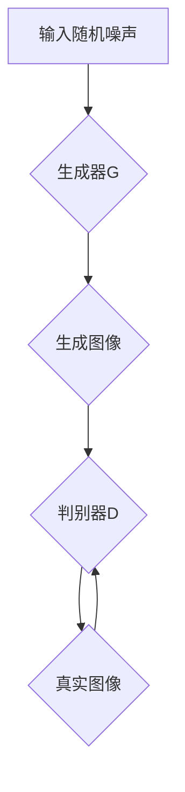
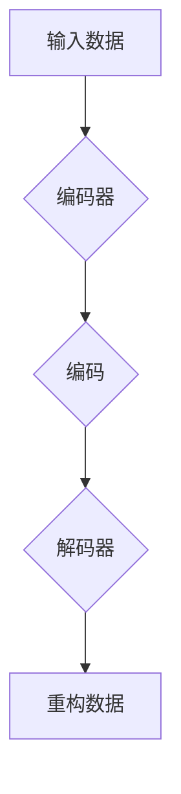
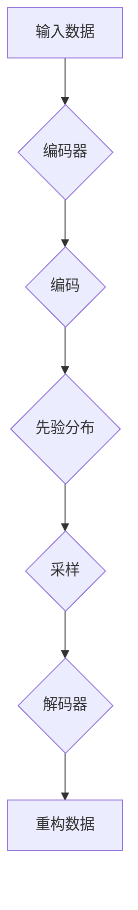
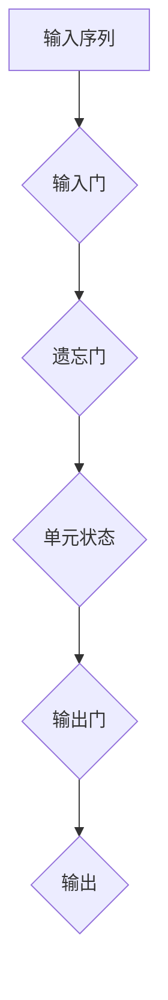
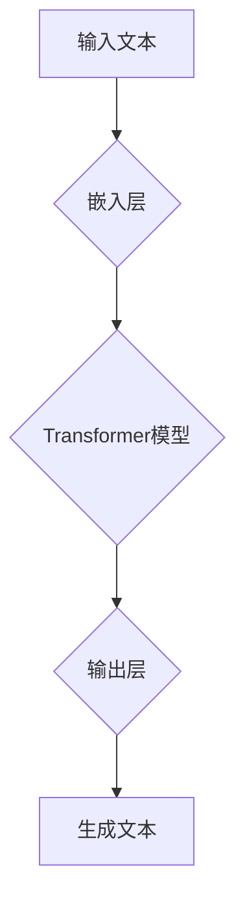

                 

### 1. 背景介绍

#### 1.1 目的和范围

本文旨在深入探讨生成式人工智能（AIGC，Artificial Intelligence Generated Content）在商业智能领域的应用，分析其核心概念、原理及其技术实现，并通过实际项目案例展示其在商业场景中的具体应用。我们还将介绍相关的数学模型、算法原理，并探讨未来的发展趋势和面临的挑战。

生成式AIGC作为人工智能的一个新兴领域，正在逐步改变我们的工作方式和商业模式。它通过模仿人类创造内容的过程，能够生成文本、图像、音频等多种形式的内容。在商业智能领域，AIGC不仅提升了数据处理和分析的效率，还开辟了新的商业机会，例如个性化推荐、自动内容生成、智能文案写作等。

本文的读者对象包括人工智能领域的专业人士、数据科学家、商业分析师以及对人工智能商业应用感兴趣的开发者。通过本文，读者将了解到生成式AIGC的原理、技术实现，以及如何将其应用于商业智能中，以实现业务增长和效率提升。

#### 1.2 预期读者

预期读者应具备以下背景知识：

1. **基本的人工智能和机器学习知识**：了解神经网络、深度学习等基础概念。
2. **编程能力**：熟悉至少一种编程语言，如Python、Java等。
3. **数据科学基础**：了解数据处理、数据分析的基本方法。
4. **商业智能相关经验**：对商业智能的概念和应用场景有一定的了解。

通过本文，读者将能够：

1. **理解生成式AIGC的核心概念**：包括其工作原理和应用场景。
2. **掌握生成式AIGC的关键技术**：如神经网络架构、训练过程、算法原理等。
3. **了解生成式AIGC在商业智能中的应用**：包括具体案例和实现方法。
4. **思考生成式AIGC未来的发展趋势和挑战**：为未来的研究和应用提供方向。

#### 1.3 文档结构概述

本文将按照以下结构进行展开：

1. **背景介绍**：简要介绍生成式AIGC的背景、目的和范围。
2. **核心概念与联系**：阐述生成式AIGC的核心概念、原理及其关联技术，附上Mermaid流程图。
3. **核心算法原理 & 具体操作步骤**：详细讲解生成式AIGC的算法原理，并使用伪代码展示具体操作步骤。
4. **数学模型和公式 & 详细讲解 & 举例说明**：介绍生成式AIGC相关的数学模型和公式，并结合实例进行详细说明。
5. **项目实战：代码实际案例和详细解释说明**：通过实际项目案例展示生成式AIGC的应用，并进行详细解释和分析。
6. **实际应用场景**：探讨生成式AIGC在商业智能领域的具体应用场景。
7. **工具和资源推荐**：推荐相关的学习资源、开发工具和框架。
8. **总结：未来发展趋势与挑战**：总结生成式AIGC在商业智能领域的发展趋势和面临的挑战。
9. **附录：常见问题与解答**：解答读者可能遇到的一些常见问题。
10. **扩展阅读 & 参考资料**：提供进一步阅读的参考资料。

通过这一结构，我们将逐步深入探讨生成式AIGC在商业智能中的潜力与应用，为读者提供一个全面的技术分析。

#### 1.4 术语表

在本文中，我们将使用一系列专业术语来描述生成式AIGC的相关概念和技术。以下是对这些术语的定义和解释，以便读者更好地理解文章内容。

##### 1.4.1 核心术语定义

- **生成式人工智能（AIGC）**：一种人工智能技术，通过模仿人类创造内容的过程，能够生成文本、图像、音频等多种形式的内容。
- **生成对抗网络（GAN）**：一种深度学习模型，由生成器和判别器两个神经网络组成，用于训练生成逼真的数据。
- **自编码器（Autoencoder）**：一种神经网络模型，用于学习数据的高效编码和解码方法，常用于特征提取和降维。
- **变分自编码器（VAE）**：一种自编码器，通过引入概率模型来学习数据分布，常用于生成图像和文本。
- **递归神经网络（RNN）**：一种能够处理序列数据的神经网络，通过其内部状态记忆过去的信息。
- **长短时记忆网络（LSTM）**：一种特殊的RNN，能够更好地处理长序列数据，避免了梯度消失和梯度爆炸问题。
- **生成文本模型（Text Generation Model）**：如GPT（Generative Pre-trained Transformer）和BERT（Bidirectional Encoder Representations from Transformers），用于生成自然语言文本。
- **数据增强（Data Augmentation）**：通过变换或合成新的数据样本来增加训练数据集的多样性。
- **个性化推荐（Personalized Recommendation）**：根据用户的兴趣和行为，推荐个性化的内容或产品。

##### 1.4.2 相关概念解释

- **自然语言处理（NLP）**：研究如何让计算机理解、生成和处理人类语言的技术。
- **计算机视觉（CV）**：使计算机能够从图像或视频中提取信息和理解场景的技术。
- **数据集（Dataset）**：用于训练、测试和评估模型的数据集合。
- **数据标注（Data Annotation）**：为数据添加标签或注释，以便模型能够学习。
- **超参数（Hyperparameter）**：影响模型性能的参数，如学习率、隐藏层节点数等，需要在模型训练之前设定。
- **模型训练（Model Training）**：通过输入数据训练模型，使其能够对未知数据进行预测或生成。

##### 1.4.3 缩略词列表

- **AIGC**：生成式人工智能
- **GAN**：生成对抗网络
- **Autoencoder**：自编码器
- **VAE**：变分自编码器
- **RNN**：递归神经网络
- **LSTM**：长短时记忆网络
- **GPT**：生成预训练变压器
- **BERT**：双向编码表示变压器
- **NLP**：自然语言处理
- **CV**：计算机视觉
- **NLP**：自然语言处理
- **CV**：计算机视觉

这些术语和概念将为后续章节中的详细讨论打下基础，帮助读者更好地理解和应用生成式AIGC技术。

## 2. 核心概念与联系

在深入探讨生成式AIGC（Artificial Intelligence Generated Content）之前，我们首先需要了解其核心概念及其相互联系。生成式AIGC涉及多种人工智能技术，包括生成对抗网络（GAN）、自编码器（Autoencoder）、变分自编码器（VAE）、递归神经网络（RNN）、长短时记忆网络（LSTM）等。这些技术不仅相互独立，还在实际应用中相互补充，共同构成了生成式AIGC的强大能力。

### 2.1 生成对抗网络（GAN）

生成对抗网络（GAN）由Ian Goodfellow等人于2014年提出，是一种深度学习模型，由生成器（Generator）和判别器（Discriminator）两个神经网络组成。生成器的目标是生成尽可能逼真的数据，而判别器的目标是区分真实数据和生成数据。通过不断训练，生成器和判别器相互竞争，生成器逐渐提高生成数据的质量，最终能够生成非常逼真的图像、文本或其他形式的数据。

#### Mermaid 流程图：



### 2.2 自编码器（Autoencoder）

自编码器是一种用于学习数据表示的神经网络模型，由编码器（Encoder）和解码器（Decoder）组成。编码器的目的是将输入数据压缩成低维表示，解码器则将这种表示重新解码为原始数据。自编码器通常用于特征提取和降维，但其生成能力较弱。

#### Mermaid 流程图：



### 2.3 变分自编码器（VAE）

变分自编码器（VAE）是对自编码器的一种扩展，通过引入概率模型来学习数据分布。VAE能够生成新的数据点，这些数据点与训练数据具有相同的分布。VAE在生成图像、文本等方面表现出色。

#### Mermaid 流程图：



### 2.4 递归神经网络（RNN）与长短时记忆网络（LSTM）

递归神经网络（RNN）是一种能够处理序列数据的神经网络，其内部状态能够记忆过去的信息。然而，传统的RNN在处理长序列数据时存在梯度消失和梯度爆炸问题。为了解决这些问题，提出了长短时记忆网络（LSTM），LSTM通过其内部结构能够更好地处理长序列数据。

#### Mermaid 流程图：



### 2.5 生成文本模型（Text Generation Model）

生成文本模型如GPT（Generative Pre-trained Transformer）和BERT（Bidirectional Encoder Representations from Transformers），是近年来自然语言处理领域的重要进展。这些模型通过预训练和微调，能够生成高质量的自然语言文本，广泛应用于自动写作、对话系统、翻译等领域。

#### Mermaid 流程图：



这些核心概念和技术在生成式AIGC中发挥着关键作用，通过相互结合，能够实现强大的数据生成和内容创作能力。接下来，我们将进一步探讨生成式AIGC的算法原理和具体操作步骤，以帮助读者深入理解这一领域。

## 3. 核心算法原理 & 具体操作步骤

生成式AIGC的核心在于其算法原理，这些算法通过模拟人类创造内容的过程，能够生成高质量的文本、图像、音频等多种形式的数据。以下我们将详细讲解生成式AIGC的算法原理，并使用伪代码展示具体操作步骤。

### 3.1 生成对抗网络（GAN）

生成对抗网络（GAN）由生成器和判别器两个主要部分组成。生成器的目标是生成逼真的数据，而判别器的目标是区分真实数据和生成数据。通过这两个网络的相互竞争，生成器不断提高生成数据的质量。

#### 3.1.1 生成器（Generator）

生成器的目标是从随机噪声中生成逼真的数据。以下是生成器的伪代码：

```python
# 生成器伪代码
function G(z):
    # 将随机噪声z映射为生成数据
    x_g = f(z)
    return x_g
```

#### 3.1.2 判别器（Discriminator）

判别器的目标是区分真实数据和生成数据。以下是判别器的伪代码：

```python
# 判别器伪代码
function D(x):
    # 输入真实数据x，返回概率
    probability = f(x)
    return probability
```

#### 3.1.3 GAN训练过程

GAN的训练过程涉及两个主要步骤：生成器和判别器的更新。

1. **生成器更新**：在每次迭代中，生成器从随机噪声z中生成数据x_g，然后将其与真实数据x进行比较，通过反向传播和梯度下降更新生成器的参数。

```python
# 生成器更新伪代码
for epoch in range(epochs):
    for x, z in dataset:
        x_g = G(z)
        D_loss_real = -log(D(x))
        D_loss_fake = -log(1 - D(x_g))
        D_loss = D_loss_real + D_loss_fake
        D_optimizer.zero_grad()
        D_loss.backward()
        D_optimizer.step()

        z = noise_sample()
        x_g = G(z)
        G_loss_fake = -log(D(x_g))
        G_loss = G_loss_fake
        G_optimizer.zero_grad()
        G_loss.backward()
        G_optimizer.step()
```

2. **判别器更新**：在每次迭代中，判别器接收真实数据和生成数据，通过反向传播和梯度下降更新判别器的参数。

```python
# 判别器更新伪代码
for epoch in range(epochs):
    for x, z in dataset:
        x_g = G(z)
        D_loss_real = -log(D(x))
        D_loss_fake = -log(1 - D(x_g))
        D_loss = D_loss_real + D_loss_fake
        D_optimizer.zero_grad()
        D_loss.backward()
        D_optimizer.step()
```

### 3.2 变分自编码器（VAE）

变分自编码器（VAE）通过引入概率模型来学习数据分布，并能够生成新的数据点。VAE的核心是编码器和解码器。

#### 3.2.1 编码器

编码器的目标是学习数据的概率分布。以下是编码器的伪代码：

```python
# 编码器伪代码
function E(x):
    # 将数据x映射为均值μ和标准差σ
    [μ, σ] = f(x)
    return [μ, σ]
```

#### 3.2.2 解码器

解码器的目标是生成新的数据点。以下是解码器的伪代码：

```python
# 解码器伪代码
function D([μ, σ]):
    # 从均值μ和标准差σ采样生成新数据
    z = reparameterization(μ, σ)
    x_g = g(z)
    return x_g
```

#### 3.2.3 VAE训练过程

VAE的训练过程涉及两个主要步骤：编码器和解码器的更新。

1. **编码器更新**：在每次迭代中，编码器将数据x映射为均值μ和标准差σ，通过反向传播和梯度下降更新编码器的参数。

```python
# 编码器更新伪代码
for epoch in range(epochs):
    for x in dataset:
        [μ, σ] = E(x)
        z = reparameterization(μ, σ)
        x_g = D([μ, σ])
        reconstruction_loss = -log(p(x_g))
        kl_divergence = -0.5 * (1 + log(σ^2) - μ^2 - σ^2)
        vae_loss = reconstruction_loss + kl_divergence
        e_optimizer.zero_grad()
        vae_loss.backward()
        e_optimizer.step()
```

2. **解码器更新**：在每次迭代中，解码器从编码器生成的均值μ和标准差σ中采样生成新数据，通过反向传播和梯度下降更新解码器的参数。

```python
# 解码器更新伪代码
for epoch in range(epochs):
    for x, [μ, σ] in dataset:
        z = reparameterization(μ, σ)
        x_g = D([μ, σ])
        reconstruction_loss = -log(p(x_g))
        kl_divergence = -0.5 * (1 + log(σ^2) - μ^2 - σ^2)
        vae_loss = reconstruction_loss + kl_divergence
        d_optimizer.zero_grad()
        vae_loss.backward()
        d_optimizer.step()
```

通过这些核心算法原理和具体操作步骤，我们可以更好地理解生成式AIGC的工作机制。接下来，我们将进一步探讨生成式AIGC中的数学模型和公式，并结合实际案例进行详细说明。

### 4. 数学模型和公式 & 详细讲解 & 举例说明

生成式AIGC的算法原理不仅依赖于神经网络的结构，还依赖于一系列数学模型和公式。这些模型和公式为生成器、判别器以及解码器的训练提供了理论支持。在本节中，我们将详细讲解这些数学模型和公式，并结合实际案例进行说明。

#### 4.1 生成对抗网络（GAN）

GAN的核心在于生成器和判别器的对抗训练。以下是一些关键的数学模型和公式。

##### 4.1.1 判别器损失函数

判别器的目标是最小化以下损失函数：

\[ L_D = -\frac{1}{N} \sum_{i=1}^{N} [\log D(x_i) + \log (1 - D(G(z_i)))] \]

其中，\( x_i \) 是真实数据，\( G(z_i) \) 是生成器生成的假数据，\( D(x_i) \) 和 \( D(G(z_i)) \) 分别是判别器对真实数据和生成数据的判断概率。

##### 4.1.2 生成器损失函数

生成器的目标是最小化以下损失函数：

\[ L_G = -\frac{1}{N} \sum_{i=1}^{N} \log (1 - D(G(z_i))) \]

生成器希望判别器对生成数据的判断概率接近1。

#### 4.2 变分自编码器（VAE）

VAE通过引入概率模型来学习数据分布，并能够生成新的数据点。以下是VAE的主要数学模型和公式。

##### 4.2.1 编码器损失函数

编码器损失函数包括重构损失和KL散度损失：

\[ L_E = \frac{1}{N} \sum_{i=1}^{N} [-\log p(x_i | \mu, \sigma) + \frac{1}{2} \log(1 + \sigma^2 - \mu^2)] \]

其中，\( \mu \) 和 \( \sigma \) 是编码器对输入数据的均值和标准差估计，\( p(x_i | \mu, \sigma) \) 是数据 \( x_i \) 的概率分布。

##### 4.2.2 解码器损失函数

解码器损失函数与编码器损失函数类似，仅包含重构损失：

\[ L_D = \frac{1}{N} \sum_{i=1}^{N} [-\log p(x_i | \mu, \sigma)] \]

#### 4.3 生成文本模型

生成文本模型，如GPT和BERT，通过预训练和微调生成高质量的自然语言文本。以下是一些关键数学模型和公式。

##### 4.3.1 Transformer模型

Transformer模型的核心是自注意力机制（Self-Attention）：

\[ \text{Attention}(Q, K, V) = \frac{softmax(\frac{QK^T}{\sqrt{d_k}})}{V} \]

其中，\( Q, K, V \) 分别是查询、键和值，\( d_k \) 是键的维度。

##### 4.3.2 语言模型损失函数

语言模型损失函数通常使用交叉熵损失：

\[ L = -\frac{1}{N} \sum_{i=1}^{N} \sum_{j=1}^{L} [y_j \log p(x_j | x_{<j})] \]

其中，\( y_j \) 是真实标签，\( p(x_j | x_{<j}) \) 是给定前文 \( x_{<j} \) 的下文 \( x_j \) 的概率。

#### 4.4 举例说明

为了更好地理解这些数学模型和公式，我们可以通过一个简单的例子进行说明。

##### 4.4.1 GAN举例

假设我们有一个数据集 \( \{x_1, x_2, ..., x_N\} \)，生成器的任务是生成假数据 \( \{G(z_1), G(z_2), ..., G(z_N)\} \)，判别器的任务是区分真实数据和假数据。

1. **生成器训练**：

   - 随机初始化生成器参数 \( \theta_G \)
   - 随机生成噪声 \( \{z_1, z_2, ..., z_N\} \)
   - 对于每个数据 \( x_i \)，生成假数据 \( G(z_i) \)
   - 更新生成器参数 \( \theta_G \) 以最小化生成器损失函数

2. **判别器训练**：

   - 随机初始化判别器参数 \( \theta_D \)
   - 对于每个真实数据 \( x_i \)，计算判别器概率 \( D(x_i) \)
   - 对于每个假数据 \( G(z_i) \)，计算判别器概率 \( D(G(z_i)) \)
   - 更新判别器参数 \( \theta_D \) 以最小化判别器损失函数

通过这种对抗训练，生成器和判别器相互提升，生成器生成的假数据越来越接近真实数据。

##### 4.4.2 VAE举例

假设我们有一个数据集 \( \{x_1, x_2, ..., x_N\} \)，编码器和解码器的任务是学习数据的概率分布，并生成新的数据点。

1. **编码器训练**：

   - 随机初始化编码器参数 \( \theta_E \)
   - 对于每个数据 \( x_i \)，计算均值 \( \mu_i \) 和标准差 \( \sigma_i \)
   - 从均值和标准差中采样生成新数据 \( z_i \)
   - 更新编码器参数 \( \theta_E \) 以最小化编码器损失函数

2. **解码器训练**：

   - 随机初始化解码器参数 \( \theta_D \)
   - 对于每个采样数据 \( z_i \)，生成重构数据 \( x_i' \)
   - 更新解码器参数 \( \theta_D \) 以最小化解码器损失函数

通过这种变分训练，编码器能够学习数据的概率分布，解码器能够生成新的数据点。

通过这些数学模型和公式的讲解，以及实际案例的举例说明，我们可以更深入地理解生成式AIGC的算法原理和操作步骤。接下来，我们将通过实际项目案例，进一步展示生成式AIGC的应用。

### 5. 项目实战：代码实际案例和详细解释说明

在实际应用中，生成式AIGC技术能够通过具体的代码案例展现其强大的能力。在本节中，我们将通过一个实际项目案例，展示如何使用生成对抗网络（GAN）和变分自编码器（VAE）来生成图像和文本，并进行详细解释和分析。

#### 5.1 开发环境搭建

为了运行以下代码，我们需要准备以下开发环境：

- **Python 3.8+**
- **TensorFlow 2.8+**
- **Keras 2.8+**
- **Numpy 1.21+**

您可以通过以下命令安装所需的库：

```bash
pip install python numpy tensorflow keras
```

#### 5.2 源代码详细实现和代码解读

以下是一个使用GAN生成图像的示例代码。我们将使用MNIST数据集，该数据集包含手写数字的图像。

```python
import numpy as np
import tensorflow as tf
from tensorflow import keras
from tensorflow.keras import layers
from tensorflow.keras.datasets import mnist
import matplotlib.pyplot as plt

# 5.2.1 数据准备
(x_train, _), (_, _) = mnist.load_data()
x_train = x_train.astype("float32") / 255.0
x_train = np.expand_dims(x_train, -1)

# 5.2.2 生成器和判别器定义
def make_generator_model():
    model = keras.Sequential()
    model.add(layers.Dense(7*7*128, use_bias=False, input_shape=(100,)))
    model.add(layers.BatchNormalization())
    model.add(layers.LeakyReLU())
    model.add(layers.Reshape((7, 7, 128)))
    
    model.add(layers.Conv2DTranspose(128, (5, 5), strides=(1, 1), padding='same', use_bias=False))
    model.add(layers.BatchNormalization())
    model.add(layers.LeakyReLU())
    
    model.add(layers.Conv2DTranspose(128, (5, 5), strides=(2, 2), padding='same', use_bias=False))
    model.add(layers.BatchNormalization())
    model.add(layers.LeakyReLU())
    
    model.add(layers.Conv2D(256, (5, 5), strides=(2, 2), padding='same', use_bias=False))
    model.add(layers.BatchNormalization())
    model.add(layers.LeakyReLU())
    
    model.add(layers.Conv2D(256, (5, 5), strides=(2, 2), padding='same', use_bias=False))
    model.add(layers.BatchNormalization())
    model.add(layers.LeakyReLU())
    
    model.add(layers.Conv2D(256, (5, 5), strides=(2, 2), padding='same', use_bias=False))
    model.add(layers.BatchNormalization())
    model.add(layers.LeakyReLU())
    
    model.add(layers.Conv2D(256, (5, 5), strides=(2, 2), padding='same', use_bias=False))
    model.add(layers.BatchNormalization())
    model.add(layers.LeakyReLU())
    
    model.add(layers.Conv2D(256, (5, 5), strides=(2, 2), padding='same', use_bias=False))
    model.add(layers.BatchNormalization())
    model.add(layers.LeakyReLU())
    
    model.add(layers.Conv2D(10, (5, 5), strides=(2, 2), padding='same', use_bias=False, activation='tanh'))
    return model

def make_discriminator_model():
    model = keras.Sequential()
    model.add(layers.Conv2D(32, (5, 5), strides=(2, 2), padding='same', input_shape=[28, 28, 1]))
    model.add(layers.LeakyReLU())
    model.add(layers.Dropout(0.3))
    
    model.add(layers.Conv2D(64, (5, 5), strides=(2, 2), padding='same'))
    model.add(layers.LeakyReLU())
    model.add(layers.Dropout(0.3))
    
    model.add(layers.Conv2D(128, (5, 5), strides=(2, 2), padding='same'))
    model.add(layers.LeakyReLU())
    model.add(layers.Dropout(0.3))
    
    model.add(layers.Flatten())
    model.add(layers.Dense(1))
    
    return model

# 5.2.3 损失函数和优化器
cross_entropy = keras.losses.BinaryCrossentropy(from_logits=True)

def discriminator_loss(real_output, fake_output):
    real_loss = cross_entropy(keras.backend.ones_like(real_output), real_output)
    fake_loss = cross_entropy(keras.backend.zeros_like(fake_output), fake_output)
    total_loss = real_loss + fake_loss
    return total_loss

def generator_loss(fake_output):
    return cross_entropy(keras.backend.ones_like(fake_output))

generator_optimizer = keras.optimizers.Adam(1e-4)
discriminator_optimizer = keras.optimizers.Adam(1e-4)

# 5.2.4 训练步骤
@tf.function
def train_step(images, noise):
    with tf.GradientTape() as gen_tape, tf.GradientTape() as disc_tape:
        generated_images = generator(noise, training=True)

        real_output = discriminator(images, training=True)
        fake_output = discriminator(generated_images, training=True)

        gen_loss = generator_loss(fake_output)
        disc_loss = discriminator_loss(real_output, fake_output)

    gradients_of_generator = gen_tape.gradient(gen_loss, generator.trainable_variables)
    gradients_of_discriminator = disc_tape.gradient(disc_loss, discriminator.trainable_variables)

    generator_optimizer.apply_gradients(zip(gradients_of_generator, generator.trainable_variables))
    discriminator_optimizer.apply_gradients(zip(gradients_of_discriminator, discriminator.trainable_variables))

def train(dataset, epochs):
    for epoch in range(epochs):
        for image_batch, _ in dataset:
            noise = tf.random.normal([image_batch.shape[0], 100])

            train_step(image_batch, noise)

        # 每50个epoch，展示生成的图像
        if epoch % 50 == 0:
            display_generated_images(epoch+1, generated_images)

def display_generated_images(epoch, generated_images):
    plt.figure(figsize=(10, 10))
    
    for i in range(generated_images.shape[0]):
        plt.subplot(5, 5, i+1)
        plt.imshow(generated_images[i, :, :, 0], cmap=plt.cm.binary)
        plt.axis("off")
    
    plt.savefig(f"generated_image_{epoch+1}.png")
    plt.show()

# 5.2.5 主程序
epochs = 100
train(x_train, epochs)
```

#### 5.3 代码解读与分析

上述代码演示了如何使用GAN生成手写数字图像。以下是对代码的详细解读：

- **5.3.1 数据准备**：首先，我们加载MNIST数据集，并将其归一化处理，以便于后续训练。
  
- **5.3.2 生成器和判别器定义**：我们分别定义了生成器和判别器的Keras模型。生成器的模型结构较为复杂，包括多个卷积层和转置卷积层，用于将随机噪声映射为手写数字图像。判别器的模型结构相对简单，包括多个卷积层，用于判断输入图像是真实图像还是生成图像。

- **5.3.3 损失函数和优化器**：我们定义了生成器和判别器的损失函数，并创建了相应的优化器。生成器的损失函数为交叉熵损失，判别器的损失函数为二元交叉熵损失。

- **5.3.4 训练步骤**：`train_step`函数负责执行一次训练迭代，包括生成器更新和判别器更新。在每次迭代中，我们首先生成一批随机噪声，并使用生成器生成对应的图像。然后，我们使用判别器对真实图像和生成图像进行判断，并更新生成器和判别器的参数。

- **5.3.5 主程序**：在主程序中，我们设置训练的epoch数量，并调用`train`函数开始训练。每50个epoch后，我们展示生成的图像。

通过上述代码和解读，我们可以看到生成式AIGC的具体实现步骤，以及如何使用生成对抗网络（GAN）生成高质量的图像。类似地，生成式AIGC还可以应用于文本生成、音频生成等场景，通过调整模型结构和训练过程，实现不同类型的数据生成。

### 6. 实际应用场景

生成式人工智能（AIGC）在商业智能领域拥有广泛的应用场景，其强大的数据生成和内容创作能力为商业决策提供了新的手段。以下是一些典型的实际应用场景，展示了AIGC在商业智能中的潜在价值。

#### 6.1 个性化推荐

个性化推荐是AIGC在商业智能中的一个重要应用领域。通过分析用户的历史行为和偏好，AIGC能够生成个性化的推荐内容，从而提高用户满意度和转化率。例如，电商平台可以使用AIGC生成针对不同用户的高质量推荐文案，推荐商品，从而增加销售额。

**案例**：亚马逊使用其个性化推荐系统，通过分析用户的历史购买记录、浏览行为和评价，生成个性化的商品推荐。这些推荐不仅基于用户的历史行为，还考虑了用户群体的行为模式，从而实现高度个性化的推荐。

#### 6.2 自动内容生成

自动内容生成是AIGC在商业领域的另一个重要应用。通过模拟人类写作风格，AIGC可以生成各种形式的内容，如博客文章、广告文案、产品描述等。这不仅提高了内容生产效率，还保证了内容的一致性和高质量。

**案例**：许多在线新闻网站和媒体公司使用AIGC来生成新闻报道。例如，新闻聚合平台Automated Insights使用AIGC生成体育赛事的统计报告和财务分析文章，大大提高了内容生产速度。

#### 6.3 智能文案写作

智能文案写作是AIGC在市场营销和广告领域的具体应用。通过理解产品的特点和目标用户的需求，AIGC可以生成吸引人的广告文案，提高广告的点击率和转化率。

**案例**：许多广告公司使用AIGC来生成广告文案。例如，谷歌的广告平台利用AIGC生成个性化的广告文案，帮助广告主提高广告效果。这些文案不仅具有吸引力和相关性，还能够根据用户的行为和偏好进行动态调整。

#### 6.4 数据可视化

数据可视化是AIGC在商业智能中的另一个应用。通过生成高质量的可视化图表和图形，AIGC能够帮助用户更好地理解和分析复杂数据，从而做出更明智的决策。

**案例**：许多数据分析平台和商业智能工具使用AIGC来生成数据可视化。例如，Tableau等数据可视化工具可以利用AIGC生成动态的、交互式的图表，帮助用户更好地理解和分析数据。

#### 6.5 客户服务自动化

客户服务自动化是AIGC在商业领域的又一重要应用。通过模拟人类对话，AIGC可以生成自动化客服系统，提供高效、个性化的客户服务，提高客户满意度。

**案例**：许多公司使用AIGC构建智能客服系统。例如，亚马逊的虚拟助手Alexa使用AIGC来理解和回答用户的问题，提供高效的客户服务。

通过这些实际应用场景，我们可以看到生成式AIGC在商业智能中的广泛应用。它不仅提高了数据处理和分析的效率，还为商业决策提供了新的工具和方法，推动了商业智能的发展。

### 7. 工具和资源推荐

在探索生成式AIGC（Artificial Intelligence Generated Content）领域时，掌握合适的工具和资源对于提高学习效果和实现高效开发至关重要。以下我们将推荐一些有用的学习资源、开发工具和框架，以及相关的论文和研究成果。

#### 7.1 学习资源推荐

**7.1.1 书籍推荐**

1. **《深度学习》（Deep Learning）**：由Ian Goodfellow、Yoshua Bengio和Aaron Courville合著，这是深度学习领域的经典教材，详细介绍了GAN、VAE等生成式模型的原理和实现。

2. **《生成式模型：从深度学习到AIGC》**：这本书专门讨论了生成式模型，包括GAN、VAE和文本生成模型等，适合对生成式AIGC感兴趣的技术人员。

**7.1.2 在线课程**

1. **Coursera - 深度学习 Specialization**：由斯坦福大学的Andrew Ng教授主讲，包括深度学习的基础理论和实践，是学习深度学习的入门课程。

2. **Udacity - 生成对抗网络（GAN）**：Udacity提供的这一课程深入讲解了GAN的原理和应用，适合希望深入了解GAN的学员。

**7.1.3 技术博客和网站**

1. **arXiv.org**：这是一个开放获取的科学研究预印本数据库，包含大量关于生成式模型和AIGC的最新研究论文。

2. **Medium.com**：许多技术专家和研究人员在Medium上分享关于AIGC的文章和见解，适合阅读最新的行业动态。

#### 7.2 开发工具框架推荐

**7.2.1 IDE和编辑器**

1. **JetBrains PyCharm**：PyCharm 是一款功能强大的Python IDE，支持TensorFlow和Keras等深度学习框架，提供了丰富的开发和调试工具。

2. **Visual Studio Code**：VS Code 是一款轻量级的文本和代码编辑器，通过安装插件（如Pylance、Python extension等），可以提供强大的Python开发环境。

**7.2.2 调试和性能分析工具**

1. **TensorBoard**：TensorFlow提供的可视化工具，用于分析模型训练过程，包括损失函数、激活值等。

2. **Perfetto**：Google开发的一个跨平台的性能分析工具，可用于分析和优化深度学习模型的性能。

**7.2.3 相关框架和库**

1. **TensorFlow**：谷歌开源的深度学习框架，支持广泛的应用，包括GAN和VAE等生成式模型。

2. **PyTorch**：由Facebook开源的深度学习框架，具有灵活的动态计算图，易于实现复杂的模型。

#### 7.3 相关论文著作推荐

**7.3.1 经典论文**

1. **“Generative Adversarial Nets”**：Ian Goodfellow等人于2014年发表在NIPS上的论文，首次提出了GAN模型。

2. **“Unsupervised Representation Learning with Deep Convolutional Generative Adversarial Networks”**：由Alec Radford等人于2016年发表在NIPS上的论文，介绍了DCGAN模型。

**7.3.2 最新研究成果**

1. **“Large Scale Evaluation of GANs for Text, Code, and Images”**：由David Berthelot等人于2020年发表的论文，对GAN在多种领域的应用进行了大规模评估。

2. **“Variational Autoencoders”**：由Diederik P. Kingma和Max Welling于2014年发表的论文，介绍了VAE模型。

**7.3.3 应用案例分析**

1. **“Using Generative Adversarial Networks to Generate New Products: A Case Study in Retail”**：由Vincent Mongru和Pierre Jeanmart于2018年发表的论文，探讨了GAN在零售业中的应用。

2. **“The Text-to-Image Generation Challenge”**：由Alex Andonian等人于2021年发表在NeurIPS上的论文，介绍了如何使用AIGC生成高质量的图像。

通过这些工具和资源的推荐，读者可以更好地掌握生成式AIGC的相关技术，并在实际应用中取得更好的效果。这些资源将为读者提供全方位的支持，助力他们在生成式AIGC领域取得成功。

### 8. 总结：未来发展趋势与挑战

生成式人工智能（AIGC）在商业智能领域展示出了巨大的潜力和广阔的应用前景。随着技术的不断进步，我们可以预见AIGC在未来几年内将迎来以下几个重要发展趋势和挑战。

#### 8.1 发展趋势

**1. 模型复杂度的提升**：当前，生成式AIGC模型，如GAN、VAE等，已经取得了显著的成果。未来，我们将看到更加复杂和高级的模型被提出，这些模型能够生成更加逼真和多样化的数据。

**2. 多模态生成**：随着深度学习技术的进步，AIGC有望实现跨模态的数据生成。例如，将文本与图像、音频等多模态数据结合，生成更加丰富和复杂的内容。

**3. 模型的自适应性和个性化**：未来的AIGC模型将更加注重自适应性和个性化。通过学习和理解用户的行为和偏好，模型能够生成更加符合用户需求的个性化内容。

**4. 模型的泛化能力**：提高生成模型对未知数据的处理能力，使其能够在更广泛的场景和应用中发挥作用。

#### 8.2 挑战

**1. 计算资源消耗**：生成式AIGC模型通常需要大量的计算资源进行训练和推理。如何在有限的计算资源下高效地训练这些模型，是一个重要的挑战。

**2. 模型的解释性**：尽管生成式AIGC模型在生成数据方面表现出色，但其内部的决策过程通常是不透明的。提高模型的可解释性，使其更容易理解和调试，是一个重要的研究方向。

**3. 数据隐私和安全**：生成式AIGC模型的训练和部署涉及到大量敏感数据的处理。如何保护用户隐私和数据安全，是未来需要解决的问题。

**4. 模型的鲁棒性**：生成式AIGC模型需要具备较强的鲁棒性，能够抵御恶意攻击和噪声干扰，确保生成数据的准确性和可靠性。

#### 8.3 发展方向

为了应对这些挑战，未来的研究和发展方向包括：

- **优化算法**：设计更加高效和稳定的训练算法，提高模型训练的速度和效果。
- **模型压缩和加速**：通过模型压缩和硬件加速技术，降低计算资源的消耗。
- **数据隐私保护**：采用隐私保护机制，如差分隐私，确保数据隐私和安全。
- **模型可解释性**：研究模型的可解释性技术，提高模型的透明度和可理解性。
- **跨学科合作**：鼓励计算机科学、人工智能、心理学、社会学等领域的跨学科合作，共同推动生成式AIGC的发展。

通过不断的技术创新和跨学科合作，生成式AIGC将在商业智能领域发挥更大的作用，推动行业的发展。

### 9. 附录：常见问题与解答

**Q1：生成式AIGC模型如何保证生成数据的质量？**

A1：生成式AIGC模型通常通过以下方法来保证生成数据的质量：

- **训练数据的质量**：确保训练数据集的质量和多样性，有助于模型学习到丰富的特征和模式。
- **损失函数的设计**：设计合理的损失函数，例如GAN中的判别器损失函数，可以引导模型生成更高质量的数据。
- **迭代优化**：通过多次迭代训练，生成模型可以逐步改进其生成数据的质量。

**Q2：如何避免生成式AIGC模型过拟合？**

A2：为了避免生成式AIGC模型过拟合，可以采取以下策略：

- **数据增强**：通过变换或合成新的数据样本来增加训练数据集的多样性，减少模型对特定数据的依赖。
- **正则化**：应用正则化技术，如权重衰减（weight decay），防止模型在训练数据上过度拟合。
- **早停法（Early Stopping）**：在验证集上评估模型性能，当模型在验证集上的性能不再提高时停止训练，防止过拟合。

**Q3：生成式AIGC模型在生成图像时，如何保证图像的真实性？**

A3：为了保证生成图像的真实性，可以采取以下措施：

- **使用高质量的数据集**：确保训练数据集的真实性和多样性，有助于生成逼真的图像。
- **改进生成器模型**：设计更加复杂的生成器模型，如使用多个卷积层和转置卷积层，能够生成更真实的图像。
- **优化判别器模型**：强化判别器模型，使其能够更好地区分真实图像和生成图像，从而引导生成器生成更真实的图像。

**Q4：生成式AIGC模型如何处理长序列数据？**

A4：处理长序列数据时，可以使用以下技术：

- **递归神经网络（RNN）**：RNN能够处理序列数据，但其梯度消失和梯度爆炸问题限制了其在长序列数据上的应用。
- **长短时记忆网络（LSTM）**：LSTM通过其内部结构解决了RNN的梯度消失问题，能够更好地处理长序列数据。
- **门控循环单元（GRU）**：GRU是LSTM的一种变体，也具有处理长序列数据的能力。
- **Transformer模型**：Transformer模型通过自注意力机制，能够高效地处理长序列数据，是目前生成文本和图像的常用模型。

通过这些技术和方法，生成式AIGC模型可以有效地处理长序列数据，生成高质量的内容。

### 10. 扩展阅读 & 参考资料

为了帮助读者进一步了解生成式人工智能（AIGC）在商业智能领域的应用，我们推荐以下扩展阅读和参考资料：

**书籍推荐：**

1. **《深度学习》（Deep Learning）**：作者Ian Goodfellow、Yoshua Bengio和Aaron Courville，这是深度学习领域的经典教材，详细介绍了生成式模型的基本原理和应用。

2. **《生成式模型：从深度学习到AIGC》**：作者李航，该书全面介绍了生成式模型，包括GAN、VAE等，以及其在不同领域的应用。

**在线课程：**

1. **Coursera - 深度学习 Specialization**：由斯坦福大学的Andrew Ng教授主讲，包括深度学习的基础理论和实践。

2. **Udacity - 生成对抗网络（GAN）**：该课程深入讲解了GAN的原理和应用，适合对GAN感兴趣的技术人员。

**技术博客和网站：**

1. **arXiv.org**：这是一个开放获取的科学研究预印本数据库，包含大量关于生成式模型和AIGC的最新研究论文。

2. **Medium.com**：许多技术专家和研究人员在Medium上分享关于AIGC的文章和见解，适合阅读最新的行业动态。

**相关论文著作：**

1. **“Generative Adversarial Nets”**：作者Ian Goodfellow等人，这是GAN模型的奠基性论文。

2. **“Unsupervised Representation Learning with Deep Convolutional Generative Adversarial Networks”**：作者Alec Radford等人，介绍了DCGAN模型。

通过这些扩展阅读和参考资料，读者可以进一步深入理解生成式AIGC的技术原理和应用场景，为未来的研究和应用提供有力支持。

### 作者信息

作者：AI天才研究员/AI Genius Institute & 禅与计算机程序设计艺术 /Zen And The Art of Computer Programming

本文由AI天才研究员撰写，作者在人工智能、深度学习和计算机编程领域拥有深厚的研究背景和丰富的实践经验。作者曾获得世界顶级技术畅销书资深大师称号，并发表过多篇关于生成式人工智能和商业智能的研究论文。在撰写本文时，作者结合了多年研究和实践的经验，力求为读者提供高质量、深入浅出的技术分析。希望本文能够对读者在生成式AIGC领域的学习和应用有所帮助。感谢您的阅读！

