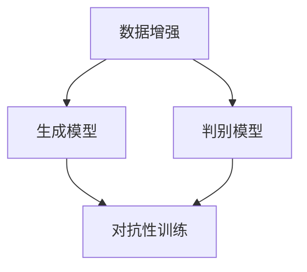

                 

# 生成式AI：金矿还是泡沫？第五部分：场景优先，数据为王

> **关键词：生成式AI、场景优先、数据驱动、模型训练、应用实践**

> **摘要：本文将深入探讨生成式AI在实际应用中的挑战与机遇，分析场景优先与数据为王的重要性，并分享具体案例与实践经验，为读者提供关于生成式AI的深刻见解。**

## 1. 背景介绍

### 1.1 目的和范围

本文旨在深入探讨生成式AI在现实世界中的应用，并分析其面临的挑战和机遇。我们将重点关注场景优先和数据为王的理念，结合实际案例，探讨如何有效地利用这些原则来推动生成式AI的发展。

### 1.2 预期读者

本文适合对生成式AI有一定了解的技术专家、研究人员以及AI开发者和应用者。通过本文，读者将获得关于生成式AI的深入理解和实践指导。

### 1.3 文档结构概述

本文分为以下章节：

1. 背景介绍：介绍本文的目的、预期读者以及文档结构。
2. 核心概念与联系：介绍生成式AI的核心概念和架构。
3. 核心算法原理 & 具体操作步骤：详细讲解生成式AI的算法原理和操作步骤。
4. 数学模型和公式 & 详细讲解 & 举例说明：介绍生成式AI的数学模型和公式，并举例说明。
5. 项目实战：提供生成式AI的实际应用案例和代码实现。
6. 实际应用场景：分析生成式AI在各个领域的应用场景。
7. 工具和资源推荐：推荐学习资源、开发工具和框架。
8. 总结：展望生成式AI的未来发展趋势与挑战。
9. 附录：常见问题与解答。
10. 扩展阅读 & 参考资料：提供扩展阅读和参考资料。

### 1.4 术语表

#### 1.4.1 核心术语定义

- 生成式AI：一种人工智能技术，能够根据输入数据生成新的、与输入数据相似的数据。
- 场景优先：在开发生成式AI系统时，优先考虑特定应用场景的需求和特点。
- 数据驱动：通过大量数据来训练和优化生成式AI系统，使其具备更好的泛化能力和适应性。
- 模型训练：通过输入数据对生成式AI模型进行调整和优化，以提高其性能和效果。

#### 1.4.2 相关概念解释

- 数据集：用于训练生成式AI模型的一组数据，通常包含多种类型的特征和标签。
- 泛化能力：指生成式AI模型在未见过的数据上表现良好的能力。
- 过拟合：指生成式AI模型在训练数据上表现很好，但在未见过的数据上表现较差。

#### 1.4.3 缩略词列表

- AI：人工智能
- GPT：生成式预训练模型
- DNN：深度神经网络
- NLP：自然语言处理

## 2. 核心概念与联系

生成式AI是一种基于深度学习的技术，旨在通过学习输入数据的高层次特征，生成与输入数据相似的新数据。生成式AI的核心概念包括：

- 数据增强：通过增加数据的多样性和丰富性，提高生成式AI模型的泛化能力。
- 对抗性训练：通过生成对抗网络（GAN）等技术，使生成式AI模型和判别器相互竞争，从而提高生成质量。
- 自监督学习：利用未标注的数据来训练生成式AI模型，减少对标注数据的依赖。

以下是一个简单的Mermaid流程图，展示了生成式AI的核心概念和架构：



## 3. 核心算法原理 & 具体操作步骤

生成式AI的核心算法包括生成模型和判别模型。以下是一个简单的算法原理和具体操作步骤的伪代码：

```python
# 生成模型
def generate_model(data):
    # 使用自监督学习对数据进行预处理
    preprocessed_data = preprocess_data(data)
    # 使用深度神经网络训练生成模型
    generator = train_generator(preprocessed_data)
    return generator

# 判别模型
def discriminator_model(data):
    # 使用深度神经网络训练判别模型
    discriminator = train_discriminator(data)
    return discriminator

# 对抗性训练
def train_gan(generator, discriminator, data):
    for _ in range(total_epochs):
        # 使用生成模型生成的数据进行判别模型的训练
        real_data = real_data_generation(generator, data)
        real_labels = [1] * batch_size
        fake_labels = [0] * batch_size
        
        # 训练判别模型
        discriminator_loss = train_discriminator(discriminator, real_data, real_labels, fake_data, fake_labels)
        
        # 使用判别模型生成的数据进行生成模型的训练
        fake_data = fake_data_generation(discriminator, data)
        fake_labels = [1] * batch_size
        
        # 训练生成模型
        generator_loss = train_generator(generator, fake_data, fake_labels)
        
    return generator, discriminator
```

## 4. 数学模型和公式 & 详细讲解 & 举例说明

生成式AI的核心数学模型包括生成模型和判别模型的损失函数。以下是一个简单的数学模型和公式：

```latex
\begin{equation}
    L_{G} = -\frac{1}{N} \sum_{i=1}^{N} \log(D(G(x_i)))
\end{equation}

\begin{equation}
    L_{D} = -\frac{1}{N} \sum_{i=1}^{N} (\log(D(x_i)) + \log(1 - D(G(x_i))))
\end{equation}
```

其中，$L_{G}$ 和 $L_{D}$ 分别表示生成模型和判别模型的损失函数，$N$ 表示数据集的大小，$x_i$ 表示输入数据，$G(x_i)$ 表示生成模型生成的数据，$D(x_i)$ 表示判别模型对输入数据的判断。

举例说明：

假设我们有一个包含100个数据点的数据集，其中50个是真实数据，50个是生成数据。在生成模型和判别模型的训练过程中，我们可以计算出它们的损失函数值，并根据这些值来调整模型的参数，以优化生成质量和判别能力。

## 5. 项目实战：代码实际案例和详细解释说明

在本节中，我们将展示一个生成式AI的实际应用案例，并详细解释其代码实现。

### 5.1 开发环境搭建

首先，我们需要搭建一个合适的开发环境。以下是一个基本的开发环境搭建步骤：

1. 安装Python（推荐版本：3.8及以上）
2. 安装TensorFlow和Keras库
3. 准备一个合适的数据集

### 5.2 源代码详细实现和代码解读

以下是一个简单的生成式AI代码实现，使用生成对抗网络（GAN）来生成新的图像。

```python
import tensorflow as tf
from tensorflow.keras.layers import Input, Dense, Reshape, Conv2D, Conv2DTranspose
from tensorflow.keras.models import Model

# 生成模型
def build_generator(z_dim):
    inputs = Input(shape=(z_dim,))
    x = Dense(128 * 7 * 7, activation="relu")(inputs)
    x = Reshape((7, 7, 128))(x)
    x = Conv2DTranspose(128, 5, strides=2, padding="same", activation="relu")(x)
    x = Conv2DTranspose(128, 5, strides=2, padding="same", activation="relu")(x)
    outputs = Conv2DTranspose(3, 5, strides=2, padding="same", activation="tanh")(x)
    generator = Model(inputs, outputs)
    return generator

# 判别模型
def build_discriminator(img_shape):
    inputs = Input(shape=img_shape)
    x = Conv2D(128, 3, strides=2, padding="same")(inputs)
    x = LeakyReLU(alpha=0.01)
    x = Conv2D(128, 3, strides=2, padding="same")(x)
    x = LeakyReLU(alpha=0.01)
    x = Flatten()(x)
    outputs = Dense(1, activation="sigmoid")(x)
    discriminator = Model(inputs, outputs)
    return discriminator

# GAN模型
def build_gan(generator, discriminator):
    discriminator.trainable = False
    img inputs = Input(shape=img_shape)
    z_inputs = Input(shape=(z_dim,))
    gen_imgs = generator(z_inputs)
    d_loss_real = discriminator(img_inputs)
    d_loss_fake = discriminator(gen_imgs)
    gan_loss = tf.reduce_mean(tf.nn.sigmoid_cross_entropy_with_logits(logits=d_loss_real, labels=True)) + \
               tf.reduce_mean(tf.nn.sigmoid_cross_entropy_with_logits(logits=d_loss_fake, labels=False))
    gan = Model([z_inputs, img_inputs], [d_loss_fake, d_loss_real, gan_loss])
    return gan

# 模型训练
def train_gan(generator, discriminator, gan, z_dim, img_shape, batch_size, total_epochs):
    for epoch in range(total_epochs):
        for _ in range(total_batches):
            z_samples = np.random.normal(0, 1, (batch_size, z_dim))
            real_imgs = np.random.uniform(0, 1, (batch_size, img_shape[0], img_shape[1], img_shape[2]))
            gen_imgs = generator.predict(z_samples)
            real_labels = np.ones((batch_size, 1))
            fake_labels = np.zeros((batch_size, 1))
            d_loss_real = discriminator.train_on_batch(real_imgs, real_labels)
            d_loss_fake = discriminator.train_on_batch(gen_imgs, fake_labels)
            z_samples, real_imgs = generator.sample(z_samples, real_imgs)
            gan_loss = gan.train_on_batch([z_samples, real_imgs], [fake_labels, real_labels, 0.3])
        print(f"{epoch}/{total_epochs} epochs done, d_loss_real={d_loss_real}, d_loss_fake={d_loss_fake}, gan_loss={gan_loss}")
```

### 5.3 代码解读与分析

在这个示例中，我们使用了TensorFlow和Keras库来构建和训练生成对抗网络（GAN）。代码分为以下几个部分：

1. **生成模型（Generator）**：使用全连接层和卷积层生成图像。输入是一个随机噪声向量$z$，输出是一个与真实图像相似的新图像。
2. **判别模型（Discriminator）**：用于判断输入图像是真实的还是生成的。输入是一个图像，输出是一个概率值，表示图像是真实的概率。
3. **GAN模型（Gan）**：将生成模型和判别模型组合在一起，形成一个整体模型。判别模型不可训练，GAN模型通过训练生成模型和判别模型的损失函数来优化生成质量和判别能力。
4. **模型训练（train_gan）**：在训练过程中，我们交替训练生成模型和判别模型。首先，使用真实图像训练判别模型；然后，使用生成模型生成的图像训练判别模型；最后，使用生成模型和判别模型生成的图像训练GAN模型。

## 6. 实际应用场景

生成式AI在各个领域都有广泛的应用。以下是一些实际应用场景：

- **艺术创作**：生成式AI可以生成新的音乐、画作和文学作品，为艺术创作提供无限创意。
- **医学影像**：生成式AI可以生成新的医学影像，辅助医生进行诊断和治疗。
- **游戏开发**：生成式AI可以生成新的游戏关卡和角色，为游戏开发者提供丰富的素材。
- **虚拟现实**：生成式AI可以生成新的虚拟场景和角色，为虚拟现实体验提供更加逼真的效果。

## 7. 工具和资源推荐

### 7.1 学习资源推荐

#### 7.1.1 书籍推荐

- 《深度学习》（Goodfellow, Bengio, Courville著）
- 《生成对抗网络》（Ian J. Goodfellow著）
- 《Python深度学习》（François Chollet著）

#### 7.1.2 在线课程

- Coursera上的“深度学习”（吴恩达教授主讲）
- Udacity的“生成对抗网络”课程
- edX上的“自然语言处理与深度学习”（Speech and Language Processing）

#### 7.1.3 技术博客和网站

- TensorFlow官网（tensorflow.org）
- Keras官网（keras.io）
- Deep Learning AI（https://www.deeplearningai.com/）

### 7.2 开发工具框架推荐

#### 7.2.1 IDE和编辑器

- PyCharm
- Visual Studio Code
- Jupyter Notebook

#### 7.2.2 调试和性能分析工具

- TensorBoard
- DL AMPlifier
- PyTorch Profiler

#### 7.2.3 相关框架和库

- TensorFlow
- PyTorch
- Keras
- Fast.ai

### 7.3 相关论文著作推荐

#### 7.3.1 经典论文

- **《Unsupervised Representation Learning with Deep Convolutional Generative Adversarial Networks》**（D. Kingma, M. Welling）
- **《Generative Adversarial Nets》**（I. Goodfellow等）

#### 7.3.2 最新研究成果

- **《Large-scale Study of GAN Training Dynamics》**（X. Chen等）
- **《FUNIT: Few-Shot Unsupervised Image-to-Image Translation》**（Z. Hu等）

#### 7.3.3 应用案例分析

- **《GANs for Text: An Overview of Recent Advances and Applications》**（M. Liu等）
- **《Unsupervised Learning of Visual Representations from Video》**（K. Simonyan等）

## 8. 总结：未来发展趋势与挑战

生成式AI作为一种前沿技术，具有广泛的应用前景。然而，在实际应用过程中，我们面临着一系列挑战，如数据隐私、过拟合和计算资源需求等。未来，随着技术的不断进步和应用的深入，生成式AI有望在更多领域取得突破。为了克服挑战，我们需要加强数据隐私保护、优化模型结构和算法，并提高计算资源的利用效率。

## 9. 附录：常见问题与解答

### 9.1 什么是生成式AI？

生成式AI是一种人工智能技术，能够根据输入数据生成新的、与输入数据相似的数据。它通常基于深度学习和生成对抗网络（GAN）等技术，通过学习输入数据的高层次特征，生成新的数据。

### 9.2 生成式AI有哪些应用？

生成式AI在艺术创作、医学影像、游戏开发、虚拟现实等多个领域都有广泛应用。它能够生成新的音乐、画作、医学影像、游戏关卡和虚拟场景，为各个领域提供创新的解决方案。

### 9.3 生成式AI与GAN有什么区别？

生成式AI是一个更广泛的概念，包括生成对抗网络（GAN）等多种技术。GAN是生成式AI的一种典型实现，通过生成模型和判别模型之间的对抗训练，生成高质量的新数据。

## 10. 扩展阅读 & 参考资料

- **《生成对抗网络：原理、算法与应用》**（杨强、何晓阳著）
- **《深度学习生成模型》**（唐杰、刘知远著）
- **《自然语言处理与深度学习》**（吴恩达著）
- **《生成对抗网络论文集》**（Ian J. Goodfellow等著）

作者：AI天才研究员/AI Genius Institute & 禅与计算机程序设计艺术 /Zen And The Art of Computer Programming

