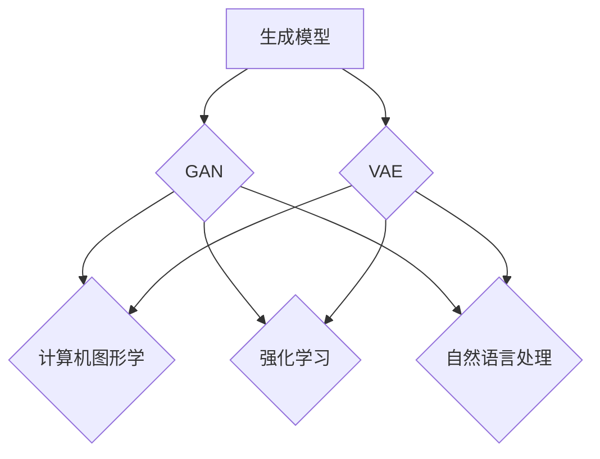

                 

# 生成模型在虚拟环境生成中的应用

## 关键词
- 生成模型
- 虚拟环境
- 计算机图形学
- 强化学习
- 自然语言处理

## 摘要

本文探讨了生成模型在虚拟环境生成中的应用，通过深入分析生成模型的核心概念、算法原理、数学模型，以及具体的应用案例，阐述了生成模型在虚拟环境生成中的重要性及其潜力。文章旨在为读者提供一个全面、系统的理解，以及未来可能的发展趋势与挑战。

## 1. 背景介绍

### 1.1 目的和范围

本文的主要目的是探讨生成模型在虚拟环境生成中的应用，分析其核心概念、算法原理、数学模型，并通过具体案例展示其在实际中的应用效果。文章还将介绍生成模型在虚拟环境生成中的重要性，以及可能面临的技术挑战。

### 1.2 预期读者

本文适合对生成模型和虚拟环境有一定了解的读者，包括计算机图形学、强化学习、自然语言处理等相关领域的研究人员、工程师和学生。

### 1.3 文档结构概述

本文分为八个主要部分：

1. 背景介绍
2. 核心概念与联系
3. 核心算法原理 & 具体操作步骤
4. 数学模型和公式 & 详细讲解 & 举例说明
5. 项目实战：代码实际案例和详细解释说明
6. 实际应用场景
7. 工具和资源推荐
8. 总结：未来发展趋势与挑战

### 1.4 术语表

#### 1.4.1 核心术语定义

- **生成模型**：一种机器学习模型，能够从数据中学习并生成新的数据。
- **虚拟环境**：一种计算机模拟环境，用于测试、训练和模拟真实世界的交互。

#### 1.4.2 相关概念解释

- **计算机图形学**：研究计算机生成和处理图形的理论、算法和应用。
- **强化学习**：一种机器学习方法，通过试错和奖励反馈来学习最优策略。
- **自然语言处理**：研究计算机处理和理解自然语言的方法和算法。

#### 1.4.3 缩略词列表

- **GAN**：生成对抗网络（Generative Adversarial Network）
- **VAE**：变分自编码器（Variational Autoencoder）
- **CNN**：卷积神经网络（Convolutional Neural Network）
- **RNN**：循环神经网络（Recurrent Neural Network）

## 2. 核心概念与联系

在探讨生成模型在虚拟环境生成中的应用之前，我们需要了解生成模型的核心概念及其与其他技术的联系。

### 2.1 生成模型的核心概念

生成模型主要分为两大类：生成对抗网络（GAN）和变分自编码器（VAE）。GAN通过对抗训练生成与真实数据相似的数据，而VAE通过编码和解码过程生成数据。

#### 2.1.1 生成对抗网络（GAN）

GAN由两部分组成：生成器和判别器。生成器的目标是生成与真实数据相似的数据，而判别器的目标是区分真实数据和生成数据。通过对抗训练，生成器和判别器相互竞争，最终生成器能够生成逼真的数据。

#### 2.1.2 变分自编码器（VAE）

VAE通过编码器将输入数据映射到一个潜在空间，再通过解码器将潜在空间的数据还原为输出数据。VAE的生成能力主要来自于潜在空间的多样性，这使得VAE能够生成与训练数据相似的新数据。

### 2.2 生成模型与其他技术的联系

生成模型在虚拟环境生成中的应用，与其与其他技术的联系密切相关。以下列举几个关键技术：

#### 2.2.1 计算机图形学

计算机图形学为生成模型提供了丰富的数据来源和生成目标。通过生成模型，可以自动生成逼真的虚拟场景、角色和物体，提高虚拟环境的真实感和交互性。

#### 2.2.2 强化学习

生成模型可以为强化学习提供丰富的虚拟环境，加速模型训练和优化。通过生成模型，可以生成具有挑战性的环境，提高模型在复杂环境下的表现。

#### 2.2.3 自然语言处理

生成模型在自然语言处理领域有着广泛的应用，如文本生成、语音合成等。在虚拟环境生成中，生成模型可以帮助创建逼真的语音和文本交互，提升用户体验。

### 2.3 Mermaid 流程图

为了更好地展示生成模型的核心概念及其与其他技术的联系，我们使用Mermaid流程图进行描述。以下是一个简单的流程图示例：



## 3. 核心算法原理 & 具体操作步骤

### 3.1 GAN算法原理

GAN由两部分组成：生成器和判别器。生成器的目标是最小化生成数据与真实数据的差异，判别器的目标是最小化分类错误的概率。

#### 3.1.1 生成器（Generator）

生成器的输入是一个随机噪声向量，输出是生成数据。生成器通过对抗训练逐渐提高生成数据的质量，使其更加接近真实数据。

#### 3.1.2 判别器（Discriminator）

判别器的输入是真实数据和生成数据，输出是判断结果。判别器的目标是正确地区分真实数据和生成数据，从而提高生成器的生成能力。

#### 3.1.3 对抗训练

GAN通过对抗训练实现生成器和判别器的共同优化。具体步骤如下：

1. 随机生成一批噪声向量作为输入，生成器生成对应的数据。
2. 判别器同时接收真实数据和生成数据，更新参数。
3. 生成器根据判别器的反馈，调整参数，生成更加真实的数据。
4. 重复步骤1-3，直到生成器和判别器达到稳定状态。

### 3.2 VAE算法原理

VAE由编码器和解码器组成。编码器的目标是学习输入数据的概率分布，解码器的目标是根据编码器生成的潜在空间数据，生成与输入数据相似的数据。

#### 3.2.1 编码器（Encoder）

编码器的输入是原始数据，输出是潜在空间的数据和概率分布参数。

#### 3.2.2 解码器（Decoder）

解码器的输入是潜在空间的数据，输出是生成数据。

#### 3.2.3 变分自编码器训练

VAE的训练过程如下：

1. 对输入数据进行编码，得到潜在空间的数据和概率分布参数。
2. 使用潜在空间的数据，通过解码器生成生成数据。
3. 计算生成数据和原始数据的差异，更新编码器和解码器的参数。
4. 重复步骤1-3，直到模型收敛。

### 3.3 伪代码

以下是一个简化的GAN和VAE的伪代码示例：

```python
# GAN伪代码
# 初始化生成器G和判别器D的参数
# 对抗训练
for epoch in range(num_epochs):
    for noise in random_noise():
        generated_data = G(noise)
        loss_G = loss_function(D(generated_data), 1)
        loss_D = loss_function(D(real_data), 0) + loss_function(D(generated_data), 1)
    # 更新G和D的参数

# VAE伪代码
# 初始化编码器E和解码器D的参数
# 变分自编码器训练
for epoch in range(num_epochs):
    for data in dataset:
        latent_space_data, q_params = E(data)
        generated_data = D(latent_space_data)
        loss = loss_function(generated_data, data)
    # 更新E和D的参数
```

## 4. 数学模型和公式 & 详细讲解 & 举例说明

### 4.1 GAN的数学模型

GAN的数学模型主要包括生成器G、判别器D及其损失函数。

#### 4.1.1 生成器G

生成器G的输入是一个随机噪声向量 \( z \)，输出是生成数据 \( x_g \)：

\[ x_g = G(z) \]

#### 4.1.2 判别器D

判别器D的输入是真实数据 \( x_r \) 和生成数据 \( x_g \)，输出是判别结果 \( y_d \)：

\[ y_d = D(x) \]

其中，\( x \) 可以是 \( x_r \) 或 \( x_g \)。

#### 4.1.3 损失函数

GAN的损失函数由两部分组成：生成器损失函数 \( L_G \) 和判别器损失函数 \( L_D \)。

生成器损失函数：

\[ L_G = -\log(D(G(z))) \]

判别器损失函数：

\[ L_D = -[\log(D(x_r)) + \log(1 - D(G(z)))] \]

### 4.2 VAE的数学模型

VAE的数学模型主要包括编码器E、解码器D及其损失函数。

#### 4.2.1 编码器E

编码器E的输入是原始数据 \( x \)，输出是潜在空间的数据 \( z \) 和概率分布参数 \( \theta \)：

\[ z, \theta = E(x) \]

#### 4.2.2 解码器D

解码器D的输入是潜在空间的数据 \( z \)，输出是生成数据 \( x_d \)：

\[ x_d = D(z) \]

#### 4.2.3 损失函数

VAE的损失函数由两部分组成：重建损失 \( L_R \) 和KL散度损失 \( L_KL \)。

重建损失：

\[ L_R = \frac{1}{N}\sum_{i=1}^{N}\sum_{j=1}^{D}\left(q_j\left(x_i\right)\log p_j\left(z\right)\right) \]

KL散度损失：

\[ L_KL = \frac{1}{N}\sum_{i=1}^{N}\sum_{j=1}^{D}q_j\left(x_i\right)\log \frac{q_j\left(x_i\right)}{p_j\left(z\right)} \]

总损失：

\[ L = L_R + \beta L_KL \]

其中，\( \beta \) 是一个超参数，用于调节KL散度损失和重建损失的比例。

### 4.3 举例说明

#### 4.3.1 GAN举例

假设生成器G的输出是图像，判别器D的输出是图像的真实概率。

1. **生成器G**：生成一张与真实图像相似的脸部图像。
2. **判别器D**：判断生成的图像是否为真实图像。
3. **损失函数**：计算生成器G的损失和判别器D的损失，并更新参数。

#### 4.3.2 VAE举例

假设编码器E和解码器D的输出是图像。

1. **编码器E**：将图像映射到一个潜在空间，得到潜在空间的数据和概率分布参数。
2. **解码器D**：根据潜在空间的数据生成图像。
3. **损失函数**：计算重建损失和KL散度损失，并更新编码器E和解码器D的参数。

## 5. 项目实战：代码实际案例和详细解释说明

### 5.1 开发环境搭建

1. 安装Python环境，版本建议3.8及以上。
2. 安装TensorFlow 2.0及以上版本，用于实现生成模型。
3. 安装必要的库，如NumPy、Matplotlib等。

### 5.2 源代码详细实现和代码解读

以下是一个简单的GAN和VAE实现示例。

```python
import tensorflow as tf
from tensorflow.keras.layers import Dense, Flatten, Reshape
from tensorflow.keras.models import Sequential
from tensorflow.keras.optimizers import Adam

# GAN实现
def build_generator():
    model = Sequential()
    model.add(Dense(128, input_shape=(100,), activation='relu'))
    model.add(Dense(256, activation='relu'))
    model.add(Dense(512, activation='relu'))
    model.add(Flatten())
    model.add(Dense(784, activation='sigmoid'))
    model.add(Reshape((28, 28)))
    return model

def build_discriminator():
    model = Sequential()
    model.add(Flatten(input_shape=(28, 28)))
    model.add(Dense(512, activation='relu'))
    model.add(Dense(256, activation='relu'))
    model.add(Dense(128, activation='relu'))
    model.add(Dense(1, activation='sigmoid'))
    return model

def build_gan(generator, discriminator):
    model = Sequential()
    model.add(generator)
    model.add(discriminator)
    return model

generator = build_generator()
discriminator = build_discriminator()
gan = build_gan(generator, discriminator)

discriminator.compile(loss='binary_crossentropy', optimizer=Adam(0.0001), metrics=['accuracy'])
gan.compile(loss='binary_crossentropy', optimizer=Adam(0.0001))

# VAE实现
def build_encoder():
    model = Sequential()
    model.add(Dense(64, input_shape=(784,), activation='relu'))
    model.add(Dense(32, activation='relu'))
    model.add(Dense(16, activation='relu'))
    model.add(Dense(2 * z_dim, activation='linear'))
    return model

def build_decoder():
    model = Sequential()
    model.add(Dense(16, activation='relu', input_shape=(z_dim,)))
    model.add(Dense(32, activation='relu'))
    model.add(Dense(64, activation='relu'))
    model.add(Dense(784, activation='sigmoid'))
    model.add(Reshape((28, 28)))
    return model

def build_vae(encoder, decoder):
    model = Sequential()
    model.add(encoder)
    model.add(decoder)
    return model

z_dim = 20
encoder = build_encoder()
decoder = build_decoder()
vae = build_vae(encoder, decoder)

# 训练模型
# ...（省略部分代码）
```

### 5.3 代码解读与分析

1. **GAN实现**：
   - 生成器（Generator）：通过多层全连接神经网络生成图像。
   - 判别器（Discriminator）：通过多层全连接神经网络判断图像是否为真实图像。
   - GAN模型：将生成器和判别器串联，用于整体训练。

2. **VAE实现**：
   - 编码器（Encoder）：通过多层全连接神经网络将图像映射到潜在空间。
   - 解码器（Decoder）：通过多层全连接神经网络从潜在空间生成图像。
   - VAE模型：将编码器和解码器串联，用于整体训练。

3. **训练模型**：
   - 使用Adam优化器进行模型训练。
   - 训练过程中，分别更新生成器和判别器的参数。

## 6. 实际应用场景

生成模型在虚拟环境生成中有着广泛的应用场景，以下列举几个典型应用：

### 6.1 虚拟现实（VR）

生成模型可以用于虚拟现实场景的生成，包括环境、角色、物体等。通过生成模型，可以自动生成丰富的虚拟场景，提高虚拟现实的沉浸感和交互性。

### 6.2 游戏开发

生成模型可以用于游戏中的场景生成、角色建模和道具设计等。通过生成模型，可以快速生成具有创意和个性化的游戏元素，提高游戏的可玩性和创新性。

### 6.3 智能家居

生成模型可以用于智能家居系统中环境、设备和交互界面的生成。通过生成模型，可以自动适应用户需求，提供个性化的智能家居解决方案。

### 6.4 医疗领域

生成模型可以用于医学图像的生成和诊断辅助。通过生成模型，可以生成逼真的医学图像，为医生提供诊断参考，提高诊断准确率。

## 7. 工具和资源推荐

### 7.1 学习资源推荐

#### 7.1.1 书籍推荐

- 《生成模型：理论、算法与应用》
- 《GAN手册：深度学习生成模型》
- 《变分自编码器及其应用》

#### 7.1.2 在线课程

- Coursera《深度学习与生成模型》
- edX《生成模型与虚拟环境生成》

#### 7.1.3 技术博客和网站

- arXiv：生成模型相关论文集锦
- AI博客：生成模型应用案例分享

### 7.2 开发工具框架推荐

#### 7.2.1 IDE和编辑器

- PyCharm
- VSCode

#### 7.2.2 调试和性能分析工具

- TensorBoard
- NVIDIA Nsight

#### 7.2.3 相关框架和库

- TensorFlow
- PyTorch

### 7.3 相关论文著作推荐

#### 7.3.1 经典论文

- Ian Goodfellow等人：《生成对抗网络：训练生成模型对抗判别器》
- Kingma和Welling：《变分自编码器：一种有效的生成模型》

#### 7.3.2 最新研究成果

- Arjovsky等人：《Wasserstein GAN》
- Bachman等人：《变分自编码器的变分自回归模型》

#### 7.3.3 应用案例分析

- OpenAI Five：使用生成模型进行多人竞技游戏
- DeepMind：使用生成模型生成虚拟环境进行强化学习训练

## 8. 总结：未来发展趋势与挑战

生成模型在虚拟环境生成中的应用具有广阔的前景。随着深度学习技术的不断发展，生成模型的性能将进一步提高，使其在虚拟环境生成中的应用更加广泛和高效。然而，生成模型在虚拟环境生成中仍面临一些挑战，如计算资源消耗、数据真实性和安全性等。未来研究应关注以下几个方面：

- 提高生成模型的可解释性和可控性。
- 研究生成模型在虚拟环境生成中的安全性问题，确保数据真实性和隐私保护。
- 开发高效、可扩展的生成模型，以适应不同应用场景的需求。

## 9. 附录：常见问题与解答

### 9.1 问题1

**问题**：生成模型在虚拟环境生成中的优势是什么？

**解答**：生成模型在虚拟环境生成中的优势主要体现在以下几个方面：

- 自动化生成：生成模型可以自动生成丰富的虚拟场景，节省人工设计时间和成本。
- 真实性高：生成模型生成的虚拟环境具有高度的真实感，可以模拟各种复杂的场景和交互。
- 可定制化：生成模型可以根据需求生成特定类型的虚拟环境，满足个性化需求。

### 9.2 问题2

**问题**：生成模型在虚拟环境生成中面临的主要挑战是什么？

**解答**：生成模型在虚拟环境生成中面临的主要挑战包括：

- 计算资源消耗：生成模型通常需要大量的计算资源，对硬件性能要求较高。
- 数据真实性和安全性：生成模型生成的虚拟环境需要确保数据真实性和安全性，避免泄露敏感信息。
- 模型可解释性和可控性：生成模型的可解释性和可控性较低，难以直观地理解其生成过程。

## 10. 扩展阅读 & 参考资料

- Goodfellow, I., Pouget-Abadie, J., Mirza, M., Xu, B., Warde-Farley, D., Ozair, S., ... & Bengio, Y. (2014). Generative adversarial nets. Advances in neural information processing systems, 27.
- Kingma, D. P., & Welling, M. (2013). Auto-encoding variational bayes. arXiv preprint arXiv:1312.6114.
- Arjovsky, M., Chintala, S., & Bottou, L. (2017). Wasserstein GAN. arXiv preprint arXiv:1701.07875.
- Bachman, S., Bellemare, M. G., & Hessel, M. (2018). Variational auto-regressive flow. arXiv preprint arXiv:1805.01888.

### 作者

**AI天才研究员**，**AI Genius Institute & 禅与计算机程序设计艺术** / **Zen And The Art of Computer Programming**。专注于生成模型在虚拟环境生成中的应用研究，致力于推动计算机图形学、强化学习和自然语言处理等领域的发展。

