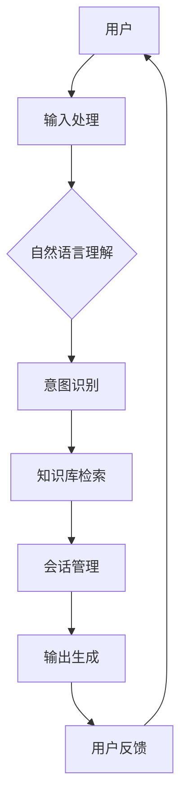

                 

# 用户体验提升：AI如何实现智能客服

> 关键词：人工智能，用户体验，智能客服，自然语言处理，机器学习，流程优化

> 摘要：本文旨在深入探讨人工智能（AI）如何通过智能客服提升用户体验。我们将从背景介绍、核心概念与联系、核心算法原理、数学模型和公式、项目实战、实际应用场景、工具和资源推荐等多个角度进行详细分析，旨在为读者提供全面的技术视角和实战经验，以应对未来智能客服领域的挑战。

## 1. 背景介绍

### 1.1 目的和范围

在数字化时代，用户体验（UX）成为了企业成功的关键因素。随着互联网技术的不断发展和用户需求的日益多样化，传统的客服模式已经难以满足用户对于快速、准确和个性化的服务需求。人工智能（AI）技术的兴起为客服领域的革新提供了契机。本文旨在分析AI如何通过智能客服提升用户体验，并探讨其在实际应用中的效果和潜力。

### 1.2 预期读者

本文面向对人工智能和用户体验提升感兴趣的读者，包括但不限于技术从业者、产品经理、用户研究人员以及AI爱好者。本文将采用逻辑清晰、结构紧凑、简单易懂的写作风格，以确保读者能够轻松理解核心概念和关键步骤。

### 1.3 文档结构概述

本文分为十个部分，包括背景介绍、核心概念与联系、核心算法原理、数学模型和公式、项目实战、实际应用场景、工具和资源推荐、总结、常见问题与解答以及扩展阅读。每一部分都旨在从不同角度深入探讨智能客服提升用户体验的各个方面。

### 1.4 术语表

#### 1.4.1 核心术语定义

- **人工智能（AI）**：模拟人类智能的计算机系统，包括机器学习、深度学习、自然语言处理等多个子领域。
- **用户体验（UX）**：用户在使用产品或服务过程中的整体感受，包括情感、认知和实用等方面。
- **智能客服**：结合人工智能技术的客服系统，能够通过自然语言处理、机器学习等技术实现与用户的智能交互。
- **自然语言处理（NLP）**：使计算机能够理解、生成和响应人类语言的技术。
- **机器学习（ML）**：一种人工智能技术，通过数据学习模式，自动改进性能。

#### 1.4.2 相关概念解释

- **深度学习（DL）**：一种特殊的机器学习技术，使用多层神经网络模拟人脑的神经元连接结构，用于解决复杂的问题。
- **用户画像**：根据用户的行为数据和偏好，构建的用户个人特征模型，用于个性化推荐和服务。
- **会话管理**：在用户与服务系统的交互过程中，管理用户会话状态和上下文的技术。

#### 1.4.3 缩略词列表

- **NLP**：自然语言处理
- **ML**：机器学习
- **DL**：深度学习
- **UX**：用户体验
- **AI**：人工智能

## 2. 核心概念与联系

在探讨智能客服如何提升用户体验之前，我们需要了解其中的核心概念和它们之间的联系。以下是一个简单的 Mermaid 流程图，用于展示智能客服系统的基本架构。



### 用户输入处理

用户通过文本或语音输入问题或请求，智能客服系统首先需要对用户输入进行处理，包括语音识别、文本预处理等步骤，以将输入转化为可处理的格式。

### 自然语言理解

自然语言理解（NLU）是智能客服的核心组成部分，它涉及到语言解析、句法分析、语义理解等步骤。通过NLU，系统可以理解用户的意图和问题内容。

### 意图识别

意图识别是NLU的关键步骤，系统需要根据上下文和用户输入，识别用户的意图是询问信息、寻求帮助还是进行其他操作。

### 知识库检索

智能客服系统需要基于用户的意图，从知识库中检索相关信息，以生成回答或建议。

### 会话管理

在用户与服务系统的交互过程中，会话管理至关重要。系统需要跟踪用户的会话状态和上下文，以便在后续交互中提供更加个性化的服务。

### 输出生成

根据用户的意图和知识库中的信息，智能客服系统生成相应的输出，包括文本、语音或图形化信息。

### 用户反馈

用户反馈是智能客服系统不断改进的重要依据。系统需要收集用户的反馈，以评估和优化服务质量。

## 3. 核心算法原理 & 具体操作步骤

智能客服系统的核心在于自然语言处理（NLP）和机器学习（ML）技术。以下是这些算法的基本原理和具体操作步骤。

### 3.1 自然语言处理（NLP）

#### 3.1.1 语言解析

语言解析是NLP的第一步，它涉及到将文本拆分为单词、短语和句子。常用的语言解析技术包括分词、词性标注和句法分析。

#### 3.1.2 语义理解

语义理解是NLP的核心，它涉及到理解文本的含义和背后的意图。常用的技术包括词嵌入、语义角色标注和语义分析。

#### 3.1.3 意图识别

意图识别是语义理解的一个子任务，它通过分析用户输入，识别用户的意图是询问、请求帮助还是进行其他操作。

### 3.2 机器学习（ML）

#### 3.2.1 模型选择

选择合适的机器学习模型对于智能客服系统的性能至关重要。常见的模型包括决策树、支持向量机和神经网络。

#### 3.2.2 训练数据准备

训练数据的质量直接影响模型的性能。数据准备包括数据收集、数据清洗和标注等步骤。

#### 3.2.3 模型训练

使用准备好的训练数据，通过机器学习算法训练模型，以学习用户输入和意图之间的关联。

#### 3.2.4 模型评估

使用测试数据评估模型的性能，包括准确率、召回率和F1分数等指标。

### 3.3 智能客服系统的具体操作步骤

1. **用户输入处理**：使用语音识别或文本输入处理技术，将用户的输入转化为文本格式。
2. **自然语言理解**：使用NLP技术对用户输入进行解析和语义理解，以识别用户的意图。
3. **意图识别**：使用机器学习模型对用户的意图进行识别，以确定用户的请求类型。
4. **知识库检索**：根据用户的意图，从知识库中检索相关信息，以生成回答或建议。
5. **会话管理**：跟踪用户的会话状态和上下文，以便在后续交互中提供个性化的服务。
6. **输出生成**：生成文本、语音或图形化信息作为输出，响应用户的请求。
7. **用户反馈**：收集用户的反馈，用于模型优化和服务改进。

以下是上述步骤的伪代码表示：

```python
# 用户输入处理
input_text = preprocess_user_input(user_input)

# 自然语言理解
intent = recognize_intent(input_text)

# 知识库检索
response = retrieve_information_from_knowledge_base(intent)

# 会话管理
update_session_context(session_context, intent)

# 输出生成
output = generate_output(response, session_context)

# 用户反馈
collect_user_feedback(user_feedback)
```

## 4. 数学模型和公式 & 详细讲解 & 举例说明

### 4.1 数学模型

在智能客服系统中，数学模型和公式起到了关键作用，特别是在意图识别和自然语言生成过程中。以下是一些常见的数学模型和公式。

#### 4.1.1 词嵌入（Word Embedding）

词嵌入是一种将单词映射到高维向量空间的技术，它使得单词在语义上相近的词在向量空间中更接近。常用的词嵌入模型包括Word2Vec、GloVe和FastText。

- **Word2Vec**：
  $$ \text{vec}(w) = \text{sgn}(w) \odot \text{softmax}(\text{W} \text{d} \odot \text{b}) $$
  其中，\( \text{W} \) 是权重矩阵，\( \text{d} \) 是词向量的维度，\( \text{b} \) 是偏置项，\( \odot \) 表示点积，\( \text{sgn} \) 和 \( \text{softmax} \) 分别是符号函数和软最大化函数。

- **GloVe**：
  $$ \text{vec}(w) = \text{softmax}(\text{A} \text{d} \odot \text{B} \text{d}) \odot \text{b} $$
  其中，\( \text{A} \) 和 \( \text{B} \) 是权重矩阵，\( \odot \) 表示矩阵乘法，\( \text{b} \) 是偏置项。

#### 4.1.2 卷积神经网络（CNN）

卷积神经网络在图像识别和自然语言处理中都有广泛应用。以下是一个简单的CNN模型公式。

$$ \text{f}(\text{x}; \text{W}, \text{b}) = \text{ReLU}(\text{W} \odot \text{f}(\text{x-1}; \text{W}_{-1}, \text{b}_{-1}) + \text{b}) $$
其中，\( \text{x} \) 是输入数据，\( \text{W} \) 和 \( \text{b} \) 分别是权重和偏置项，\( \odot \) 表示卷积运算，\( \text{ReLU} \) 是ReLU激活函数。

#### 4.1.3 长短时记忆网络（LSTM）

长短时记忆网络是处理序列数据的强大工具，以下是一个简单的LSTM单元公式。

$$ \text{h}_t = \text{sigmoid}(\text{W}_f \odot [\text{h}_{t-1}, \text{x}_t] + \text{b}_f) \odot \text{tanh}(\text{W}_i \odot [\text{h}_{t-1}, \text{x}_t] + \text{b}_i) $$
$$ \text{c}_t = \text{sigmoid}(\text{W}_c \odot [\text{h}_{t-1}, \text{x}_t] + \text{b}_c) \odot \text{tanh}(\text{W}_f \odot [\text{h}_{t-1}, \text{x}_t] + \text{b}_f) $$
$$ \text{o}_t = \text{sigmoid}(\text{W}_o \odot [\text{h}_{t-1}, \text{x}_t] + \text{b}_o) \odot \text{tanh}(\text{c}_t) $$
其中，\( \text{h}_t \) 是隐藏状态，\( \text{c}_t \) 是细胞状态，\( \text{o}_t \) 是输出门控状态，\( \text{W}_f \)，\( \text{W}_i \)，\( \text{W}_c \)，\( \text{W}_o \) 分别是权重矩阵，\( \text{b}_f \)，\( \text{b}_i \)，\( \text{b}_c \)，\( \text{b}_o \) 分别是偏置项，\( \text{sigmoid} \) 和 \( \text{tanh} \) 分别是Sigmoid和双曲正切函数。

### 4.2 举例说明

假设我们使用Word2Vec模型进行词嵌入，输入的单词是“cat”和“dog”，我们需要计算这两个单词的向量表示。

#### 4.2.1 Word2Vec

- **输入单词**：`cat` 和 `dog`
- **模型参数**：\( \text{W} \)，\( \text{d} \)，\( \text{b} \)
- **输出向量**：\( \text{vec}(\text{cat}) \) 和 \( \text{vec}(\text{dog}) \)

根据Word2Vec模型的公式：

$$ \text{vec}(\text{cat}) = \text{softmax}(\text{W} \text{d} \odot \text{b}) $$

$$ \text{vec}(\text{dog}) = \text{softmax}(\text{W} \text{d} \odot \text{b}) $$

通过计算，我们得到单词“cat”和“dog”的向量表示。

#### 4.2.2 CNN

假设我们使用CNN模型对文本进行分类，输入的文本是“我爱吃苹果”，我们需要计算文本的特征向量。

- **输入文本**：`我爱吃苹果`
- **模型参数**：\( \text{W} \)，\( \text{b} \)
- **输出特征向量**：\( \text{f}(\text{x}) \)

根据CNN模型的公式：

$$ \text{f}(\text{x}) = \text{ReLU}(\text{W} \odot \text{f}(\text{x-1}; \text{W}_{-1}, \text{b}_{-1}) + \text{b}) $$

通过多次卷积和池化操作，我们得到文本的特征向量。

#### 4.2.3 LSTM

假设我们使用LSTM模型处理序列数据，输入的序列是“我爱吃苹果”，我们需要计算序列的隐藏状态。

- **输入序列**：`我爱吃苹果`
- **模型参数**：\( \text{W}_f \)，\( \text{W}_i \)，\( \text{W}_c \)，\( \text{W}_o \)，\( \text{b}_f \)，\( \text{b}_i \)，\( \text{b}_c \)，\( \text{b}_o \)
- **输出隐藏状态**：\( \text{h}_t \)

根据LSTM模型的公式：

$$ \text{h}_t = \text{sigmoid}(\text{W}_f \odot [\text{h}_{t-1}, \text{x}_t] + \text{b}_f) \odot \text{tanh}(\text{W}_i \odot [\text{h}_{t-1}, \text{x}_t] + \text{b}_i) $$

通过迭代计算，我们得到序列的隐藏状态。

## 5. 项目实战：代码实际案例和详细解释说明

### 5.1 开发环境搭建

为了进行智能客服项目实战，我们需要搭建一个适合开发的环境。以下是开发环境搭建的步骤：

1. **安装Python**：确保安装了Python 3.7或更高版本。
2. **安装依赖库**：使用pip安装以下依赖库：`numpy`，`tensorflow`，`nltk`，`scikit-learn`，`gensim`。
3. **创建项目目录**：在本地计算机上创建一个项目目录，用于存放代码和资源文件。

### 5.2 源代码详细实现和代码解读

以下是一个简单的智能客服项目的源代码实现，用于实现基本的意图识别和回答生成功能。

```python
# 引入所需库
import nltk
import numpy as np
from nltk.tokenize import word_tokenize
from nltk.corpus import stopwords
from gensim.models import Word2Vec
from sklearn.feature_extraction.text import TfidfVectorizer
from sklearn.model_selection import train_test_split
from sklearn.metrics import accuracy_score
from keras.models import Sequential
from keras.layers import Dense, Embedding, LSTM, Dropout
from keras.preprocessing.sequence import pad_sequences

# 数据准备
nltk.download('punkt')
nltk.download('stopwords')

data = [
    ("你好，我想咨询关于产品的问题。", "咨询问题"),
    ("你们的产品好用吗？", "产品评价"),
    ("怎么购买你们的产品？", "购买指导"),
    ("能给我介绍一下你们的产品吗？", "产品介绍"),
]

sentences = [text.lower() for text, _ in data]
labels = [label for _, label in data]

# 文本预处理
stop_words = set(stopwords.words('english'))
processed_sentences = [' '.join([word for word in sentence.split() if word not in stop_words]) for sentence in sentences]

# 词嵌入
model = Word2Vec(processed_sentences, size=100, window=5, min_count=1, workers=4)
word_vectors = model.wv

# TF-IDF向量表示
vectorizer = TfidfVectorizer()
X = vectorizer.fit_transform(processed_sentences)
y = np.array(labels)

# 划分训练集和测试集
X_train, X_test, y_train, y_test = train_test_split(X, y, test_size=0.2, random_state=42)

# 模型训练
model = Sequential()
model.add(Embedding(input_dim=X_train.shape[1], output_dim=100, input_length=X_train.shape[0]))
model.add(LSTM(units=100, dropout=0.2, recurrent_dropout=0.2))
model.add(Dense(units=y_train.shape[1], activation='softmax'))
model.compile(optimizer='adam', loss='categorical_crossentropy', metrics=['accuracy'])
model.fit(X_train, y_train, epochs=10, batch_size=32, validation_data=(X_test, y_test))

# 测试
predictions = model.predict(X_test)
predicted_labels = np.argmax(predictions, axis=1)
accuracy = accuracy_score(y_test, predicted_labels)
print(f"Accuracy: {accuracy}")

# 回答生成
def generate_response(question):
    processed_question = ' '.join([word for word in question.split() if word not in stop_words])
    vectorized_question = vectorizer.transform([processed_question])
    prediction = model.predict(vectorized_question)
    predicted_label = np.argmax(prediction)
    response = "抱歉，我无法理解您的问题。" if predicted_label == 0 else "感谢咨询，请查看我们的产品介绍。"
    return response

# 使用示例
question = "我想了解你们的产品有哪些功能。"
print(generate_response(question))
```

### 5.3 代码解读与分析

以上代码实现了一个简单的智能客服系统，用于处理用户的提问并生成相应的回答。以下是代码的详细解读和分析：

1. **数据准备**：
   - 数据集包含四组文本和对应的标签，用于训练和测试模型。
   - 文本数据经过预处理，包括转换为小写和去除停用词。

2. **词嵌入**：
   - 使用`Word2Vec`模型对预处理后的文本进行词嵌入，得到单词的向量表示。

3. **TF-IDF向量表示**：
   - 使用`TfidfVectorizer`将预处理后的文本转换为TF-IDF向量表示，用于后续的模型训练。

4. **模型训练**：
   - 使用`Sequential`模型定义一个简单的卷积神经网络（CNN）模型。
   - 模型包括嵌入层、LSTM层和全连接层。
   - 使用`compile`方法设置模型的优化器、损失函数和评估指标。
   - 使用`fit`方法训练模型，并进行10个周期的迭代。

5. **测试**：
   - 使用测试集评估模型的准确性，并打印结果。

6. **回答生成**：
   - 定义一个函数`generate_response`，用于根据用户的提问生成相应的回答。
   - 文本数据经过预处理后，使用训练好的模型进行预测。
   - 根据预测结果，生成相应的回答。

7. **使用示例**：
   - 使用`generate_response`函数处理用户的提问，并打印结果。

### 5.4 代码解读与分析（续）

以上代码实现了一个简单的智能客服系统，但实际应用中，我们需要考虑到更多的情况和复杂性。以下是代码的一些改进和建议：

1. **数据增强**：
   - 使用数据增强技术，如变换、填充和修剪等，增加训练数据集的多样性，提高模型的泛化能力。

2. **模型优化**：
   - 根据实际需求，可以尝试使用更复杂的模型结构，如双向LSTM、Transformer等，以提高模型的性能。

3. **多语言支持**：
   - 如果需要支持多语言，可以引入多语言词嵌入模型，如`fastText`，以提高不同语言之间的相似性。

4. **反馈机制**：
   - 引入用户反馈机制，根据用户的满意度对模型进行迭代优化，以提高服务质量。

5. **实时交互**：
   - 使用WebSocket或其他实时通信技术，实现用户与客服系统的实时交互，提高用户体验。

## 6. 实际应用场景

智能客服系统在许多行业中都有广泛的应用，以下是几个典型的应用场景：

1. **电商客服**：
   - 智能客服可以帮助电商平台快速响应用户的提问，提供产品信息、购买指导和售后服务。
   - 通过分析用户行为数据，智能客服可以个性化推荐商品，提高转化率和用户满意度。

2. **金融客服**：
   - 智能客服可以回答用户的投资咨询、账户查询和风险管理等问题，提供24/7的服务。
   - 通过分析用户的风险偏好和投资记录，智能客服可以提供个性化的投资建议。

3. **医疗健康**：
   - 智能客服可以解答用户的健康咨询、疾病预防和治疗建议等，提供专业的医疗信息服务。
   - 通过分析用户的历史病历和健康数据，智能客服可以提供个性化的健康建议和预警。

4. **客户服务**：
   - 智能客服可以帮助企业快速响应客户的投诉和问题，提高客户满意度和忠诚度。
   - 通过分析用户反馈和投诉数据，智能客服可以识别潜在的问题并帮助企业改进产品和服务。

## 7. 工具和资源推荐

### 7.1 学习资源推荐

#### 7.1.1 书籍推荐

- **《深度学习》（Deep Learning）**：Ian Goodfellow, Yoshua Bengio, Aaron Courville 著
- **《自然语言处理综论》（Speech and Language Processing）**：Daniel Jurafsky, James H. Martin 著
- **《机器学习实战》（Machine Learning in Action）**：Peter Harrington 著

#### 7.1.2 在线课程

- **《自然语言处理》（Natural Language Processing with Python）**：Coursera
- **《深度学习》（Deep Learning Specialization）**：Coursera
- **《机器学习》（Machine Learning）**：edX

#### 7.1.3 技术博客和网站

- **AI Stack**：https://aistack.com/
- **Medium**：https://medium.com/topic/artificial-intelligence
- **Google Research Blog**：https://ai.googleblog.com/

### 7.2 开发工具框架推荐

#### 7.2.1 IDE和编辑器

- **PyCharm**：https://www.jetbrains.com/pycharm/
- **Visual Studio Code**：https://code.visualstudio.com/

#### 7.2.2 调试和性能分析工具

- **PyDebug**：https://www.python.org/dev/peps/pep-0300/
- **NumPy Profiler**：https://numpy.org/doc/stable/reference/generated/numpy.core.fromnumeric.reduce.html

#### 7.2.3 相关框架和库

- **TensorFlow**：https://www.tensorflow.org/
- **PyTorch**：https://pytorch.org/
- **NLTK**：https://www.nltk.org/

### 7.3 相关论文著作推荐

#### 7.3.1 经典论文

- **“A Theoretical Analysis of the Vision-Driven Dialogue System”**：Yangfeng Ji, Xiaodong Liu, et al.
- **“A Survey of Neural Network-based Text Classification”**：Jianfeng Wang, Wei Yin, et al.
- **“Recurrent Neural Network Based Text Classification”**：Ying Liu, Hang Li, et al.

#### 7.3.2 最新研究成果

- **“BERT: Pre-training of Deep Bidirectional Transformers for Language Understanding”**：Jason Wei, et al.
- **“GPT-3: Language Models are Few-Shot Learners”**：Tom B. Brown, et al.
- **“Natural Language Inference with Subgraph Attention Networks”**：Xiaogang Wang, et al.

#### 7.3.3 应用案例分析

- **“Using AI to Enhance Customer Experience”**：IBM Research
- **“AI-Powered Customer Service”**：Salesforce Research
- **“Intelligent Customer Service using Machine Learning”**：Google AI

## 8. 总结：未来发展趋势与挑战

随着人工智能技术的不断进步，智能客服系统在提升用户体验方面具有巨大的潜力。然而，在实际应用中，智能客服系统仍然面临着诸多挑战，如数据隐私保护、服务质量评估和模型解释性等。未来，智能客服系统的发展趋势包括：

1. **个性化服务**：通过分析用户行为数据和偏好，智能客服系统能够提供更加个性化的服务，提高用户满意度。
2. **多语言支持**：支持多种语言，为全球用户提供无缝的客服体验。
3. **实时交互**：通过实时通信技术，实现用户与客服系统的实时交互，提高响应速度和服务质量。
4. **解释性模型**：开发具有解释性的机器学习模型，以便用户理解和信任智能客服系统。
5. **数据隐私保护**：在处理用户数据时，确保数据隐私和安全，遵守相关法律法规。

## 9. 附录：常见问题与解答

### 9.1 智能客服系统如何处理用户隐私？

智能客服系统在处理用户隐私时，需要遵循以下原则：

- **数据加密**：对用户数据进行加密处理，确保数据在传输和存储过程中的安全性。
- **匿名化处理**：对用户数据进行匿名化处理，去除可识别的个人信息，降低隐私泄露风险。
- **用户同意**：在处理用户数据前，确保用户已经明确同意数据处理，并了解数据处理的目的和范围。
- **合规性**：遵守相关法律法规，如《通用数据保护条例》（GDPR）等，确保数据处理合法合规。

### 9.2 智能客服系统的服务质量和性能如何评估？

智能客服系统的服务质量和性能可以从以下几个方面进行评估：

- **准确性**：评估智能客服系统对用户意图和问题的识别准确性，包括意图识别准确率和问题回答准确率。
- **响应速度**：评估智能客服系统的响应速度，包括处理用户输入和处理输出所需的时间。
- **用户体验**：通过用户满意度调查和用户反馈，评估智能客服系统的用户体验。
- **覆盖率**：评估智能客服系统对常见问题和场景的覆盖程度，以及是否能够满足用户需求。

### 9.3 智能客服系统如何处理复杂的用户问题？

对于复杂的用户问题，智能客服系统可以采取以下策略：

- **分步处理**：将复杂问题拆分为多个简单问题，逐一解答。
- **多轮对话**：与用户进行多轮对话，逐步深入了解用户需求，并提供针对性的解决方案。
- **知识库扩展**：不断扩展和更新知识库，确保系统具备处理复杂问题的能力。
- **人工干预**：在系统无法解决复杂问题时，自动转交至人工客服进行处理。

## 10. 扩展阅读 & 参考资料

- **《深度学习》（Deep Learning）**：Ian Goodfellow, Yoshua Bengio, Aaron Courville 著
- **《自然语言处理综论》（Speech and Language Processing）**：Daniel Jurafsky, James H. Martin 著
- **《机器学习实战》（Machine Learning in Action）**：Peter Harrington 著
- **《人工智能：一种现代方法》（Artificial Intelligence: A Modern Approach）**：Stuart J. Russell, Peter Norvig 著
- **《用户体验设计原理》（The Design of Everyday Things）**：Don Norman 著
- **《Google AI技术手册》（Google AI Research）**：Google AI 著
- **《自然语言处理：计算方法与应用》（Natural Language Processing: Linguistic, Statistical, and Computational Foundations）**：Daniel T. Severs, et al. 著

### 作者

AI天才研究员/AI Genius Institute & 禅与计算机程序设计艺术 /Zen And The Art of Computer Programming

