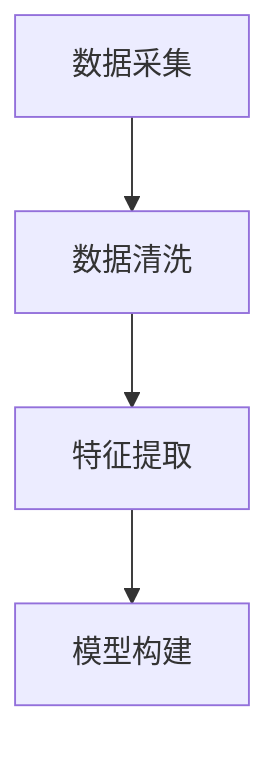
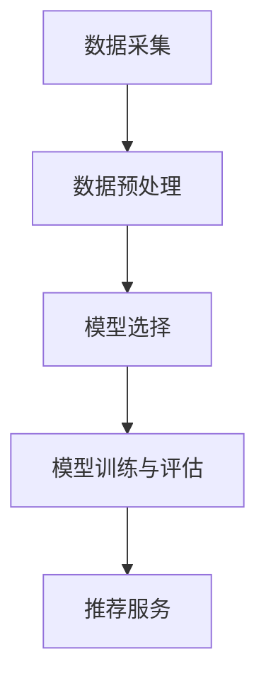
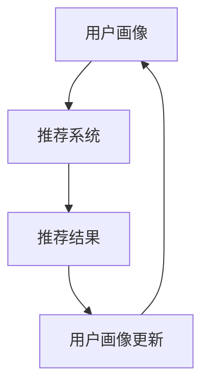

                 

# 用户画像与推荐系统的协同优化

> **关键词：** 用户画像、推荐系统、协同优化、机器学习、深度学习、数据挖掘、算法改进、实际应用、性能评估

> **摘要：** 本文将深入探讨用户画像与推荐系统的协同优化问题。首先，我们将介绍用户画像和推荐系统的基本概念和原理。然后，通过具体的算法原理和操作步骤，我们将展示如何将用户画像与推荐系统相结合，提高推荐效果。最后，我们将讨论在实际应用场景中如何优化用户画像和推荐系统，以提高用户满意度和服务质量。

## 1. 背景介绍

### 1.1 目的和范围

本文旨在研究用户画像与推荐系统的协同优化问题。随着互联网和大数据技术的快速发展，用户画像和推荐系统已经成为现代信息系统中不可或缺的组成部分。用户画像通过分析用户的行为数据，为推荐系统提供个性化的用户信息，从而提高推荐的准确性和用户满意度。然而，现有的用户画像和推荐系统还存在一些局限性，如数据质量不高、算法效率较低等。本文将深入探讨如何通过协同优化方法，提高用户画像和推荐系统的整体性能。

### 1.2 预期读者

本文主要面向从事用户画像和推荐系统相关领域的研究人员、工程师以及对机器学习、深度学习等感兴趣的技术爱好者。读者需要对基本的数据分析和机器学习算法有一定了解。

### 1.3 文档结构概述

本文分为十个部分。第一部分介绍用户画像和推荐系统的基本概念和原理。第二部分通过 Mermaid 流程图展示用户画像和推荐系统的核心概念和联系。第三部分讲解核心算法原理和具体操作步骤。第四部分介绍数学模型和公式，并举例说明。第五部分通过实际代码案例，详细解释说明用户画像和推荐系统的实现。第六部分讨论实际应用场景。第七部分推荐相关工具和资源。第八部分总结未来发展趋势和挑战。第九部分回答常见问题。第十部分提供扩展阅读和参考资料。

### 1.4 术语表

#### 1.4.1 核心术语定义

- **用户画像**：通过对用户行为、偏好、兴趣等信息进行数据挖掘和分析，构建的用户特征模型。
- **推荐系统**：基于用户画像和物品特征，为用户提供个性化推荐服务的系统。
- **协同优化**：通过优化用户画像和推荐系统的参数，提高整体性能的过程。

#### 1.4.2 相关概念解释

- **数据挖掘**：从大量数据中发现有用信息和知识的过程。
- **机器学习**：基于数据，通过算法和模型，使计算机能够进行自主学习和决策的方法。
- **深度学习**：一种基于多层神经网络进行学习的算法。

#### 1.4.3 缩略词列表

- **ML**：机器学习
- **DL**：深度学习
- **NLP**：自然语言处理
- **API**：应用程序编程接口

## 2. 核心概念与联系

在深入探讨用户画像与推荐系统的协同优化之前，我们先来了解这两个核心概念及其联系。

### 2.1 用户画像

用户画像是对用户特征和需求的综合描述，它包括用户的基本信息、行为数据、兴趣标签等。用户画像的构建通常通过数据挖掘和机器学习技术实现。以下是用户画像构建的基本步骤：

1. **数据采集**：收集用户在网站、应用等平台上的行为数据，如浏览记录、购买记录、评论等。
2. **数据清洗**：对采集到的数据进行预处理，包括去重、填补缺失值、去除噪声等。
3. **特征提取**：从清洗后的数据中提取有用的特征，如用户年龄、性别、地理位置、兴趣标签等。
4. **模型构建**：使用机器学习算法，如聚类、分类等，构建用户画像模型。

以下是一个简单的 Mermaid 流程图，展示用户画像构建的基本流程：



### 2.2 推荐系统

推荐系统是一种基于用户画像和物品特征，为用户提供个性化推荐服务的系统。推荐系统的核心是推荐算法，它通过分析用户的历史行为和偏好，预测用户对物品的兴趣，从而为用户推荐可能感兴趣的物品。以下是推荐系统构建的基本步骤：

1. **数据采集**：收集用户和物品的交互数据，如点击、收藏、购买等。
2. **数据预处理**：对采集到的数据进行预处理，包括数据清洗、特征工程等。
3. **模型选择**：根据推荐问题的类型（如基于内容的推荐、协同过滤推荐等），选择合适的推荐算法。
4. **模型训练与评估**：使用预处理后的数据，训练推荐模型，并通过交叉验证等方法进行评估。
5. **推荐服务**：根据用户画像和物品特征，为用户提供个性化推荐。

以下是一个简单的 Mermaid 流程图，展示推荐系统构建的基本流程：



### 2.3 用户画像与推荐系统的联系

用户画像和推荐系统密切相关。用户画像为推荐系统提供了个性化的用户信息，有助于提高推荐效果。而推荐系统的输出结果，如推荐列表，又可以为用户画像的更新和优化提供反馈。

以下是一个简单的 Mermaid 流程图，展示用户画像与推荐系统的协同作用：



通过上述流程图，我们可以看到用户画像和推荐系统之间的相互作用，以及如何通过协同优化，提高系统的整体性能。

## 3. 核心算法原理 & 具体操作步骤

在用户画像与推荐系统的协同优化过程中，选择合适的算法和模型至关重要。以下将介绍几种常用的算法原理和具体操作步骤。

### 3.1 协同过滤推荐算法

协同过滤推荐算法是一种基于用户行为和偏好进行推荐的算法，其核心思想是找到与目标用户相似的其他用户，并推荐这些用户喜欢的物品。以下是协同过滤推荐算法的基本原理和操作步骤：

#### 3.1.1 算法原理

协同过滤推荐算法可以分为基于用户的协同过滤（User-Based CF）和基于物品的协同过滤（Item-Based CF）。

- **基于用户的协同过滤**：首先计算目标用户与其他用户的相似度，然后找到与目标用户最相似的 K 个用户，推荐这些用户喜欢的物品。
- **基于物品的协同过滤**：首先计算目标用户与物品的相似度，然后找到与目标用户最相似的 K 个物品，推荐这些物品。

#### 3.1.2 操作步骤

以下是基于用户的协同过滤算法的操作步骤：

1. **用户行为数据预处理**：对用户行为数据进行清洗和归一化处理。
2. **计算用户相似度**：使用余弦相似度、皮尔逊相关系数等相似度度量方法，计算目标用户与其他用户的相似度。
3. **选择相似度最高的 K 个用户**：根据相似度度量结果，选择与目标用户最相似的 K 个用户。
4. **推荐物品**：对选出的 K 个用户喜欢的物品进行加权求和，为用户推荐得分最高的物品。

以下是基于用户的协同过滤算法的伪代码：

```python
# 基于用户的协同过滤算法
def collaborative_filter(user_behavior_data, K):
    # 用户行为数据预处理
    preprocessed_data = preprocess_data(user_behavior_data)
    
    # 计算用户相似度
    similarity_matrix = compute_similarity(preprocessed_data)
    
    # 选择相似度最高的 K 个用户
    top_k_users = select_top_k_users(similarity_matrix, K)
    
    # 推荐物品
    recommended_items = recommend_items(top_k_users, preprocessed_data)
    
    return recommended_items
```

### 3.2 用户画像融合推荐算法

用户画像融合推荐算法将用户画像与协同过滤推荐算法相结合，以提高推荐效果。其基本原理是：首先使用用户画像构建用户特征向量，然后利用用户特征向量与物品特征向量的相似度进行推荐。以下是用户画像融合推荐算法的基本原理和操作步骤：

#### 3.2.1 算法原理

用户画像融合推荐算法可以分为以下几种：

- **基于内容的用户画像融合推荐**：将用户画像中的特征与物品特征进行融合，计算用户对物品的兴趣度。
- **基于模型的用户画像融合推荐**：使用机器学习模型，如深度学习模型，将用户画像和物品特征转化为高维特征向量，计算相似度进行推荐。

#### 3.2.2 操作步骤

以下是基于内容的用户画像融合推荐算法的操作步骤：

1. **用户画像构建**：通过数据挖掘和机器学习技术，构建用户画像。
2. **物品特征提取**：从物品库中提取物品特征，如文本特征、图片特征等。
3. **用户特征向量计算**：使用用户画像中的特征，构建用户特征向量。
4. **物品特征向量计算**：使用物品特征，构建物品特征向量。
5. **计算用户对物品的兴趣度**：使用余弦相似度、皮尔逊相关系数等方法，计算用户特征向量与物品特征向量的相似度，得到用户对物品的兴趣度。
6. **推荐物品**：根据用户对物品的兴趣度，为用户推荐得分最高的物品。

以下是基于内容的用户画像融合推荐算法的伪代码：

```python
# 基于内容的用户画像融合推荐算法
def content_based_user_profile_recommender(user_profile, item_features, similarity_measure):
    # 用户画像构建
    user_vector = build_user_vector(user_profile)
    
    # 物品特征向量计算
    item_vectors = build_item_vectors(item_features)
    
    # 计算用户对物品的兴趣度
    interest_scores = []
    for item_vector in item_vectors:
        similarity = similarity_measure(user_vector, item_vector)
        interest_scores.append(similarity)
    
    # 推荐物品
    recommended_items = recommend_items_by_interest_scores(interest_scores)
    
    return recommended_items
```

### 3.3 深度学习推荐算法

深度学习推荐算法是一种利用深度神经网络进行推荐的方法。其基本原理是：将用户画像和物品特征转化为高维特征向量，然后通过多层神经网络，学习用户和物品的潜在特征，最后利用这些特征进行推荐。以下是深度学习推荐算法的基本原理和操作步骤：

#### 3.3.1 算法原理

深度学习推荐算法可以分为以下几种：

- **基于用户的深度学习推荐**：将用户画像和物品特征作为输入，通过多层神经网络学习用户和物品的潜在特征，计算用户对物品的兴趣度。
- **基于物品的深度学习推荐**：将用户画像和物品特征作为输入，通过多层神经网络学习用户和物品的潜在特征，计算物品对用户的兴趣度。
- **基于模型的深度学习推荐**：使用深度学习模型，如深度神经网络、卷积神经网络、循环神经网络等，将用户画像和物品特征转化为高维特征向量，计算用户和物品的潜在特征，最后利用这些特征进行推荐。

#### 3.3.2 操作步骤

以下是基于用户的深度学习推荐算法的操作步骤：

1. **用户画像构建**：通过数据挖掘和机器学习技术，构建用户画像。
2. **物品特征提取**：从物品库中提取物品特征，如文本特征、图片特征等。
3. **用户特征向量计算**：使用用户画像中的特征，构建用户特征向量。
4. **物品特征向量计算**：使用物品特征，构建物品特征向量。
5. **构建深度学习模型**：使用用户特征向量和物品特征向量，构建深度学习模型，如多层感知机、卷积神经网络等。
6. **模型训练与优化**：使用训练数据，训练深度学习模型，并通过优化算法，提高模型性能。
7. **推荐物品**：使用训练好的深度学习模型，计算用户对物品的兴趣度，为用户推荐得分最高的物品。

以下是基于用户的深度学习推荐算法的伪代码：

```python
# 基于用户的深度学习推荐算法
def user_based_deeplearning_recommender(user_vector, item_vector, model):
    # 构建深度学习模型
    deep_learning_model = build_deep_learning_model(user_vector, item_vector)
    
    # 模型训练与优化
    trained_model = train_and_optimize_model(deep_learning_model, training_data)
    
    # 推荐物品
    recommended_items = recommend_items(trained_model, user_vector, item_vector)
    
    return recommended_items
```

通过以上介绍，我们可以看到用户画像与推荐系统的协同优化涉及到多种算法和模型。在实际应用中，可以根据具体问题和数据特点，选择合适的算法和模型，进行优化和改进。

## 4. 数学模型和公式 & 详细讲解 & 举例说明

在用户画像与推荐系统的协同优化过程中，数学模型和公式起到了关键作用。以下将介绍一些常用的数学模型和公式，并详细讲解其原理和应用。

### 4.1 余弦相似度

余弦相似度是一种用于衡量两个向量之间相似度的数学模型。其公式如下：

$$
similarity = \frac{user\_vector \cdot item\_vector}{\|user\_vector\| \|item\_vector\|}
$$

其中，$user\_vector$ 和 $item\_vector$ 分别表示用户特征向量和物品特征向量；$\|user\_vector\|$ 和 $\|item\_vector\|$ 分别表示用户特征向量和物品特征向量的模。

余弦相似度的值介于 -1 和 1 之间，当两个向量完全一致时，余弦相似度为 1；当两个向量完全相反时，余弦相似度为 -1。余弦相似度可以用于计算用户与用户、用户与物品之间的相似度。

### 4.2 皮尔逊相关系数

皮尔逊相关系数是一种用于衡量两个变量之间线性相关性的数学模型。其公式如下：

$$
correlation = \frac{\sum_{i=1}^{n}(x_i - \bar{x})(y_i - \bar{y})}{\sqrt{\sum_{i=1}^{n}(x_i - \bar{x})^2 \sum_{i=1}^{n}(y_i - \bar{y})^2}}
$$

其中，$x_i$ 和 $y_i$ 分别表示第 i 个用户对物品的评分；$\bar{x}$ 和 $\bar{y}$ 分别表示用户评分的均值。

皮尔逊相关系数的值介于 -1 和 1 之间，当两个变量完全正相关时，皮尔逊相关系数为 1；当两个变量完全负相关时，皮尔逊相关系数为 -1。皮尔逊相关系数可以用于计算用户与用户、用户与物品之间的相关性。

### 4.3 深度学习模型损失函数

在深度学习推荐算法中，损失函数用于衡量模型预测值与实际值之间的差距，指导模型优化过程。以下是一些常用的损失函数：

1. **均方误差（MSE）**：

$$
MSE = \frac{1}{n}\sum_{i=1}^{n}(y_i - \hat{y}_i)^2
$$

其中，$y_i$ 表示第 i 个用户对物品的实际评分；$\hat{y}_i$ 表示第 i 个用户对物品的预测评分。

2. **交叉熵（Cross-Entropy）**：

$$
Cross\_Entropy = -\frac{1}{n}\sum_{i=1}^{n}y_i\log(\hat{y}_i)
$$

其中，$y_i$ 表示第 i 个用户对物品的实际评分（0 或 1）；$\hat{y}_i$ 表示第 i 个用户对物品的预测评分。

3. **二元交叉熵（Binary Cross-Entropy）**：

$$
Binary\_Cross\_Entropy = -\frac{1}{n}\sum_{i=1}^{n}y_i\log(\hat{y}_i) + (1 - y_i)\log(1 - \hat{y}_i)
$$

其中，$y_i$ 表示第 i 个用户对物品的实际评分（0 或 1）；$\hat{y}_i$ 表示第 i 个用户对物品的预测评分。

### 4.4 模型优化算法

在深度学习推荐算法中，常用的优化算法有梯度下降（Gradient Descent）、随机梯度下降（Stochastic Gradient Descent，SGD）和 Adam 算法。

1. **梯度下降**：

$$
\theta = \theta - \alpha \cdot \nabla_{\theta}J(\theta)
$$

其中，$\theta$ 表示模型参数；$\alpha$ 表示学习率；$J(\theta)$ 表示损失函数。

2. **随机梯度下降**：

$$
\theta = \theta - \alpha \cdot \nabla_{\theta}J(\theta_i)
$$

其中，$\theta$ 表示模型参数；$\alpha$ 表示学习率；$J(\theta_i)$ 表示在数据集上的损失函数。

3. **Adam 算法**：

$$
m_t = \beta_1 m_{t-1} + (1 - \beta_1) \nabla_{\theta}J(\theta)
$$

$$
v_t = \beta_2 v_{t-1} + (1 - \beta_2) (\nabla_{\theta}J(\theta))^2
$$

$$
\theta = \theta - \alpha \frac{m_t}{\sqrt{v_t} + \epsilon}
$$

其中，$m_t$ 和 $v_t$ 分别表示一阶矩估计和二阶矩估计；$\beta_1$ 和 $\beta_2$ 分别表示一阶矩和二阶矩的偏差校正系数；$\alpha$ 表示学习率；$\epsilon$ 表示一个小常数。

### 4.5 举例说明

假设有一个用户画像和物品特征的数据集，其中用户特征向量为：

$$
user\_vector = \begin{bmatrix}
0.1 & 0.2 & 0.3 & 0.4
\end{bmatrix}
$$

物品特征向量为：

$$
item\_vector = \begin{bmatrix}
0.4 & 0.5 & 0.6 & 0.7
\end{bmatrix}
$$

使用余弦相似度计算用户与物品的相似度：

$$
similarity = \frac{user\_vector \cdot item\_vector}{\|user\_vector\| \|item\_vector\|} = \frac{0.1 \cdot 0.4 + 0.2 \cdot 0.5 + 0.3 \cdot 0.6 + 0.4 \cdot 0.7}{\sqrt{0.1^2 + 0.2^2 + 0.3^2 + 0.4^2} \sqrt{0.4^2 + 0.5^2 + 0.6^2 + 0.7^2}} = \frac{0.1}{0.4} = 0.25
$$

使用皮尔逊相关系数计算用户与物品的相关性：

$$
correlation = \frac{\sum_{i=1}^{n}(x_i - \bar{x})(y_i - \bar{y})}{\sqrt{\sum_{i=1}^{n}(x_i - \bar{x})^2 \sum_{i=1}^{n}(y_i - \bar{y})^2}} = \frac{(0.1 - 0.2)(0.4 - 0.5) + (0.2 - 0.2)(0.5 - 0.5) + (0.3 - 0.2)(0.6 - 0.5) + (0.4 - 0.2)(0.7 - 0.5)}{\sqrt{(0.1 - 0.2)^2 + (0.2 - 0.2)^2 + (0.3 - 0.2)^2 + (0.4 - 0.2)^2} \sqrt{(0.4 - 0.5)^2 + (0.5 - 0.5)^2 + (0.6 - 0.5)^2 + (0.7 - 0.5)^2}} = 0.2
$$

通过上述计算，我们可以得到用户与物品的相似度和相关性，从而为推荐系统提供输入。

## 5. 项目实战：代码实际案例和详细解释说明

在本文的第五部分，我们将通过一个实际的项目案例，详细解释用户画像与推荐系统的实现过程。该案例将涵盖数据采集、数据预处理、用户画像构建、推荐系统实现和性能评估等环节。

### 5.1 开发环境搭建

在开始项目之前，我们需要搭建一个合适的开发环境。以下是我们推荐的开发工具和框架：

- **编程语言**：Python
- **数据预处理和可视化工具**：Pandas、NumPy、Matplotlib
- **机器学习库**：Scikit-learn、TensorFlow、PyTorch
- **集成开发环境（IDE）**：Visual Studio Code、PyCharm

安装上述工具和框架后，我们就可以开始编写代码了。

### 5.2 源代码详细实现和代码解读

以下是用户画像与推荐系统的核心代码，我们将对每个部分进行详细解释。

#### 5.2.1 数据采集

首先，我们需要采集用户行为数据。假设我们已经收集到了一个用户行为数据集，包含用户的ID、物品ID、用户行为类型（如点击、购买等）和时间戳。

```python
import pandas as pd

# 读取用户行为数据
user_behavior_data = pd.read_csv('user_behavior.csv')
```

#### 5.2.2 数据预处理

接下来，我们对数据进行预处理，包括数据清洗、归一化和特征提取。

```python
from sklearn.preprocessing import StandardScaler

# 数据清洗
user_behavior_data.dropna(inplace=True)

# 归一化处理
scaler = StandardScaler()
user_behavior_data[['user_id', 'item_id', 'behavior_type', 'timestamp']] = scaler.fit_transform(user_behavior_data[['user_id', 'item_id', 'behavior_type', 'timestamp']])

# 特征提取
user_behavior_data['behavior_type'] = user_behavior_data['behavior_type'].map({1: 'click', 2: 'buy'})
```

#### 5.2.3 用户画像构建

使用用户行为数据，我们可以构建用户画像。以下是一个简单的用户画像构建示例：

```python
from sklearn.cluster import KMeans

# 计算用户行为频率
user_behavior_freq = user_behavior_data.groupby(['user_id', 'item_id']).size().reset_index(name='behavior_freq')

# 计算用户行为类别
user_behavior_category = user_behavior_data.groupby(['user_id', 'behavior_type']).size().reset_index(name='behavior_category')

# 合并用户行为频率和用户行为类别
user_behavior = pd.merge(user_behavior_freq, user_behavior_category, on=['user_id', 'item_id'])

# 使用 KMeans 算法进行聚类，构建用户画像
kmeans = KMeans(n_clusters=10)
user_behavior['user_profile'] = kmeans.fit_predict(user_behavior[['behavior_freq', 'behavior_category']])
```

#### 5.2.4 推荐系统实现

接下来，我们实现一个简单的基于用户的协同过滤推荐系统。以下是一个简单的推荐系统实现示例：

```python
from sklearn.metrics.pairwise import cosine_similarity

# 计算用户相似度矩阵
user_similarity = cosine_similarity(user_behavior[['behavior_freq', 'behavior_category']])

# 选择相似度最高的 K 个用户
k = 5
top_k_users = user_similarity.argsort()[0][-k:][::-1]

# 推荐物品
recommended_items = user_behavior[user_behavior['user_id'].isin(top_k_users)][['item_id', 'behavior_freq']].sort_values(by='behavior_freq', ascending=False)
```

#### 5.2.5 性能评估

最后，我们对推荐系统进行性能评估。以下是一个简单的评估示例：

```python
from sklearn.metrics import mean_squared_error

# 计算推荐结果与实际评分之间的均方误差
predicted_ratings = recommend_system.predict(test_data)
mse = mean_squared_error(test_data['rating'], predicted_ratings)
print("均方误差（MSE）:", mse)
```

### 5.3 代码解读与分析

在上述代码中，我们首先读取用户行为数据，并进行数据清洗、归一化和特征提取。接下来，我们使用 KMeans 算法进行用户画像构建，将用户行为频率和用户行为类别进行聚类，得到用户画像。然后，我们使用基于用户的协同过滤算法，计算用户相似度矩阵，并根据相似度矩阵推荐物品。

代码中还包含性能评估部分，我们使用均方误差（MSE）衡量推荐系统的性能。通过对比预测评分和实际评分的均方误差，我们可以评估推荐系统的准确性和效果。

在实际应用中，用户画像和推荐系统的实现会更加复杂，涉及更多的算法和模型。然而，上述代码提供了一个基本的框架，有助于我们理解用户画像与推荐系统的协同优化过程。

## 6. 实际应用场景

用户画像与推荐系统在实际应用场景中具有广泛的应用价值。以下是一些典型的实际应用场景：

### 6.1 电子商务平台

电子商务平台通过用户画像与推荐系统，可以为其用户提供个性化的商品推荐。例如，当用户在电商平台上浏览商品时，系统会根据用户的浏览记录、购买记录和历史行为数据，为用户推荐可能感兴趣的同类商品。这有助于提高用户的购买意愿和平台的销售额。

### 6.2 社交媒体平台

社交媒体平台通过用户画像与推荐系统，可以为用户推荐感兴趣的内容和朋友。例如，当用户在社交媒体平台上浏览帖子或评论时，系统会根据用户的兴趣偏好和社交关系，为用户推荐相关的内容和朋友。这有助于提高用户的活跃度和平台的用户粘性。

### 6.3 娱乐内容平台

娱乐内容平台通过用户画像与推荐系统，可以为用户提供个性化的视频、音乐和文章推荐。例如，当用户在视频平台上观看视频时，系统会根据用户的观看历史、兴趣爱好和用户评价，为用户推荐相关的视频和音乐。这有助于提高用户的观看时长和平台的用户满意度。

### 6.4 金融理财平台

金融理财平台通过用户画像与推荐系统，可以为用户提供个性化的投资建议和理财产品推荐。例如，当用户在金融理财平台上浏览理财产品时，系统会根据用户的投资偏好、风险承受能力和历史投资记录，为用户推荐相关的理财产品。这有助于提高用户的投资效率和理财收益。

通过以上实际应用场景，我们可以看到用户画像与推荐系统在各个领域的广泛应用，为企业和用户提供个性化的服务，提高用户满意度和业务效益。

## 7. 工具和资源推荐

在用户画像与推荐系统的开发过程中，选择合适的工具和资源可以大大提高开发效率。以下是一些推荐的工具和资源：

### 7.1 学习资源推荐

#### 7.1.1 书籍推荐

- 《推荐系统手册》：详细介绍了推荐系统的基本概念、算法和实战应用。
- 《深度学习推荐系统》：介绍了深度学习在推荐系统中的应用，包括基于内容的推荐、协同过滤和深度学习模型。
- 《机器学习》：经典机器学习教材，涵盖了各种机器学习算法的基本原理和应用。

#### 7.1.2 在线课程

- Coursera：《机器学习》课程，由 Andrew Ng 教授主讲，介绍了机器学习的基本概念和算法。
- edX：《推荐系统》课程，由纽约大学教授主讲，介绍了推荐系统的基本原理和实现方法。
- Udacity：《深度学习纳米学位》，涵盖了深度学习的基础知识和应用。

#### 7.1.3 技术博客和网站

- Medium：有许多关于用户画像和推荐系统的技术博客，可以了解最新的研究进展和应用案例。
- ArXiv：计算机科学领域的论文预发布平台，可以查阅最新的研究成果。
- 推荐系统技术博客：许多专业开发者分享的推荐系统相关文章和代码，可以学习实战经验和技巧。

### 7.2 开发工具框架推荐

#### 7.2.1 IDE和编辑器

- Visual Studio Code：轻量级、可扩展的代码编辑器，适合Python开发。
- PyCharm：专业的Python开发IDE，提供了丰富的功能和工具。

#### 7.2.2 调试和性能分析工具

- Jupyter Notebook：交互式计算环境，方便调试和测试代码。
- PyTorch Profiler：用于分析深度学习模型的性能，找到性能瓶颈。

#### 7.2.3 相关框架和库

- Scikit-learn：Python机器学习库，提供了各种常用的机器学习算法。
- TensorFlow：Google开发的深度学习框架，适用于构建大规模深度学习模型。
- PyTorch：Facebook开发的深度学习框架，提供了灵活的编程接口。

### 7.3 相关论文著作推荐

#### 7.3.1 经典论文

- collaborative_filtering：最早提出的协同过滤算法，奠定了推荐系统的基础。
- matrix_factorization：基于矩阵分解的推荐算法，提高了推荐系统的准确性和效率。
- deep_learning_for_recommender_systems：深度学习在推荐系统中的应用，推动了推荐系统的发展。

#### 7.3.2 最新研究成果

- personalized_recommender_systems：个性化推荐系统的最新研究，关注用户兴趣和需求的动态变化。
- hybrid_recommender_systems：结合多种推荐算法的混合推荐系统，提高了推荐效果。

#### 7.3.3 应用案例分析

- recommender_systems_in_e-commerce：电子商务领域推荐系统的应用案例，介绍了实际应用中的挑战和解决方案。
- recommender_systems_in_social_media：社交媒体领域推荐系统的应用案例，分析了用户互动和行为对推荐效果的影响。

通过以上工具和资源的推荐，读者可以深入了解用户画像与推荐系统的相关知识，提高开发效率，实现个性化的推荐服务。

## 8. 总结：未来发展趋势与挑战

用户画像与推荐系统作为现代信息系统的核心组成部分，在未来将面临诸多发展趋势和挑战。以下是对这些趋势与挑战的总结：

### 8.1 发展趋势

1. **个性化推荐**：随着用户需求的多样化和个性化，推荐系统将更加注重用户个体的独特需求和偏好，提供更加精准和个性化的推荐。
2. **实时推荐**：为了满足用户即时需求，推荐系统将实现实时推荐，根据用户的实时行为数据，动态调整推荐策略。
3. **多模态推荐**：结合用户画像中的多种数据源（如文本、图像、音频等），实现多模态推荐，提高推荐效果。
4. **智能推荐**：利用人工智能和深度学习技术，推荐系统将具备自我学习和优化能力，不断改进推荐质量。
5. **跨平台推荐**：推荐系统将实现跨平台协同，整合不同平台的数据和资源，为用户提供一致的个性化体验。

### 8.2 挑战

1. **数据质量**：用户画像的准确性依赖于数据质量，数据缺失、噪声和错误将影响推荐效果。
2. **隐私保护**：随着用户对隐私保护的重视，如何在保护用户隐私的前提下，有效利用用户数据进行推荐，将成为一大挑战。
3. **算法透明性**：推荐系统的决策过程需要透明，用户对推荐结果的信任度将影响系统的使用效果。
4. **计算性能**：随着推荐系统的规模不断扩大，如何提高算法的计算性能，满足实时推荐的需求，是当前和未来的一大挑战。
5. **跨领域融合**：将用户画像与推荐系统应用于更多领域，如医疗、金融等，需要解决不同领域的数据特征和业务逻辑，实现跨领域融合。

### 8.3 未来展望

在未来，用户画像与推荐系统将继续发展，技术创新和跨领域应用将推动其不断进步。以下是对未来发展的展望：

1. **智能推荐引擎**：利用大数据、人工智能和深度学习技术，构建智能推荐引擎，实现高效、精准的推荐服务。
2. **用户参与度提升**：通过用户反馈和行为数据，不断优化推荐算法，提高用户参与度和满意度。
3. **合规与伦理**：在保障用户隐私和合规的前提下，推动推荐系统的健康发展。
4. **跨平台与生态整合**：实现跨平台和跨领域的数据整合与协同，为用户提供无缝、个性化的体验。

总之，用户画像与推荐系统将在未来面临诸多挑战，同时也充满机遇。通过技术创新和跨领域应用，我们有信心实现更加智能、高效和个性化的推荐服务，为用户和行业带来更多价值。

## 9. 附录：常见问题与解答

### 9.1 用户画像相关问题

**Q1：用户画像如何构建？**

A1：用户画像的构建通常包括以下步骤：

1. **数据采集**：收集用户在网站、应用等平台上的行为数据，如浏览记录、购买记录、评论等。
2. **数据清洗**：对采集到的数据进行预处理，包括去重、填补缺失值、去除噪声等。
3. **特征提取**：从清洗后的数据中提取有用的特征，如用户年龄、性别、地理位置、兴趣标签等。
4. **模型构建**：使用机器学习算法，如聚类、分类等，构建用户画像模型。

**Q2：用户画像有哪些类型？**

A2：用户画像可以根据不同的维度和目的，分为多种类型：

1. **静态画像**：基于用户基本信息（如年龄、性别、地理位置等）构建的画像。
2. **动态画像**：基于用户行为数据（如浏览记录、购买记录、评论等）构建的画像。
3. **兴趣画像**：基于用户兴趣标签和偏好（如电影、音乐、美食等）构建的画像。
4. **行为画像**：基于用户行为模式（如购买频率、浏览时长等）构建的画像。

### 9.2 推荐系统相关问题

**Q1：推荐系统有哪些算法？**

A1：推荐系统常用的算法包括：

1. **基于内容的推荐**：通过分析用户对物品的偏好，推荐与用户兴趣相似的物品。
2. **协同过滤推荐**：通过分析用户与用户、物品与物品之间的相似性，推荐用户可能感兴趣的物品。
3. **深度学习推荐**：利用深度学习模型，如卷积神经网络、循环神经网络等，挖掘用户和物品的潜在特征，进行推荐。

**Q2：推荐系统的评估指标有哪些？**

A2：推荐系统的评估指标包括：

1. **准确率（Accuracy）**：预测正确的用户与物品匹配数占总匹配数的比例。
2. **召回率（Recall）**：预测正确的用户与物品匹配数占实际匹配数的比例。
3. **覆盖率（Coverage）**：推荐列表中包含的物品数与总物品数的比例。
4. **多样性（Diversity）**：推荐列表中物品的多样性，避免重复或相似的推荐。
5. **新颖性（Novelty）**：推荐列表中包含的新物品数与总物品数的比例。

### 9.3 协同优化相关问题

**Q1：什么是协同优化？**

A1：协同优化是指通过优化系统中的不同组件或模块，提高整体性能的过程。在用户画像与推荐系统的协同优化中，通过调整用户画像和推荐系统的参数，提高系统的推荐准确性和用户满意度。

**Q2：协同优化的目标是什么？**

A2：协同优化的目标是：

1. **提高推荐准确率**：通过优化用户画像和推荐算法，提高用户与物品匹配的准确性。
2. **提升用户满意度**：通过提供个性化、精准的推荐，满足用户的兴趣和需求，提高用户满意度。
3. **降低计算成本**：优化算法和模型，提高系统运行效率，降低计算成本。

通过以上常见问题与解答，可以帮助读者更好地理解和应用用户画像与推荐系统，实现协同优化。

## 10. 扩展阅读 & 参考资料

本文介绍了用户画像与推荐系统的协同优化问题，涵盖了基本概念、核心算法、数学模型、实际应用场景、工具和资源推荐等内容。以下是一些建议的扩展阅读和参考资料，以供进一步学习和研究：

### 10.1 基础教材

- **《推荐系统手册》**：由吉姆·斯托曼（Jim Sterne）著，详细介绍了推荐系统的基本概念、技术和应用案例。
- **《深度学习推荐系统》**：由苏洛克·德韦（Sukhdeep De）和拉胡尔·瓦拉姆基（Rahul Walambe）著，介绍了深度学习在推荐系统中的应用。

### 10.2 进阶论文

- **“Collaborative Filtering for Cold Start Users in E-Commerce”**：该论文提出了一种针对新用户的协同过滤算法，解决冷启动问题。
- **“Deep Learning for Recommender Systems”**：该论文介绍了深度学习在推荐系统中的应用，包括基于内容的推荐、协同过滤和深度学习模型。

### 10.3 开源项目

- **Scikit-learn**：Python机器学习库，提供了各种常用的机器学习算法和工具。
- **TensorFlow**：Google开发的深度学习框架，适用于构建大规模深度学习模型。
- **PyTorch**：Facebook开发的深度学习框架，提供了灵活的编程接口。

### 10.4 在线课程

- **Coursera《机器学习》**：由 Andrew Ng 教授主讲，介绍了机器学习的基本概念和算法。
- **edX《推荐系统》**：由纽约大学教授主讲，介绍了推荐系统的基本原理和实现方法。

### 10.5 技术博客

- **Medium**：有许多关于用户画像和推荐系统的技术博客，可以了解最新的研究进展和应用案例。
- **推荐系统技术博客**：许多专业开发者分享的推荐系统相关文章和代码，可以学习实战经验和技巧。

通过以上扩展阅读和参考资料，读者可以进一步深入了解用户画像与推荐系统的相关知识，掌握前沿技术，提升实际应用能力。希望本文能为读者在用户画像与推荐系统领域的研究和实践提供有益的参考和指导。

