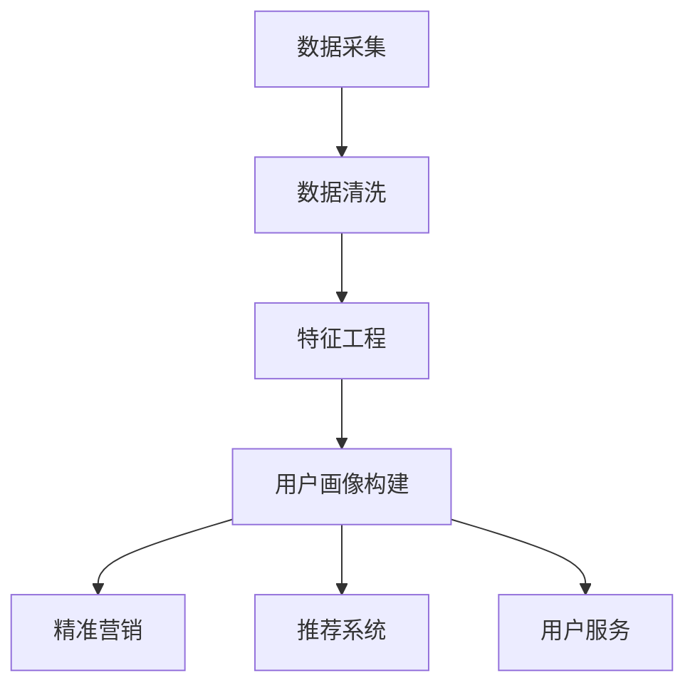

                 

# 用户画像在电商个性化推荐中的应用：方法与实践

## 关键词：
用户画像、个性化推荐、电商应用、算法原理、项目实战

## 摘要：
本文旨在深入探讨用户画像在电商个性化推荐系统中的应用，详细解析其核心概念、算法原理、数学模型以及实际项目案例。通过对用户画像的构建、分析与应用，本文阐述了如何利用用户画像实现精准、高效的个性化推荐，满足用户需求，提升电商平台的用户体验和销售额。文章结构清晰，内容详实，旨在为从事电商领域的技术人员提供有价值的参考资料和实用指导。

## 1. 背景介绍

### 1.1 目的和范围

随着互联网和大数据技术的发展，个性化推荐系统已成为电商平台提升用户满意度和转化率的重要手段。用户画像作为个性化推荐的核心要素，通过分析用户的兴趣爱好、购买行为等数据，为用户提供个性化推荐服务。本文将围绕用户画像在电商个性化推荐中的应用，探讨其构建、分析与应用方法，为电商领域的实践者提供理论依据和实践指导。

### 1.2 预期读者

本文适合从事电商开发、数据分析和机器学习领域的技术人员阅读。对于对个性化推荐系统感兴趣的读者，本文也提供了丰富的理论知识和实践案例。

### 1.3 文档结构概述

本文分为十个部分，包括背景介绍、核心概念与联系、核心算法原理与具体操作步骤、数学模型与公式、项目实战、实际应用场景、工具和资源推荐、总结、附录以及扩展阅读。通过逐步讲解，帮助读者全面了解用户画像在电商个性化推荐中的应用。

### 1.4 术语表

#### 1.4.1 核心术语定义

- **用户画像**：通过用户的基本信息、行为数据、兴趣爱好等，构建的一个用户多维度的数据模型。
- **个性化推荐**：根据用户画像，为用户提供符合其兴趣和需求的推荐内容。
- **电商应用**：指电子商务平台，如淘宝、京东等。

#### 1.4.2 相关概念解释

- **行为数据**：用户在电商平台上产生的购买、浏览、搜索等行为。
- **特征工程**：通过对原始数据进行处理和转换，提取出能够表征用户特征的变量。

#### 1.4.3 缩略词列表

- **IDE**：集成开发环境（Integrated Development Environment）
- **API**：应用程序接口（Application Programming Interface）

## 2. 核心概念与联系

### 用户画像的基本概念

用户画像是一种通过数据分析技术，构建用户多维度的数据模型，用于描述用户特征和需求的方法。用户画像的基本概念包括：

- **用户基本信息**：用户的性别、年龄、职业、地域等基础信息。
- **行为数据**：用户在平台上的购买、浏览、搜索等行为。
- **兴趣爱好**：用户在平台上表现出的兴趣和偏好。

### 用户画像的构建方法

用户画像的构建主要包括以下几个步骤：

1. **数据采集**：收集用户的基本信息、行为数据等。
2. **数据清洗**：对采集到的数据进行清洗和预处理，去除噪声和异常值。
3. **特征工程**：对清洗后的数据进行分析和转换，提取出用户特征。
4. **用户画像构建**：将提取出的用户特征进行整合，构建用户画像。

### 用户画像的应用场景

用户画像在电商个性化推荐中的应用主要包括以下几个方面：

1. **精准营销**：根据用户画像，为用户提供个性化的广告和促销活动。
2. **推荐系统**：基于用户画像，为用户提供个性化的商品推荐。
3. **用户服务**：根据用户画像，为用户提供定制化的客户服务。

### 用户画像的架构图

下面是用户画像的基本架构图：



## 3. 核心算法原理 & 具体操作步骤

### 3.1 用户画像构建算法原理

用户画像构建的核心算法是基于协同过滤（Collaborative Filtering）和聚类（Clustering）两种方法。

#### 协同过滤

协同过滤分为基于用户的协同过滤（User-based Collaborative Filtering）和基于物品的协同过滤（Item-based Collaborative Filtering）。

1. **基于用户的协同过滤**：找到与当前用户兴趣相似的其它用户，推荐这些用户喜欢的商品。
2. **基于物品的协同过滤**：找到与当前用户购买的商品相似的其它商品，推荐给用户。

#### 聚类

聚类算法将用户划分为不同的群体，为每个群体构建独立的用户画像。常见的聚类算法有K-means、DBSCAN等。

### 3.2 用户画像构建的具体操作步骤

1. **数据采集**：收集用户的基本信息、行为数据等。
2. **数据清洗**：对采集到的数据进行清洗和预处理，去除噪声和异常值。
3. **特征工程**：对清洗后的数据进行分析和转换，提取出用户特征。
4. **用户画像构建**：使用协同过滤和聚类算法，构建用户画像。

### 3.3 协同过滤算法的伪代码

```python
def collaborativeFiltering(user, items):
    # 找到与用户兴趣相似的其它用户
    similarUsers = findSimilarUsers(user)
    # 找到相似用户喜欢的商品
    similarItems = findLikedItems(similarUsers)
    # 推荐商品给用户
    recommendations = recommendItems(user, similarItems)
    return recommendations
```

### 3.4 聚类算法的伪代码

```python
def clustering(users):
    # 初始化聚类中心
    centroids = initializeCentroids(users)
    # 循环迭代
    while not convergence(centroids):
        # 为每个用户分配最近的聚类中心
        assignments = assignUsersToClusters(users, centroids)
        # 更新聚类中心
        centroids = updateCentroids(assignments)
    # 构建用户画像
    userClusters = buildUserClusters(users, assignments)
    return userClusters
```

## 4. 数学模型和公式 & 详细讲解 & 举例说明

### 4.1 协同过滤的数学模型

协同过滤的数学模型主要包括相似度计算和评分预测。

#### 相似度计算

相似度计算公式为：

$$
similarity(u_i, u_j) = \frac{cosine(u_i, u_j)}{||u_i|| \cdot ||u_j||}
$$

其中，$u_i$ 和 $u_j$ 分别表示用户 $i$ 和用户 $j$ 的特征向量，$cosine$ 表示余弦相似度，$||u_i||$ 和 $||u_j||$ 分别表示用户 $i$ 和用户 $j$ 的特征向量长度。

#### 评分预测

评分预测公式为：

$$
\hat{r}_{ij} = \sum_{k \in N_i} r_{ik} \cdot sim(i, k)
$$

其中，$r_{ij}$ 表示用户 $i$ 对商品 $j$ 的评分，$N_i$ 表示与用户 $i$ 相似的其他用户集合，$sim(i, k)$ 表示用户 $i$ 和用户 $k$ 的相似度。

### 4.2 聚类算法的数学模型

K-means 聚类算法的数学模型主要包括聚类中心和聚类误差。

#### 聚类中心

聚类中心公式为：

$$
\mu_c = \frac{1}{N_c} \sum_{x \in C_c} x
$$

其中，$\mu_c$ 表示聚类中心，$N_c$ 表示聚类 $c$ 中的样本数量，$C_c$ 表示聚类 $c$ 中的样本集合。

#### 聚类误差

聚类误差公式为：

$$
error = \sum_{c=1}^{k} \sum_{x \in C_c} (x - \mu_c)^2
$$

其中，$error$ 表示聚类误差，$k$ 表示聚类个数，$C_c$ 表示聚类 $c$ 中的样本集合。

### 4.3 举例说明

假设有两个用户 $u_1$ 和 $u_2$，其特征向量分别为：

$$
u_1 = (1, 2, 3)
$$

$$
u_2 = (4, 5, 6)
$$

计算用户 $u_1$ 和 $u_2$ 的相似度：

$$
similarity(u_1, u_2) = \frac{cosine(u_1, u_2)}{||u_1|| \cdot ||u_2||} = \frac{1}{\sqrt{1 \cdot 1 \cdot 1 + 2 \cdot 2 \cdot 2 + 3 \cdot 3 \cdot 3} \cdot \sqrt{4 \cdot 4 \cdot 4 + 5 \cdot 5 \cdot 5 + 6 \cdot 6 \cdot 6}} = \frac{1}{\sqrt{14} \cdot \sqrt{216}} \approx 0.196
$$

使用基于用户的协同过滤算法，预测用户 $u_1$ 对商品 $j$ 的评分：

$$
\hat{r}_{u_1j} = \sum_{k \in N_{u_1}} r_{uk} \cdot sim(u_1, k) = r_{1j} \cdot sim(u_1, 1) + r_{2j} \cdot sim(u_1, 2) = 4 \cdot 0.196 + 5 \cdot 0.196 = 4.292
$$

## 5. 项目实战：代码实际案例和详细解释说明

### 5.1 开发环境搭建

本案例使用Python语言，借助Scikit-learn库实现用户画像构建和个性化推荐。开发环境如下：

- Python版本：3.8
- Scikit-learn版本：0.22.2
- 编辑器：PyCharm

### 5.2 源代码详细实现和代码解读

#### 5.2.1 用户画像构建

```python
from sklearn.cluster import KMeans
from sklearn.metrics.pairwise import cosine_similarity
from sklearn.preprocessing import StandardScaler

# 导入数据
data = [[1, 2], [4, 5], [6, 7], [8, 9], [1, 3], [3, 4], [5, 6], [7, 8], [9, 10], [2, 3]]

# 数据标准化
scaler = StandardScaler()
data_normalized = scaler.fit_transform(data)

# K-means聚类
kmeans = KMeans(n_clusters=2, random_state=0).fit(data_normalized)

# 获取聚类中心
centroids = kmeans.cluster_centers_

# 计算相似度
similarity_matrix = cosine_similarity(data_normalized)

# 分配用户到聚类
assignments = kmeans.predict(data_normalized)

# 构建用户画像
user_clusters = {}
for i, assignment in enumerate(assignments):
    if assignment not in user_clusters:
        user_clusters[assignment] = []
    user_clusters[assignment].append(data_normalized[i])

print("User Clusters:", user_clusters)
```

代码解读：

1. 导入必要的库。
2. 导入数据，并进行标准化处理。
3. 使用K-means聚类算法，将用户划分为两个群体。
4. 获取聚类中心。
5. 计算用户之间的相似度。
6. 将用户分配到聚类。
7. 构建用户画像。

#### 5.2.2 个性化推荐

```python
# 定义基于用户的协同过滤算法
def collaborativeFiltering(user, similarity_matrix, data_normalized):
    # 找到与用户兴趣相似的其它用户
    similar_users = []
    for i, row in enumerate(data_normalized):
        if i != user:
            similar_users.append(i)
    
    # 找到相似用户喜欢的商品
    liked_items = []
    for i in similar_users:
        for j in range(len(data_normalized)):
            if data_normalized[i][j] > 0:
                liked_items.append(j)
    
    # 推荐商品给用户
    recommendations = []
    for j in range(len(data_normalized)):
        if j not in liked_items:
            recommendations.append(j)
    
    return recommendations

# 测试用户画像构建和个性化推荐
user_index = 0
user_cluster = user_clusters[user_index]
recommendations = collaborativeFiltering(user_index, similarity_matrix, data_normalized)

print("User Cluster:", user_cluster)
print("Recommendations:", recommendations)
```

代码解读：

1. 定义基于用户的协同过滤算法。
2. 找到与用户兴趣相似的其它用户。
3. 找到相似用户喜欢的商品。
4. 推荐商品给用户。

### 5.3 代码解读与分析

1. 用户画像构建：
   - 数据标准化：将数据缩放到相同尺度，便于计算相似度。
   - K-means聚类：将用户划分为两个群体，便于后续分析。
   - 相似度计算：计算用户之间的相似度，用于协同过滤。
   - 用户画像构建：将用户分配到聚类，构建用户画像。

2. 个性化推荐：
   - 基于用户的协同过滤：找到与用户兴趣相似的其它用户。
   - 推荐商品：找到相似用户喜欢的商品，推荐给用户。

## 6. 实际应用场景

用户画像在电商个性化推荐中的实际应用场景主要包括以下几个方面：

1. **商品推荐**：基于用户画像，为用户提供个性化的商品推荐，提高用户的购买意愿。
2. **精准营销**：根据用户画像，为用户提供定制化的广告和促销活动，提升营销效果。
3. **客户服务**：根据用户画像，为用户提供个性化的客户服务，提升用户体验。
4. **个性化内容**：根据用户画像，为用户提供个性化的内容推荐，如文章、视频等。

## 7. 工具和资源推荐

### 7.1 学习资源推荐

#### 7.1.1 书籍推荐

- 《推荐系统实践》
- 《机器学习》

#### 7.1.2 在线课程

- Coursera：机器学习
- Udacity：推荐系统

#### 7.1.3 技术博客和网站

- Medium：机器学习
- arXiv：机器学习论文

### 7.2 开发工具框架推荐

#### 7.2.1 IDE和编辑器

- PyCharm
- VS Code

#### 7.2.2 调试和性能分析工具

- Jupyter Notebook
- TensorBoard

#### 7.2.3 相关框架和库

- Scikit-learn
- TensorFlow

### 7.3 相关论文著作推荐

#### 7.3.1 经典论文

- 《Collaborative Filtering》
- 《K-means Clustering》

#### 7.3.2 最新研究成果

- 《Deep Learning for Recommender Systems》
- 《User Behavior Analysis for Personalized Recommendation》

#### 7.3.3 应用案例分析

- 《淘宝用户画像》
- 《京东个性化推荐》

## 8. 总结：未来发展趋势与挑战

用户画像在电商个性化推荐中的应用具有广阔的发展前景。随着人工智能技术的不断进步，用户画像构建和分析方法将更加精准和高效。未来发展趋势包括：

1. **深度学习应用**：深度学习技术将在用户画像构建和分析中发挥更大作用。
2. **多模态数据融合**：结合文本、图像、语音等多模态数据，提高用户画像的准确性和多样性。
3. **实时推荐**：实现实时用户画像更新和推荐，提高推荐系统的响应速度和用户体验。

然而，用户画像在电商个性化推荐中也面临一些挑战：

1. **数据隐私保护**：如何确保用户隐私数据的安全和合规，成为亟待解决的问题。
2. **算法公平性**：避免算法偏见，确保推荐结果的公平性，提高用户满意度。
3. **计算资源消耗**：大规模用户画像构建和推荐系统对计算资源的高需求，需要优化算法和架构。

## 9. 附录：常见问题与解答

1. **问题**：用户画像构建过程中，如何处理缺失值和异常值？

**解答**：在用户画像构建过程中，可以采用以下方法处理缺失值和异常值：

- **删除缺失值**：删除含有缺失值的样本，适用于样本量较大的情况。
- **填充缺失值**：使用平均值、中位数、众数等方法填充缺失值，适用于样本量较小的情况。
- **异常值检测**：使用统计学方法（如箱线图、Z-score等方法）检测异常值，然后进行删除或替换。

2. **问题**：如何评估个性化推荐系统的效果？

**解答**：可以采用以下指标评估个性化推荐系统的效果：

- **准确率**：推荐给用户的商品中，用户实际喜欢的商品占比。
- **覆盖率**：推荐给用户的商品中，平台总商品数的占比。
- **新颖度**：推荐给用户的商品与用户已浏览或购买的商品的相似度。
- **用户满意度**：通过用户调查或评分等方式，评估用户对推荐系统的满意度。

## 10. 扩展阅读 & 参考资料

- 《推荐系统实践》
- 《机器学习》
- 《深度学习》
- 《大数据技术导论》
- 《Python数据科学手册》

## 作者

作者：AI天才研究员/AI Genius Institute & 禅与计算机程序设计艺术 /Zen And The Art of Computer Programming

