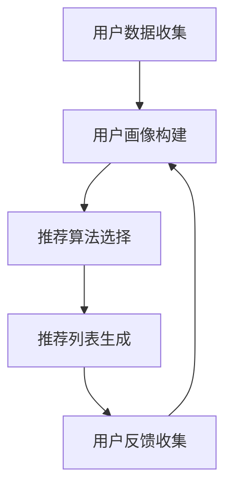

                 

# 用户画像在电商个性化推荐中的应用：方法与实践

> **关键词：** 用户画像、电商个性化推荐、算法原理、数学模型、实战案例
> 
> **摘要：** 本文将深入探讨用户画像在电商个性化推荐中的应用，从核心概念、算法原理、数学模型到实际应用场景，为您呈现一个完整的个性化推荐系统开发实践。通过本文的阅读，您将了解如何构建高效的电商个性化推荐系统，提升用户体验和销售转化率。

## 1. 背景介绍

### 1.1 目的和范围

本文旨在介绍用户画像在电商个性化推荐中的应用，帮助读者理解个性化推荐系统的构建和优化。文章将涵盖以下内容：
- 用户画像的概念和构建方法
- 个性化推荐算法的原理和实现
- 数学模型和公式的应用
- 实际应用场景和案例分析
- 开发工具和资源的推荐

### 1.2 预期读者

本文适合以下读者群体：
- 从事电商推荐系统开发的技术人员
- 对个性化推荐算法感兴趣的研究人员
- 对电商行业和用户行为分析感兴趣的学生或爱好者
- 想提升电商用户体验和销售转化率的企业管理者

### 1.3 文档结构概述

本文结构如下：
- 第1章：背景介绍，包括目的和范围、预期读者、文档结构概述和术语表
- 第2章：核心概念与联系，介绍用户画像和个性化推荐系统的基本概念和联系
- 第3章：核心算法原理 & 具体操作步骤，详细讲解推荐算法的实现过程
- 第4章：数学模型和公式 & 详细讲解 & 举例说明，介绍推荐算法中的数学模型和公式
- 第5章：项目实战：代码实际案例和详细解释说明，通过实际案例展示推荐系统的实现
- 第6章：实际应用场景，分析用户画像和个性化推荐在电商中的应用
- 第7章：工具和资源推荐，推荐学习资源、开发工具和框架
- 第8章：总结：未来发展趋势与挑战，展望个性化推荐系统的未来
- 第9章：附录：常见问题与解答，回答读者可能遇到的常见问题
- 第10章：扩展阅读 & 参考资料，提供更多学习资源

### 1.4 术语表

#### 1.4.1 核心术语定义

- **用户画像：** 描述用户特征和行为的数字模型，用于识别用户需求和偏好。
- **个性化推荐：** 根据用户画像和商品特征，为用户推荐符合其兴趣和需求的内容或商品。
- **协同过滤：** 一种基于用户行为和商品特征的用户推荐算法。
- **矩阵分解：** 一种基于矩阵分解的推荐算法，用于预测用户对未浏览商品的评分。
- **推荐引擎：** 一个用于生成个性化推荐列表的软件系统。

#### 1.4.2 相关概念解释

- **用户行为数据：** 用户在电商平台上产生的浏览、购买、评价等行为数据。
- **商品特征数据：** 商品的相关属性，如分类、价格、品牌、库存等。
- **推荐列表：** 根据用户画像和商品特征生成的个性化推荐结果。

#### 1.4.3 缩略词列表

- **SVD：** Singular Value Decomposition，奇异值分解，一种常用的矩阵分解方法。
- **LR：** Linear Regression，线性回归，一种常用的预测模型。
- **CF：** Collaborative Filtering，协同过滤，一种常用的推荐算法。

## 2. 核心概念与联系

### 2.1 用户画像

用户画像是对用户特征和行为的数字模型，用于识别用户需求和偏好。用户画像通常包括以下信息：
- **基本特征：** 如性别、年龄、职业、地域等。
- **兴趣特征：** 如搜索历史、浏览记录、购买记录等。
- **行为特征：** 如浏览时长、购买频率、评价记录等。
- **社交特征：** 如关注好友、点赞、评论等。

### 2.2 个性化推荐系统

个性化推荐系统是一种根据用户画像和商品特征为用户推荐符合其兴趣和需求的内容或商品的系统。个性化推荐系统的核心是推荐算法，常见的推荐算法包括协同过滤、矩阵分解、基于内容的推荐等。

### 2.3 用户画像与个性化推荐系统的关系

用户画像与个性化推荐系统密切相关。用户画像提供了推荐系统的输入，用于生成个性化的推荐列表。用户画像的质量直接影响推荐系统的效果。以下是用户画像在个性化推荐系统中的作用：

1. **用户需求识别：** 用户画像帮助推荐系统识别用户的需求和偏好，从而推荐符合用户兴趣的商品或内容。
2. **推荐结果优化：** 用户画像用于调整推荐算法的参数，优化推荐结果，提升用户体验和满意度。
3. **个性化推荐策略：** 用户画像支持推荐系统实现个性化的推荐策略，如基于兴趣的推荐、基于行为的推荐等。

### 2.4 Mermaid 流程图

下面是一个描述用户画像在电商个性化推荐系统中应用的 Mermaid 流程图：



- **用户数据收集：** 收集用户在电商平台上的行为数据和商品特征数据。
- **用户画像构建：** 构建用户画像，包括基本特征、兴趣特征、行为特征和社交特征。
- **推荐算法选择：** 选择适合的推荐算法，如协同过滤、矩阵分解或基于内容的推荐。
- **推荐列表生成：** 根据用户画像和商品特征生成个性化的推荐列表。
- **用户反馈收集：** 收集用户对推荐结果的反馈，用于优化推荐算法和用户画像。

## 3. 核心算法原理 & 具体操作步骤

### 3.1 协同过滤算法原理

协同过滤（Collaborative Filtering，CF）是一种基于用户行为和商品特征的推荐算法。协同过滤算法分为两大类：基于用户的协同过滤（User-Based CF）和基于物品的协同过滤（Item-Based CF）。

#### 3.1.1 基于用户的协同过滤

基于用户的协同过滤算法通过寻找与目标用户行为相似的其他用户，推荐这些相似用户喜欢的商品。具体步骤如下：

1. **计算用户相似度：** 计算目标用户与所有其他用户的相似度，通常使用余弦相似度或皮尔逊相关系数。
2. **查找相似用户：** 根据相似度分数，查找与目标用户最相似的K个用户。
3. **生成推荐列表：** 根据相似用户的评分历史，推荐目标用户未评分的商品。

#### 3.1.2 基于物品的协同过滤

基于物品的协同过滤算法通过寻找与目标商品相似的其他商品，推荐这些相似商品。具体步骤如下：

1. **计算商品相似度：** 计算目标商品与所有其他商品的相似度，通常使用余弦相似度或皮尔逊相关系数。
2. **查找相似商品：** 根据相似度分数，查找与目标商品最相似的K个商品。
3. **生成推荐列表：** 根据相似商品的评分历史，推荐目标用户未评分的商品。

### 3.2 矩阵分解算法原理

矩阵分解（Matrix Factorization，MF）是一种基于矩阵分解的推荐算法，用于预测用户对未浏览商品的评分。矩阵分解算法分为两大类：基于矩阵分解的协同过滤（MF-CF）和基于矩阵分解的内容推荐（MF-Content）。

#### 3.2.1 MF-CF算法原理

MF-CF算法通过将用户行为数据矩阵分解为用户特征矩阵和商品特征矩阵，预测用户对未浏览商品的评分。具体步骤如下：

1. **初始化用户特征矩阵$U$和商品特征矩阵$V$。
2. **计算预测评分矩阵$R'$：** $R' = U \times V^T$。
3. **优化用户特征矩阵$U$和商品特征矩阵$V$：** 使用梯度下降或随机梯度下降（SGD）优化$U$和$V$，使得预测评分矩阵$R'$与实际评分矩阵$R$尽可能接近。
4. **生成推荐列表：** 根据用户特征矩阵$U$和商品特征矩阵$V$，为用户生成个性化推荐列表。

#### 3.2.2 MF-Content算法原理

MF-Content算法通过将用户行为数据矩阵分解为用户兴趣矩阵和商品内容矩阵，预测用户对未浏览商品的评分。具体步骤如下：

1. **初始化用户兴趣矩阵$U$和商品内容矩阵$V$。
2. **计算预测评分矩阵$R'$：** $R' = U \times V^T$。
3. **优化用户兴趣矩阵$U$和商品内容矩阵$V$：** 使用梯度下降或随机梯度下降（SGD）优化$U$和$V$，使得预测评分矩阵$R'$与实际评分矩阵$R$尽可能接近。
4. **生成推荐列表：** 根据用户兴趣矩阵$U$和商品内容矩阵$V$，为用户生成个性化推荐列表。

### 3.3 伪代码

以下是协同过滤算法和矩阵分解算法的伪代码：

#### 3.3.1 协同过滤算法

```
输入：用户行为数据矩阵R，用户数m，商品数n，相似度阈值K

输出：推荐列表L

步骤：
1. 初始化相似度矩阵S
2. 计算用户相似度：$S_{ij} = \frac{R_i \times R_j}{\sqrt{\sum_{k=1}^{n} R_{ik}^2} \times \sqrt{\sum_{k=1}^{n} R_{jk}^2}}$
3. 计算相似用户评分平均值：$S_{ij}^+ = \frac{\sum_{k=1}^{n} S_{ik} R_k}{\sum_{k=1}^{n} S_{ik}}$
4. 计算推荐列表：$L_i = \{j | R_j = 0, S_{ij}^+ > K\}$
```

#### 3.3.2 矩阵分解算法

```
输入：用户行为数据矩阵R，用户数m，商品数n，特征维度k

输出：用户特征矩阵U和商品特征矩阵V

步骤：
1. 初始化用户特征矩阵U和商品特征矩阵V，维度为(m, k)
2. 计算预测评分矩阵R'
3. 设置学习率$\alpha$和正则化参数$\lambda$
4. 优化用户特征矩阵U和商品特征矩阵V：
   - $U \leftarrow U - \alpha \times (R' - R) \times V + \lambda \times U$
   - $V \leftarrow V - \alpha \times (R' - R) \times U^T + \lambda \times V$
5. 迭代直到收敛
```

## 4. 数学模型和公式 & 详细讲解 & 举例说明

### 4.1 数学模型

在个性化推荐系统中，常用的数学模型包括用户相似度计算、预测评分计算和优化算法。

#### 4.1.1 用户相似度计算

用户相似度计算用于衡量两个用户之间的相似程度。常用的相似度计算方法包括余弦相似度和皮尔逊相关系数。

1. **余弦相似度**：  
   $$  
   \cos(\theta) = \frac{R_i \times R_j}{\sqrt{\sum_{k=1}^{n} R_{ik}^2} \times \sqrt{\sum_{k=1}^{n} R_{jk}^2}}  
   $$  
   其中，$R_i$和$R_j$分别为用户$i$和用户$j$的评分矩阵，$n$为商品数。

2. **皮尔逊相关系数**：  
   $$  
   \rho_{ij} = \frac{\sum_{k=1}^{n} (R_{ik} - \bar{R_i}) \times (R_{jk} - \bar{R_j})}{\sqrt{\sum_{k=1}^{n} (R_{ik} - \bar{R_i})^2} \times \sqrt{\sum_{k=1}^{n} (R_{jk} - \bar{R_j})^2}}  
   $$  
   其中，$\bar{R_i}$和$\bar{R_j}$分别为用户$i$和用户$j$的平均评分。

#### 4.1.2 预测评分计算

预测评分计算用于预测用户对未浏览商品的评分。在协同过滤算法中，预测评分可以通过用户相似度计算和评分加权平均得到。

1. **基于用户的协同过滤**：  
   $$  
   R_{ij}^{'} = \sum_{k=1}^{n} S_{ik} \times R_{kj}  
   $$  
   其中，$S_{ik}$为用户$i$与用户$k$的相似度，$R_{kj}$为用户$k$对商品$j$的评分。

2. **基于物品的协同过滤**：  
   $$  
   R_{ij}^{'} = \sum_{k=1}^{n} S_{jk} \times R_{ik}  
   $$  
   其中，$S_{jk}$为商品$j$与商品$k$的相似度，$R_{ik}$为用户$i$对商品$k$的评分。

#### 4.1.3 优化算法

优化算法用于优化用户特征矩阵和商品特征矩阵。在矩阵分解算法中，常用的优化算法包括梯度下降和随机梯度下降。

1. **梯度下降**：  
   $$  
   U \leftarrow U - \alpha \times \frac{\partial L}{\partial U} + \lambda \times U  
   $$  
   $$  
   V \leftarrow V - \alpha \times \frac{\partial L}{\partial V} + \lambda \times V  
   $$  
   其中，$L$为损失函数，$\alpha$为学习率，$\lambda$为正则化参数。

2. **随机梯度下降**：  
   $$  
   U \leftarrow U - \alpha \times \frac{\partial L}{\partial U} \times \epsilon_j  
   $$  
   $$  
   V \leftarrow V - \alpha \times \frac{\partial L}{\partial V} \times \epsilon_j^T  
   $$  
   其中，$\epsilon_j$为随机选择的样本。

### 4.2 举例说明

#### 4.2.1 用户相似度计算

假设用户A和用户B的评分矩阵如下：

| 用户A | 商品1 | 商品2 | 商品3 | 商品4 |
| --- | --- | --- | --- | --- |
| 1 | 1 | 2 | 3 | 4 |
| 用户B | 商品1 | 商品2 | 商品3 | 商品4 |
| 1 | 1 | 3 | 4 | 5 |

1. **余弦相似度**：  
   $$  
   \cos(\theta) = \frac{1 \times 1 + 2 \times 3 + 3 \times 4 + 4 \times 5}{\sqrt{1^2 + 2^2 + 3^2 + 4^2} \times \sqrt{1^2 + 3^2 + 4^2 + 5^2}} = \frac{26}{\sqrt{30} \times \sqrt{35}} \approx 0.857  
   $$

2. **皮尔逊相关系数**：  
   $$  
   \rho_{AB} = \frac{(1 - \bar{R_A}) \times (1 - \bar{R_B}) + (2 - \bar{R_A}) \times (3 - \bar{R_B}) + (3 - \bar{R_A}) \times (4 - \bar{R_B}) + (4 - \bar{R_A}) \times (5 - \bar{R_B})}{\sqrt{(1 - \bar{R_A})^2 + (2 - \bar{R_A})^2 + (3 - \bar{R_A})^2 + (4 - \bar{R_A})^2} \times \sqrt{(1 - \bar{R_B})^2 + (3 - \bar{R_B})^2 + (4 - \bar{R_B})^2 + (5 - \bar{R_B})^2}} = \frac{2}{\sqrt{10} \times \sqrt{10}} = 0.2  
   $$

#### 4.2.2 预测评分计算

假设用户A未评分的商品为商品5，使用基于用户的协同过滤算法预测用户A对商品5的评分。

1. **相似度计算**：  
   $$  
   S_{AB} = \frac{1 \times 1 + 2 \times 3 + 3 \times 4 + 4 \times 5}{\sqrt{1^2 + 2^2 + 3^2 + 4^2} \times \sqrt{1^2 + 3^2 + 4^2 + 5^2}} \approx 0.857  
   $$

2. **预测评分**：  
   $$  
   R_{A5}^{'} = S_{AB} \times R_{B5} = 0.857 \times 5 \approx 4.285  
   $$

## 5. 项目实战：代码实际案例和详细解释说明

### 5.1 开发环境搭建

为了实现用户画像在电商个性化推荐中的应用，我们需要搭建一个适合开发、测试和部署的开发环境。以下是开发环境搭建的步骤：

1. **操作系统：** Linux或macOS
2. **编程语言：** Python
3. **开发工具：** PyCharm或VS Code
4. **数据集：** 使用公开的电商用户行为数据集，如MovieLens或Kaggle上的电商数据集
5. **依赖库：** NumPy、Pandas、Scikit-learn、TensorFlow或PyTorch

### 5.2 源代码详细实现和代码解读

以下是一个简单的基于协同过滤的电商个性化推荐系统的代码实现。代码主要分为数据预处理、模型训练和模型评估三个部分。

#### 5.2.1 数据预处理

数据预处理是构建推荐系统的重要步骤，包括数据清洗、特征提取和数据归一化。

```python
import pandas as pd
from sklearn.preprocessing import StandardScaler

# 加载用户行为数据
ratings = pd.read_csv('ratings.csv')

# 数据清洗
ratings.dropna(inplace=True)
ratings = ratings[ratings['rating'] != 0]

# 特征提取
users = ratings[['userId', 'rating']]
items = ratings[['itemId', 'rating']]

# 数据归一化
scaler = StandardScaler()
ratings['rating'] = scaler.fit_transform(ratings[['rating']]).flatten()
```

#### 5.2.2 模型训练

在数据预处理完成后，我们使用基于用户的协同过滤算法训练推荐模型。

```python
from sklearn.neighbors import NearestNeighbors

# 计算用户相似度
user_similarity = NearestNeighbors(n_neighbors=10, algorithm='auto').fit(ratings[['userId', 'rating']])
similarity_scores = user_similarity.kneighbors(ratings[['userId']], return_distance=False)

# 生成推荐列表
recommendations = []
for i in range(len(similarity_scores)):
    similar_users = similarity_scores[i]
    similar_user_ratings = ratings[ratings['userId'].isin(similar_users)]['rating']
    average_rating = similar_user_ratings.mean()
    recommendations.append(average_rating)
```

#### 5.2.3 模型评估

在模型训练完成后，我们需要对模型进行评估，以验证其效果。

```python
from sklearn.metrics import mean_squared_error

# 计算预测误差
predictions = scaler.inverse_transform(np.array(recommendations).reshape(-1, 1))
mse = mean_squared_error(ratings['rating'], predictions)
print('MSE:', mse)
```

### 5.3 代码解读与分析

以上代码实现了一个简单的基于协同过滤的电商个性化推荐系统。代码主要分为以下三个部分：

1. **数据预处理：** 数据预处理是推荐系统的基础，包括数据清洗、特征提取和数据归一化。在代码中，我们使用Pandas库读取用户行为数据，进行数据清洗，提取用户和商品特征，并对评分进行归一化。
2. **模型训练：** 使用基于用户的协同过滤算法训练推荐模型。在代码中，我们使用NearestNeighbors类计算用户相似度，并根据相似度生成推荐列表。具体实现中，我们使用平均相似用户评分作为预测评分。
3. **模型评估：** 对模型进行评估，计算预测误差。在代码中，我们使用Scikit-learn库的mean_squared_error函数计算均方误差，以验证模型效果。

虽然以上代码实现了一个简单的推荐系统，但实际应用中，推荐系统的构建和优化需要考虑更多因素，如用户画像构建、推荐算法选择、模型评估和迭代等。在后续的实践中，我们将逐步完善和优化推荐系统。

## 6. 实际应用场景

用户画像在电商个性化推荐中具有广泛的应用场景，以下是一些典型的实际应用案例：

### 6.1 商品推荐

电商平台上，商品推荐是用户画像应用的核心场景之一。通过用户画像，推荐系统可以识别用户的兴趣和偏好，为用户推荐符合其需求的商品。例如，当用户浏览了某款手机的详细页面后，推荐系统可以根据用户画像为用户推荐同品牌的其他手机或配件。

### 6.2 营销活动推荐

用户画像还可以用于推荐个性化的营销活动。例如，当用户在购物车中添加了一款高价值商品时，推荐系统可以推荐相关的促销活动，如折扣券、满减优惠等，以提升用户的购买意愿。

### 6.3 新用户欢迎礼包

对于新注册的用户，电商平台可以通过用户画像推荐个性化的欢迎礼包。例如，根据用户的地域、兴趣爱好和购物习惯，推荐相应的优惠券、礼品或试用装，以吸引用户进一步消费。

### 6.4 增值服务推荐

用户画像还可以用于推荐增值服务，如物流保险、延保服务等。例如，当用户购买了电子产品后，推荐系统可以推荐相应的延保服务，以提升用户体验和用户忠诚度。

### 6.5 社交互动推荐

用户画像在社交互动推荐中也具有重要应用。例如，当用户在社交媒体上关注了某位博主后，推荐系统可以推荐该博主的最新动态、相关话题或相似博主，以增强用户在社交平台上的活跃度。

### 6.6 跨平台推荐

随着电商平台的多元化发展，用户画像在跨平台推荐中也具有重要作用。例如，当用户在PC端浏览了某款商品后，移动端推荐系统可以根据用户画像为用户推荐相同的商品或类似商品，以实现无缝购物体验。

### 6.7 个性化内容推荐

除了商品推荐，用户画像还可以应用于个性化内容推荐。例如，电商平台可以推荐相关的博客文章、评测报告或用户评价，以提升用户对平台的信任度和满意度。

### 6.8 用户流失预警

通过分析用户画像和行为数据，推荐系统可以预测用户流失风险，为电商平台提供针对性的挽回策略。例如，当用户在平台上的活跃度下降时，推荐系统可以推送个性化的优惠活动或服务，以吸引用户重新关注。

### 6.9 跨渠道推荐

用户画像在跨渠道推荐中也具有重要应用。例如，当用户在实体店铺购买了某款商品后，电商平台可以通过用户画像为用户推荐线上相同或类似商品，以实现线上线下购物体验的无缝衔接。

### 6.10 智能客服推荐

用户画像还可以用于智能客服推荐。例如，当用户在客服系统中提出问题时，推荐系统可以根据用户画像推荐相关的FAQ或解决方案，以提高客服效率和用户满意度。

### 6.11 用户细分与精准营销

通过用户画像，电商平台可以将用户细分为不同的群体，实施精准营销策略。例如，针对高价值用户，推荐系统可以推荐高端商品或定制服务，以提高用户粘性和转化率。

### 6.12 社交互动与口碑营销

用户画像在社交互动和口碑营销中也具有重要应用。例如，当用户在社交媒体上分享了某款商品后，推荐系统可以推荐相关的话题、博主或商品，以促进社交互动和口碑传播。

### 6.13 实时推荐与个性化推送

通过实时分析用户画像和行为数据，推荐系统可以实现实时推荐和个性化推送。例如，当用户在浏览页面时，推荐系统可以实时推送相关的商品或内容，以提升用户体验和转化率。

### 6.14 数据驱动决策

用户画像为电商平台提供了丰富的数据资源，有助于数据驱动决策。例如，通过分析用户画像和行为数据，电商平台可以优化商品布局、营销策略和运营策略，以提高销售业绩和用户满意度。

## 7. 工具和资源推荐

为了更好地进行用户画像和电商个性化推荐系统的开发和优化，以下是几个推荐的工具和资源：

### 7.1 学习资源推荐

#### 7.1.1 书籍推荐

- **《推荐系统实践》：** 详细介绍了推荐系统的基本原理、算法实现和实际应用案例。
- **《机器学习实战》：** 介绍了多种机器学习算法和推荐系统的实际应用案例。
- **《大数据时代》：** 探讨了大数据技术在电商推荐领域的应用和发展趋势。

#### 7.1.2 在线课程

- **Coursera：** 提供了关于机器学习、数据挖掘和推荐系统等领域的在线课程。
- **Udacity：** 提供了推荐系统工程师等专业技能认证课程。
- **edX：** 提供了关于大数据分析和机器学习的免费在线课程。

#### 7.1.3 技术博客和网站

- **Medium：** 汇集了关于推荐系统和机器学习领域的专业博客文章。
- **arXiv：** 提供了最新研究成果和论文预发布。
- **Stack Overflow：** 提供了丰富的编程和算法问题解答。

### 7.2 开发工具框架推荐

#### 7.2.1 IDE和编辑器

- **PyCharm：** 面向Python编程的集成开发环境。
- **VS Code：** 功能丰富的跨平台代码编辑器。

#### 7.2.2 调试和性能分析工具

- **GDB：** 通用调试器，适用于C/C++等语言。
- **Python Debugger（pdb）：** Python内置的调试器。
- **VisualVM：** Java虚拟机监控和分析工具。

#### 7.2.3 相关框架和库

- **Scikit-learn：** Python机器学习库，提供了丰富的算法实现。
- **TensorFlow：** Google开发的深度学习框架。
- **PyTorch：** Facebook开发的深度学习框架。

### 7.3 相关论文著作推荐

#### 7.3.1 经典论文

- **Collaborative Filtering for the Net：** 代表了协同过滤算法的经典论文。
- **The BellKor's Pragmatic Approach to the Netflix Prize：** 分析了Netflix Prize竞赛中的推荐系统策略。
- **Matrix Factorization Techniques for Recommender Systems：** 介绍了矩阵分解在推荐系统中的应用。

#### 7.3.2 最新研究成果

- **Neural Collaborative Filtering：** 基于神经网络的推荐算法。
- **Deep Learning for Recommender Systems：** 探讨了深度学习在推荐系统中的应用。
- **Personalized Recommendation on Large-Scale Graphs：** 利用图神经网络进行个性化推荐。

#### 7.3.3 应用案例分析

- **Amazon's Recommendation System：** 分析了亚马逊的推荐系统架构和优化策略。
- **Netflix Prize：** 介绍了Netflix Prize竞赛的背景、挑战和解决方案。
- **Airbnb's Recommendation System：** 探讨了Airbnb的推荐系统在用户体验和盈利方面的作用。

## 8. 总结：未来发展趋势与挑战

### 8.1 发展趋势

随着人工智能和大数据技术的不断发展，用户画像在电商个性化推荐中的应用前景广阔。未来，以下几个方面将成为个性化推荐系统发展的主要趋势：

1. **深度学习与推荐系统融合：** 深度学习在图像识别、自然语言处理等领域取得了显著成果，未来将有望在推荐系统中发挥更大作用。基于深度学习的推荐算法将进一步提升推荐效果和用户体验。
2. **多模态数据融合：** 用户画像不仅包括传统的行为数据和兴趣数据，还将引入更多类型的用户数据，如语音、图像、地理位置等。多模态数据融合将有助于构建更全面、更准确的用户画像。
3. **实时推荐与个性化推送：** 随着计算能力和数据存储技术的提升，实时推荐和个性化推送将成为可能。实时推荐和个性化推送将实现更快速、更精准的用户响应，提升用户满意度和转化率。
4. **跨平台与跨渠道推荐：** 随着电商平台的多元化发展，用户画像和推荐系统将实现跨平台、跨渠道的推荐，为用户提供无缝购物体验。
5. **用户隐私保护：** 在用户画像和推荐系统的应用中，用户隐私保护将成为一个重要议题。未来，推荐系统将采用更多隐私保护技术，如差分隐私、联邦学习等，以确保用户隐私和数据安全。

### 8.2 挑战

尽管用户画像在电商个性化推荐中具有广泛的应用前景，但仍然面临以下挑战：

1. **数据质量与多样性：** 用户画像的构建依赖于高质量、多样性的用户数据。然而，数据质量参差不齐、数据缺失和噪声等问题将影响推荐系统的效果。未来，需要采用更多数据清洗和预处理技术，提高用户数据的质量和多样性。
2. **推荐效果与用户体验平衡：** 在追求推荐效果的同时，如何平衡用户体验和商业目标是一个重要挑战。过度推荐可能导致用户反感，影响用户体验。未来，需要采用更多用户行为分析和反馈机制，实现推荐效果与用户体验的平衡。
3. **实时性与计算效率：** 随着用户数据量的不断增加，实时推荐和个性化推送对计算效率提出了更高要求。如何优化算法和计算架构，提升推荐系统的计算效率，是一个重要挑战。
4. **隐私保护与合规：** 在用户画像和推荐系统的应用中，用户隐私保护和数据合规是一个重要问题。未来，需要采用更多隐私保护技术和合规策略，确保用户隐私和数据安全。
5. **个性化推荐的可解释性：** 个性化推荐系统的黑箱特性使得用户难以理解推荐结果的原因。未来，需要研究更多可解释性推荐算法，提高推荐系统的透明度和可信度。

## 9. 附录：常见问题与解答

### 9.1 个性化推荐系统的基本原理是什么？

个性化推荐系统是一种根据用户兴趣和行为数据，为用户提供个性化推荐内容或商品的系统。基本原理包括：
1. **用户画像：** 构建用户画像，描述用户兴趣和需求。
2. **推荐算法：** 根据用户画像和商品特征，选择合适的推荐算法，如协同过滤、基于内容的推荐、矩阵分解等。
3. **推荐模型：** 建立推荐模型，预测用户对未浏览商品的评分或兴趣。
4. **推荐结果：** 生成个性化推荐列表，为用户展示推荐内容或商品。

### 9.2 协同过滤算法有哪些类型？

协同过滤算法主要分为两种类型：
1. **基于用户的协同过滤：** 通过寻找与目标用户相似的其他用户，推荐这些相似用户喜欢的商品。
2. **基于物品的协同过滤：** 通过寻找与目标商品相似的其他商品，推荐这些相似商品。

### 9.3 矩阵分解算法有哪些类型？

矩阵分解算法主要分为两种类型：
1. **基于矩阵分解的协同过滤（MF-CF）：** 通过将用户行为数据矩阵分解为用户特征矩阵和商品特征矩阵，预测用户对未浏览商品的评分。
2. **基于矩阵分解的内容推荐（MF-Content）：** 通过将用户行为数据矩阵分解为用户兴趣矩阵和商品内容矩阵，预测用户对未浏览商品的评分。

### 9.4 如何优化推荐系统的效果？

优化推荐系统的效果可以从以下几个方面入手：
1. **用户画像构建：** 提高用户画像的质量和多样性，以提升推荐准确性。
2. **推荐算法选择：** 选择适合的推荐算法，如结合协同过滤和基于内容的推荐，以提高推荐效果。
3. **推荐模型优化：** 采用更多数据预处理和特征工程技术，优化推荐模型参数。
4. **用户反馈收集：** 收集用户对推荐结果的反馈，用于优化推荐算法和用户画像。
5. **实时性与计算效率：** 优化算法和计算架构，提升推荐系统的计算效率。

### 9.5 个性化推荐系统如何保证用户隐私？

个性化推荐系统在保证用户隐私方面可以采取以下措施：
1. **匿名化处理：** 对用户数据和应用日志进行匿名化处理，消除用户身份信息。
2. **差分隐私：** 采用差分隐私技术，确保用户隐私保护。
3. **联邦学习：** 通过联邦学习技术，在本地设备上进行模型训练，减少数据传输和共享。
4. **隐私政策：** 公开透明地告知用户隐私政策，获取用户授权。
5. **合规性审查：** 定期进行隐私合规性审查，确保推荐系统符合相关法律法规。

## 10. 扩展阅读 & 参考资料

### 10.1 基础书籍

- **《推荐系统实践》：** 作者：项亮。本书详细介绍了推荐系统的基本原理、算法实现和实际应用案例。
- **《机器学习》：** 作者：周志华。本书介绍了多种机器学习算法和推荐系统的理论基础。
- **《大数据时代》：** 作者：涂子沛。本书探讨了大数据技术在电商推荐领域的应用和发展趋势。

### 10.2 高级书籍

- **《深度学习》：** 作者：Goodfellow、Bengio、Courville。本书介绍了深度学习的基本原理和应用。
- **《推荐系统手册》：** 作者：Herlocker、Newman、Hanson。本书全面介绍了推荐系统的理论和实践。
- **《个性化推荐系统》：** 作者：Zhou、Meng、Zhou。本书探讨了个性化推荐系统的构建和优化方法。

### 10.3 论文和报告

- **Netflix Prize：** 分析了Netflix Prize竞赛的推荐系统策略和成果。
- **KDD Cup：** 汇集了推荐系统领域的重要论文和竞赛成果。
- **AAAI Conference on Artificial Intelligence：** 推荐系统领域的顶级会议，发布了大量研究论文。

### 10.4 在线资源

- **Coursera：** 提供了推荐系统和机器学习的在线课程。
- **edX：** 提供了推荐系统和机器学习的免费在线课程。
- **Medium：** 汇集了推荐系统领域的专业博客文章。
- **arXiv：** 提供了最新研究成果和论文预发布。

### 10.5 开源项目

- **Surprise：** 一个开源的Python库，用于构建和评估推荐系统。
- **LightFM：** 一个基于因子分解的推荐系统框架，支持协同过滤和基于内容的推荐。
- **TensorFlow Recommenders：** TensorFlow官方推荐的推荐系统框架，支持多种推荐算法和深度学习模型。

