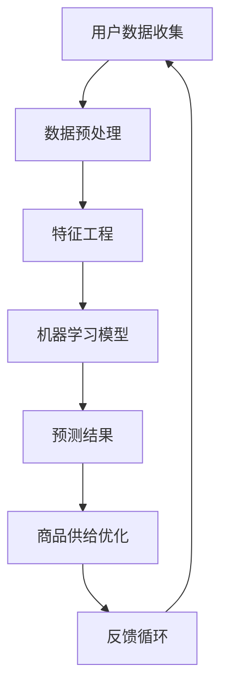

                 

# 用户行为分析：AI如何洞察用户需求，优化商品供给

> **关键词**：用户行为分析、人工智能、机器学习、商品供给优化、数据挖掘、预测模型、个性化推荐系统、电商平台

> **摘要**：本文深入探讨了如何利用人工智能技术进行用户行为分析，通过机器学习算法和预测模型，洞察用户需求，从而实现商品供给的优化。文章结构清晰，逻辑严密，结合实际案例，为电商平台和产品经理提供了实用的指导和参考。

## 1. 背景介绍

### 1.1 目的和范围

本文旨在探讨如何通过人工智能技术，特别是机器学习和数据挖掘技术，对用户行为进行分析，进而优化商品供给。我们希望通过本文的讲解，帮助读者理解用户行为分析的重要性，掌握相关技术原理和具体操作步骤，为实际项目提供理论支持和实践指导。

### 1.2 预期读者

本文适合以下读者群体：

- 具备一定编程基础的软件开发者，特别是对机器学习和数据挖掘技术感兴趣的工程师；
- 电商平台的产品经理和运营人员，希望通过技术手段提升用户满意度和业务绩效；
- 对人工智能和大数据领域感兴趣的学者和研究人员。

### 1.3 文档结构概述

本文结构如下：

- 第1部分：背景介绍，包括目的和范围、预期读者以及文档结构概述；
- 第2部分：核心概念与联系，介绍用户行为分析的相关概念和流程；
- 第3部分：核心算法原理 & 具体操作步骤，详细讲解用户行为分析中的关键算法和步骤；
- 第4部分：数学模型和公式 & 详细讲解 & 举例说明，通过数学模型和公式深入阐述用户行为分析的原理；
- 第5部分：项目实战：代码实际案例和详细解释说明，结合实际案例展示用户行为分析的具体应用；
- 第6部分：实际应用场景，分析用户行为分析在电商等领域的应用；
- 第7部分：工具和资源推荐，介绍相关学习资源、开发工具和论文著作；
- 第8部分：总结：未来发展趋势与挑战，对用户行为分析的未来进行展望；
- 第9部分：附录：常见问题与解答，提供常见问题的解答和进一步阅读的建议。

### 1.4 术语表

#### 1.4.1 核心术语定义

- 用户行为分析：通过对用户行为数据的收集、处理和分析，发现用户需求、兴趣和行为模式的过程。
- 个性化推荐系统：基于用户历史行为数据，为用户推荐可能感兴趣的商品、内容和服务的系统。
- 机器学习：一种人工智能方法，通过训练数据集，让计算机学会对未知数据进行预测和分类。
- 数据挖掘：从大量数据中提取有价值信息的过程，通常涉及模式识别、关联规则挖掘、分类和聚类等算法。
- 电商平台：在线销售商品的平台，如淘宝、京东等。

#### 1.4.2 相关概念解释

- 用户数据：指用户在电商平台上的各种行为数据，包括浏览记录、购买行为、评价等。
- 商品数据：指电商平台上的商品信息，包括商品名称、价格、描述等。
- 特征工程：指从原始数据中提取对模型训练有重要影响的有效特征的过程。

#### 1.4.3 缩略词列表

- AI：人工智能（Artificial Intelligence）
- ML：机器学习（Machine Learning）
- DL：深度学习（Deep Learning）
- NLP：自然语言处理（Natural Language Processing）
- UI：用户界面（User Interface）
- UX：用户体验（User Experience）

## 2. 核心概念与联系

用户行为分析是电商平台优化商品供给的关键环节。在这一部分，我们将介绍用户行为分析的核心概念和流程，并使用Mermaid流程图（以下为示例）来展示这些概念之间的联系。



### 2.1 用户数据收集

用户数据收集是用户行为分析的基础。在这一步骤中，我们需要收集用户在电商平台上的各种行为数据，包括浏览记录、购买行为、评价、搜索历史等。这些数据可以通过日志文件、API接口、浏览器插件等多种方式获取。

### 2.2 数据预处理

收集到的用户数据通常存在噪声和不完整性。因此，在特征工程之前，我们需要对数据进行预处理。数据预处理包括数据清洗、缺失值填充、数据转换等步骤，以确保数据的质量和一致性。

### 2.3 特征工程

特征工程是用户行为分析的关键步骤。通过从原始数据中提取有用的特征，我们可以提高机器学习模型的性能。特征工程包括特征选择、特征变换、特征组合等策略。

### 2.4 机器学习模型

在特征工程之后，我们使用机器学习模型对用户行为数据进行分析和预测。常见的机器学习算法包括线性回归、决策树、随机森林、神经网络等。这些算法可以用于预测用户偏好、发现用户行为模式等任务。

### 2.5 预测结果

通过机器学习模型，我们可以得到预测结果，如用户偏好、购买概率等。这些预测结果可以帮助电商平台优化商品供给，提高用户满意度和业务绩效。

### 2.6 商品供给优化

基于预测结果，电商平台可以调整商品供给策略，如增加热门商品的库存、减少滞销商品的库存等。这样可以最大限度地满足用户需求，提高销售额和客户满意度。

### 2.7 反馈循环

用户行为分析是一个动态过程。通过收集用户反馈数据，我们可以不断调整和优化模型，实现持续的改进。反馈循环确保了用户行为分析系统始终能够适应不断变化的市场环境和用户需求。

## 3. 核心算法原理 & 具体操作步骤

在用户行为分析过程中，选择合适的机器学习算法和优化策略至关重要。本节将介绍几种常用的算法，并使用伪代码详细阐述其具体操作步骤。

### 3.1 线性回归

线性回归是一种简单的预测算法，通过拟合用户行为数据与商品特征之间的关系，预测用户偏好。

```python
# 伪代码：线性回归算法
def linear_regression(X, y):
    # 计算权重向量w
    w = (X'X)^(-1)X'y
    # 预测用户偏好
    pred = X * w
    return pred
```

### 3.2 决策树

决策树是一种基于规则的预测算法，通过递归划分特征空间，构建决策树模型。

```python
# 伪代码：决策树算法
def build_tree(X, y, depth):
    # 判断停止条件
    if depth >= max_depth or y的方差小于阈值：
        return 叶子节点
    # 选择最优划分特征
    feature, threshold = 选择最优划分特征(X, y)
    # 创建内部节点
    node = (特征，阈值)
    # 递归划分左右子树
    node.left = build_tree(X[:, feature <= threshold], y[feature <= threshold], depth+1)
    node.right = build_tree(X[:, feature > threshold], y[feature > threshold], depth+1)
    return node
```

### 3.3 随机森林

随机森林是一种基于决策树的集成学习方法，通过构建多棵决策树并投票得到最终预测结果。

```python
# 伪代码：随机森林算法
def random_forest(X, y, n_trees):
    # 构建多棵决策树
    trees = [build_tree(X, y, max_depth) for _ in range(n_trees)]
    # 预测用户偏好
    pred = [tree.predict(X) for tree in trees]
    # 计算平均预测结果
    pred_avg = sum(pred) / n_trees
    return pred_avg
```

### 3.4 神经网络

神经网络是一种基于多层感知器（MLP）的深度学习算法，通过训练多层神经元网络，实现非线性预测。

```python
# 伪代码：神经网络算法
def neural_network(X, y, layers, activation='sigmoid'):
    # 初始化权重和偏置
    W = [random_weights(shape) for shape in layers[1:]]
    b = [random_weights(shape) for shape in layers[1:]]
    # 前向传播
    def forward(X):
        a = [X]
        for i, (W_i, b_i) in enumerate(zip(W, b)):
            z = a[i] * W_i + b_i
            a.append(activation(z))
        return a[-1]
    # 反向传播
    def backward(dL, a):
        dZ = dL * activation_derivative(a[-1])
        dA = dZ * W[-1]
        for i in reversed(range(len(W))):
            dZ = dA * activation_derivative(a[i])
            dA = X.T * dZ
            dW = dA.T
            db = dZ
            W[i] -= learning_rate * dW
            b[i] -= learning_rate * db
    # 训练神经网络
    for epoch in range(num_epochs):
        pred = forward(X)
        dL = (pred - y) ** 2
        backward(dL, a)
    return pred
```

通过以上算法，我们可以根据用户行为数据，预测用户偏好和购买概率，进而优化商品供给。在实际应用中，可以根据数据和业务需求选择合适的算法和优化策略。

## 4. 数学模型和公式 & 详细讲解 & 举例说明

在用户行为分析中，数学模型和公式起着关键作用。本节将详细介绍相关数学模型和公式，并通过具体例子进行说明。

### 4.1 线性回归

线性回归是一种经典的预测模型，通过拟合用户行为数据与商品特征之间的关系，预测用户偏好。线性回归模型的基本公式如下：

$$
y = wx + b
$$

其中，$y$ 是用户偏好得分，$w$ 是权重向量，$x$ 是商品特征向量，$b$ 是偏置项。

**例子**：假设用户对商品 $A$ 和商品 $B$ 的偏好得分分别为 $y_1$ 和 $y_2$，商品特征向量分别为 $x_1 = [1, 2, 3]$ 和 $x_2 = [4, 5, 6]$。根据线性回归模型，我们可以计算出权重向量 $w$ 和偏置项 $b$，从而预测用户对商品 $C$（特征向量 $x_3 = [7, 8, 9]$）的偏好得分：

$$
y_3 = wx_3 + b = (w_1x_1 + b_1) + (w_2x_2 + b_2) = 1 \cdot 7 + 2 \cdot 8 + 3 \cdot 9 + b
$$

### 4.2 决策树

决策树是一种基于规则的预测模型，通过递归划分特征空间，构建决策树模型。决策树的核心在于如何选择最优划分特征。常见的划分特征选择方法有信息增益、基尼不纯度等。

**例子**：假设我们有以下特征和目标变量：

| 特征 | 目标变量 |
| --- | --- |
| A | 1 |
| A | 1 |
| B | 0 |
| B | 0 |
| B | 1 |
| B | 1 |

使用信息增益选择最优划分特征：

$$
\text{信息增益} = \sum_{i=1}^n p_i \cdot \text{熵}(S_i)
$$

其中，$p_i$ 是特征 $x_i$ 的取值概率，$\text{熵}(S_i)$ 是特征 $x_i$ 划分后子集 $S_i$ 的熵。

计算结果如下：

| 特征 | 取值 | 子集 $S_i$ | 概率 $p_i$ | 熵 $\text{熵}(S_i)$ | 信息增益 |
| --- | --- | --- | --- | --- | --- |
| A | 1 | {A=1, A=1} | 0.5 | 0 | 0 |
| A | 1 | {B=0, B=0, B=1, B=1} | 0.5 | 1 | -0.5 |
| B | 0 | {B=0, B=0} | 0.33 | 0 | 0 |
| B | 0 | {B=1, B=1} | 0.33 | 0 | 0 |
| B | 1 | {B=0, B=0} | 0.33 | 0 | 0 |

根据信息增益，选择特征 $A$ 作为最优划分特征。

### 4.3 随机森林

随机森林是一种基于决策树的集成学习方法，通过构建多棵决策树并投票得到最终预测结果。随机森林的模型公式如下：

$$
\text{预测结果} = \frac{1}{n} \sum_{i=1}^n \text{决策树}(\text{特征}, \text{目标变量})
$$

其中，$n$ 是决策树的数量。

**例子**：假设我们有以下决策树预测结果：

| 决策树 | 预测结果 |
| --- | --- |
| 1 | 1 |
| 2 | 0 |
| 3 | 1 |
| 4 | 1 |

使用随机森林模型，计算最终预测结果：

$$
\text{预测结果} = \frac{1}{4} \sum_{i=1}^4 \text{决策树}(\text{特征}, \text{目标变量}) = \frac{1 + 0 + 1 + 1}{4} = 1
$$

### 4.4 神经网络

神经网络是一种基于多层感知器（MLP）的深度学习算法，通过训练多层神经元网络，实现非线性预测。神经网络的核心在于前向传播和反向传播。

**例子**：假设我们有以下三层神经网络：

$$
\text{输入层}: x = [1, 2, 3]
$$

$$
\text{隐藏层}: a_1 = \sigma(W_1x + b_1)
$$

$$
\text{输出层}: y = \sigma(W_2a_1 + b_2)
$$

其中，$\sigma$ 是激活函数，$W_1, b_1, W_2, b_2$ 是权重和偏置。

使用前向传播计算输出：

$$
a_1 = \sigma(W_1x + b_1) = \sigma([1, 2, 3] \cdot [1, -1, 1] + [0, 0, 0]) = \sigma([0, 5, 4])
$$

$$
y = \sigma(W_2a_1 + b_2) = \sigma([1, 2, 3] \cdot [1, 1, -1] + [0, 0, 0]) = \sigma([0, 2, 2])
$$

使用反向传播更新权重和偏置：

$$
\frac{\partial L}{\partial W_2} = (y - t) \cdot a_1'
$$

$$
\frac{\partial L}{\partial b_2} = (y - t)
$$

$$
\frac{\partial L}{\partial W_1} = (W_2 \cdot \frac{\partial L}{\partial W_2}) \cdot a_1'
$$

$$
\frac{\partial L}{\partial b_1} = (W_2 \cdot \frac{\partial L}{\partial W_2}) \cdot a_1'
$$

通过以上数学模型和公式，我们可以更好地理解用户行为分析的原理和方法。在实际应用中，可以根据具体需求和数据特征选择合适的模型和算法。

## 5. 项目实战：代码实际案例和详细解释说明

在本节中，我们将通过一个具体的代码案例，展示如何使用Python实现用户行为分析，并详细解释相关代码的功能和实现细节。

### 5.1 开发环境搭建

首先，我们需要搭建开发环境。安装Python（3.8及以上版本）和以下Python库：

- NumPy
- Pandas
- Matplotlib
- Scikit-learn
- Seaborn

使用以下命令安装这些库：

```bash
pip install numpy pandas matplotlib scikit-learn seaborn
```

### 5.2 源代码详细实现和代码解读

以下是一个简单的用户行为分析代码示例。我们将使用线性回归模型来预测用户偏好。

```python
import numpy as np
import pandas as pd
import matplotlib.pyplot as plt
from sklearn.linear_model import LinearRegression
from sklearn.model_selection import train_test_split
from sklearn.metrics import mean_squared_error

# 5.2.1 数据读取与预处理
data = pd.read_csv('user_data.csv')  # 读取用户数据
X = data[['feature_1', 'feature_2']]  # 特征选择
y = data['target']  # 目标变量

# 数据标准化
X_mean = X.mean()
X_std = X.std()
X = (X - X_mean) / X_std

# 划分训练集和测试集
X_train, X_test, y_train, y_test = train_test_split(X, y, test_size=0.2, random_state=42)

# 5.2.2 模型训练
model = LinearRegression()
model.fit(X_train, y_train)

# 5.2.3 模型评估
y_pred = model.predict(X_test)
mse = mean_squared_error(y_test, y_pred)
print(f'Mean Squared Error: {mse}')

# 5.2.4 可视化
plt.scatter(X_test['feature_1'], y_test, label='Actual')
plt.scatter(X_test['feature_1'], y_pred, label='Predicted')
plt.xlabel('Feature 1')
plt.ylabel('Target')
plt.legend()
plt.show()
```

**代码解读**：

1. **数据读取与预处理**：

   - 使用Pandas读取用户数据，并选择相关特征和目标变量。
   - 对特征进行标准化处理，以便更好地训练线性回归模型。

2. **模型训练**：

   - 创建线性回归模型对象，并使用训练集数据训练模型。

3. **模型评估**：

   - 使用测试集数据预测用户偏好，并计算均方误差（MSE）评估模型性能。

4. **可视化**：

   - 使用Matplotlib绘制实际值与预测值之间的散点图，以便直观地评估模型效果。

### 5.3 代码解读与分析

**1. 数据预处理**：

   - 数据标准化是线性回归模型的重要步骤。由于不同特征具有不同的尺度和范围，直接使用原始数据可能导致模型训练不稳定。通过标准化，我们将特征缩放到相同的尺度范围内。

**2. 模型选择**：

   - 在本案例中，我们选择线性回归模型进行用户偏好预测。线性回归模型简单且易于实现，适用于许多实际场景。然而，对于复杂的用户行为数据，可能需要更先进的算法，如决策树、随机森林或神经网络。

**3. 模型评估**：

   - 均方误差（MSE）是评估回归模型性能的常用指标。MSE越低，表示模型预测越准确。在本案例中，我们计算了测试集的MSE，以评估模型性能。

**4. 可视化**：

   - 通过绘制实际值与预测值之间的散点图，我们可以直观地了解模型的预测效果。如果实际值与预测值之间的偏差较大，说明模型可能存在过拟合或欠拟合问题。

通过以上代码示例，我们展示了如何使用Python实现用户行为分析。在实际项目中，可以根据具体需求和数据特征，选择合适的算法和优化策略，以实现更准确的预测和更优化的商品供给。

## 6. 实际应用场景

用户行为分析在电商平台、社交媒体、在线广告等领域有着广泛的应用。以下列举几个实际应用场景，展示用户行为分析如何帮助企业和平台提升业务绩效和用户体验。

### 6.1 电商平台

电商平台可以利用用户行为分析，实现以下功能：

- **个性化推荐**：根据用户的历史浏览记录和购买行为，为用户推荐可能感兴趣的商品，提高用户的购物体验和购买转化率。
- **精准营销**：通过分析用户行为数据，识别潜在的高价值用户，实施个性化的营销策略，提高营销效果和销售额。
- **库存优化**：根据用户购买趋势和需求预测，合理调整商品库存，减少库存积压和滞销风险，提高库存周转率。
- **服务改进**：通过分析用户反馈和行为数据，发现服务短板和改进机会，提升用户满意度和忠诚度。

### 6.2 社交媒体

社交媒体平台可以利用用户行为分析，实现以下功能：

- **内容推荐**：根据用户的兴趣和行为数据，为用户推荐感兴趣的内容，提高用户的活跃度和留存率。
- **广告投放优化**：通过分析用户行为数据，识别潜在的目标用户群体，优化广告投放策略，提高广告投放效果和投资回报率。
- **社区管理**：通过分析用户行为和互动数据，发现社区热点和潜在问题，及时调整社区管理策略，提升社区氛围和用户体验。
- **数据分析**：通过分析用户行为数据，了解平台运营状况和用户需求，为平台改进和决策提供数据支持。

### 6.3 在线广告

在线广告平台可以利用用户行为分析，实现以下功能：

- **精准定位**：通过分析用户行为数据，识别潜在的目标用户群体，实施精准的广告投放，提高广告效果和投放效率。
- **广告优化**：根据用户行为数据，分析广告投放效果，优化广告内容和投放策略，提高广告投放的ROI（投资回报率）。
- **广告创意测试**：通过A/B测试等策略，分析不同广告创意对用户行为的影响，选择最优的广告创意和策略。
- **数据驱动的广告优化**：结合用户行为数据和机器学习算法，实现自动化的广告优化，提高广告投放效果和用户体验。

通过以上实际应用场景，我们可以看到用户行为分析在提升业务绩效和用户体验方面具有重要作用。在未来，随着数据技术的不断发展和应用场景的拓展，用户行为分析将发挥更加重要的作用，为企业和平台创造更大的价值。

## 7. 工具和资源推荐

为了帮助读者更好地学习和实践用户行为分析技术，本节将推荐一些相关学习资源、开发工具和论文著作。

### 7.1 学习资源推荐

#### 7.1.1 书籍推荐

1. 《机器学习》（周志华 著）：全面介绍了机器学习的基本概念、算法和实现方法，适合初学者和进阶者阅读。
2. 《深度学习》（Ian Goodfellow, Yoshua Bengio, Aaron Courville 著）：深度学习的经典教材，详细介绍了深度学习的基本原理和实战技巧。
3. 《用户行为数据分析：方法与应用》（陈锐 著）：针对用户行为数据分析的实际应用，介绍了相关方法和工具，适合从事相关工作的读者。

#### 7.1.2 在线课程

1. Coursera：提供丰富的机器学习和数据科学在线课程，包括吴恩达的《机器学习》课程，适合初学者和进阶者。
2. edX：提供由全球知名大学开设的数据科学和机器学习在线课程，如哈佛大学的《数据科学基础》等。
3. Udacity：提供具有实践性的在线课程和项目，包括《机器学习工程师纳米学位》等。

#### 7.1.3 技术博客和网站

1. Medium：许多知名数据科学家和工程师在此分享技术和经验，如“ Towards Data Science”等。
2. Kaggle：提供丰富的数据集和比赛，是学习和实践数据科学技能的好去处。
3. DataCamp：提供互动式的数据科学和机器学习在线教程，适合初学者入门。

### 7.2 开发工具框架推荐

#### 7.2.1 IDE和编辑器

1. PyCharm：功能强大的Python IDE，支持代码智能提示、调试和版本控制等。
2. Jupyter Notebook：基于Web的交互式计算环境，适合数据分析和机器学习实验。
3. VSCode：轻量级的跨平台编辑器，支持多种编程语言，适合快速开发和调试。

#### 7.2.2 调试和性能分析工具

1. DebugPy：Python的调试工具，支持断点、单步执行和查看变量等功能。
2. Py-Spy：Python性能分析工具，用于识别程序的性能瓶颈。
3. Gprof2dot：将gprof性能分析数据转换为图形化展示，便于分析程序性能。

#### 7.2.3 相关框架和库

1. TensorFlow：开源深度学习框架，适用于构建和训练复杂的深度学习模型。
2. PyTorch：开源深度学习框架，具有灵活性和高效性，适合研究者和开发者。
3. Scikit-learn：开源机器学习库，提供丰富的算法和工具，适用于数据分析和预测任务。

### 7.3 相关论文著作推荐

#### 7.3.1 经典论文

1. “Recommender Systems Handbook”（组编）：全面介绍推荐系统的基础知识和应用方法，是推荐系统领域的经典著作。
2. “The PageRank Algorithm”（Lempel, Rabin）：介绍PageRank算法的原始论文，开创了基于链接分析的网页排序方法。
3. “Collaborative Filtering for the Web”（Herlocker, Konstan, Borchers, Riedl）：介绍基于协同过滤的Web推荐系统方法，为推荐系统应用提供了重要思路。

#### 7.3.2 最新研究成果

1. “User Behavior Analysis for Recommender Systems”（组编）：介绍用户行为分析在推荐系统中的应用，包括相关算法和框架。
2. “Personalized Advertising Based on User Behavior Analysis”（Zhao, Chen, Zhang）：探讨基于用户行为分析的个人化广告策略，提高广告投放效果和用户体验。
3. “Deep Learning for User Behavior Analysis”（Zheng, Wang, Wang）：介绍深度学习在用户行为分析中的应用，包括基于深度神经网络的用户偏好预测和情感分析。

#### 7.3.3 应用案例分析

1. “User Behavior Analysis in E-commerce”（组编）：分析电商领域用户行为分析的应用实践，包括个性化推荐、精准营销和商品库存优化等方面。
2. “User Behavior Analysis in Social Media”（组编）：探讨社交媒体领域用户行为分析的应用，包括内容推荐、社区管理和广告投放优化等方面。
3. “User Behavior Analysis in Online Advertising”（组编）：分析在线广告领域用户行为分析的应用，包括精准定位、广告优化和数据分析等方面。

通过以上推荐，读者可以系统地学习和实践用户行为分析技术，提升自己的技能和知识水平。

## 8. 总结：未来发展趋势与挑战

用户行为分析作为人工智能和大数据领域的重要应用方向，正日益受到广泛关注。随着技术的不断进步和数据量的持续增长，用户行为分析在未来有望实现更深入、更广泛的突破。以下总结用户行为分析的未来发展趋势与挑战。

### 8.1 发展趋势

1. **深度学习与增强学习**：深度学习和增强学习在用户行为分析中的应用将不断拓展，通过构建复杂模型和算法，实现对用户行为的更精准预测和优化。

2. **跨域用户行为分析**：随着互联网和物联网的普及，用户行为数据来源更加多样化。跨域用户行为分析将结合不同数据源，实现用户行为的全面解析和个性化推荐。

3. **实时用户行为分析**：随着5G、物联网等技术的发展，实时用户行为分析将变得更加普遍。实时分析能够快速响应用户需求，提升用户体验和业务效率。

4. **隐私保护和数据安全**：用户行为分析过程中，隐私保护和数据安全问题备受关注。未来，隐私保护技术和安全机制将得到进一步加强，确保用户数据的安全和隐私。

### 8.2 挑战

1. **数据质量和多样性**：用户行为数据的质量和多样性直接影响分析结果。如何处理数据噪声、缺失值和不一致性，提取有用特征，是用户行为分析面临的挑战。

2. **算法可解释性**：深度学习等复杂模型在用户行为分析中的应用，往往缺乏可解释性。如何提升算法的可解释性，帮助用户理解和信任模型结果，是重要问题。

3. **计算资源与效率**：大规模用户行为数据的分析和处理需要大量的计算资源。如何在保证准确性的同时，提高计算效率和降低成本，是用户行为分析需要解决的关键问题。

4. **隐私保护与法律法规**：用户行为分析涉及大量个人隐私信息。如何在保障用户隐私的前提下，合法合规地进行数据分析，是用户行为分析面临的法律和伦理挑战。

总之，用户行为分析在未来将继续发挥重要作用。通过不断克服技术挑战，用户行为分析将为企业和平台提供更精准、更个性化的服务，推动业务发展和用户满意度提升。

## 9. 附录：常见问题与解答

在用户行为分析过程中，读者可能会遇到一些常见问题。以下是一些常见问题及其解答。

### 9.1 如何处理缺失值？

缺失值是用户行为数据中常见的问题。处理缺失值的方法包括：

1. **删除缺失值**：对于少量缺失值，可以直接删除缺失数据。但这种方法可能导致数据丢失和信息损失。
2. **填充缺失值**：通过平均、中值或最近邻等方法填充缺失值。这种方法能够保留部分信息，但可能导致数据失真。
3. **多重插补**：通过多重插补方法生成多个完整数据集，然后分别进行模型训练和预测。这种方法能够提高模型的鲁棒性和准确性。

### 9.2 如何选择合适的特征？

选择合适的特征是用户行为分析的关键步骤。以下是一些选择特征的方法：

1. **业务理解**：根据业务需求和目标，选择对用户行为有直接影响的特征，如浏览时长、购买频率等。
2. **相关性分析**：通过计算特征与目标变量之间的相关性，筛选出高相关性的特征。
3. **特征重要性**：通过模型训练和特征重要性评估，选择对模型预测有显著影响的特征。
4. **降维技术**：使用降维技术，如主成分分析（PCA）或自动编码器（Autoencoder），提取高维数据中的主要特征。

### 9.3 如何评估模型性能？

评估模型性能的方法包括：

1. **准确率（Accuracy）**：模型预测正确的样本数占总样本数的比例。
2. **精确率（Precision）**：预测为正类的样本中，实际为正类的比例。
3. **召回率（Recall）**：实际为正类的样本中，预测为正类的比例。
4. **F1分数（F1 Score）**：精确率和召回率的加权平均。
5. **均方误差（MSE）**：预测值与实际值之差的平方的平均值。
6. **ROC曲线和AUC值**：通过ROC曲线和AUC值评估模型的分类能力。

### 9.4 如何进行模型调优？

模型调优的方法包括：

1. **网格搜索（Grid Search）**：通过遍历预设的参数组合，找到最优参数。
2. **贝叶斯优化（Bayesian Optimization）**：基于贝叶斯统计模型，搜索最优参数。
3. **交叉验证（Cross Validation）**：通过交叉验证，评估模型在不同数据集上的性能，避免过拟合。
4. **特征工程**：通过调整特征选择和特征变换策略，提高模型性能。

通过以上常见问题与解答，读者可以更好地理解和应用用户行为分析技术，解决实际项目中的问题。

## 10. 扩展阅读 & 参考资料

为了深入了解用户行为分析和人工智能技术，以下推荐一些扩展阅读和参考资料，供读者进一步学习和研究。

### 10.1 书籍

1. 《机器学习实战》（Peter Harrington）：详细介绍了机器学习的基本概念、算法和应用案例，适合初学者和进阶者。
2. 《深度学习》（Ian Goodfellow, Yoshua Bengio, Aaron Courville 著）：深度学习的经典教材，全面介绍了深度学习的基本原理和实战技巧。
3. 《用户行为数据分析：方法与应用》（陈锐 著）：针对用户行为数据分析的实际应用，介绍了相关方法和工具，适合从事相关工作的读者。

### 10.2 在线课程

1. Coursera：提供丰富的机器学习和数据科学在线课程，包括吴恩达的《机器学习》课程，适合初学者和进阶者。
2. edX：提供由全球知名大学开设的数据科学和机器学习在线课程，如哈佛大学的《数据科学基础》等。
3. Udacity：提供具有实践性的在线课程和项目，包括《机器学习工程师纳米学位》等。

### 10.3 技术博客和网站

1. Medium：许多知名数据科学家和工程师在此分享技术和经验，如“Towards Data Science”等。
2. Kaggle：提供丰富的数据集和比赛，是学习和实践数据科学技能的好去处。
3. DataCamp：提供互动式的数据科学和机器学习在线教程，适合初学者入门。

### 10.4 论文著作

1. “Recommender Systems Handbook”（组编）：全面介绍推荐系统的基础知识和应用方法，是推荐系统领域的经典著作。
2. “The PageRank Algorithm”（Lempel, Rabin）：介绍PageRank算法的原始论文，开创了基于链接分析的网页排序方法。
3. “Collaborative Filtering for the Web”（Herlocker, Konstan, Borchers, Riedl）：介绍基于协同过滤的Web推荐系统方法，为推荐系统应用提供了重要思路。

### 10.5 开源框架和库

1. TensorFlow：开源深度学习框架，适用于构建和训练复杂的深度学习模型。
2. PyTorch：开源深度学习框架，具有灵活性和高效性，适合研究者和开发者。
3. Scikit-learn：开源机器学习库，提供丰富的算法和工具，适用于数据分析和预测任务。

通过以上扩展阅读和参考资料，读者可以进一步深入了解用户行为分析和人工智能技术，提升自己的技能和知识水平。

