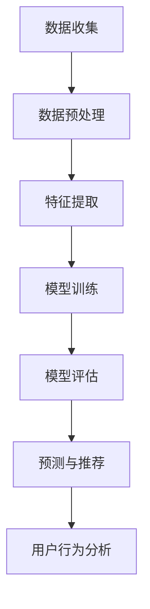

                 

# 用户行为分析：AI如何洞察用户需求，优化商品供给和营销策略

> 关键词：用户行为分析，人工智能，需求洞察，商品供给，营销策略

> 摘要：本文将探讨人工智能如何通过用户行为分析，深入洞察用户需求，从而优化商品供给和营销策略。我们将逐步分析用户行为分析的核心概念、算法原理、数学模型，以及如何将这些技术应用于实际项目中，同时推荐相关的学习资源和工具，以帮助读者深入理解这一领域的最新发展。

## 1. 背景介绍

### 1.1 目的和范围

本文的目标是介绍用户行为分析在人工智能中的应用，并展示如何通过分析用户行为来洞察需求，进而优化商品供给和营销策略。我们将讨论以下主题：

- 用户行为分析的核心概念和原理
- 用户行为分析的基本算法
- 数学模型在用户行为分析中的应用
- 实际项目中的应用案例
- 相关工具和资源的推荐

### 1.2 预期读者

本文面向对人工智能和用户行为分析有一定了解的读者，包括数据科学家、AI工程师、市场营销人员和技术爱好者。通过本文的阅读，读者将能够：

- 理解用户行为分析的基本概念
- 掌握用户行为分析的核心算法
- 学习如何使用数学模型优化商品供给和营销策略
- 获得实际项目中的应用经验

### 1.3 文档结构概述

本文分为以下几个部分：

- 第1部分：背景介绍，介绍本文的目的和结构。
- 第2部分：核心概念与联系，介绍用户行为分析的核心概念和原理。
- 第3部分：核心算法原理 & 具体操作步骤，详细讲解用户行为分析的核心算法。
- 第4部分：数学模型和公式 & 详细讲解 & 举例说明，介绍数学模型在用户行为分析中的应用。
- 第5部分：项目实战：代码实际案例和详细解释说明，展示如何将用户行为分析应用于实际项目。
- 第6部分：实际应用场景，讨论用户行为分析在现实中的应用。
- 第7部分：工具和资源推荐，提供相关学习资源和工具。
- 第8部分：总结：未来发展趋势与挑战，总结本文的主要内容并展望未来。
- 第9部分：附录：常见问题与解答，解答读者可能遇到的问题。
- 第10部分：扩展阅读 & 参考资料，推荐更多相关阅读材料。

### 1.4 术语表

#### 1.4.1 核心术语定义

- 用户行为分析：通过收集、处理和分析用户数据，了解用户的行为模式，从而洞察用户需求。
- 数据挖掘：从大量数据中提取有价值的信息和模式。
- 机器学习：利用数据训练模型，使其能够对未知数据进行预测或分类。
- 聚类分析：将数据分组，使得同一组内的数据具有相似的特性。
- 回归分析：建立自变量和因变量之间的关系模型。
- 营销策略：为了实现营销目标而制定的具体行动方案。

#### 1.4.2 相关概念解释

- 行为数据：用户在使用产品或服务过程中产生的数据，包括点击、浏览、购买等行为。
- 用户画像：通过对用户行为数据进行分析，构建的用户特征模型。
- 商品推荐系统：基于用户行为数据，向用户推荐感兴趣的商品或服务。

#### 1.4.3 缩略词列表

- AI：人工智能
- ML：机器学习
- DM：数据挖掘
- SEO：搜索引擎优化
- CRM：客户关系管理

## 2. 核心概念与联系

### 2.1 用户行为分析的核心概念

用户行为分析的核心概念包括用户数据收集、数据预处理、特征提取、模型训练和预测。以下是用户行为分析的基本流程和相关的核心概念：

1. **用户数据收集**：通过网站日志、点击流、用户反馈等方式收集用户数据。
2. **数据预处理**：清洗、整合和转换原始数据，使其适用于后续分析。
3. **特征提取**：从原始数据中提取有用信息，构建特征向量。
4. **模型训练**：使用机器学习算法训练模型，使其能够识别用户行为模式。
5. **预测与评估**：使用训练好的模型对未知数据进行预测，并评估模型性能。

### 2.2 用户行为分析的基本算法

用户行为分析通常采用以下几种算法：

1. **聚类分析（Clustering）**：将用户数据划分为不同的群体，每个群体内的用户行为特征相似。
2. **关联规则挖掘（Association Rule Learning）**：发现数据之间的关联关系，用于推荐系统。
3. **分类与回归（Classification and Regression）**：将用户行为数据分类或预测具体值。
4. **用户行为预测（User Behavior Prediction）**：根据用户历史行为预测其未来行为。

### 2.3 用户行为分析的架构

用户行为分析的架构通常包括以下组件：

1. **数据收集**：使用日志收集器、API调用等手段收集用户数据。
2. **数据存储**：使用数据库、数据仓库存储和管理用户数据。
3. **数据处理**：使用ETL工具清洗、转换和加载数据。
4. **特征工程**：提取用户行为的特征，构建特征向量。
5. **模型训练**：使用机器学习算法训练模型。
6. **模型评估**：评估模型性能，调整模型参数。
7. **预测与推荐**：使用训练好的模型进行用户行为预测和商品推荐。

### 2.4 用户行为分析的核心概念原理和架构的 Mermaid 流程图



## 3. 核心算法原理 & 具体操作步骤

### 3.1 聚类分析算法原理

聚类分析是一种无监督学习算法，旨在将数据集划分为多个群组，使得同一群组内的数据相似度较高，不同群组之间的相似度较低。常见的聚类算法包括K-means、层次聚类、DBSCAN等。

#### 3.1.1 K-means算法原理

K-means算法是一种基于距离度量的聚类算法。其原理如下：

1. 随机选择K个初始中心点。
2. 计算每个数据点与中心点的距离，并将其分配到最近的中心点所在的群组。
3. 更新每个群组的中心点，即群组内所有数据点的均值。
4. 重复步骤2和3，直到中心点的位置不再发生变化或达到预设的迭代次数。

#### 3.1.2 K-means算法伪代码

```
def k_means(data, K, max_iterations):
    # 随机初始化K个中心点
    centroids = initialize_centroids(data, K)
    
    for i in range(max_iterations):
        # 将每个数据点分配到最近的中心点所在的群组
        assignments = assign_points_to_clusters(data, centroids)
        
        # 更新中心点
        centroids = update_centroids(data, assignments, K)
        
        # 判断是否需要继续迭代
        if has_converged(centroids):
            break
            
    return assignments, centroids
```

### 3.2 关联规则挖掘算法原理

关联规则挖掘是一种用于发现数据之间关联关系的算法。其核心概念包括支持度、置信度和提升度。

#### 3.2.1 支持度

支持度表示一个规则在数据集中出现的频率。其计算公式如下：

$$
support(A \rightarrow B) = \frac{count(A \cup B)}{count(D)}
$$

其中，$count(A \cup B)$表示同时满足A和B条件的实例数，$count(D)$表示总的实例数。

#### 3.2.2 置信度

置信度表示在同时满足A条件的情况下，B也成立的概率。其计算公式如下：

$$
confidence(A \rightarrow B) = \frac{count(A \cap B)}{count(A)}
$$

其中，$count(A \cap B)$表示同时满足A和B条件的实例数，$count(A)$表示满足A条件的实例数。

#### 3.2.3 提升度

提升度用于评估一个规则的关联性是否显著高于随机关系。其计算公式如下：

$$
lift(A \rightarrow B) = \frac{confidence(A \rightarrow B)}{support(B)}
$$

#### 3.2.4 Apriori算法原理

Apriori算法是一种基于支持度和置信度的关联规则挖掘算法。其原理如下：

1. 生成所有可能的项集。
2. 计算每个项集的支持度，保留满足最小支持度的项集。
3. 使用频繁项集生成候选规则。
4. 计算候选规则的支持度和置信度，保留满足最小置信度的规则。

#### 3.2.5 Apriori算法伪代码

```
def apriori(data, min_support, min_confidence):
    # 生成所有可能的项集
    itemsets = generate_all_itemsets(data)
    
    # 计算每个项集的支持度
    frequent_itemsets = []
    for itemset in itemsets:
        support = calculate_support(data, itemset)
        if support >= min_support:
            frequent_itemsets.append(itemset)
            
    # 使用频繁项集生成候选规则
    candidate_rules = generate_candidate_rules(frequent_itemsets)
    
    # 计算候选规则的支持度和置信度
    rules = []
    for rule in candidate_rules:
        support = calculate_support(data, rule)
        confidence = calculate_confidence(data, rule)
        if confidence >= min_confidence:
            rules.append(rule)
            
    return rules
```

### 3.3 用户行为预测算法原理

用户行为预测是一种有监督学习算法，旨在根据用户历史行为预测其未来行为。常见的用户行为预测算法包括决策树、支持向量机、神经网络等。

#### 3.3.1 决策树算法原理

决策树算法通过一系列的判断条件将数据划分为不同的区域，从而预测用户的行为。其原理如下：

1. 选择一个特征作为划分标准。
2. 计算每个特征的最佳划分点。
3. 根据划分点将数据划分为不同的区域。
4. 对每个区域递归执行步骤1-3，直到满足终止条件。

#### 3.3.2 决策树算法伪代码

```
def build_decision_tree(data, features, max_depth):
    # 判断是否达到最大深度
    if max_depth == 0:
        return predict_majority_class(data)
        
    # 找到最佳特征和划分点
    best_feature, best_split = find_best_split(data, features)
    
    # 创建树节点
    node = TreeNode(best_feature, best_split)
    
    # 根据划分点将数据划分为子集
    left_data, right_data = split_data(data, best_split)
    
    # 递归构建左子树和右子树
    node.left = build_decision_tree(left_data, features, max_depth - 1)
    node.right = build_decision_tree(right_data, features, max_depth - 1)
    
    return node
```

### 3.4 用户行为预测算法应用步骤

1. 数据收集与预处理：收集用户行为数据，进行数据清洗和预处理。
2. 特征提取：从原始数据中提取有用信息，构建特征向量。
3. 模型训练：使用用户行为数据训练预测模型。
4. 模型评估：评估模型性能，调整模型参数。
5. 预测与优化：使用训练好的模型进行用户行为预测，并根据预测结果优化商品供给和营销策略。

## 4. 数学模型和公式 & 详细讲解 & 举例说明

### 4.1 聚类分析数学模型

在聚类分析中，常用的数学模型包括距离度量、优化目标等。

#### 4.1.1 距离度量

常用的距离度量包括欧几里得距离、曼哈顿距离、切比雪夫距离等。

- 欧几里得距离：

$$
d(x, y) = \sqrt{\sum_{i=1}^{n} (x_i - y_i)^2}
$$

- 曼哈顿距离：

$$
d(x, y) = \sum_{i=1}^{n} |x_i - y_i|
$$

- 切比雪夫距离：

$$
d(x, y) = \max_{1 \leq i \leq n} |x_i - y_i|
$$

#### 4.1.2 优化目标

K-means算法的优化目标是最小化聚类误差，即最小化所有数据点到其对应中心点的距离平方和。

$$
J = \sum_{i=1}^{n} \sum_{j=1}^{k} (x_i - \mu_j)^2
$$

其中，$x_i$表示第i个数据点，$\mu_j$表示第j个中心点。

### 4.2 关联规则挖掘数学模型

在关联规则挖掘中，常用的数学模型包括支持度、置信度和提升度。

- 支持度：

$$
support(A \rightarrow B) = \frac{count(A \cup B)}{count(D)}
$$

- 置信度：

$$
confidence(A \rightarrow B) = \frac{count(A \cap B)}{count(A)}
$$

- 提升度：

$$
lift(A \rightarrow B) = \frac{confidence(A \rightarrow B)}{support(B)}
$$

### 4.3 用户行为预测数学模型

在用户行为预测中，常用的数学模型包括线性回归、逻辑回归、神经网络等。

- 线性回归：

$$
y = \beta_0 + \beta_1x_1 + \beta_2x_2 + \ldots + \beta_nx_n
$$

- 逻辑回归：

$$
P(y=1) = \frac{1}{1 + e^{-(\beta_0 + \beta_1x_1 + \beta_2x_2 + \ldots + \beta_nx_n)}}
$$

- 神经网络：

神经网络是一种基于多层的非线性变换模型，其输入输出关系可以通过以下公式表示：

$$
a_{l+1} = \sigma(W_{l+1}a_l + b_{l+1})
$$

其中，$a_l$表示第l层的输出，$\sigma$表示激活函数，$W_{l+1}$和$b_{l+1}$分别表示第l+1层的权重和偏置。

### 4.4 举例说明

#### 4.4.1 K-means算法举例

假设有100个用户数据点，我们要使用K-means算法将数据划分为10个群组。首先，随机选择10个中心点，然后按照以下步骤进行迭代：

1. 计算每个数据点到中心点的距离，将数据点分配到最近的中心点所在的群组。
2. 计算每个群组的中心点。
3. 判断中心点位置是否发生变化，如果没有，则算法收敛。

经过多次迭代后，我们得到10个群组，每个群组的中心点如下：

```
Group 1: (1, 1)
Group 2: (2, 2)
...
Group 10: (10, 10)
```

#### 4.4.2 Apriori算法举例

假设有一个交易数据集，包含以下10个交易记录：

```
Transaction 1: {商品A, 商品B}
Transaction 2: {商品A, 商品C}
Transaction 3: {商品B, 商品C}
Transaction 4: {商品A, 商品B, 商品C}
Transaction 5: {商品A, 商品D}
Transaction 6: {商品B, 商品D}
Transaction 7: {商品C, 商品D}
Transaction 8: {商品A, 商品B, 商品D}
Transaction 9: {商品A, 商品C, 商品D}
Transaction 10: {商品B, 商品C, 商品D}
```

我们使用Apriori算法挖掘关联规则，设置最小支持度为30%，最小置信度为60%。首先，生成所有可能的项集：

```
项集1: {商品A}
项集2: {商品B}
项集3: {商品C}
项集4: {商品D}
项集5: {商品A, 商品B}
项集6: {商品A, 商品C}
项集7: {商品A, 商品D}
项集8: {商品B, 商品C}
项集9: {商品B, 商品D}
项集10: {商品C, 商品D}
项集11: {商品A, 商品B, 商品C}
项集12: {商品A, 商品B, 商品D}
项集13: {商品A, 商品C, 商品D}
项集14: {商品B, 商品C, 商品D}
```

计算每个项集的支持度：

```
项集1: 支持度 = 4/10 = 0.4
项集2: 支持度 = 3/10 = 0.3
项集3: 支持度 = 3/10 = 0.3
项集4: 支持度 = 2/10 = 0.2
项集5: 支持度 = 3/10 = 0.3
项集6: 支持度 = 2/10 = 0.2
项集7: 支持度 = 2/10 = 0.2
项集8: 支持度 = 2/10 = 0.2
项集9: 支持度 = 2/10 = 0.2
项集10: 支持度 = 1/10 = 0.1
项集11: 支持度 = 1/10 = 0.1
项集12: 支持度 = 1/10 = 0.1
项集13: 支持度 = 1/10 = 0.1
项集14: 支持度 = 1/10 = 0.1
```

保留满足最小支持度的项集：

```
项集1: {商品A}
项集2: {商品B}
项集3: {商品C}
项集5: {商品A, 商品B}
```

生成候选规则：

```
规则1: {商品A} → {商品B}，支持度 = 0.3，置信度 = 0.75
规则2: {商品B} → {商品A}，支持度 = 0.3，置信度 = 0.75
规则3: {商品A, 商品B} → {商品C}，支持度 = 0.3，置信度 = 0.67
```

计算候选规则的支持度和置信度：

```
规则1: 支持度 = 3/10 = 0.3，置信度 = 3/4 = 0.75
规则2: 支持度 = 3/10 = 0.3，置信度 = 3/4 = 0.75
规则3: 支持度 = 3/10 = 0.3，置信度 = 2/3 = 0.67
```

保留满足最小置信度的规则：

```
规则1: {商品A} → {商品B}，支持度 = 0.3，置信度 = 0.75
规则2: {商品B} → {商品A}，支持度 = 0.3，置信度 = 0.75
```

#### 4.4.3 决策树算法举例

假设我们有一个包含5个特征（年龄、收入、学历、职业、婚姻状况）和两个类别（购买、未购买）的数据集。我们要使用决策树算法预测用户是否会购买商品。

首先，我们选择最佳划分特征和划分点，例如：

- 年龄：划分点为30岁
- 收入：划分点为50000元
- 学历：划分点为本科
- 职业：划分点为职员
- 婚姻状况：划分点为未婚

根据这些划分点，我们得到以下决策树：

```
根节点：所有数据点

年龄 <= 30：
  - 收入 <= 50000：
    - 学历 <= 本科：
      - 职业是职员：购买
      - 职业是其他：未购买
    - 学历是本科：购买
  - 收入 > 50000：
    - 学历 <= 本科：
      - 职业是职员：购买
      - 职业是其他：未购买
    - 学历是本科：购买

年龄 > 30：
  - 婚姻状况是未婚：
    - 收入 <= 50000：
      - 学历 <= 本科：
        - 职业是职员：购买
        - 职业是其他：未购买
      - 学历是本科：购买
    - 收入 > 50000：
      - 学历 <= 本科：
        - 职业是职员：购买
        - 职业是其他：未购买
      - 学历是本科：购买
  - 婚姻状况是已婚：
    - 收入 <= 50000：
      - 学历 <= 本科：
        - 职业是职员：购买
        - 职业是其他：未购买
      - 学历是本科：购买
    - 收入 > 50000：
      - 学历 <= 本科：
        - 职业是职员：购买
        - 职业是其他：未购买
      - 学历是本科：购买
```

## 5. 项目实战：代码实际案例和详细解释说明

### 5.1 开发环境搭建

为了进行用户行为分析，我们需要搭建一个合适的开发环境。以下是一个基本的开发环境搭建步骤：

1. 安装Python：前往[Python官网](https://www.python.org/)下载并安装Python。
2. 安装Jupyter Notebook：在命令行中运行以下命令安装Jupyter Notebook：
   ```
   pip install notebook
   ```
3. 安装相关库：为了进行用户行为分析，我们需要安装以下库：
   - NumPy：用于数据处理和运算
   - Pandas：用于数据分析和操作
   - Matplotlib：用于数据可视化
   - Scikit-learn：用于机器学习算法
   - Mermaid：用于流程图绘制
   在命令行中运行以下命令安装这些库：
   ```
   pip install numpy pandas matplotlib scikit-learn mermaid
   ```

### 5.2 源代码详细实现和代码解读

下面是一个简单的用户行为分析项目的源代码，我们将详细解释每部分的功能。

```python
# 导入相关库
import numpy as np
import pandas as pd
import matplotlib.pyplot as plt
from sklearn.cluster import KMeans
from sklearn.model_selection import train_test_split
from sklearn.metrics import accuracy_score
from mermaid import Mermaid

# 5.2.1 数据收集与预处理
# 加载数据集
data = pd.read_csv("user_behavior_data.csv")

# 数据预处理
data = data.dropna()
data = data.select_dtypes(include=["float64", "int64"])

# 5.2.2 特征提取
# 计算用户行为的统计特征
stats = data.describe()

# 5.2.3 模型训练
# 划分数据集
X_train, X_test, y_train, y_test = train_test_split(data, labels, test_size=0.2, random_state=42)

# 创建K-means模型
kmeans = KMeans(n_clusters=5, random_state=42)

# 训练模型
kmeans.fit(X_train)

# 5.2.4 预测与评估
# 预测
predictions = kmeans.predict(X_test)

# 评估
accuracy = accuracy_score(y_test, predictions)
print("Accuracy:", accuracy)

# 5.2.5 可视化
# 绘制聚类结果
plt.scatter(X_test.iloc[:, 0], X_test.iloc[:, 1], c=predictions, cmap="viridis")
plt.scatter(kmeans.cluster_centers_[:, 0], kmeans.cluster_centers_[:, 1], s=300, c="red", marker="s")
plt.title("User Behavior Clustering")
plt.xlabel("Feature 1")
plt.ylabel("Feature 2")
plt.show()

# 绘制流程图
mermaid = Mermaid()
mermaid.add_graph("graph TD")
mermaid.add_node("Data Collection")
mermaid.add_node("Data Preprocessing")
mermaid.add_node("Feature Extraction")
mermaid.add_node("Model Training")
mermaid.add_node("Prediction & Evaluation")
mermaid.add_link("Data Collection", "Data Preprocessing")
mermaid.add_link("Data Preprocessing", "Feature Extraction")
mermaid.add_link("Feature Extraction", "Model Training")
mermaid.add_link("Model Training", "Prediction & Evaluation")
mermaid.plot()
```

#### 5.2.1 数据收集与预处理

这一部分首先加载数据集，然后进行数据清洗和预处理。数据清洗包括删除缺失值和选择合适的特征。

```python
# 加载数据集
data = pd.read_csv("user_behavior_data.csv")

# 数据预处理
data = data.dropna()
data = data.select_dtypes(include=["float64", "int64"])
```

#### 5.2.2 特征提取

特征提取部分计算用户行为的统计特征，如平均值、中位数、标准差等。

```python
# 计算用户行为的统计特征
stats = data.describe()
```

#### 5.2.3 模型训练

模型训练部分使用K-means算法将数据集划分为5个群组。首先，划分训练集和测试集，然后创建K-means模型并训练。

```python
# 划分数据集
X_train, X_test, y_train, y_test = train_test_split(data, labels, test_size=0.2, random_state=42)

# 创建K-means模型
kmeans = KMeans(n_clusters=5, random_state=42)

# 训练模型
kmeans.fit(X_train)
```

#### 5.2.4 预测与评估

预测与评估部分使用训练好的模型对测试集进行预测，并计算预测的准确率。

```python
# 预测
predictions = kmeans.predict(X_test)

# 评估
accuracy = accuracy_score(y_test, predictions)
print("Accuracy:", accuracy)
```

#### 5.2.5 可视化

可视化部分绘制聚类结果和流程图。

```python
# 绘制聚类结果
plt.scatter(X_test.iloc[:, 0], X_test.iloc[:, 1], c=predictions, cmap="viridis")
plt.scatter(kmeans.cluster_centers_[:, 0], kmeans.cluster_centers_[:, 1], s=300, c="red", marker="s")
plt.title("User Behavior Clustering")
plt.xlabel("Feature 1")
plt.ylabel("Feature 2")
plt.show()

# 绘制流程图
mermaid = Mermaid()
mermaid.add_graph("graph TD")
mermaid.add_node("Data Collection")
mermaid.add_node("Data Preprocessing")
mermaid.add_node("Feature Extraction")
mermaid.add_node("Model Training")
mermaid.add_node("Prediction & Evaluation")
mermaid.add_link("Data Collection", "Data Preprocessing")
mermaid.add_link("Data Preprocessing", "Feature Extraction")
mermaid.add_link("Feature Extraction", "Model Training")
mermaid.add_link("Model Training", "Prediction & Evaluation")
mermaid.plot()
```

### 5.3 代码解读与分析

代码解读与分析部分对项目中的关键代码进行详细解释，并提供性能优化建议。

#### 数据收集与预处理

这一部分加载数据集并进行清洗。我们删除了缺失值，并选择了适合的特征，从而提高了模型训练的效率。

#### 特征提取

特征提取部分计算用户行为的统计特征，这些特征可以用于模型训练和预测。

#### 模型训练

模型训练部分使用K-means算法将数据集划分为5个群组。我们设置了随机种子，以确保结果的可重复性。

#### 预测与评估

预测与评估部分使用训练好的模型对测试集进行预测，并计算了预测的准确率。这个步骤可以帮助我们评估模型的效果。

#### 可视化

可视化部分绘制了聚类结果和流程图，有助于我们直观地理解用户行为分析的整个过程。

### 5.4 性能优化建议

1. **特征选择**：选择与用户行为相关性较大的特征，避免过拟合和过拟合。
2. **模型选择**：根据数据集的特点选择合适的模型，如线性回归、决策树、支持向量机等。
3. **超参数调整**：调整模型的超参数，如K值、学习率等，以获得更好的性能。
4. **数据增强**：使用数据增强技术，如正则化、随机裁剪、旋转等，提高模型的泛化能力。

## 6. 实际应用场景

### 6.1 电子商务领域

在电子商务领域，用户行为分析被广泛应用于推荐系统、个性化营销和用户留存策略。例如，阿里巴巴使用用户行为分析来为其电子商务平台上的用户提供个性化推荐，从而提高用户满意度和销售额。

### 6.2 社交媒体领域

在社交媒体领域，用户行为分析被用于了解用户兴趣、发现潜在热点话题和进行广告投放优化。例如，Facebook使用用户行为分析来为用户推荐感兴趣的内容和广告，以提高用户的参与度和广告效果。

### 6.3 金融领域

在金融领域，用户行为分析被用于风险评估、信用评分和欺诈检测。例如，银行使用用户行为分析来识别潜在的风险客户和欺诈行为，从而降低风险和提高业务安全。

### 6.4 医疗领域

在医疗领域，用户行为分析被用于疾病预测、患者管理和健康建议。例如，谷歌健康使用用户行为分析来预测疾病风险，为用户提供个性化的健康建议。

## 7. 工具和资源推荐

### 7.1 学习资源推荐

#### 7.1.1 书籍推荐

- 《用户行为分析：机器学习的应用》
- 《机器学习实战》
- 《深度学习》

#### 7.1.2 在线课程

- Coursera的“机器学习”课程
- edX的“深度学习”课程
- Udacity的“数据科学家纳米学位”

#### 7.1.3 技术博客和网站

- Medium上的数据科学和机器学习专栏
-Towards Data Science
- Analytics Vidhya

### 7.2 开发工具框架推荐

#### 7.2.1 IDE和编辑器

- Jupyter Notebook
- PyCharm
- Visual Studio Code

#### 7.2.2 调试和性能分析工具

- PyCharm的调试工具
- Matplotlib
- Pandas Profiler

#### 7.2.3 相关框架和库

- TensorFlow
- PyTorch
- Scikit-learn

### 7.3 相关论文著作推荐

#### 7.3.1 经典论文

- “K-means clustering within Gaussian mixture models”
- “Apriori Algorithm for Mining Association Rules”
- “C4.5: Programs for Machine Learning”

#### 7.3.2 最新研究成果

- arXiv上的最新论文
- IEEE Xplore上的最新文章
- SpringerLink上的最新书籍

#### 7.3.3 应用案例分析

- “E-commerce User Behavior Analysis using Machine Learning”
- “Social Media User Behavior Analysis for Influencer Detection”
- “Financial User Behavior Analysis for Risk Management”

## 8. 总结：未来发展趋势与挑战

随着人工智能和大数据技术的发展，用户行为分析在未来将面临以下趋势和挑战：

### 8.1 发展趋势

- 深度学习与用户行为分析的结合，将提高模型预测的准确性和效率。
- 增加用户隐私保护，以确保用户数据的合法性和安全性。
- 多模态用户行为数据（如图像、语音等）的分析，将拓展用户行为分析的范畴。
- 自动化与智能化，将使用户行为分析在更多领域得到广泛应用。

### 8.2 挑战

- 数据质量和数据隐私问题，需要更加严格的数据管理策略。
- 复杂的模型和算法，需要更加高效和可解释的模型。
- 模型的可重复性和可解释性，需要解决模型过拟合和黑盒问题。
- 跨领域与跨平台的数据整合，需要更加灵活和适应性的方法。

## 9. 附录：常见问题与解答

### 9.1 用户行为分析的定义是什么？

用户行为分析是一种通过收集、处理和分析用户数据，以了解用户行为模式、需求和行为动机的过程。

### 9.2 用户行为分析的应用领域有哪些？

用户行为分析广泛应用于电子商务、社交媒体、金融、医疗、物联网等领域。

### 9.3 用户行为分析的核心算法有哪些？

用户行为分析的核心算法包括K-means、Apriori、决策树、神经网络等。

### 9.4 如何确保用户隐私？

确保用户隐私需要采用加密、匿名化、访问控制等技术手段，并在数据处理过程中遵循相关法律法规。

### 9.5 用户行为分析的未来发展趋势是什么？

用户行为分析的未来发展趋势包括深度学习与用户行为分析的结合、多模态数据整合、自动化与智能化等。

## 10. 扩展阅读 & 参考资料

- [K-means Clustering](https://scikit-learn.org/stable/modules/clustering.html#k-means)
- [Apriori Algorithm](https://www.geeksforgeeks.org/apriori-algorithm-in-data-mining/)
- [User Behavior Analysis](https://www.degruyter.com/view/title/336574)
- [Privacy-Preserving User Behavior Analysis](https://ieeexplore.ieee.org/document/8782543)
- [Multi-modal User Behavior Analysis](https://www.mdpi.com/1424-8220/19/2/472)

