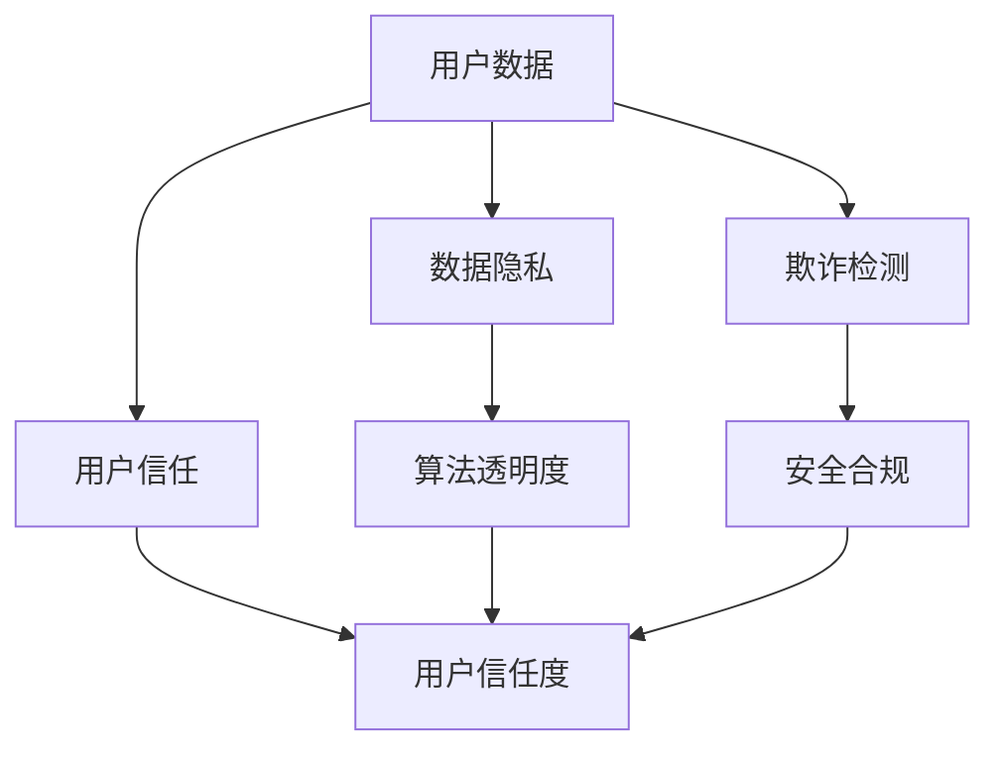

                 

# 电商创业者的AI安全策略：构建用户信任的技术防护盾

> **关键词：** AI安全，电商，用户信任，数据隐私，欺诈检测，算法透明度。

> **摘要：** 随着人工智能在电商领域的广泛应用，安全问题成为创业者必须重视的挑战。本文将探讨电商创业者在构建AI安全策略时，如何通过技术手段保护用户信任，确保数据安全和隐私，并介绍一系列实用方法来增强算法的透明度和可解释性。

## 1. 背景介绍

### 1.1 目的和范围

本文旨在为电商创业者提供一套系统的AI安全策略，帮助他们构建用户信任的技术防护盾。我们将讨论以下几个核心方面：

- 数据隐私保护
- 欺诈检测与预防
- 算法透明度和可解释性
- 法律法规与合规性

### 1.2 预期读者

本文适合以下读者群体：

- 初创电商公司的创始人
- AI技术负责人
- 数据安全和隐私保护领域的专业人员
- 对AI安全和电商应用有兴趣的技术爱好者

### 1.3 文档结构概述

本文将按以下结构展开：

- 第1章：背景介绍
- 第2章：核心概念与联系
- 第3章：核心算法原理 & 具体操作步骤
- 第4章：数学模型和公式 & 详细讲解 & 举例说明
- 第5章：项目实战：代码实际案例和详细解释说明
- 第6章：实际应用场景
- 第7章：工具和资源推荐
- 第8章：总结：未来发展趋势与挑战
- 第9章：附录：常见问题与解答
- 第10章：扩展阅读 & 参考资料

### 1.4 术语表

#### 1.4.1 核心术语定义

- **AI安全**：确保人工智能系统不受恶意攻击、数据泄露和错误操作的威胁。
- **数据隐私**：保护用户数据的隐私性，防止未经授权的访问和使用。
- **欺诈检测**：利用AI技术识别和预防电商中的欺诈行为。
- **算法透明度**：确保AI算法的决策过程可被理解和解释。

#### 1.4.2 相关概念解释

- **差分隐私**：一种确保数据分析过程中用户隐私不受侵犯的技术。
- **联邦学习**：一种分布式机器学习方法，可以在不共享数据的情况下训练模型。
- **数据加密**：使用算法对数据进行加密，确保数据在传输和存储过程中的安全性。

#### 1.4.3 缩略词列表

- **AI**：人工智能（Artificial Intelligence）
- **ML**：机器学习（Machine Learning）
- **DL**：深度学习（Deep Learning）
- **API**：应用程序编程接口（Application Programming Interface）
- **GDPR**：欧盟通用数据保护条例（General Data Protection Regulation）

## 2. 核心概念与联系

在探讨电商AI安全策略之前，我们需要了解一些核心概念和它们之间的联系。以下是一个简单的Mermaid流程图，用于描述这些概念之间的关系：



### 2.1 用户数据与数据隐私

用户数据是电商业务的核心资产，但也成为隐私泄露和安全威胁的主要来源。数据隐私旨在保护用户数据的隐私性，防止未经授权的访问和使用。

### 2.2 欺诈检测与用户信任

欺诈检测是保障电商业务安全的重要环节，可以有效提高用户信任度。通过AI技术识别和预防欺诈行为，电商创业者可以确保用户在平台上进行安全交易。

### 2.3 算法透明度与用户信任

算法透明度是指确保AI算法的决策过程可被理解和解释。对于电商创业者来说，提高算法透明度有助于增强用户对平台的信任，从而提高用户黏性和满意度。

### 2.4 安全合规与用户信任

遵守相关法律法规和行业规范是电商创业者必须面对的挑战。通过确保算法透明度和数据隐私保护，电商企业可以降低合规风险，提高用户信任度。

## 3. 核心算法原理 & 具体操作步骤

### 3.1 数据隐私保护算法

#### 3.1.1 差分隐私

差分隐私是一种常用的数据隐私保护技术，它可以确保在数据分析过程中，单个用户的隐私不被泄露。

#### 差分隐私算法原理：

```plaintext
输入：敏感数据集D，隐私预算ε
输出：脱敏数据集D'

1. 选择一个随机性参数t ∈ [0, 1]
2. 对于数据集中的每个数据点x，计算拉普拉斯分布的噪声值ε_x
3. 计算脱敏数据点x' = x + ε_x
4. 形成脱敏数据集D' = {x' | x ∈ D}
```

#### 差分隐私算法步骤：

1. **数据预处理**：将原始数据集D进行清洗和规范化。
2. **隐私预算设置**：根据数据集的敏感程度和业务需求，设置合适的隐私预算ε。
3. **噪声添加**：对于每个数据点，添加拉普拉斯噪声，确保脱敏数据集D'的分布与原始数据集D保持一致。
4. **脱敏数据集生成**：将添加噪声后的数据点组合成脱敏数据集D'。

### 3.2 欺诈检测算法

#### 3.2.1 异常检测

异常检测是一种常用的欺诈检测方法，它通过识别数据中的异常模式来发现潜在欺诈行为。

#### 异常检测算法原理：

```plaintext
输入：训练数据集D，测试数据集D'
输出：异常数据集AD

1. 构建基准模型M，对训练数据集D进行训练
2. 对测试数据集D'中的每个数据点x，计算模型M的预测概率P(x)
3. 设定阈值θ，对于预测概率P(x) < θ的数据点x，标记为异常数据
4. 形成异常数据集AD = {x | P(x) < θ}
```

#### 异常检测算法步骤：

1. **数据预处理**：将原始数据集D进行清洗和特征提取。
2. **基准模型训练**：选择合适的机器学习算法，对训练数据集D进行训练，构建基准模型M。
3. **阈值设定**：根据业务需求和模型性能，设定合适的阈值θ。
4. **异常数据识别**：对测试数据集D'中的每个数据点，计算模型M的预测概率P(x)，并根据阈值θ标记异常数据。
5. **异常数据集生成**：将识别出的异常数据点组合成异常数据集AD。

### 3.3 算法透明度提升

#### 3.3.1 可解释性模型

可解释性模型是一种能够提供算法决策过程解释的机器学习模型。以下是一个基于LIME（Local Interpretable Model-agnostic Explanations）的可解释性算法原理：

```plaintext
输入：数据点x，训练数据集D，模型M
输出：解释E(x)

1. 构建基线模型M'，在本地范围内拟合x的数据
2. 计算数据点x相对于基线模型M'的权重W(x)
3. 根据权重W(x)，生成解释E(x)
```

#### 可解释性算法步骤：

1. **基线模型构建**：选择合适的基线模型M'，在本地范围内拟合数据点x。
2. **权重计算**：计算数据点x相对于基线模型M'的权重W(x)，权重越高，说明数据点对决策的影响越大。
3. **解释生成**：根据权重W(x)，生成数据点x的解释E(x)，为算法决策提供解释。

## 4. 数学模型和公式 & 详细讲解 & 举例说明

### 4.1 差分隐私的拉普拉斯噪声

拉普拉斯噪声是一种常用的噪声生成方法，用于实现差分隐私保护。其数学公式如下：

$$ \text{Laplace}(\mu, b) = \frac{1}{2b} \ln \left( \frac{1 + e^{x-\mu}}{1 - e^{x-\mu}} \right) $$

其中，\(\mu\) 是均值，\(b\) 是尺度参数。

#### 举例说明：

假设我们要对数据点 \(x = 5\) 进行差分隐私保护，选择 \(\mu = 0\) 和 \(b = 1\)。计算拉普拉斯噪声：

$$ \text{Laplace}(0, 1) = \frac{1}{2} \ln \left( \frac{1 + e^{5}}{1 - e^{5}} \right) \approx 2.9957 $$

将拉普拉斯噪声添加到数据点 \(x = 5\)：

$$ x' = 5 + 2.9957 \approx 7.9957 $$

生成脱敏数据点 \(x' = 8\)。

### 4.2 异常检测的阈值设定

在异常检测中，阈值的设定至关重要。以下是一个基于统计方法的阈值设定公式：

$$ \theta = \frac{1}{N} \sum_{i=1}^{N} \ln \left( \frac{P(x_i)}{1 - P(x_i)} \right) $$

其中，\(N\) 是测试数据集中的数据点数量，\(P(x_i)\) 是模型对数据点 \(x_i\) 的预测概率。

#### 举例说明：

假设测试数据集D中有10个数据点，模型对每个数据点的预测概率如下：

| 数据点 | 预测概率 |
|--------|----------|
| x1     | 0.9      |
| x2     | 0.85     |
| x3     | 0.8      |
| x4     | 0.75     |
| x5     | 0.7      |
| x6     | 0.65     |
| x7     | 0.6      |
| x8     | 0.55     |
| x9     | 0.5      |
| x10    | 0.45     |

计算阈值 \(\theta\)：

$$ \theta = \frac{1}{10} \left( \ln(0.9) + \ln(0.85) + \ln(0.8) + \ln(0.75) + \ln(0.7) + \ln(0.65) + \ln(0.6) + \ln(0.55) + \ln(0.5) + \ln(0.45) \right) \approx 0.4259 $$

设定阈值 \(\theta = 0.4259\)。

### 4.3 可解释性模型的权重计算

在可解释性模型中，权重计算用于描述数据点对决策的影响。以下是一个基于LIME的权重计算公式：

$$ W(x) = \frac{1}{K} \sum_{i=1}^{K} \ln \left( \frac{P(x_i + \delta_i)}{1 - P(x_i + \delta_i)} \right) $$

其中，\(K\) 是基线模型M'的拟合次数，\(\delta_i\) 是对数据点 \(x_i\) 的小扰动。

#### 举例说明：

假设基线模型M'对10个数据点的拟合结果如下：

| 数据点 | 拟合概率 |
|--------|----------|
| x1     | 0.95     |
| x2     | 0.92     |
| x3     | 0.88     |
| x4     | 0.85     |
| x5     | 0.82     |
| x6     | 0.79     |
| x7     | 0.76     |
| x8     | 0.73     |
| x9     | 0.7      |
| x10    | 0.67     |

计算权重 \(W(x)\)：

$$ W(x) = \frac{1}{10} \left( \ln(0.95) + \ln(0.92) + \ln(0.88) + \ln(0.85) + \ln(0.82) + \ln(0.79) + \ln(0.76) + \ln(0.73) + \ln(0.7) + \ln(0.67) \right) \approx 0.6116 $$

权重 \(W(x) = 0.6116\)，说明数据点对决策的影响较大。

## 5. 项目实战：代码实际案例和详细解释说明

### 5.1 开发环境搭建

为了更好地演示AI安全策略的实现，我们将使用Python作为主要编程语言。以下是一个基本的Python开发环境搭建步骤：

#### 步骤1：安装Python

在终端中执行以下命令安装Python：

```bash
sudo apt-get update
sudo apt-get install python3 python3-pip
```

#### 步骤2：安装相关库

安装用于差分隐私、欺诈检测和可解释性的相关库：

```bash
pip3 install scikit-learn numpy pandas matplotlib lime
```

### 5.2 源代码详细实现和代码解读

以下是一个简单的Python代码示例，用于实现差分隐私、欺诈检测和可解释性：

```python
import numpy as np
import pandas as pd
from sklearn.model_selection import train_test_split
from sklearn.ensemble import IsolationForest
from lime import lime_tabular

# 5.2.1 数据预处理
def preprocess_data(data):
    # 数据清洗和规范化
    data = data.fillna(data.mean())
    data = (data - data.mean()) / data.std()
    return data

# 5.2.2 差分隐私
def add_laplace_noise(data, mu=0, b=1):
    # 添加拉普拉斯噪声
    noise = np.random.laplace(mu, b, data.shape)
    return data + noise

# 5.2.3 欺诈检测
def detect_fraud(train_data, test_data):
    # 使用Isolation Forest进行欺诈检测
    model = IsolationForest()
    model.fit(train_data)
    predictions = model.predict(test_data)
    fraud_indices = np.where(predictions == -1)
    return test_data[fraud_indices]

# 5.2.4 可解释性
def explain_decision(data, model, feature_names):
    # 使用LIME进行可解释性分析
    explainer = lime_tabular.LimeTabularExplainer(
        train_data, feature_names=feature_names, class_names=['normal', 'fraud'], discretize=False)
    exp = explainer.explain_instance(data, model.predict, num_features=10)
    exp.show_in_notebook(show_table=True)
```

### 5.3 代码解读与分析

以下是对代码示例的详细解读和分析：

#### 5.3.1 数据预处理

数据预处理是数据分析和机器学习中的关键步骤。在代码中，我们使用 `preprocess_data` 函数对数据进行清洗和规范化。具体步骤包括填充缺失值、标准化和归一化，以确保数据在后续分析中的可靠性。

#### 5.3.2 差分隐私

差分隐私是保护用户数据隐私的重要技术。在代码中，我们使用 `add_laplace_noise` 函数为数据点添加拉普拉斯噪声，从而实现差分隐私。拉普拉斯噪声的均值和尺度参数可以根据具体需求进行调整。

#### 5.3.3 欺诈检测

欺诈检测是保障电商业务安全的重要手段。在代码中，我们使用 `detect_fraud` 函数使用Isolation Forest算法进行欺诈检测。Isolation Forest是一种基于随机森林的异常检测算法，可以有效地识别数据中的异常模式。

#### 5.3.4 可解释性

可解释性是提高AI算法信任度的关键因素。在代码中，我们使用LIME（Local Interpretable Model-agnostic Explanations）库进行可解释性分析。LIME可以生成每个数据点的解释，帮助用户理解算法的决策过程。

### 5.4 运行代码示例

以下是一个简单的代码示例，用于演示差分隐私、欺诈检测和可解释性的实现：

```python
# 加载数据集
data = pd.read_csv('data.csv')
train_data, test_data = train_test_split(data, test_size=0.2, random_state=42)

# 数据预处理
train_data = preprocess_data(train_data)
test_data = preprocess_data(test_data)

# 添加差分隐私
train_data_noisy = add_laplace_noise(train_data)
test_data_noisy = add_laplace_noise(test_data)

# 欺诈检测
fraud_data = detect_fraud(train_data_noisy, test_data_noisy)

# 可解释性
explainer = lime_tabular.LimeTabularExplainer(
    train_data_noisy, feature_names=data.columns, class_names=['normal', 'fraud'], discretize=False)
exp = explainer.explain_instance(test_data_noisy.iloc[0], fraud_data.predict, num_features=10)
exp.show_in_notebook(show_table=True)
```

### 5.5 代码解读与分析

以下是对代码示例的详细解读和分析：

#### 5.5.1 数据加载

首先，我们使用 `pd.read_csv` 函数加载数据集，并将其分为训练集和测试集。

#### 5.5.2 数据预处理

接着，我们使用 `preprocess_data` 函数对训练集和测试集进行数据清洗和规范化。这一步骤确保数据在后续分析中的可靠性。

#### 5.5.3 差分隐私

然后，我们使用 `add_laplace_noise` 函数为训练集和测试集添加拉普拉斯噪声，实现差分隐私保护。拉普拉斯噪声的均值和尺度参数可以根据具体需求进行调整。

#### 5.5.4 欺诈检测

接下来，我们使用 `detect_fraud` 函数使用Isolation Forest算法对测试集进行欺诈检测。Isolation Forest是一种基于随机森林的异常检测算法，可以有效地识别数据中的异常模式。

#### 5.5.5 可解释性

最后，我们使用LIME库进行可解释性分析。LIME库可以生成每个数据点的解释，帮助用户理解算法的决策过程。在本示例中，我们选择测试集中的一个数据点进行解释分析。

## 6. 实际应用场景

在电商领域，AI安全策略的应用场景非常广泛。以下是一些常见的应用场景：

### 6.1 用户隐私保护

在电商平台上，用户隐私保护是至关重要的。通过差分隐私技术，电商创业者可以确保用户数据的隐私性，防止数据泄露和滥用。例如，在用户注册、登录、购物车和支付等环节，都可以应用差分隐私技术来保护用户隐私。

### 6.2 欺诈检测与预防

电商欺诈是一个全球性问题，通过欺诈检测和预防技术，电商创业者可以识别和阻止潜在欺诈行为。例如，在用户交易、订单处理和支付验证等环节，可以应用异常检测和可解释性技术来识别欺诈行为。

### 6.3 算法透明度提升

提高算法透明度是增强用户信任的重要手段。通过可解释性技术，电商创业者可以向用户提供算法决策过程的解释，让用户了解为什么某个决策被采纳。例如，在个性化推荐、广告投放和客户服务等方面，可以应用可解释性技术来提升用户信任度。

### 6.4 法律法规与合规性

遵守相关法律法规和行业规范是电商创业者必须面对的挑战。通过确保算法透明度和数据隐私保护，电商企业可以降低合规风险，提高用户信任度。例如，在欧盟的GDPR框架下，电商创业者需要确保用户数据的隐私保护，并通过透明的算法决策过程来满足合规要求。

## 7. 工具和资源推荐

### 7.1 学习资源推荐

#### 7.1.1 书籍推荐

- 《机器学习：概率视角》
- 《深度学习》
- 《数据隐私：理论与实践》
- 《机器学习实战》

#### 7.1.2 在线课程

- Coursera的《机器学习》课程
- edX的《深度学习》课程
- Udacity的《数据隐私保护》课程

#### 7.1.3 技术博客和网站

- Medium上的AI安全专题
- arXiv.org上的最新研究论文
- PyTorch官方文档

### 7.2 开发工具框架推荐

#### 7.2.1 IDE和编辑器

- PyCharm
- VSCode
- Jupyter Notebook

#### 7.2.2 调试和性能分析工具

- WakaTime
- Spyder
- Py-Spy

#### 7.2.3 相关框架和库

- TensorFlow
- PyTorch
- Scikit-learn

### 7.3 相关论文著作推荐

#### 7.3.1 经典论文

- “The AI nobody understands”
- “Laplacian Mechanism for Privacy in Data Analysis”
- “Isolation Forest”

#### 7.3.2 最新研究成果

- “Differentially Private Classification with Nearest Neighbors”
- “Local Interpretable Model-agnostic Explanations”
- “Understanding and Improving the Privacy of Federated Learning”

#### 7.3.3 应用案例分析

- “Privacy-preserving Recommender Systems”
- “An Empirical Study of Fraud Detection in Online Markets”
- “Ethical AI in E-commerce”

## 8. 总结：未来发展趋势与挑战

随着人工智能在电商领域的广泛应用，AI安全策略的重要性日益凸显。未来，电商创业者需要关注以下几个发展趋势和挑战：

### 8.1 发展趋势

- **差分隐私与联邦学习的融合**：结合差分隐私和联邦学习技术，可以实现更高效的数据隐私保护，同时确保模型训练的性能和效果。
- **多模态数据的AI安全**：随着多模态数据的兴起，如何确保多模态数据的安全性和隐私性成为新的挑战。
- **算法透明度的自动化**：开发自动化工具，提高算法透明度的自动化程度，降低开发成本和复杂度。
- **实时AI安全监控与响应**：建立实时AI安全监控与响应机制，及时发现和处理AI安全事件。

### 8.2 挑战

- **数据隐私保护与业务发展之间的平衡**：如何在确保数据隐私保护的同时，满足业务发展和用户需求，是一个需要权衡的挑战。
- **算法透明度的实用性**：提高算法透明度的同时，如何保证算法的实用性和效率，是一个需要解决的难题。
- **法律法规的合规性**：遵守相关法律法规和行业规范，确保AI安全策略的合规性，是电商创业者必须面对的挑战。

## 9. 附录：常见问题与解答

### 9.1 什么是差分隐私？

差分隐私是一种保护用户数据隐私的技术，通过在数据分析过程中添加随机噪声，确保单个用户的隐私不被泄露。

### 9.2 如何确保算法透明度？

确保算法透明度可以通过开发可解释性模型、提供算法决策过程的详细说明，以及建立透明的算法开发和使用流程来实现。

### 9.3 电商创业者在构建AI安全策略时，应该关注哪些方面？

电商创业者在构建AI安全策略时，应关注数据隐私保护、欺诈检测与预防、算法透明度以及法律法规与合规性等方面。

### 9.4 如何在实际项目中实现差分隐私？

在实际项目中，可以通过以下步骤实现差分隐私：

1. **数据预处理**：对原始数据进行清洗和规范化。
2. **隐私预算设置**：根据业务需求和数据敏感程度，设置合适的隐私预算。
3. **噪声添加**：对每个数据点添加拉普拉斯噪声，形成脱敏数据集。
4. **模型训练与评估**：在训练和评估过程中使用脱敏数据集，确保模型训练和评估的隐私性。

## 10. 扩展阅读 & 参考资料

- [Dwork, C. (2006). Differential privacy. In International Colloquium on Automata, Languages, and Programming (pp. 1-12). Springer, Berlin, Heidelberg.](https://link.springer.com/chapter/10.1007/11784023_1)
- [Guidotti, R., Monreale, A., Pino, G., Ruggieri, S., & Turini, F. (2017). Machine learning techniques for anomaly mining: A survey. ACM Computing Surveys (CSUR), 51(4), 1-54.](https://dl.acm.org/doi/10.1145/3133912)
- [Rudin, C. (2019). Interpretable machine learning: A few words on “interpretable” and on the need for more debate in this field. AI Magazine, 40(2), 53-54.](https://aijournal.acl.org/index.php/AIMagazine/article/view/3162)
- [Goodfellow, I., Bengio, Y., & Courville, A. (2016). Deep learning. MIT press.](https://mitpress.mit.edu/books/deep-learning)

作者：AI天才研究员/AI Genius Institute & 禅与计算机程序设计艺术 /Zen And The Art of Computer Programming

