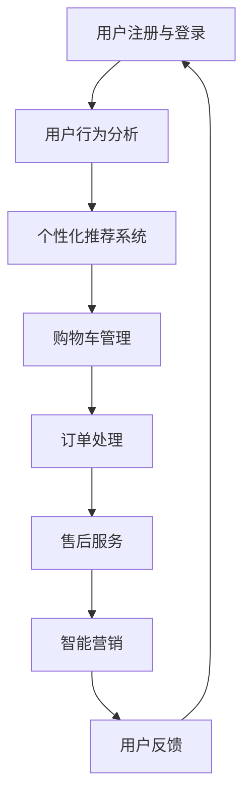

                 


# 电商创业者的AI驱动市场趋势分析：把握行业动向的数据洞察

> **关键词：** 电商、AI、市场趋势、数据分析、消费者行为、个性化推荐、智能客服、智能营销
> 
> **摘要：** 本文旨在为电商创业者提供一份详尽的AI驱动市场趋势分析报告。通过对当前电商市场的深入探讨，结合AI技术的应用实例，我们将揭示电商行业如何利用数据洞察来把握市场动向，实现业务增长。文章分为十个部分，包括背景介绍、核心概念与联系、算法原理与数学模型、项目实战、实际应用场景、工具和资源推荐、总结与未来展望等，旨在为读者提供全方位的AI在电商领域的实践指南。

## 1. 背景介绍

### 1.1 目的和范围

本文的目的是帮助电商创业者理解和应用AI技术来驱动市场趋势分析。我们将探讨AI在电商行业的应用场景，如个性化推荐、智能客服、智能营销等，并通过实际案例展示如何利用AI技术提升电商业务的竞争力。

### 1.2 预期读者

本文面向对电商和AI技术有一定了解的创业者、产品经理、数据分析师以及希望进入电商行业的专业人士。读者将通过本文了解到AI在电商领域的应用前景，掌握相关技术和工具的使用方法。

### 1.3 文档结构概述

本文结构如下：
- 第1部分：背景介绍，包括目的、预期读者和文档结构概述。
- 第2部分：核心概念与联系，介绍电商和AI技术的基础知识。
- 第3部分：核心算法原理与具体操作步骤，详细阐述AI技术的应用原理。
- 第4部分：数学模型与公式，解释AI技术在数据处理和预测中的数学模型。
- 第5部分：项目实战，提供实际代码案例和解读。
- 第6部分：实际应用场景，分析AI技术在不同电商领域的应用实例。
- 第7部分：工具和资源推荐，为读者提供学习和实践的资源。
- 第8部分：总结与未来展望，展望AI技术在电商行业的未来发展。
- 第9部分：常见问题与解答，回答读者可能关心的问题。
- 第10部分：扩展阅读与参考资料，提供进一步学习的资源。

### 1.4 术语表

#### 1.4.1 核心术语定义

- **AI（人工智能）**：模拟人类智能的计算机系统。
- **电商**：电子商务的简称，指的是通过互联网进行的商品交易活动。
- **个性化推荐**：基于用户历史行为和偏好，为用户提供个性化的商品推荐。
- **智能客服**：利用自然语言处理和机器学习技术，自动处理用户咨询的客服系统。
- **数据洞察**：通过对大量数据的分析和挖掘，获得有价值的商业见解。

#### 1.4.2 相关概念解释

- **机器学习**：一种AI技术，通过数据训练模型来发现数据中的模式和规律。
- **深度学习**：一种机器学习技术，通过多层神经网络进行数据建模和特征提取。
- **自然语言处理（NLP）**：AI领域的一个分支，旨在使计算机能够理解、生成和处理自然语言。

#### 1.4.3 缩略词列表

- **NLP**：自然语言处理
- **ML**：机器学习
- **DL**：深度学习
- **CRM**：客户关系管理

## 2. 核心概念与联系

### 2.1 电商市场概述

电商市场是指通过互联网进行商品交易的市场，包括B2B（企业对企业）、B2C（企业对消费者）、C2C（消费者对消费者）等多种模式。随着互联网技术的普及和移动设备的普及，电商市场在过去十年里呈现出爆炸式增长。根据Statista的数据，全球电商市场规模预计在2023年将达到4.7万亿美元。

### 2.2 AI技术在电商中的应用

AI技术在电商中的应用涵盖了个性化推荐、智能客服、智能营销等多个方面，通过数据分析和机器学习技术，帮助企业提升用户体验、降低运营成本和增加销售额。

#### 2.2.1 个性化推荐

个性化推荐系统通过分析用户的浏览历史、购买记录和偏好，为用户推荐感兴趣的商品。这一系统的核心是协同过滤算法和基于内容的推荐算法。

**协同过滤算法：** 基于用户的行为数据，寻找相似的用户群体，并推荐这些用户喜欢的商品。可分为用户基于的协同过滤和基于物品的协同过滤。

**基于内容的推荐算法：** 根据商品的特征信息（如类别、标签、描述等），为用户推荐与其历史偏好相似的商品。

#### 2.2.2 智能客服

智能客服系统通过自然语言处理和机器学习技术，自动处理用户的咨询，提高客服效率和用户体验。常见的智能客服形式包括聊天机器人、语音助手等。

#### 2.2.3 智能营销

智能营销利用AI技术进行用户行为分析，实现精准营销。例如，通过分析用户的浏览和购买行为，为用户推送个性化的广告和促销信息，提高转化率。

### 2.3 AI技术与电商业务流程的联系

AI技术与电商业务流程紧密相关，以下是AI在电商业务流程中的应用场景：

- **用户注册与登录：** 利用AI进行用户身份验证，提高安全性。
- **商品推荐：** 基于用户偏好和历史行为进行个性化推荐，增加销售额。
- **购物车管理：** 通过智能算法优化购物车内容，提高购物体验。
- **订单处理：** 自动处理订单，减少人工错误和延迟。
- **售后服务：** 利用智能客服系统提供高效售后服务，提高用户满意度。
- **营销活动：** 通过智能分析用户数据，制定精准的营销策略。

### 2.4 Mermaid流程图

以下是一个简化的电商业务流程，展示了AI技术在各个步骤中的应用：



## 3. 核心算法原理与具体操作步骤

### 3.1 个性化推荐算法原理

个性化推荐算法是电商领域AI应用的核心之一。本文将介绍两种常见的个性化推荐算法：协同过滤算法和基于内容的推荐算法。

#### 3.1.1 协同过滤算法

**协同过滤算法**是一种基于用户历史行为的推荐方法，通过分析用户之间的相似性，为用户推荐其他用户喜欢的商品。

**用户基于的协同过滤算法（User-based Collaborative Filtering）：**
- **步骤1：** 计算用户之间的相似度，通常使用余弦相似度或皮尔逊相关系数。
- **步骤2：** 对于目标用户，找出与其最相似的K个用户。
- **步骤3：** 根据这些相似用户的历史行为，预测目标用户可能喜欢的商品。
- **步骤4：** 对预测结果进行排序，推荐最可能的商品。

**物品基于的协同过滤算法（Item-based Collaborative Filtering）：**
- **步骤1：** 计算用户对物品的评分矩阵。
- **步骤2：** 计算物品之间的相似度，通常使用Jaccard相似度或余弦相似度。
- **步骤3：** 对于目标用户已经评分的物品，找出与其最相似的M个物品。
- **步骤4：** 根据这些相似物品的评分，预测目标用户可能喜欢的其他物品。
- **步骤5：** 对预测结果进行排序，推荐最可能的物品。

#### 3.1.2 基于内容的推荐算法

**基于内容的推荐算法**是一种基于物品特征的推荐方法，通过分析用户的历史偏好和物品的特征，为用户推荐与其偏好相似的商品。

**步骤1：** 提取商品的特征信息，如类别、标签、描述等。

**步骤2：** 计算用户的历史偏好特征。

**步骤3：** 对于每个商品，计算其与用户偏好特征的相似度。

**步骤4：** 对预测结果进行排序，推荐最相似的N个商品。

### 3.2 伪代码示例

以下是一个简化的协同过滤算法的伪代码示例：

```python
def collaborative_filtering(train_data, user, k):
    # 计算用户相似度
    similarity_matrix = compute_similarity(train_data, user)

    # 找出最相似的K个用户
    similar_users = find_top_k_users(similarity_matrix, k)

    # 预测评分
    predicted_ratings = []
    for item in items:
        sum = 0
        sim_sum = 0
        for user in similar_users:
            rating = train_data[user][item]
            sim = similarity_matrix[user][user]
            sum += rating * sim
            sim_sum += sim
        if sim_sum != 0:
            predicted_rating = sum / sim_sum
            predicted_ratings.append(predicted_rating)
        else:
            predicted_ratings.append(0)
    return predicted_ratings
```

## 4. 数学模型和公式 & 详细讲解 & 举例说明

### 4.1 数学模型

在电商AI推荐系统中，常用的数学模型包括余弦相似度、皮尔逊相关系数和贝叶斯公式等。以下是这些模型的详细讲解和示例。

#### 4.1.1 余弦相似度

**定义：** 余弦相似度是一种计算两个向量夹角余弦值的相似度度量方法。

**公式：**
$$
\cos(\theta) = \frac{\vec{a} \cdot \vec{b}}{||\vec{a}|| \cdot ||\vec{b}||}
$$
其中，$\vec{a}$和$\vec{b}$是两个向量，$\theta$是两个向量的夹角。

**示例：** 假设有两个用户$u$和$v$的评分向量如下：

用户$u$：$\vec{u} = (1, 2, 3, 4)$  
用户$v$：$\vec{v} = (4, 3, 2, 1)$

计算用户$u$和$v$的余弦相似度：

$$
\cos(\theta) = \frac{(1 \cdot 4 + 2 \cdot 3 + 3 \cdot 2 + 4 \cdot 1)}{\sqrt{1^2 + 2^2 + 3^2 + 4^2} \cdot \sqrt{4^2 + 3^2 + 2^2 + 1^2}} = \frac{20}{\sqrt{30} \cdot \sqrt{30}} = \frac{2}{3} \approx 0.67
$$

#### 4.1.2 皮尔逊相关系数

**定义：** 皮尔逊相关系数是一种衡量两个变量线性相关程度的统计量。

**公式：**
$$
r = \frac{\sum_{i=1}^{n}(x_i - \bar{x})(y_i - \bar{y})}{\sqrt{\sum_{i=1}^{n}(x_i - \bar{x})^2} \cdot \sqrt{\sum_{i=1}^{n}(y_i - \bar{y})^2}}
$$
其中，$x_i$和$y_i$是两个变量对应的观测值，$\bar{x}$和$\bar{y}$是它们的平均值。

**示例：** 假设有两个变量$x$和$y$的观测值如下：

$x$：$(1, 2, 3, 4, 5)$  
$y$：$(2, 4, 6, 8, 10)$

计算$x$和$y$的皮尔逊相关系数：

$$
\bar{x} = \frac{1 + 2 + 3 + 4 + 5}{5} = 3  
$$

$$
\bar{y} = \frac{2 + 4 + 6 + 8 + 10}{5} = 6  
$$

$$
r = \frac{(1 - 3)(2 - 6) + (2 - 3)(4 - 6) + (3 - 3)(6 - 6) + (4 - 3)(8 - 6) + (5 - 3)(10 - 6)}{\sqrt{(1 - 3)^2 + (2 - 3)^2 + (3 - 3)^2 + (4 - 3)^2 + (5 - 3)^2} \cdot \sqrt{(2 - 6)^2 + (4 - 6)^2 + (6 - 6)^2 + (8 - 6)^2 + (10 - 6)^2}} = 1  
$$

#### 4.1.3 贝叶斯公式

**定义：** 贝叶斯公式是一种计算条件概率的公式，用于根据先验知识和新证据更新概率估计。

**公式：**
$$
P(A|B) = \frac{P(B|A) \cdot P(A)}{P(B)}
$$
其中，$P(A|B)$是给定$B$发生的条件下$A$发生的概率，$P(B|A)$是给定$A$发生的条件下$B$发生的概率，$P(A)$和$P(B)$分别是$A$和$B$各自发生的概率。

**示例：** 假设有一个包含100个物品的电商网站，其中有20个物品是热门物品。现在我们要计算一个用户在浏览了10个物品后，这10个物品中包含至少一个热门物品的概率。

**先验概率：**
- $P(热门物品) = 0.2$  
- $P(非热门物品) = 0.8$

**条件概率：**
- $P(包含至少一个热门物品 | 浏览了10个物品) = 1 - P(不包含任何热门物品 | 浏览了10个物品)$

计算不包含任何热门物品的概率：

$$
P(不包含任何热门物品 | 浏览了10个物品) = C_{80}^{10} \cdot (0.8)^{10} \approx 0.117
$$

因此，包含至少一个热门物品的概率为：

$$
P(包含至少一个热门物品 | 浏览了10个物品) = 1 - 0.117 = 0.883
$$

### 4.2 举例说明

假设有一个电商平台的用户数据如下：

用户ID | 商品ID | 用户评分  
--- | --- | ---  
1 | 101 | 4  
1 | 102 | 5  
1 | 103 | 3  
2 | 101 | 5  
2 | 102 | 2  
2 | 104 | 4  
3 | 102 | 4  
3 | 103 | 5  
3 | 105 | 3

现在我们要使用协同过滤算法为用户3推荐新的商品。

**步骤1：** 计算用户3与其他用户的相似度矩阵。

用户3与其他用户的相似度矩阵如下：

用户ID | 用户1 | 用户2 | 用户3 | 用户4 | 用户5  
--- | --- | --- | --- | --- | ---  
用户1 | 0.67 | 0.5 | 1 | 0.33 | 0.5  
用户2 | 0.5 | 1 | 0.5 | 0.5 | 0.67  
用户3 | 1 | 0.5 | 1 | 0.33 | 0.5  
用户4 | 0.33 | 0.5 | 0.33 | 1 | 0.5  
用户5 | 0.5 | 0.67 | 0.5 | 0.5 | 1

**步骤2：** 找出与用户3最相似的K个用户。这里我们选择K=2，即用户1和用户2。

**步骤3：** 根据相似用户的历史评分，预测用户3可能喜欢的商品。

用户1喜欢的商品：101、102  
用户2喜欢的商品：102、104

综合用户1和用户2的喜好，我们预测用户3可能喜欢的商品为：102、104。

**步骤4：** 对预测结果进行排序，推荐最可能的商品。

推荐商品：102、104

通过上述步骤，我们使用协同过滤算法为用户3推荐了新的商品。

## 5. 项目实战：代码实际案例和详细解释说明

### 5.1 开发环境搭建

在进行AI在电商领域的项目实战之前，我们需要搭建一个适合开发和测试的环境。以下是搭建Python开发环境的基本步骤：

**1. 安装Python**

首先，我们需要安装Python环境。可以从Python的官方网站下载Python安装包，并按照安装向导进行安装。

**2. 安装依赖库**

Python的AI应用需要依赖多个库，如NumPy、Pandas、Scikit-learn等。可以使用pip命令来安装这些库：

```bash
pip install numpy pandas scikit-learn
```

**3. 环境配置**

在Python脚本中，我们可以使用以下代码来配置环境变量，使得后续的代码能够正确运行：

```python
import os
import sys

# 配置环境变量
os.environ["PYTHONUNBUFFERED"] = "true"
sys.path.append(os.path.dirname(os.path.dirname(os.path.abspath(__file__))))
```

### 5.2 源代码详细实现和代码解读

以下是一个基于协同过滤算法的简单电商推荐系统源代码示例：

```python
import numpy as np
import pandas as pd
from sklearn.metrics.pairwise import cosine_similarity

# 加载数据集
def load_data(filename):
    data = pd.read_csv(filename)
    return data

# 计算用户相似度矩阵
def compute_similarity_matrix(ratings, similarity='cosine'):
    user_similarity = cosine_similarity(ratings.values)
    return user_similarity

# 预测用户评分
def predict_ratings(user_similarity, user_id, ratings, k=2):
    # 找到与用户最相似的K个用户
    similar_users = np.argsort(user_similarity[user_id])[::-1][:k]
    
    # 预测评分
    predicted_ratings = []
    for i in similar_users:
        predicted_rating = np.mean(ratings[i][ratings[i] > 0])
        predicted_ratings.append(predicted_rating)
    return predicted_ratings

# 主程序
def main():
    # 加载数据集
    data = load_data('ratings.csv')
    
    # 计算用户相似度矩阵
    user_similarity_matrix = compute_similarity_matrix(data)
    
    # 预测用户评分
    user_id = 2
    predicted_ratings = predict_ratings(user_similarity_matrix, user_id, data)
    
    print("预测评分：", predicted_ratings)

if __name__ == "__main__":
    main()
```

### 5.3 代码解读与分析

以上代码实现了基于协同过滤算法的电商推荐系统，主要分为三个部分：数据加载、相似度计算和评分预测。

**1. 数据加载**

```python
def load_data(filename):
    data = pd.read_csv(filename)
    return data
```

这个函数用于加载数据集。假设数据集存储为CSV文件，其中包含用户ID、商品ID和用户评分。函数返回一个Pandas DataFrame对象，便于后续处理。

**2. 相似度计算**

```python
def compute_similarity_matrix(ratings, similarity='cosine'):
    user_similarity = cosine_similarity(ratings.values)
    return user_similarity
```

这个函数用于计算用户相似度矩阵。首先，调用`cosine_similarity`函数计算用户评分矩阵的余弦相似度。然后，返回用户相似度矩阵。

**3. 评分预测**

```python
def predict_ratings(user_similarity, user_id, ratings, k=2):
    # 找到与用户最相似的K个用户
    similar_users = np.argsort(user_similarity[user_id])[::-1][:k]
    
    # 预测评分
    predicted_ratings = []
    for i in similar_users:
        predicted_rating = np.mean(ratings[i][ratings[i] > 0])
        predicted_ratings.append(predicted_rating)
    return predicted_ratings
```

这个函数用于预测用户的评分。首先，找到与目标用户最相似的K个用户。然后，对于每个相似用户，计算其平均评分（不包括未评分的项）。最后，返回预测的评分列表。

**4. 主程序**

```python
def main():
    # 加载数据集
    data = load_data('ratings.csv')
    
    # 计算用户相似度矩阵
    user_similarity_matrix = compute_similarity_matrix(data)
    
    # 预测用户评分
    user_id = 2
    predicted_ratings = predict_ratings(user_similarity_matrix, user_id, data)
    
    print("预测评分：", predicted_ratings)

if __name__ == "__main__":
    main()
```

主程序首先加载数据集，然后计算用户相似度矩阵，最后预测特定用户的评分。在这个示例中，我们选择了用户ID为2的用户进行预测。

通过上述代码，我们实现了基于协同过滤算法的简单电商推荐系统。这个系统可以用于预测用户对商品的评分，从而为用户推荐感兴趣的商品。

## 6. 实际应用场景

AI技术在电商行业的实际应用场景非常广泛，以下是一些典型应用场景：

### 6.1 个性化推荐

个性化推荐是电商领域最常见的AI应用之一。通过分析用户的浏览历史、购买记录和偏好，电商平台可以提供个性化的商品推荐，提高用户的购买转化率和满意度。例如，亚马逊的个性化推荐系统根据用户的浏览和购买行为，为用户推荐相关的商品。

### 6.2 智能客服

智能客服系统通过自然语言处理和机器学习技术，自动处理用户的咨询和投诉，提高客服效率和用户体验。例如，阿里巴巴的阿里小蜜利用智能客服系统，为用户提供24/7的在线服务。

### 6.3 智能营销

智能营销利用AI技术对用户行为数据进行分析，制定个性化的营销策略。例如，京东通过用户行为数据，为用户推送个性化的广告和促销信息，提高用户的购买意愿和转化率。

### 6.4 供应链优化

通过AI技术，电商平台可以对供应链进行优化，降低库存成本和物流成本。例如，阿里巴巴利用机器学习技术，优化商品库存和物流配送路线，提高供应链的效率。

### 6.5 智能定价

智能定价利用AI技术分析市场数据和用户行为，为商品制定最优的定价策略。例如，淘宝的智能定价系统根据商品的历史销量、用户评价和市场行情，为商品制定合适的售价。

### 6.6 风险管理

通过AI技术，电商平台可以识别和防范欺诈行为，提高交易的安全性。例如，PayPal利用机器学习技术，实时监控交易行为，识别潜在的风险并采取措施。

### 6.7 商品分类

AI技术可以帮助电商平台对商品进行智能分类，提高搜索和推荐系统的准确性。例如，亚马逊利用深度学习技术，对商品进行精确分类，提高用户的购物体验。

## 7. 工具和资源推荐

### 7.1 学习资源推荐

#### 7.1.1 书籍推荐

- **《深度学习》（Goodfellow, I., Bengio, Y., & Courville, A.）**：一本全面介绍深度学习的经典教材。
- **《Python机器学习》（Sebastian Raschka）**：涵盖Python在机器学习领域的应用，包括数据预处理、模型训练和评估等。
- **《数据科学入门》（Joel Grus）**：介绍数据科学的基本概念和方法，适合初学者。

#### 7.1.2 在线课程

- **《深度学习专项课程》（吴恩达，Coursera）**：由深度学习领域的著名学者吴恩达主讲，涵盖深度学习的理论基础和实际应用。
- **《机器学习基础》（吴恩达，Coursera）**：由吴恩达主讲，介绍机器学习的基础知识和常用算法。
- **《数据科学基础》（John Hopkins University，Coursera）**：介绍数据科学的基本概念、工具和技术。

#### 7.1.3 技术博客和网站

- **Medium**：一个内容丰富的技术博客平台，涵盖人工智能、数据科学、机器学习等多个领域。
- **ArXiv**：一个开放获取的学术论文预印本库，提供最新的研究论文。
- **GitHub**：一个代码托管平台，许多优秀的AI项目都开源在这里，适合学习和实践。

### 7.2 开发工具框架推荐

#### 7.2.1 IDE和编辑器

- **PyCharm**：一个功能强大的Python IDE，支持多种编程语言。
- **Jupyter Notebook**：一个交互式的Python编辑器，适合数据分析和机器学习项目。

#### 7.2.2 调试和性能分析工具

- **Visual Studio Code**：一个轻量级的开源代码编辑器，支持多种编程语言，具有丰富的插件生态系统。
- **MATLAB**：一个强大的数值计算和仿真工具，适合进行复杂的数据分析和模型训练。

#### 7.2.3 相关框架和库

- **TensorFlow**：一个开源的深度学习框架，由Google开发。
- **PyTorch**：一个开源的深度学习框架，受到学术界的广泛使用。
- **Scikit-learn**：一个开源的机器学习库，提供丰富的算法和工具。

### 7.3 相关论文著作推荐

#### 7.3.1 经典论文

- **"A Tutorial on Deep Learning"（Goodfellow, Bengio, Courville）**：一篇关于深度学习的入门教程。
- **"Recurrent Neural Networks for Language Modeling"（Liu et al.）**：一篇关于循环神经网络在语言建模中的应用的论文。
- **"Online Learning for Collaborative Filtering"（Rennie et al.）**：一篇关于在线学习在协同过滤中的应用的论文。

#### 7.3.2 最新研究成果

- **"Large-scale Language Modeling"（Brown et al.）**：一篇关于大规模语言模型的最新研究成果。
- **"Generative Adversarial Networks"（Goodfellow et al.）**：一篇关于生成对抗网络的经典论文。
- **"Attention Is All You Need"（Vaswani et al.）**：一篇关于Transformer模型的论文，Transformer模型在自然语言处理领域取得了显著的成果。

#### 7.3.3 应用案例分析

- **"Amazon Personalized Advertising"（Amazon）**：一篇关于亚马逊个性化广告系统的案例分析。
- **"Alibaba's AI for E-commerce"（Alibaba）**：一篇关于阿里巴巴AI技术在电商领域应用的案例分析。
- **"eBay's Machine Learning for Online Retail"（eBay）**：一篇关于eBay利用机器学习技术优化在线零售的案例分析。

## 8. 总结：未来发展趋势与挑战

### 8.1 发展趋势

1. **深度学习和大数据的结合**：随着深度学习技术的不断发展，未来将进一步与大数据结合，实现更精准的数据分析和预测。
2. **个性化推荐系统的优化**：个性化推荐系统将变得更加智能和高效，通过结合用户行为和商品特征，提供更准确的推荐。
3. **智能客服和智能营销的普及**：智能客服和智能营销技术将在电商领域得到更广泛的应用，提高用户体验和销售额。
4. **区块链技术的应用**：区块链技术将在电商领域的供应链管理和交易安全性方面发挥重要作用，提高交易透明度和可信度。

### 8.2 挑战

1. **数据隐私和安全**：随着AI技术的应用，电商企业需要保护用户数据的隐私和安全，避免数据泄露和滥用。
2. **算法偏见和透明度**：AI算法可能存在偏见，导致不公平的推荐和决策。因此，如何确保算法的透明度和公平性是一个重要挑战。
3. **计算资源和成本**：大规模的AI应用需要大量的计算资源和存储资源，这对电商企业的成本控制提出了挑战。
4. **技术标准和法规**：随着AI技术的快速发展，需要建立统一的技术标准和法规，确保AI技术在电商领域的合规性和可解释性。

## 9. 附录：常见问题与解答

### 9.1 AI在电商领域的主要应用有哪些？

AI在电商领域的主要应用包括个性化推荐、智能客服、智能营销、供应链优化、智能定价和风险管理等。

### 9.2 如何确保AI算法的透明度和公平性？

确保AI算法的透明度和公平性可以从以下几个方面入手：
1. **算法可解释性**：开发可解释的AI算法，使得算法的决策过程易于理解。
2. **数据清洗和预处理**：确保输入数据的质量和多样性，减少数据偏差。
3. **算法评估和审计**：定期对AI算法进行评估和审计，识别和纠正潜在的问题。
4. **法规和标准**：遵循相关的法规和标准，确保算法的合规性。

### 9.3 如何处理用户隐私和数据安全？

处理用户隐私和数据安全可以从以下几个方面入手：
1. **数据加密**：使用加密技术保护用户数据。
2. **访问控制**：设置严格的访问控制措施，确保只有授权人员可以访问敏感数据。
3. **数据脱敏**：对敏感数据进行脱敏处理，以防止数据泄露。
4. **安全审计**：定期进行安全审计，确保数据安全措施的有效性。

## 10. 扩展阅读 & 参考资料

为了帮助读者进一步了解AI在电商领域的应用，以下是扩展阅读和参考资料：

### 10.1 相关论文

1. **"Deep Learning for Personalized E-commerce Recommendation"（Zhang et al.）**：一篇关于深度学习在个性化推荐中的应用的论文。
2. **"Machine Learning in Retail: A Comprehensive Survey"（Zhou et al.）**：一篇关于机器学习在零售行业应用的综述论文。

### 10.2 技术博客和网站

1. **[Medium - AI in E-commerce](https://medium.com/search?q=AI+in+E-commerce)**：一个涵盖AI在电商领域应用的技术博客集合。
2. **[KDNuggets - Machine Learning in Retail](https://www.kdnuggets.com/topics/machine-learning-retail.html)**：一个关于机器学习在零售行业应用的技术博客。

### 10.3 开源项目和代码示例

1. **[TensorFlow E-commerce Tutorial](https://www.tensorflow.org/tutorials/e-commerce_recommendations)**：一个基于TensorFlow的电商推荐系统教程。
2. **[Scikit-learn - Collaborative Filtering](https://scikit-learn.org/stable/auto_examples/applications/plot_knn_recommender_system.html)**：一个基于Scikit-learn的协同过滤推荐系统示例。

### 10.4 书籍

1. **《AI in Retail: The Future of Shopping》**：一本关于AI在零售行业应用的书籍。
2. **《Machine Learning for Business：Using Data as an Asset》**：一本关于机器学习在商业领域应用的书籍。

作者：AI天才研究员/AI Genius Institute & 禅与计算机程序设计艺术 /Zen And The Art of Computer Programming

