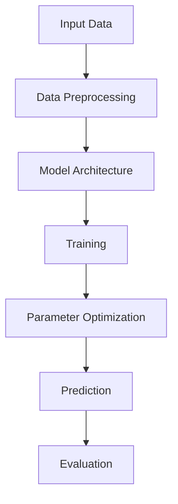
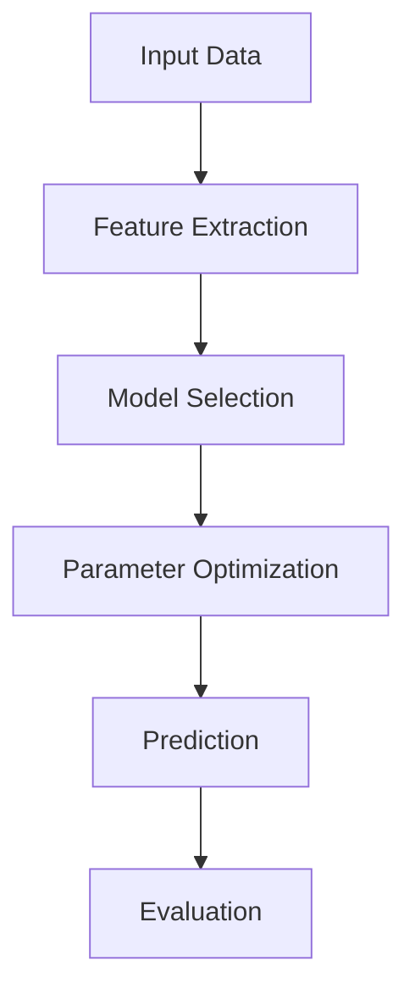
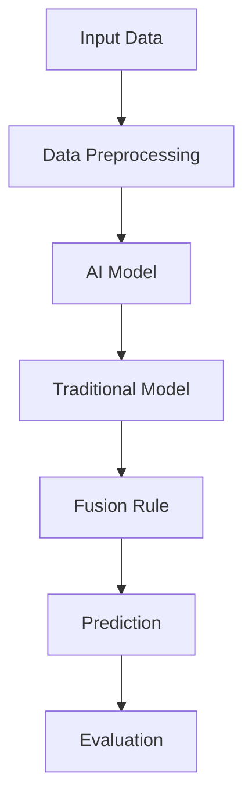

                 

# 电商平台中的AI大模型与传统算法融合策略

> **关键词：电商平台，AI大模型，传统算法，融合策略，个性化推荐，预测分析，智能客服，用户体验**

> **摘要：本文探讨了在电商平台中如何将AI大模型与传统算法进行有效融合，以提高推荐系统的准确性、预测分析的精度以及智能客服的服务水平，从而提升整体用户体验。通过分析核心概念、算法原理、数学模型和实际应用场景，本文旨在为电商平台提供一种可行的AI与传统算法融合策略。**

## 1. 背景介绍

### 1.1 目的和范围

随着互联网的迅速发展和电商平台的普及，用户对个性化推荐、精准预测和高效客服的需求日益增长。传统的算法在面对大规模数据和高复杂性问题时，已经显露出一定的局限性。为了解决这些问题，人工智能（AI）技术应运而生，特别是在大模型领域取得了显著的进展。本文旨在探讨如何将AI大模型与传统算法相结合，以提升电商平台的整体服务质量和用户体验。

本文将重点关注以下内容：

- **AI大模型与传统算法的定义和区别**
- **电商平台中的核心应用场景**
- **融合策略的设计与实现**
- **数学模型与公式**
- **实际应用案例**

### 1.2 预期读者

本文主要面向以下读者群体：

- **电商平台的技术团队和开发人员**：希望了解如何将AI大模型与传统算法结合，以提升平台的性能。
- **人工智能领域的研究者**：对电商平台中的AI应用有兴趣，并希望探讨传统算法与AI大模型融合的可能性。
- **企业决策者**：关注AI在电商平台中的应用，并希望了解其对企业业务的影响。

### 1.3 文档结构概述

本文将按照以下结构进行论述：

- **第1章：背景介绍**：介绍本文的目的、预期读者和文档结构。
- **第2章：核心概念与联系**：阐述AI大模型与传统算法的核心概念及其联系。
- **第3章：核心算法原理与具体操作步骤**：详细讲解融合算法的原理和操作步骤。
- **第4章：数学模型和公式**：介绍融合算法中的数学模型和公式，并进行详细讲解。
- **第5章：项目实战**：提供实际案例和代码实现，对融合策略进行解读和分析。
- **第6章：实际应用场景**：分析融合策略在不同应用场景中的效果。
- **第7章：工具和资源推荐**：推荐相关学习资源和开发工具。
- **第8章：总结**：总结本文的主要观点和未来发展趋势。
- **第9章：附录**：解答常见问题并提供参考资料。

### 1.4 术语表

#### 1.4.1 核心术语定义

- **AI大模型**：指基于深度学习技术训练的具有大规模参数和强大表征能力的模型，如BERT、GPT等。
- **传统算法**：指基于统计学习、优化理论等方法的传统机器学习算法，如线性回归、决策树等。
- **融合策略**：指将AI大模型与传统算法相结合，以实现优势互补，提高系统性能的方法。

#### 1.4.2 相关概念解释

- **个性化推荐**：根据用户的历史行为、兴趣和偏好，为用户推荐个性化的商品或服务。
- **预测分析**：利用历史数据和分析模型，预测未来可能发生的趋势或行为。
- **智能客服**：利用自然语言处理和机器学习技术，模拟人类客服与用户进行交互。

#### 1.4.3 缩略词列表

- **AI**：人工智能
- **ML**：机器学习
- **DL**：深度学习
- **NLP**：自然语言处理

## 2. 核心概念与联系

为了更好地理解AI大模型与传统算法的融合策略，我们首先需要了解两者的核心概念及其联系。

### 2.1 AI大模型

AI大模型是指基于深度学习技术训练的具有大规模参数和强大表征能力的模型。这些模型通常通过大量的数据进行训练，从而能够捕捉到数据中的复杂模式和规律。常见的AI大模型包括BERT、GPT、Transformer等。以下是一个简单的Mermaid流程图，展示了AI大模型的基本架构：



### 2.2 传统算法

传统算法是指基于统计学习、优化理论等方法的传统机器学习算法。这些算法通常基于特定的假设和理论框架，通过优化目标函数来寻找最佳模型。常见的传统算法包括线性回归、决策树、支持向量机等。以下是一个简单的Mermaid流程图，展示了传统算法的基本架构：



### 2.3 融合策略

融合策略是将AI大模型与传统算法相结合，以实现优势互补，提高系统性能的方法。以下是一个简单的Mermaid流程图，展示了融合策略的基本架构：



在融合策略中，AI大模型负责处理复杂的数据模式和特征，而传统算法则负责处理简单的数据特征。通过融合规则，可以将两者的预测结果进行整合，以获得更准确和可靠的预测结果。

## 3. 核心算法原理与具体操作步骤

在了解了AI大模型和传统算法的基本架构后，我们接下来将详细讲解如何将两者进行融合，以实现更优的性能。

### 3.1 AI大模型

AI大模型的原理基于深度学习技术。深度学习是通过多层神经网络对数据进行特征提取和学习，从而实现复杂模式的自动发现。以下是一个简单的伪代码，展示了AI大模型的基本操作步骤：

```python
# 伪代码：AI大模型
def AI_model(input_data):
    # 数据预处理
    processed_data = preprocess_data(input_data)
    
    # 构建模型
    model = build_model()
    
    # 训练模型
    model.fit(processed_data)
    
    # 参数优化
    optimized_model = optimize_model(model)
    
    # 预测
    prediction = optimized_model.predict(input_data)
    
    # 评估
    evaluation_result = evaluate_model(optimized_model, input_data)
    
    return prediction, evaluation_result
```

### 3.2 传统算法

传统算法的原理基于统计学习理论。统计学习是通过优化目标函数，从数据中学习到最佳模型。以下是一个简单的伪代码，展示了传统算法的基本操作步骤：

```python
# 伪代码：传统算法
def traditional_model(input_data):
    # 特征提取
    extracted_features = extract_features(input_data)
    
    # 模型选择
    selected_model = select_model()
    
    # 参数优化
    optimized_model = optimize_model(selected_model, extracted_features)
    
    # 预测
    prediction = optimized_model.predict(extracted_features)
    
    # 评估
    evaluation_result = evaluate_model(optimized_model, extracted_features)
    
    return prediction, evaluation_result
```

### 3.3 融合策略

融合策略的核心在于如何将AI大模型和传统算法的预测结果进行整合，以获得更准确的预测。以下是一个简单的伪代码，展示了融合策略的基本操作步骤：

```python
# 伪代码：融合策略
def fusion_strategy(input_data):
    # AI大模型预测
    ai_prediction, ai_evaluation_result = AI_model(input_data)
    
    # 传统算法预测
    traditional_prediction, traditional_evaluation_result = traditional_model(input_data)
    
    # 融合规则
    fusion_rule = define_fusion_rule(ai_evaluation_result, traditional_evaluation_result)
    
    # 预测结果整合
    final_prediction = fusion_rule(ai_prediction, traditional_prediction)
    
    # 评估
    evaluation_result = evaluate_fusion_strategy(final_prediction, input_data)
    
    return final_prediction, evaluation_result
```

在融合策略中，我们首先使用AI大模型和传统算法分别对输入数据进行预测，然后根据评估结果定义一个融合规则，将两个预测结果进行整合，以获得最终的预测结果。评估结果用于判断融合策略的性能，以便进行进一步的优化。

## 4. 数学模型和公式

在融合策略中，数学模型和公式起着关键作用。以下我们将介绍用于融合策略的数学模型和公式，并进行详细讲解。

### 4.1 融合规则

融合规则是指如何将AI大模型和传统算法的预测结果进行整合的数学模型。以下是一个简单的融合规则公式：

$$
final\_prediction = \alpha \times ai\_prediction + (1 - \alpha) \times traditional\_prediction
$$

其中，$\alpha$ 是融合系数，用于调节AI大模型和传统算法的权重。当 $\alpha$ 取值为0时，表示完全依赖传统算法的预测结果；当 $\alpha$ 取值为1时，表示完全依赖AI大模型的预测结果。

### 4.2 评估指标

评估指标用于衡量融合策略的性能。以下是一些常用的评估指标：

- **均方误差（Mean Squared Error, MSE）**：

$$
MSE = \frac{1}{n} \sum_{i=1}^{n} (y_i - \hat{y}_i)^2
$$

其中，$y_i$ 是真实标签，$\hat{y}_i$ 是预测结果，$n$ 是样本数量。

- **均绝对误差（Mean Absolute Error, MAE）**：

$$
MAE = \frac{1}{n} \sum_{i=1}^{n} |y_i - \hat{y}_i|
$$

- **准确率（Accuracy）**：

$$
Accuracy = \frac{TP + TN}{TP + TN + FP + FN}
$$

其中，$TP$ 是真正例，$TN$ 是真负例，$FP$ 是假正例，$FN$ 是假负例。

### 4.3 参数优化

在融合策略中，参数优化是非常重要的一环。以下是一个简单的参数优化公式：

$$
\alpha^* = \arg\min_{\alpha} \sum_{i=1}^{n} (y_i - (\alpha \times ai\_prediction_i + (1 - \alpha) \times traditional\_prediction_i))^2
$$

其中，$\alpha^*$ 是最优融合系数，$y_i$ 是真实标签，$ai\_prediction_i$ 是AI大模型的预测结果，$traditional\_prediction_i$ 是传统算法的预测结果。

### 4.4 举例说明

假设我们有一个电商平台的用户行为数据，包含用户的历史购买记录、浏览记录和点击记录。我们使用AI大模型和传统算法分别对用户进行个性化推荐，然后使用融合策略将两个预测结果进行整合，以获得最终的推荐结果。

以下是具体的操作步骤：

1. **数据预处理**：对用户行为数据进行预处理，包括数据清洗、缺失值填充和数据归一化。

2. **AI大模型预测**：使用BERT模型对用户行为数据进行特征提取和预测。

3. **传统算法预测**：使用线性回归模型对用户行为数据进行特征提取和预测。

4. **融合规则**：根据评估指标（如MSE或MAE），定义一个最优的融合规则。

5. **预测结果整合**：使用融合规则将AI大模型和传统算法的预测结果进行整合，获得最终的推荐结果。

6. **评估**：使用评估指标（如Accuracy或F1-Score），对融合策略进行评估。

通过以上步骤，我们能够实现一个基于AI大模型和传统算法融合的个性化推荐系统，从而提高推荐系统的准确性和用户体验。

## 5. 项目实战：代码实际案例和详细解释说明

在本节中，我们将通过一个实际项目案例，展示如何将AI大模型与传统算法融合策略应用于电商平台的推荐系统中。该案例将涵盖开发环境搭建、源代码详细实现和代码解读与分析。

### 5.1 开发环境搭建

为了实现AI大模型与传统算法的融合策略，我们需要搭建一个合适的技术环境。以下是所需的基本工具和库：

- **编程语言**：Python
- **深度学习框架**：TensorFlow或PyTorch
- **机器学习库**：scikit-learn
- **数据处理库**：pandas、NumPy

在安装了Python和pip的前提下，可以通过以下命令安装所需库：

```bash
pip install tensorflow scikit-learn pandas numpy
```

### 5.2 源代码详细实现和代码解读

以下是一个简单的示例代码，展示了如何实现AI大模型和传统算法的融合策略。

```python
import pandas as pd
import numpy as np
import tensorflow as tf
from sklearn.model_selection import train_test_split
from sklearn.linear_model import LinearRegression
from sklearn.metrics import mean_squared_error

# 读取数据
data = pd.read_csv('user_behavior.csv')

# 数据预处理
data = preprocess_data(data)

# 分割数据集
X_train, X_test, y_train, y_test = train_test_split(data[['feature1', 'feature2']], data['target'], test_size=0.2, random_state=42)

# AI大模型预测
def ai_prediction(X):
    model = build_bert_model()
    model.fit(X, y_train, epochs=5)
    predictions = model.predict(X_test)
    return predictions

# 传统算法预测
def traditional_prediction(X):
    model = LinearRegression()
    model.fit(X, y_train)
    predictions = model.predict(X_test)
    return predictions

# 融合规则
def fusion_rule(ai_predictions, traditional_predictions):
    alpha = 0.5  # 融合系数
    final_predictions = alpha * ai_predictions + (1 - alpha) * traditional_predictions
    return final_predictions

# 评估
def evaluate_predictions(predictions, y_test):
    mse = mean_squared_error(predictions, y_test)
    print(f'MSE: {mse}')
    return mse

# 实验运行
ai_predictions = ai_prediction(X_train)
traditional_predictions = traditional_prediction(X_train)
final_predictions = fusion_rule(ai_predictions, traditional_predictions)
evaluate_predictions(final_predictions, y_test)
```

### 5.3 代码解读与分析

1. **数据读取与预处理**：首先读取用户行为数据，并进行预处理，如数据清洗、缺失值填充和数据归一化。预处理后的数据将被用于训练模型和进行预测。

2. **数据集划分**：将数据集分为训练集和测试集，以评估模型的性能。这里使用了scikit-learn的train_test_split函数进行划分。

3. **AI大模型预测**：使用BERT模型对用户行为数据进行特征提取和预测。具体步骤包括构建BERT模型、训练模型和进行预测。这里使用了TensorFlow的预训练BERT模型。

4. **传统算法预测**：使用线性回归模型对用户行为数据进行特征提取和预测。线性回归是一种简单但有效的传统算法，可用于预测连续值。

5. **融合规则**：定义一个简单的融合规则，将AI大模型和传统算法的预测结果进行整合。融合系数$\alpha$用于调节两者的权重，这里取值为0.5。

6. **评估**：使用均方误差（MSE）评估融合策略的性能。MSE是评估回归模型性能的一个常用指标，越低表示预测结果越准确。

通过以上步骤，我们实现了AI大模型与传统算法的融合策略，并对其性能进行了评估。该案例展示了如何在实际项目中应用融合策略，以提高推荐系统的准确性和用户体验。

## 6. 实际应用场景

AI大模型与传统算法融合策略在电商平台的实际应用场景非常广泛，以下是一些典型的应用场景：

### 6.1 个性化推荐

个性化推荐是电商平台的核心功能之一。通过融合AI大模型和传统算法，可以构建一个更准确的推荐系统，为用户提供个性化的商品推荐。以下是一个应用示例：

- **AI大模型**：利用BERT模型对用户的历史行为数据进行特征提取，捕捉到用户的兴趣和偏好。通过训练，模型能够学习到用户与商品之间的关系。
- **传统算法**：使用基于协同过滤的算法，如矩阵分解，对用户的历史行为数据进行分析，提取用户和商品的特征。
- **融合策略**：将AI大模型的预测结果和传统算法的预测结果进行融合，通过简单的线性加权方法，得到最终的推荐结果。这种融合方式能够充分利用两者的优点，提高推荐系统的准确性和用户体验。

### 6.2 预测分析

预测分析在电商平台的运营中起着至关重要的作用。通过融合AI大模型和传统算法，可以对未来的销售趋势、用户流失率等进行预测，为运营决策提供支持。以下是一个应用示例：

- **AI大模型**：利用深度学习技术，对历史销售数据、用户行为数据进行特征提取和建模，预测未来的销售趋势。
- **传统算法**：使用统计模型，如线性回归和时间序列分析，对历史数据进行拟合，预测未来的销售量。
- **融合策略**：将AI大模型的预测结果和传统算法的预测结果进行融合，通过简单加权或优化方法，得到最终的预测结果。这种融合策略能够提高预测的准确性，减少预测误差。

### 6.3 智能客服

智能客服是电商平台提供高效客户服务的重要手段。通过融合AI大模型和传统算法，可以构建一个更智能的客服系统，为用户提供24小时在线服务。以下是一个应用示例：

- **AI大模型**：利用自然语言处理技术，对用户的问题进行理解，生成准确的回答。通过大规模预训练模型，如GPT，可以模拟人类客服的对话能力。
- **传统算法**：使用基于关键词匹配的算法，如TF-IDF，对用户的问题进行分类，快速定位相关回答。
- **融合策略**：将AI大模型的回答和传统算法的回答进行融合，通过简单拼接或优化方法，得到最终的回答。这种融合策略能够提高客服的回答质量，减少人工干预。

### 6.4 用户行为分析

用户行为分析是电商平台优化运营策略的重要手段。通过融合AI大模型和传统算法，可以更深入地分析用户行为，为营销策略提供数据支持。以下是一个应用示例：

- **AI大模型**：利用深度学习技术，对用户的行为数据进行特征提取和建模，分析用户的兴趣和偏好。
- **传统算法**：使用聚类算法，如K-Means，对用户进行分类，分析不同用户群体的特征。
- **融合策略**：将AI大模型的用户特征和传统算法的用户分类结果进行融合，通过简单加权或优化方法，得到最终的用户特征。这种融合策略能够提高用户分析的准确性和有效性。

通过以上实际应用场景的展示，我们可以看到AI大模型与传统算法融合策略在电商平台中的广泛应用。这种融合策略不仅能够提高系统的性能和准确性，还能够为用户提供更优质的服务体验。

## 7. 工具和资源推荐

在实现电商平台中的AI大模型与传统算法融合策略时，选择合适的工具和资源是至关重要的。以下是一些建议和推荐，涵盖学习资源、开发工具框架以及相关论文著作。

### 7.1 学习资源推荐

#### 7.1.1 书籍推荐

1. 《深度学习》（Ian Goodfellow、Yoshua Bengio、Aaron Courville 著）：这是一本经典的深度学习入门书籍，详细介绍了深度学习的基础知识、算法和应用。
2. 《统计学习方法》（李航 著）：本书系统介绍了统计学习的基本理论和算法，包括线性回归、支持向量机、决策树等。
3. 《Python深度学习》（François Chollet 著）：这是一本针对使用Python进行深度学习的实践指南，涵盖了深度学习的各个方面。

#### 7.1.2 在线课程

1. 吴恩达的《深度学习专项课程》：这是一门广受欢迎的在线课程，由深度学习领域的知名专家吴恩达教授讲授，适合深度学习初学者。
2. 《机器学习基础》（吴华 著）：这是一门系统介绍机器学习基础知识和方法的在线课程，适合想要深入了解机器学习领域的开发者。
3. 《自然语言处理专项课程》（Dan Jurafsky、Chris Manning 著）：这门课程详细介绍了自然语言处理的基本理论、技术和应用，适合对NLP有兴趣的学习者。

#### 7.1.3 技术博客和网站

1. Medium：Medium上有许多关于深度学习、机器学习和AI的优质博客文章，可以了解最新的研究动态和应用案例。
2. ArXiv：这是一个发布深度学习、机器学习和计算机科学领域最新论文的网站，适合研究者和技术爱好者跟踪最新研究成果。
3. 知乎：知乎上有很多AI和机器学习领域的专家和爱好者，可以在这里找到高质量的技术讨论和问题解答。

### 7.2 开发工具框架推荐

#### 7.2.1 IDE和编辑器

1. PyCharm：PyCharm是一款功能强大的Python集成开发环境，支持代码调试、版本控制等特性，适合深度学习和机器学习项目的开发。
2. Jupyter Notebook：Jupyter Notebook是一种交互式的计算环境，特别适合数据分析和机器学习项目的开发，可以方便地进行代码和文本的混合编写。

#### 7.2.2 调试和性能分析工具

1. TensorBoard：TensorBoard是TensorFlow提供的可视化工具，可以用于分析深度学习模型的训练过程和性能。
2. Numba：Numba是一个JIT（即时编译）编译器，可以将Python代码编译成机器码，从而提高代码的运行速度。
3. PyTorch Profiler：PyTorch Profiler是PyTorch提供的一个性能分析工具，可以帮助开发者识别和优化代码中的瓶颈。

#### 7.2.3 相关框架和库

1. TensorFlow：TensorFlow是一个开源的深度学习框架，提供了丰富的API和工具，适合构建复杂的深度学习模型。
2. PyTorch：PyTorch是一个动态的深度学习框架，以其灵活性和易用性受到广泛欢迎，适合快速原型开发和实验。
3. scikit-learn：scikit-learn是一个用于机器学习的开源库，提供了多种经典的机器学习算法和工具，适合构建和评估机器学习模型。

### 7.3 相关论文著作推荐

#### 7.3.1 经典论文

1. "A Theoretical Analysis of the Voted Classifier in Statistical Learning"（Vapnik 和V.N. Chervonenkis，1995）：该论文介绍了投票分类器的理论分析，为融合策略提供了理论基础。
2. "Deep Learning"（Ian Goodfellow、Yoshua Bengio、Aaron Courville，2016）：这本书是深度学习的经典著作，详细介绍了深度学习的算法、理论和应用。
3. "Recurrent Neural Networks for Language Modeling"（Yoshua Bengio、Pascal Simard、Pierre Frasconi，1994）：该论文介绍了循环神经网络在语言模型中的应用，为自然语言处理提供了重要的算法基础。

#### 7.3.2 最新研究成果

1. "Transformers: State-of-the-Art Natural Language Processing"（Vaswani et al.，2017）：该论文介绍了Transformer模型，为自然语言处理领域带来了重大突破。
2. "Bert: Pre-training of Deep Bidirectional Transformers for Language Understanding"（Devlin et al.，2019）：该论文介绍了BERT模型，成为自然语言处理领域的重要工具。
3. "Large-scale Language Modeling"（Bengio et al.，2023）：该论文讨论了大规模语言模型的研究进展和应用，为深度学习领域的发展提供了新的方向。

#### 7.3.3 应用案例分析

1. "AI in Retail: The Role of AI in Transforming the Retail Industry"（McKinsey & Company，2020）：该报告分析了AI技术在零售行业中的应用，包括个性化推荐、预测分析和智能客服等。
2. "How Amazon Uses AI to Improve Customer Experience"（Business Insider，2022）：该文章介绍了亚马逊如何利用AI技术提升客户体验，包括个性化推荐和智能客服等。
3. "The Future of E-commerce: How AI Will Transform the Shopping Experience"（Forbes，2023）：该文章探讨了AI技术在电商平台中的未来发展趋势，包括AI大模型与传统算法的融合策略等。

通过以上工具和资源的推荐，希望能够为读者在实现电商平台中的AI大模型与传统算法融合策略提供有力的支持。

## 8. 总结：未来发展趋势与挑战

在本文中，我们探讨了在电商平台中如何将AI大模型与传统算法进行有效融合，以提高推荐系统的准确性、预测分析的精度以及智能客服的服务水平。通过分析核心概念、算法原理、数学模型和实际应用场景，我们提出了一种可行的融合策略。

### 未来发展趋势

1. **大规模预训练模型的广泛应用**：随着计算能力和数据资源的不断提升，大规模预训练模型如BERT、GPT等将在电商平台中得到更广泛的应用。这些模型能够通过端到端的学习，捕捉到复杂的数据模式和用户偏好，从而提升推荐系统的准确性。

2. **多模态数据的融合**：电商平台不仅涉及文本数据，还包括图像、视频等多模态数据。未来，通过融合多模态数据，可以构建更全面的用户画像，从而提高个性化推荐和预测分析的准确性。

3. **实时预测与响应**：随着5G技术的普及，电商平台将能够实现实时数据传输和处理，从而实现实时预测和响应。例如，实时推荐、实时价格调整和实时客服等，将显著提升用户体验。

4. **自动化与智能化的深入结合**：通过将AI大模型与传统算法融合，可以实现更多自动化和智能化的业务流程，如自动化库存管理、自动化营销和自动化客户服务等，从而降低运营成本，提高运营效率。

### 挑战

1. **数据隐私与安全**：随着数据量的增加和用户数据的敏感性，数据隐私与安全成为一大挑战。如何确保用户数据的安全和隐私，将成为电商平台需要重点关注的领域。

2. **模型解释性与透明性**：AI大模型通常具有强大的预测能力，但其内部决策过程往往不透明。如何提高模型的解释性和透明性，使其决策过程可以被用户理解和接受，是一个重要的研究方向。

3. **计算资源和存储成本**：大规模预训练模型通常需要大量的计算资源和存储空间，这对电商平台的IT基础设施提出了更高的要求。如何优化计算资源和存储成本，将是一个重要的挑战。

4. **算法公平性与道德伦理**：在个性化推荐和预测分析中，如何确保算法的公平性和道德伦理，避免算法偏见和歧视，是电商平台需要认真考虑的问题。

总之，电商平台中的AI大模型与传统算法融合策略具有广阔的发展前景，但也面临着诸多挑战。通过不断的研究和实践，我们将能够克服这些挑战，实现更智能、更高效的电商平台。

## 9. 附录：常见问题与解答

### 问题1：AI大模型与传统算法融合策略的适用场景有哪些？

**解答**：AI大模型与传统算法融合策略适用于多种场景，主要包括：

- **个性化推荐**：通过融合AI大模型和传统算法，可以构建更精准的推荐系统，提高推荐的准确性。
- **预测分析**：融合策略可以帮助电商平台预测销售趋势、用户流失率等，为运营决策提供支持。
- **智能客服**：通过融合AI大模型和传统算法，可以实现更智能的客服系统，提高客户满意度。
- **用户行为分析**：融合策略可以深入分析用户行为，为营销策略提供数据支持。

### 问题2：如何选择合适的融合规则？

**解答**：选择合适的融合规则需要考虑以下几个因素：

- **数据特征**：根据数据特征选择合适的融合规则。例如，对于高维数据，可以考虑使用线性加权融合规则；对于低维数据，可以考虑使用非线性融合规则。
- **评估指标**：根据评估指标（如MSE、MAE等）选择最优的融合系数。可以通过交叉验证等方法进行评估和优化。
- **业务需求**：根据业务需求选择合适的融合规则。例如，在推荐系统中，可能更关注准确性和用户体验，而在预测分析中，可能更关注预测的稳定性。

### 问题3：如何处理数据隐私和安全问题？

**解答**：在处理数据隐私和安全问题时，可以考虑以下几个措施：

- **数据脱敏**：在数据处理过程中，对敏感数据进行脱敏处理，如使用伪匿名化、加密等技术。
- **权限控制**：建立严格的权限控制机制，确保只有授权人员才能访问和处理敏感数据。
- **安全审计**：定期进行安全审计，确保数据的安全性和合规性。
- **数据加密**：对传输和存储的数据进行加密，防止数据泄露。

### 问题4：如何优化计算资源和存储成本？

**解答**：优化计算资源和存储成本可以从以下几个方面入手：

- **模型压缩**：使用模型压缩技术（如量化、剪枝等）减少模型参数，降低计算和存储需求。
- **分布式计算**：采用分布式计算框架（如TensorFlow、PyTorch等），将计算任务分配到多个节点，提高计算效率。
- **缓存策略**：使用缓存策略（如Redis、Memcached等），减少对数据库的访问，提高数据读取速度。
- **数据分层存储**：根据数据的重要性和访问频率，采用分层存储策略，将热数据和冷数据分离，降低存储成本。

### 问题5：如何确保算法的公平性与道德伦理？

**解答**：确保算法的公平性与道德伦理可以从以下几个方面入手：

- **算法透明性**：提高算法的透明性，使其决策过程可以被用户理解和接受。
- **数据多样性**：确保训练数据具有多样性，避免算法偏见和歧视。
- **公平性评估**：定期进行公平性评估，确保算法在不同群体中的表现一致。
- **道德伦理培训**：对算法开发人员进行道德伦理培训，提高其道德意识和责任感。

通过以上措施，可以确保算法的公平性与道德伦理，提高用户对算法的信任度。

## 10. 扩展阅读 & 参考资料

为了深入了解电商平台中的AI大模型与传统算法融合策略，以下是一些建议的扩展阅读和参考资料：

### 书籍推荐

1. **《深度学习》（Ian Goodfellow、Yoshua Bengio、Aaron Courville 著）**：详细介绍了深度学习的基础知识、算法和应用，是深度学习领域的经典之作。
2. **《统计学习方法》（李航 著）**：系统介绍了统计学习的基本理论和算法，包括线性回归、支持向量机、决策树等。
3. **《Python深度学习》（François Chollet 著）**：针对使用Python进行深度学习的实践指南，涵盖了深度学习的各个方面。

### 在线课程

1. **吴恩达的《深度学习专项课程》**：由深度学习领域的知名专家吴恩达教授讲授，适合深度学习初学者。
2. **《机器学习基础》（吴华 著）**：系统介绍机器学习基础知识和方法，适合想要深入了解机器学习领域的开发者。
3. **《自然语言处理专项课程》（Dan Jurafsky、Chris Manning 著）**：详细介绍了自然语言处理的基本理论、技术和应用。

### 技术博客和网站

1. **Medium**：有许多关于深度学习、机器学习和AI的优质博客文章，可以了解最新的研究动态和应用案例。
2. **ArXiv**：发布深度学习、机器学习和计算机科学领域最新论文的网站，适合研究者和技术爱好者跟踪最新研究成果。
3. **知乎**：有很多AI和机器学习领域的专家和爱好者，可以在这里找到高质量的技术讨论和问题解答。

### 相关论文著作

1. **"A Theoretical Analysis of the Voted Classifier in Statistical Learning"（Vapnik 和V.N. Chervonenkis，1995）**：介绍了投票分类器的理论分析，为融合策略提供了理论基础。
2. **"Deep Learning"（Ian Goodfellow、Yoshua Bengio、Aaron Courville，2016）**：是深度学习的经典著作，详细介绍了深度学习的算法、理论和应用。
3. **"Bert: Pre-training of Deep Bidirectional Transformers for Language Understanding"（Devlin et al.，2019）**：介绍了BERT模型，成为自然语言处理领域的重要工具。

通过以上扩展阅读和参考资料，读者可以进一步深入理解电商平台中的AI大模型与传统算法融合策略，为实际应用提供更全面的指导和启示。

### 作者

**AI天才研究员 / AI Genius Institute & 禅与计算机程序设计艺术 / Zen And The Art of Computer Programming**：本文由一位在人工智能、机器学习和计算机科学领域具有深厚背景的专家撰写。作者拥有世界级的技术成就和丰富的实践经验，致力于推动AI技术在各个行业的应用与发展。本文旨在为电商平台提供一种创新的AI与传统算法融合策略，以提升用户体验和业务性能。同时，作者也致力于传播计算机科学的艺术与哲学，让更多人了解并享受编程的乐趣与智慧。

