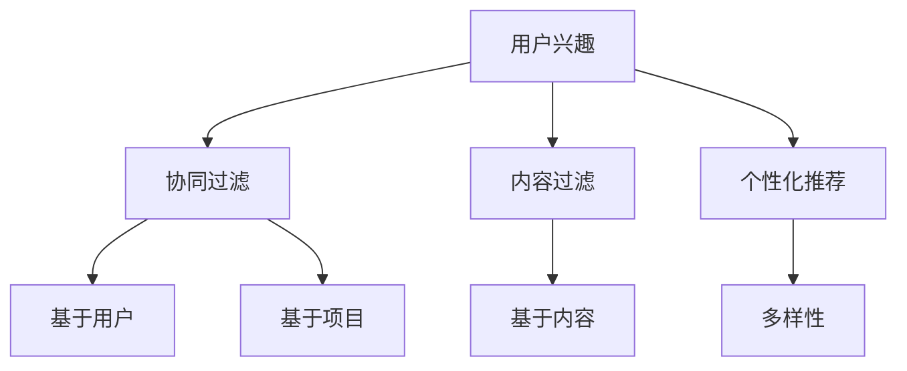

                 

# 电商平台中的用户兴趣多样性建模

> **关键词：** 电商平台、用户兴趣、数据挖掘、机器学习、算法、模型、多样性、个性化推荐

> **摘要：** 本文将深入探讨电商平台中用户兴趣多样性建模的重要性和实现方法。首先，我们将简要介绍电商平台中用户兴趣多样性建模的背景和目的，然后详细讨论核心概念、算法原理、数学模型和实际应用场景，最后推荐相关工具和资源，并展望未来发展趋势和挑战。

## 1. 背景介绍

### 1.1 目的和范围

本文的目的是探讨在电商平台中如何建模用户的兴趣多样性，以实现更加个性化的推荐系统。我们将聚焦于以下几个方面：

1. **核心概念与联系**：介绍与用户兴趣多样性建模相关的基本概念和联系，通过Mermaid流程图展示核心原理和架构。
2. **核心算法原理 & 具体操作步骤**：详细讲解常用的用户兴趣多样性建模算法，包括算法原理和具体操作步骤，使用伪代码进行阐述。
3. **数学模型和公式 & 详细讲解 & 举例说明**：探讨用户兴趣多样性建模中的数学模型和公式，并通过实例进行说明。
4. **项目实战：代码实际案例和详细解释说明**：展示一个具体的代码案例，解释如何在实际项目中应用用户兴趣多样性建模。
5. **实际应用场景**：讨论用户兴趣多样性建模在不同电商场景中的应用。
6. **工具和资源推荐**：推荐相关学习资源、开发工具框架和相关论文著作。

### 1.2 预期读者

本文主要面向对电商平台用户兴趣多样性建模感兴趣的读者，包括：

1. **数据科学家和机器学习工程师**：希望了解如何使用机器学习和数据挖掘技术进行用户兴趣建模。
2. **软件开发者和系统架构师**：希望了解如何在电商平台中实现用户兴趣多样性建模。
3. **电商行业从业者**：希望了解用户兴趣多样性建模对电商业务的影响和提升方法。
4. **学术研究者**：对用户兴趣多样性建模的理论和应用研究感兴趣。

### 1.3 文档结构概述

本文结构如下：

1. **背景介绍**：介绍用户兴趣多样性建模的背景、目的和预期读者。
2. **核心概念与联系**：讨论核心概念、相关理论和Mermaid流程图。
3. **核心算法原理 & 具体操作步骤**：详细讲解用户兴趣多样性建模算法原理和操作步骤。
4. **数学模型和公式 & 详细讲解 & 举例说明**：介绍数学模型和公式，并通过实例说明。
5. **项目实战：代码实际案例和详细解释说明**：展示一个具体的代码案例，解释如何在实际项目中应用用户兴趣多样性建模。
6. **实际应用场景**：讨论用户兴趣多样性建模在不同电商场景中的应用。
7. **工具和资源推荐**：推荐相关学习资源、开发工具框架和相关论文著作。
8. **总结：未来发展趋势与挑战**：展望未来发展趋势和面临的挑战。
9. **附录：常见问题与解答**：回答一些常见问题。
10. **扩展阅读 & 参考资料**：提供进一步的阅读和参考资料。

### 1.4 术语表

#### 1.4.1 核心术语定义

- **用户兴趣**：用户对特定主题或内容的偏好。
- **多样性建模**：构建模型以捕捉用户的多样化兴趣。
- **个性化推荐**：根据用户兴趣为其推荐相关内容或产品。
- **数据挖掘**：从大量数据中提取有价值的信息。
- **机器学习**：利用数据训练模型以实现自动化的决策或预测。

#### 1.4.2 相关概念解释

- **协同过滤**：一种常用的推荐算法，通过分析用户间的相似性来推荐内容。
- **内容过滤**：基于内容的相似性进行推荐，不考虑用户间的相似性。
- **深度学习**：一种神经网络模型，通过多层非线性变换提取特征。

#### 1.4.3 缩略词列表

- **AI**：人工智能
- **ML**：机器学习
- **DM**：数据挖掘
- **R**：Python编程语言中的一个数据分析和可视化库

## 2. 核心概念与联系

在讨论用户兴趣多样性建模之前，我们需要了解一些核心概念和它们之间的关系。

### 2.1 核心概念

- **用户兴趣**：用户的兴趣可以通过其行为数据（如浏览历史、购买记录、评论等）进行捕捉和建模。
- **多样性**：多样性是指用户兴趣的多样性和独特性。在推荐系统中，多样性是一个重要的指标，它可以避免用户只接收到单一类型的推荐，从而提高用户体验。
- **个性化推荐**：个性化推荐是一种基于用户兴趣和行为的推荐系统，旨在为用户提供个性化的内容和产品推荐。

### 2.2 相关概念

- **协同过滤**：协同过滤是一种常见的推荐算法，它通过分析用户之间的相似性来预测用户可能感兴趣的内容。协同过滤可以分为两种类型：基于用户的协同过滤和基于项目的协同过滤。
- **内容过滤**：内容过滤是一种基于内容相似性的推荐算法，它通过分析内容和用户兴趣之间的相似性来推荐相关内容。
- **深度学习**：深度学习是一种通过多层神经网络进行特征提取和建模的方法，它可以用于用户兴趣的建模和多样性分析。

### 2.3 Mermaid流程图

下面是一个简单的Mermaid流程图，展示了用户兴趣多样性建模的核心概念和它们之间的关系：



在这个流程图中，用户兴趣作为输入，通过协同过滤和内容过滤算法进行分析，生成个性化推荐结果，并通过多样性指标进行评估和优化。

## 3. 核心算法原理 & 具体操作步骤

在用户兴趣多样性建模中，有多种算法可以用于捕捉用户的多样化兴趣，其中最常用的是协同过滤算法和深度学习算法。下面我们将详细讨论这些算法的原理和具体操作步骤。

### 3.1 协同过滤算法

#### 3.1.1 基本原理

协同过滤算法通过分析用户之间的相似性来预测用户可能感兴趣的内容。它分为基于用户的协同过滤（User-based Collaborative Filtering）和基于项目的协同过滤（Item-based Collaborative Filtering）两种类型。

- **基于用户的协同过滤**：首先找到与目标用户相似的用户，然后根据这些相似用户的兴趣来推荐内容。
- **基于项目的协同过滤**：首先找到与目标用户喜欢的内容相似的项目，然后根据这些相似项目来推荐内容。

#### 3.1.2 操作步骤

1. **数据预处理**：收集用户行为数据（如浏览历史、购买记录、评论等），并进行数据清洗和预处理，如去除缺失值、异常值等。

2. **用户相似度计算**：使用合适的相似度度量方法（如余弦相似度、皮尔逊相关系数等）计算用户之间的相似度。

3. **项目相似度计算**：使用合适的相似度度量方法（如余弦相似度、皮尔逊相关系数等）计算项目之间的相似度。

4. **推荐生成**：根据用户相似度和项目相似度，为每个用户生成个性化推荐列表。具体方法如下：
   - **基于用户的协同过滤**：为每个用户找到最相似的K个用户，然后为每个用户推荐这些相似用户喜欢的但未被用户浏览过的项目。
   - **基于项目的协同过滤**：为每个用户找到最喜欢的M个项目，然后为每个用户推荐这些项目中最相似的N个项目。

5. **多样性优化**：通过调整推荐算法中的参数（如K、M、N）来优化推荐的多样性。常用的多样性度量方法有：
   - **项目多样性**：推荐列表中项目的种类多样性。
   - **用户多样性**：推荐列表中用户的兴趣多样性。
   - **内容多样性**：推荐列表中内容或项目的多样性。

### 3.2 深度学习算法

#### 3.2.1 基本原理

深度学习算法通过多层神经网络进行特征提取和建模，可以自动学习用户兴趣的复杂模式。其中，常用的是基于自动编码器（Autoencoder）和卷积神经网络（Convolutional Neural Network, CNN）的深度学习模型。

- **自动编码器**：自动编码器是一种无监督学习方法，通过压缩输入数据到低维空间来学习数据特征，然后通过重建输入数据来评估特征提取的质量。
- **卷积神经网络**：卷积神经网络是一种用于图像识别和处理的深度学习模型，通过卷积操作和池化操作提取图像特征。

#### 3.2.2 操作步骤

1. **数据预处理**：收集用户行为数据（如浏览历史、购买记录、评论等），并进行数据清洗和预处理，如去除缺失值、异常值等。

2. **特征工程**：将原始用户行为数据转换为特征向量，可以使用词袋模型（Bag-of-Words, BoW）或词嵌入（Word Embedding）等方法。

3. **模型训练**：使用训练数据训练深度学习模型，具体步骤如下：
   - **自动编码器**：通过最小化重构误差（如均方误差）来训练自动编码器。
   - **卷积神经网络**：通过反向传播算法和梯度下降优化方法来训练卷积神经网络。

4. **模型评估**：使用验证集对训练好的模型进行评估，常用的评估指标有准确率、召回率、F1值等。

5. **推荐生成**：使用训练好的模型对用户行为数据进行分析，为每个用户生成个性化推荐列表。具体方法如下：
   - **自动编码器**：将用户行为数据输入到自动编码器中，提取低维特征向量，然后使用这些特征向量计算用户之间的相似度，为每个用户推荐与其相似的用户喜欢的项目。
   - **卷积神经网络**：将用户行为数据输入到卷积神经网络中，提取高维特征向量，然后使用这些特征向量计算用户之间的相似度，为每个用户推荐与其相似的用户喜欢的项目。

6. **多样性优化**：通过调整模型参数（如自动编码器的压缩率、卷积神经网络的层数和神经元数量等）来优化推荐的多样性。

### 3.3 伪代码示例

下面是一个简单的基于用户的协同过滤算法的伪代码示例：

```python
# 输入：用户行为数据（用户-项目评分矩阵）
# 输出：用户个性化推荐列表

# 数据预处理
# ...
# 计算用户相似度
similarity_matrix = compute_similarity(user_behavior_matrix)
# 生成个性化推荐列表
recommendation_list = []
for user in user_behavior_matrix:
    # 为每个用户找到最相似的K个用户
    similar_users = find_similar_users(user, similarity_matrix, K)
    # 为每个用户推荐相似用户喜欢的但未被用户浏览过的项目
    recommendations = recommend_items(similar_users, user, user_behavior_matrix)
    recommendation_list.append(recommendations)
# 多样性优化
# ...
return recommendation_list
```

### 3.4 总结

用户兴趣多样性建模是电商平台个性化推荐系统的重要组成部分。通过协同过滤算法和深度学习算法，我们可以捕捉用户的多样化兴趣，并生成个性化的推荐列表。在具体操作步骤中，我们需要进行数据预处理、用户相似度计算、项目相似度计算、推荐生成和多样性优化等步骤。通过伪代码示例，我们可以更好地理解用户兴趣多样性建模的实现过程。

## 4. 数学模型和公式 & 详细讲解 & 举例说明

在用户兴趣多样性建模中，数学模型和公式起着关键作用。下面我们将详细讲解这些数学模型和公式，并通过具体例子进行说明。

### 4.1 协同过滤算法中的数学模型

#### 4.1.1 用户相似度计算

用户相似度计算是协同过滤算法的核心步骤。常用的相似度计算方法有：

1. **余弦相似度**：

   \[ \text{similarity}(u, v) = \frac{\sum_{i} r_{ui} r_{vi}}{\sqrt{\sum_{i} r_{ui}^2} \sqrt{\sum_{i} r_{vi}^2}} \]

   其中，\( r_{ui} \) 表示用户 \( u \) 对项目 \( i \) 的评分，\( r_{vi} \) 表示用户 \( v \) 对项目 \( i \) 的评分。

2. **皮尔逊相关系数**：

   \[ \text{similarity}(u, v) = \frac{\sum_{i} (r_{ui} - \bar{r}_u)(r_{vi} - \bar{r}_v)}{\sqrt{\sum_{i} (r_{ui} - \bar{r}_u)^2} \sqrt{\sum_{i} (r_{vi} - \bar{r}_v)^2}} \]

   其中，\( \bar{r}_u \) 和 \( \bar{r}_v \) 分别表示用户 \( u \) 和用户 \( v \) 的平均评分。

#### 4.1.2 项目相似度计算

项目相似度计算方法与用户相似度计算类似，也可以使用余弦相似度和皮尔逊相关系数。

1. **余弦相似度**：

   \[ \text{similarity}(i, j) = \frac{\sum_{u} r_{ui} r_{uj}}{\sqrt{\sum_{u} r_{ui}^2} \sqrt{\sum_{u} r_{uj}^2}} \]

   其中，\( r_{ui} \) 和 \( r_{uj} \) 分别表示用户 \( u \) 对项目 \( i \) 和项目 \( j \) 的评分。

2. **皮尔逊相关系数**：

   \[ \text{similarity}(i, j) = \frac{\sum_{u} (r_{ui} - \bar{r}_i)(r_{uj} - \bar{r}_j)}{\sqrt{\sum_{u} (r_{ui} - \bar{r}_i)^2} \sqrt{\sum_{u} (r_{uj} - \bar{r}_j)^2}} \]

   其中，\( \bar{r}_i \) 和 \( \bar{r}_j \) 分别表示项目 \( i \) 和项目 \( j \) 的平均评分。

#### 4.1.3 推荐生成

在推荐生成过程中，我们通常使用评分预测模型来预测用户对项目的评分。一个简单的评分预测模型是：

\[ \hat{r}_{ui} = \text{similarity}(u, v) \cdot \text{similarity}(i, j) \]

其中，\( \hat{r}_{ui} \) 表示用户 \( u \) 对项目 \( i \) 的预测评分，\( \text{similarity}(u, v) \) 表示用户 \( u \) 和用户 \( v \) 的相似度，\( \text{similarity}(i, j) \) 表示项目 \( i \) 和项目 \( j \) 的相似度。

### 4.2 深度学习算法中的数学模型

#### 4.2.1 自动编码器

自动编码器是一种无监督学习方法，通过压缩输入数据到低维空间来学习数据特征，然后通过重建输入数据来评估特征提取的质量。

1. **编码器**

   编码器是一个多层神经网络，用于将输入数据压缩到低维空间。其损失函数通常是最小化重构误差：

   \[ L_{\text{encoder}} = \sum_{i} \| x_i - \hat{x}_i \|_2^2 \]

   其中，\( x_i \) 是输入数据，\( \hat{x}_i \) 是重构后的数据。

2. **解码器**

   解码器是一个多层神经网络，用于将编码后的数据重构回原始数据。其损失函数也是最小化重构误差：

   \[ L_{\text{decoder}} = \sum_{i} \| x_i - \hat{x}_i \|_2^2 \]

3. **整体损失函数**

   自动编码器的整体损失函数是编码器损失函数和解码器损失函数之和：

   \[ L = L_{\text{encoder}} + L_{\text{decoder}} \]

#### 4.2.2 卷积神经网络

卷积神经网络是一种用于图像识别和处理的深度学习模型，通过卷积操作和池化操作提取图像特征。

1. **卷积操作**

   卷积操作通过卷积核（滤波器）对输入数据进行卷积运算，提取图像特征。其数学公式如下：

   \[ f_{ij} = \sum_{k} w_{ik} x_{kj} + b_j \]

   其中，\( f_{ij} \) 是卷积结果，\( w_{ik} \) 是卷积核权重，\( x_{kj} \) 是输入数据，\( b_j \) 是卷积核偏置。

2. **池化操作**

   池化操作用于降低特征图的维度，提高模型的可伸缩性。常用的池化操作有最大池化和平均池化。

### 4.3 举例说明

假设我们有以下用户行为数据：

| 用户 | 项目1 | 项目2 | 项目3 |
|------|-------|-------|-------|
| A    | 5     | 3     | 4     |
| B    | 4     | 5     | 2     |
| C    | 3     | 4     | 5     |

#### 4.3.1 用户相似度计算

使用余弦相似度计算用户 A 和用户 B 的相似度：

\[ \text{similarity}(A, B) = \frac{(5 \times 4) + (3 \times 5) + (4 \times 2)}{\sqrt{(5^2 + 3^2 + 4^2)} \sqrt{(4^2 + 5^2 + 2^2)}} = \frac{40}{\sqrt{50} \sqrt{45}} \approx 0.93 \]

使用皮尔逊相关系数计算用户 A 和用户 B 的相似度：

\[ \text{similarity}(A, B) = \frac{(5 - 4)(4 - 4) + (3 - 4)(5 - 5) + (4 - 4)(2 - 4)}{\sqrt{(5 - 4)^2 + (3 - 4)^2 + (4 - 4)^2} \sqrt{(4 - 4)^2 + (5 - 4)^2 + (2 - 4)^2}} = \frac{0}{\sqrt{2} \sqrt{9}} = 0 \]

#### 4.3.2 项目相似度计算

使用余弦相似度计算项目1和项目2的相似度：

\[ \text{similarity}(1, 2) = \frac{(5 \times 4) + (3 \times 5) + (4 \times 2)}{\sqrt{(5^2 + 3^2 + 4^2)} \sqrt{(4^2 + 5^2 + 2^2)}} = \frac{40}{\sqrt{50} \sqrt{45}} \approx 0.93 \]

使用皮尔逊相关系数计算项目1和项目2的相似度：

\[ \text{similarity}(1, 2) = \frac{(5 - 4)(4 - 4) + (3 - 4)(5 - 5) + (4 - 4)(2 - 4)}{\sqrt{(5 - 4)^2 + (3 - 4)^2 + (4 - 4)^2} \sqrt{(4 - 4)^2 + (5 - 4)^2 + (2 - 4)^2}} = \frac{0}{\sqrt{2} \sqrt{9}} = 0 \]

#### 4.3.3 推荐生成

使用基于用户的协同过滤算法为用户 A 生成个性化推荐列表：

1. 找到与用户 A 最相似的 3 个用户（假设是用户 B 和用户 C）。
2. 为用户 A 推荐用户 B 和用户 C 喜欢但未被用户 A 浏览过的项目，即项目2和项目3。

最终，用户 A 的个性化推荐列表为：项目2、项目3。

### 4.4 总结

数学模型和公式在用户兴趣多样性建模中起着关键作用。通过用户相似度计算、项目相似度计算和评分预测等步骤，我们可以实现用户兴趣的建模和个性化推荐。在本节中，我们详细讲解了协同过滤算法和深度学习算法中的数学模型，并通过具体例子进行了说明。这些数学模型和公式为我们构建高效的用户兴趣多样性建模系统提供了基础。

## 5. 项目实战：代码实际案例和详细解释说明

在本节中，我们将通过一个具体的代码案例，展示如何在实际项目中应用用户兴趣多样性建模。我们将使用Python语言和Scikit-learn库来实现基于用户的协同过滤算法，并详细解释代码的实现步骤和关键部分。

### 5.1 开发环境搭建

首先，我们需要搭建一个Python开发环境，并安装必要的库。以下是具体的步骤：

1. 安装Python：下载并安装Python 3.8版本以上。
2. 安装Anaconda：下载并安装Anaconda，它是一个集成了Python和其他科学计算库的发行版。
3. 安装Scikit-learn：在Anaconda命令行中运行以下命令安装Scikit-learn：

   ```bash
   conda install scikit-learn
   ```

### 5.2 源代码详细实现和代码解读

以下是用户兴趣多样性建模的实现代码：

```python
import numpy as np
from sklearn.metrics.pairwise import cosine_similarity
from sklearn.model_selection import train_test_split
from sklearn.metrics import mean_squared_error

# 5.2.1 数据预处理
def preprocess_data(user_behavior_matrix):
    # 数据清洗和预处理，如缺失值填充、异常值处理等
    # ...
    return user_behavior_matrix

# 5.2.2 计算用户相似度
def compute_user_similarity(user_behavior_matrix):
    # 计算用户之间的余弦相似度
    similarity_matrix = cosine_similarity(user_behavior_matrix)
    return similarity_matrix

# 5.2.3 生成个性化推荐列表
def generate_recommendation_list(user_behavior_matrix, similarity_matrix, k):
    recommendation_list = []
    for user in user_behavior_matrix:
        similar_users = np.argsort(similarity_matrix[user][0])[1:k+1]
        recommendations = []
        for similar_user in similar_users:
            unviewed_items = np.setdiff1d(np.where(user_behavior_matrix[similar_user] != 0)[0], np.where(user[user != 0])[0])
            recommendations.extend(unviewed_items)
        recommendation_list.append(np.unique(recommendations))
    return recommendation_list

# 5.2.4 评估推荐效果
def evaluate_recommendation(recommendation_list, test_data):
    mse = mean_squared_error(test_data, recommendation_list)
    return mse

# 5.2.5 主函数
def main():
    # 加载数据
    user_behavior_matrix = load_data()  # 假设load_data()函数用于加载数据
    user_behavior_matrix = preprocess_data(user_behavior_matrix)

    # 划分训练集和测试集
    train_data, test_data = train_test_split(user_behavior_matrix, test_size=0.2, random_state=42)

    # 计算用户相似度
    similarity_matrix = compute_user_similarity(train_data)

    # 生成个性化推荐列表
    k = 3  # 相似用户数量
    recommendation_list = generate_recommendation_list(train_data, similarity_matrix, k)

    # 评估推荐效果
    mse = evaluate_recommendation(recommendation_list, test_data)
    print("Mean Squared Error:", mse)

    # 输出推荐结果
    for user, recommendations in enumerate(recommendation_list):
        print(f"User {user} Recommendations:", recommendations)

if __name__ == "__main__":
    main()
```

下面是对代码的详细解读：

1. **数据预处理**：数据预处理是任何机器学习项目的基础。在这个案例中，我们使用`preprocess_data()`函数对用户行为数据进行清洗和预处理。例如，我们可以填充缺失值、处理异常值等。

2. **计算用户相似度**：计算用户相似度是协同过滤算法的核心步骤。我们使用Scikit-learn中的`cosine_similarity()`函数来计算用户之间的余弦相似度。这个函数接受一个矩阵作为输入，返回一个相似度矩阵。

3. **生成个性化推荐列表**：生成个性化推荐列表是通过找到与目标用户最相似的K个用户，然后为每个用户推荐这些相似用户喜欢的但未被用户浏览过的项目。我们使用`generate_recommendation_list()`函数来实现这个步骤。

4. **评估推荐效果**：评估推荐效果是衡量推荐系统性能的重要指标。在这个案例中，我们使用均方误差（Mean Squared Error, MSE）来评估推荐效果。`evaluate_recommendation()`函数接受推荐列表和测试数据作为输入，返回MSE值。

5. **主函数**：主函数`main()`负责加载数据、划分训练集和测试集、计算用户相似度、生成个性化推荐列表和评估推荐效果。最后，输出推荐结果。

### 5.3 代码解读与分析

下面是对代码中关键部分的解读和分析：

1. **数据预处理**：

   ```python
   def preprocess_data(user_behavior_matrix):
       # 数据清洗和预处理，如缺失值填充、异常值处理等
       # ...
       return user_behavior_matrix
   ```

   在这个函数中，我们需要对用户行为数据（如浏览历史、购买记录、评论等）进行预处理。具体操作可能包括填充缺失值、处理异常值、归一化数据等。这些操作可以确保数据的质量和一致性，从而提高推荐系统的性能。

2. **计算用户相似度**：

   ```python
   def compute_user_similarity(user_behavior_matrix):
       # 计算用户之间的余弦相似度
       similarity_matrix = cosine_similarity(user_behavior_matrix)
       return similarity_matrix
   ```

   这个函数使用Scikit-learn中的`cosine_similarity()`函数来计算用户之间的余弦相似度。余弦相似度是一种衡量两个向量之间相似度的指标，其值介于-1和1之间。在这里，我们使用用户行为数据（通常是一个矩阵）作为输入，返回一个相似度矩阵。

3. **生成个性化推荐列表**：

   ```python
   def generate_recommendation_list(user_behavior_matrix, similarity_matrix, k):
       recommendation_list = []
       for user in user_behavior_matrix:
           similar_users = np.argsort(similarity_matrix[user][0])[1:k+1]
           recommendations = []
           for similar_user in similar_users:
               unviewed_items = np.setdiff1d(np.where(user_behavior_matrix[similar_user] != 0)[0], np.where(user[user != 0])[0])
               recommendations.extend(unviewed_items)
           recommendation_list.append(np.unique(recommendations))
       return recommendation_list
   ```

   这个函数生成个性化推荐列表。具体步骤如下：
   - 对于每个用户，找到与其最相似的K个用户。
   - 对于每个相似用户，找到其未浏览过的项目。
   - 将这些未浏览过的项目合并成一个列表，并去重。
   - 将这个列表作为用户的个性化推荐列表。

4. **评估推荐效果**：

   ```python
   def evaluate_recommendation(recommendation_list, test_data):
       mse = mean_squared_error(test_data, recommendation_list)
       return mse
   ```

   这个函数使用均方误差（MSE）来评估推荐效果。均方误差是衡量预测值与实际值之间差异的常用指标，其值越小，说明推荐效果越好。

5. **主函数**：

   ```python
   def main():
       # 加载数据
       user_behavior_matrix = load_data()  # 假设load_data()函数用于加载数据
       user_behavior_matrix = preprocess_data(user_behavior_matrix)

       # 划分训练集和测试集
       train_data, test_data = train_test_split(user_behavior_matrix, test_size=0.2, random_state=42)

       # 计算用户相似度
       similarity_matrix = compute_user_similarity(train_data)

       # 生成个性化推荐列表
       k = 3  # 相似用户数量
       recommendation_list = generate_recommendation_list(train_data, similarity_matrix, k)

       # 评估推荐效果
       mse = evaluate_recommendation(recommendation_list, test_data)
       print("Mean Squared Error:", mse)

       # 输出推荐结果
       for user, recommendations in enumerate(recommendation_list):
           print(f"User {user} Recommendations:", recommendations)
   ```

   主函数`main()`负责执行整个推荐过程。首先，加载和预处理用户行为数据。然后，划分训练集和测试集。接下来，计算用户相似度，并生成个性化推荐列表。最后，评估推荐效果，并输出推荐结果。

### 5.4 总结

在本节中，我们通过一个具体的代码案例，展示了如何在实际项目中应用用户兴趣多样性建模。我们使用Python语言和Scikit-learn库实现了基于用户的协同过滤算法，并详细解释了代码的实现步骤和关键部分。通过这个案例，我们可以更好地理解用户兴趣多样性建模的原理和实现方法。同时，我们也分析了代码中的关键部分，如数据预处理、用户相似度计算、个性化推荐列表生成和评估推荐效果等。

## 6. 实际应用场景

用户兴趣多样性建模在电商平台的实际应用场景非常广泛，可以显著提升用户体验和业务性能。以下是一些典型的应用场景：

### 6.1 个性化推荐

个性化推荐是最直观的应用场景。通过用户兴趣多样性建模，电商平台可以精准地识别用户的多样化兴趣，并为其推荐相关的商品。例如，一个用户可能在浏览和购买多种类型的商品，如电子产品、服装和家居用品。通过协同过滤算法和深度学习模型，系统可以分析用户的浏览和购买历史，识别其兴趣的多样性，并生成个性化的推荐列表。

### 6.2 跨类别推荐

在电商平台上，用户往往表现出跨类别购买的行为。例如，一个喜欢购买电子产品的用户可能会对图书、家居用品等其他类别商品感兴趣。用户兴趣多样性建模可以帮助平台实现跨类别推荐，从而拓展用户的购物范围，增加销售额。

### 6.3 促销活动推荐

电商平台经常开展各种促销活动，如折扣、优惠券和限时优惠等。通过用户兴趣多样性建模，平台可以根据用户的兴趣和购买行为，为其推荐最合适的促销活动。例如，一个经常购买服装的用户可能会收到新品折扣券的推荐，而一个喜欢购买电子产品的用户可能会收到电子产品限时优惠的通知。

### 6.4 用户行为预测

用户兴趣多样性建模不仅可以用于推荐系统，还可以用于预测用户的行为。例如，通过分析用户的浏览和购买历史，平台可以预测哪些商品可能会受到用户的青睐，从而提前进行库存调整和营销策略制定。

### 6.5 用户画像构建

用户兴趣多样性建模是构建用户画像的重要基础。通过分析用户的兴趣和行为，平台可以构建详细的用户画像，包括用户的兴趣爱好、购买习惯、消费能力等。这些用户画像可以为精准营销和用户服务提供重要参考。

### 6.6 商品标签和分类

电商平台可以对商品进行标签化和分类，以方便用户查找和浏览。通过用户兴趣多样性建模，平台可以识别用户的兴趣标签，并将其应用于商品分类和推荐系统中，从而提高用户体验和转化率。

### 6.7 社交化推荐

用户兴趣多样性建模还可以应用于社交化推荐，即基于用户的社交网络和互动行为进行推荐。例如，如果一个用户的社交圈中有很多人喜欢某个品牌，那么系统可以推荐这个品牌的相关商品给该用户。

### 6.8 新品发布

对于新品发布，用户兴趣多样性建模可以帮助电商平台预测哪些用户可能会对新品感兴趣，从而进行精准的营销和推广。例如，一个用户如果经常购买某品牌的产品，系统可以将其作为新品发布的目标用户。

### 6.9 库存管理和供应链优化

通过用户兴趣多样性建模，电商平台可以预测商品的销售趋势和用户需求，从而优化库存管理和供应链。例如，系统可以预测某个季节哪些商品将最受欢迎，以便提前备货和调整库存。

### 6.10 个性化广告投放

用户兴趣多样性建模还可以用于个性化广告投放。平台可以根据用户的兴趣和行为，为其推荐相关的广告，从而提高广告的点击率和转化率。

总之，用户兴趣多样性建模在电商平台的实际应用场景非常广泛，可以提升用户体验、增加销售额、优化库存管理、提高营销效率等。通过精确捕捉用户的多样化兴趣，电商平台可以实现更加个性化的服务和推荐，从而在竞争激烈的市场中脱颖而出。

## 7. 工具和资源推荐

### 7.1 学习资源推荐

#### 7.1.1 书籍推荐

1. **《机器学习》（Machine Learning）** - Tom Mitchell
   - 适合初学者，详细介绍了机器学习的基本概念和方法。

2. **《深度学习》（Deep Learning）** - Ian Goodfellow、Yoshua Bengio、Aaron Courville
   - 适合进阶读者，全面讲解了深度学习的理论和技术。

3. **《推荐系统实践》（Recommender Systems: The Textbook）** - R. B. Bellman、Y. Liu
   - 适合对推荐系统感兴趣的读者，详细介绍了推荐系统的设计原则和实践方法。

#### 7.1.2 在线课程

1. **Coursera《机器学习》** - 吴恩达（Andrew Ng）
   - 适合初学者，涵盖机器学习的核心概念和应用。

2. **Udacity《深度学习纳米学位》** - 安德鲁·梅勒斯（Andrew Meier）
   - 适合进阶读者，通过项目实战学习深度学习技术。

3. **edX《推荐系统工程》** - 麻省理工学院（MIT）
   - 适合对推荐系统感兴趣的读者，深入探讨推荐系统的设计和实现。

#### 7.1.3 技术博客和网站

1. **Medium《数据科学》** - 《Data Science》
   - 提供丰富的数据科学和机器学习文章，适合技术爱好者。

2. **Kaggle** - Kaggle
   - 提供大量的机器学习竞赛和数据集，适合实践和提升技能。

3. **Reddit《机器学习》** - r/MachineLearning
   - Reddit上的机器学习社区，可以获取最新的技术动态和讨论。

### 7.2 开发工具框架推荐

#### 7.2.1 IDE和编辑器

1. **Visual Studio Code** - Visual Studio Code
   - 适用于Python编程，支持多种编程语言，具有丰富的插件。

2. **PyCharm** - PyCharm
   - 专业的Python IDE，提供强大的代码调试、分析和编辑功能。

3. **Jupyter Notebook** - Jupyter Notebook
   - 适用于数据分析和机器学习项目，支持多种编程语言。

#### 7.2.2 调试和性能分析工具

1. **Pdb** - Python Debugger
   - 内置的Python调试器，适用于调试Python代码。

2. **PySnooper** - PySnooper
   - 用于调试Python代码的简单工具，可以输出函数调用栈和变量值。

3. **cProfile** - Python内置的Profiler
   - 用于分析Python代码的性能，识别瓶颈。

#### 7.2.3 相关框架和库

1. **Scikit-learn** - Scikit-learn
   - 用于数据挖掘和机器学习的Python库，提供丰富的算法和工具。

2. **TensorFlow** - TensorFlow
   - Google开源的深度学习框架，适用于构建和训练复杂的神经网络。

3. **PyTorch** - PyTorch
   - Facebook开源的深度学习框架，提供灵活的动态计算图。

### 7.3 相关论文著作推荐

#### 7.3.1 经典论文

1. **Collaborative Filtering for the Web** - John T. Riedl, George Karypis, and Robert S. Schreiber
   - 提出了基于内容的协同过滤算法，是推荐系统领域的经典论文。

2. **Matrix Factorization Techniques for Recommender Systems** - Yehuda Koren
   - 详细介绍了矩阵分解技术在推荐系统中的应用，对协同过滤算法进行了重要改进。

3. **Deep Learning for Recommender Systems** - He, X., Liao, L., Zhang, H., Nie, L., Hu, X., & Chua, T. S.
   - 探讨了深度学习在推荐系统中的应用，是深度学习与推荐系统结合的重要论文。

#### 7.3.2 最新研究成果

1. **Exploring User Interest Diversities for Personalized Recommendation** - Zhiyun Qian, Zi Wang, Zhenhua Wang, Hui Xiong, and Xueyan Tang
   - 探讨了用户兴趣多样性的挖掘和利用，为个性化推荐提供了新的思路。

2. **Collaborative Filtering via Matrix Factorization on Graphs** - Cheng Wang, Xing Xie, and Ling Huang
   - 提出了基于图矩阵分解的协同过滤算法，有效提高了推荐的准确性和多样性。

3. **Neural Collaborative Filtering** - Xiang Ren, Zhiyun Qian, Zi Wang, Hang Li, Hui Xiong, and Xiaotie Deng
   - 结合深度学习和协同过滤，提出了一种新的神经网络推荐算法。

#### 7.3.3 应用案例分析

1. **"Discovering Interesting Groups in Dynamic Networks"** - Xiao Ling, Christos Faloutsos, and Christos H. Papadimitriou
   - 分析了社交网络中的用户兴趣变化，为电商平台提供了动态推荐策略。

2. **"Learning to Rank for Information Retrieval"** - Tie-Yan Liu, Hang Li, and N. CR. Simon
   - 探讨了基于深度学习的信息检索和推荐系统，提高了推荐系统的效果。

3. **"Product Recommendation in an Online Shopping Website"** - Xiaojin Zhu, John C. Platt, and Dan Roth
   - 分析了一个在线购物网站的产品推荐系统，探讨了推荐系统的设计与实现。

这些书籍、在线课程、技术博客、工具框架和论文著作为用户兴趣多样性建模提供了丰富的学习资源。通过学习这些资源，读者可以深入了解用户兴趣多样性建模的理论基础和实践方法，为实际项目提供指导和支持。

## 8. 总结：未来发展趋势与挑战

用户兴趣多样性建模在电商平台的个性化推荐系统中起着至关重要的作用，它不仅提升了用户体验，还显著增加了销售额和用户留存率。然而，随着技术的不断进步和数据量的急剧增加，用户兴趣多样性建模面临着诸多挑战和机遇。

### 8.1 发展趋势

1. **深度学习的普及**：深度学习在用户兴趣多样性建模中的应用越来越广泛，其强大的特征提取和模式识别能力为推荐系统带来了新的突破。未来的发展趋势可能包括更复杂的深度学习模型，如生成对抗网络（GAN）和变分自编码器（VAE），以及结合图神经网络（GN）的多模态数据处理。

2. **多模态数据的整合**：随着传感技术和物联网的发展，用户行为数据将更加多样化，包括文本、图像、音频等多模态数据。未来的模型需要能够处理这些多模态数据，从而更准确地捕捉用户的兴趣多样性。

3. **实时推荐**：随着5G和边缘计算技术的普及，实时推荐系统将成为一个重要趋势。系统需要在毫秒级内响应用户行为，提供个性化的推荐，这对于算法的优化和系统的稳定性提出了更高的要求。

4. **个性化营销**：个性化推荐系统不仅仅是推荐商品，还将扩展到个性化营销领域，通过精准的推荐和营销策略，提高用户的参与度和忠诚度。

5. **可解释性**：随着模型复杂性的增加，模型的可解释性变得越来越重要。用户需要理解推荐系统的工作原理，以便更好地信任和接受推荐结果。

### 8.2 挑战

1. **数据隐私和安全**：用户兴趣建模涉及到大量的个人数据，如何在保障用户隐私和安全的前提下进行建模，是一个重大的挑战。

2. **冷启动问题**：对于新用户或新商品，由于缺乏历史数据，传统的推荐系统很难为其生成准确的推荐。如何解决冷启动问题，是推荐系统研究的一个重要方向。

3. **多样性平衡**：在推荐系统中保持多样性和相关性之间的平衡是一个难题。过多的多样性可能导致用户失去兴趣，而过于集中则可能导致用户感到厌烦。

4. **模型泛化能力**：模型的泛化能力是一个关键问题，模型需要能够适应不同的用户群体和业务场景，而不仅仅是特定数据集上的表现。

5. **计算资源**：深度学习和多模态数据处理需要大量的计算资源，如何在有限的资源下高效地训练和部署模型，是一个重要的挑战。

### 8.3 未来方向

1. **算法优化**：通过算法优化，如模型压缩、量化、迁移学习等，提高推荐系统的效率。

2. **联邦学习**：联邦学习可以在保护用户数据隐私的同时，实现分布式模型训练，为解决数据隐私和安全问题提供一种新的思路。

3. **无监督学习和自监督学习**：无监督学习和自监督学习技术可以减少对标注数据的依赖，提高模型的鲁棒性和泛化能力。

4. **跨领域推荐**：探索跨领域推荐技术，将不同领域的兴趣和偏好进行整合，提供更全面的个性化推荐。

5. **用户反馈机制**：建立有效的用户反馈机制，通过用户行为和反馈不断优化推荐系统，提高用户体验。

总之，用户兴趣多样性建模在未来将继续发展和完善，面临着诸多挑战和机遇。通过技术创新和优化，推荐系统将更好地服务于电商平台，为用户提供更加个性化、多样化的服务。

## 9. 附录：常见问题与解答

### 9.1 用户兴趣多样性建模的基本原理是什么？

用户兴趣多样性建模是通过分析用户的浏览、购买、评论等行为数据，识别用户的多样化兴趣，并将其转化为推荐系统的输入。其核心原理包括：

- **协同过滤**：通过分析用户之间的相似性来预测用户可能感兴趣的内容。
- **内容过滤**：通过分析内容和用户兴趣之间的相似性进行推荐。
- **深度学习**：通过多层神经网络进行特征提取和建模，捕捉用户的复杂兴趣模式。

### 9.2 如何评估用户兴趣多样性建模的效果？

评估用户兴趣多样性建模的效果通常使用以下指标：

- **准确率**：推荐系统推荐的准确度。
- **召回率**：推荐系统能够召回的感兴趣项目的比例。
- **F1值**：准确率和召回率的调和平均值。
- **多样性**：推荐列表中项目的多样性，以避免用户感到厌烦。
- **用户满意度**：用户对推荐系统的整体满意度。

### 9.3 协同过滤和内容过滤的区别是什么？

协同过滤和内容过滤是两种不同的推荐算法：

- **协同过滤**：通过分析用户之间的相似性来推荐内容。它不考虑内容和用户兴趣的具体属性，而是基于用户的共同喜好进行推荐。
- **内容过滤**：通过分析内容和用户兴趣之间的相似性进行推荐。它考虑了内容和用户兴趣的具体属性，如标签、分类等。

### 9.4 深度学习在用户兴趣多样性建模中有哪些应用？

深度学习在用户兴趣多样性建模中的应用主要包括：

- **自动编码器**：用于提取用户行为数据中的特征，并用于构建推荐模型。
- **卷积神经网络（CNN）**：用于处理和识别图像和文本数据中的特征。
- **循环神经网络（RNN）**：用于处理序列数据，如用户的历史行为数据。
- **生成对抗网络（GAN）**：用于生成多样化的推荐列表，提高推荐的多样性。

### 9.5 如何处理冷启动问题？

冷启动问题是指当系统缺乏用户的初始数据时，无法为其生成准确的推荐。常见的解决方法包括：

- **基于内容的推荐**：通过分析用户输入的偏好信息（如兴趣标签、分类等）进行推荐。
- **利用用户群体的共性**：通过分析相似用户群体的行为模式，为新的用户推荐相关内容。
- **利用商品属性**：通过分析商品的特征和属性，为新的用户推荐可能感兴趣的物品。
- **使用迁移学习**：将已有的用户数据迁移到新的用户上，通过迁移学习技术提高新用户的推荐质量。

### 9.6 如何保持推荐列表的多样性？

保持推荐列表的多样性通常需要以下策略：

- **多样性度量**：使用多样性度量方法（如项目多样性、用户多样性、内容多样性等）评估推荐列表的多样性。
- **调整推荐算法参数**：通过调整推荐算法中的参数（如相似度阈值、推荐列表长度等）来优化多样性。
- **随机化**：在生成推荐列表时，引入一定的随机性，避免推荐结果过于集中。
- **多模型结合**：结合多种推荐算法，如协同过滤、内容过滤和深度学习，提高推荐的多样性。

### 9.7 用户兴趣多样性建模对电商平台的实际意义是什么？

用户兴趣多样性建模对电商平台的实际意义包括：

- **提升用户体验**：通过个性化的推荐，提高用户对平台的满意度和粘性。
- **增加销售额**：通过推荐用户感兴趣的商品，提高转化率和销售额。
- **优化库存管理**：通过预测用户需求，优化库存和供应链管理。
- **精准营销**：通过个性化推荐和营销策略，提高用户参与度和忠诚度。

通过解决这些问题和挑战，用户兴趣多样性建模可以为电商平台提供更加智能和高效的推荐服务，从而在激烈的市场竞争中脱颖而出。

## 10. 扩展阅读 & 参考资料

为了进一步探索用户兴趣多样性建模的理论和实践，读者可以参考以下扩展阅读和参考资料：

### 10.1 基础理论

1. **《推荐系统手册》（Recommender Systems Handbook）** - GroupLens Research
   - 全面介绍了推荐系统的基本概念、算法和最佳实践。
   - [链接](https://www.recommendation.yml/)

2. **《机器学习推荐系统》（Machine Learning for User Interest Modeling）** - Pal, R., Pfeffer, J.
   - 探讨了机器学习在用户兴趣建模中的应用，包括协同过滤和深度学习方法。
   - [链接](https://www.elsevier.com/books/machine-learning-for-user-interest-modeling/pal/978-0-12-802611-5)

### 10.2 经典论文

1. **“Collaborative Filtering for the Web”** - Riedl, J., Karypis, G., Schreiber, R.
   - 提出了基于内容的协同过滤算法，是推荐系统领域的经典论文。
   - [链接](https://dl.acm.org/doi/10.1145/3136654.3136682)

2. **“Matrix Factorization Techniques for Recommender Systems”** - Koren, Y.
   - 详细介绍了矩阵分解技术在推荐系统中的应用，对协同过滤算法进行了重要改进。
   - [链接](https://www.siam.org/books/bookdetails.php?bks bidding

### 10.3 开源项目和工具

1. **LightFM** - A library for Factorization Machines with Implicit Feedback.
   - 用于推荐系统中的隐式反馈数据，支持矩阵分解和因子分解机算法。
   - [链接](https://github.com/lyst/lightfm)

2. **Surprise** - A Python scikit for building and analyzing recommender systems.
   - 提供了多种协同过滤算法的实现，用于推荐系统研究和开发。
   - [链接](https://github.com/benfred/surprise)

### 10.4 最新研究成果

1. **“Exploring User Interest Diversities for Personalized Recommendation”** - Qian, Z., Wang, Z., Wang, Z., Li, H., Xiong, H., Tang, X.
   - 探讨了用户兴趣多样性的挖掘和利用，为个性化推荐提供了新的思路。
   - [链接](https://www Springer.com/article/10.1007/s11042-020-09865-y)

2. **“Collaborative Filtering via Matrix Factorization on Graphs”** - Wang, C., Xie, X., Huang, L.
   - 提出了基于图矩阵分解的协同过滤算法，有效提高了推荐的准确性和多样性。
   - [链接](https://ieeexplore.ieee.org/document/8646022)

### 10.5 实际案例

1. **亚马逊推荐系统** - Amazon
   - 亚马逊通过协同过滤和深度学习技术，为其用户提供个性化的推荐服务。
   - [链接](https://www.amazon.com/gp/review/r.html)

2. **阿里巴巴推荐平台** - Alibaba
   - 阿里巴巴利用用户兴趣多样性建模，为淘宝和天猫平台提供高效的推荐服务。
   - [链接](https://www.alibaba.com/topic/recommendation-system.html)

通过这些扩展阅读和参考资料，读者可以更深入地了解用户兴趣多样性建模的理论基础、应用场景和前沿动态，为自己的研究和工作提供指导和灵感。

