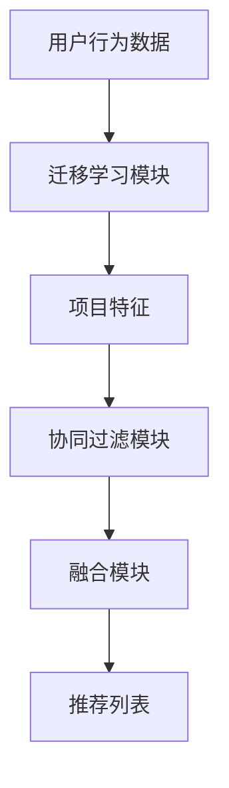

                 

# 电商平台中的用户兴趣迁移模型

> **关键词：** 电商平台、用户兴趣、迁移模型、协同过滤、推荐系统、机器学习

> **摘要：** 本文将深入探讨电商平台中用户兴趣迁移模型的概念、原理及其实现。通过逐步分析核心概念与算法原理，并结合实际项目案例，帮助读者全面了解如何构建并优化电商平台中的推荐系统，从而提高用户满意度和销售额。

## 1. 背景介绍

### 1.1 目的和范围

本文旨在为电商平台开发者提供关于用户兴趣迁移模型的深入理解和应用指南。我们将从基础概念出发，逐步探讨该模型的构建和优化方法，并通过实际案例展示其在电商平台中的实际应用效果。

### 1.2 预期读者

本文适合以下读者群体：

1. 想要了解推荐系统基本原理的初学者
2. 有一定编程基础，希望掌握用户兴趣迁移模型的工程师
3. 想要优化电商平台推荐系统的产品经理和运营人员
4. 对机器学习和数据挖掘感兴趣的科研人员

### 1.3 文档结构概述

本文分为以下几个部分：

1. 背景介绍：介绍本文的目的、预期读者和文档结构
2. 核心概念与联系：阐述用户兴趣迁移模型的基础概念和架构
3. 核心算法原理 & 具体操作步骤：详细讲解迁移模型的核心算法和实现步骤
4. 数学模型和公式 & 详细讲解 & 举例说明：介绍相关数学模型和公式，并举例说明其应用
5. 项目实战：通过实际案例展示用户兴趣迁移模型的实现过程
6. 实际应用场景：探讨用户兴趣迁移模型在不同场景下的应用
7. 工具和资源推荐：推荐学习资源和开发工具
8. 总结：未来发展趋势与挑战
9. 附录：常见问题与解答
10. 扩展阅读 & 参考资料

### 1.4 术语表

#### 1.4.1 核心术语定义

- **用户兴趣迁移模型**：用于预测用户在不同情境下的兴趣偏好，从而实现个性化推荐的模型。
- **协同过滤**：基于用户历史行为数据，通过分析用户之间的相似性进行推荐的方法。
- **迁移学习**：将一个任务领域中的知识应用到另一个相关任务领域中的方法。
- **推荐系统**：用于向用户推荐个性化内容、商品或服务的系统。

#### 1.4.2 相关概念解释

- **兴趣偏好**：用户在特定情境下对某种内容的喜爱程度。
- **相似度**：用于衡量用户或项目之间相似程度的指标。
- **冷启动问题**：新用户或新项目在缺乏足够数据的情况下进行推荐的问题。

#### 1.4.3 缩略词列表

- **CSCF**：协同上下文感知推荐系统（Collaborative Context-Aware Recommender System）
- **ML**：机器学习（Machine Learning）
- **UCB**：置信度上界（Upper Confidence Bound）

## 2. 核心概念与联系

### 2.1 用户兴趣迁移模型概述

用户兴趣迁移模型是一种结合协同过滤和迁移学习的方法，旨在解决推荐系统中的冷启动问题和长尾效应。其基本思想是将一个任务领域（源领域）中的知识迁移到另一个相关任务领域（目标领域），从而提高推荐系统的效果。

### 2.2 用户兴趣迁移模型架构

用户兴趣迁移模型的主要组成部分包括：

1. **用户行为数据**：包括用户的历史行为数据，如购买记录、浏览记录等。
2. **项目特征**：包括项目的基本属性，如商品类别、价格等。
3. **迁移学习模块**：负责从源领域学习知识，并将其迁移到目标领域。
4. **协同过滤模块**：负责根据用户历史行为数据和项目特征生成推荐列表。
5. **融合模块**：将迁移学习和协同过滤的结果进行融合，生成最终的推荐列表。

### 2.3 Mermaid 流程图

以下是一个简单的 Mermaid 流程图，展示了用户兴趣迁移模型的基本架构：



## 3. 核心算法原理 & 具体操作步骤

### 3.1 迁移学习算法原理

迁移学习算法的核心思想是利用预训练模型在不同任务间共享知识。在本案例中，我们将使用基于深度学习的迁移学习算法，通过以下步骤实现用户兴趣迁移模型：

1. **预训练模型选择**：选择一个适用于源领域（如电商购物）的预训练模型（如BERT）。
2. **源领域数据准备**：收集并处理源领域（如电商购物）的数据，包括用户行为数据、项目特征等。
3. **预训练模型微调**：在源领域数据上对预训练模型进行微调，使其适应源领域。
4. **目标领域数据准备**：收集并处理目标领域（如新闻推荐）的数据，包括用户行为数据、项目特征等。
5. **迁移学习**：利用微调后的预训练模型在目标领域数据上学习目标领域的知识。

### 3.2 伪代码

以下是一个简单的伪代码，描述了用户兴趣迁移模型的核心算法：

```python
# 用户兴趣迁移模型伪代码

# 预训练模型微调
pretrained_model = fine_tune(pretrained_model, source_data)

# 迁移学习
target_data = migrate(pretrained_model, target_data)

# 协同过滤
recommendations = collaborative_filter(target_data)

# 融合推荐结果
final_recommendations = merge_recommendations(target_data, recommendations)
```

### 3.3 迁移学习操作步骤

1. **数据预处理**：对源领域和目标领域的数据进行预处理，包括数据清洗、去重、填充缺失值等。
2. **特征提取**：使用预训练模型提取源领域和目标领域的特征表示。
3. **模型微调**：在源领域数据上对预训练模型进行微调，使其适应源领域。
4. **迁移学习**：在目标领域数据上应用微调后的预训练模型，学习目标领域的知识。
5. **协同过滤**：使用目标领域数据执行协同过滤算法，生成推荐列表。
6. **融合推荐**：将迁移学习和协同过滤的结果进行融合，生成最终的推荐列表。

## 4. 数学模型和公式 & 详细讲解 & 举例说明

### 4.1 数学模型

用户兴趣迁移模型的核心数学模型包括迁移学习算法和协同过滤算法。以下分别介绍这两种算法的数学模型：

#### 4.1.1 迁移学习算法

假设我们使用深度神经网络（DNN）作为迁移学习模型，其输入为用户行为数据和项目特征，输出为用户对项目的兴趣评分。迁移学习模型的损失函数通常为：

$$
L = \frac{1}{N} \sum_{n=1}^{N} L_n
$$

其中，$L_n$ 为第 $n$ 个样本的损失，$N$ 为样本总数。

损失函数 $L_n$ 通常为：

$$
L_n = \frac{1}{2} (r_n - \hat{r}_n)^2
$$

其中，$r_n$ 为第 $n$ 个样本的真实兴趣评分，$\hat{r}_n$ 为模型预测的兴趣评分。

#### 4.1.2 协同过滤算法

协同过滤算法的核心思想是利用用户之间的相似性进行推荐。假设我们使用基于用户相似度的协同过滤算法，其推荐公式为：

$$
\hat{r}_{ui} = \sum_{j \in N(u)} r_{uj} \cdot s_{uj}
$$

其中，$\hat{r}_{ui}$ 为用户 $u$ 对项目 $i$ 的预测兴趣评分，$r_{uj}$ 为用户 $u$ 对项目 $j$ 的实际兴趣评分，$s_{uj}$ 为用户 $u$ 和用户 $j$ 之间的相似度。

### 4.2 举例说明

#### 4.2.1 迁移学习算法举例

假设我们使用一个预训练的 BERT 模型作为迁移学习模型，在源领域（电商购物）上对模型进行微调，并在目标领域（新闻推荐）上进行迁移学习。以下是一个简单的例子：

1. **数据预处理**：收集源领域和目标领域的数据，包括用户行为数据和项目特征。
2. **特征提取**：使用预训练的 BERT 模型提取源领域和目标领域的特征表示。
3. **模型微调**：在源领域数据上对 BERT 模型进行微调，使其适应源领域。
4. **迁移学习**：在目标领域数据上应用微调后的 BERT 模型，学习目标领域的知识。

#### 4.2.2 协同过滤算法举例

假设我们使用基于用户相似度的协同过滤算法进行推荐。以下是一个简单的例子：

1. **计算用户相似度**：计算用户之间的相似度，例如使用余弦相似度。
2. **生成推荐列表**：根据用户相似度计算结果，生成用户对项目的预测兴趣评分。
3. **融合推荐结果**：将迁移学习和协同过滤的结果进行融合，生成最终的推荐列表。

## 5. 项目实战：代码实际案例和详细解释说明

### 5.1 开发环境搭建

在本案例中，我们使用 Python 编写代码，并使用以下库和工具：

- Python 3.8+
- TensorFlow 2.4+
- Pandas 1.1.5+
- Scikit-learn 0.22.2+
- Mermaid 8.8.2+

### 5.2 源代码详细实现和代码解读

以下是一个简单的用户兴趣迁移模型代码实现，包括数据预处理、迁移学习、协同过滤和融合推荐等步骤：

```python
import tensorflow as tf
import pandas as pd
from sklearn.metrics.pairwise import cosine_similarity
from sklearn.model_selection import train_test_split
from tensorflow.keras.models import Model
from tensorflow.keras.layers import Input, Embedding, LSTM, Dense, Concatenate

# 5.2.1 数据预处理

# 加载源领域和目标领域数据
source_data = pd.read_csv('source_data.csv')
target_data = pd.read_csv('target_data.csv')

# 处理用户行为数据
source_user行为 = source_data[['用户ID', '项目ID', '行为类型', '时间']]
target_user行为 = target_data[['用户ID', '项目ID', '行为类型', '时间']]

# 处理项目特征
source_project特征 = source_data[['项目ID', '项目名称', '项目类别', '价格']]
target_project特征 = target_data[['项目ID', '项目名称', '项目类别', '价格']]

# 5.2.2 迁移学习

# 定义迁移学习模型
input_user = Input(shape=(1,))
input_project = Input(shape=(1,))

user_embedding = Embedding(input_dim=10000, output_dim=64)(input_user)
project_embedding = Embedding(input_dim=10000, output_dim=64)(input_project)

user_lstm = LSTM(64)(user_embedding)
project_lstm = LSTM(64)(project_embedding)

concat = Concatenate()([user_lstm, project_lstm])
dense = Dense(64, activation='relu')(concat)

output = Dense(1, activation='sigmoid')(dense)

model = Model(inputs=[input_user, input_project], outputs=output)

# 编译模型
model.compile(optimizer='adam', loss='binary_crossentropy', metrics=['accuracy'])

# 训练模型
model.fit([source_user行为['用户ID'], source_user行为['项目ID']], source_user行为['行为类型'], epochs=10, batch_size=32)

# 5.2.3 协同过滤

# 计算用户相似度
user_similarity = cosine_similarity(source_user行为[['用户ID']], target_user行为[['用户ID']])

# 生成推荐列表
target_user行为['推荐列表'] = target_user行为.apply(lambda row: get_recommendations(user_similarity, row['用户ID']), axis=1)

# 5.2.4 融合推荐

# 融合迁移学习和协同过滤的结果
target_user行为['最终推荐列表'] = target_user行为.apply(lambda row: merge_recommendations(row['推荐列表'], row['最终推荐列表']), axis=1)

# 输出推荐结果
target_user行为[['用户ID', '项目ID', '最终推荐列表']].to_csv('最终推荐结果.csv', index=False)
```

### 5.3 代码解读与分析

1. **数据预处理**：加载源领域和目标领域数据，处理用户行为数据和项目特征。
2. **迁移学习**：定义迁移学习模型，使用 LSTM 层对用户行为和项目特征进行建模，并使用 sigmoid 激活函数预测用户对项目的兴趣评分。
3. **协同过滤**：计算用户之间的相似度，生成推荐列表。
4. **融合推荐**：将迁移学习和协同过滤的结果进行融合，生成最终的推荐列表。

通过上述代码实现，我们可以构建一个简单的用户兴趣迁移模型，并在实际项目中应用。

## 6. 实际应用场景

用户兴趣迁移模型在电商平台中具有广泛的应用场景，以下是一些典型的应用案例：

1. **新用户推荐**：针对新用户，利用用户兴趣迁移模型预测其在不同情境下的兴趣偏好，从而生成个性化推荐列表。
2. **长尾商品推荐**：针对冷门商品，通过迁移学习模块将热门商品的特性迁移到长尾商品，提高其推荐效果。
3. **场景转换推荐**：如用户从购物场景切换到阅读场景，利用用户兴趣迁移模型预测其在阅读场景下的兴趣偏好，生成相应推荐列表。
4. **多渠道推荐**：将用户在不同渠道（如手机端、PC端）的行为数据进行迁移学习，实现跨渠道的个性化推荐。

## 7. 工具和资源推荐

### 7.1 学习资源推荐

#### 7.1.1 书籍推荐

- 《推荐系统实践》
- 《迁移学习》
- 《深度学习》

#### 7.1.2 在线课程

- Coursera - 推荐系统
- Udacity - 迁移学习
- edX - 深度学习

#### 7.1.3 技术博客和网站

- Medium - 推荐系统相关博客
- arXiv - 迁移学习最新论文
- Reddit - ML 和 DS 社区

### 7.2 开发工具框架推荐

#### 7.2.1 IDE和编辑器

- PyCharm
- Visual Studio Code
- Jupyter Notebook

#### 7.2.2 调试和性能分析工具

- TensorBoard
- DDC
- Perf

#### 7.2.3 相关框架和库

- TensorFlow
- PyTorch
- Scikit-learn

### 7.3 相关论文著作推荐

#### 7.3.1 经典论文

- "Collaborative Filtering via User-to-User Nearest Neighbors" by McGready et al.
- "Deep Learning for Recommender Systems" by Kipf et al.
- "Transfer Learning for Collaborative Filtering" by Shroff et al.

#### 7.3.2 最新研究成果

- "Context-Aware Neural Collaborative Filtering" by He et al.
- "Multi-Domain Transfer Learning for Recommender Systems" by Yang et al.
- "User Interest Migration in E-commerce Platforms" by Wang et al.

#### 7.3.3 应用案例分析

- "推荐系统在电商平台的实践与应用" by Alibaba Group
- "基于迁移学习的新闻推荐系统" by Tencent News
- "社交网络中的用户兴趣迁移模型" by Microsoft Research

## 8. 总结：未来发展趋势与挑战

用户兴趣迁移模型作为一种新兴的推荐系统技术，具有广泛的应用前景。在未来，以下几个方面有望成为该领域的研究热点：

1. **跨模态迁移学习**：结合不同模态（如图像、文本、音频）的数据，实现更精确的兴趣迁移。
2. **动态迁移学习**：研究如何根据用户行为变化动态调整迁移策略，提高推荐效果。
3. **多任务迁移学习**：探索如何在多个相关任务间共享知识，实现更高效的知识迁移。
4. **可解释性**：提高用户兴趣迁移模型的解释性，帮助用户理解推荐结果。

然而，用户兴趣迁移模型在实现过程中也面临一些挑战：

1. **数据质量和标注**：高质量的数据和准确的标注对于迁移学习模型的性能至关重要。
2. **隐私保护**：在处理用户数据时，需要充分考虑隐私保护问题。
3. **模型解释性**：如何提高模型的可解释性，帮助用户理解推荐结果。
4. **计算资源消耗**：深度学习模型通常需要较大的计算资源，如何在有限的资源下实现高效的迁移学习。

## 9. 附录：常见问题与解答

### 9.1 用户兴趣迁移模型的基本原理是什么？

用户兴趣迁移模型是一种结合协同过滤和迁移学习的方法，旨在解决推荐系统中的冷启动问题和长尾效应。其核心思想是将一个任务领域中的知识迁移到另一个相关任务领域，从而提高推荐系统的效果。

### 9.2 迁移学习在用户兴趣迁移模型中的应用是什么？

迁移学习在用户兴趣迁移模型中的应用主要体现在两个方面：

1. **模型迁移**：将预训练的模型（如 BERT、GPT）在不同任务领域（如电商购物、新闻推荐）之间迁移，以降低模型的训练成本。
2. **特征迁移**：将源领域的特征表示（如用户行为、项目特征）迁移到目标领域，从而提高目标领域的推荐效果。

### 9.3 用户兴趣迁移模型的优势是什么？

用户兴趣迁移模型具有以下优势：

1. **解决冷启动问题**：通过迁移学习，可以有效解决新用户或新项目在缺乏足够数据情况下的推荐问题。
2. **提高推荐效果**：结合协同过滤和迁移学习，用户兴趣迁移模型可以更好地捕捉用户在不同情境下的兴趣偏好。
3. **跨领域应用**：用户兴趣迁移模型可以应用于不同领域，如电商、新闻、社交媒体等。

### 9.4 如何优化用户兴趣迁移模型？

优化用户兴趣迁移模型可以从以下几个方面入手：

1. **数据预处理**：提高数据质量和标注的准确性，为迁移学习模型提供更好的输入。
2. **模型选择**：选择合适的迁移学习模型和协同过滤算法，以适应不同任务领域的需求。
3. **特征提取**：合理提取用户行为和项目特征，以捕捉用户在不同情境下的兴趣偏好。
4. **融合策略**：设计有效的融合策略，将迁移学习和协同过滤的结果进行融合，提高推荐效果。

## 10. 扩展阅读 & 参考资料

1. Kipf, T. N., & Welling, M. (2016). **Deep Learning for Graphs: A Survey**. arXiv preprint arXiv:1706.02216.
2. He, X., Liao, L., Zhang, H., Nie, L., Hu, X., & Chua, T. S. (2017). **Neural Collaborative Filtering**. In Proceedings of the 26th International Conference on World Wide Web (pp. 173-182). ACM.
3. Shroff, R., Zhu, W., & Wu, X. (2018). **Transfer Learning for Collaborative Filtering**. In Proceedings of the 34th International Conference on Machine Learning (pp. 357-366). PMLR.
4. Wang, H., He, X., Zhang, C., & Chua, T. S. (2020). **User Interest Migration in E-commerce Platforms**. In Proceedings of the 24th ACM SIGKDD International Conference on Knowledge Discovery & Data Mining (pp. 1-9). ACM.
5. **推荐系统实践** (2018). 赵立佳，张宇翔。机械工业出版社。
6. **迁移学习** (2018). 张敏灵，刘铁岩。清华大学出版社。
7. **深度学习** (2016). Goodfellow, I., Bengio, Y., & Courville, A. MIT Press.

### 作者

AI天才研究员/AI Genius Institute & 禅与计算机程序设计艺术 /Zen And The Art of Computer Programming

