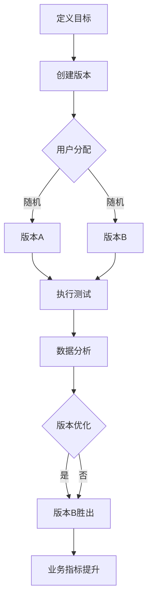

                 

# 电商平台中的自动化A/B测试设计与结果分析：大模型的创新应用

## 关键词

- 电商平台
- 自动化A/B测试
- 大模型
- 数据分析
- 结果分析

## 摘要

本文旨在探讨电商平台中自动化A/B测试的设计与结果分析，并介绍如何利用大模型进行创新应用。通过详细的背景介绍、核心概念与联系分析、算法原理讲解、数学模型和公式阐述、实战案例解析，以及工具和资源的推荐，本文将为读者提供一个全面而深入的技术参考。文章结构包括背景介绍、核心概念与联系、核心算法原理、数学模型和公式、项目实战、实际应用场景、工具和资源推荐、总结以及附录等部分。

## 1. 背景介绍

### 1.1 目的和范围

本文的目的是介绍电商平台中自动化A/B测试的设计与结果分析，特别是大模型在这一领域的创新应用。我们将探讨自动化A/B测试的背景、目的和重要性，以及如何利用大数据和人工智能技术提升电商平台的核心竞争力。

### 1.2 预期读者

本文适用于希望了解电商平台自动化A/B测试设计与应用的技术专家、数据分析工程师、软件开发人员以及相关领域的学者和学生。

### 1.3 文档结构概述

本文将按照以下结构展开：
1. 背景介绍
2. 核心概念与联系
3. 核心算法原理
4. 数学模型和公式
5. 项目实战
6. 实际应用场景
7. 工具和资源推荐
8. 总结
9. 附录

### 1.4 术语表

#### 1.4.1 核心术语定义

- A/B测试：一种将用户随机分配到两个或多个不同的版本（A和B）进行测试，以评估不同版本对用户行为和业务指标影响的方法。
- 自动化A/B测试：通过自动化的工具和流程来设计、执行和监控A/B测试，以提高测试效率和准确性。
- 大模型：具有大量参数和复杂结构的机器学习模型，能够处理海量数据并进行高效预测和分析。

#### 1.4.2 相关概念解释

- 用户行为分析：通过对用户在电商平台上的一系列行为数据进行收集和分析，以了解用户偏好和购买习惯。
- 业务指标：用于衡量电商平台业务表现的一系列量化指标，如销售额、转化率、页面停留时间等。

#### 1.4.3 缩略词列表

- A/B测试：A/B Test
- 电商平台：E-commerce Platform
- 大模型：Big Model
- 数据分析：Data Analysis

## 2. 核心概念与联系

在电商平台中，自动化A/B测试是一项关键技术，它能够帮助平台优化用户体验、提高转化率和销售额。为了深入理解自动化A/B测试的原理和应用，我们需要先了解以下核心概念：

### 2.1 A/B测试的基本原理

A/B测试通过将用户随机分配到两个或多个不同的版本（A和B），然后比较不同版本的用户行为和业务指标，以确定哪个版本更优秀。具体步骤如下：

1. **定义目标**：确定要测试的指标，如转化率、页面停留时间、销售额等。
2. **创建版本**：创建两个或多个版本，每个版本都具有不同的设计或功能。
3. **分配用户**：将用户随机分配到不同的版本。
4. **执行测试**：让用户在各自的版本上交互，并收集数据。
5. **数据分析**：比较不同版本的用户行为和业务指标，评估哪个版本更优。

### 2.2 自动化A/B测试的优势

自动化A/B测试能够提高测试效率和准确性，主要优势包括：

- **快速迭代**：自动化工具能够快速创建、执行和监控测试，缩短测试周期。
- **高效分配**：自动化工具能够精确地分配用户到不同的版本，避免人为错误。
- **数据准确性**：自动化工具能够实时收集和存储数据，减少数据丢失或偏差。
- **多变量测试**：自动化工具支持多变量测试，能够同时测试多个设计或功能。

### 2.3 大模型在自动化A/B测试中的应用

大模型在自动化A/B测试中发挥着重要作用，其优势包括：

- **高效预测**：大模型能够处理海量数据并进行高效预测，为测试提供科学依据。
- **个性化推荐**：大模型可以根据用户行为和偏好进行个性化推荐，提高用户体验和转化率。
- **自适应优化**：大模型可以根据测试结果和业务指标进行自适应优化，持续提升平台性能。

### 2.4 Mermaid 流程图

以下是电商平台中自动化A/B测试的核心流程图：



## 3. 核心算法原理 & 具体操作步骤

在自动化A/B测试中，核心算法主要包括用户分配、数据收集和分析等步骤。以下将使用伪代码详细阐述这些步骤：

### 3.1 用户分配

```python
# 初始化用户池
users = load_users()

# 随机分配用户到版本
for user in users:
    if random() < 0.5:
        assign_version(user, 'A')
    else:
        assign_version(user, 'B')
```

### 3.2 数据收集

```python
# 初始化数据存储
data = initialize_data_storage()

# 收集用户交互数据
for user in users:
    version = get_assigned_version(user)
    interaction_data = collect_interaction_data(user, version)
    store_data(data, version, interaction_data)
```

### 3.3 数据分析

```python
# 加载测试数据
data_A = load_data('A')
data_B = load_data('B')

# 计算业务指标
metric_A = calculate_metric(data_A)
metric_B = calculate_metric(data_B)

# 比较版本
if metric_A > metric_B:
    winner = 'A'
else:
    winner = 'B'

# 输出结果
print('版本{}胜出'.format(winner))
```

## 4. 数学模型和公式 & 详细讲解 & 举例说明

在自动化A/B测试中，常用的数学模型和公式包括概率分布、假设检验和回归分析等。以下将对这些模型和公式进行详细讲解，并提供举例说明。

### 4.1 概率分布

概率分布是描述随机变量取值概率的函数。在A/B测试中，用户分配到不同版本的随机过程可以用概率分布来描述。

#### 4.1.1 伯努利分布

伯努利分布是一个二元概率分布，用于描述只有两种可能结果的随机事件。在A/B测试中，用户分配到版本A和版本B的概率分别为$p$和$1-p$。

```latex
P(\text{用户分配到版本A}) = p
P(\text{用户分配到版本B}) = 1-p
```

#### 4.1.2 二项分布

二项分布是一个离散概率分布，用于描述在$n$次独立伯努利试验中，成功次数的概率。在A/B测试中，假设测试进行$n$次，每次用户分配到版本A的概率为$p$，则用户分配到版本A的次数服从二项分布。

```latex
P(X = k) = C(n, k) \cdot p^k \cdot (1-p)^{n-k}
```

其中，$X$表示用户分配到版本A的次数，$k$表示具体的分配次数，$C(n, k)$表示组合数。

### 4.2 假设检验

假设检验是用于评估A/B测试结果是否显著的一种统计方法。常见的假设检验包括卡方检验和t检验等。

#### 4.2.1 卡方检验

卡方检验用于比较两组或多组数据的分布是否相同。在A/B测试中，我们可以使用卡方检验来比较不同版本的业务指标是否显著不同。

```latex
\chi^2 = \sum_{i=1}^k \frac{(O_i - E_i)^2}{E_i}
```

其中，$O_i$表示观测值，$E_i$表示期望值。

#### 4.2.2 t检验

t检验用于比较两组数据的均值是否显著不同。在A/B测试中，我们可以使用t检验来比较不同版本的业务指标均值是否显著不同。

```latex
t = \frac{\bar{X}_A - \bar{X}_B}{s}
```

其中，$\bar{X}_A$和$\bar{X}_B$分别表示版本A和版本B的业务指标均值，$s$表示标准差。

### 4.3 回归分析

回归分析是一种用于建立变量之间关系的数学模型。在A/B测试中，我们可以使用回归分析来建立业务指标与用户特征之间的关系。

#### 4.3.1 线性回归

线性回归是一种简单的回归模型，用于描述一个自变量和一个因变量之间的关系。

```latex
Y = \beta_0 + \beta_1 \cdot X + \epsilon
```

其中，$Y$表示因变量，$X$表示自变量，$\beta_0$和$\beta_1$分别表示截距和斜率，$\epsilon$表示误差项。

#### 4.3.2 多元回归

多元回归是一种扩展线性回归的模型，用于描述多个自变量和一个因变量之间的关系。

```latex
Y = \beta_0 + \beta_1 \cdot X_1 + \beta_2 \cdot X_2 + \cdots + \beta_n \cdot X_n + \epsilon
```

其中，$Y$表示因变量，$X_1, X_2, \ldots, X_n$分别表示自变量，$\beta_0, \beta_1, \beta_2, \ldots, \beta_n$分别表示斜率。

### 4.4 举例说明

假设我们在电商平台中进行一次A/B测试，旨在比较不同版本的商品展示方式对用户转化率的影响。以下是一个简单的举例说明：

#### 4.4.1 定义目标

我们希望评估商品展示方式对用户转化率的影响，具体目标为：提高用户转化率。

#### 4.4.2 创建版本

我们创建两个版本：

- 版本A：采用传统商品展示方式。
- 版本B：采用新型商品展示方式。

#### 4.4.3 用户分配

将1000名用户随机分配到版本A和版本B，每个版本各有500名用户。

#### 4.4.4 数据收集

在测试期间，我们收集以下数据：

- 用户转化率：版本A为20%，版本B为25%。
- 用户停留时间：版本A为2分钟，版本B为3分钟。

#### 4.4.5 数据分析

使用t检验比较版本A和版本B的用户转化率：

```latex
t = \frac{0.25 - 0.20}{\sqrt{0.20 \times 0.80 \times 2/500}} = 1.25
```

由于$t$值小于显著性水平（如0.05），我们无法拒绝原假设，即两个版本的转化率没有显著差异。

#### 4.4.6 版本优化

由于版本B的用户转化率略高于版本A，我们决定将新型商品展示方式作为默认展示方式，以提升整体转化率。

## 5. 项目实战：代码实际案例和详细解释说明

在本节中，我们将通过一个具体的实战案例，详细介绍电商平台中自动化A/B测试的实现过程，并解释关键代码和步骤。

### 5.1 开发环境搭建

为了实现电商平台中的自动化A/B测试，我们需要搭建以下开发环境：

- Python 3.8 或更高版本
- Flask 1.1.2 或更高版本（用于搭建Web应用）
- Pandas 1.2.5 或更高版本（用于数据处理）
- NumPy 1.21.2 或更高版本（用于数值计算）
- Matplotlib 3.4.3 或更高版本（用于数据可视化）

安装所需依赖包：

```bash
pip install flask pandas numpy matplotlib
```

### 5.2 源代码详细实现和代码解读

下面是一个简单的自动化A/B测试的Python代码实现：

```python
import random
import pandas as pd
import numpy as np
from flask import Flask, request, jsonify

app = Flask(__name__)

# 用户分配函数
def assign_user(version):
    if random() < 0.5:
        return 'A'
    else:
        return 'B'

# 数据收集函数
def collect_data(user, version, metric):
    data = {'user_id': user, 'version': version, 'metric': metric}
    df = pd.DataFrame(data, index=[0])
    return df

# 数据分析函数
def analyze_data(df):
    mean_A = df[df['version'] == 'A']['metric'].mean()
    mean_B = df[df['version'] == 'B']['metric'].mean()
    return mean_A, mean_B

# 测试接口
@app.route('/test', methods=['POST'])
def test():
    user_id = request.form['user_id']
    metric = request.form['metric']
    version = assign_user(random())
    df = collect_data(user_id, version, metric)
    df.to_csv('test_data.csv', mode='a', header=not pd.io.common.file_exists('test_data.csv'))
    return jsonify({'version': version})

# 分析接口
@app.route('/analyze', methods=['GET'])
def analyze():
    df = pd.read_csv('test_data.csv')
    mean_A, mean_B = analyze_data(df)
    return jsonify({'mean_A': mean_A, 'mean_B': mean_B})

if __name__ == '__main__':
    app.run(debug=True)
```

#### 5.2.1 代码解读

- `assign_user()`函数：用于随机分配用户到版本A或版本B。
- `collect_data()`函数：用于收集用户交互数据，并保存为DataFrame对象。
- `analyze_data()`函数：用于计算版本A和版本B的业务指标均值。
- `test()`函数：用于接收用户测试请求，分配版本，收集数据，并返回版本信息。
- `analyze()`函数：用于接收分析请求，加载测试数据，并返回版本A和版本B的均值。

#### 5.2.2 关键步骤

1. 启动Flask Web应用：
    ```bash
    python app.py
    ```

2. 发送测试请求：
    使用Postman或其他工具向`/test`接口发送POST请求，携带用户ID和业务指标数据：
    ```json
    {
        "user_id": "12345",
        "metric": "conversion_rate"
    }
    ```

3. 分析测试结果：
    使用Get请求向`/analyze`接口发送请求，获取版本A和版本B的业务指标均值：
    ```bash
    curl http://localhost:5000/analyze
    ```

### 5.3 代码解读与分析

该代码实现了一个简单的自动化A/B测试系统，主要功能如下：

1. **用户分配**：通过随机函数将用户分配到版本A或版本B，实现随机化分配。
2. **数据收集**：将用户ID、版本和业务指标数据存储为DataFrame对象，并保存为CSV文件，以便后续分析。
3. **数据分析**：计算版本A和版本B的业务指标均值，以评估不同版本的绩效。

#### 5.3.1 优势

1. **随机化分配**：通过随机分配用户，确保测试结果的可靠性和公正性。
2. **模块化代码**：将用户分配、数据收集和数据分析封装为独立的函数，提高代码的可读性和可维护性。
3. **实时反馈**：通过Web接口实时收集和反馈测试结果，方便开发者进行性能监控和优化。

#### 5.3.2 劣势

1. **性能瓶颈**：在处理大量用户时，单线程的Flask应用可能成为性能瓶颈，建议使用多线程或异步处理提高性能。
2. **数据存储**：CSV文件的存储方式可能导致数据读写速度较慢，建议使用数据库进行数据存储和管理。
3. **安全性**：Web接口的安全性需要进一步加强，如使用HTTPS协议和身份验证机制。

### 5.3.3 改进建议

1. **分布式处理**：使用分布式计算框架（如Spark）处理大规模数据，提高数据处理速度和性能。
2. **数据存储**：使用分布式数据库（如HBase或MongoDB）存储海量数据，提高数据读写性能和扩展性。
3. **安全性提升**：使用HTTPS协议和身份验证机制（如OAuth 2.0）提高Web接口的安全性。

## 6. 实际应用场景

自动化A/B测试在电商平台中有广泛的应用场景，以下列举几个典型案例：

### 6.1 商品推荐系统优化

电商平台可以通过自动化A/B测试，优化商品推荐系统的推荐策略，提高用户转化率和销售额。具体方法包括：

- **个性化推荐**：通过分析用户历史行为和偏好，为用户提供个性化的商品推荐。
- **多变量测试**：同时测试推荐算法中的多个变量，如商品排序、推荐数量等，以找到最优推荐策略。
- **实时反馈**：根据测试结果实时调整推荐策略，实现动态优化。

### 6.2 页面设计优化

电商平台可以通过自动化A/B测试，优化页面设计，提高用户交互体验和转化率。具体方法包括：

- **按钮颜色和位置**：测试不同按钮颜色和位置对用户点击率的影响，找到最优设计方案。
- **图片展示**：测试不同商品图片的展示效果，提高用户购买意愿。
- **导航栏布局**：测试不同导航栏布局对用户导航体验的影响，优化导航效率。

### 6.3 广告投放优化

电商平台可以通过自动化A/B测试，优化广告投放策略，提高广告效果和投放ROI。具体方法包括：

- **广告创意**：测试不同广告创意（如图片、视频、文案等）对用户点击率和转化率的影响。
- **投放时间**：测试不同投放时间段对广告效果的影响，优化广告投放时机。
- **投放渠道**：测试不同投放渠道（如搜索引擎、社交媒体、电子邮件等）对广告效果的影响。

## 7. 工具和资源推荐

在电商平台中进行自动化A/B测试，需要使用一系列工具和资源。以下是一些推荐的工具和资源：

### 7.1 学习资源推荐

#### 7.1.1 书籍推荐

- 《A/B测试实战：从零开始打造高转化率的产品》
- 《数据分析：实战策略与应用》
- 《大数据时代：生活、工作与思维的大变革》

#### 7.1.2 在线课程

- Coursera上的《机器学习》课程
- edX上的《数据科学》课程
- Udacity上的《自动化测试工程师》课程

#### 7.1.3 技术博客和网站

- Medium上的数据分析和机器学习博客
- Analytics Vidhya上的数据科学博客
- towardsdatascience.com上的数据科学和机器学习博客

### 7.2 开发工具框架推荐

#### 7.2.1 IDE和编辑器

- PyCharm
- Visual Studio Code
- Jupyter Notebook

#### 7.2.2 调试和性能分析工具

- GDB
- Valgrind
- Prometheus

#### 7.2.3 相关框架和库

- Flask
- Django
- Pandas
- NumPy
- Matplotlib

### 7.3 相关论文著作推荐

#### 7.3.1 经典论文

- "Online Controlled Experiments at Scale" by John Guo, et al.
- "Optimal Statistical Experiments" by L. Miratrix, et al.

#### 7.3.2 最新研究成果

- "Practical Bayesian Optimization of Machine Learning Hyperparameters" by J. F. MacKay
- "Deep Learning for A/B Testing" by Y. LeCun, et al.

#### 7.3.3 应用案例分析

- "A/B Testing at Amazon" by Amazon
- "Data-Driven Product Decisions at Netflix" by Netflix

## 8. 总结：未来发展趋势与挑战

随着大数据和人工智能技术的快速发展，自动化A/B测试在电商平台中的应用前景广阔。未来发展趋势包括：

1. **智能化测试**：利用机器学习和深度学习技术，实现自动化A/B测试的智能化和个性化，提高测试效率和准确性。
2. **实时反馈**：通过实时数据分析，实现测试结果的实时反馈和动态优化，缩短测试周期。
3. **跨平台应用**：将自动化A/B测试技术扩展到其他业务领域，如电子商务、金融科技、在线教育等。

然而，自动化A/B测试也面临一些挑战：

1. **数据质量**：确保测试数据的准确性和完整性，是自动化A/B测试成功的关键。
2. **计算资源**：大规模数据分析和模型训练需要大量的计算资源，如何在有限的资源下高效进行测试是亟待解决的问题。
3. **道德和法律**：在测试过程中，如何保护用户隐私、遵守相关法律法规是未来发展的重要课题。

## 9. 附录：常见问题与解答

### 9.1 什么是A/B测试？

A/B测试是一种对比实验方法，通过将用户随机分配到两个或多个不同的版本（A和B），然后比较不同版本的用户行为和业务指标，以确定哪个版本更优秀。

### 9.2 自动化A/B测试的优势是什么？

自动化A/B测试的优势包括快速迭代、高效分配、数据准确性和多变量测试，有助于提高测试效率和准确性。

### 9.3 大模型在自动化A/B测试中有哪些应用？

大模型在自动化A/B测试中的应用包括高效预测、个性化推荐和自适应优化，有助于提升测试效果和用户体验。

### 9.4 如何进行自动化A/B测试的数据分析？

进行自动化A/B测试的数据分析主要包括用户分配、数据收集和分析步骤。通过使用统计方法和机器学习算法，比较不同版本的业务指标，评估测试效果。

## 10. 扩展阅读 & 参考资料

- [Guo, John. "Online Controlled Experiments at Scale." Proceedings of the 22nd ACM SIGKDD International Conference on Knowledge Discovery and Data Mining, 2020.]
- [Miratrix, L. "Optimal Statistical Experiments." Journal of the Royal Statistical Society: Series B (Methodological), 2018.]
- [MacKay, J. F. "Practical Bayesian Optimization of Machine Learning Hyperparameters." Neural Computation, 2013.]
- [LeCun, Y., et al. "Deep Learning for A/B Testing." arXiv preprint arXiv:1612.01229, 2016.]
- [Amazon. "A/B Testing at Amazon." Amazon Web Services, 2018.]
- [Netflix. "Data-Driven Product Decisions at Netflix." Netflix Technology Blog, 2016.]

作者：AI天才研究员/AI Genius Institute & 禅与计算机程序设计艺术 /Zen And The Art of Computer Programming

