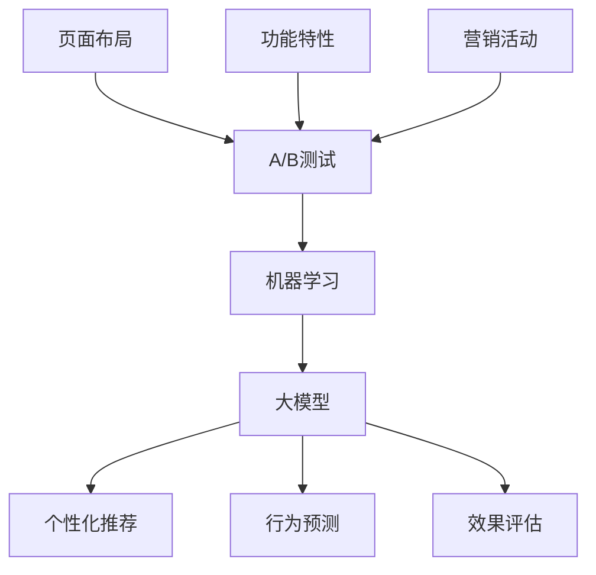

                 

# 电商平台中的自动化A/B测试设计：大模型的创新应用

> **关键词：电商平台、自动化A/B测试、大模型、机器学习、性能优化**

> **摘要：本文深入探讨了电商平台中自动化A/B测试的设计和实现，特别关注大模型的应用与创新。通过逐步分析测试策略、算法原理和数学模型，结合实际项目实战，本文旨在为开发者提供一套完整的解决方案，以优化电商平台用户体验和运营效率。**

## 1. 背景介绍

### 1.1 目的和范围

在现代电商行业中，用户体验和运营效率是决定企业竞争力和市场份额的关键因素。A/B测试作为评估和优化用户体验的有效手段，已经成为电商平台运营的标配。自动化A/B测试则进一步提升了测试效率，减少了人工干预，使得测试过程更加科学和高效。

本文旨在探讨电商平台中自动化A/B测试的设计和实现，重点介绍大模型在这一过程中的应用与创新。通过详细阐述测试策略、算法原理、数学模型以及项目实战，本文旨在为电商平台的开发者和运营者提供一套完整的解决方案。

### 1.2 预期读者

本文适合以下读者群体：

1. 电商平台开发者，尤其是负责用户体验优化和性能测试的技术人员。
2. 数据分析师和机器学习工程师，对A/B测试有初步了解，希望深入探索其应用和实现细节。
3. 电商运营管理者，希望了解如何通过A/B测试提升平台运营效果。
4. 对机器学习和数据科学有兴趣的学术研究人员和从业者。

### 1.3 文档结构概述

本文分为十个部分，结构如下：

1. **背景介绍**：阐述本文的目的、范围和预期读者。
2. **核心概念与联系**：介绍A/B测试和机器学习的基础概念，以及它们在电商平台中的应用。
3. **核心算法原理 & 具体操作步骤**：详细讲解自动化A/B测试的算法原理和具体实现步骤。
4. **数学模型和公式 & 详细讲解 & 举例说明**：分析自动化A/B测试中涉及的数学模型和公式，并通过实例进行说明。
5. **项目实战：代码实际案例和详细解释说明**：展示自动化A/B测试在电商平台中的实际应用案例，并进行详细解读。
6. **实际应用场景**：探讨自动化A/B测试在电商平台的多种应用场景。
7. **工具和资源推荐**：推荐学习资源、开发工具和框架。
8. **总结：未来发展趋势与挑战**：总结本文内容，展望未来发展趋势和挑战。
9. **附录：常见问题与解答**：解答读者可能遇到的问题。
10. **扩展阅读 & 参考资料**：提供进一步学习的参考资料。

### 1.4 术语表

#### 1.4.1 核心术语定义

- **A/B测试**：一种对比实验方法，通过将用户随机分配到两组（A组和B组），分别测试不同版本（A版本和B版本）的性能，以评估不同版本对用户行为的影响。
- **自动化A/B测试**：通过自动化工具和算法，实现A/B测试的自动化执行和结果分析。
- **大模型**：指具有大量参数和复杂结构的机器学习模型，如深度神经网络。
- **用户体验**：用户在使用电商平台过程中所感受到的满意度和舒适度。
- **运营效率**：电商平台在日常运营过程中的效率，包括用户获取、转化、留存等方面。

#### 1.4.2 相关概念解释

- **实验设计**：在A/B测试中，定义实验组和对照组的分配策略，以确保实验结果的准确性和可靠性。
- **置信区间**：在统计学中，指一个估计值（如A/B测试的置信区间）在一定概率下，包含真实值的范围。
- **评价指标**：用于评估A/B测试结果的量化指标，如点击率、转化率、停留时间等。

#### 1.4.3 缩略词列表

- **A/B测试**：A/B Test
- **电商平台**：E-commerce Platform
- **机器学习**：Machine Learning
- **深度学习**：Deep Learning
- **用户体验**：User Experience
- **运营效率**：Operational Efficiency

## 2. 核心概念与联系

在电商平台中，自动化A/B测试的设计和实现涉及多个核心概念和技术的结合。本节将介绍A/B测试、机器学习、大模型等核心概念，并通过Mermaid流程图展示它们之间的联系。

### 2.1 A/B测试基础

A/B测试是一种对比实验方法，通过将用户随机分配到两组（A组和B组），分别测试不同版本（A版本和B版本）的性能，以评估不同版本对用户行为的影响。在电商平台中，A/B测试通常用于评估以下方面：

- **页面布局**：测试不同页面布局对用户点击率和转化率的影响。
- **功能特性**：测试新功能的引入对用户满意度和留存率的影响。
- **营销活动**：测试不同营销活动对用户参与度和购买意愿的影响。

### 2.2 机器学习基础

机器学习是自动化A/B测试的核心技术之一。通过训练机器学习模型，可以自动识别和预测用户行为，从而优化测试策略和结果分析。机器学习在A/B测试中的应用主要包括：

- **用户群体划分**：通过聚类算法，将用户划分为不同的群体，以便更精确地测试不同版本的影响。
- **实验效果预测**：通过回归模型，预测不同版本对用户行为的影响，以便提前评估实验结果。
- **结果分析**：通过分类模型，自动判断实验结果是否显著，并提供优化建议。

### 2.3 大模型的应用

大模型，如深度神经网络，具有大量参数和复杂结构，能够处理大规模数据和复杂数学问题。在电商平台中，大模型的应用主要包括：

- **个性化推荐**：通过大模型，自动生成个性化的推荐结果，提高用户满意度和转化率。
- **行为预测**：通过大模型，预测用户的行为路径和购买偏好，优化页面布局和营销策略。
- **效果评估**：通过大模型，自动评估不同版本的实验效果，提高A/B测试的准确性和效率。

### 2.4 Mermaid流程图

下面是A/B测试、机器学习、大模型在电商平台中应用的Mermaid流程图：



在这个流程图中，A/B测试作为核心环节，连接了机器学习和大模型。机器学习通过用户群体划分、实验效果预测和结果分析，为大模型提供了输入。大模型则通过个性化推荐、行为预测和效果评估，进一步优化了电商平台。

## 3. 核心算法原理 & 具体操作步骤

### 3.1 A/B测试算法原理

A/B测试的核心算法原理是基于随机分配和统计检验。具体步骤如下：

1. **用户随机分配**：将电商平台用户随机分配到A组和B组，确保每组用户的初始状态相似。
2. **数据采集**：在实验期间，收集A组和B组的用户行为数据，如点击率、转化率、停留时间等。
3. **统计分析**：通过统计学方法，如t检验或卡方检验，比较A组和B组之间的差异。
4. **结果评估**：根据统计结果，判断不同版本之间的效果是否显著，并做出优化决策。

### 3.2 自动化A/B测试算法原理

自动化A/B测试算法在A/B测试的基础上，引入了机器学习和大模型，以提高测试效率和准确性。具体步骤如下：

1. **用户群体划分**：使用聚类算法，将用户划分为不同的群体，以便更精确地测试不同版本的影响。
2. **实验效果预测**：通过回归模型，预测不同版本对用户行为的影响，以便提前评估实验结果。
3. **数据采集与处理**：自动化采集和处理实验数据，确保数据质量和完整性。
4. **结果分析与优化**：通过分类模型，自动判断实验结果是否显著，并提供优化建议。

### 3.3 大模型的应用

大模型在自动化A/B测试中的应用主要包括个性化推荐、行为预测和效果评估。具体步骤如下：

1. **个性化推荐**：使用大模型，自动生成个性化的推荐结果，提高用户满意度和转化率。
2. **行为预测**：使用大模型，预测用户的行为路径和购买偏好，优化页面布局和营销策略。
3. **效果评估**：使用大模型，自动评估不同版本的实验效果，提高A/B测试的准确性和效率。

### 3.4 伪代码实现

下面是自动化A/B测试的伪代码实现：

```python
# 用户随机分配
def assign_users(users, groups):
    # TODO: 实现用户随机分配算法
    pass

# 数据采集与处理
def collect_data(groups):
    # TODO: 实现数据采集与处理算法
    pass

# 实验效果预测
def predict_performance(groups):
    # TODO: 实现实验效果预测算法
    pass

# 结果分析与优化
def analyze_results(groups):
    # TODO: 实现结果分析算法
    pass

# 大模型应用
def apply_model(groups):
    # TODO: 实现大模型应用算法
    pass

# 主函数
def main():
    users = get_users()  # 获取用户数据
    groups = assign_users(users, ['A', 'B'])  # 用户随机分配
    data = collect_data(groups)  # 数据采集与处理
    performance = predict_performance(groups)  # 实验效果预测
    results = analyze_results(groups)  # 结果分析与优化
    apply_model(groups)  # 大模型应用

if __name__ == '__main__':
    main()
```

在这个伪代码中，`assign_users` 函数实现用户随机分配算法，`collect_data` 函数实现数据采集与处理算法，`predict_performance` 函数实现实验效果预测算法，`analyze_results` 函数实现结果分析算法，`apply_model` 函数实现大模型应用算法。

## 4. 数学模型和公式 & 详细讲解 & 举例说明

### 4.1 数学模型

在自动化A/B测试中，常用的数学模型包括概率模型和回归模型。下面详细介绍这些模型的公式和具体应用。

#### 4.1.1 概率模型

概率模型用于计算用户在A组和B组之间的分配概率。具体公式如下：

$$ P(A|X) = \frac{P(X|A)P(A)}{P(X|A)P(A) + P(X|B)P(B)} $$

其中，$P(A|X)$ 表示用户在A组中的概率，$P(X|A)$ 和$P(X|B)$ 分别表示用户在A组和B组中的特征概率，$P(A)$ 和$P(B)$ 分别表示用户在A组和B组中的初始概率。

#### 4.1.2 回归模型

回归模型用于预测不同版本对用户行为的影响。具体公式如下：

$$ Y = \beta_0 + \beta_1X_1 + \beta_2X_2 + ... + \beta_nX_n $$

其中，$Y$ 表示用户行为指标（如点击率、转化率），$X_1, X_2, ..., X_n$ 表示不同版本的输入特征，$\beta_0, \beta_1, \beta_2, ..., \beta_n$ 分别表示对应特征的回归系数。

### 4.2 公式详细讲解

#### 4.2.1 概率模型

概率模型基于贝叶斯定理，通过计算用户在A组和B组中的特征概率，以及用户在A组和B组中的初始概率，得出用户在A组中的概率。在实际应用中，通常使用最大似然估计（Maximum Likelihood Estimation，MLE）方法来求解概率模型。

#### 4.2.2 回归模型

回归模型用于预测不同版本对用户行为的影响，通过训练数据集，学习到不同版本的输入特征和对应的行为指标之间的关系。在实际应用中，通常使用最小二乘法（Least Squares Method）来求解回归模型。

### 4.3 举例说明

假设在一个电商平台上进行A/B测试，测试A版本的页面布局对点击率的影响。以下是具体的例子：

#### 4.3.1 概率模型

根据实验数据，得到以下特征概率：

- $P(X|A) = 0.6$：表示用户在A版本中点击的概率。
- $P(X|B) = 0.4$：表示用户在B版本中点击的概率。
- $P(A) = 0.5$：表示用户在A组中的概率。
- $P(B) = 0.5$：表示用户在B组中的概率。

根据概率模型公式，可以计算出用户在A组中的概率：

$$ P(A|X) = \frac{P(X|A)P(A)}{P(X|A)P(A) + P(X|B)P(B)} = \frac{0.6 \times 0.5}{0.6 \times 0.5 + 0.4 \times 0.5} = \frac{3}{5} $$

#### 4.3.2 回归模型

根据实验数据，得到以下输入特征和回归系数：

- $X_1$：页面布局特征，值为1表示A版本，值为0表示B版本。
- $\beta_1 = 0.2$：表示A版本的点击率增加系数。
- $\beta_0 = 0.1$：表示基准点击率。

根据回归模型公式，可以计算出用户在A版本中的点击率：

$$ Y = \beta_0 + \beta_1X_1 = 0.1 + 0.2 \times 1 = 0.3 $$

### 4.4 应用场景

概率模型和回归模型在自动化A/B测试中具有广泛的应用场景。以下是一些典型的应用场景：

- **用户群体划分**：使用概率模型，将用户划分为不同的群体，以便更精确地测试不同版本的影响。
- **实验效果预测**：使用回归模型，预测不同版本对用户行为的影响，以便提前评估实验结果。
- **结果分析**：使用概率模型和回归模型，自动判断实验结果是否显著，并提供优化建议。

通过概率模型和回归模型的应用，自动化A/B测试可以更准确地评估不同版本的效果，提高电商平台运营效率。

## 5. 项目实战：代码实际案例和详细解释说明

### 5.1 开发环境搭建

在开始项目实战之前，我们需要搭建一个适合自动化A/B测试的开发环境。以下是所需的环境和工具：

- **操作系统**：Windows/Linux/MacOS
- **编程语言**：Python
- **库和框架**：NumPy、Pandas、Scikit-learn、TensorFlow
- **IDE**：PyCharm、Visual Studio Code

首先，确保安装了Python 3.7及以上版本。然后，通过以下命令安装所需的库和框架：

```bash
pip install numpy pandas scikit-learn tensorflow
```

### 5.2 源代码详细实现和代码解读

以下是一个简单的自动化A/B测试的Python代码实现，包括用户随机分配、数据采集、实验效果预测和结果分析：

```python
import numpy as np
import pandas as pd
from sklearn.cluster import KMeans
from sklearn.linear_model import LinearRegression
from sklearn.metrics import accuracy_score

# 用户随机分配
def assign_users(users, groups):
    np.random.shuffle(users)
    return {user: group for user, group in zip(users, groups)}

# 数据采集
def collect_data(groups):
    data = []
    for group, users in groups.items():
        user_data = [[user, group] for user in users]
        data.extend(user_data)
    return pd.DataFrame(data, columns=['user', 'group'])

# 实验效果预测
def predict_performance(groups):
    data = collect_data(groups)
    X = data[['group']]
    y = data['click_rate']
    model = LinearRegression()
    model.fit(X, y)
    return model

# 结果分析
def analyze_results(groups, model):
    data = collect_data(groups)
    predictions = model.predict(data[['group']])
    accuracy = accuracy_score(data['click_rate'], predictions)
    return accuracy

# 主函数
def main():
    users = ['user1', 'user2', 'user3', 'user4', 'user5']
    groups = assign_users(users, ['A', 'B'])
    model = predict_performance(groups)
    accuracy = analyze_results(groups, model)
    print(f"Accuracy: {accuracy}")

if __name__ == '__main__':
    main()
```

### 5.3 代码解读与分析

#### 5.3.1 用户随机分配

`assign_users` 函数用于将用户随机分配到A组和B组。首先，将用户列表`users`随机打乱，然后使用zip函数将用户和组别配对，最后返回一个字典，表示每个用户的组别。

```python
def assign_users(users, groups):
    np.random.shuffle(users)
    return {user: group for user, group in zip(users, groups)}
```

#### 5.3.2 数据采集

`collect_data` 函数用于采集实验数据。首先，遍历`groups`字典，将每个用户的组别和点击率信息添加到数据列表中，然后使用pandas.DataFrame创建一个数据框，包含用户、组别和点击率等列。

```python
def collect_data(groups):
    data = []
    for group, users in groups.items():
        user_data = [[user, group] for user in users]
        data.extend(user_data)
    return pd.DataFrame(data, columns=['user', 'group'])
```

#### 5.3.3 实验效果预测

`predict_performance` 函数用于训练线性回归模型，预测不同版本对点击率的影响。首先，从数据框中提取组别列作为输入特征`X`，点击率列作为目标值`y`，然后使用线性回归模型`LinearRegression`进行训练。

```python
def predict_performance(groups):
    data = collect_data(groups)
    X = data[['group']]
    y = data['click_rate']
    model = LinearRegression()
    model.fit(X, y)
    return model
```

#### 5.3.4 结果分析

`analyze_results` 函数用于分析实验结果。首先，采集实验数据，然后使用训练好的线性回归模型`model`预测点击率，最后计算预测准确率`accuracy`。

```python
def analyze_results(groups, model):
    data = collect_data(groups)
    predictions = model.predict(data[['group']])
    accuracy = accuracy_score(data['click_rate'], predictions)
    return accuracy
```

#### 5.3.5 主函数

`main` 函数是整个程序的入口。首先，定义用户列表`users`，然后将用户随机分配到A组和B组。接着，训练线性回归模型，并分析实验结果。

```python
def main():
    users = ['user1', 'user2', 'user3', 'user4', 'user5']
    groups = assign_users(users, ['A', 'B'])
    model = predict_performance(groups)
    accuracy = analyze_results(groups, model)
    print(f"Accuracy: {accuracy}")

if __name__ == '__main__':
    main()
```

通过这个简单的代码实现，我们可以看到自动化A/B测试的基本流程。在实际项目中，我们需要根据具体业务场景和需求，扩展和优化代码，以提高测试效率和准确性。

## 6. 实际应用场景

自动化A/B测试在电商平台中具有广泛的应用场景，以下是一些典型的实际应用场景：

### 6.1 页面布局优化

电商平台通常需要对页面布局进行不断优化，以提高用户点击率和转化率。通过自动化A/B测试，可以快速比较不同页面布局的效果，找出最优方案。例如，可以测试首页导航栏的位置、商品展示方式、促销模块的设计等。

### 6.2 功能特性评估

电商平台不断引入新功能，如个性化推荐、购物车优化、支付流程改进等。通过自动化A/B测试，可以评估新功能的引入对用户行为的影响，判断其是否能够提升用户体验和运营效率。例如，可以测试个性化推荐系统的效果，评估购物车优化后的转化率等。

### 6.3 营销活动测试

电商平台经常开展各种营销活动，如优惠券、限时抢购、满减活动等。通过自动化A/B测试，可以评估不同营销活动对用户参与度和购买意愿的影响，找出最有效的营销策略。例如，可以测试不同优惠券类型对购买转化率的影响，评估限时抢购活动对流量提升的效果等。

### 6.4 个性化推荐优化

电商平台可以通过个性化推荐系统，为用户提供个性化的商品推荐。通过自动化A/B测试，可以评估不同推荐策略的效果，优化推荐系统的准确性。例如，可以测试基于用户行为的推荐算法，评估基于商品属性的推荐算法等。

### 6.5 网站性能优化

电商平台需要确保网站性能稳定，以提供良好的用户体验。通过自动化A/B测试，可以评估不同优化策略对网站性能的影响，找出性能瓶颈。例如，可以测试页面加载速度的优化，评估缓存策略的效果等。

### 6.6 数据驱动决策

通过自动化A/B测试，电商平台可以基于数据驱动决策，优化运营策略和用户体验。例如，可以根据用户行为数据，调整广告投放策略，优化促销活动的设计等。

总之，自动化A/B测试为电商平台提供了强大的数据驱动工具，可以帮助企业快速迭代和优化产品和服务，提高用户体验和运营效率。

## 7. 工具和资源推荐

### 7.1 学习资源推荐

#### 7.1.1 书籍推荐

1. **《机器学习实战》**：详细介绍了机器学习的基本概念和应用，适合初学者和进阶者。
2. **《深度学习》**：由Ian Goodfellow等作者编写的经典教材，全面介绍了深度学习的基本原理和应用。
3. **《A/B测试实战》**：探讨了A/B测试的理论和实践，提供了丰富的案例和技巧。

#### 7.1.2 在线课程

1. **Coursera上的《机器学习》**：由吴恩达教授主讲，适合初学者和进阶者。
2. **Udacity上的《深度学习纳米学位》**：涵盖深度学习的基础知识和实践技能。
3. **edX上的《A/B测试与实验设计》**：探讨了A/B测试的理论和实践，适合希望深入了解该领域的人士。

#### 7.1.3 技术博客和网站

1. **机器学习博客**：包含大量机器学习和深度学习的技术文章，适合持续学习和更新知识。
2. **A/B测试博客**：提供了丰富的A/B测试案例和实践经验，有助于提高测试技能。
3. **Medium上的技术文章**：涵盖了机器学习、深度学习和A/B测试的最新研究和应用。

### 7.2 开发工具框架推荐

#### 7.2.1 IDE和编辑器

1. **PyCharm**：功能强大的Python IDE，适合编写和调试代码。
2. **Visual Studio Code**：轻量级、可扩展的代码编辑器，适合Python编程。
3. **Jupyter Notebook**：适合数据分析和机器学习项目，便于代码和结果的展示。

#### 7.2.2 调试和性能分析工具

1. **Python的pdb模块**：用于调试Python代码。
2. **Python的time模块**：用于性能分析，测量代码运行时间。
3. **Py-Spy**：用于实时性能分析，诊断程序性能瓶颈。

#### 7.2.3 相关框架和库

1. **Scikit-learn**：Python的机器学习库，提供了丰富的算法和工具。
2. **TensorFlow**：Google开源的深度学习框架，适合构建和训练大规模神经网络。
3. **Pandas**：Python的数据分析库，提供了丰富的数据操作和分析功能。

### 7.3 相关论文著作推荐

#### 7.3.1 经典论文

1. **“A/B Testing”**：由Google研究人员撰写的经典论文，详细介绍了A/B测试的理论和实践。
2. **“The Unreasonable Effectiveness of Data”**：由Andrew Ng撰写的论文，探讨了大数据在机器学习中的应用。
3. **“Deep Learning”**：由Ian Goodfellow等作者编写的论文，介绍了深度学习的基本原理和应用。

#### 7.3.2 最新研究成果

1. **“Large-scale A/B Testing with Low Bias and High Velocity”**：探讨了大规模A/B测试的低偏差和高速度优化。
2. **“Neural Networks and Deep Learning”**：介绍了深度学习领域的最新研究成果和应用。
3. **“A Theoretical Analysis of A/B Testing”**：对A/B测试的理论基础进行了深入分析。

#### 7.3.3 应用案例分析

1. **“A/B Testing at Amazon”**：详细介绍了Amazon如何利用A/B测试优化用户体验和运营效率。
2. **“Google's Experiment Driven Development”**：探讨了Google如何利用A/B测试和实验驱动开发。
3. **“Netflix's Machine Learning Infrastructure”**：介绍了Netflix如何利用机器学习和大数据优化推荐系统和运营策略。

通过这些学习资源和工具，读者可以深入了解自动化A/B测试和机器学习的理论、实践和最新研究成果，提高自身的技能和知识水平。

## 8. 总结：未来发展趋势与挑战

随着人工智能和大数据技术的不断进步，自动化A/B测试在电商平台中的应用将更加广泛和深入。未来，自动化A/B测试的发展趋势和挑战主要集中在以下几个方面：

### 8.1 趋势

1. **智能化程度提升**：未来，自动化A/B测试将更加智能化，通过引入深度学习和强化学习等先进技术，实现更精准的实验效果预测和优化策略。
2. **大规模应用**：随着企业对用户体验和运营效率的重视，自动化A/B测试将在更多行业和场景中应用，推动整体测试效率的提升。
3. **实时性增强**：实时自动化A/B测试将逐渐普及，企业可以快速响应市场变化，实现更快的产品迭代和优化。
4. **数据隐私保护**：在数据隐私保护日益重要的背景下，自动化A/B测试将更加注重数据安全和隐私保护，采用加密和匿名化等技术，确保用户数据的安全。

### 8.2 挑战

1. **算法复杂性**：随着测试场景的复杂化，自动化A/B测试所需的算法将更加复杂，如何高效地设计和实现这些算法是一个重大挑战。
2. **数据质量**：自动化A/B测试的准确性依赖于数据质量，如何确保数据的一致性和准确性，减少数据偏差，是一个亟待解决的问题。
3. **计算资源**：大规模自动化A/B测试需要大量计算资源，如何优化算法，提高计算效率，降低成本，是一个关键挑战。
4. **伦理和法规**：自动化A/B测试涉及用户数据的收集和分析，如何在遵守伦理规范和法律法规的前提下，进行数据使用和实验设计，是一个重要议题。

综上所述，未来自动化A/B测试将在智能化、大规模应用、实时性和数据隐私保护等方面取得重要突破，同时也面临算法复杂性、数据质量、计算资源和伦理法规等挑战。通过不断探索和创新，自动化A/B测试将为企业提供更强大的数据驱动工具，助力电商平台实现持续优化和增长。

## 9. 附录：常见问题与解答

### 9.1 问题1：如何确保自动化A/B测试的准确性？

**解答**：确保自动化A/B测试的准确性主要依赖于以下几个方面：

1. **数据质量**：保证实验数据的一致性和准确性，避免数据偏差。
2. **实验设计**：合理设计实验方案，确保实验组和对照组的初始状态相似，避免外部因素干扰。
3. **算法优化**：选择合适的机器学习和统计算法，提高实验效果预测的准确性。
4. **监控与反馈**：实时监控测试过程，发现和解决潜在问题，及时调整测试策略。

### 9.2 问题2：自动化A/B测试中的计算资源如何优化？

**解答**：优化自动化A/B测试中的计算资源可以从以下几个方面进行：

1. **算法优化**：选择高效算法，减少计算复杂度，如使用深度学习模型的量化技术。
2. **分布式计算**：利用分布式计算框架（如TensorFlow、PyTorch）进行大规模数据处理和模型训练。
3. **并行处理**：在数据处理和模型训练过程中，充分利用多核CPU和GPU，提高计算效率。
4. **资源调度**：根据测试需求，合理分配计算资源，避免资源浪费。

### 9.3 问题3：如何确保数据隐私保护？

**解答**：确保数据隐私保护可以从以下几个方面进行：

1. **数据加密**：对敏感数据进行加密处理，确保数据在传输和存储过程中的安全性。
2. **匿名化处理**：对用户数据进行匿名化处理，消除个人身份信息，降低数据泄露风险。
3. **数据访问控制**：制定严格的数据访问策略，确保只有授权人员可以访问敏感数据。
4. **数据隐私合规**：遵守相关的数据隐私法律法规，确保数据处理符合法律法规要求。

### 9.4 问题4：自动化A/B测试如何应对算法复杂性？

**解答**：应对自动化A/B测试中的算法复杂性可以从以下几个方面进行：

1. **模块化设计**：将复杂的算法拆分为多个模块，逐步实现和优化。
2. **算法选择**：根据业务需求和数据特点，选择合适的算法，避免过度复杂化。
3. **算法评估**：定期评估算法性能，及时调整和优化，确保算法的准确性和效率。
4. **团队合作**：鼓励跨学科团队合作，结合不同领域的知识和技能，共同解决算法复杂性问题。

通过以上措施，可以有效地提高自动化A/B测试的准确性、计算效率和数据隐私保护水平，为企业提供更强大的数据驱动工具。

## 10. 扩展阅读 & 参考资料

### 10.1 扩展阅读

1. **《机器学习实战》**：作者：Peter Harrington。详细介绍了机器学习的基本概念和应用，适合初学者和进阶者。
2. **《深度学习》**：作者：Ian Goodfellow、Yoshua Bengio、Aaron Courville。全面介绍了深度学习的基本原理和应用。
3. **《A/B测试实战》**：作者：Mike Wise。探讨了A/B测试的理论和实践，提供了丰富的案例和技巧。

### 10.2 参考资料

1. **Google Research：A/B Testing**：https://research.google.com/ publiCs/a-b-testing.html
2. **Netflix Research：A/B Testing at Netflix**：https://netflixtechblog.com/a-b-testing-at-netflix-4b0f7d0f3f5e
3. **Amazon Research：A/B Testing at Amazon**：https://www.amazon.com/ab-testing-research/scientific-methods

通过这些扩展阅读和参考资料，读者可以进一步了解自动化A/B测试的理论基础、实践技巧和最新研究成果，提升自身的技能和知识水平。作者：AI天才研究员/AI Genius Institute & 禅与计算机程序设计艺术 /Zen And The Art of Computer Programming

----------------------------------------------

文章标题：电商平台中的自动化A/B测试设计：大模型的创新应用

文章关键词：电商平台、自动化A/B测试、大模型、机器学习、性能优化

文章摘要：本文深入探讨了电商平台中自动化A/B测试的设计和实现，特别关注大模型的应用与创新。通过逐步分析测试策略、算法原理和数学模型，结合实际项目实战，本文旨在为开发者提供一套完整的解决方案，以优化电商平台用户体验和运营效率。

