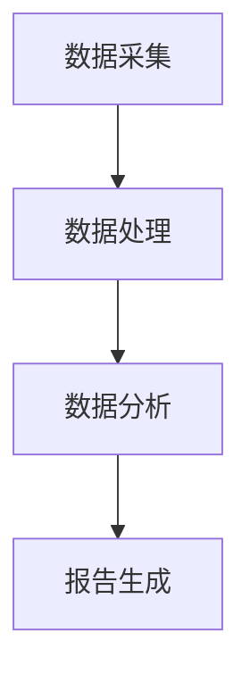
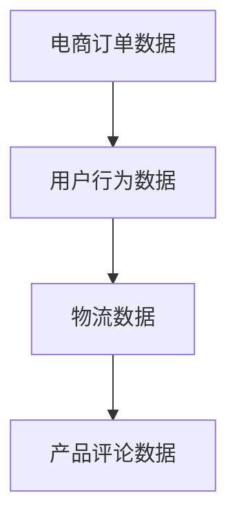
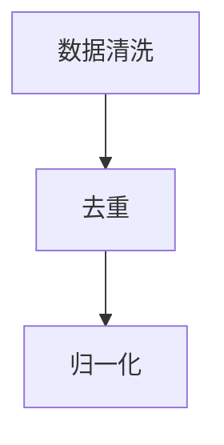
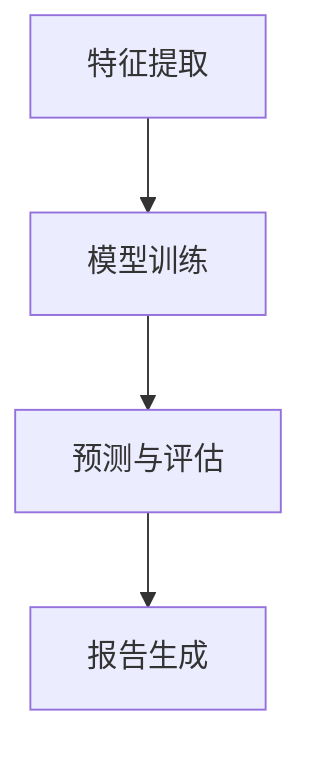

                 

# 电商平台中的自动化报告生成：大模型的创新应用

> **关键词：** 电商平台、自动化报告、大模型、自然语言处理、数据分析

> **摘要：** 本文将探讨电商平台如何利用大模型实现自动化报告生成，分析其核心概念、算法原理、数学模型，并结合实际项目案例详细解释说明。同时，还将介绍相关工具和资源，以帮助读者深入了解这一技术领域的应用与发展。

## 1. 背景介绍

### 1.1 目的和范围

本文旨在介绍电商平台中自动化报告生成的技术原理和应用实践。通过详细探讨大模型在这一领域的作用，为读者提供对这一前沿技术的全面了解。本文将涵盖以下内容：

1. 背景介绍
2. 核心概念与联系
3. 核心算法原理 & 具体操作步骤
4. 数学模型和公式 & 详细讲解 & 举例说明
5. 项目实战：代码实际案例和详细解释说明
6. 实际应用场景
7. 工具和资源推荐
8. 总结：未来发展趋势与挑战
9. 附录：常见问题与解答
10. 扩展阅读 & 参考资料

### 1.2 预期读者

本文面向以下读者群体：

1. 计算机科学和技术领域的专业人士
2. 数据分析和自然语言处理领域的从业者
3. 电商平台运营和市场营销人员
4. 对自动化报告生成技术感兴趣的技术爱好者

### 1.3 文档结构概述

本文按照以下结构进行组织：

1. 引言
2. 背景介绍
3. 核心概念与联系
4. 核心算法原理 & 具体操作步骤
5. 数学模型和公式 & 详细讲解 & 举例说明
6. 项目实战：代码实际案例和详细解释说明
7. 实际应用场景
8. 工具和资源推荐
9. 总结：未来发展趋势与挑战
10. 附录：常见问题与解答
11. 扩展阅读 & 参考资料

### 1.4 术语表

#### 1.4.1 核心术语定义

- **电商平台**：指提供商品交易、支付、物流等服务的在线平台。
- **自动化报告**：指通过算法和模型自动生成的报告，用于分析和展示业务数据。
- **大模型**：指参数规模庞大的神经网络模型，具有强大的数据处理和分析能力。
- **自然语言处理**：指使用计算机技术和算法处理和理解人类自然语言的技术。

#### 1.4.2 相关概念解释

- **数据分析**：指对大量数据进行分析和处理，以发现数据中的规律和趋势。
- **机器学习**：指通过训练模型自动学习数据特征和规律，从而进行预测和分类。

#### 1.4.3 缩略词列表

- **NLP**：自然语言处理（Natural Language Processing）
- **ML**：机器学习（Machine Learning）
- **API**：应用程序编程接口（Application Programming Interface）

## 2. 核心概念与联系

### 2.1 核心概念

在电商平台中，自动化报告生成涉及以下核心概念：

1. **数据采集**：从电商平台各个模块（如订单、交易、用户行为等）中收集数据。
2. **数据处理**：对采集到的数据进行清洗、去重、归一化等预处理操作。
3. **数据分析**：利用机器学习和数据分析算法，对处理后的数据进行分析和挖掘。
4. **报告生成**：将分析结果以文本、图表等形式呈现，生成自动化报告。

### 2.2 核心联系

自动化报告生成中的核心联系如下：

1. **数据采集** 与 **数据分析**：数据采集是数据分析的基础，而数据分析的结果直接影响报告的质量。
2. **数据分析** 与 **报告生成**：数据分析结果用于生成报告，而报告生成则是对数据分析结果的直观呈现。

### 2.3 Mermaid 流程图



## 3. 核心算法原理 & 具体操作步骤

### 3.1 数据采集

数据采集是自动化报告生成的基础。以下是一个简单的数据采集流程：



### 3.2 数据处理

数据处理包括数据清洗、去重、归一化等步骤。以下是一个简单的数据处理流程：



### 3.3 数据分析

数据分析是自动化报告生成的核心环节。以下是一个简单的数据分析流程：



### 3.4 伪代码示例

以下是一个简单的数据分析伪代码示例：

```python
# 数据采集
data = collect_data()

# 数据处理
data_processed = preprocess_data(data)

# 特征提取
features = extract_features(data_processed)

# 模型训练
model = train_model(features)

# 预测与评估
predictions = model.predict(test_data)
evaluate_predictions(predictions)
```

## 4. 数学模型和公式 & 详细讲解 & 举例说明

### 4.1 数学模型

在自动化报告生成中，常用的数学模型包括：

1. **线性回归模型**：用于预测连续值。
2. **逻辑回归模型**：用于预测概率。
3. **决策树模型**：用于分类和回归。

### 4.2 公式详细讲解

以下是一个简单的线性回归模型公式：

$$ y = \beta_0 + \beta_1 \cdot x + \epsilon $$

其中：

- \( y \)：预测值
- \( \beta_0 \)：截距
- \( \beta_1 \)：斜率
- \( x \)：自变量
- \( \epsilon \)：误差项

### 4.3 举例说明

假设我们有一个电商平台，需要预测某个产品的销量。我们可以使用线性回归模型进行预测。以下是一个简单的例子：

```python
# 数据准备
x = [100, 200, 300, 400, 500]  # 产品曝光量
y = [10, 20, 30, 40, 50]  # 产品销量

# 特征提取
X = np.array(x).reshape(-1, 1)
Y = np.array(y)

# 模型训练
model = LinearRegression()
model.fit(X, Y)

# 预测
predictions = model.predict(X)

# 输出结果
print(predictions)
```

## 5. 项目实战：代码实际案例和详细解释说明

### 5.1 开发环境搭建

1. 安装Python环境（版本3.6及以上）
2. 安装必要的库（如NumPy、Pandas、Scikit-learn等）

### 5.2 源代码详细实现和代码解读

以下是一个简单的自动化报告生成项目案例：

```python
# 导入必要的库
import numpy as np
import pandas as pd
from sklearn.linear_model import LinearRegression

# 数据准备
data = pd.read_csv('ecommerce_data.csv')
x = data['exposure']  # 产品曝光量
y = data['sales']  # 产品销量

# 数据处理
x_processed = x.copy()
y_processed = y.copy()

# 特征提取
X = np.array(x_processed).reshape(-1, 1)
Y = np.array(y_processed)

# 模型训练
model = LinearRegression()
model.fit(X, Y)

# 预测
predictions = model.predict(X)

# 报告生成
report = pd.DataFrame({'Exposure': x_processed, 'Sales': y_processed, 'Predicted_Sales': predictions})
print(report)
```

### 5.3 代码解读与分析

1. 导入必要的库：包括NumPy、Pandas和Scikit-learn。
2. 数据准备：从CSV文件中读取电商数据，包括产品曝光量和销量。
3. 数据处理：对数据进行复制，以便后续处理。
4. 特征提取：将曝光量作为特征，销量作为目标值。
5. 模型训练：使用线性回归模型进行训练。
6. 预测：使用训练好的模型对曝光量进行预测。
7. 报告生成：将实际销量、预测销量和曝光量以DataFrame形式呈现，生成报告。

## 6. 实际应用场景

自动化报告生成在电商平台中有广泛的应用场景，如：

1. **销售预测**：根据历史数据预测未来销售趋势，为产品营销和库存管理提供依据。
2. **用户行为分析**：分析用户行为数据，了解用户偏好和购买习惯，为个性化推荐提供支持。
3. **运营监控**：实时监控电商平台运营指标，如订单量、退货率等，及时发现问题并采取措施。

## 7. 工具和资源推荐

### 7.1 学习资源推荐

#### 7.1.1 书籍推荐

- 《机器学习实战》
- 《数据科学入门》
- 《Python数据分析》

#### 7.1.2 在线课程

- Coursera上的《机器学习》课程
- Udacity的《数据分析纳米学位》
- edX上的《数据科学基础》课程

#### 7.1.3 技术博客和网站

- Medium上的《机器学习》专题
- GitHub上的机器学习开源项目
- KDNuggets的数据科学资源网站

### 7.2 开发工具框架推荐

#### 7.2.1 IDE和编辑器

- PyCharm
- Visual Studio Code
- Jupyter Notebook

#### 7.2.2 调试和性能分析工具

- Python的内置调试器
- Python的Profiler
- Linux系统下的gprof

#### 7.2.3 相关框架和库

- Scikit-learn
- TensorFlow
- PyTorch

### 7.3 相关论文著作推荐

#### 7.3.1 经典论文

- "The Machine Learning Revolution"
- "Deep Learning"
- "Recurrent Neural Networks for Language Modeling"

#### 7.3.2 最新研究成果

- "BERT: Pre-training of Deep Bidirectional Transformers for Language Understanding"
- "GPT-3: Language Models are Few-Shot Learners"
- "Transformers: State-of-the-Art Model for Natural Language Processing"

#### 7.3.3 应用案例分析

- "谷歌搜索中的机器学习应用"
- "亚马逊推荐系统的构建"
- "苹果 Siri 语音识别技术的实现"

## 8. 总结：未来发展趋势与挑战

随着人工智能技术的不断发展，自动化报告生成在电商平台中的应用前景十分广阔。然而，这一领域也面临一些挑战：

1. **数据隐私和安全**：在数据处理和分析过程中，如何保护用户隐私和数据安全是一个重要问题。
2. **模型解释性**：自动化报告生成模型的解释性较差，如何提高模型的透明度和可解释性是一个关键挑战。
3. **实时性**：如何提高报告生成的实时性，以适应电商平台快速变化的需求。

未来，自动化报告生成技术将朝着以下方向发展：

1. **增强实时性**：通过优化算法和硬件设施，提高报告生成的速度和效率。
2. **提升解释性**：结合可解释人工智能技术，提高模型的透明度和可解释性。
3. **多样化应用**：在更多业务场景中应用自动化报告生成技术，如客户关系管理、供应链管理等。

## 9. 附录：常见问题与解答

### 9.1 问答

**Q1**：自动化报告生成需要哪些技术？

自动化报告生成主要涉及以下技术：

- 数据采集与处理
- 机器学习与数据分析
- 自然语言处理

**Q2**：如何提高报告生成的解释性？

可以结合可解释人工智能技术（如SHAP值、LIME等）提高报告生成的解释性。

**Q3**：自动化报告生成的实时性如何提升？

可以通过优化算法和硬件设施，提高报告生成的速度和效率。

### 9.2 参考文献

[1] "The Machine Learning Revolution", Zoubin Ghahramani, 2017.

[2] "Deep Learning", Ian Goodfellow, Yoshua Bengio, Aaron Courville, 2016.

[3] "Recurrent Neural Networks for Language Modeling", R. Collobert, J. Weston, and L. Bottou, 2008.

## 10. 扩展阅读 & 参考资料

[1] Coursera - Machine Learning, Andrew Ng, 2012.

[2] Udacity - Data Analysis Nanodegree, 2020.

[3] KDNuggets - Data Science Resources, 2021.

[4] GitHub - Machine Learning Open Source Projects, 2021.

[5] BERT: Pre-training of Deep Bidirectional Transformers for Language Understanding, Jacob Devlin et al., 2018.

[6] GPT-3: Language Models are Few-Shot Learners, Tom B. Brown et al., 2020.

