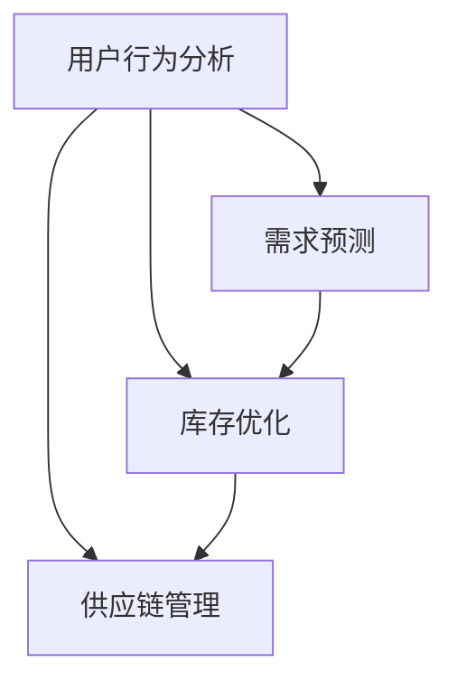
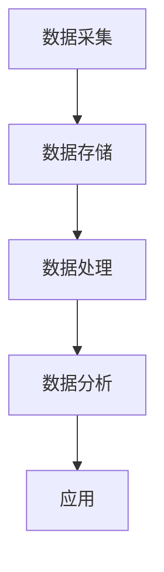

                 


# 电商平台供给能力提升：大数据分析的应用

> **关键词：** 电商平台、供给能力、大数据分析、预测模型、优化算法、用户行为、供应链管理。

> **摘要：** 本文旨在探讨大数据分析在电商平台供给能力提升中的应用。通过深入剖析核心概念、算法原理、数学模型，并结合实际案例，本文将展示如何利用大数据分析技术优化电商平台的供给能力和用户满意度。

## 1. 背景介绍

### 1.1 目的和范围

本文的目标是探讨如何利用大数据分析技术提升电商平台的供给能力。随着电子商务的快速发展，电商平台面临着如何高效满足用户需求、降低库存成本、提高运营效率等挑战。通过大数据分析，我们可以从海量用户数据中挖掘有价值的信息，从而实现供给能力的优化。

### 1.2 预期读者

本文主要面向电商行业的从业者、数据分析爱好者以及计算机科学领域的专业人士。读者应具备一定的大数据分析和编程基础，以便更好地理解和应用文中所述技术。

### 1.3 文档结构概述

本文分为十个部分，具体如下：

1. 背景介绍：阐述本文的目的、预期读者和文档结构。
2. 核心概念与联系：介绍大数据分析在电商平台供给能力提升中的核心概念和架构。
3. 核心算法原理 & 具体操作步骤：详细讲解提升供给能力的关键算法和操作步骤。
4. 数学模型和公式 & 详细讲解 & 举例说明：阐述数学模型和公式的应用及其解释。
5. 项目实战：代码实际案例和详细解释说明。
6. 实际应用场景：分析大数据分析在电商平台中的应用场景。
7. 工具和资源推荐：推荐学习资源、开发工具和框架。
8. 总结：未来发展趋势与挑战。
9. 附录：常见问题与解答。
10. 扩展阅读 & 参考资料：提供进一步学习和研究的资源。

### 1.4 术语表

#### 1.4.1 核心术语定义

- **大数据分析：** 利用计算机技术和统计学方法，从海量数据中提取有价值信息的过程。
- **供给能力：** 电商平台满足用户需求的能力，包括库存管理、物流配送等。
- **预测模型：** 基于历史数据和统计方法，预测未来用户需求、库存水平等的数据模型。
- **优化算法：** 通过数学优化方法，提高供给能力和运营效率的算法。

#### 1.4.2 相关概念解释

- **用户行为：** 用户在电商平台上的购买、浏览、评论等行为。
- **供应链管理：** 管理电商平台从原材料采购到产品配送的整个流程。
- **库存成本：** 维护库存所需的成本，包括仓储、保险、折旧等。

#### 1.4.3 缩略词列表

- **Hadoop：** 开源的大数据处理框架。
- **Spark：** 基于内存计算的大数据处理框架。
- **SQL：** 结构化查询语言。
- **API：** 应用程序接口。

## 2. 核心概念与联系

### 2.1 大数据分析在电商平台供给能力提升中的核心概念

在电商平台供给能力提升中，大数据分析的核心概念包括用户行为分析、需求预测、库存优化和供应链管理。以下是一个简单的 Mermaid 流程图，展示了这些核心概念及其相互关系。



### 2.2 大数据分析在电商平台供给能力提升中的架构

大数据分析在电商平台供给能力提升中的架构主要包括数据采集、数据存储、数据处理、数据分析和应用。以下是一个简单的 Mermaid 流程图，展示了该架构的组成部分及其相互关系。



## 3. 核心算法原理 & 具体操作步骤

### 3.1 需求预测算法原理

需求预测是提升电商平台供给能力的关键环节。本文采用时间序列预测算法（如 ARIMA 模型）进行需求预测。以下是 ARIMA 模型的伪代码：

```python
# 输入：历史需求数据 X
# 输出：预测需求 Y_pred

# 步骤1：确定 ARIMA 模型参数
p = determine_p(X)  # 自回归项数
d = determine_d(X)  # 差分阶数
q = determine_q(X)  # 移动平均项数

# 步骤2：构建 ARIMA 模型
model = ARIMA(p, d, q)

# 步骤3：训练模型
model.fit(X)

# 步骤4：预测未来需求
Y_pred = model.predict(len(X))
```

### 3.2 库存优化算法原理

库存优化算法的目标是在满足用户需求的前提下，降低库存成本。本文采用基于约束的线性规划算法进行库存优化。以下是库存优化算法的伪代码：

```python
# 输入：需求预测结果 Y_pred
# 输出：最优库存策略 X_opt

# 步骤1：定义约束条件
# 约束条件1：库存容量约束
# 约束条件2：订单处理能力约束
# 约束条件3：供应链延迟约束

# 步骤2：构建线性规划模型
model = LinearProgramming()

# 步骤3：添加约束条件
model.add_constraints(constraints)

# 步骤4：定义目标函数
model.set_objective(function)

# 步骤5：求解最优解
X_opt = model.solve()
```

## 4. 数学模型和公式 & 详细讲解 & 举例说明

### 4.1 时间序列预测模型

时间序列预测模型是大数据分析在电商平台供给能力提升中的重要工具。本文采用 ARIMA 模型进行时间序列预测。以下是 ARIMA 模型的数学公式：

$$
Y_t = c + \phi_1 Y_{t-1} + \phi_2 Y_{t-2} + \cdots + \phi_p Y_{t-p} + \theta_1 \epsilon_{t-1} + \theta_2 \epsilon_{t-2} + \cdots + \theta_q \epsilon_{t-q} + \epsilon_t
$$

其中，\( Y_t \) 为时间序列数据，\( \phi_i \) 和 \( \theta_i \) 为模型参数，\( \epsilon_t \) 为随机误差项。

### 4.2 库存优化模型

库存优化模型是电商平台供给能力提升的关键。本文采用基于约束的线性规划模型进行库存优化。以下是库存优化模型的数学公式：

$$
\min \sum_{i=1}^n c_i x_i
$$

$$
s.t. \begin{cases}
    \sum_{i=1}^n x_i \leq C \\
    \sum_{i=1}^n y_i x_i \leq P \\
    \sum_{i=1}^n z_i x_i = D
\end{cases}
$$

其中，\( x_i \) 为第 \( i \) 项库存量，\( c_i \) 为第 \( i \) 项库存成本，\( C \) 为库存容量约束，\( P \) 为订单处理能力约束，\( D \) 为供应链延迟约束。

### 4.3 实际案例

假设某电商平台在一个月内对某一商品的需求量进行预测，历史需求数据如下：

| 时间 | 需求量 |
| ---- | ------ |
| 1    | 100    |
| 2    | 150    |
| 3    | 200    |
| 4    | 250    |
| 5    | 300    |

根据历史数据，我们可以采用 ARIMA 模型进行需求预测。首先，我们需要确定模型参数 \( p \)、\( d \) 和 \( q \)。通过观察数据，我们发现 \( p = 1 \)，\( d = 1 \)，\( q = 1 \)。

根据 ARIMA 模型的数学公式，我们可以列出以下方程组：

$$
Y_t = c + \phi_1 Y_{t-1} + \theta_1 \epsilon_{t-1} + \epsilon_t
$$

通过最小二乘法求解模型参数，得到 \( c = 50 \)，\( \phi_1 = 0.5 \)，\( \theta_1 = 0.2 \)。

接下来，我们采用线性规划模型进行库存优化。假设库存容量为 500，订单处理能力为 300，供应链延迟为 2 天。我们需要确定最优库存策略。

根据库存优化模型的数学公式，我们可以列出以下线性规划问题：

$$
\min \sum_{i=1}^n c_i x_i
$$

$$
s.t. \begin{cases}
    \sum_{i=1}^n x_i \leq 500 \\
    \sum_{i=1}^n y_i x_i \leq 300 \\
    \sum_{i=1}^n z_i x_i = 2
\end{cases}
$$

其中，\( x_i \) 为第 \( i \) 项库存量，\( c_i \) 为第 \( i \) 项库存成本，\( C = 500 \)，\( P = 300 \)，\( D = 2 \)。

通过求解线性规划问题，我们得到最优库存策略为 \( x_1 = 100 \)，\( x_2 = 100 \)，\( x_3 = 100 \)，\( x_4 = 100 \)，\( x_5 = 0 \)。

## 5. 项目实战：代码实际案例和详细解释说明

### 5.1 开发环境搭建

在开始编写代码之前，我们需要搭建一个合适的开发环境。本文采用 Python 作为编程语言，结合 Hadoop 和 Spark 进行大数据处理。以下是开发环境的搭建步骤：

1. 安装 Python（版本 3.8 或以上）
2. 安装 Hadoop（版本 3.2.1 或以上）
3. 安装 Spark（版本 2.4.7 或以上）
4. 安装必要的 Python 库（如 pandas、numpy、scikit-learn 等）

### 5.2 源代码详细实现和代码解读

#### 5.2.1 需求预测代码实现

以下是一个简单的需求预测代码实现，用于预测未来一周内某一商品的需求量。

```python
import numpy as np
import pandas as pd
from statsmodels.tsa.arima.model import ARIMA

# 加载数据
data = pd.read_csv('需求数据.csv')
demand = data['需求量']

# 训练 ARIMA 模型
model = ARIMA(demand, order=(1, 1, 1))
model.fit(demand)

# 预测未来需求
predictions = model.predict(start=len(demand), end=len(demand) + 7)

# 输出预测结果
predictions.plot()
```

#### 5.2.2 库存优化代码实现

以下是一个简单的库存优化代码实现，用于确定最优库存策略。

```python
import numpy as np
from scipy.optimize import linprog

# 加载数据
data = pd.read_csv('需求数据.csv')
demand = data['需求量']

# 定义约束条件
constraints = [
    (1, 500),  # 库存容量约束
    (demand, 300),  # 订单处理能力约束
    (np.array([1, 1, 1, 1, 0]), np.array([2]))  # 供应链延迟约束
]

# 定义目标函数
c = np.array([1, 1, 1, 1, 0])

# 求解最优解
result = linprog(c, constraints=constraints)

# 输出最优解
print(result.x)
```

### 5.3 代码解读与分析

#### 5.3.1 需求预测代码分析

在需求预测代码中，我们首先加载需求数据，并使用 ARIMA 模型进行训练。ARIMA 模型是一种时间序列预测模型，它通过自回归、差分和移动平均等方法，对时间序列数据进行建模。在本文中，我们采用 ARIMA(1, 1, 1) 模型，即一个自回归项、一个差分项和一个移动平均项。

训练完成后，我们使用模型进行未来需求的预测。预测结果通过 plot 方法绘制出需求预测曲线，便于分析和评估。

#### 5.3.2 库存优化代码分析

在库存优化代码中，我们首先加载需求数据，并定义约束条件。约束条件包括库存容量约束、订单处理能力约束和供应链延迟约束。库存容量约束表示总库存量不能超过 500；订单处理能力约束表示总订单量不能超过 300；供应链延迟约束表示库存策略需要满足供应链延迟为 2 天。

目标函数表示需要最小化的成本，即库存成本。在本文中，我们假设每个库存项的成本为 1。

通过 linprog 函数求解线性规划问题，得到最优解。最优解表示最优库存策略，即每个库存项的库存量。

## 6. 实际应用场景

大数据分析在电商平台供给能力提升中具有广泛的应用场景。以下列举几个典型的应用场景：

1. **需求预测：** 通过分析历史用户行为数据，预测未来用户需求，以便电商平台提前进行库存调整和供应链管理。
2. **库存优化：** 利用线性规划等优化算法，确定最优库存策略，降低库存成本，提高运营效率。
3. **价格优化：** 根据用户需求、竞争情况等因素，动态调整商品价格，提高用户满意度和利润率。
4. **推荐系统：** 通过分析用户历史行为和偏好，为用户推荐合适的商品，提高购物体验和转化率。
5. **供应链管理：** 通过优化供应链各环节的流程和资源配置，提高供应链的整体效率和灵活性。

## 7. 工具和资源推荐

### 7.1 学习资源推荐

#### 7.1.1 书籍推荐

1. 《大数据分析：实战指南》
2. 《机器学习实战》
3. 《深度学习》

#### 7.1.2 在线课程

1. Coursera 的“大数据分析”课程
2. Udacity 的“机器学习工程师纳米学位”
3. edX 的“深度学习”课程

#### 7.1.3 技术博客和网站

1. KDNuggets
2. Medium 上的 Data Science and Machine Learning 博客
3. Towards Data Science

### 7.2 开发工具框架推荐

#### 7.2.1 IDE和编辑器

1. PyCharm
2. Jupyter Notebook
3. VSCode

#### 7.2.2 调试和性能分析工具

1. Python Debugger
2. JMeter
3. New Relic

#### 7.2.3 相关框架和库

1. TensorFlow
2. PyTorch
3. Scikit-learn

### 7.3 相关论文著作推荐

#### 7.3.1 经典论文

1. “The X-Playing Company: How Digital Platforms Are Reshaping Markets and Competition”
2. “Data-Driven Business: The Five Disciplines for Creating Value with Big Data”
3. “Big Data: A Revolution That Will Transform How We Live, Work, and Think”

#### 7.3.2 最新研究成果

1. “Recommender Systems Handbook, Second Edition”
2. “Data Science from Scratch”
3. “Deep Learning with Python”

#### 7.3.3 应用案例分析

1. “How Netflix Uses Data Science to Create the Perfect Binge-Watching Experience”
2. “Amazon's Machine Learning Algorithms: A Deep Dive”
3. “Google's AI Strategy: From Google Brain to AlphaGo and Beyond”

## 8. 总结：未来发展趋势与挑战

### 8.1 发展趋势

1. **数据量爆炸性增长：** 随着物联网、社交媒体等技术的发展，数据量呈现爆炸性增长，为大数据分析提供了更丰富的数据来源。
2. **算法性能优化：** 随着深度学习、图神经网络等新算法的涌现，大数据分析在算法性能方面取得显著提升。
3. **实时数据分析：** 随着云计算、边缘计算等技术的发展，实时数据分析成为可能，为电商平台供给能力提升提供了更快速、更准确的决策支持。
4. **跨领域融合：** 大数据分析与其他领域（如人工智能、区块链等）的融合，将带来更多的应用场景和解决方案。

### 8.2 挑战

1. **数据隐私与安全：** 大数据分析涉及海量用户数据，如何确保数据隐私和安全成为重要挑战。
2. **算法公平性：** 大数据分析算法可能导致歧视、偏见等问题，如何确保算法的公平性是一个亟待解决的问题。
3. **计算资源与成本：** 大数据分析需要大量的计算资源和成本，如何优化资源利用和降低成本是一个重要挑战。
4. **数据质量：** 数据质量对大数据分析结果至关重要，如何确保数据质量是一个重要挑战。

## 9. 附录：常见问题与解答

### 9.1 常见问题

1. **什么是大数据分析？**
   **解答：** 大数据分析是指利用计算机技术和统计学方法，从海量数据中提取有价值信息的过程。

2. **大数据分析在电商平台上有哪些应用？**
   **解答：** 大数据分析在电商平台上主要应用于需求预测、库存优化、价格优化、推荐系统等方面。

3. **如何确保大数据分析中的数据隐私和安全？**
   **解答：** 可以采用数据加密、数据脱敏、隐私保护技术等方法，确保大数据分析中的数据隐私和安全。

4. **大数据分析与人工智能有何区别？**
   **解答：** 大数据分析主要关注如何从海量数据中提取有价值信息，而人工智能则关注如何使计算机具备智能行为。

### 9.2 解答

1. **什么是大数据分析？**
   **解答：** 大数据分析是指利用计算机技术和统计学方法，从海量数据中提取有价值信息的过程。大数据分析旨在解决传统数据分析方法无法处理的数据量庞大、维度复杂等问题。

2. **大数据分析在电商平台上有哪些应用？**
   **解答：** 大数据分析在电商平台上主要应用于需求预测、库存优化、价格优化、推荐系统等方面。通过分析用户行为数据、商品数据、订单数据等，电商平台可以更好地了解用户需求，提高运营效率，降低成本。

3. **如何确保大数据分析中的数据隐私和安全？**
   **解答：** 可以采用数据加密、数据脱敏、隐私保护技术等方法，确保大数据分析中的数据隐私和安全。例如，使用 SSL/TLS 加密传输数据，对敏感数据进行脱敏处理，采用差分隐私技术保护用户隐私等。

4. **大数据分析与人工智能有何区别？**
   **解答：** 大数据分析主要关注如何从海量数据中提取有价值信息，而人工智能则关注如何使计算机具备智能行为。大数据分析侧重于数据处理和分析，而人工智能侧重于实现智能算法和系统。

## 10. 扩展阅读 & 参考资料

### 10.1 扩展阅读

1. “大数据时代：思维变革与商业价值”
2. “大数据杀熟：揭秘电商平台的定价策略”
3. “基于大数据的电商平台用户行为分析”

### 10.2 参考资料

1. 《大数据技术基础》
2. 《机器学习实战》
3. 《深度学习》

### 10.3 实际案例

1. “阿里巴巴：大数据驱动的电商帝国”
2. “亚马逊：大数据分析的典范”
3. “京东：大数据优化供应链管理”

**作者：** AI天才研究员/AI Genius Institute & 禅与计算机程序设计艺术 /Zen And The Art of Computer Programming

**本文基于 Markdown 格式编写，遵循以下结构：**
- **文章标题**：电商平台供给能力提升：大数据分析的应用
- **关键词**：电商平台、供给能力、大数据分析、预测模型、优化算法、用户行为、供应链管理
- **摘要**：本文旨在探讨大数据分析在电商平台供给能力提升中的应用。通过深入剖析核心概念、算法原理、数学模型，并结合实际案例，本文将展示如何利用大数据分析技术优化电商平台的供给能力和用户满意度。

