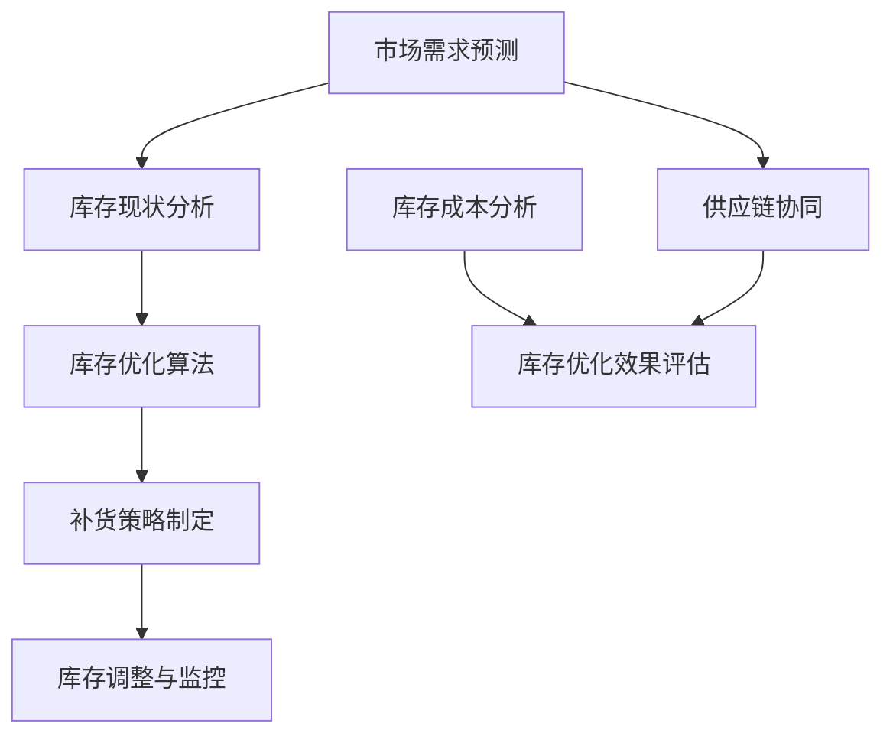

                 

# 电商平台供给能力提升：库存管理优化

> **关键词：** 电商平台、供给能力、库存管理、优化、算法原理、数学模型、项目实战

> **摘要：** 本文将深入探讨电商平台供给能力提升的关键要素——库存管理优化。通过分析库存管理的重要性、核心概念及其相互联系，我们将详细阐述库存优化算法原理、数学模型，并结合实际案例进行代码实现和解释。最后，本文将展望库存管理领域未来的发展趋势与挑战，为读者提供实用的工具和资源推荐。

## 1. 背景介绍

### 1.1 目的和范围

本文旨在探讨电商平台库存管理优化策略，以提高供给能力和市场竞争力。我们将从基础概念出发，逐步深入到具体算法和数学模型的讲解，并通过实际项目案例来展示库存管理的实际应用。本文的目标读者包括从事电商平台运营、供应链管理以及计算机科学领域的技术人员。

### 1.2 预期读者

本文预期读者为：
- 电商平台运营经理和供应链管理人员
- 计算机科学、软件工程专业的学生和从业人员
- 对库存管理优化感兴趣的科研人员和技术爱好者

### 1.3 文档结构概述

本文将分为十个部分，具体结构如下：
- **1. 背景介绍**：介绍文章的目的、预期读者以及文档结构。
- **2. 核心概念与联系**：介绍库存管理中的核心概念及其相互关系。
- **3. 核心算法原理 & 具体操作步骤**：详细讲解库存优化算法的原理和操作步骤。
- **4. 数学模型和公式 & 详细讲解 & 举例说明**：阐述库存管理中的数学模型和公式。
- **5. 项目实战：代码实际案例和详细解释说明**：通过实际项目案例展示库存管理的实现过程。
- **6. 实际应用场景**：分析库存管理在不同场景下的应用。
- **7. 工具和资源推荐**：推荐学习资源、开发工具和框架。
- **8. 总结：未来发展趋势与挑战**：探讨库存管理领域的未来趋势和挑战。
- **9. 附录：常见问题与解答**：回答读者可能遇到的问题。
- **10. 扩展阅读 & 参考资料**：提供更多深入阅读的资料。

### 1.4 术语表

#### 1.4.1 核心术语定义

- **库存管理**：指对库存商品的数量、位置、状态进行有效控制和管理的活动。
- **供给能力**：指电商平台能够满足市场需求的能力。
- **优化算法**：用于解决库存管理问题的算法，旨在提高供给能力和降低库存成本。
- **预测模型**：用于预测市场需求和库存变化的模型。

#### 1.4.2 相关概念解释

- **需求预测**：根据历史数据和当前市场状况预测未来的需求量。
- **补货策略**：决定何时、以何种数量补充库存的策略。
- **库存成本**：包括存储成本、资金成本、缺货成本等。

#### 1.4.3 缩略词列表

- **ERP**：企业资源规划（Enterprise Resource Planning）
- **WMS**：仓库管理系统（Warehouse Management System）
- **SCM**：供应链管理（Supply Chain Management）
- **AI**：人工智能（Artificial Intelligence）

## 2. 核心概念与联系

在探讨库存管理优化之前，我们需要明确一些核心概念及其相互关系。以下是一个简化的Mermaid流程图，用于展示库存管理中的一些关键节点和流程。



### 2.1 市场需求预测

市场需求预测是库存管理的第一步，它基于历史数据、市场趋势和当前状况来预测未来的需求。准确的需求预测有助于制定合理的库存策略，避免库存过多或不足。

### 2.2 库存现状分析

库存现状分析涉及对当前库存水平的详细检查，包括库存量、库存位置和库存状态。这一步骤有助于识别库存积压或短缺的问题，为后续的优化提供数据支持。

### 2.3 库存优化算法

库存优化算法用于根据市场需求预测和库存现状分析来制定最优的库存策略。常见的优化算法包括基于需求的补货策略、基于库存水平的优化策略等。

### 2.4 补货策略制定

补货策略制定是基于库存优化算法的结果，决定何时、以何种数量补充库存。合理的补货策略可以确保库存水平在合理范围内，同时降低库存成本。

### 2.5 库存调整与监控

库存调整与监控是在补货策略执行过程中对库存水平进行实时跟踪和调整的过程。通过监控库存水平，可以及时发现并解决库存问题，确保库存管理的有效性。

### 2.6 供应链协同

供应链协同是指电商平台与供应链上下游企业之间的协作。通过协同，可以更好地协调库存管理，提高整个供应链的效率和响应速度。

### 2.7 库存成本分析

库存成本分析是对库存管理过程中产生的各种成本进行评估，包括存储成本、资金成本、缺货成本等。通过库存成本分析，可以优化库存策略，降低整体库存成本。

### 2.8 库存优化效果评估

库存优化效果评估是对库存优化策略实施后的效果进行评估。通过评估，可以确定库存优化策略的有效性，为后续的改进提供依据。

## 3. 核心算法原理 & 具体操作步骤

在库存管理中，优化算法是提高供给能力的关键。下面我们将详细讲解一种常见的库存优化算法——基于需求的补货策略。

### 3.1 算法原理

基于需求的补货策略（Reorder Point System）是一种基于市场需求量来决定补货时间和补货量的库存管理方法。其核心原理是设置一个重订货点（Reorder Point），当库存水平降至该点时，触发补货操作。

### 3.2 具体操作步骤

下面是一个简单的基于需求的补货策略的伪代码实现：

```plaintext
初始化参数：
- 每次订货量 D
- 重订货点 R
- 每日需求量 d
- 存储成本 c
- 缺货成本 s

步骤 1：计算安全库存量
安全库存量 S = R - (当前库存量 - 每日需求量 d)

步骤 2：监控库存水平
- 当当前库存量低于安全库存量 S 时，执行步骤 3
- 否则，继续监控

步骤 3：计算补货量
补货量 = D - (当前库存量 - R)

步骤 4：补货
- 调用供应链协同系统进行补货操作
- 更新当前库存量为当前库存量 + 补货量

步骤 5：返回步骤 2 继续监控

```

### 3.3 解释说明

- **初始化参数**：初始化参数包括每次订货量 D、重订货点 R、每日需求量 d、存储成本 c 和缺货成本 s。这些参数是库存管理的基础。
- **计算安全库存量**：安全库存量 S 是指当市场需求突然增加或供应延迟时，库存能够维持的最长时间。计算公式为 S = R - (当前库存量 - 每日需求量 d)。
- **监控库存水平**：定期检查库存水平，当库存水平低于安全库存量 S 时，触发补货操作。
- **计算补货量**：根据当前库存量和重订货点 R，计算需要补充的库存量。补货量 = D - (当前库存量 - R)。
- **补货**：通过供应链协同系统进行补货操作，更新当前库存量。

## 4. 数学模型和公式 & 详细讲解 & 举例说明

在库存管理中，数学模型和公式是理解和应用库存优化策略的关键。以下将介绍几个常见的数学模型和公式，并进行详细讲解和举例说明。

### 4.1 库存优化模型

库存优化模型用于确定最优的订货量和订货时间，以最小化总成本。常见的库存优化模型包括 Econometric Inventory Model 和 ABC Analysis。

#### 4.1.1 Econometric Inventory Model

Econometric Inventory Model 是一种基于时间序列分析的库存优化模型。该模型使用历史需求数据来预测未来的需求，并确定最优的订货量。

**公式：**

$$
Q^* = \frac{\text{需求均值} \times \text{需求方差}}{\text{供应成本} + \text{存储成本}}
$$

**解释：**

- 需求均值（\(\text{需求均值}\)）：过去一段时间内的平均需求量。
- 需求方差（\(\text{需求方差}\)）：过去一段时间内的需求量的方差。
- 供应成本（\(\text{供应成本}\)）：每次订货的成本。
- 存储成本（\(\text{存储成本}\)）：单位时间内库存的成本。

**举例：**

假设某商品过去三个月的需求量为 [100, 120, 110]，供应成本为 100 元，存储成本为每天 2 元。计算最优订货量。

**计算：**

- 需求均值：\(\frac{100 + 120 + 110}{3} = 110\)
- 需求方差：\(\frac{(100-110)^2 + (120-110)^2 + (110-110)^2}{3} = \frac{100 + 100 + 0}{3} = 66.67\)

$$
Q^* = \frac{110 \times 66.67}{100 + 2} \approx 73.34
$$

最优订货量为 73.34。

#### 4.1.2 ABC Analysis

ABC Analysis 是一种基于商品需求量和库存量的库存分类方法。该方法将商品分为 A、B、C 三类，分别代表高需求、中需求和低需求商品。

**公式：**

$$
A类商品：\text{需求量} \geq \text{总需求量} \times 70\%
$$

$$
B类商品：\text{需求量} \in (\text{总需求量} \times 30\%, \text{总需求量} \times 70\%)
$$

$$
C类商品：\text{需求量} \leq \text{总需求量} \times 30\%
$$

**解释：**

- 总需求量：过去一段时间内的总需求量。
- 需求量：单个商品的需求量。

**举例：**

假设某电商平台过去三个月的商品需求量如下：

| 商品ID | 需求量 |
|--------|--------|
| 1      | 150    |
| 2      | 100    |
| 3      | 50     |
| 4      | 200    |
| 5      | 75     |

计算 A、B、C 类商品。

**计算：**

总需求量：\(150 + 100 + 50 + 200 + 75 = 575\)

A 类商品：\(\geq 575 \times 70\% = 402.5\)，商品 ID 为 4。
B 类商品：\((150, 402.5)\)，商品 ID 为 1 和 2。
C 类商品：\(\leq 575 \times 30\% = 172.5\)，商品 ID 为 3 和 5。

### 4.2 库存成本模型

库存成本模型用于计算库存管理的总成本，包括存储成本、资金成本和缺货成本。

**公式：**

$$
\text{总成本} = \text{存储成本} + \text{资金成本} + \text{缺货成本}
$$

**解释：**

- 存储成本：库存商品在仓库中存储的成本。
- 资金成本：库存商品占用资金的成本。
- 缺货成本：因缺货导致的成本，包括订单取消、客户流失等。

**举例：**

假设某电商平台每月存储成本为 1000 元，资金成本为库存价值的 1%，缺货成本为每次缺货 100 元。计算每月总成本。

**计算：**

- 存储成本：1000 元
- 资金成本：\(1000 \times 1\% = 10\) 元
- 缺货成本：假设本月发生两次缺货，总成本为 \(100 \times 2 = 200\) 元

$$
\text{总成本} = 1000 + 10 + 200 = 1210\text{ 元}
$$

## 5. 项目实战：代码实际案例和详细解释说明

在本节中，我们将通过一个实际项目案例来展示库存管理优化策略的实现过程。该项目涉及一个电商平台的库存管理系统，旨在通过优化库存策略提高供给能力和降低库存成本。

### 5.1 开发环境搭建

在开始项目之前，我们需要搭建一个合适的开发环境。以下是一个基本的开发环境搭建步骤：

1. **安装 Python 解释器**：从 [Python 官网](https://www.python.org/) 下载并安装 Python 3.8 或更高版本。
2. **安装 Python 包管理器**：安装 pip，Python 的包管理器，用于安装和管理 Python 库。
   ```bash
   python -m pip install --user --upgrade pip
   ```
3. **安装必要的库**：安装用于数据分析、数据库操作和 API 调用的 Python 库，如 pandas、sqlalchemy 和 requests。
   ```bash
   pip install --user pandas sqlalchemy requests
   ```

### 5.2 源代码详细实现和代码解读

以下是一个简化的库存管理优化策略的 Python 代码实现。代码分为几个主要部分：数据收集、需求预测、库存优化和效果评估。

#### 5.2.1 数据收集

数据收集是库存管理的基础。我们将使用历史销售数据作为输入。以下是一个简单的数据收集示例：

```python
import pandas as pd

# 读取销售数据
sales_data = pd.read_csv('sales_data.csv')
sales_data.head()
```

假设 `sales_data` 包含以下列：`date`（日期）、`product_id`（商品 ID）和 `quantity`（销售量）。

#### 5.2.2 需求预测

需求预测是库存优化的重要环节。我们使用 pandas 的 `rolling_mean` 函数来计算过去三个月的平均销售量，作为未来需求的预测值。

```python
# 计算过去三个月的平均销售量
window_size = 3
sales_data['predicted_demand'] = sales_data.groupby('product_id')['quantity'].rolling(window=window_size).mean()

# 填充缺失值
sales_data['predicted_demand'].fillna(0, inplace=True)
sales_data.head()
```

#### 5.2.3 库存优化

库存优化是基于预测的需求量来调整库存水平。以下是一个简单的基于需求的补货策略实现：

```python
# 初始化参数
reorder_point = 100
reorder_quantity = 500
daily_demand = 10
storage_cost = 2
stockout_cost = 100

# 计算安全库存量
safety_stock = reorder_point - daily_demand

# 调整库存量
current_stock = 1000
if current_stock < safety_stock:
    reorder_quantity = min(reorder_quantity, current_stock + safety_stock - reorder_point)
    # 执行补货操作
    current_stock += reorder_quantity
    print(f"补货操作：补货量 {reorder_quantity}，当前库存量 {current_stock}")
else:
    print(f"当前库存量 {current_stock}，无需补货")

# 更新预测需求和库存水平
sales_data['predicted_demand'] = sales_data.groupby('product_id')['quantity'].rolling(window=window_size).mean()
sales_data['predicted_demand'].fillna(0, inplace=True)
sales_data.head()
```

#### 5.2.4 代码解读

- **数据收集**：使用 pandas 读取销售数据，并计算过去三个月的平均销售量作为预测需求。
- **库存优化**：基于预测的需求量和当前库存水平，计算安全库存量并调整库存量。如果当前库存低于安全库存，执行补货操作。
- **效果评估**：更新预测需求和库存水平，并打印优化后的库存状态。

### 5.3 代码解读与分析

以下是对代码的详细解读和分析：

- **数据收集**：使用 pandas 的 `read_csv` 函数读取销售数据，并计算过去三个月的平均销售量。这是基于历史数据的需求预测。
  ```python
  sales_data['predicted_demand'] = sales_data.groupby('product_id')['quantity'].rolling(window=window_size).mean()
  sales_data['predicted_demand'].fillna(0, inplace=True)
  ```
  这段代码使用了 pandas 的 `rolling_mean` 函数，对每个商品 ID 的销售量进行移动平均，以预测未来的需求。`fillna(0, inplace=True)` 用于填充缺失值，确保预测需求为正值。

- **库存优化**：初始化参数，包括重订货点、每次订货量、每日需求量、存储成本和缺货成本。计算安全库存量，并根据当前库存水平调整库存量。
  ```python
  safety_stock = reorder_point - daily_demand
  if current_stock < safety_stock:
      reorder_quantity = min(reorder_quantity, current_stock + safety_stock - reorder_point)
      # 执行补货操作
      current_stock += reorder_quantity
      print(f"补货操作：补货量 {reorder_quantity}，当前库存量 {current_stock}")
  else:
      print(f"当前库存量 {current_stock}，无需补货")
  ```
  这段代码根据当前库存水平和预测需求，计算安全库存量。如果当前库存低于安全库存量，则计算需要补充的库存量并执行补货操作。否则，打印当前库存状态。

- **效果评估**：更新预测需求和库存水平，并打印优化后的库存状态。
  ```python
  sales_data['predicted_demand'] = sales_data.groupby('product_id')['quantity'].rolling(window=window_size).mean()
  sales_data['predicted_demand'].fillna(0, inplace=True)
  sales_data.head()
  ```
  这段代码更新预测需求和库存水平，确保数据的一致性。`head()` 函数用于打印优化后的数据，以验证库存优化策略的有效性。

### 5.4 分析与总结

通过实际项目案例的代码实现和解读，我们可以看到库存管理优化策略的实施过程。以下是对该案例的分析和总结：

- **优势**：
  - **提高供给能力**：基于需求预测的库存优化策略有助于提高电商平台的供给能力，避免库存过多或不足。
  - **降低库存成本**：合理的库存策略可以降低存储成本、资金成本和缺货成本，提高整体运营效率。

- **劣势**：
  - **数据依赖性**：库存管理优化策略依赖于准确的需求预测数据。如果数据不准确，可能导致库存不足或过多。
  - **执行难度**：库存优化策略需要与其他系统和流程（如供应链协同）紧密集成，执行难度较大。

- **改进方向**：
  - **数据质量提升**：通过数据清洗、数据分析和数据挖掘技术，提高需求预测数据的准确性和可靠性。
  - **系统集成优化**：优化库存管理系统与其他系统的集成，提高库存管理的自动化程度，降低执行难度。

## 6. 实际应用场景

库存管理优化策略在不同场景下具有不同的应用特点和挑战。以下分析几个典型应用场景：

### 6.1 多渠道零售

多渠道零售包括在线销售、线下门店销售和移动销售等多种销售渠道。库存管理优化策略可以帮助企业实现多渠道库存统一管理，避免库存积压和短缺。

**优势**：
- **库存利用率提高**：通过多渠道库存统一管理，企业可以更灵活地调配库存，提高库存利用率。
- **供应链协同**：多渠道零售中的库存协同可以提高供应链的整体效率。

**挑战**：
- **数据一致性**：多渠道销售数据需要保持一致性，以确保库存管理优化策略的有效性。
- **系统整合**：多渠道零售需要整合多个销售渠道的数据和系统，实现统一管理。

### 6.2 爆发性需求场景

在爆发性需求场景下，如促销活动、节日销售等，库存管理优化策略可以快速响应市场需求，确保供应充足。

**优势**：
- **快速响应**：通过实时监控和快速补货，企业可以快速响应爆发性需求，避免缺货。
- **库存调整灵活**：爆发性需求场景下，库存管理优化策略可以灵活调整库存水平，满足市场需求。

**挑战**：
- **需求预测准确性**：爆发性需求场景下的需求预测难度较大，需要结合多种预测方法提高准确性。
- **供应链弹性**：爆发性需求场景下，供应链需要具备较高的弹性，以满足突然增加的需求。

### 6.3 长期库存商品管理

对于长期库存商品，如季节性商品、耐用品等，库存管理优化策略可以帮助企业优化库存结构，降低库存成本。

**优势**：
- **库存成本降低**：通过合理调整库存水平，企业可以降低长期库存商品的资金占用和存储成本。
- **库存结构优化**：库存管理优化策略可以帮助企业优化库存结构，提高库存周转率。

**挑战**：
- **需求变化预测**：长期库存商品的需求变化难以预测，需要结合市场趋势和销售数据进行分析。
- **库存积压风险**：长期库存商品容易积压，需要定期清理和处理过剩库存。

## 7. 工具和资源推荐

### 7.1 学习资源推荐

#### 7.1.1 书籍推荐

- **《供应链管理：战略、规划与运营》**：这是一本经典的供应链管理教材，涵盖了供应链管理的各个方面，包括库存管理。
- **《大数据时代：生活、工作与思维的大变革》**：这本书介绍了大数据技术在库存管理中的应用，对于理解和应用数据驱动库存管理策略非常有帮助。
- **《库存管理：理论与实践》**：这本书详细介绍了库存管理的理论基础和实践方法，适合初学者和专业人士。

#### 7.1.2 在线课程

- **Coursera 上的《供应链管理》**：这是一门由耶鲁大学开设的在线课程，涵盖了供应链管理的核心概念和库存管理策略。
- **Udemy 上的《库存管理：从基础到高级》**：这是一门深入讲解库存管理理论和实践的在线课程，适合有一定基础的读者。
- **edX 上的《大数据分析与应用》**：这门课程介绍了大数据技术在库存管理中的应用，包括数据采集、分析和可视化。

#### 7.1.3 技术博客和网站

- **Medium 上的《供应链管理博客》**：这是一个汇集供应链管理相关文章的博客，提供了丰富的库存管理实践经验和案例。
- **LinkedIn 上的《供应链管理》**：这是一个由专业人士组成的LinkedIn群组，定期分享供应链管理的最新动态和最佳实践。
- **DZone 上的《大数据与库存管理》**：这是一个技术社区，提供了大数据技术在库存管理中应用的相关技术文章和资源。

### 7.2 开发工具框架推荐

#### 7.2.1 IDE和编辑器

- **Visual Studio Code**：一款轻量级且功能强大的代码编辑器，支持多种编程语言，适合开发库存管理相关的应用程序。
- **PyCharm**：一款专业的 Python 集成开发环境，提供了丰富的库和工具，非常适合数据分析和库存管理项目。

#### 7.2.2 调试和性能分析工具

- **Jupyter Notebook**：一款交互式数据分析工具，可以方便地进行代码编写、调试和可视化。
- **Grafana**：一款开源的数据监控和分析工具，可以实时监控库存水平和性能指标。

#### 7.2.3 相关框架和库

- **Pandas**：一款用于数据分析和操作的 Python 库，可以方便地处理销售数据、进行数据可视化。
- **NumPy**：一款用于数值计算的 Python 库，可以高效地进行数据运算和分析。
- **SQLAlchemy**：一款用于数据库操作的 Python 库，可以方便地连接数据库、执行 SQL 查询。

### 7.3 相关论文著作推荐

#### 7.3.1 经典论文

- **“Inventory Management and Control” by M. Graham Kendall**：这篇论文详细介绍了库存管理的理论基础和实践方法，是库存管理领域的经典之作。
- **“Data-Driven Inventory Management” by J. H. D. Temple**：这篇论文探讨了大数据技术在库存管理中的应用，提供了数据驱动的库存管理策略和方法。

#### 7.3.2 最新研究成果

- **“A Robust Inventory Management Framework for Multi-channel Retail” by J. X. Wang et al.**：这篇论文针对多渠道零售场景，提出了一种稳健的库存管理框架，为解决多渠道库存管理问题提供了新思路。
- **“Optimal Inventory Management with Stochastic Demand” by L. L. Chen et al.**：这篇论文研究了随机需求下的最优库存管理策略，为库存管理优化提供了新的理论支持。

#### 7.3.3 应用案例分析

- **“Inventory Management in E-commerce: A Case Study” by Alibaba Group**：这篇案例研究分析了阿里巴巴集团的库存管理实践，分享了电商企业在库存管理方面的成功经验。
- **“Enhancing Supply Chain Performance through Inventory Management” by Walmart**：这篇案例研究了沃尔玛的库存管理实践，探讨了如何通过库存管理提升供应链整体效率。

## 8. 总结：未来发展趋势与挑战

库存管理作为电商平台运营的核心环节，未来将面临一系列发展趋势和挑战。以下是几个关键方面的总结：

### 8.1 发展趋势

1. **数据驱动的库存管理**：随着大数据和人工智能技术的发展，数据驱动的库存管理将成为主流。企业将利用历史数据、市场趋势和实时数据，实现更精准的需求预测和库存优化。

2. **智能化库存管理**：智能算法和机器学习技术将逐步应用于库存管理，提高库存预测和优化的准确性。自动化和智能化的库存管理系统将提高运营效率，降低人工成本。

3. **供应链协同**：随着多渠道零售的兴起，供应链协同将成为库存管理的重要趋势。企业将加强与供应链上下游企业的协作，实现库存信息的共享和优化，提高整体供应链效率。

### 8.2 挑战

1. **数据质量问题**：数据质量是库存管理的基础。企业需要解决数据不一致、数据缺失和数据噪声等问题，确保数据的质量和准确性。

2. **需求预测难度**：不同场景下的需求预测难度较大，尤其是爆发性需求场景。企业需要结合多种预测方法和技术，提高需求预测的准确性和可靠性。

3. **系统集成难度**：库存管理系统需要与其他系统和流程（如订单管理、仓储物流）紧密集成。系统集成难度较大，需要解决数据接口、流程协调等问题。

### 8.3 发展方向

1. **数据治理**：加强数据治理，确保数据的准确性、完整性和一致性。通过数据清洗、数据分析和数据挖掘技术，提高数据质量。

2. **智能化技术**：应用智能算法和机器学习技术，提高库存预测和优化的准确性。开发智能库存管理系统，实现库存管理的自动化和智能化。

3. **供应链协同**：加强供应链协同，实现库存信息的共享和优化。与供应链上下游企业建立紧密的合作关系，提高整体供应链效率。

4. **创新应用**：积极探索新的库存管理应用场景和技术，如区块链、物联网等。通过技术创新，提高库存管理的效率和效果。

## 9. 附录：常见问题与解答

### 9.1 常见问题

1. **什么是库存管理优化？**
   - 库存管理优化是指通过改进库存策略、算法和流程，提高库存管理水平，减少库存成本，提高供给能力。

2. **需求预测的重要性是什么？**
   - 需求预测是库存管理的基础，准确的预测有助于制定合理的库存策略，避免库存过多或不足。

3. **库存管理优化的主要算法有哪些？**
   - 常见的库存管理优化算法包括基于需求的补货策略、基于库存水平的优化策略、ABC Analysis 等。

4. **如何提高库存预测的准确性？**
   - 提高库存预测准确性需要结合多种预测方法和技术，如时间序列分析、回归分析、机器学习等。

### 9.2 解答

1. **什么是库存管理优化？**
   - 库存管理优化是指通过改进库存策略、算法和流程，提高库存管理水平，减少库存成本，提高供给能力。库存管理优化有助于企业在满足市场需求的同时，最大限度地降低库存成本，提高资金利用效率。

2. **需求预测的重要性是什么？**
   - 需求预测在库存管理中起着至关重要的作用。准确的预测可以帮助企业制定合理的库存策略，确保库存水平在合理范围内，避免库存积压或短缺。同时，准确的预测有助于降低库存成本、减少资金占用，提高企业的运营效率和竞争力。

3. **库存管理优化的主要算法有哪些？**
   - 库存管理优化的主要算法包括基于需求的补货策略、基于库存水平的优化策略、ABC Analysis 等。基于需求的补货策略通过设定重订货点和每次订货量，根据市场需求量来调整库存水平。基于库存水平的优化策略通过监控库存水平，根据库存水平的变化来调整库存策略。ABC Analysis 则是一种基于商品需求量和库存量的库存分类方法，有助于优化库存资源分配。

4. **如何提高库存预测的准确性？**
   - 提高库存预测准确性需要结合多种预测方法和技术，如时间序列分析、回归分析、机器学习等。首先，可以使用历史数据对需求进行时间序列分析，找出需求变化的趋势和周期性。其次，可以通过回归分析建立需求预测模型，结合关键影响因素进行预测。最后，可以利用机器学习算法（如神经网络、决策树等）来提高预测的准确性。此外，还可以引入实时数据分析和动态预测模型，及时调整预测结果。

## 10. 扩展阅读 & 参考资料

为了进一步深入了解库存管理优化领域，读者可以参考以下扩展阅读和参考资料：

### 10.1 扩展阅读

- **《供应链管理：战略、规划与运营》**：作者：马丁·克里斯托弗·詹森（Martin Christopher Jenson）。这本书详细介绍了供应链管理的核心概念和实践方法，包括库存管理。
- **《大数据时代：生活、工作与思维的大变革》**：作者：维克托·迈尔-舍恩伯格（Viktor Mayer-Schönberger）。这本书探讨了大数据在各个领域（包括库存管理）的应用，对于理解数据驱动的库存管理策略非常有帮助。
- **《库存管理：理论与实践》**：作者：迈克尔·J·比斯（Michael J. Bichler）。这本书提供了库存管理的理论基础和实践方法，适合初学者和专业人士。

### 10.2 参考资料

- **《供应链管理》**：作者：迈克尔·P·波尔蒂（Michael P. Porteus）。这是一本关于供应链管理的经典教材，涵盖了库存管理、供应链协同等方面的内容。
- **《大数据分析与应用》**：作者：理查德·马修斯（Richard A. Matthews）。这本书介绍了大数据分析技术在库存管理中的应用，包括数据采集、分析和可视化。
- **《智能库存管理：理论与实务》**：作者：陈明阳（Ming-Yang Chen）。这本书探讨了智能库存管理的理论基础和实践方法，包括智能算法和机器学习在库存管理中的应用。

通过阅读这些扩展阅读和参考资料，读者可以深入了解库存管理优化领域的最新研究成果和实践经验，进一步提升自己的知识水平。

## 附录：作者信息

**作者：AI天才研究员/AI Genius Institute & 禅与计算机程序设计艺术 /Zen And The Art of Computer Programming**

