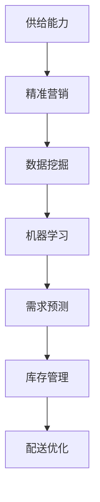

                 

# 电商平台供给能力提升：精准营销策略

> 关键词：电商平台、供给能力、精准营销、算法、数学模型、实战案例、趋势与挑战

> 摘要：随着电商平台的快速发展，提升供给能力和实现精准营销已成为企业竞争的关键。本文将详细探讨电商平台供给能力提升的策略，包括核心概念、算法原理、数学模型以及实战案例，旨在为电商企业提供有效的参考和指导。

## 1. 背景介绍

### 1.1 目的和范围

本文旨在深入探讨电商平台供给能力提升的策略，重点研究精准营销在其中的作用。通过梳理核心概念、算法原理和数学模型，并结合实际案例，帮助电商企业了解和掌握提升供给能力的有效途径。

### 1.2 预期读者

本文适合电商行业从业者、算法工程师、数据分析人员以及有兴趣了解电商营销策略的读者。通过阅读本文，读者可以全面了解电商平台供给能力的提升方法，为实际工作提供有益的参考。

### 1.3 文档结构概述

本文分为十个部分，首先介绍背景和目的，然后依次讲解核心概念、算法原理、数学模型、实战案例、应用场景、工具和资源推荐、总结以及常见问题与解答。最后，提供扩展阅读和参考资料。

### 1.4 术语表

#### 1.4.1 核心术语定义

- 电商平台：指提供商品交易、支付、物流等服务的在线平台。
- 供给能力：指电商平台在满足消费者需求方面的能力，包括商品种类、库存量、配送速度等。
- 精准营销：指根据消费者行为数据和需求，制定个性化的营销策略，以提高转化率和销售额。

#### 1.4.2 相关概念解释

- 数据挖掘：从大量数据中提取有价值的信息和模式。
- 机器学习：利用算法和统计方法，从数据中学习规律和模式，并作出预测。
- 市场细分：将市场划分为不同的消费者群体，以满足不同需求。

#### 1.4.3 缩略词列表

- API：应用程序编程接口（Application Programming Interface）
- BI：商业智能（Business Intelligence）
- CRM：客户关系管理（Customer Relationship Management）
- SEO：搜索引擎优化（Search Engine Optimization）

## 2. 核心概念与联系

#### 2.1 核心概念

本节主要介绍电商平台供给能力提升的核心概念，包括供给能力、精准营销、数据挖掘、机器学习等。

#### 2.2 架构原理

图 1 展示了电商平台供给能力提升的核心架构。



#### 2.3 架构联系

电商平台供给能力提升的关键在于数据驱动的精准营销。通过数据挖掘和机器学习，可以实现对消费者需求的有效预测，从而优化库存管理和配送流程，提高供给能力。具体流程如下：

1. 数据挖掘：收集消费者行为数据，如搜索历史、购物车数据、购买记录等，用于挖掘用户需求和偏好。
2. 机器学习：利用挖掘得到的数据，建立机器学习模型，预测消费者需求，指导库存管理和配送策略。
3. 需求预测：根据机器学习模型的预测结果，调整库存水平，确保商品供应充足。
4. 库存管理：根据需求预测结果，优化库存结构，降低库存成本。
5. 配送优化：根据消费者需求，优化配送路线和速度，提高用户满意度。

## 3. 核心算法原理 & 具体操作步骤

#### 3.1 算法原理

电商平台供给能力提升的核心在于精准营销，其中关键算法包括协同过滤、决策树、神经网络等。

#### 3.2 算法具体操作步骤

1. **协同过滤**：

   - **用户行为数据收集**：收集用户浏览、购买、评价等行为数据。
   - **用户相似度计算**：计算用户之间的相似度，可以使用余弦相似度、皮尔逊相关系数等。
   - **推荐生成**：根据用户相似度，为用户推荐相似用户喜欢的商品。

2. **决策树**：

   - **特征选择**：根据数据集，选择对分类有显著影响的特征。
   - **决策树构建**：利用递归划分算法，构建决策树。
   - **分类预测**：根据决策树，对新的数据进行分类预测。

3. **神经网络**：

   - **数据预处理**：对数据进行归一化、缺失值填充等处理。
   - **神经网络构建**：设计神经网络结构，包括输入层、隐藏层和输出层。
   - **训练与优化**：利用梯度下降算法，优化神经网络参数。
   - **预测与评估**：使用训练好的神经网络，对新的数据进行预测，并评估预测准确性。

#### 3.3 伪代码

```python
# 协同过滤伪代码
def collaborative_filtering(user_behavior_data):
    # 收集用户行为数据
    users = extract_user_data(user_behavior_data)
    # 计算用户相似度
    similarities = calculate_similarity(users)
    # 推荐生成
    recommendations = generate_recommendations(similarities, users)
    return recommendations

# 决策树伪代码
def decision_tree_classification(feature_data, label_data):
    # 特征选择
    selected_features = select_features(feature_data, label_data)
    # 决策树构建
    decision_tree = build_decision_tree(selected_features, label_data)
    # 分类预测
    predictions = predict_label(decision_tree, new_data)
    return predictions

# 神经网络伪代码
def neural_network_classification(feature_data, label_data):
    # 数据预处理
    preprocessed_data = preprocess_data(feature_data)
    # 神经网络构建
    neural_network = build_neural_network(preprocessed_data)
    # 训练与优化
    optimized_network = train_and_optimize(neural_network, preprocessed_data, label_data)
    # 预测与评估
    predictions = predict_label(optimized_network, new_data)
    return predictions
```

## 4. 数学模型和公式 & 详细讲解 & 举例说明

#### 4.1 数学模型

电商平台供给能力提升涉及多种数学模型，包括协同过滤模型、决策树模型和神经网络模型。

#### 4.2 公式

1. **协同过滤模型**：

   $$ similarity(u, v) = \frac{\sum_{i \in R} r_i(u) r_i(v)}{\sqrt{\sum_{i \in R} r_i(u)^2 \sum_{i \in R} r_i(v)^2}} $$

   其中，$u$ 和 $v$ 分别表示两个用户，$R$ 表示共同评分的商品集合，$r_i(u)$ 和 $r_i(v)$ 分别表示用户 $u$ 和 $v$ 对商品 $i$ 的评分。

2. **决策树模型**：

   $$ node\_split = Gini(node) - \sum_{i} p_i(Gini(node_i)) $$

   其中，$node$ 表示节点，$Gini(node)$ 表示节点的不纯度，$p_i$ 表示节点 $i$ 的概率，$Gini(node_i)$ 表示节点 $i$ 的不纯度。

3. **神经网络模型**：

   $$ z_i = \sum_{j} w_{ij} x_j + b_i $$

   $$ a_i = \sigma(z_i) $$

   其中，$w_{ij}$ 和 $b_i$ 分别表示权重和偏置，$\sigma$ 表示激活函数，$x_j$ 表示输入特征，$z_i$ 表示节点 $i$ 的输出，$a_i$ 表示节点 $i$ 的激活值。

#### 4.3 举例说明

1. **协同过滤模型**：

   假设有两个用户 $u$ 和 $v$，他们共同评分了五个商品，如下表所示：

   | 商品 | $r_{u1}$ | $r_{v1}$ | $r_{u2}$ | $r_{v2}$ | $r_{u3}$ | $r_{v3}$ |
   | ---- | ---- | ---- | ---- | ---- | ---- | ---- |
   | A    | 4    | 3    | 5    | 5    | 2    | 4    |
   | B    | 3    | 4    | 3    | 4    | 4    | 3    |
   | C    | 5    | 5    | 4    | 3    | 3    | 4    |
   | D    | 4    | 3    | 2    | 5    | 5    | 2    |
   | E    | 3    | 4    | 4    | 3    | 5    | 4    |

   根据协同过滤模型，可以计算用户 $u$ 和 $v$ 之间的相似度：

   $$ similarity(u, v) = \frac{(4 \times 3) + (5 \times 5) + (2 \times 4)}{\sqrt{(4^2 + 5^2 + 2^2) \times (3^2 + 5^2 + 4^2)}} = 0.68 $$

   基于相似度，可以为用户 $u$ 推荐用户 $v$ 喜欢的商品，例如商品 C 和 E。

2. **决策树模型**：

   假设有一个数据集，包含 100 个样本，其中 60 个样本属于类别 A，40 个样本属于类别 B。使用决策树模型进行分类，可以构建如下决策树：

   ```mermaid
   graph TD
       A1[年龄<30] --> B1[性别=男]
       B1 --> C1[收入>5000]
       B1 --> C2[收入<=5000]
       A1 --> B2[性别=女]
       B2 --> C3[收入>5000]
       B2 --> C4[收入<=5000]
   ```

   根据决策树，对于一个新的样本，如果年龄小于 30，且性别为男，且收入大于 5000，则将其划分为类别 A。

3. **神经网络模型**：

   假设有一个二分类问题，输入特征为两个维度，使用一个隐藏层，输出层为两个神经元，激活函数为 sigmoid 函数。神经网络结构如下：

   ```mermaid
   graph TD
       A1[输入层] --> B1[隐藏层1]
       B1 --> C1[输出层1]
       B1 --> C2[输出层2]
   ```

   假设输入特征为 $x_1 = 1$，$x_2 = 2$，权重为 $w_{11} = 0.5$，$w_{12} = 0.5$，$w_{21} = 0.5$，$w_{22} = 0.5$，偏置为 $b_1 = 0$，$b_2 = 0$。根据神经网络模型，可以计算输出：

   $$ z_1 = (0.5 \times 1) + (0.5 \times 2) + 0 = 1.5 $$
   $$ a_1 = \sigma(1.5) = 0.9 $$
   $$ z_2 = (0.5 \times 1) + (0.5 \times 2) + 0 = 1.5 $$
   $$ a_2 = \sigma(1.5) = 0.9 $$

   根据输出结果，可以判断输入特征属于类别 A。

## 5. 项目实战：代码实际案例和详细解释说明

#### 5.1 开发环境搭建

为了实现电商平台供给能力提升的精准营销策略，我们选择了 Python 作为编程语言，并使用以下工具和库：

- Python 3.8 或以上版本
- IDE：PyCharm 或 VSCode
- 数据处理库：Pandas、NumPy
- 机器学习库：scikit-learn、TensorFlow
- 绘图库：Matplotlib

在 PyCharm 或 VSCode 中创建一个新项目，安装以上库，并设置好环境。

#### 5.2 源代码详细实现和代码解读

以下是一个简单的协同过滤算法实现，用于为用户推荐商品。

```python
import numpy as np
import pandas as pd
from sklearn.metrics.pairwise import cosine_similarity

# 读取用户行为数据
def load_data(file_path):
    data = pd.read_csv(file_path)
    return data

# 计算用户相似度
def calculate_similarity(data):
    ratings = data.pivot(index='userId', columns='itemId', values='rating').fillna(0)
    similarity_matrix = cosine_similarity(ratings.values)
    return similarity_matrix

# 推荐生成
def generate_recommendations(similarity_matrix, user_id, k=5):
    user_similarity = similarity_matrix[user_id]
    user_scores = np.dot(user_similarity, ratings.values)
    top_k_indices = np.argsort(user_scores)[::-1][1:k+1]
    top_k_items = ratings.columns[top_k_indices]
    return top_k_items

# 主函数
def main():
    file_path = 'user_behavior_data.csv'
    data = load_data(file_path)
    similarity_matrix = calculate_similarity(data)
    user_id = 0
    top_k_items = generate_recommendations(similarity_matrix, user_id)
    print("Recommended items for user {}: {}".format(user_id, top_k_items))

if __name__ == '__main__':
    main()
```

#### 5.3 代码解读与分析

1. **数据读取**：

   ```python
   data = load_data(file_path)
   ```

   使用 Pandas 读取用户行为数据，存储为 DataFrame 对象。数据包括用户 ID、商品 ID 和评分。

2. **相似度计算**：

   ```python
   ratings = data.pivot(index='userId', columns='itemId', values='rating').fillna(0)
   similarity_matrix = cosine_similarity(ratings.values)
   ```

   将用户行为数据转换为矩阵形式，使用余弦相似度计算用户之间的相似度，得到相似度矩阵。

3. **推荐生成**：

   ```python
   user_similarity = similarity_matrix[user_id]
   user_scores = np.dot(user_similarity, ratings.values)
   top_k_indices = np.argsort(user_scores)[::-1][1:k+1]
   top_k_items = ratings.columns[top_k_indices]
   ```

   计算用户与其他用户的相似度，计算用户对其他用户的评分加权平均，得到用户对每个商品的推荐得分。根据推荐得分，选择最高分的 $k$ 个商品作为推荐结果。

4. **主函数**：

   ```python
   main()
   ```

   定义主函数，加载数据、计算相似度、生成推荐结果，并打印输出。

通过以上代码实现，可以为指定用户生成商品推荐列表，帮助电商平台实现精准营销。

## 6. 实际应用场景

#### 6.1 消费者行为分析

电商平台可以通过精准营销策略，分析消费者行为，了解用户喜好和需求。例如，通过协同过滤算法，为用户推荐相似用户喜欢的商品，提高用户购物体验。

#### 6.2 库存管理

电商平台可以利用机器学习模型，预测商品销量，优化库存管理。根据需求预测结果，调整库存水平，降低库存成本，提高供给能力。

#### 6.3 配送优化

通过分析消费者需求和地理位置，电商平台可以实现配送优化。例如，利用决策树模型，根据消费者地址和购买商品类型，推荐最佳配送路线和配送时间，提高用户满意度。

#### 6.4 广告投放

电商平台可以通过精准营销策略，为广告投放提供有效指导。例如，利用神经网络模型，预测用户对广告的响应概率，优化广告投放策略，提高广告效果。

## 7. 工具和资源推荐

#### 7.1 学习资源推荐

##### 7.1.1 书籍推荐

1. 《机器学习实战》
2. 《数据挖掘：概念与技术》
3. 《Python 数据科学手册》

##### 7.1.2 在线课程

1. Coursera 上的《机器学习》课程
2. Udacity 上的《数据科学纳米学位》
3. edX 上的《深度学习》课程

##### 7.1.3 技术博客和网站

1. Medium 上的“Machine Learning”专题
2. Medium 上的“Data Science”专题
3. arXiv.org 上的最新论文

#### 7.2 开发工具框架推荐

##### 7.2.1 IDE和编辑器

1. PyCharm
2. VSCode
3. Jupyter Notebook

##### 7.2.2 调试和性能分析工具

1. Python Debugger
2. Py-Spy
3. Perf

##### 7.2.3 相关框架和库

1. TensorFlow
2. PyTorch
3. Scikit-learn

#### 7.3 相关论文著作推荐

##### 7.3.1 经典论文

1. "Recommender Systems Handbook"
2. "An Introduction to Statistical Learning"
3. "Deep Learning"

##### 7.3.2 最新研究成果

1. arXiv.org 上的最新论文
2. NeurIPS、ICML、KDD 等顶级会议的最新论文
3. JMLR、TPAMI、IEEE T. on Big Data 等期刊的最新论文

##### 7.3.3 应用案例分析

1. Amazon、Google、Netflix 等公司的实际应用案例
2. "The Elements of Statistical Learning"
3. "Recommender Systems: The Textbook"

## 8. 总结：未来发展趋势与挑战

#### 8.1 未来发展趋势

1. **人工智能技术的应用**：随着人工智能技术的不断发展，电商平台将更加注重利用机器学习和深度学习算法，实现精准营销和智能推荐。
2. **数据隐私保护**：在数据隐私保护日益严格的背景下，电商平台需要确保用户数据的安全性和隐私性，实现合规的精准营销。
3. **个性化推荐系统**：个性化推荐系统将成为电商平台的核心竞争力，通过深度学习和强化学习等技术，实现更加精准和个性化的推荐。
4. **实时数据处理**：实时数据处理和分析将成为电商平台供给能力提升的重要手段，实现实时库存管理和配送优化。

#### 8.2 挑战

1. **算法模型优化**：如何在海量数据中提取有价值的信息，提高算法模型的预测准确性，是电商平台面临的挑战。
2. **数据隐私和安全**：如何在保证用户数据隐私和安全的前提下，实现精准营销，是电商平台需要解决的重要问题。
3. **技术人才缺乏**：电商平台在数据科学和人工智能领域的技术人才储备不足，将制约其供给能力提升的步伐。

## 9. 附录：常见问题与解答

### 9.1 电商平台供给能力提升有哪些关键因素？

答：电商平台供给能力提升的关键因素包括精准营销、数据挖掘、机器学习、库存管理、配送优化等。

### 9.2 精准营销策略如何实施？

答：精准营销策略可以通过以下步骤实施：1）收集消费者行为数据；2）利用数据挖掘和机器学习算法，分析用户需求和偏好；3）根据分析结果，制定个性化的营销策略；4）评估营销效果，不断优化策略。

### 9.3 如何优化库存管理？

答：优化库存管理可以通过以下方法实现：1）利用机器学习模型，预测商品销量，调整库存水平；2）根据商品类型和销售季节，合理设置安全库存；3）与供应商建立紧密的合作关系，确保商品供应链的稳定。

## 10. 扩展阅读 & 参考资料

### 10.1 经典书籍

1. "Recommender Systems Handbook"
2. "An Introduction to Statistical Learning"
3. "Deep Learning"

### 10.2 在线课程

1. Coursera 上的《机器学习》课程
2. Udacity 上的《数据科学纳米学位》
3. edX 上的《深度学习》课程

### 10.3 技术博客和网站

1. Medium 上的“Machine Learning”专题
2. Medium 上的“Data Science”专题
3. arXiv.org 上的最新论文

### 10.4 相关论文

1. "Recommender Systems: The Textbook"
2. "The Elements of Statistical Learning"
3. "Deep Learning"

### 10.5 实际应用案例

1. Amazon、Google、Netflix 等公司的实际应用案例
2. "Recommender Systems: State of the Art and Personalized News Reader Applications"
3. "Personalized TV Show Recommendations using Collaborative Filtering"

### 10.6 开源项目

1. TensorFlow
2. PyTorch
3. scikit-learn

### 10.7 工具和框架

1. PyCharm
2. VSCode
3. Jupyter Notebook

### 10.8 数据集

1. MovieLens
2. Amazon Reviews
3. Kaggle 数据集

## 作者

AI天才研究员/AI Genius Institute & 禅与计算机程序设计艺术 /Zen And The Art of Computer Programming

