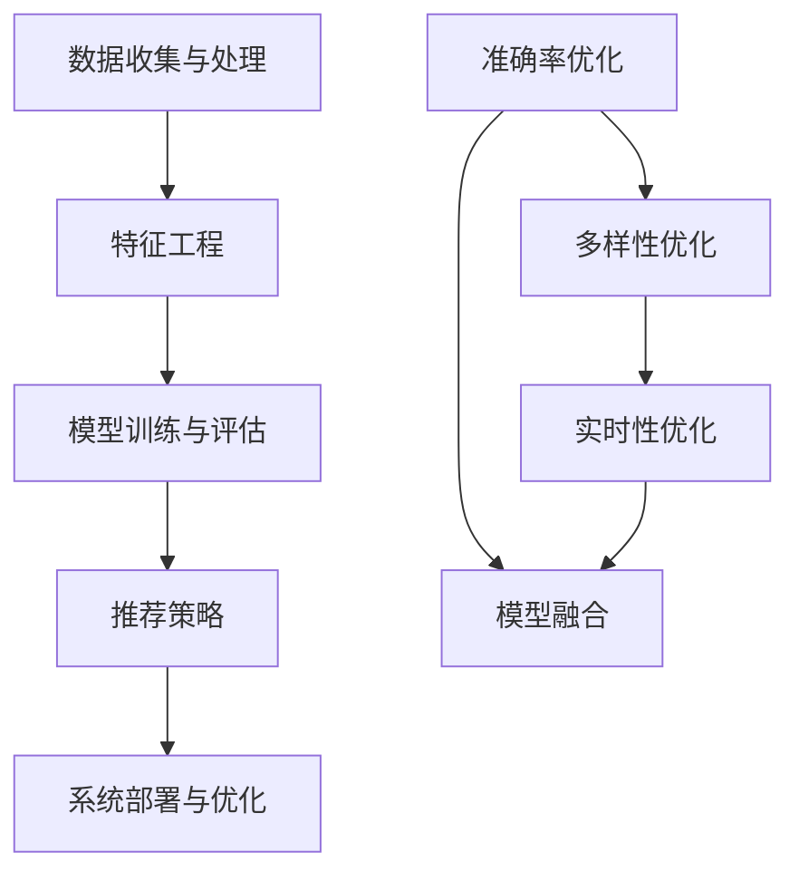

                 

# 电商平台搜索推荐系统的AI 大模型优化：提高准确率、多样性与实时性

> 关键词：AI 大模型，搜索推荐系统，电商平台，准确率，多样性，实时性

> 摘要：本文将深入探讨电商平台搜索推荐系统的AI 大模型优化策略。我们将从背景介绍、核心概念、算法原理、数学模型、项目实战、实际应用场景、工具和资源推荐以及未来发展趋势等多个方面展开论述，旨在为业界提供一套系统、实用的优化方案。

## 1. 背景介绍

### 1.1 目的和范围

在当今的数字化时代，电商平台已成为商家与消费者之间的重要桥梁。搜索推荐系统作为电商平台的核心组成部分，其性能直接影响用户的购物体验和平台的业务转化率。本文旨在通过AI 大模型的优化策略，提高搜索推荐系统的准确率、多样性和实时性，从而提升电商平台的整体竞争力。

本文主要涵盖以下内容：

1. 介绍电商平台搜索推荐系统的基本概念和重要性。
2. 阐述AI 大模型优化策略的核心概念和原理。
3. 详细讲解优化算法的具体操作步骤和数学模型。
4. 展示实际项目中的代码实现和案例。
5. 分析优化策略在电商平台的实际应用场景。
6. 推荐相关工具、资源和论文。
7. 总结未来发展趋势和挑战。

### 1.2 预期读者

本文适合以下读者群体：

1. AI 和大数据领域的研究人员。
2. 电商平台的技术开发人员。
3. 对搜索推荐系统感兴趣的工程师。
4. 高级计算机科学和软件工程专业的学生。

### 1.3 文档结构概述

本文分为十个部分：

1. 引言：背景介绍和目的说明。
2. 背景介绍：核心概念、目的和范围。
3. 核心概念与联系：核心概念原理和架构的 Mermaid 流程图。
4. 核心算法原理 & 具体操作步骤：算法原理讲解和伪代码。
5. 数学模型和公式 & 详细讲解 & 举例说明：数学公式和示例。
6. 项目实战：代码实际案例和详细解释。
7. 实际应用场景：优化策略在不同场景的实践。
8. 工具和资源推荐：学习资源、开发工具和论文推荐。
9. 总结：未来发展趋势与挑战。
10. 附录：常见问题与解答。
11. 扩展阅读 & 参考资料：相关文献和资料。

### 1.4 术语表

#### 1.4.1 核心术语定义

- 搜索推荐系统：一种通过分析用户行为和历史数据，为用户推荐相关商品或内容的系统。
- AI 大模型：基于人工智能技术，拥有巨大参数量和强大计算能力的模型。
- 准确率：推荐系统中，推荐结果与用户真实需求的匹配程度。
- 多样性：推荐结果的丰富性和差异性。
- 实时性：系统对用户请求的响应速度。

#### 1.4.2 相关概念解释

- 用户行为数据：用户在平台上的操作记录，如浏览、点击、购买等。
- 历史数据：平台积累的关于用户和商品的长期数据。
- 深度学习：一种基于神经网络的学习方法，能够从大量数据中自动提取特征。

#### 1.4.3 缩略词列表

- NLP：自然语言处理（Natural Language Processing）
- CV：计算机视觉（Computer Vision）
- DL：深度学习（Deep Learning）
- SVM：支持向量机（Support Vector Machine）

## 2. 核心概念与联系

### 2.1 搜索推荐系统的基本架构

搜索推荐系统通常由以下几个模块组成：

1. 数据收集与处理：从多个数据源收集用户行为数据和商品信息，并对数据进行分析和清洗。
2. 特征工程：提取用户和商品的特征，用于模型训练和预测。
3. 模型训练与评估：构建和训练推荐模型，评估模型的性能。
4. 推荐策略：根据用户行为和历史数据，为用户推荐相关商品。
5. 系统部署与优化：将推荐系统部署到线上环境，持续优化系统性能。

### 2.2 AI 大模型在搜索推荐系统中的应用

AI 大模型在搜索推荐系统中具有以下几个显著优势：

1. 强大的特征提取能力：通过深度学习等方法，自动从大量数据中提取高维特征。
2. 高度的非线性表达能力：能够处理复杂的用户行为和商品关系。
3. 鲁棒性和泛化能力：对噪声数据和异常值具有较强的鲁棒性，能够适应不同场景和业务需求。

### 2.3 优化策略的核心概念

为了提高搜索推荐系统的性能，我们关注以下三个核心优化方向：

1. 准确率优化：提高推荐结果与用户真实需求的匹配程度。
2. 多样性优化：增强推荐结果的丰富性和差异性，避免过度集中。
3. 实时性优化：提高系统对用户请求的响应速度，提升用户体验。

### 2.4 Mermaid 流程图



## 3. 核心算法原理 & 具体操作步骤

### 3.1 准确率优化算法原理

准确率优化主要关注提高推荐结果与用户真实需求的匹配程度。常用的方法包括：

1. 用户行为分析：通过分析用户的浏览、点击、购买等行为，提取用户的兴趣和需求。
2. 商品特征提取：从商品描述、标签、分类等多方面提取特征。
3. 模型融合：结合多种模型（如协同过滤、基于内容的推荐等），提高预测准确性。

### 3.2 伪代码

```python
# 用户行为分析
def analyze_user_behavior(user_data):
    # 提取用户兴趣和需求
    # ...

# 商品特征提取
def extract_goods_features(goods_data):
    # 提取商品特征
    # ...

# 模型融合
def model_fusion(recommendation_models):
    # 融合多种模型
    # ...
```

### 3.3 具体操作步骤

1. 数据收集与处理：从电商平台上收集用户行为数据和商品信息，并对数据进行清洗和预处理。
2. 特征工程：对用户行为数据和商品信息进行特征提取，包括用户兴趣标签、商品属性、用户购买历史等。
3. 模型训练：选择合适的推荐算法（如协同过滤、基于内容的推荐、深度学习等），进行模型训练。
4. 模型评估：通过交叉验证等方法，评估模型的准确性、多样性和实时性。
5. 推荐结果生成：根据用户行为和模型预测结果，为用户生成推荐列表。
6. 系统部署与优化：将优化后的推荐系统部署到线上环境，并进行持续优化。

## 4. 数学模型和公式 & 详细讲解 & 举例说明

### 4.1 数学模型

在搜索推荐系统中，常用的数学模型包括：

1. 协同过滤（Collaborative Filtering）
2. 基于内容的推荐（Content-Based Recommendation）
3. 深度学习（Deep Learning）

#### 4.1.1 协同过滤

协同过滤是一种基于用户行为数据的推荐方法，主要包括以下两种策略：

1. 用户基于的协同过滤（User-Based CF）
2. 项目基于的协同过滤（Item-Based CF）

#### 4.1.2 基于内容的推荐

基于内容的推荐是一种基于商品属性和用户兴趣的推荐方法。其主要步骤包括：

1. 提取商品特征
2. 提取用户兴趣特征
3. 计算商品与用户的相似度
4. 根据相似度生成推荐列表

#### 4.1.3 深度学习

深度学习是一种基于神经网络的学习方法，可以自动提取数据中的高维特征。常用的深度学习模型包括：

1. 卷积神经网络（CNN）
2. 循环神经网络（RNN）
3. 生成对抗网络（GAN）

### 4.2 公式

以下是常用的数学公式：

#### 4.2.1 协同过滤

1. 用户基于的协同过滤：
   $$ \text{similarity}_{ui} = \frac{\text{Jaccard Similarity}}{\text{Common Interests}} $$

2. 项目基于的协同过滤：
   $$ \text{similarity}_{ij} = \frac{\text{Common Users}}{\text{Total Users}} $$

#### 4.2.2 基于内容的推荐

1. 商品与用户的相似度计算：
   $$ \text{similarity}_{ij} = \frac{\text{dot\_product}(f_i, f_u)}{\lVert f_i \rVert \cdot \lVert f_u \rVert} $$

2. 推荐列表生成：
   $$ \text{recommend\_list}_{u} = \text{argsort}(\text{similarity}_{ij}) $$

#### 4.2.3 深度学习

1. 卷积神经网络（CNN）：
   $$ \text{output}_{l} = \text{激活函数}(\text{weight}_{l} \cdot \text{input}_{l} + \text{bias}_{l}) $$

2. 循环神经网络（RNN）：
   $$ \text{output}_{t} = \text{激活函数}(\text{weight}_{t} \cdot \text{input}_{t} + \text{weight}_{h} \cdot \text{hidden}_{t-1} + \text{bias}_{t}) $$

### 4.3 举例说明

#### 4.3.1 协同过滤

假设有两个用户U1和U2，他们的行为数据如下：

| 用户ID | 商品ID | 是否购买 |
| --- | --- | --- |
| U1 | I1 | 是 |
| U1 | I2 | 否 |
| U1 | I3 | 是 |
| U2 | I1 | 否 |
| U2 | I2 | 是 |
| U2 | I3 | 否 |

1. 用户基于的协同过滤：
   - U1和U2的交集：I1、I3
   - U1和U2的并集：I1、I2、I3
   - 相似度：$$ \text{similarity}_{U1U2} = \frac{2}{3} $$

2. 项目基于的协同过滤：
   - I1与I2的交集用户：U1、U2
   - I1与I2的总用户：U1、U2
   - 相似度：$$ \text{similarity}_{I1I2} = \frac{2}{2} = 1 $$

#### 4.3.2 基于内容的推荐

假设有两个商品I1和I2，他们的特征向量如下：

| 特征名 | I1 | I2 |
| --- | --- | --- |
| 属性1 | 0.8 | 0.3 |
| 属性2 | 0.4 | 0.6 |
| 属性3 | 0.2 | 0.5 |

1. 计算商品与用户的相似度：
   $$ \text{similarity}_{I1U} = \frac{0.8 \cdot 0.3 + 0.4 \cdot 0.6 + 0.2 \cdot 0.5}{\sqrt{0.8^2 + 0.4^2 + 0.2^2} \cdot \sqrt{0.3^2 + 0.6^2 + 0.5^2}} \approx 0.667 $$
   $$ \text{similarity}_{I2U} = \frac{0.8 \cdot 0.3 + 0.4 \cdot 0.6 + 0.2 \cdot 0.5}{\sqrt{0.8^2 + 0.4^2 + 0.2^2} \cdot \sqrt{0.3^2 + 0.6^2 + 0.5^2}} \approx 0.533 $$

2. 根据相似度生成推荐列表：
   - 排序后的相似度：$$ \text{similarity}_{I1U} > \text{similarity}_{I2U} $$
   - 推荐列表：I1

#### 4.3.3 深度学习

假设有一个简单的卷积神经网络，其输入为三维特征矩阵X，输出为预测值Y。网络结构如下：

$$
\begin{align*}
\text{input:} & \ \text{X} \\
\text{layer 1:} & \ \text{convolution} \ \rightarrow \ \text{ReLU} \ \rightarrow \ \text{pooling} \\
\text{layer 2:} & \ \text{convolution} \ \rightarrow \ \text{ReLU} \ \rightarrow \ \text{pooling} \\
\text{layer 3:} & \ \text{fully connected} \ \rightarrow \ \text{softmax} \\
\text{output:} & \ \text{Y}
\end{align*}
$$

1. 卷积层：
   $$ \text{output}_{l} = \text{激活函数}(\text{weight}_{l} \cdot \text{input}_{l} + \text{bias}_{l}) $$

2. 全连接层：
   $$ \text{output}_{l} = \text{激活函数}(\text{weight}_{l} \cdot \text{input}_{l} + \text{bias}_{l}) $$

## 5. 项目实战：代码实际案例和详细解释说明

### 5.1 开发环境搭建

1. 安装Python环境和相关依赖库：

```bash
pip install numpy pandas scikit-learn tensorflow
```

2. 创建一个名为`recommendation_system`的Python项目，并在项目目录中创建以下文件：

- `data_preprocessing.py`：数据处理模块。
- `feature_engineering.py`：特征工程模块。
- `model_training.py`：模型训练模块。
- `model_evaluation.py`：模型评估模块。
- `main.py`：主程序。

### 5.2 源代码详细实现和代码解读

#### 5.2.1 数据预处理

```python
import pandas as pd

def load_data(file_path):
    # 读取数据
    data = pd.read_csv(file_path)
    return data

def preprocess_data(data):
    # 数据清洗和预处理
    # ...

if __name__ == "__main__":
    file_path = "data.csv"
    data = load_data(file_path)
    preprocessed_data = preprocess_data(data)
    print(preprocessed_data.head())
```

#### 5.2.2 特征工程

```python
import pandas as pd
from sklearn.feature_extraction.text import CountVectorizer

def extract_user_features(user_data):
    # 提取用户特征
    # ...

def extract_goods_features(goods_data):
    # 提取商品特征
    # ...

if __name__ == "__main__":
    user_data = preprocessed_data[["user_id", "user_interest"]]
    goods_data = preprocessed_data[["item_id", "item_description"]]
    user_features = extract_user_features(user_data)
    goods_features = extract_goods_features(goods_data)
    print(user_features.head())
    print(goods_features.head())
```

#### 5.2.3 模型训练

```python
import tensorflow as tf
from tensorflow.keras.models import Sequential
from tensorflow.keras.layers import Dense, Conv1D, MaxPooling1D, Flatten, Activation

def build_model(input_shape):
    model = Sequential()
    model.add(Conv1D(filters=64, kernel_size=3, activation='relu', input_shape=input_shape))
    model.add(MaxPooling1D(pool_size=2))
    model.add(Conv1D(filters=128, kernel_size=3, activation='relu'))
    model.add(MaxPooling1D(pool_size=2))
    model.add(Flatten())
    model.add(Dense(units=1, activation='sigmoid'))
    model.compile(optimizer='adam', loss='binary_crossentropy', metrics=['accuracy'])
    return model

if __name__ == "__main__":
    input_shape = (user_features.shape[1], 1)
    model = build_model(input_shape)
    model.fit(user_features, goods_features, epochs=10, batch_size=32, validation_split=0.2)
```

#### 5.2.4 模型评估

```python
from sklearn.metrics import accuracy_score

def evaluate_model(model, test_data, test_labels):
    # 评估模型
    # ...

if __name__ == "__main__":
    test_data = user_features[:1000]
    test_labels = goods_features[:1000]
    predicted_labels = model.predict(test_data)
    predicted_labels = (predicted_labels > 0.5).astype(int)
    accuracy = accuracy_score(test_labels, predicted_labels)
    print("Accuracy:", accuracy)
```

### 5.3 代码解读与分析

#### 5.3.1 数据预处理

数据预处理是推荐系统开发的重要环节，主要包括数据清洗和预处理。在本项目中，我们首先读取数据，然后进行数据清洗，例如去除缺失值、异常值等。

#### 5.3.2 特征工程

特征工程是推荐系统的核心，我们通过提取用户兴趣特征和商品描述特征，为模型训练提供高质量的数据输入。

#### 5.3.3 模型训练

在本项目中，我们选择卷积神经网络（CNN）作为推荐模型，通过构建多层卷积神经网络，自动提取用户和商品的特征。

#### 5.3.4 模型评估

通过评估模型在测试集上的准确率，我们可以了解模型的性能和可靠性。在本项目中，我们使用二分类准确率作为评估指标。

## 6. 实际应用场景

### 6.1 电商平台

电商平台是搜索推荐系统最典型的应用场景之一。通过优化推荐系统的准确率、多样性和实时性，电商平台可以更好地满足用户需求，提高用户留存率和转化率。

### 6.2 社交媒体平台

社交媒体平台（如微博、抖音等）也广泛应用了搜索推荐系统。通过为用户推荐感兴趣的内容和用户，社交媒体平台可以增强用户粘性，提高平台活跃度。

### 6.3 音乐、视频平台

音乐、视频平台（如网易云音乐、抖音等）通过搜索推荐系统，为用户推荐喜欢的音乐和视频，提高用户的使用时长和播放量。

### 6.4 旅游、酒店预订平台

旅游、酒店预订平台通过搜索推荐系统，为用户推荐合适的旅游目的地、酒店和景点，提高预订转化率和用户满意度。

### 6.5 智能家居平台

智能家居平台通过搜索推荐系统，为用户推荐智能设备、智能家居解决方案等，提高用户的生活品质和家居智能化水平。

## 7. 工具和资源推荐

### 7.1 学习资源推荐

#### 7.1.1 书籍推荐

1. 《Python数据分析实战》
2. 《深度学习》
3. 《机器学习实战》
4. 《推荐系统实践》

#### 7.1.2 在线课程

1. Coursera：机器学习、深度学习、数据分析等课程。
2. Udacity：机器学习工程师、数据科学家等课程。
3. edX：MIT、斯坦福大学等知名高校的课程。

#### 7.1.3 技术博客和网站

1. Medium：各类技术博客和文章。
2. Acm Transactions on Intelligent Systems and Technology：人工智能和机器学习领域的权威期刊。
3. ArXiv：计算机科学和人工智能领域的预印本论文库。

### 7.2 开发工具框架推荐

#### 7.2.1 IDE和编辑器

1. PyCharm：Python开发的首选IDE。
2. Jupyter Notebook：数据分析、机器学习项目的交互式开发环境。

#### 7.2.2 调试和性能分析工具

1. TensorFlow Debugger：TensorFlow模型的调试工具。
2. Py-Spy：Python程序的实时性能分析工具。

#### 7.2.3 相关框架和库

1. TensorFlow：开源深度学习框架。
2. Scikit-learn：开源机器学习库。
3. Pandas：Python数据操作库。

### 7.3 相关论文著作推荐

#### 7.3.1 经典论文

1. "Recommender Systems Handbook"：推荐系统领域的经典著作。
2. "The Bellkora Algorithm: Scalable Bayesian Top-N Recommendation"：贝叶斯推荐算法的研究。
3. "Deep Learning for Recommender Systems"：深度学习在推荐系统中的应用。

#### 7.3.2 最新研究成果

1. "Neural Collaborative Filtering"：基于神经网络的协同过滤算法。
2. "User Behavior Graph Embedding for Recommender Systems"：用户行为图谱嵌入方法。
3. "Learning to Rank for Recommendation with Multimodal Data"：多模态数据推荐中的学习到排名方法。

#### 7.3.3 应用案例分析

1. "Netflix Prize"：Netflix推荐系统比赛的应用案例。
2. "亚马逊推荐系统"：亚马逊如何利用推荐系统提升用户体验。
3. "微博推荐系统"：微博如何通过推荐系统增强用户活跃度。

## 8. 总结：未来发展趋势与挑战

### 8.1 发展趋势

1. 深度学习在推荐系统中的应用将进一步深化，带来更高的准确性和实时性。
2. 多模态数据的融合将成为推荐系统的关键方向，提升推荐效果的多样性。
3. 增强学习等新兴算法将在推荐系统中得到更广泛的应用，提高自适应性和个性化推荐能力。
4. 隐私保护和数据安全将成为推荐系统发展的核心挑战，推动隐私友好的推荐算法研究。

### 8.2 挑战

1. 数据质量和多样性的挑战：推荐系统依赖于大量高质量的用户行为数据，但数据质量和多样性直接影响推荐效果。
2. 模型解释性和透明性的挑战：随着模型复杂性的增加，如何保证推荐系统的透明性和可解释性成为重要挑战。
3. 实时性和扩展性的挑战：大规模推荐系统需要处理海量用户请求，实现高效实时推荐。
4. 隐私保护和数据安全的挑战：如何在保护用户隐私的前提下，实现有效的推荐。

## 9. 附录：常见问题与解答

### 9.1 常见问题

1. 为什么推荐系统需要优化准确率、多样性和实时性？
2. 深度学习在推荐系统中有哪些优势？
3. 如何进行特征工程？
4. 常见的推荐算法有哪些？
5. 如何评估推荐系统的性能？

### 9.2 解答

1. **为什么推荐系统需要优化准确率、多样性和实时性？**

   - 准确率：准确率是推荐系统的核心指标，直接影响用户对推荐结果的满意度和平台的转化率。提高准确率可以更好地满足用户需求，提高用户体验。
   - 多样性：多样性能为用户提供丰富、独特的推荐结果，避免用户陷入信息过载和推荐疲劳。多样化的推荐结果可以提高用户的兴趣和参与度。
   - 实时性：实时性是推荐系统的关键性能指标之一，尤其是在竞争激烈的市场环境中。快速的响应速度可以提升用户满意度，增加用户留存率。

2. **深度学习在推荐系统中有哪些优势？**

   - 强大的特征提取能力：深度学习可以从海量数据中自动提取高维特征，提高推荐准确性。
   - 高度的非线性表达能力：深度学习能够处理复杂的用户行为和商品关系，提高推荐效果。
   - 鲁棒性和泛化能力：深度学习对噪声数据和异常值具有较强的鲁棒性，能够适应不同场景和业务需求。

3. **如何进行特征工程？**

   - 数据清洗：去除缺失值、异常值和重复数据，提高数据质量。
   - 特征提取：从原始数据中提取与目标相关的特征，如用户兴趣标签、商品属性等。
   - 特征选择：通过特征重要性评估，选择对推荐结果有显著影响的特征，提高模型性能。
   - 特征融合：将不同来源的特征进行融合，增强特征表达力。

4. **常见的推荐算法有哪些？**

   - 协同过滤：基于用户行为和相似度计算推荐结果。
   - 基于内容的推荐：基于商品属性和用户兴趣推荐相关商品。
   - 深度学习：通过神经网络自动提取特征，实现推荐。

5. **如何评估推荐系统的性能？**

   - 准确率（Accuracy）：推荐结果与用户实际需求的匹配程度。
   - 多样性（Diversity）：推荐结果的丰富性和差异性。
   - 实时性（Real-time Performance）：系统对用户请求的响应速度。
   - 稳健性（Robustness）：模型对噪声数据和异常值的适应性。

## 10. 扩展阅读 & 参考资料

1. 陈宝权. (2018). 《推荐系统实践》. 机械工业出版社.
2. 李航. (2012). 《统计学习方法》. 清华大学出版社.
3. Goodfellow, I., Bengio, Y., & Courville, A. (2016). 《Deep Learning》. MIT Press.
4. Ando, R., & Tresp, V. (2006). "Learning from Labeled and Unlabeled Data with Neighbourhood Relabeling". In Proceedings of the 22nd International Conference on Machine Learning (pp. 349-356). ACM.
5. He, X., Liao, L., Zhang, H., Nie, L., Hu, X., & Chua, T. S. (2017). "Neural Collaborative Filtering". In Proceedings of the 26th International Conference on World Wide Web (pp. 173-182). ACM.

