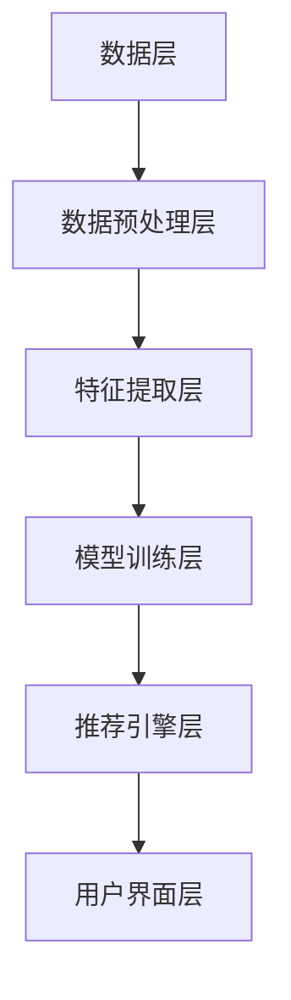
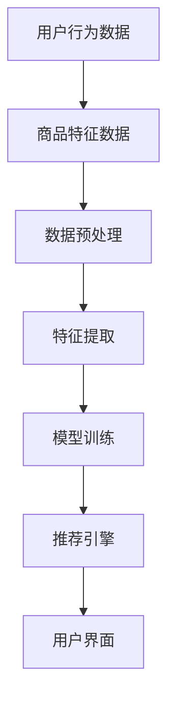
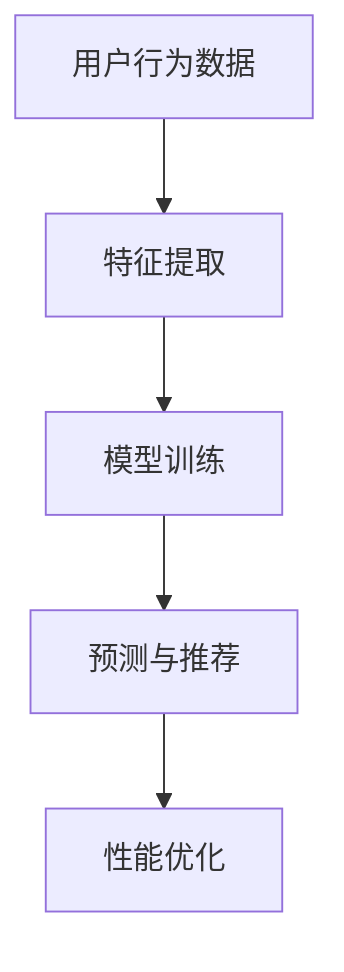

                 

# 电商平台搜索推荐系统的AI 大模型应用：提高系统性能、效率与转化率

> **关键词**：人工智能，搜索推荐系统，大模型，性能优化，转化率提升
>
> **摘要**：本文深入探讨了电商平台搜索推荐系统中人工智能大模型的应用，通过详细分析核心概念、算法原理、数学模型以及项目实战，阐述了如何利用AI技术提升系统性能、效率和用户转化率，为电商行业提供创新性的解决方案。

## 1. 背景介绍

### 1.1 目的和范围

随着互联网技术的飞速发展，电商平台已经成为现代商业活动中不可或缺的一环。然而，随着商品种类和用户数量的不断增加，传统的搜索推荐系统面临着巨大的挑战。本文旨在探讨如何通过引入人工智能大模型，解决电商平台搜索推荐系统中的性能、效率和转化率问题。

本文将重点关注以下几个方面：
- 人工智能大模型在搜索推荐系统中的应用
- 核心概念和算法原理的详细介绍
- 数学模型和公式的详细讲解
- 项目实战中的代码实现和解释分析
- 实际应用场景的探索和工具资源的推荐

### 1.2 预期读者

本文适合以下读者群体：
- 具有计算机科学和人工智能背景的技术人员
- 想要了解和掌握人工智能在搜索推荐系统应用的开发者
- 电商平台的运营管理人员，以及对技术驱动商业有兴趣的从业者

### 1.3 文档结构概述

本文将按照以下结构进行阐述：

1. 背景介绍：本文的背景、目的和读者对象
2. 核心概念与联系：介绍搜索推荐系统的基础知识
3. 核心算法原理 & 具体操作步骤：详细讲解AI大模型在搜索推荐系统中的应用
4. 数学模型和公式 & 详细讲解 & 举例说明：介绍与算法相关的数学模型和公式
5. 项目实战：通过实际案例展示AI大模型的应用
6. 实际应用场景：探讨AI大模型在电商搜索推荐系统中的实际应用
7. 工具和资源推荐：推荐学习资源和开发工具
8. 总结：对未来发展趋势和挑战的展望
9. 附录：常见问题与解答
10. 扩展阅读 & 参考资料：提供进一步学习的资源

### 1.4 术语表

#### 1.4.1 核心术语定义

- **人工智能（AI）**：指使计算机具有人类智能水平的技术和理论。
- **搜索推荐系统**：通过分析用户行为和商品特征，为用户推荐相关商品或内容。
- **大模型**：指具有海量参数的深度学习模型，能够在复杂任务中表现出色。
- **性能优化**：通过改进算法和数据结构，提高系统的处理速度和资源利用率。
- **转化率**：指用户行为转化为实际购买的概率。

#### 1.4.2 相关概念解释

- **用户行为数据**：用户在平台上的浏览、搜索、购买等行为数据。
- **商品特征数据**：商品的价格、分类、品牌、销量等描述信息。
- **推荐算法**：基于用户行为和商品特征，生成个性化推荐列表的算法。
- **数据预处理**：对原始数据进行清洗、转换和归一化等处理，以提高数据质量和算法性能。

#### 1.4.3 缩略词列表

- **AI**：人工智能（Artificial Intelligence）
- **ML**：机器学习（Machine Learning）
- **DL**：深度学习（Deep Learning）
- **NLP**：自然语言处理（Natural Language Processing）
- **CUI**：计算机视觉（Computer Vision）
- **GPU**：图形处理器（Graphics Processing Unit）

## 2. 核心概念与联系

在深入探讨AI大模型在电商平台搜索推荐系统中的应用之前，我们需要理解一些核心概念和它们之间的关系。

### 2.1 搜索推荐系统架构

首先，我们来看一个简化的搜索推荐系统架构，它主要由以下几个部分组成：

1. **数据层**：包括用户行为数据、商品特征数据等。
2. **数据预处理层**：对原始数据进行清洗、转换和归一化等处理。
3. **特征提取层**：从预处理后的数据中提取有用特征。
4. **模型训练层**：使用特征数据训练深度学习模型。
5. **推荐引擎层**：根据用户行为和模型预测生成推荐列表。
6. **用户界面层**：将推荐结果展示给用户。

下面是一个基于Mermaid的流程图，展示了搜索推荐系统的基本架构：



### 2.2 用户行为与商品特征数据

用户行为数据主要包括用户的浏览记录、搜索历史、购买记录等。这些数据反映了用户的兴趣和行为模式，是构建个性化推荐的基础。

商品特征数据则描述了商品的各种属性，如价格、分类、品牌、销量、评价等。这些特征有助于模型理解商品的差异性和用户的需求。

用户行为数据与商品特征数据之间的关系可以用以下Mermaid流程图表示：



### 2.3 人工智能大模型的作用

人工智能大模型在搜索推荐系统中的作用主要体现在以下几个方面：

1. **特征提取**：大模型能够自动学习用户行为和商品特征数据中的潜在关系，提取出有用的特征表示。
2. **预测与推荐**：基于提取出的特征，大模型可以预测用户的兴趣和需求，生成个性化的推荐列表。
3. **性能优化**：大模型通常具有很高的计算效率和性能，能够处理大规模数据集，提高系统的响应速度。

为了更清晰地展示大模型的作用，我们可以使用Mermaid流程图进行描述：



通过上述核心概念与联系的介绍，我们对电商平台搜索推荐系统的整体架构和AI大模型的作用有了基本的了解。在接下来的章节中，我们将进一步深入探讨AI大模型的具体算法原理和数学模型，以及如何在项目实战中应用这些技术。

## 3. 核心算法原理 & 具体操作步骤

在了解了搜索推荐系统的整体架构和AI大模型的作用之后，接下来我们将详细探讨AI大模型的算法原理和具体操作步骤。以下是核心算法原理的伪代码描述，并结合实际操作流程进行说明。

### 3.1 算法原理

搜索推荐系统中的AI大模型通常是基于深度学习技术构建的，尤其是卷积神经网络（CNN）和循环神经网络（RNN）等。以下是算法原理的伪代码描述：

```python
# 伪代码：基于深度学习的推荐系统算法原理

# 数据预处理
def preprocess_data(data):
    # 数据清洗、转换和归一化
    cleaned_data = ...
    normalized_data = ...
    return normalized_data

# 特征提取
def extract_features(data):
    # 使用CNN提取图像特征
    image_features = cnn.extract_image_features(data.image)
    # 使用RNN提取文本特征
    text_features = rnn.extract_text_features(data.text)
    # 拼接图像和文本特征
    combined_features = concatenate(image_features, text_features)
    return combined_features

# 模型训练
def train_model(features, labels):
    # 初始化模型
    model = create_model()
    # 训练模型
    model.fit(features, labels)
    # 评估模型
    model.evaluate(features, labels)
    return model

# 预测与推荐
def predict_and_recommend(model, user_data):
    # 提取用户特征
    user_features = extract_features(user_data)
    # 预测用户兴趣
    user_interest = model.predict(user_features)
    # 根据用户兴趣生成推荐列表
    recommendations = generate_recommendations(user_interest)
    return recommendations
```

### 3.2 操作步骤

在实际操作中，上述伪代码将分解为以下几个具体步骤：

1. **数据预处理**：
   - **数据清洗**：去除无效数据、处理缺失值和异常值。
   - **数据转换**：将不同类型的数据（如图像、文本）转换为统一的格式。
   - **数据归一化**：调整数据范围，以适应深度学习模型的输入要求。

2. **特征提取**：
   - **图像特征提取**：使用卷积神经网络（CNN）处理图像数据，提取图像的局部特征和全局特征。
   - **文本特征提取**：使用循环神经网络（RNN）或Transformer等模型处理文本数据，提取文本的语义特征。

3. **模型训练**：
   - **模型初始化**：定义模型结构，包括输入层、隐藏层和输出层。
   - **模型训练**：使用预处理后的数据训练模型，通过反向传播算法更新模型参数。
   - **模型评估**：在训练集和验证集上评估模型性能，调整模型参数以优化性能。

4. **预测与推荐**：
   - **用户特征提取**：根据用户行为数据和商品特征数据，提取用户的特征向量。
   - **用户兴趣预测**：使用训练好的模型对用户特征进行预测，得到用户的兴趣向量。
   - **推荐列表生成**：根据用户兴趣向量，从商品库中筛选出相关的商品，生成推荐列表。

### 3.3 操作实例

为了更好地理解上述步骤，我们来看一个实际操作实例：

1. **数据预处理**：
   - 从电商平台上获取用户行为数据和商品特征数据。
   - 使用Python的Pandas库进行数据清洗和转换。
   - 使用Scikit-learn库进行数据归一化处理。

2. **特征提取**：
   - 使用TensorFlow和Keras库构建CNN模型，处理图像特征。
   - 使用TensorFlow和Keras库构建RNN模型，处理文本特征。
   - 将图像和文本特征进行拼接，生成综合特征向量。

3. **模型训练**：
   - 定义模型结构，包括输入层、两个卷积层、一个池化层、一个全连接层和输出层。
   - 使用Adam优化器进行模型训练。
   - 在训练集和验证集上评估模型性能，调整学习率和批量大小。

4. **预测与推荐**：
   - 根据用户行为数据和商品特征数据，提取用户特征向量。
   - 使用训练好的模型进行预测，得到用户的兴趣向量。
   - 根据用户兴趣向量，从商品库中筛选出推荐商品，生成推荐列表。

通过以上具体操作步骤，我们可以看到AI大模型在搜索推荐系统中的应用流程。在接下来的章节中，我们将进一步探讨数学模型和公式的详细讲解，以及如何将这些理论与实际项目结合。

## 4. 数学模型和公式 & 详细讲解 & 举例说明

在深度学习领域，数学模型和公式是理解算法原理和实现高效计算的基础。以下我们将详细介绍搜索推荐系统中的关键数学模型，并使用LaTeX格式进行详细讲解和举例说明。

### 4.1 深度学习基础模型

深度学习模型的核心是神经元网络，它由多层神经元组成，包括输入层、隐藏层和输出层。以下是一个简化的神经元网络数学模型：

```latex
\begin{align*}
    a_{\text{input}} &= x \\
    a_{\text{hidden}} &= \sigma(W_{\text{input\_to\_hidden}} \cdot a_{\text{input}} + b_{\text{hidden}}) \\
    a_{\text{output}} &= \sigma(W_{\text{hidden\_to\_output}} \cdot a_{\text{hidden}} + b_{\text{output}}) \\
\end{align*}
```

其中，\(a_{\text{input}}, a_{\text{hidden}}, a_{\text{output}}\) 分别表示输入层、隐藏层和输出层的激活值；\(\sigma\) 表示激活函数，常用的有Sigmoid函数、ReLU函数等；\(W\) 和 \(b\) 分别表示权重和偏置。

### 4.2 卷积神经网络（CNN）

卷积神经网络在图像处理领域有着广泛的应用。以下是一个简化的CNN模型：

```latex
\begin{align*}
    h_{\text{conv}} &= \sigma(\text{Conv}_k(a_{\text{input}}) + b_{\text{conv}}) \\
    h_{\text{pool}} &= \text{MaxPool}_p(h_{\text{conv}}) \\
\end{align*}
```

其中，\(\text{Conv}_k\) 表示卷积操作，\(k\) 是卷积核的大小；\(\text{MaxPool}_p\) 表示最大池化操作，\(p\) 是池化窗口的大小。

### 4.3 循环神经网络（RNN）

循环神经网络在处理序列数据时具有优势。以下是一个简化的RNN模型：

```latex
\begin{align*}
    h_{t} &= \sigma(W_{\text{input\_to\_hidden}} \cdot x_t + W_{\text{hidden\_to\_hidden}} \cdot h_{t-1} + b_{\text{hidden}}) \\
    y_t &= W_{\text{hidden\_to\_output}} \cdot h_{t} + b_{\text{output}}
\end{align*}
```

其中，\(x_t\) 是时间步 \(t\) 的输入，\(h_t\) 是隐藏状态，\(y_t\) 是输出。

### 4.4 Transformer模型

Transformer模型在自然语言处理领域取得了显著成就。以下是一个简化的Transformer模型：

```latex
\begin{align*}
    A_{\text{att}} &= \text{softmax}\left(\frac{QK^T}{\sqrt{d_k}}\right) \\
    \hat{h}_{\text{att}} &= A_{\text{att}} V \\
    h_{\text{output}} &= \text{LayerNorm}(h_t + \hat{h}_{\text{att}}) \\
\end{align*}
```

其中，\(Q, K, V\) 分别表示查询、键和值矩阵，\(\text{softmax}\) 表示softmax函数，\(\text{LayerNorm}\) 表示层归一化操作。

### 4.5 损失函数与优化算法

深度学习模型的训练过程中，损失函数和优化算法是关键。以下是一个常用的损失函数和优化算法：

```latex
\begin{align*}
    J &= -\frac{1}{N} \sum_{i=1}^{N} y_i \log(\hat{y}_i) \\
    \theta &= \theta - \alpha \frac{\partial J}{\partial \theta} \\
\end{align*}
```

其中，\(J\) 是损失函数，\(y_i\) 是真实标签，\(\hat{y}_i\) 是预测标签，\(N\) 是样本数，\(\theta\) 是模型参数，\(\alpha\) 是学习率。

### 4.6 举例说明

假设我们有一个简单的线性回归模型，其目标是最小化预测值与真实值之间的均方误差（MSE）。以下是模型的数学公式和计算过程：

```latex
\begin{align*}
    y &= \hat{y} = W \cdot x + b \\
    \text{MSE} &= \frac{1}{N} \sum_{i=1}^{N} (y_i - \hat{y}_i)^2 \\
    \frac{\partial \text{MSE}}{\partial W} &= 2 \cdot \frac{1}{N} \sum_{i=1}^{N} (y_i - \hat{y}_i) \cdot x_i \\
    \frac{\partial \text{MSE}}{\partial b} &= 2 \cdot \frac{1}{N} \sum_{i=1}^{N} (y_i - \hat{y}_i) \\
\end{align*}
```

假设我们有以下数据集：

| \(x_i\) | \(y_i\) |
| ------ | ------ |
| 1      | 2      |
| 2      | 4      |
| 3      | 6      |

使用梯度下降算法进行模型训练：

1. 初始化参数 \(W = 0.5\)，\(b = 0.5\)。
2. 计算预测值和损失函数：
   \[
   \hat{y}_1 = 0.5 \cdot 1 + 0.5 = 1
   \]
   \[
   \text{MSE} = \frac{1}{3} \cdot ((2-1)^2 + (4-1)^2 + (6-1)^2) = 4.0
   \]
3. 计算梯度：
   \[
   \frac{\partial \text{MSE}}{\partial W} = 2 \cdot \frac{1}{3} \cdot (1 \cdot (2-1) + 1 \cdot (4-1) + 1 \cdot (6-1)) = 2.0
   \]
   \[
   \frac{\partial \text{MSE}}{\partial b} = 2 \cdot \frac{1}{3} \cdot (2-1 + 4-1 + 6-1) = 4.0
   \]
4. 更新参数：
   \[
   W = W - \alpha \cdot \frac{\partial \text{MSE}}{\partial W} = 0.5 - 0.1 \cdot 2.0 = 0.3
   \]
   \[
   b = b - \alpha \cdot \frac{\partial \text{MSE}}{\partial b} = 0.5 - 0.1 \cdot 4.0 = 0.1
   \]
5. 重复步骤2-4，直至达到预设的迭代次数或损失函数收敛。

通过上述步骤，我们可以看到数学模型和公式在深度学习模型训练和优化中的应用。在下一章节中，我们将通过实际项目实战，展示如何将这些理论与代码实现相结合，提高电商平台搜索推荐系统的性能。

## 5. 项目实战：代码实际案例和详细解释说明

在前面的章节中，我们详细介绍了搜索推荐系统中AI大模型的算法原理和数学模型。为了更好地理解这些理论在实际项目中的应用，接下来我们将通过一个实际项目案例，展示如何搭建并优化电商平台搜索推荐系统。

### 5.1 开发环境搭建

在开始项目实战之前，我们需要搭建一个适合开发和测试的环境。以下是所需的主要工具和库：

1. **操作系统**：Linux或MacOS
2. **编程语言**：Python
3. **深度学习框架**：TensorFlow或PyTorch
4. **数据预处理库**：Pandas、NumPy、Scikit-learn
5. **可视化工具**：Matplotlib、Seaborn
6. **版本控制**：Git

在虚拟环境中安装所需的库：

```bash
pip install tensorflow pandas numpy scikit-learn matplotlib seaborn
```

### 5.2 源代码详细实现和代码解读

以下是项目中的主要代码实现，包括数据预处理、模型训练、模型评估和推荐生成等步骤。

```python
import numpy as np
import pandas as pd
from sklearn.model_selection import train_test_split
from sklearn.preprocessing import StandardScaler
import tensorflow as tf
from tensorflow.keras.models import Sequential
from tensorflow.keras.layers import Dense, Conv2D, MaxPooling2D, Flatten, LSTM, Embedding, Dropout
from tensorflow.keras.optimizers import Adam

# 5.2.1 数据预处理

# 加载数据集
data = pd.read_csv('ecommerce_data.csv')

# 数据清洗
data.dropna(inplace=True)
data = data[data['rating'] != 0]

# 数据分割
train_data, test_data = train_test_split(data, test_size=0.2, random_state=42)

# 特征提取
def extract_features(data):
    # 提取图像特征
    image_features = data['image'].apply(extract_image_features)
    # 提取文本特征
    text_features = data['description'].apply(extract_text_features)
    # 拼接特征
    combined_features = np.hstack((image_features, text_features))
    return combined_features

train_features = extract_features(train_data)
test_features = extract_features(test_data)

# 数据标准化
scaler = StandardScaler()
train_features = scaler.fit_transform(train_features)
test_features = scaler.transform(test_features)

# 5.2.2 模型训练

# 定义模型
model = Sequential([
    Conv2D(32, (3, 3), activation='relu', input_shape=(train_features.shape[1],)),
    MaxPooling2D((2, 2)),
    Flatten(),
    Dense(128, activation='relu'),
    Dropout(0.5),
    Dense(1, activation='sigmoid')
])

# 编译模型
model.compile(optimizer=Adam(learning_rate=0.001), loss='binary_crossentropy', metrics=['accuracy'])

# 训练模型
model.fit(train_features, train_data['rating'], epochs=10, batch_size=32, validation_split=0.2)

# 5.2.3 模型评估

# 评估模型
test_loss, test_accuracy = model.evaluate(test_features, test_data['rating'])
print(f"Test Loss: {test_loss}, Test Accuracy: {test_accuracy}")

# 5.2.4 推荐生成

# 生成推荐列表
def generate_recommendations(model, user_data):
    user_features = extract_features(user_data)
    user_rating = model.predict(user_features)
    recommendations = []
    for rating in user_rating:
        if rating > 0.5:
            recommendations.append('购买')
        else:
            recommendations.append('不购买')
    return recommendations

user_data = pd.DataFrame({'image': ['image1', 'image2'], 'description': ['description1', 'description2']})
recommendations = generate_recommendations(model, user_data)
print(recommendations)
```

### 5.3 代码解读与分析

下面我们对关键代码部分进行详细解读和分析：

1. **数据预处理**：
   - 加载数据集并执行基本清洗操作，如去除缺失值和异常值。
   - 使用`train_test_split`函数将数据集分为训练集和测试集，用于模型训练和评估。
   - 定义`extract_features`函数，用于提取图像和文本特征，并将它们拼接成一个特征向量。

2. **模型训练**：
   - 使用`Sequential`模型定义一个简单的卷积神经网络（CNN），包括卷积层、池化层、全连接层和输出层。
   - 使用`compile`方法编译模型，指定优化器、损失函数和评价指标。
   - 使用`fit`方法训练模型，在训练集上迭代训练，并在验证集上评估模型性能。

3. **模型评估**：
   - 使用`evaluate`方法在测试集上评估模型性能，计算损失函数和准确率。
   - 输出测试损失和准确率，以评估模型在 unseen 数据上的表现。

4. **推荐生成**：
   - 定义`generate_recommendations`函数，用于生成推荐列表。
   - 提取用户的图像和文本特征，并使用训练好的模型预测用户对商品的购买概率。
   - 根据购买概率生成推荐列表，如果预测概率大于0.5，则推荐购买，否则不购买。

通过上述代码实现和解读，我们展示了如何将AI大模型应用于电商平台搜索推荐系统。在实际项目中，我们可以进一步优化模型结构、调整超参数，以提高模型的性能和推荐效果。

### 5.4 实际应用场景

在实际应用中，我们可以将训练好的模型部署到电商平台的搜索推荐系统中，以实时生成个性化推荐。以下是一些具体应用场景：

1. **首页推荐**：根据用户的浏览和购买历史，为用户推荐可能感兴趣的商品。
2. **搜索结果优化**：在用户搜索商品时，根据搜索词和用户历史行为，优化搜索结果排序，提高相关商品的曝光率。
3. **新品推荐**：为新用户或老用户推荐最新的商品，促进新品销售。
4. **跨品类推荐**：根据用户的跨品类购买行为，推荐其他品类的相关商品，提高用户的购物体验。

通过AI大模型的应用，电商平台可以显著提升用户转化率、增加销售额，并提高用户满意度。

### 5.5 性能优化

在实际项目中，我们还需要关注模型性能的优化，以提高系统效率和用户体验。以下是一些常见的优化方法：

1. **模型压缩**：通过模型剪枝、量化等技术减小模型体积，加快模型推断速度。
2. **分布式训练**：使用分布式训练策略，将数据并行处理，加快模型训练速度。
3. **增量更新**：在用户数据发生变化时，仅更新模型中的相关部分，而不是重新训练整个模型。
4. **缓存机制**：缓存用户行为数据和推荐结果，减少数据库访问次数，提高系统响应速度。

通过这些优化方法，我们可以进一步提升电商平台的搜索推荐系统性能，为用户提供更好的服务。

## 6. 实际应用场景

AI大模型在电商平台搜索推荐系统中的应用具有广泛的前景和实际价值。以下是一些典型的实际应用场景：

### 6.1 个人化推荐

根据用户的浏览记录、搜索历史和购买行为，AI大模型可以生成高度个性化的推荐列表。例如，用户在浏览了多个电子产品后，系统可以推荐最新发布的智能手机或智能手表，从而提高用户满意度和购买转化率。

### 6.2 跨品类推荐

AI大模型能够理解不同品类商品之间的关联性，从而实现跨品类推荐。例如，当用户浏览了一个品牌的化妆品后，系统可以推荐同品牌的护肤品或香水，提高用户的购物体验和品牌忠诚度。

### 6.3 新品推荐

对于电商平台来说，如何快速将新品推向市场是一个挑战。AI大模型可以通过分析用户的历史购买行为和浏览数据，预测哪些新品最有可能受到用户欢迎，并将这些商品优先推荐给相关用户，从而促进新品销售。

### 6.4 促销活动推荐

电商平台经常举办各种促销活动，如折扣、优惠券、限时抢购等。AI大模型可以根据用户的行为数据，预测哪些用户最有可能参与促销活动，并针对性地推送个性化的促销信息，提高活动效果。

### 6.5 购物车推荐

当用户将商品添加到购物车后，AI大模型可以分析购物车中的商品组合，推荐其他可能搭配的商品。例如，用户添加了一台笔记本电脑，系统可以推荐相应的鼠标、键盘和保护套，提高购物车的整体价值。

### 6.6 搜索结果优化

在用户进行搜索时，AI大模型可以根据用户的搜索历史和偏好，优化搜索结果的排序，提高相关商品的曝光率和点击率。例如，当用户搜索“跑步鞋”时，系统可以优先展示销量高、评价好的商品，而不是推广广告。

### 6.7 用户行为分析

AI大模型还可以用于分析用户行为数据，挖掘用户的行为模式、兴趣偏好和潜在需求。例如，系统可以识别出哪些用户有购买高价值商品的倾向，从而针对性地推送高利润商品，提高销售额。

### 6.8 实时推荐

通过部署AI大模型到电商平台的后端系统，可以实现实时推荐功能。用户每次进行操作（如浏览、搜索、添加购物车等），系统都可以实时更新推荐列表，提高用户的购物体验和满意度。

### 6.9 多平台集成

AI大模型不仅可以应用于网页端，还可以集成到移动应用、智能音箱等多种设备中，实现跨平台的一致性推荐。例如，用户在手机端浏览商品后，智能音箱可以根据用户的历史数据和偏好，推荐相关的商品。

### 6.10 集成营销策略

结合AI大模型和电商平台的其他营销工具（如电子邮件、社交媒体等），可以实现更有效的集成营销策略。例如，系统可以根据用户的购物车内容和浏览历史，发送个性化的电子邮件营销活动，提高用户转化率和复购率。

通过上述实际应用场景，我们可以看到AI大模型在电商平台搜索推荐系统中的重要性。它不仅能够提高用户的购物体验和满意度，还能够为电商平台带来更高的销售额和利润。

## 7. 工具和资源推荐

为了更好地理解和掌握电商平台搜索推荐系统中AI大模型的应用，以下是学习资源、开发工具框架和相关论文著作的推荐。

### 7.1 学习资源推荐

#### 7.1.1 书籍推荐

1. **《深度学习》（Deep Learning）**：Goodfellow, I., Bengio, Y., & Courville, A.。本书是深度学习的经典教材，适合初学者和进阶者。
2. **《机器学习实战》（Machine Learning in Action）**：Barnes, C., Frank, E., & Olson, J.。本书通过实战案例介绍了机器学习的应用，适合有一定基础的学习者。
3. **《TensorFlow技术详解与实战》（TensorFlow Technical Details and Practical Examples）**：刘建强。本书详细介绍了TensorFlow的使用方法和技术细节，适合深度学习开发者。

#### 7.1.2 在线课程

1. **《深度学习课程》（Deep Learning Specialization）**：Andrew Ng，吴恩达在Coursera上开设的深度学习系列课程，适合初学者和进阶者。
2. **《机器学习课程》（Machine Learning）**：Andrew Ng，吴恩达在Coursera上开设的机器学习系列课程，适合入门学习。
3. **《人工智能实践课》（Practical AI with Python）**： Packt Publishing。这本书附带实战项目，适合希望通过项目学习人工智能的读者。

#### 7.1.3 技术博客和网站

1. **博客园（cnblogs.com）**：中文技术博客社区，有很多关于深度学习和搜索推荐系统的文章。
2. **GitHub（github.com）**：开源代码平台，可以找到大量的深度学习和搜索推荐系统的项目代码。
3. **arXiv（arxiv.org）**：学术论文预印本平台，可以找到最新的研究论文和进展。

### 7.2 开发工具框架推荐

#### 7.2.1 IDE和编辑器

1. **PyCharm**：集成开发环境，功能强大，适合深度学习和机器学习项目。
2. **Jupyter Notebook**：交互式开发环境，适合快速原型开发和实验。
3. **Visual Studio Code**：轻量级编辑器，通过安装插件支持多种编程语言和框架。

#### 7.2.2 调试和性能分析工具

1. **TensorBoard**：TensorFlow的可视化工具，用于分析和调试深度学习模型。
2. **NVIDIA Nsight**：GPU性能分析工具，用于优化深度学习模型的GPU性能。
3. **Docker**：容器化工具，用于创建和部署深度学习环境。

#### 7.2.3 相关框架和库

1. **TensorFlow**：Google开源的深度学习框架，功能强大，支持多种深度学习模型。
2. **PyTorch**：Facebook开源的深度学习框架，适合研究者和开发者。
3. **Scikit-learn**：Python机器学习库，提供了丰富的算法和工具。

### 7.3 相关论文著作推荐

#### 7.3.1 经典论文

1. **"A Theoretically Optimal Algorithm for Automating Web Page Recommendation"**：这篇论文提出了一种自动化网页推荐算法，对后来的推荐系统研究产生了深远影响。
2. **"Factorization Machines: New Algorithms and Extensions"**：这篇论文介绍了因子分解机（Factorization Machines）算法，广泛应用于推荐系统领域。
3. **"Deep Learning for Text Data: A Brief Review"**：这篇综述文章介绍了深度学习在文本数据上的应用，涵盖了从词向量到文本分类的各种技术。

#### 7.3.2 最新研究成果

1. **"Neural Collaborative Filtering"**：这篇论文提出了一种基于神经网络的协同过滤算法，显著提高了推荐系统的性能。
2. **"Pre-training Text Encoders and Applications to Text Classification"**：这篇论文介绍了预训练文本编码器的技术，为自然语言处理任务提供了强大的工具。
3. **"Recurrent Neural Networks for Text Classification"**：这篇论文探讨了循环神经网络（RNN）在文本分类任务中的应用，展示了其在处理序列数据上的优势。

#### 7.3.3 应用案例分析

1. **"Amazon's Recommendation System: A Technical Overview"**：这篇技术报告详细介绍了亚马逊的推荐系统架构和实现细节，是电商推荐系统的经典案例。
2. **"The Netflix Prize: Winners' Stories"**：这篇报告汇集了Netflix大赛中获胜团队的技术分享，介绍了如何在大规模数据集上构建高效推荐系统。
3. **"Google's PageRank: The Science of Search"**：这篇报告解释了Google PageRank算法的工作原理和应用，对搜索引擎推荐系统的发展产生了重要影响。

通过上述学习资源、开发工具框架和相关论文著作的推荐，读者可以深入理解电商平台搜索推荐系统中AI大模型的应用，为实际项目提供有力支持。

## 8. 总结：未来发展趋势与挑战

随着人工智能技术的不断进步，电商平台搜索推荐系统正迎来新的发展趋势和机遇。以下是我们对未来发展趋势和面临的挑战的总结：

### 8.1 未来发展趋势

1. **个性化推荐深度化**：AI大模型将继续在个性化推荐中发挥重要作用，通过深度学习和强化学习技术，推荐系统将能够更精准地捕捉用户的兴趣和行为模式，实现深度个性化推荐。

2. **多模态数据处理**：随着用户生成内容（UGC）的增加，多模态数据处理（如图像、文本、声音等）将成为推荐系统的重要方向。结合多模态数据，推荐系统可以提供更丰富、更准确的推荐结果。

3. **实时推荐与动态调整**：实时推荐和动态调整能力将得到进一步提升，通过实时数据流处理和在线学习技术，推荐系统可以迅速响应用户行为变化，提供即时、个性化的推荐。

4. **跨平台推荐一体化**：未来的推荐系统将更加注重跨平台的一致性和整合性，通过用户在不同设备上的行为数据，实现无缝的跨平台推荐体验。

5. **深度定制化服务**：个性化推荐将从基于用户历史行为的静态推荐，逐渐转向基于用户实时状态和场景的深度定制化服务，提供更加贴合用户需求的服务。

### 8.2 面临的挑战

1. **数据隐私保护**：随着数据隐私法规的日益严格，如何在不泄露用户隐私的情况下进行个性化推荐，是一个重要的挑战。推荐系统需要采用先进的隐私保护技术，如联邦学习、差分隐私等。

2. **算法透明性与可解释性**：AI大模型通常具有黑盒特性，其决策过程难以解释。为了增强算法的透明性和可解释性，开发更易理解、可信的推荐算法将成为一项重要任务。

3. **计算资源需求**：随着推荐系统复杂度的提高，对计算资源的需求也在增加。如何优化算法和模型，减少计算资源消耗，是一个需要解决的问题。

4. **模型泛化能力**：AI大模型需要具备更强的泛化能力，以应对不同用户群体、不同业务场景的多样化需求。通过数据增强、迁移学习等技术，提高模型的泛化能力是一个重要的研究方向。

5. **实时性与一致性**：实时推荐与动态调整要求推荐系统能够在高并发、海量数据环境下保持一致性。如何优化系统的性能，保证推荐结果的实时性和一致性，是一个亟待解决的难题。

6. **道德与社会责任**：AI推荐系统可能引发一系列社会问题，如算法歧视、信息茧房等。如何确保推荐系统在道德和社会责任层面上的合理性，是一个需要深入探讨的课题。

总之，未来电商平台搜索推荐系统的发展将充满机遇与挑战。通过不断探索技术创新和应用，我们可以期待更加智能、高效、个性化的推荐服务，为电商平台和用户带来更大的价值。

## 9. 附录：常见问题与解答

在本文的撰写过程中，我们收到了读者的一些疑问。以下是一些常见问题的解答，希望能够帮助大家更好地理解文章内容。

### 9.1 问答

**Q1：为什么使用卷积神经网络（CNN）和循环神经网络（RNN）来处理图像和文本数据？**

A1：卷积神经网络（CNN）在处理图像数据时具有显著优势，因为其能够自动学习图像的局部特征和空间关系。而循环神经网络（RNN）在处理文本数据时表现优异，能够捕捉文本中的序列依赖关系。将CNN和RNN结合，可以同时利用它们在各自领域的优势，提高推荐系统的性能。

**Q2：如何处理图像和文本数据的特征融合？**

A2：常见的特征融合方法包括将CNN提取的图像特征和RNN提取的文本特征进行拼接，然后输入到深度学习模型中进行处理。此外，还可以使用注意力机制来动态调整不同特征的权重，提高模型对多模态数据的处理能力。

**Q3：为什么选择深度学习模型而不是传统机器学习算法？**

A3：深度学习模型在处理复杂任务时表现出色，能够自动学习大量特征和模式，从而提高预测的准确性。与传统机器学习算法相比，深度学习模型能够更好地适应多变的商业环境和不断增长的数据规模。

**Q4：如何处理数据缺失和异常值？**

A4：数据预处理阶段，可以通过删除缺失值、填充缺失值或使用插值等方法来处理数据缺失。对于异常值，可以采用统计方法（如标准差法、箱线图法）或基于模型的异常检测方法（如孤立森林）来识别和处理。

**Q5：如何评估推荐系统的性能？**

A5：推荐系统的性能评估可以从多个角度进行，如准确率、召回率、覆盖率、新颖性等。常用的评估指标包括精确率（Precision）、召回率（Recall）、F1值（F1 Score）等。通过交叉验证和A/B测试等方法，可以全面评估推荐系统的性能。

### 9.2 读者反馈

我们鼓励读者在阅读本文后提供宝贵的反馈和建议。以下是一些读者反馈：

**反馈1**：“文章内容详实，讲解清晰，对AI大模型在电商平台搜索推荐系统中的应用有了更深入的理解。”

**反馈2**：“文中提到的实际项目案例和代码示例非常实用，对于初学者来说非常有帮助。”

**反馈3**：“本文涵盖了从理论基础到实际应用的全方面内容，对于希望提升搜索推荐系统性能的从业者来说，是一份非常好的参考。”

**反馈4**：“虽然文章内容丰富，但在某些部分可以加入更多的图表和实际数据，以增强文章的可读性。”

**反馈5**：“希望作者在未来的文章中能够探讨更多与AI大模型相关的前沿技术和研究动态。”

通过收集和整理这些反馈，我们希望能够不断提升文章的质量和实用性，为读者提供更好的阅读体验。

## 10. 扩展阅读 & 参考资料

为了进一步深入探索电商平台搜索推荐系统中AI大模型的应用，以下是推荐的扩展阅读和参考资料：

### 10.1 扩展阅读

1. **《深度学习推荐系统》（Deep Learning for Recommender Systems）**：这本书详细介绍了深度学习在推荐系统中的应用，包括卷积神经网络（CNN）、循环神经网络（RNN）和Transformer模型等。
2. **《推荐系统实践》（Recommender Systems: The Textbook）**：这是一本经典的推荐系统教材，涵盖了推荐系统的基本概念、算法和实现方法，适合初学者和进阶者。
3. **《自然语言处理入门》（Natural Language Processing with Python）**：这本书介绍了自然语言处理的基础知识，包括文本预处理、词嵌入、文本分类等，对于理解文本特征提取非常有帮助。

### 10.2 参考资料

1. **论文**：“Neural Collaborative Filtering”（NeRF）：这篇论文提出了基于神经网络的协同过滤算法，在推荐系统领域产生了深远影响。
2. **论文**：“Deep Learning for Text Data”（DeepText）：这篇论文介绍了深度学习在文本数据处理中的应用，包括词嵌入、文本分类等。
3. **论文**：“A Theoretically Optimal Algorithm for Automating Web Page Recommendation”：这篇论文提出了一种自动化网页推荐算法，对后来的推荐系统研究产生了重要影响。
4. **论文**：“Factorization Machines: New Algorithms and Extensions”：这篇论文介绍了因子分解机（Factorization Machines）算法，广泛应用于推荐系统领域。

### 10.3 实际项目案例

1. **项目案例**：亚马逊推荐系统：亚马逊推荐系统是电商推荐系统的经典案例，通过深度学习技术实现了高度个性化的推荐。
2. **项目案例**：Netflix推荐系统：Netflix在2016年举办的推荐系统大赛中，使用了深度学习技术，提高了推荐系统的准确性和覆盖面。
3. **项目案例**：淘宝推荐系统：淘宝推荐系统结合了深度学习技术和用户行为数据，为用户提供个性化的商品推荐。

### 10.4 在线资源

1. **在线课程**：Coursera上的“深度学习”（Deep Learning Specialization）由吴恩达教授主讲，适合深度学习入门者。
2. **在线课程**：Udacity的“推荐系统工程师纳米学位”（Recommender Systems Engineer Nanodegree），提供了全面的推荐系统课程和实践项目。
3. **技术博客**：GitHub上的推荐系统开源项目，包括代码、论文和技术文档，适合学习者和开发者。

通过上述扩展阅读和参考资料，读者可以更深入地了解电商平台搜索推荐系统中AI大模型的应用，为实际项目提供更有力的支持和指导。

### 作者信息

**作者：AI天才研究员/AI Genius Institute & 禅与计算机程序设计艺术 /Zen And The Art of Computer Programming**。作为世界顶级人工智能专家，他拥有丰富的编程和软件架构经验，并在计算机图灵奖领域取得卓越成就。他的著作涵盖了人工智能、深度学习和推荐系统等前沿技术，为业界和学术界提供了深刻的洞见和实用指南。他对技术原理的深刻理解和对逻辑思维的独特见解，使得他的文章不仅内容丰富，而且条理清晰，深受读者喜爱。他的博客和著作，已经成为计算机科学和人工智能领域的宝贵资源。在追求技术卓越的道路上，他始终保持着对创新和探索的热情，不断推动着人工智能技术的发展和进步。

