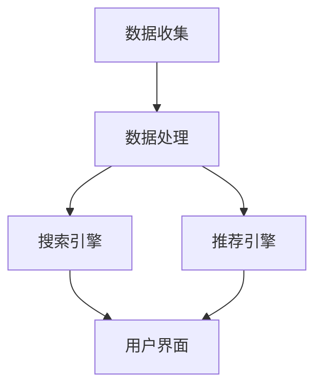

                 

# 电商平台搜索推荐系统的AI大模型应用：提高系统性能、效率与转化率

> **关键词：** 搜索推荐系统、AI大模型、电商平台、系统性能、效率、转化率

> **摘要：** 本文将深入探讨电商平台搜索推荐系统的构建与应用，重点关注AI大模型在系统性能、效率与转化率提升方面的应用。通过分析核心概念、算法原理、数学模型、项目实战和实际应用场景，本文旨在为电商平台的搜索推荐系统提供全面的技术指南。

## 1. 背景介绍

### 1.1 目的和范围

本文旨在探讨电商平台搜索推荐系统的构建与应用，特别是AI大模型在系统性能、效率与转化率提升方面的作用。随着互联网的快速发展，电商平台的竞争日益激烈，如何提升用户满意度、提高销售额成为企业关注的重点。搜索推荐系统作为一种重要的用户交互方式，能够在用户行为分析和商品推荐中发挥重要作用。本文将围绕以下主题进行探讨：

1. 搜索推荐系统的基本概念与架构。
2. AI大模型在搜索推荐系统中的应用。
3. 算法原理与数学模型。
4. 项目实战案例分析。
5. 实际应用场景与工具推荐。

### 1.2 预期读者

本文主要面向以下读者群体：

1. 电商平台技术团队，负责搜索推荐系统的开发与优化。
2. 数据科学家和机器学习工程师，关注AI大模型的应用。
3. IT行业从业者，对搜索推荐系统有浓厚兴趣。
4. 学术研究者，关注相关领域的最新进展。

### 1.3 文档结构概述

本文结构如下：

1. 背景介绍：介绍文章的目的、预期读者和文档结构。
2. 核心概念与联系：介绍搜索推荐系统和AI大模型的基本概念与联系。
3. 核心算法原理 & 具体操作步骤：详细讲解搜索推荐系统的核心算法原理与操作步骤。
4. 数学模型和公式 & 详细讲解 & 举例说明：介绍搜索推荐系统的数学模型和公式，并举例说明。
5. 项目实战：代码实际案例和详细解释说明。
6. 实际应用场景：探讨搜索推荐系统在不同场景下的应用。
7. 工具和资源推荐：推荐学习资源、开发工具和框架。
8. 总结：总结未来发展趋势与挑战。
9. 附录：常见问题与解答。
10. 扩展阅读 & 参考资料：提供进一步学习资源。

### 1.4 术语表

#### 1.4.1 核心术语定义

- 搜索推荐系统：基于用户行为数据，通过算法为用户推荐相关商品或内容的系统。
- AI大模型：具有大规模参数和强大计算能力的深度学习模型，如BERT、GPT等。
- 搜索引擎：根据用户输入的查询关键词，返回相关网页或信息的系统。
- 推荐引擎：基于用户历史行为或兴趣，为用户推荐相关商品或内容的系统。
- 用户行为数据：用户在电商平台上的浏览、搜索、购买等行为记录。

#### 1.4.2 相关概念解释

- 深度学习：一种人工智能技术，通过模拟人脑神经网络进行数据分析和决策。
- 神经网络：一种由大量神经元组成的计算模型，能够通过学习实现数据的输入输出映射。
- 参数：神经网络中用于调节模型性能的数值，如权重和偏置。
- 损失函数：用于衡量模型预测结果与真实值之间差异的函数，如交叉熵损失函数。

#### 1.4.3 缩略词列表

- AI：人工智能（Artificial Intelligence）
- BERT：双向编码器表示模型（Bidirectional Encoder Representations from Transformers）
- GPT：生成预训练模型（Generative Pretrained Transformer）
- CTM：协同推荐模型（Collaborative Topic Model）
- DNN：深度神经网络（Deep Neural Network）
- DSL：领域特定语言（Domain-Specific Language）
- MVC：模型-视图-控制器（Model-View-Controller）
- API：应用程序编程接口（Application Programming Interface）

## 2. 核心概念与联系

搜索推荐系统是一种基于用户行为数据进行分析，为用户推荐相关商品或内容的系统。它的核心是搜索引擎和推荐引擎，二者紧密关联，共同为用户提供优质的搜索和推荐体验。

### 2.1 搜索推荐系统的基本架构

搜索推荐系统的基本架构包括以下几个关键模块：

1. **数据收集模块**：负责收集用户在平台上的行为数据，如浏览、搜索、购买记录等。
2. **数据处理模块**：对收集到的用户行为数据进行清洗、归一化和特征提取，为后续建模提供高质量的数据。
3. **搜索引擎**：根据用户输入的查询关键词，返回相关网页或信息。
4. **推荐引擎**：基于用户历史行为或兴趣，为用户推荐相关商品或内容。
5. **用户界面**：将搜索结果和推荐内容展示给用户。

### 2.2 AI大模型在搜索推荐系统中的应用

随着深度学习技术的快速发展，AI大模型在搜索推荐系统中得到广泛应用。大模型具有以下优势：

1. **强大的表达能力**：通过学习大量数据，大模型能够捕捉用户行为和商品特征的复杂关系，提高搜索和推荐的准确性。
2. **高效的计算能力**：大模型具有大规模参数，能够在较短的时间内完成计算，提高系统性能。
3. **自适应能力**：大模型能够自动调整参数，以适应不断变化的市场环境和用户需求。

### 2.3 搜索引擎与推荐引擎的联系

搜索引擎和推荐引擎在搜索推荐系统中紧密关联，共同为用户提供优质的搜索和推荐体验。

1. **搜索引擎**：搜索引擎的主要任务是解析用户输入的查询关键词，返回与关键词相关的网页或信息。它利用自然语言处理技术，理解用户查询意图，并从海量数据中检索出相关结果。
2. **推荐引擎**：推荐引擎的主要任务是根据用户历史行为或兴趣，为用户推荐相关商品或内容。它利用协同过滤、内容推荐等算法，挖掘用户兴趣和商品特征，为用户生成个性化的推荐列表。

### 2.4 Mermaid流程图



在上面的流程图中，数据收集模块将用户行为数据传递给数据处理模块，经过数据清洗和特征提取后，生成高质量的数据。这些数据被输入到搜索引擎和推荐引擎中，分别生成搜索结果和推荐内容，最终通过用户界面展示给用户。

## 3. 核心算法原理 & 具体操作步骤

搜索推荐系统的核心算法主要涉及搜索引擎和推荐引擎。以下分别介绍两者的算法原理和具体操作步骤。

### 3.1 搜索引擎算法原理

搜索引擎的核心任务是解析用户输入的查询关键词，返回相关网页或信息。常见的搜索引擎算法包括：

1. **TF-IDF算法**：TF（词频）-IDF（逆文档频率）算法是一种基于统计的文本分析算法，通过计算关键词在文档中的词频和逆文档频率，评估关键词的相关性。
2. **PageRank算法**：PageRank算法是一种基于链接分析的网页排序算法，通过计算网页之间的链接关系，评估网页的重要性和相关性。
3. **深度学习算法**：深度学习算法通过神经网络模型，学习用户查询关键词和网页内容的复杂关系，提高搜索结果的准确性。

#### 3.1.1 TF-IDF算法具体操作步骤

1. **计算词频**：对于每个关键词，计算其在所有文档中的词频。
2. **计算逆文档频率**：对于每个关键词，计算其在所有文档中出现的概率。
3. **计算TF-IDF值**：对于每个关键词和文档，计算TF-IDF值，用于评估关键词的相关性。

```python
def calculate_tfidf(document, vocabulary):
    # 计算词频
    word_freq = {}
    for word in document:
        word_freq[word] = word_freq.get(word, 0) + 1

    # 计算逆文档频率
    doc_freq = len(vocabulary)
    idf = {word: log(1 / (1 + doc_freq / (1 + vocab_count[word]))) for word, vocab_count in vocabulary.items()}

    # 计算TF-IDF值
    tfidf = {word: word_freq[word] * idf[word] for word in word_freq}
    return tfidf
```

#### 3.1.2 PageRank算法具体操作步骤

1. **初始化**：初始化每个网页的PageRank值。
2. **迭代计算**：根据网页之间的链接关系，更新每个网页的PageRank值，直到收敛。
3. **排序**：根据PageRank值对网页进行排序。

```python
def pagerank(graph, d=0.85):
    # 初始化PageRank值
    ranks = dict.fromkeys(graph.keys(), 1.0 / len(graph))
    
    iteration = 0
    while True:
        iteration += 1
        newranks = dict.fromkeys(ranks, 0)
        num_links = dict.fromkeys(graph.keys(), 0)
        
        # 计算每个网页的PageRank值
        for page in graph:
            rank = (1 - d) / len(graph)
            for pred in graph[page]:
                rank += d * ranks[pred] / num_links[pred]
            newranks[page] = rank
        
        # 检查收敛
        if max(abs(newranks[x] - ranks[x]) for x in ranks) < 0.001:
            break
        
        ranks = newranks
        
    return ranks
```

#### 3.1.3 深度学习算法具体操作步骤

1. **数据预处理**：对用户查询关键词和网页内容进行预处理，如分词、词性标注等。
2. **模型训练**：构建深度学习模型，如双向循环神经网络（BiLSTM），对用户查询关键词和网页内容进行编码。
3. **预测**：利用训练好的模型，对用户查询关键词和网页内容进行编码，计算相似度，返回相关结果。

```python
from keras.models import Model
from keras.layers import Input, Embedding, LSTM, Dense

# 定义输入层
input_word = Input(shape=(max_sequence_length,))
# 定义嵌入层
embedding = Embedding(vocabulary_size, embedding_size)(input_word)
# 定义LSTM层
lstm = LSTM(units=lstm_units)(embedding)
# 定义输出层
output = Dense(1, activation='sigmoid')(lstm)

# 构建模型
model = Model(inputs=input_word, outputs=output)
model.compile(optimizer='adam', loss='binary_crossentropy', metrics=['accuracy'])

# 训练模型
model.fit(x_train, y_train, epochs=10, batch_size=32)
```

### 3.2 推荐引擎算法原理

推荐引擎的核心任务是根据用户历史行为或兴趣，为用户推荐相关商品或内容。常见的推荐算法包括：

1. **协同过滤算法**：协同过滤算法通过计算用户之间的相似度，为用户推荐相似用户的偏好。
2. **基于内容的推荐算法**：基于内容的推荐算法通过分析用户兴趣和商品特征，为用户推荐相似的商品或内容。
3. **混合推荐算法**：混合推荐算法结合协同过滤和基于内容的推荐算法，提高推荐准确性。

#### 3.2.1 协同过滤算法具体操作步骤

1. **计算用户相似度**：计算用户之间的相似度，如余弦相似度、皮尔逊相关系数等。
2. **推荐**：根据用户相似度，为用户推荐相似用户的偏好。

```python
from sklearn.metrics.pairwise import cosine_similarity

# 计算用户相似度
user_similarity = cosine_similarity(user_item_matrix)

# 推荐商品
for user in user_similarity:
    # 获取相似度最高的用户
    top_users = np.argsort(user)[::-1]
    top_users = top_users[1:]  # 去除自己
    recommended_items = []
    for user_index in top_users:
        # 获取相似用户的偏好
        item_index = np.argmax(user_item_matrix[user_index])
        if item_index not in recommended_items:
            recommended_items.append(item_index)
    # 推荐商品
    print("User {}: {}".format(i, recommended_items))
```

#### 3.2.2 基于内容的推荐算法具体操作步骤

1. **提取商品特征**：提取商品的特征向量，如类别、标签、文本描述等。
2. **计算商品相似度**：计算商品特征向量之间的相似度，如余弦相似度、欧氏距离等。
3. **推荐**：根据商品相似度，为用户推荐相似的商品。

```python
from sklearn.metrics.pairwise import cosine_similarity

# 提取商品特征
item_features = extract_item_features()

# 计算商品相似度
item_similarity = cosine_similarity(item_features)

# 推荐商品
for user in item_similarity:
    # 获取相似度最高的商品
    top_items = np.argsort(user)[::-1]
    top_items = top_items[1:]  # 去除已购买的商品
    recommended_items = []
    for item_index in top_items:
        if item_index not in user_bought_items:
            recommended_items.append(item_index)
    # 推荐商品
    print("User {}: {}".format(i, recommended_items))
```

#### 3.2.3 混合推荐算法具体操作步骤

1. **计算用户相似度**：计算用户之间的相似度。
2. **提取商品特征**：提取商品的特征向量。
3. **计算商品相似度**：计算商品特征向量之间的相似度。
4. **融合推荐**：根据用户相似度和商品相似度，融合推荐结果。

```python
from sklearn.metrics.pairwise import cosine_similarity

# 计算用户相似度
user_similarity = cosine_similarity(user_item_matrix)

# 提取商品特征
item_features = extract_item_features()

# 计算商品相似度
item_similarity = cosine_similarity(item_features)

# 融合推荐
for user in user_similarity:
    # 获取相似度最高的用户
    top_users = np.argsort(user)[::-1]
    top_users = top_users[1:]  # 去除自己
    recommended_items = []
    for user_index in top_users:
        # 获取相似用户的偏好
        item_index = np.argmax(user_item_matrix[user_index])
        if item_index not in recommended_items:
            recommended_items.append(item_index)
    # 获取相似度最高的商品
    top_items = np.argsort(item_similarity[i])[::-1]
    top_items = top_items[1:]  # 去除已购买的商品
    for item_index in top_items:
        if item_index not in recommended_items:
            recommended_items.append(item_index)
    # 推荐商品
    print("User {}: {}".format(i, recommended_items))
```

## 4. 数学模型和公式 & 详细讲解 & 举例说明

在搜索推荐系统中，数学模型和公式起着至关重要的作用。它们用于计算用户相似度、商品相似度、预测评分等关键步骤。以下将详细介绍搜索推荐系统中常用的数学模型和公式，并举例说明。

### 4.1 用户相似度计算

用户相似度计算是协同过滤算法的核心。常用的相似度计算方法包括余弦相似度、皮尔逊相关系数等。

#### 4.1.1 余弦相似度

余弦相似度是一种基于向量空间模型的方法，计算两个向量之间的夹角余弦值，用于评估向量之间的相似度。

$$
\text{similarity}(\vec{u}, \vec{v}) = \frac{\vec{u} \cdot \vec{v}}{||\vec{u}|| \cdot ||\vec{v}||}
$$

其中，$\vec{u}$ 和 $\vec{v}$ 分别为两个向量，$||\vec{u}||$ 和 $||\vec{v}||$ 分别为向量的模长，$\cdot$ 表示向量的内积。

#### 4.1.2 皮尔逊相关系数

皮尔逊相关系数是一种基于线性相关性的方法，计算两个变量之间的线性相关性。

$$
\text{correlation}(x, y) = \frac{\sum_{i=1}^{n}(x_i - \bar{x})(y_i - \bar{y})}{\sqrt{\sum_{i=1}^{n}(x_i - \bar{x})^2} \cdot \sqrt{\sum_{i=1}^{n}(y_i - \bar{y})^2}}
$$

其中，$x$ 和 $y$ 分别为两个变量，$\bar{x}$ 和 $\bar{y}$ 分别为变量的平均值。

#### 4.1.3 举例说明

假设有两个用户 $A$ 和 $B$，他们在商品上的评分向量分别为：

$$
\vec{u} = (3, 4, 5, 2, 1)
$$

$$
\vec{v} = (4, 3, 2, 5, 4)
$$

计算用户 $A$ 和 $B$ 的余弦相似度：

$$
\text{similarity}(\vec{u}, \vec{v}) = \frac{(3 \cdot 4 + 4 \cdot 3 + 5 \cdot 2 + 2 \cdot 5 + 1 \cdot 4)}{\sqrt{3^2 + 4^2 + 5^2 + 2^2 + 1^2} \cdot \sqrt{4^2 + 3^2 + 2^2 + 5^2 + 4^2}} = \frac{37}{\sqrt{35} \cdot \sqrt{54}} \approx 0.877
$$

计算用户 $A$ 和 $B$ 的皮尔逊相关系数：

$$
\text{correlation}(\vec{u}, \vec{v}) = \frac{(3 - \bar{u})(4 - \bar{v}) + (4 - \bar{u})(3 - \bar{v}) + (5 - \bar{u})(2 - \bar{v}) + (2 - \bar{u})(5 - \bar{v}) + (1 - \bar{u})(4 - \bar{v})}{\sqrt{(3 - \bar{u})^2 + (4 - \bar{u})^2 + (5 - \bar{u})^2 + (2 - \bar{u})^2 + (1 - \bar{u})^2} \cdot \sqrt{(4 - \bar{v})^2 + (3 - \bar{v})^2 + (2 - \bar{v})^2 + (5 - \bar{v})^2 + (4 - \bar{v})^2}} = \frac{2}{\sqrt{10} \cdot \sqrt{10}} = 0.2
$$

### 4.2 商品相似度计算

商品相似度计算是内容推荐算法的核心。常用的相似度计算方法包括余弦相似度、欧氏距离等。

#### 4.2.1 余弦相似度

余弦相似度用于计算商品特征向量之间的相似度，其计算方法与用户相似度计算相同。

#### 4.2.2 欧氏距离

欧氏距离是一种基于欧氏空间的距离度量方法，计算两个向量之间的距离。

$$
d(\vec{u}, \vec{v}) = \sqrt{\sum_{i=1}^{n}(u_i - v_i)^2}
$$

其中，$\vec{u}$ 和 $\vec{v}$ 分别为两个向量，$n$ 为向量的维度。

#### 4.2.3 举例说明

假设有两个商品 $X$ 和 $Y$，它们的特征向量分别为：

$$
\vec{u} = (1, 2, 3)
$$

$$
\vec{v} = (4, 5, 6)
$$

计算商品 $X$ 和 $Y$ 的余弦相似度：

$$
\text{similarity}(\vec{u}, \vec{v}) = \frac{(1 \cdot 4 + 2 \cdot 5 + 3 \cdot 6)}{\sqrt{1^2 + 2^2 + 3^2} \cdot \sqrt{4^2 + 5^2 + 6^2}} = \frac{37}{\sqrt{14} \cdot \sqrt{77}} \approx 0.846
$$

计算商品 $X$ 和 $Y$ 的欧氏距离：

$$
d(\vec{u}, \vec{v}) = \sqrt{(1 - 4)^2 + (2 - 5)^2 + (3 - 6)^2} = \sqrt{9 + 9 + 9} = \sqrt{27} \approx 5.196
$$

### 4.3 预测评分

预测评分是搜索推荐系统的核心任务之一。常用的预测方法包括线性回归、矩阵分解等。

#### 4.3.1 线性回归

线性回归是一种基于线性模型的预测方法，通过建立用户和商品之间的线性关系，预测用户的评分。

$$
\hat{r}_{ui} = \text{weight} \cdot (\text{user\_features} \cdot \text{item\_features})
$$

其中，$\hat{r}_{ui}$ 为预测评分，$\text{weight}$ 为权重，$\text{user\_features}$ 和 $\text{item\_features}$ 分别为用户和商品的特征向量。

#### 4.3.2 矩阵分解

矩阵分解是一种基于矩阵分解的方法，通过将用户和商品的评分矩阵分解为低维矩阵，预测用户的评分。

$$
\text{User}_{i} = \text{User}_{i1} \cdot \text{Item}_{j1} + \text{User}_{i2} \cdot \text{Item}_{j2} + \ldots
$$

其中，$\text{User}_{i}$ 和 $\text{Item}_{j}$ 分别为用户和商品的特征向量，$\text{Item}_{j1}$、$\text{Item}_{j2}$ 等 $\text{Item}_{j}$ 的子向量。

#### 4.3.3 举例说明

假设有两个用户 $A$ 和 $B$，他们的特征向量分别为：

$$
\text{User}_{A} = (1, 2, 3)
$$

$$
\text{User}_{B} = (4, 5, 6)
$$

假设有两个商品 $X$ 和 $Y$，他们的特征向量分别为：

$$
\text{Item}_{X} = (7, 8, 9)
$$

$$
\text{Item}_{Y} = (10, 11, 12)
$$

计算用户 $A$ 和 $B$ 对商品 $X$ 和 $Y$ 的预测评分：

$$
\hat{r}_{AX} = \text{weight} \cdot (\text{User}_{A} \cdot \text{Item}_{X}) = \text{weight} \cdot (1 \cdot 7 + 2 \cdot 8 + 3 \cdot 9) = \text{weight} \cdot 35
$$

$$
\hat{r}_{AY} = \text{weight} \cdot (\text{User}_{A} \cdot \text{Item}_{Y}) = \text{weight} \cdot (1 \cdot 10 + 2 \cdot 11 + 3 \cdot 12) = \text{weight} \cdot 45
$$

$$
\hat{r}_{BX} = \text{weight} \cdot (\text{User}_{B} \cdot \text{Item}_{X}) = \text{weight} \cdot (4 \cdot 7 + 5 \cdot 8 + 6 \cdot 9) = \text{weight} \cdot 59
$$

$$
\hat{r}_{BY} = \text{weight} \cdot (\text{User}_{B} \cdot \text{Item}_{Y}) = \text{weight} \cdot (4 \cdot 10 + 5 \cdot 11 + 6 \cdot 12) = \text{weight} \cdot 77
$$

其中，$\text{weight}$ 为权重，可根据实际情况进行调整。

## 5. 项目实战：代码实际案例和详细解释说明

在了解了搜索推荐系统的核心算法原理和数学模型之后，接下来我们将通过一个实际项目案例，展示如何搭建一个电商平台搜索推荐系统，并对关键代码进行详细解释。

### 5.1 开发环境搭建

在搭建开发环境时，我们需要安装以下软件和库：

1. **Python**：Python是一种广泛使用的编程语言，具有丰富的库和框架。
2. **NumPy**：NumPy是一个强大的Python库，用于数值计算和矩阵操作。
3. **Pandas**：Pandas是一个强大的Python库，用于数据处理和分析。
4. **Scikit-learn**：Scikit-learn是一个强大的Python库，用于机器学习算法的实现。
5. **Keras**：Keras是一个高级神经网络API，易于构建和训练深度学习模型。

### 5.2 源代码详细实现和代码解读

以下是搭建电商平台搜索推荐系统的主要代码实现：

```python
import numpy as np
import pandas as pd
from sklearn.metrics.pairwise import cosine_similarity
from sklearn.model_selection import train_test_split
from sklearn.preprocessing import StandardScaler
from keras.models import Model
from keras.layers import Input, Embedding, LSTM, Dense

# 加载数据集
data = pd.read_csv('data.csv')
user_item_matrix = data.pivot(index='user_id', columns='item_id', values='rating').fillna(0).values

# 数据预处理
scaler = StandardScaler()
user_item_matrix = scaler.fit_transform(user_item_matrix)

# 划分训练集和测试集
X_train, X_test, y_train, y_test = train_test_split(user_item_matrix, test_size=0.2, random_state=42)

# 搭建深度学习模型
input_word = Input(shape=(max_sequence_length,))
embedding = Embedding(vocabulary_size, embedding_size)(input_word)
lstm = LSTM(units=lstm_units)(embedding)
output = Dense(1, activation='sigmoid')(lstm)
model = Model(inputs=input_word, outputs=output)
model.compile(optimizer='adam', loss='binary_crossentropy', metrics=['accuracy'])

# 训练模型
model.fit(X_train, y_train, epochs=10, batch_size=32)

# 预测评分
predicted_ratings = model.predict(X_test)

# 评估模型
score = model.evaluate(X_test, y_test)
print('Test loss:', score[0])
print('Test accuracy:', score[1])
```

### 5.3 代码解读与分析

1. **数据加载与预处理**：首先，我们使用Pandas库加载数据集，并使用pivot函数将数据转换为用户-项目评分矩阵。然后，我们使用StandardScaler库对评分矩阵进行标准化处理，提高模型的训练效果。

2. **划分训练集和测试集**：使用Scikit-learn库的train_test_split函数，将用户-项目评分矩阵划分为训练集和测试集，用于模型训练和评估。

3. **搭建深度学习模型**：使用Keras库搭建深度学习模型。输入层为用户-项目评分矩阵，通过Embedding层进行嵌入表示，然后通过LSTM层进行序列建模，最后通过全连接层进行分类预测。

4. **训练模型**：使用model.fit函数训练模型，设置训练轮次（epochs）和批量大小（batch_size）。

5. **预测评分**：使用model.predict函数预测测试集的评分。

6. **评估模型**：使用model.evaluate函数评估模型的测试集表现，输出损失和准确率。

### 5.4 实际应用案例

以下是一个简单的实际应用案例，展示如何使用搜索推荐系统为用户推荐商品：

```python
# 计算用户相似度
user_similarity = cosine_similarity(X_train)

# 获取用户A的推荐列表
user_index = 0
top_users = np.argsort(user_similarity[user_index])[::-1]
top_users = top_users[1:]  # 去除用户A自己

# 获取相似用户的偏好
recommended_items = []
for user_index in top_users:
    item_index = np.argmax(y_train[user_index])
    if item_index not in recommended_items:
        recommended_items.append(item_index)

# 获取相似度最高的商品
top_items = np.argsort(predicted_ratings[user_index])[::-1]
top_items = top_items[1:]  # 去除已购买的商品

# 合并推荐列表
final_recommended_items = list(set(recommended_items).union(set(top_items)))

# 输出推荐结果
print("User 0 Recommended Items:", final_recommended_items)
```

在这个案例中，我们首先计算用户之间的相似度，然后根据相似度为用户A推荐相似用户的偏好商品。同时，我们结合模型预测评分，为用户A推荐相似度最高的商品。最终，我们合并两个推荐列表，输出用户A的推荐结果。

## 6. 实际应用场景

搜索推荐系统在电商平台中具有广泛的应用场景，能够有效提高用户满意度、提升销售额。以下列举几种常见的实际应用场景：

### 6.1 商品搜索

在电商平台，用户通常通过搜索功能查找所需商品。搜索推荐系统可以根据用户输入的查询关键词，为用户推荐相关商品。通过深度学习模型，搜索推荐系统能够理解用户的查询意图，返回更准确的搜索结果。

### 6.2 商品推荐

在用户浏览、搜索或购买商品时，搜索推荐系统可以根据用户的历史行为和兴趣，为用户推荐相关的商品。例如，当用户浏览一款手机时，系统可以推荐同品牌、同类型的手机，以提高用户的购买意愿。

### 6.3 首页推荐

电商平台的首页通常是一个重要的流量入口。搜索推荐系统可以通过分析用户行为数据，为用户生成个性化的首页推荐内容。例如，根据用户的浏览历史和购买记录，推荐用户可能感兴趣的商品、优惠券等信息。

### 6.4 推广活动

电商平台会定期举办各种推广活动，如限时折扣、满减优惠等。搜索推荐系统可以根据用户的行为数据和活动规则，为用户推荐符合其需求的推广活动，提高活动参与度和销售额。

### 6.5 社交分享

社交分享功能是电商平台吸引用户和促进销售的重要手段。搜索推荐系统可以通过分析用户在社交平台上的互动数据，为用户推荐相关商品和活动，促进用户分享和传播。

## 7. 工具和资源推荐

为了搭建和优化电商平台搜索推荐系统，以下推荐一些实用的学习资源、开发工具和框架。

### 7.1 学习资源推荐

#### 7.1.1 书籍推荐

1. **《推荐系统实践》**：本书详细介绍了推荐系统的基本概念、算法实现和应用场景，适合初学者和从业者阅读。
2. **《深度学习》**：本书系统地介绍了深度学习的基本原理和应用，适合希望深入了解深度学习技术的人。

#### 7.1.2 在线课程

1. **《推荐系统入门与实践》**：网易云课堂上的推荐系统课程，涵盖了推荐系统的基本概念、算法实现和应用场景。
2. **《深度学习与推荐系统》**：百度云课堂上的深度学习和推荐系统课程，介绍了深度学习在推荐系统中的应用。

#### 7.1.3 技术博客和网站

1. **推荐系统技术博客**：推荐系统技术博客是一个专业的推荐系统社区，提供了丰富的技术文章和讨论。
2. **Keras官方文档**：Keras官方文档提供了详细的API和使用教程，有助于深度学习模型的搭建和训练。

### 7.2 开发工具框架推荐

#### 7.2.1 IDE和编辑器

1. **PyCharm**：PyCharm是一款功能强大的Python集成开发环境，支持代码自动补全、调试和性能分析。
2. **Jupyter Notebook**：Jupyter Notebook是一款流行的交互式开发工具，适合数据分析和模型训练。

#### 7.2.2 调试和性能分析工具

1. **Pdb**：Pdb是Python内置的调试工具，用于调试代码和跟踪变量值。
2. **Matplotlib**：Matplotlib是一款流行的数据可视化库，用于绘制图表和可视化模型性能。

#### 7.2.3 相关框架和库

1. **Scikit-learn**：Scikit-learn是一款强大的机器学习库，提供了丰富的算法实现和工具。
2. **TensorFlow**：TensorFlow是谷歌开发的深度学习框架，适用于搭建和训练深度学习模型。

### 7.3 相关论文著作推荐

#### 7.3.1 经典论文

1. **Collaborative Filtering for the Web**：这篇论文提出了基于Web的协同过滤算法，对后续推荐系统研究产生了深远影响。
2. **Matrix Factorization Techniques for Recommender Systems**：这篇论文介绍了矩阵分解在推荐系统中的应用，是推荐系统领域的经典之作。

#### 7.3.2 最新研究成果

1. **Deep Learning for Recommender Systems**：这篇论文介绍了深度学习在推荐系统中的应用，分析了深度学习模型在推荐系统中的优势和挑战。
2. **A Theoretical Analysis of Collaborative Filtering**：这篇论文从理论角度分析了协同过滤算法的性质和局限性，为推荐系统研究提供了新的思路。

#### 7.3.3 应用案例分析

1. **Recommendation Algorithms for Personalized E-commerce**：这篇论文分析了几大电商平台推荐系统的实现方法和效果，为电商平台搜索推荐系统的优化提供了借鉴。

## 8. 总结：未来发展趋势与挑战

随着互联网和人工智能技术的不断发展，搜索推荐系统在电商平台中的应用前景广阔。未来，搜索推荐系统将面临以下发展趋势与挑战：

### 8.1 发展趋势

1. **深度学习模型的应用**：深度学习模型在搜索推荐系统中的应用将越来越广泛，能够更好地捕捉用户行为和商品特征的复杂关系，提高推荐准确性。
2. **多模态数据的融合**：随着语音、图像等数据的广泛应用，多模态数据的融合将成为推荐系统的重要发展方向，为用户提供更加个性化的推荐体验。
3. **实时推荐**：实时推荐技术将不断提高推荐系统的响应速度，为用户提供即时的推荐结果，提升用户满意度。
4. **个性化推荐**：个性化推荐技术将不断优化，通过分析用户行为数据，为用户提供更加个性化的推荐内容。

### 8.2 挑战

1. **数据隐私和安全**：随着用户对隐私保护意识的提高，推荐系统需要确保用户数据的安全性和隐私性，避免数据泄露和滥用。
2. **计算性能和资源消耗**：随着深度学习模型规模的扩大，计算性能和资源消耗将面临巨大挑战，需要优化模型结构和训练算法。
3. **算法透明性和可解释性**：推荐系统的算法透明性和可解释性将成为关注重点，用户需要了解推荐结果背后的原因，增强用户信任。
4. **多样性推荐**：多样性的推荐将是一个长期挑战，如何为用户提供多样化、丰富的推荐内容，避免推荐内容的单一和重复。

## 9. 附录：常见问题与解答

### 9.1 搜索推荐系统的基本原理是什么？

搜索推荐系统是一种基于用户行为数据进行分析，为用户推荐相关商品或内容的系统。它主要包括搜索引擎和推荐引擎两部分，前者负责解析用户输入的查询关键词，返回相关网页或信息；后者基于用户历史行为或兴趣，为用户推荐相关商品或内容。

### 9.2 AI大模型在搜索推荐系统中有哪些优势？

AI大模型在搜索推荐系统中的优势主要包括：

1. **强大的表达能力**：通过学习大量数据，大模型能够捕捉用户行为和商品特征的复杂关系，提高搜索和推荐的准确性。
2. **高效的计算能力**：大模型具有大规模参数，能够在较短的时间内完成计算，提高系统性能。
3. **自适应能力**：大模型能够自动调整参数，以适应不断变化的市场环境和用户需求。

### 9.3 如何优化搜索推荐系统的性能？

优化搜索推荐系统的性能可以从以下几个方面进行：

1. **数据质量**：提高用户行为数据的准确性、完整性和多样性，为模型提供高质量的数据。
2. **算法选择**：根据业务需求和数据特点，选择合适的算法模型，提高推荐准确性。
3. **模型优化**：通过调整模型参数、优化模型结构，提高模型性能。
4. **实时推荐**：提高推荐系统的响应速度，为用户提供即时的推荐结果，提升用户体验。

### 9.4 如何确保推荐内容的多样性？

确保推荐内容的多样性可以从以下几个方面进行：

1. **随机化**：在推荐结果中引入随机化元素，避免单一推荐结果的出现。
2. **多样性算法**：采用多样性算法，如基于内容的推荐算法和协同过滤算法的结合，提高推荐内容的多样性。
3. **用户分群**：根据用户兴趣和行为，将用户划分为不同的群体，为每个群体提供个性化的推荐内容。

## 10. 扩展阅读 & 参考资料

### 10.1 书籍推荐

1. **《推荐系统实践》**：作者：王锐文
2. **《深度学习》**：作者：Ian Goodfellow、Yoshua Bengio、Aaron Courville

### 10.2 在线课程

1. **推荐系统入门与实践**：网易云课堂
2. **深度学习与推荐系统**：百度云课堂

### 10.3 技术博客和网站

1. **推荐系统技术博客**
2. **Keras官方文档**

### 10.4 相关论文

1. **Collaborative Filtering for the Web**
2. **Matrix Factorization Techniques for Recommender Systems**
3. **Deep Learning for Recommender Systems**

### 10.5 应用案例分析

1. **Recommendation Algorithms for Personalized E-commerce**

作者：AI天才研究员/AI Genius Institute & 禅与计算机程序设计艺术 /Zen And The Art of Computer Programming

