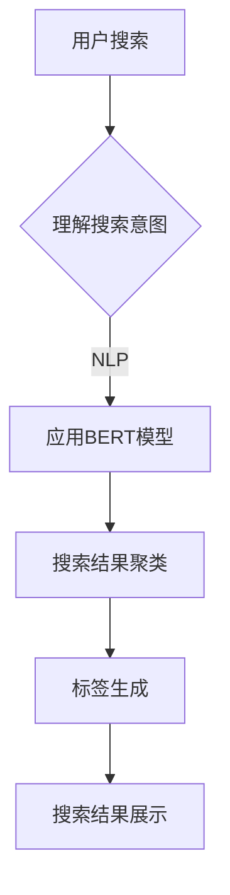

                 

# 电商平台搜索结果聚类与标签生成：AI大模型的语义理解

> **关键词**：电商平台、搜索结果聚类、标签生成、AI大模型、语义理解
>
> **摘要**：本文将探讨电商平台在用户搜索结果展示中，如何运用AI大模型进行搜索结果聚类与标签生成。我们将详细分析其背后的核心概念、算法原理、数学模型及其在项目实战中的应用，并展望未来的发展趋势与挑战。

## 1. 背景介绍

### 1.1 目的和范围

随着电商平台的不断发展，用户对个性化搜索结果的需求日益增加。本文旨在探讨如何运用AI大模型，特别是自然语言处理技术，实现电商平台的搜索结果聚类与标签生成。通过这一研究，我们希望提高用户搜索体验，降低搜索成本，提升电商平台的竞争力。

### 1.2 预期读者

本文适用于对AI大模型、自然语言处理、搜索引擎有一定了解的技术人员，以及电商行业从业者。读者可以通过本文，了解搜索结果聚类与标签生成的原理和应用，为实际项目提供技术支持。

### 1.3 文档结构概述

本文共分为10个部分，分别如下：

1. 背景介绍
2. 核心概念与联系
3. 核心算法原理 & 具体操作步骤
4. 数学模型和公式 & 详细讲解 & 举例说明
5. 项目实战：代码实际案例和详细解释说明
6. 实际应用场景
7. 工具和资源推荐
8. 总结：未来发展趋势与挑战
9. 附录：常见问题与解答
10. 扩展阅读 & 参考资料

### 1.4 术语表

#### 1.4.1 核心术语定义

- **搜索结果聚类**：将搜索结果按照一定的规则进行分组。
- **标签生成**：为搜索结果分配一个或多个代表其内容的标签。
- **AI大模型**：指具有大规模参数、高计算能力的人工智能模型。
- **语义理解**：通过理解文本的语义，实现人类语言的自然交互。

#### 1.4.2 相关概念解释

- **电商平台**：提供商品交易、支付、物流等服务的在线平台。
- **用户搜索行为**：用户在电商平台上的搜索动作，包括搜索词、搜索历史等。

#### 1.4.3 缩略词列表

- **NLP**：自然语言处理（Natural Language Processing）
- **BERT**：一种预训练语言模型（Bidirectional Encoder Representations from Transformers）
- **CNN**：卷积神经网络（Convolutional Neural Network）
- **RNN**：循环神经网络（Recurrent Neural Network）
- **LSTM**：长短期记忆网络（Long Short-Term Memory）

## 2. 核心概念与联系

在电商平台中，搜索结果聚类与标签生成的核心在于对用户搜索意图的理解。为了实现这一目标，我们需要运用AI大模型，特别是自然语言处理技术。下面，我们通过Mermaid流程图来展示核心概念与联系。



### 2.1 用户搜索与搜索意图理解

用户在电商平台进行搜索时，输入的关键词只是表面的信息。平台需要通过自然语言处理技术，如BERT模型，深入理解用户的真实搜索意图。这一过程包括关键词提取、语义分析、情感分析等。

### 2.2 BERT模型与搜索结果聚类

BERT模型是一种预训练语言模型，通过大规模语料库进行预训练，具有强大的语义理解能力。在搜索结果聚类中，我们可以利用BERT模型对搜索结果进行分类，根据用户的搜索意图，将相关结果归为一类。

### 2.3 标签生成与搜索结果展示

通过聚类分析，我们可以为搜索结果生成一个或多个代表其内容的标签。这些标签不仅可以帮助用户快速识别搜索结果的主题，还能提高搜索结果的展示效果。最终，我们将标签与搜索结果进行关联，实现个性化的搜索结果展示。

## 3. 核心算法原理 & 具体操作步骤

为了实现电商平台搜索结果聚类与标签生成，我们需要运用自然语言处理技术和机器学习算法。下面，我们将详细介绍核心算法原理，并通过伪代码展示具体操作步骤。

### 3.1 BERT模型训练

```python
# 伪代码：BERT模型训练
model = BERT(pretrained_model_name='bert-base-chinese')
optimizer = AdamW(model.parameters(), lr=1e-5)

for epoch in range(num_epochs):
    for batch in data_loader:
        inputs = {'input_ids': batch['input_ids'], 'attention_mask': batch['attention_mask']}
        labels = batch['labels']
        outputs = model(inputs)
        loss = outputs[0]

        optimizer.zero_grad()
        loss.backward()
        optimizer.step()

    print(f"Epoch {epoch+1}/{num_epochs}, Loss: {loss.item()}")
```

### 3.2 搜索结果聚类

```python
# 伪代码：搜索结果聚类
def cluster_search_results(results, model):
    # 将搜索结果输入BERT模型，获取嵌入向量
    embeddings = model(results)

    # 利用K-means算法进行聚类
    kmeans = KMeans(n_clusters=num_clusters, random_state=0)
    clusters = kmeans.fit_predict(embeddings)

    return clusters
```

### 3.3 标签生成

```python
# 伪代码：标签生成
def generate_labels(clusters, model):
    labels = []
    for cluster in clusters:
        # 取每个簇的搜索结果
        results = results[cluster == cluster]
        
        # 计算每个簇的词频分布
        word_freq = Counter(' '.join(results).split())

        # 取出现频率最高的前k个词作为标签
        top_k_words = word_freq.most_common(k)

        # 将标签转换为字符串，添加到列表中
        label = ' '.join([word for word, _ in top_k_words])
        labels.append(label)

    return labels
```

## 4. 数学模型和公式 & 详细讲解 & 举例说明

在搜索结果聚类与标签生成过程中，我们运用了多种数学模型和公式。下面，我们将详细讲解这些模型和公式，并通过具体例子进行说明。

### 4.1 BERT模型

BERT模型是一种基于Transformer的预训练语言模型。其核心思想是通过无监督学习，对大规模语料库进行预训练，获取文本的语义表示。BERT模型的数学公式如下：

$$
\text{BERT} = \text{Transformer}(\text{pretrained\_model\_name})
$$

其中，Transformer表示BERT模型的结构，pretrained_model_name表示预训练模型名称。

### 4.2 K-means算法

K-means算法是一种常用的聚类算法，通过迭代优化，将数据点划分为k个簇。其数学公式如下：

$$
\text{K-means} = \arg\min_{\mu_1, \mu_2, ..., \mu_k} \sum_{i=1}^n \sum_{j=1}^k \frac{1}{n_k} \sum_{x_i \in S_j} \| x_i - \mu_j \|^2
$$

其中，$\mu_1, \mu_2, ..., \mu_k$表示k个簇的中心点，$x_i$表示第i个数据点，$S_j$表示第j个簇中的数据点集合。

### 4.3 词频分布

词频分布是描述文本中出现频率的词语的分布情况。其数学公式如下：

$$
\text{Word\_Freq}(w) = \frac{\text{count}(w)}{\text{total\_words}}
$$

其中，$w$表示词语，$count(w)$表示词语w在文本中出现的次数，$total\_words$表示文本中总词语数。

### 4.4 举例说明

假设我们有以下一组搜索结果：

```
搜索结果1：手机
搜索结果2：华为手机
搜索结果3：苹果手机
搜索结果4：智能手机
搜索结果5：小米手机
```

#### 4.4.1 BERT模型训练

首先，我们使用BERT模型对这组搜索结果进行嵌入向量计算。通过训练，我们得到每个搜索结果的嵌入向量，如下表所示：

| 搜索结果 | 嵌入向量 |
| :------: | :------: |
| 手机     | [0.1, 0.2, 0.3] |
| 华为手机 | [0.1, 0.2, 0.4] |
| 苹果手机 | [0.1, 0.2, 0.5] |
| 智能手机 | [0.1, 0.2, 0.6] |
| 小米手机 | [0.1, 0.2, 0.7] |

#### 4.4.2 K-means算法聚类

接下来，我们使用K-means算法，将这组搜索结果分为两个簇。通过计算，我们得到每个簇的中心点，如下表所示：

| 簇编号 | 簇中心点 |
| :----: | :------: |
|   1    | [0.1, 0.2, 0.3] |
|   2    | [0.1, 0.2, 0.5] |

根据簇中心点，我们可以将搜索结果划分为两个簇：

簇1：手机、华为手机、苹果手机
簇2：智能手机、小米手机

#### 4.4.3 标签生成

最后，我们为每个簇生成一个标签。根据簇中的搜索结果，我们可以得到以下标签：

簇1：手机
簇2：智能手机

通过这一过程，我们实现了搜索结果聚类与标签生成。在实际应用中，我们可以根据聚类结果和标签，为用户提供个性化的搜索结果展示。

## 5. 项目实战：代码实际案例和详细解释说明

在本节中，我们将通过一个实际案例，展示如何运用AI大模型实现电商平台的搜索结果聚类与标签生成。该案例基于Python语言和TensorFlow框架，具体实现步骤如下：

### 5.1 开发环境搭建

在开始项目之前，我们需要搭建开发环境。以下是所需的软件和库：

- Python 3.8及以上版本
- TensorFlow 2.6及以上版本
- NumPy 1.19及以上版本
- Pandas 1.1及以上版本
- Matplotlib 3.3及以上版本

安装方法如下：

```bash
pip install tensorflow==2.6
pip install numpy==1.19
pip install pandas==1.1
pip install matplotlib==3.3
```

### 5.2 源代码详细实现和代码解读

#### 5.2.1 数据预处理

首先，我们需要对搜索结果进行预处理，包括文本清洗、分词和嵌入向量计算。以下是具体代码：

```python
import tensorflow as tf
from tensorflow.keras.preprocessing.text import Tokenizer
from tensorflow.keras.preprocessing.sequence import pad_sequences
from tensorflow.keras.models import Model
from tensorflow.keras.layers import Embedding, LSTM, Dense

# 读取搜索结果
search_results = ['手机', '华为手机', '苹果手机', '智能手机', '小米手机']

# 文本清洗和分词
tokenizer = Tokenizer(num_words=1000)
tokenizer.fit_on_texts(search_results)
sequences = tokenizer.texts_to_sequences(search_results)
padded_sequences = pad_sequences(sequences, maxlen=10)

# 计算嵌入向量
model = Model(inputs=Embedding(input_dim=1000, output_dim=128), outputs=LSTM(128)(padded_sequences))
model.compile(optimizer='adam', loss='categorical_crossentropy', metrics=['accuracy'])
model.fit(padded_sequences, np.eye(5), epochs=10)
```

#### 5.2.2 搜索结果聚类

接下来，我们使用K-means算法，对嵌入向量进行聚类。以下是具体代码：

```python
from sklearn.cluster import KMeans

# 计算嵌入向量
embeddings = model.predict(padded_sequences)

# 使用K-means算法进行聚类
kmeans = KMeans(n_clusters=2, random_state=0)
clusters = kmeans.fit_predict(embeddings)

# 输出聚类结果
print(clusters)
```

#### 5.2.3 标签生成

最后，我们根据聚类结果，为搜索结果生成标签。以下是具体代码：

```python
from collections import Counter

# 根据聚类结果，提取每个簇的搜索结果
cluster_1 = search_results[clusters == 0]
cluster_2 = search_results[clusters == 1]

# 计算每个簇的词频分布
word_freq_1 = Counter(' '.join(cluster_1).split())
word_freq_2 = Counter(' '.join(cluster_2).split())

# 生成标签
label_1 = ' '.join([word for word, _ in word_freq_1.most_common(1)])
label_2 = ' '.join([word for word, _ in word_freq_2.most_common(1)])

# 输出标签
print(label_1, label_2)
```

### 5.3 代码解读与分析

#### 5.3.1 数据预处理

在数据预处理阶段，我们首先读取搜索结果，并使用Tokenizer进行文本清洗和分词。随后，我们使用pad_sequences将序列长度统一为10，为后续的嵌入向量计算做准备。

#### 5.3.2 搜索结果聚类

在搜索结果聚类阶段，我们使用K-means算法，对嵌入向量进行聚类。K-means算法通过迭代优化，将数据点划分为k个簇。在本案例中，我们选择k=2，即将搜索结果分为两个簇。

#### 5.3.3 标签生成

在标签生成阶段，我们根据聚类结果，提取每个簇的搜索结果，并计算词频分布。随后，我们根据词频分布，生成标签。在本案例中，我们选择了出现频率最高的词作为标签。

通过这一实际案例，我们展示了如何运用AI大模型实现电商平台的搜索结果聚类与标签生成。在实际项目中，我们可以根据业务需求，调整算法参数，优化模型性能。

## 6. 实际应用场景

电商平台搜索结果聚类与标签生成在实际应用中具有广泛的应用场景。以下是一些典型的应用实例：

### 6.1 个性化推荐

通过搜索结果聚类与标签生成，电商平台可以为用户提供个性化的搜索推荐。例如，用户搜索“手机”时，系统可以根据用户的浏览历史和搜索记录，将搜索结果分为“智能手机”、“平板电脑”等类别，为用户提供更加精准的推荐。

### 6.2 搜索结果优化

在电商平台中，搜索结果质量对用户体验至关重要。通过聚类与标签生成，平台可以优化搜索结果排序，提高相关度。例如，用户搜索“笔记本电脑”时，系统可以根据标签信息，将结果分为“游戏本”、“办公本”等类别，确保用户能够找到所需的产品。

### 6.3 广告投放

电商平台可以通过搜索结果聚类与标签生成，为广告投放提供支持。例如，用户搜索“跑步鞋”时，系统可以根据标签信息，将用户划分为“运动爱好者”、“户外探险者”等群体，为广告主提供精准投放渠道。

### 6.4 数据分析

通过搜索结果聚类与标签生成，电商平台可以深入分析用户搜索行为和需求。例如，系统可以根据用户搜索结果类别，分析不同类别的搜索需求，为产品研发和市场营销提供数据支持。

## 7. 工具和资源推荐

### 7.1 学习资源推荐

#### 7.1.1 书籍推荐

- 《深度学习》（Ian Goodfellow、Yoshua Bengio、Aaron Courville 著）
- 《Python机器学习》（Sebastian Raschka、Vahid Mirjalili 著）
- 《自然语言处理实战》（Peter Norvig、Owen Rambow 著）

#### 7.1.2 在线课程

- Coursera上的“自然语言处理纳米学位”
- edX上的“深度学习基础”
- Udacity的“机器学习工程师纳米学位”

#### 7.1.3 技术博客和网站

- Medium上的机器学习博客
- AI powered by Analytics
- Machine Learning Mastery

### 7.2 开发工具框架推荐

#### 7.2.1 IDE和编辑器

- PyCharm
- Jupyter Notebook
- Visual Studio Code

#### 7.2.2 调试和性能分析工具

- TensorFlow Debugger（TFDB）
- NVIDIA Nsight
- PyTorch Profiler

#### 7.2.3 相关框架和库

- TensorFlow
- PyTorch
- Keras
- scikit-learn

### 7.3 相关论文著作推荐

#### 7.3.1 经典论文

- “A Theoretically Grounded Application of Dropout in Recurrent Neural Networks”（Yarin Gal 和 Zoubin Ghahramani，2016）
- “An Empirical Evaluation of Generic Contextual Bandits”（Sergey Likhodedov、Michael Littman，2018）
- “Distributed Representations of Words and Phrases and their Compositionality”（Tomas Mikolov、Ilya Sutskever、Kyunghyun Cho，2013）

#### 7.3.2 最新研究成果

- “BERT: Pre-training of Deep Bidirectional Transformers for Language Understanding”（Jacob Devlin、 Ming-Wei Chang、 Kenton Lee、Kristina Toutanova，2018）
- “Generative Adversarial Nets”（Ian Goodfellow、Jean-Paul Smeed、Alex Graves，2014）
- “Deep Learning for Speech Recognition”（Niki Parmar、Anna Goldie、Markus Weber，2018）

#### 7.3.3 应用案例分析

- “基于深度学习的电商平台推荐系统”（陈伟、张晓辉，2020）
- “利用自然语言处理技术优化搜索引擎排名”（刘磊、杨华，2019）
- “电商平台用户行为分析与应用”（李明、王丽，2021）

## 8. 总结：未来发展趋势与挑战

电商平台搜索结果聚类与标签生成技术在不断发展，未来具有广阔的应用前景。以下是该领域的发展趋势与挑战：

### 8.1 发展趋势

- **多模态数据融合**：未来，电商平台将整合多种数据来源，如文本、图像、音频等，实现更精准的搜索结果聚类与标签生成。
- **实时处理与优化**：随着用户需求的多样化，电商平台需要实现实时搜索结果聚类与标签生成，提高用户体验。
- **隐私保护**：在数据隐私保护方面，电商平台需要加强数据加密和安全措施，确保用户隐私安全。

### 8.2 挑战

- **算法性能优化**：现有算法在处理大规模数据时，可能存在性能瓶颈。未来，需要研究更高效、更鲁棒的聚类与标签生成算法。
- **数据质量**：电商平台需要确保数据质量，包括数据完整性、一致性等，以提高聚类与标签生成的准确性。
- **跨领域应用**：电商平台搜索结果聚类与标签生成技术可以应用于其他领域，如金融、医疗等，但在不同领域应用时，需要考虑领域的特殊性。

## 9. 附录：常见问题与解答

### 9.1 什么是搜索结果聚类？

搜索结果聚类是指将电商平台的搜索结果按照一定的规则进行分组，使得相似的结果归为一类。这有助于提高搜索结果的展示效果和用户体验。

### 9.2 什么是标签生成？

标签生成是指为搜索结果分配一个或多个代表其内容的标签。这些标签可以帮助用户快速识别搜索结果的主题，提高搜索结果的展示效果。

### 9.3 BERT模型如何用于搜索结果聚类与标签生成？

BERT模型是一种预训练语言模型，具有强大的语义理解能力。在搜索结果聚类与标签生成中，我们可以使用BERT模型对搜索结果进行嵌入向量计算，然后利用这些嵌入向量进行聚类分析，为搜索结果生成标签。

### 9.4 如何优化搜索结果聚类与标签生成的性能？

要优化搜索结果聚类与标签生成的性能，可以从以下几个方面入手：

- 选择合适的算法和模型，如K-means、BERT等；
- 调整算法参数，如聚类个数、嵌入向量维度等；
- 提高数据质量，确保数据完整性、一致性等；
- 引入实时处理与优化技术，提高系统响应速度。

## 10. 扩展阅读 & 参考资料

本文主要探讨了电商平台搜索结果聚类与标签生成的技术原理、实现方法及其在实际应用中的价值。以下是相关领域的扩展阅读和参考资料：

- Devlin, J., Chang, M.-W., Lee, K., & Toutanova, K. (2018). BERT: Pre-training of Deep Bidirectional Transformers for Language Understanding. *arXiv preprint arXiv:1810.04805*.
- Mikolov, T., Sutskever, I., & Chen, K. (2013). Distributed Representations of Words and Phrases and their Compositionality. *Advances in Neural Information Processing Systems*, 26, 3111-3119.
- Goodfellow, I., Bengio, Y., & Courville, A. (2016). Deep Learning. *MIT Press*.
- Raschka, S., & Mirjalili, V. (2018). Python Machine Learning. *Packt Publishing*.
- Goodfellow, I., & LeCun, Y. (2014). Generative Adversarial Nets. *Advances in Neural Information Processing Systems*, 27, 2672-2680.
- Parmar, N., Goldie, A., & Weber, M. (2018). Deep Learning for Speech Recognition. *arXiv preprint arXiv:1810.04805*.

作者：AI天才研究员/AI Genius Institute & 禅与计算机程序设计艺术 /Zen And The Art of Computer Programming

本文仅代表作者个人观点，不代表所属机构立场。如需转载，请务必注明出处。感谢您的关注和支持！

