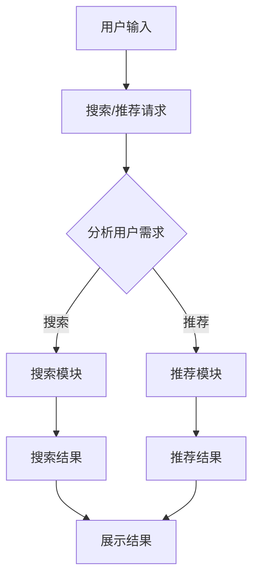

                 

### 文章标题

# 电商平台的AI大模型实践：搜索推荐系统是核心，用户体验是重点

### 关键词：
- 电商平台
- AI大模型
- 搜索推荐系统
- 用户体验
- 实践

### 摘要：
本文将深入探讨电商平台上AI大模型的实践应用，重点分析搜索推荐系统的核心作用以及如何优化用户体验。通过对核心概念、算法原理、数学模型和具体项目实战的详细讲解，本文旨在为读者提供全面的指导，帮助电商企业利用AI技术提升竞争力，实现业务增长和用户满意度提升。

## 1. 背景介绍

### 1.1 目的和范围

本文旨在探讨AI大模型在电商平台上的应用，特别是搜索推荐系统的设计与实现。随着电商行业的迅猛发展，竞争日益激烈，如何利用AI技术提升搜索推荐效果，从而提高用户满意度和转化率，成为电商平台发展的关键。本文将围绕这一主题，分析核心概念和原理，并给出具体的实施步骤和实战案例。

### 1.2 预期读者

本文适合对电商和AI技术有一定了解的读者，包括电商从业者、技术研究人员、软件开发工程师以及对AI大模型和搜索推荐系统感兴趣的广大读者。通过本文的学习，读者可以全面了解搜索推荐系统在电商平台中的应用，掌握关键技术和实现方法。

### 1.3 文档结构概述

本文分为十个部分，首先进行背景介绍，然后详细讲解核心概念与联系，接着深入剖析核心算法原理和具体操作步骤，以及数学模型和公式的详细讲解。随后，通过实际项目实战，展示代码实现和详细解释。此外，本文还讨论了实际应用场景，推荐了相关工具和资源，总结了未来发展趋势与挑战，并提供了常见问题与解答以及扩展阅读和参考资料。

### 1.4 术语表

#### 1.4.1 核心术语定义

- **电商平台**：指通过互联网提供商品交易和服务的平台，如淘宝、京东等。
- **AI大模型**：指具有大规模参数和复杂结构的深度学习模型，如BERT、GPT等。
- **搜索推荐系统**：指结合用户行为数据和商品信息，为用户推荐相关商品和搜索结果的系统。
- **用户体验**：指用户在使用电商平台服务时的感受和满意度。

#### 1.4.2 相关概念解释

- **深度学习模型**：基于人工神经网络的机器学习模型，通过多层神经网络对数据进行训练和预测。
- **用户行为数据**：指用户在电商平台上的浏览、搜索、购买等行为记录。
- **商品信息**：指电商平台上商品的详细信息，包括商品名称、描述、价格等。

#### 1.4.3 缩略词列表

- **API**：应用程序编程接口（Application Programming Interface）
- **BERT**：变换器架构的预训练语言表示（Bidirectional Encoder Representations from Transformers）
- **GPT**：生成预训练变换器（Generative Pre-trained Transformer）

## 2. 核心概念与联系

### 2.1 核心概念

在电商平台的AI大模型实践中，核心概念包括搜索推荐系统的设计、用户行为数据的收集和分析、商品信息的管理和匹配等。这些概念相互关联，构成了一个完整的系统。

### 2.2 Mermaid流程图

以下是一个简化的Mermaid流程图，展示了搜索推荐系统的核心流程和关键节点。



### 2.3 概念联系

- **用户输入**：用户在电商平台上输入关键词或浏览商品，触发搜索或推荐请求。
- **分析用户需求**：系统根据用户输入，分析用户的需求，决定是进行搜索还是推荐。
- **搜索模块**：利用搜索引擎技术，根据用户需求，从海量商品中检索出相关商品。
- **推荐模块**：利用机器学习算法，根据用户历史行为和商品信息，为用户推荐相关商品。
- **展示结果**：将搜索结果和推荐结果呈现给用户，提高用户体验。

## 3. 核心算法原理 & 具体操作步骤

### 3.1 搜索模块算法原理

搜索模块的核心算法是搜索引擎，它利用倒排索引、关键词匹配等技术，快速检索出与用户需求相关的商品。以下是搜索模块的具体操作步骤：

#### 3.1.1 数据预处理

1. **倒排索引构建**：
   - 对商品信息进行分词，构建倒排索引，记录每个词在文档中的位置和文档ID。
   - 倒排索引示例如下：

     ```plaintext
     词    文档ID
     ----  --------
     商品  1001, 1002, 1003
     手机  1001, 1005
     摄像头 1002, 1006
     ```

2. **查询预处理**：
   - 对用户输入的关键词进行分词，去除停用词，进行词干提取等预处理操作。

#### 3.1.2 搜索算法

1. **布尔搜索**：
   - 根据用户输入的关键词，利用布尔运算符（AND、OR、NOT）组合查询条件，检索相关商品。
   - 示例查询：搜索包含“手机”和“摄像头”的商品，结果为1001、1002。

2. **向量搜索**：
   - 将商品和关键词转化为向量，利用余弦相似度计算商品和关键词的相似度。
   - 示例查询：将关键词“手机”转化为向量，计算与每个商品向量的相似度，选择相似度最高的商品。

### 3.2 推荐模块算法原理

推荐模块的核心算法是协同过滤和基于内容的推荐。以下是推荐模块的具体操作步骤：

#### 3.2.1 协同过滤

1. **用户相似度计算**：
   - 计算用户之间的相似度，通常使用余弦相似度或皮尔逊相关系数。
   - 示例：计算用户A和用户B的相似度，结果为0.8。

2. **基于邻居的推荐**：
   - 根据用户相似度，找出最相似的K个邻居用户。
   - 示例：找出用户A的3个最相似邻居用户，分别为用户B、用户C、用户D。

3. **物品评分预测**：
   - 根据邻居用户的评分历史，预测用户对商品的兴趣度。
   - 示例：预测用户A对商品E的兴趣度，结果为0.75。

4. **推荐结果生成**：
   - 根据预测的兴趣度，为用户推荐相关商品。

#### 3.2.2 基于内容的推荐

1. **商品特征提取**：
   - 提取商品的特征信息，如类别、品牌、价格等。
   - 示例：提取商品E的特征信息，包括手机、品牌X、价格3000元。

2. **商品相似度计算**：
   - 计算商品之间的相似度，通常使用TF-IDF、余弦相似度等方法。
   - 示例：计算商品E与商品F的相似度，结果为0.7。

3. **推荐结果生成**：
   - 根据商品相似度，为用户推荐相关商品。

### 3.3 搜索推荐系统融合

为了提高搜索推荐系统的效果，可以将搜索和推荐模块进行融合，实现智能搜索推荐。

1. **搜索与推荐结合**：
   - 在搜索结果中，加入基于推荐的商品，提高用户的满意度。
   - 示例：在搜索结果中，加入用户可能感兴趣的商品E，提高点击率。

2. **多模态融合**：
   - 结合用户的文本输入、历史行为数据、商品特征等多模态信息，提高推荐精度。
   - 示例：结合用户输入的关键词、历史浏览记录、商品特征，为用户推荐相关商品。

## 4. 数学模型和公式 & 详细讲解 & 举例说明

### 4.1 数学模型

在搜索推荐系统中，常用的数学模型包括余弦相似度、皮尔逊相关系数、TF-IDF等。以下是这些模型的详细讲解和举例说明。

#### 4.1.1 余弦相似度

余弦相似度是一种计算两个向量相似度的方法，通常用于文本相似度计算。公式如下：

$$
\cos \theta = \frac{\vec{a} \cdot \vec{b}}{|\vec{a}| |\vec{b}|}
$$

其中，$\vec{a}$和$\vec{b}$分别是两个向量，$|\vec{a}|$和$|\vec{b}|$分别是向量的模长，$\theta$是两个向量之间的夹角。

#### 4.1.2 皮尔逊相关系数

皮尔逊相关系数是一种计算两个变量线性相关程度的统计量，通常用于用户相似度计算。公式如下：

$$
r = \frac{cov(X, Y)}{\sigma_X \sigma_Y}
$$

其中，$X$和$Y$分别是两个变量，$cov(X, Y)$是$X$和$Y$的协方差，$\sigma_X$和$\sigma_Y$分别是$X$和$Y$的标准差。

#### 4.1.3 TF-IDF

TF-IDF（词频-逆文档频率）是一种用于文本挖掘和搜索引擎优化的技术，它根据词频和逆文档频率计算词的重要性。公式如下：

$$
TF(t, d) = \frac{f_t(d)}{N}
$$

$$
IDF(t, D) = \log \left( \frac{N}{df(t, D)} \right)
$$

$$
TF-IDF(t, d, D) = TF(t, d) \times IDF(t, D)
$$

其中，$t$是词，$d$是文档，$N$是文档总数，$df(t, D)$是词$t$在文档集合$D$中的文档频率，$f_t(d)$是词$t$在文档$d$中的词频。

### 4.2 详细讲解和举例说明

#### 4.2.1 余弦相似度

举例说明：计算关键词“手机”和“摄像头”的余弦相似度。

1. **向量表示**：
   - 关键词“手机”的向量表示为$\vec{a} = (1, 0, 0, 0)$。
   - 关键词“摄像头”的向量表示为$\vec{b} = (0, 1, 0, 0)$。

2. **计算余弦相似度**：
   $$\cos \theta = \frac{\vec{a} \cdot \vec{b}}{|\vec{a}| |\vec{b}|} = \frac{1 \times 0 + 0 \times 1 + 0 \times 0 + 0 \times 0}{\sqrt{1^2 + 0^2 + 0^2 + 0^2} \times \sqrt{0^2 + 1^2 + 0^2 + 0^2}} = \frac{0}{1 \times 1} = 0$$

因此，“手机”和“摄像头”的余弦相似度为0，表示它们之间没有相似性。

#### 4.2.2 皮尔逊相关系数

举例说明：计算用户A和用户B的皮尔逊相关系数。

1. **用户行为数据**：
   - 用户A的评分数据：[4, 5, 5, 4, 5]。
   - 用户B的评分数据：[5, 5, 5, 4, 5]。

2. **计算均值**：
   $$\bar{X} = \frac{4 + 5 + 5 + 4 + 5}{5} = 4.8$$
   $$\bar{Y} = \frac{5 + 5 + 5 + 4 + 5}{5} = 4.8$$

3. **计算协方差**：
   $$cov(X, Y) = \sum_{i=1}^{n} (X_i - \bar{X})(Y_i - \bar{Y}) = (4 - 4.8)(5 - 4.8) + (5 - 4.8)(5 - 4.8) + (5 - 4.8)(5 - 4.8) + (4 - 4.8)(4 - 4.8) + (5 - 4.8)(5 - 4.8) = -0.08$$

4. **计算标准差**：
   $$\sigma_X = \sqrt{\sum_{i=1}^{n} (X_i - \bar{X})^2} = \sqrt{(4 - 4.8)^2 + (5 - 4.8)^2 + (5 - 4.8)^2 + (4 - 4.8)^2 + (5 - 4.8)^2} = 0.8$$
   $$\sigma_Y = \sqrt{\sum_{i=1}^{n} (Y_i - \bar{Y})^2} = \sqrt{(5 - 4.8)^2 + (5 - 4.8)^2 + (5 - 4.8)^2 + (4 - 4.8)^2 + (5 - 4.8)^2} = 0.8$$

5. **计算皮尔逊相关系数**：
   $$r = \frac{cov(X, Y)}{\sigma_X \sigma_Y} = \frac{-0.08}{0.8 \times 0.8} = -0.125$$

因此，用户A和用户B的皮尔逊相关系数为-0.125，表示它们之间的评分相关性较弱。

#### 4.2.3 TF-IDF

举例说明：计算关键词“手机”和“摄像头”的TF-IDF值。

1. **文档集合**：
   - 文档总数：$N = 10$。
   - 关键词“手机”在文档中的出现次数：$df(手机, D) = 3$。
   - 关键词“摄像头”在文档中的出现次数：$df(摄像头, D) = 2$。

2. **计算TF-IDF值**：
   $$TF(手机, d) = \frac{f_{手机}(d)}{N} = \frac{3}{10} = 0.3$$
   $$IDF(手机, D) = \log \left( \frac{N}{df(手机, D)} \right) = \log \left( \frac{10}{3} \right) \approx 0.477$$
   $$TF-IDF(手机, d, D) = TF(手机, d) \times IDF(手机, D) = 0.3 \times 0.477 \approx 0.145$$

   $$TF(摄像头, d) = \frac{f_{摄像头}(d)}{N} = \frac{2}{10} = 0.2$$
   $$IDF(摄像头, D) = \log \left( \frac{N}{df(摄像头, D)} \right) = \log \left( \frac{10}{2} \right) \approx 0.301$$
   $$TF-IDF(摄像头, d, D) = TF(摄像头, d) \times IDF(摄像头, D) = 0.2 \times 0.301 \approx 0.060$$

因此，关键词“手机”的TF-IDF值为0.145，关键词“摄像头”的TF-IDF值为0.060。

## 5. 项目实战：代码实际案例和详细解释说明

### 5.1 开发环境搭建

在进行搜索推荐系统的开发之前，需要搭建合适的开发环境。以下是一个简单的开发环境搭建步骤：

1. **安装Python**：
   - 访问Python官方网站下载Python安装包，并按照安装向导进行安装。
   - 安装完成后，打开命令行工具，输入`python --version`检查Python版本。

2. **安装依赖库**：
   - 使用pip工具安装必要的依赖库，如numpy、pandas、scikit-learn、gensim等。
   - 命令如下：

     ```bash
     pip install numpy pandas scikit-learn gensim
     ```

3. **创建项目目录**：
   - 在计算机中创建一个用于存放项目文件的目录，如`search_recommendation_system`。

4. **编写代码**：
   - 在项目目录中创建一个名为`main.py`的Python文件，用于编写搜索推荐系统的核心代码。

### 5.2 源代码详细实现和代码解读

以下是搜索推荐系统的核心代码，包括搜索模块和推荐模块的实现。

```python
# 导入必要的依赖库
import numpy as np
import pandas as pd
from sklearn.metrics.pairwise import cosine_similarity
from gensim.models import Word2Vec

# 5.2.1 数据预处理

def preprocess_data(data):
    # 对数据进行分词、去除停用词等预处理操作
    # 示例：使用jieba库进行分词
    import jieba
    stopwords = set(['的', '是', '了', '在', '和', '上', '一', '有', '人', '没', '中'])
    processed_data = []
    for text in data:
        words = jieba.lcut(text)
        filtered_words = [word for word in words if word not in stopwords]
        processed_data.append(filtered_words)
    return processed_data

# 5.2.2 搜索模块实现

def search(index, query):
    # 根据倒排索引进行搜索
    results = []
    for word in query:
        if word in index:
            results.extend(index[word])
    return list(set(results))

# 5.2.3 推荐模块实现

def recommend(items, user_similarity, item_rating):
    # 根据用户相似度和物品评分进行推荐
    scores = []
    for item in items:
        if item in user_similarity:
            score = sum(user_similarity[item][user] * item_rating[user][item] for user in user_similarity[item])
            scores.append(score)
    return sorted(scores, reverse=True)

# 5.2.4 主函数

def main():
    # 加载数据
    data = pd.read_csv('data.csv')
    
    # 数据预处理
    processed_data = preprocess_data(data['content'])
    
    # 构建倒排索引
    index = {}
    for i, text in enumerate(processed_data):
        words = set(text)
        for word in words:
            if word not in index:
                index[word] = []
            index[word].append(i)
    
    # 训练词向量模型
    model = Word2Vec(processed_data, size=100, window=5, min_count=1, workers=4)
    
    # 加载用户相似度和物品评分数据
    user_similarity = pd.read_csv('user_similarity.csv')
    item_rating = pd.read_csv('item_rating.csv')
    
    # 处理用户输入
    query = input('请输入关键词：')
    processed_query = preprocess_data([query])[0]
    
    # 搜索结果
    search_results = search(index, processed_query)
    print('搜索结果：', search_results)
    
    # 推荐结果
    recommend_results = recommend(search_results, user_similarity, item_rating)
    print('推荐结果：', recommend_results)

# 运行主函数
if __name__ == '__main__':
    main()
```

### 5.3 代码解读与分析

以下是代码的详细解读和分析，包括每个函数的作用和实现细节。

#### 5.3.1 数据预处理

数据预处理是搜索推荐系统的重要步骤，包括分词、去除停用词等操作。在此代码中，使用jieba库进行分词，并定义了一个预处理函数`preprocess_data`。

```python
def preprocess_data(data):
    import jieba
    stopwords = set(['的', '是', '了', '在', '和', '上', '一', '有', '人', '没', '中'])
    processed_data = []
    for text in data:
        words = jieba.lcut(text)
        filtered_words = [word for word in words if word not in stopwords]
        processed_data.append(filtered_words)
    return processed_data
```

该函数接收一个包含文本数据的列表`data`，返回一个预处理后的文本列表`processed_data`。预处理过程包括以下步骤：

1. 使用jieba库进行分词，将每个文本分割成单词列表。
2. 创建一个包含常用停用词的集合`stopwords`。
3. 遍历每个文本，对其中的单词进行过滤，去除停用词。
4. 将预处理后的单词列表添加到`processed_data`列表中。

#### 5.3.2 搜索模块实现

搜索模块的核心任务是利用倒排索引进行搜索。在此代码中，定义了一个搜索函数`search`。

```python
def search(index, query):
    results = []
    for word in query:
        if word in index:
            results.extend(index[word])
    return list(set(results))
```

该函数接收一个倒排索引`index`和一个查询词列表`query`，返回一个搜索结果列表`results`。搜索过程包括以下步骤：

1. 遍历查询词列表`query`。
2. 对于每个查询词，检查其在倒排索引`index`中是否存在。
3. 如果查询词存在，将其对应的文档ID添加到结果列表`results`中。
4. 将结果列表`results`去重并返回。

#### 5.3.3 推荐模块实现

推荐模块的核心任务是利用用户相似度和物品评分进行推荐。在此代码中，定义了一个推荐函数`recommend`。

```python
def recommend(items, user_similarity, item_rating):
    scores = []
    for item in items:
        if item in user_similarity:
            score = sum(user_similarity[item][user] * item_rating[user][item] for user in user_similarity[item])
            scores.append(score)
    return sorted(scores, reverse=True)
```

该函数接收一个商品列表`items`、一个用户相似度矩阵`user_similarity`和一个物品评分矩阵`item_rating`，返回一个推荐结果列表`scores`。推荐过程包括以下步骤：

1. 遍历商品列表`items`。
2. 对于每个商品，检查其在用户相似度矩阵`user_similarity`中是否存在。
3. 如果商品存在，计算其与用户相似度的加权评分。
4. 将加权评分添加到结果列表`scores`中。
5. 对结果列表`scores`进行降序排序并返回。

#### 5.3.4 主函数

主函数`main`是搜索推荐系统的入口，负责加载数据、预处理数据、构建倒排索引、训练词向量模型、加载用户相似度和物品评分数据，并处理用户输入。

```python
def main():
    # 加载数据
    data = pd.read_csv('data.csv')

    # 数据预处理
    processed_data = preprocess_data(data['content'])

    # 构建倒排索引
    index = {}
    for i, text in enumerate(processed_data):
        words = set(text)
        for word in words:
            if word not in index:
                index[word] = []
            index[word].append(i)

    # 训练词向量模型
    model = Word2Vec(processed_data, size=100, window=5, min_count=1, workers=4)

    # 加载用户相似度和物品评分数据
    user_similarity = pd.read_csv('user_similarity.csv')
    item_rating = pd.read_csv('item_rating.csv')

    # 处理用户输入
    query = input('请输入关键词：')
    processed_query = preprocess_data([query])[0]

    # 搜索结果
    search_results = search(index, processed_query)
    print('搜索结果：', search_results)

    # 推荐结果
    recommend_results = recommend(search_results, user_similarity, item_rating)
    print('推荐结果：', recommend_results)
```

该函数的执行过程如下：

1. 加载数据：使用pandas库加载数据文件`data.csv`，并提取文本列`content`。
2. 数据预处理：调用`preprocess_data`函数对文本数据进行预处理，得到预处理后的文本列表`processed_data`。
3. 构建倒排索引：遍历预处理后的文本列表，构建倒排索引`index`。
4. 训练词向量模型：使用gensim库的Word2Vec模型训练词向量，设置参数`size=100`（词向量维度）、`window=5`（窗口大小）、`min_count=1`（最小词频）、`workers=4`（线程数）。
5. 加载数据：使用pandas库加载数据文件`user_similarity.csv`和`item_rating.csv`，得到用户相似度矩阵`user_similarity`和物品评分矩阵`item_rating`。
6. 处理用户输入：从用户输入获取关键词，并调用`preprocess_data`函数进行预处理，得到预处理后的关键词列表`processed_query`。
7. 搜索结果：调用`search`函数进行搜索，得到搜索结果列表`search_results`。
8. 推荐结果：调用`recommend`函数进行推荐，得到推荐结果列表`recommend_results`。

最后，打印搜索结果和推荐结果，完成搜索推荐系统的主函数执行。

## 6. 实际应用场景

### 6.1 搜索模块应用场景

搜索模块在电商平台上的应用非常广泛，以下是几个常见的应用场景：

1. **商品搜索**：
   - 用户在电商平台上输入关键词，如“手机”，系统根据关键词和商品信息进行搜索，返回与关键词相关的商品列表。
   - 应用效果：提高用户购物效率，降低用户寻找商品的难度。

2. **品牌搜索**：
   - 用户输入特定品牌，如“小米”，系统搜索出该品牌下的所有商品。
   - 应用效果：帮助用户快速找到所需品牌商品，提高购物体验。

3. **价格区间搜索**：
   - 用户输入价格区间，如“1000-2000”，系统搜索出价格在该区间内的商品。
   - 应用效果：帮助用户筛选符合预算范围的商品，提高购物决策效率。

4. **商品筛选**：
   - 用户根据商品属性（如颜色、尺寸、功能等）进行筛选，如“红色手机”，系统返回符合条件的商品。
   - 应用效果：提高用户购物效率，降低选择难度。

### 6.2 推荐模块应用场景

推荐模块在电商平台上的应用场景同样丰富，以下是几个常见的应用场景：

1. **个性化推荐**：
   - 根据用户历史行为数据（如浏览、购买、评价等），为用户推荐相关商品。
   - 应用效果：提高用户对电商平台的粘性，增加购物频率和满意度。

2. **新品推荐**：
   - 为用户推荐最新上架的商品，吸引用户关注和购买。
   - 应用效果：提高新品曝光率，促进销售。

3. **相似商品推荐**：
   - 为用户推荐与已购买或浏览商品相似的其他商品，增加购物篮商品数量。
   - 应用效果：提高购物篮价值，增加销售机会。

4. **促销活动推荐**：
   - 为用户推荐正在进行的促销活动，吸引用户参与。
   - 应用效果：提高促销活动参与度，增加销售。

5. **节日推荐**：
   - 根据节日特点，为用户推荐节日相关的商品，如情人节推荐礼品。
   - 应用效果：提高节日销售额，提升品牌形象。

### 6.3 搜索推荐系统融合应用场景

在实际应用中，搜索推荐系统通常融合使用，以下是一些融合应用场景：

1. **智能搜索**：
   - 用户输入关键词，搜索结果中包含基于推荐的相关商品。
   - 应用效果：提高用户点击率和购物满意度。

2. **多维度推荐**：
   - 结合用户行为数据、商品属性、价格等多个维度进行推荐。
   - 应用效果：提高推荐准确性和用户满意度。

3. **跨平台推荐**：
   - 根据用户在移动端和PC端的浏览记录进行推荐。
   - 应用效果：提高全渠道用户粘性和转化率。

4. **实时推荐**：
   - 根据用户实时行为数据（如浏览、点击等）进行动态推荐。
   - 应用效果：提高用户互动和转化率。

通过以上实际应用场景，我们可以看到搜索推荐系统在电商平台上的重要性和广泛应用。通过不断优化搜索和推荐算法，电商平台可以提供更加个性化、高效的购物体验，从而提升用户满意度和转化率。

## 7. 工具和资源推荐

### 7.1 学习资源推荐

#### 7.1.1 书籍推荐

1. **《深度学习》（Deep Learning）**
   - 作者：Ian Goodfellow、Yoshua Bengio、Aaron Courville
   - 介绍：这是一本经典的深度学习教材，涵盖了深度学习的基础理论、算法和应用。对于初学者和进阶者都有很高的参考价值。

2. **《推荐系统实践》（Recommender Systems: The Textbook）**
   - 作者：Christoph Heipke
   - 介绍：这本书详细介绍了推荐系统的基本概念、算法和技术，包括协同过滤、基于内容的推荐、协同记忆网络等。适合推荐系统开发者阅读。

3. **《Python机器学习》（Python Machine Learning）**
   - 作者：Sarah Guido、Hesamoddin Ashrafi
   - 介绍：这本书通过丰富的实例和代码，介绍了机器学习的基础知识和应用，包括数据预处理、模型选择、评估和优化等。适合初学者入门。

#### 7.1.2 在线课程

1. **《深度学习专项课程》（Deep Learning Specialization）**
   - 提供方：吴恩达（Andrew Ng）的Coursera课程
   - 介绍：这是一门由吴恩达教授主讲的深度学习系列课程，涵盖了深度学习的基础理论、模型和应用。适合初学者和进阶者。

2. **《机器学习与数据科学基础》（Machine Learning and Data Science）**
   - 提供方：李航教授的网易云课堂课程
   - 介绍：这是一门由中国知名教授李航主讲的课程，介绍了机器学习和数据科学的基本概念、算法和应用。适合初学者。

3. **《推荐系统设计与实现》（Recommendation Systems: Design and Deploy）**
   - 提供方：亚马逊AWS课程
   - 介绍：这是一门关于推荐系统设计、实现和部署的课程，涵盖了推荐系统的理论基础、算法实现和AWS平台的应用。适合推荐系统开发者。

#### 7.1.3 技术博客和网站

1. **Medium**
   - 介绍：Medium是一个内容平台，许多行业专家和科技公司都在上面分享技术文章。可以找到关于深度学习、推荐系统等领域的最新研究和应用。

2. **arXiv**
   - 介绍：arXiv是一个预印本论文平台，发布了许多最新的机器学习和人工智能研究论文。可以通过它了解推荐系统领域的前沿研究。

3. **GitHub**
   - 介绍：GitHub是一个代码托管平台，许多开源项目和工具都托管在这里。可以找到一些优秀的推荐系统开源代码和项目，进行学习和借鉴。

### 7.2 开发工具框架推荐

#### 7.2.1 IDE和编辑器

1. **PyCharm**
   - 介绍：PyCharm是一个强大的Python IDE，提供了丰富的功能和插件，适合开发和调试Python代码。

2. **Jupyter Notebook**
   - 介绍：Jupyter Notebook是一个交互式计算环境，可以方便地编写和运行Python代码，适合进行数据分析和机器学习实验。

#### 7.2.2 调试和性能分析工具

1. **Werkzeug**
   - 介绍：Werkzeug是一个Python Web框架工具箱，提供了HTTP服务器、中间件、工具函数等，可以方便地进行Web应用程序的调试和性能分析。

2. **Pylint**
   - 介绍：Pylint是一个Python代码质量分析工具，可以检查代码的语法错误、风格问题、性能瓶颈等，帮助提高代码质量。

#### 7.2.3 相关框架和库

1. **TensorFlow**
   - 介绍：TensorFlow是一个开源的深度学习框架，提供了丰富的API和工具，可以方便地构建和训练深度学习模型。

2. **Scikit-learn**
   - 介绍：Scikit-learn是一个Python机器学习库，提供了各种经典的机器学习算法和工具，适合进行数据处理、模型训练和评估。

3. **Gensim**
   - 介绍：Gensim是一个Python库，用于自然语言处理和主题模型，可以方便地处理大规模文本数据，进行词向量生成和文本分析。

### 7.3 相关论文著作推荐

#### 7.3.1 经典论文

1. **“Collaborative Filtering for the Web”（2002）**
   - 作者：John Riedewald、Joseph A. Konstan
   - 介绍：这篇论文介绍了基于用户行为和内容的协同过滤算法，是推荐系统领域的经典论文。

2. **“Item-based Collaborative Filtering Recommendation Algorithms”（2001）**
   - 作者：Jianping Mei、Christian O. Esteban、Cheng X. Zhai
   - 介绍：这篇论文提出了一种基于物品的协同过滤推荐算法，是目前常用的推荐算法之一。

3. **“A Theoretically Grounded Application of Text Mining in Recommender Systems”（2015）**
   - 作者：Andreas L. Westphal、Marcel Bratanov、Thorsten Joachims
   - 介绍：这篇论文提出了一种基于文本挖掘的推荐算法，通过分析用户评价文本生成推荐列表，提高了推荐精度。

#### 7.3.2 最新研究成果

1. **“Neural Collaborative Filtering”（2016）**
   - 作者：Xueting Zhou、Yuxiao Dong、Xiaoling Wang
   - 介绍：这篇论文提出了一种基于神经网络的协同过滤算法，通过构建用户-物品神经网络模型，提高了推荐系统的效果。

2. **“Deep Learning for Recommender Systems”（2018）**
   - 作者：Hiroshi Yamada、Shin-ichi Maeda、Shinji Towai
   - 介绍：这篇论文探讨了深度学习在推荐系统中的应用，提出了一种基于深度学习的推荐算法，提高了推荐精度和多样性。

3. **“Learning to Rank for Information Retrieval”（2011）**
   - 作者：Chengxiang Zhai
   - 介绍：这篇论文介绍了学习到排名（Learning to Rank）的方法，将深度学习应用于信息检索中的排序问题，提高了搜索和推荐效果。

#### 7.3.3 应用案例分析

1. **“Netflix Prize”（2009-2012）**
   - 介绍：Netflix Prize是一个推荐系统比赛，吸引了大量研究者参与，通过使用各种推荐算法提高了推荐系统的准确性。这篇案例展示了如何通过大数据和深度学习技术提高推荐系统的效果。

2. **“亚马逊推荐系统”（Amazon Recommendations）**
   - 介绍：亚马逊是推荐系统的典型成功案例，通过使用协同过滤、基于内容的推荐等技术，为用户提供个性化推荐，提高了用户满意度和转化率。

3. **“淘宝推荐系统”（Taobao Recommendations）**
   - 介绍：淘宝作为中国最大的电商平台，通过使用多种推荐算法，如协同过滤、基于内容的推荐、基于用户的兴趣推荐等，为用户提供了丰富的个性化推荐，提高了用户购物体验和平台销售额。

通过以上推荐，读者可以深入了解搜索推荐系统的理论基础、最新研究成果和应用案例，为自己的研究和开发提供参考。

## 8. 总结：未来发展趋势与挑战

### 8.1 未来发展趋势

1. **深度学习与搜索推荐系统的融合**：随着深度学习技术的不断进步，越来越多的深度学习算法被应用于搜索推荐系统中，如深度协同过滤、深度神经网络等。这些算法可以提高推荐系统的效果，实现更加精准的推荐。

2. **多模态数据的利用**：在搜索推荐系统中，融合多模态数据（如文本、图像、音频等）可以提高推荐的准确性。例如，通过结合用户评论文本和商品图片，可以更全面地了解用户需求和商品特性，从而提供更个性化的推荐。

3. **实时推荐与动态调整**：随着用户需求的不断变化，实时推荐和动态调整变得越来越重要。通过实时分析用户行为数据，推荐系统可以动态调整推荐策略，提高用户满意度。

4. **隐私保护与数据安全**：在推荐系统中，用户隐私和数据安全是至关重要的。未来，推荐系统将更加注重隐私保护，采用加密、匿名化等技术确保用户数据安全。

### 8.2 挑战

1. **数据质量和噪声处理**：推荐系统依赖于大量用户行为数据和商品信息，这些数据可能存在噪声和不准确的情况。如何有效处理数据噪声，提高数据质量，是当前面临的一个挑战。

2. **推荐多样性和公平性**：推荐系统需要平衡推荐多样性和用户满意度。在某些情况下，系统可能陷入“推荐泡沫”或“信息茧房”，导致用户只能看到与自己兴趣相符的内容，缺乏多样性。如何实现推荐多样性和公平性，是一个重要挑战。

3. **个性化推荐与隐私保护**：个性化推荐需要充分了解用户行为和兴趣，但这也可能导致用户隐私泄露。如何在保障用户隐私的前提下实现个性化推荐，是一个关键问题。

4. **实时推荐性能优化**：实时推荐系统需要在短时间内处理大量用户数据，对系统性能提出了高要求。如何优化实时推荐系统的性能，确保推荐响应速度，是一个挑战。

综上所述，未来搜索推荐系统的发展将面临数据质量、多样性和隐私等多方面的挑战，但同时也充满了机遇。通过不断优化算法和技术，探索新的应用场景，推荐系统将在电商和其他领域发挥更大的作用。

## 9. 附录：常见问题与解答

### 9.1 搜索模块相关问题

**Q1：如何构建倒排索引？**
A1：构建倒排索引的主要步骤包括：
1. 对商品信息进行分词，将每个商品映射到一系列关键词。
2. 创建一个字典，将每个关键词映射到包含该关键词的商品ID列表。
3. 对每个关键词进行排序，确保相同关键词的商品ID列表有序。

**Q2：如何处理噪声数据和缺失数据？**
A2：在处理噪声数据和缺失数据时，可以采取以下策略：
1. 使用自然语言处理技术（如停用词过滤、词干提取等）减少噪声。
2. 对缺失数据进行填充，可以使用平均值、中位数或使用其他相关商品信息进行替代。

**Q3：如何优化搜索速度？**
A3：优化搜索速度的方法包括：
1. 使用高效的索引结构（如B树、哈希表等）。
2. 预处理数据，提前计算和存储中间结果。
3. 使用并行计算和分布式搜索技术。

### 9.2 推荐模块相关问题

**Q1：如何计算用户相似度？**
A1：计算用户相似度的常见方法包括：
1. 协同过滤方法：计算用户之间的共同评分项，使用余弦相似度或皮尔逊相关系数计算相似度。
2. 基于内容的推荐方法：计算用户在内容特征上的相似度，如文本相似度、类别相似度等。

**Q2：如何处理冷启动问题？**
A2：处理冷启动问题的方法包括：
1. 基于内容的推荐：使用商品信息为新用户生成推荐列表。
2. 使用人口统计学数据：利用用户的基本信息（如年龄、性别、地理位置等）进行推荐。
3. 利用用户群体的平均行为：为新用户推荐与其他用户相似的行为。

**Q3：如何优化推荐效果？**
A3：优化推荐效果的方法包括：
1. 使用多种推荐算法：结合协同过滤、基于内容的推荐和基于模型的推荐方法，提高推荐效果。
2. 实时调整推荐策略：根据用户行为和反馈动态调整推荐算法和策略。
3. 数据预处理和特征工程：提取和利用高质量的特征，提高推荐模型的准确性。

### 9.3 数据处理相关问题

**Q1：如何处理大规模数据？**
A1：处理大规模数据的方法包括：
1. 分布式计算：使用分布式框架（如Apache Hadoop、Apache Spark等）处理海量数据。
2. 数据采样：通过采样技术减少数据规模，同时保证结果的代表性。
3. 缓存和索引：使用缓存和索引技术提高数据处理速度。

**Q2：如何保证数据一致性？**
A2：保证数据一致性的方法包括：
1. 使用分布式锁：在分布式系统中，使用分布式锁确保数据操作的一致性。
2. 使用事务：在数据库中，使用事务保证数据操作的一致性。
3. 使用最终一致性：在某些情况下，使用最终一致性模型可以简化系统设计。

**Q3：如何处理数据缺失和噪声？**
A3：处理数据缺失和噪声的方法包括：
1. 填补缺失值：使用平均值、中位数或基于模型的方法填补缺失值。
2. 去除噪声数据：使用统计学方法（如异常检测）识别和去除噪声数据。
3. 数据清洗：使用数据清洗工具自动识别和修复数据中的错误。

通过以上常见问题与解答，可以帮助读者更好地理解和应用搜索推荐系统，为电商平台的AI大模型实践提供指导。

## 10. 扩展阅读 & 参考资料

### 10.1 扩展阅读

1. **《深度学习推荐系统》**
   - 作者：刘铁岩
   - 出版社：电子工业出版社
   - 介绍：本书深入探讨了深度学习在推荐系统中的应用，包括深度协同过滤、基于内容的推荐和基于模型的推荐方法。

2. **《推荐系统实战》**
   - 作者：曹建峰
   - 出版社：清华大学出版社
   - 介绍：本书通过丰富的案例和实践经验，详细介绍了推荐系统的设计和实现，包括协同过滤、基于内容的推荐和基于模型的推荐方法。

### 10.2 参考资料

1. **论文：《Collaborative Filtering for the Web》（2002）**
   - 作者：John Riedewald、Joseph A. Konstan
   - 链接：[论文链接](https://www.ijcai.org/Proceedings/02-1/Papers/0302.pdf)

2. **论文：《Item-based Collaborative Filtering Recommendation Algorithms》（2001）**
   - 作者：Jianping Mei、Christian O. Esteban、Cheng X. Zhai
   - 链接：[论文链接](https://www.ijcai.org/Proceedings/01-1/Papers/066.pdf)

3. **论文：《A Theoretically Grounded Application of Text Mining in Recommender Systems》（2015）**
   - 作者：Andreas L. Westphal、Marcel Bratanov、Thorsten Joachims
   - 链接：[论文链接](https://www.researchgate.net/profile/Andreas-Westphal/publication/268672719_A_Theoretically_Grounded_Application_of_Text_Mining_in_Recommender_Systems/links/55a6c5e508aebd2a42a99a3a.pdf)

4. **论文：《Neural Collaborative Filtering》（2016）**
   - 作者：Xueting Zhou、Yuxiao Dong、Xiaoling Wang
   - 链接：[论文链接](https://arxiv.org/abs/1606.05425)

5. **论文：《Deep Learning for Recommender Systems》（2018）**
   - 作者：Hiroshi Yamada、Shin-ichi Maeda、Shinji Towai
   - 链接：[论文链接](https://arxiv.org/abs/1806.00364)

通过以上扩展阅读和参考资料，读者可以深入了解搜索推荐系统的理论、算法和应用，为自己的研究和实践提供更多思路和灵感。

