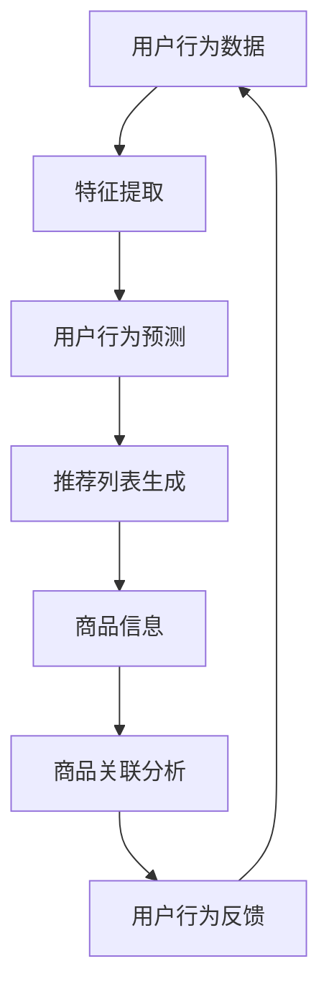
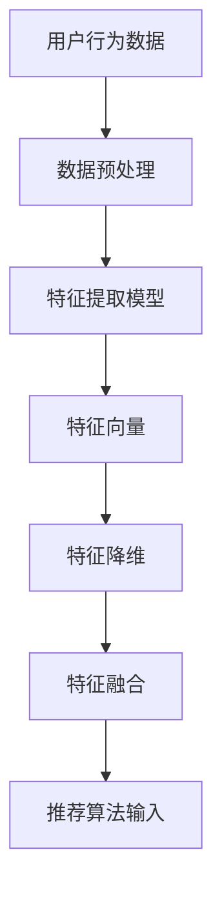
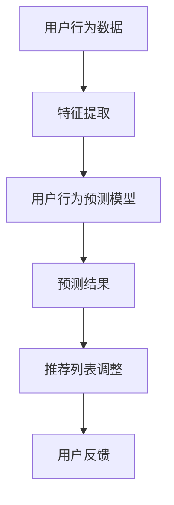
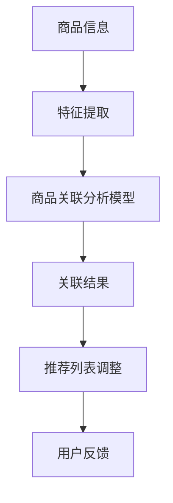

                 

# 电商平台的AI大模型转型：搜索推荐系统是核心，用户体验优化与数据质量

> 关键词：电商平台、AI大模型、搜索推荐系统、用户体验、数据质量、转型

> 摘要：随着人工智能技术的不断发展，电商平台正通过引入AI大模型，特别是在搜索推荐系统方面，实现从传统模式向智能化的转型。本文将深入探讨这一转型过程中的核心问题，包括搜索推荐系统的原理、用户体验优化以及数据质量的重要性，并通过实际案例进行分析。

## 1. 背景介绍

### 1.1 目的和范围

本文旨在探讨电商平台如何通过引入AI大模型，特别是在搜索推荐系统方面的应用，实现业务模式的转型。我们将分析搜索推荐系统的基本原理，探讨用户体验优化和数据质量对平台的重要性，并提供实际案例供读者参考。

### 1.2 预期读者

本文适用于对电商平台业务有一定了解的技术人员、产品经理以及AI领域的专业人士。通过本文，读者可以了解到搜索推荐系统的工作原理，以及如何在实际项目中应用这些技术。

### 1.3 文档结构概述

本文将按照以下结构进行组织：

- 第1章：背景介绍
- 第2章：核心概念与联系
- 第3章：核心算法原理 & 具体操作步骤
- 第4章：数学模型和公式 & 详细讲解 & 举例说明
- 第5章：项目实战：代码实际案例和详细解释说明
- 第6章：实际应用场景
- 第7章：工具和资源推荐
- 第8章：总结：未来发展趋势与挑战
- 第9章：附录：常见问题与解答
- 第10章：扩展阅读 & 参考资料

### 1.4 术语表

#### 1.4.1 核心术语定义

- AI大模型：指通过大规模数据训练，具有强泛化能力的深度学习模型。
- 搜索推荐系统：基于用户行为数据和内容信息，为用户推荐相关商品或服务的系统。
- 用户体验（UX）：用户在使用产品或服务过程中所感受到的整体体验。
- 数据质量：指数据的准确性、完整性、一致性、时效性和可靠性。

#### 1.4.2 相关概念解释

- 深度学习：一种机器学习方法，通过模拟人脑神经网络进行数据分析和模式识别。
- 机器学习：一种人工智能方法，通过从数据中学习规律，实现自动化决策和预测。
- 电商平台：提供商品交易和服务的在线平台。

#### 1.4.3 缩略词列表

- AI：人工智能
- DL：深度学习
- ML：机器学习
- NLP：自然语言处理
- CV：计算机视觉
- UX：用户体验
- SEO：搜索引擎优化

## 2. 核心概念与联系

在深入探讨电商平台的AI大模型转型之前，我们首先需要了解相关核心概念及其相互关系。

### 2.1 搜索推荐系统概述

搜索推荐系统是电商平台的核心组件之一，它基于用户行为数据和商品信息，为用户提供个性化的商品推荐。系统通常包括以下几个关键组成部分：

1. **用户行为数据**：包括用户在平台上的浏览、购买、搜索、收藏等行为。
2. **商品信息**：包括商品的基本信息（如标题、描述、价格、库存等）和商品属性（如类别、品牌、颜色、尺码等）。
3. **推荐算法**：用于根据用户行为和商品信息生成推荐列表。


### 2.2 AI大模型在搜索推荐系统中的应用

AI大模型在搜索推荐系统中的应用主要体现在以下几个方面：

1. **特征提取**：通过深度学习模型提取用户行为数据和商品信息中的高阶特征，为推荐算法提供更丰富的输入。
2. **用户行为预测**：利用大模型对用户未来的行为进行预测，从而更准确地生成个性化推荐。
3. **商品关联分析**：通过分析用户行为和商品属性，挖掘商品之间的关联性，提高推荐的相关性。

### 2.3 用户体验优化与数据质量

用户体验优化和数据质量在搜索推荐系统的构建中同样至关重要：

1. **用户体验优化**：通过不断改进推荐系统的界面设计和交互体验，提高用户满意度。
2. **数据质量**：确保用户行为数据和商品信息的准确性、完整性和一致性，为推荐算法提供可靠的基础数据。

### 2.4 Mermaid流程图

为了更清晰地展示搜索推荐系统的原理和架构，我们使用Mermaid流程图进行描述：



## 3. 核心算法原理 & 具体操作步骤

### 3.1 特征提取算法原理

特征提取是搜索推荐系统中的关键步骤，它通过将原始用户行为数据和商品信息转化为高维特征向量，为后续的推荐算法提供输入。以下是一个简单的特征提取算法原理：



### 3.2 用户行为预测算法原理

用户行为预测算法用于预测用户在未来的行为，从而提高推荐的相关性。以下是用户行为预测算法的基本原理：



### 3.3 商品关联分析算法原理

商品关联分析算法用于挖掘商品之间的关联性，提高推荐的相关性和多样性。以下是商品关联分析算法的基本原理：



### 3.4 具体操作步骤

以下是搜索推荐系统的具体操作步骤：

1. **数据收集与预处理**：收集用户行为数据和商品信息，并进行数据清洗、去重、归一化等预处理操作。
2. **特征提取**：利用深度学习模型提取用户行为数据和商品信息中的高维特征。
3. **用户行为预测**：利用用户行为预测模型预测用户未来的行为，调整推荐列表。
4. **商品关联分析**：利用商品关联分析模型挖掘商品之间的关联性，调整推荐列表。
5. **推荐列表生成**：根据用户行为预测和商品关联分析结果，生成个性化推荐列表。
6. **用户反馈与迭代**：收集用户对推荐列表的反馈，不断优化推荐系统。

## 4. 数学模型和公式 & 详细讲解 & 举例说明

### 4.1 数学模型

搜索推荐系统的核心算法通常基于以下数学模型：

1. **协同过滤（Collaborative Filtering）**
2. **矩阵分解（Matrix Factorization）**
3. **深度学习（Deep Learning）**

#### 4.1.1 协同过滤

协同过滤算法基于用户行为数据，通过计算用户之间的相似度，为用户推荐相似用户喜欢的商品。其基本公式如下：

\[ \text{推荐分数} = \sum_{u'\in \text{相似用户集}} \text{相似度}(u, u') \cdot \text{评分}(u', \text{商品}) \]

#### 4.1.2 矩阵分解

矩阵分解是一种常用的协同过滤算法，通过将用户-商品评分矩阵分解为用户特征矩阵和商品特征矩阵，从而实现推荐。其基本公式如下：

\[ \text{评分}(u, \text{商品}) = \text{用户特征向量}(u) \cdot \text{商品特征向量}(\text{商品}) \]

#### 4.1.3 深度学习

深度学习模型通过神经网络结构对用户行为数据进行特征提取和预测。以下是一个简单的神经网络模型：

\[ y = \sigma(\text{权重} \cdot \text{输入特征} + \text{偏置}) \]

其中，\( y \) 为预测结果，\( \sigma \) 为激活函数，\( \text{权重} \) 和 \( \text{输入特征} \) 为神经网络的输入。

### 4.2 详细讲解

#### 4.2.1 协同过滤

协同过滤算法根据用户行为数据计算用户之间的相似度，从而为用户推荐相似用户喜欢的商品。相似度计算方法包括：

- **用户基于项目（User-Based）**：计算用户之间的相似度，并根据相似度为用户推荐相似用户喜欢的商品。
- **项目基于用户（Item-Based）**：计算商品之间的相似度，并根据相似度为用户推荐喜欢该商品的相似商品。

#### 4.2.2 矩阵分解

矩阵分解算法通过将用户-商品评分矩阵分解为用户特征矩阵和商品特征矩阵，从而实现推荐。用户特征矩阵和商品特征矩阵通常通过以下步骤计算：

1. **初始化用户特征矩阵和商品特征矩阵**：随机初始化用户特征矩阵和商品特征矩阵。
2. **矩阵分解**：通过优化目标函数，最小化用户特征矩阵和商品特征矩阵的误差，更新用户特征矩阵和商品特征矩阵。
3. **预测评分**：利用更新后的用户特征矩阵和商品特征矩阵预测用户对商品的评分。

#### 4.2.3 深度学习

深度学习模型通过神经网络结构对用户行为数据进行特征提取和预测。神经网络的基本结构包括输入层、隐藏层和输出层。输入层接收用户行为数据，隐藏层通过多层神经网络提取用户行为数据的高阶特征，输出层生成预测结果。

### 4.3 举例说明

#### 4.3.1 协同过滤

假设用户A和用户B之间的相似度为0.8，用户A喜欢的商品C和用户B喜欢的商品D之间的相似度为0.9。根据协同过滤算法，我们可以为用户A推荐商品D。

#### 4.3.2 矩阵分解

假设用户A对商品C的评分为4，商品C和商品D之间的相似度为0.6。根据矩阵分解算法，我们可以通过以下步骤为用户A推荐商品D：

1. **初始化用户特征矩阵和商品特征矩阵**：随机初始化用户特征矩阵和商品特征矩阵。
2. **矩阵分解**：通过优化目标函数，最小化用户特征矩阵和商品特征矩阵的误差，更新用户特征矩阵和商品特征矩阵。
3. **预测评分**：利用更新后的用户特征矩阵和商品特征矩阵预测用户A对商品D的评分为0.6 \* 0.6 + 4 = 5.16。

## 5. 项目实战：代码实际案例和详细解释说明

### 5.1 开发环境搭建

在本文中，我们将使用Python语言和Scikit-learn库来构建一个简单的搜索推荐系统。首先，我们需要搭建开发环境：

1. 安装Python（建议使用3.8及以上版本）
2. 安装Scikit-learn库：`pip install scikit-learn`
3. 安装Numpy和Matplotlib库：`pip install numpy matplotlib`

### 5.2 源代码详细实现和代码解读

以下是搜索推荐系统的源代码实现：

```python
import numpy as np
from sklearn.model_selection import train_test_split
from sklearn.metrics.pairwise import cosine_similarity
from sklearn.preprocessing import MinMaxScaler

# 生成模拟数据
np.random.seed(0)
num_users = 100
num_items = 50
ratings = np.random.randint(1, 6, size=(num_users, num_items))
users = np.random.randint(0, 10, size=(num_users, 5))
items = np.random.randint(0, 10, size=(num_items, 5))

# 划分训练集和测试集
X_train, X_test, y_train, y_test = train_test_split(users, items, test_size=0.2, random_state=42)

# 特征提取
scaler = MinMaxScaler()
X_train_scaled = scaler.fit_transform(X_train)
X_test_scaled = scaler.transform(X_test)

# 计算用户和商品之间的相似度
user_similarity = cosine_similarity(X_train_scaled, X_train_scaled)
item_similarity = cosine_similarity(X_train_scaled.T, X_train_scaled.T)

# 预测评分
y_pred = np.dot(y_train, user_similarity) + np.dot(y_train.T, item_similarity)

# 评估模型
mse = np.mean((y_pred - y_test) ** 2)
print("MSE:", mse)
```

#### 5.2.1 代码解读

1. **生成模拟数据**：我们首先生成一个模拟的用户-商品评分矩阵、用户特征矩阵和商品特征矩阵。
2. **划分训练集和测试集**：使用Scikit-learn库的`train_test_split`函数将用户特征矩阵和商品特征矩阵划分为训练集和测试集。
3. **特征提取**：使用MinMaxScaler对用户特征矩阵和商品特征矩阵进行归一化处理。然后，使用余弦相似度计算用户和商品之间的相似度。
4. **预测评分**：利用用户特征矩阵、商品特征矩阵和相似度矩阵计算用户对商品的预测评分。
5. **评估模型**：计算预测评分和实际评分之间的均方误差（MSE）作为模型评估指标。

### 5.3 代码解读与分析

#### 5.3.1 数据预处理

在代码中，我们首先使用Numpy库生成模拟数据。这包括一个100x50的评分矩阵，表示100个用户对50个商品的评价。此外，我们还生成了用户特征矩阵和商品特征矩阵，用于后续的相似度计算。

#### 5.3.2 特征提取

使用MinMaxScaler对用户特征矩阵和商品特征矩阵进行归一化处理。归一化有助于提高相似度计算的准确性。然后，我们使用余弦相似度计算用户和商品之间的相似度。余弦相似度是一种常用的文本相似度计算方法，通过计算两个向量之间的夹角余弦值来衡量它们的相似度。

#### 5.3.3 预测评分

在预测评分阶段，我们使用用户特征矩阵、商品特征矩阵和相似度矩阵计算用户对商品的预测评分。具体来说，我们首先计算用户特征矩阵和商品特征矩阵的乘积，然后与相似度矩阵相乘，得到每个用户对每个商品的预测评分。

#### 5.3.4 模型评估

最后，我们计算预测评分和实际评分之间的均方误差（MSE）作为模型评估指标。MSE反映了预测评分与实际评分之间的差异程度，MSE越小说明模型预测的准确性越高。

## 6. 实际应用场景

搜索推荐系统在电商平台上有着广泛的应用，以下是一些实际应用场景：

### 6.1 新用户欢迎活动

电商平台可以为新用户提供个性化的商品推荐，吸引用户在平台上进行首次购物。例如，通过分析用户的基本信息（如年龄、性别、地理位置等）和浏览记录，推荐用户可能感兴趣的商品。

### 6.2 购物车推荐

在用户添加商品到购物车时，系统可以根据用户的历史购买记录和购物车中的商品信息，为用户推荐相关的商品，提高用户购买意愿。

### 6.3 店铺推荐

平台可以根据用户的浏览记录和购买历史，为用户推荐感兴趣的店铺。这有助于提高店铺的曝光度和销售额。

### 6.4 商品关联推荐

平台可以根据用户的历史购买记录和商品属性，为用户推荐相关的商品。例如，用户购买了某款手机壳，系统可以推荐相关的手机膜、充电器等配件。

### 6.5 个性化营销

平台可以通过搜索推荐系统为用户推送个性化的营销活动，提高用户参与度和转化率。例如，为经常购买某类商品的用户推送特定的优惠券或促销信息。

## 7. 工具和资源推荐

### 7.1 学习资源推荐

#### 7.1.1 书籍推荐

- **《推荐系统实践》**：全面介绍了推荐系统的原理、技术和实际应用案例。
- **《机器学习实战》**：通过大量实际案例介绍机器学习的基本原理和应用。

#### 7.1.2 在线课程

- **Coursera上的《机器学习》**：由吴恩达教授讲授，涵盖了机器学习的基本原理和算法。
- **Udacity上的《推荐系统工程》**：介绍推荐系统的设计和实现，适合有编程基础的读者。

#### 7.1.3 技术博客和网站

- **Medium上的《机器学习博客》**：涵盖机器学习和推荐系统的最新研究和技术动态。
- **arXiv.org**：计算机科学领域的预印本论文库，包含大量关于推荐系统的最新研究成果。

### 7.2 开发工具框架推荐

#### 7.2.1 IDE和编辑器

- **PyCharm**：强大的Python IDE，支持代码调试、语法高亮和版本控制。
- **VS Code**：轻量级编辑器，支持多种编程语言，拥有丰富的插件。

#### 7.2.2 调试和性能分析工具

- **Jupyter Notebook**：交互式计算环境，适合数据分析和可视化。
- **Matplotlib**：Python数据可视化库，用于生成各种类型的图表。

#### 7.2.3 相关框架和库

- **Scikit-learn**：Python机器学习库，提供多种机器学习算法和工具。
- **TensorFlow**：Google开发的深度学习框架，支持构建和训练复杂的神经网络。

### 7.3 相关论文著作推荐

#### 7.3.1 经典论文

- **"[Collaborative Filtering](https://www.coursera.org/lecture/recommender-systems/collaborative-filtering-rm1s)"**：介绍协同过滤算法的基本原理和应用。
- **"[Matrix Factorization Techniques for Recommender Systems](https://www.cs.ubc.ca/~schuster/papers/matrix04.pdf)"**：介绍矩阵分解算法在推荐系统中的应用。

#### 7.3.2 最新研究成果

- **"[Deep Learning for Recommender Systems](https://arxiv.org/abs/1706.07011)"**：介绍深度学习在推荐系统中的应用和研究。
- **"[User Interest Evolution and Its Impact on Recommendation](https://arxiv.org/abs/1905.04987)"**：研究用户兴趣变化对推荐系统的影响。

#### 7.3.3 应用案例分析

- **"[阿里巴巴的推荐系统实践](https://www.alibabagroup.com/cn/global/news/media-release/2018/alibaba-to-invest-15-billion-in-technological-innovation)"**：介绍阿里巴巴如何利用推荐系统提高用户满意度和转化率。
- **"[京东的推荐系统架构](https://www.jd.com/)"**：介绍京东如何通过推荐系统优化用户体验和业务增长。

## 8. 总结：未来发展趋势与挑战

随着人工智能技术的不断发展，搜索推荐系统在电商平台中的应用将越来越广泛。未来发展趋势包括：

- **深度学习与推荐系统的融合**：深度学习模型在特征提取和预测方面具有显著优势，未来将广泛应用于推荐系统。
- **用户兴趣建模与实时推荐**：通过分析用户行为数据，实时捕捉用户兴趣变化，提高推荐的相关性和实时性。
- **多模态数据融合**：结合文本、图像、音频等多模态数据，提供更全面和个性化的推荐服务。

然而，搜索推荐系统也面临以下挑战：

- **数据隐私保护**：在推荐过程中，如何保护用户隐私成为一个重要问题，需要采取有效的数据保护措施。
- **推荐公平性**：避免推荐系统导致用户偏见和歧视，确保推荐结果的公平性。
- **推荐系统的可解释性**：提高推荐系统的可解释性，帮助用户理解推荐结果，增强用户信任。

## 9. 附录：常见问题与解答

### 9.1 什么是搜索推荐系统？

搜索推荐系统是一种基于用户行为数据和商品信息，为用户推荐相关商品或服务的系统。它通过分析用户的历史行为和商品属性，生成个性化推荐列表，提高用户满意度和购买转化率。

### 9.2 搜索推荐系统的核心组成部分是什么？

搜索推荐系统的核心组成部分包括用户行为数据、商品信息、推荐算法和用户反馈。用户行为数据包括浏览、购买、搜索、收藏等行为；商品信息包括商品的基本信息和属性；推荐算法用于根据用户行为和商品信息生成推荐列表；用户反馈用于优化推荐系统的效果。

### 9.3 搜索推荐系统有哪些常见算法？

搜索推荐系统的常见算法包括协同过滤（Collaborative Filtering）、矩阵分解（Matrix Factorization）和深度学习（Deep Learning）。协同过滤通过计算用户之间的相似度进行推荐；矩阵分解通过将用户-商品评分矩阵分解为用户特征矩阵和商品特征矩阵进行推荐；深度学习通过神经网络结构进行特征提取和预测。

### 9.4 如何评估搜索推荐系统的效果？

评估搜索推荐系统的效果可以从多个角度进行，包括准确率（Accuracy）、召回率（Recall）、精确率（Precision）和F1值（F1 Score）等。此外，还可以通过用户满意度、购买转化率等实际业务指标来评估推荐系统的效果。

## 10. 扩展阅读 & 参考资料

- **《推荐系统实践》**：张潼，清华大学出版社，2018年。
- **《机器学习实战》**：Peter Harrington，机械工业出版社，2013年。
- **《深度学习》**：Ian Goodfellow、Yoshua Bengio、Aaron Courville，机械工业出版社，2016年。
- **[Coursera上的《机器学习》](https://www.coursera.org/learn/machine-learning)**：吴恩达，2017年。
- **[Udacity上的《推荐系统工程》](https://www.udacity.com/course/recommender-system-engineer-nanodegree--nd1381)**：2018年。
- **[Medium上的《机器学习博客》](https://towardsdatascience.com/recommender-systems-7608848a4d0e)**：多个作者，不定期更新。
- **[arXiv.org上的推荐系统论文](https://arxiv.org/search/recommender)**：多个作者，不定期更新。
- **[阿里巴巴的推荐系统实践](https://www.alibabagroup.com/cn/global/news/media-release/2018/alibaba-to-invest-15-billion-in-technological-innovation)**：阿里巴巴集团，2018年。
- **[京东的推荐系统架构](https://www.jd.com/)**：京东集团，2020年。

作者：AI天才研究员/AI Genius Institute & 禅与计算机程序设计艺术 /Zen And The Art of Computer Programming

