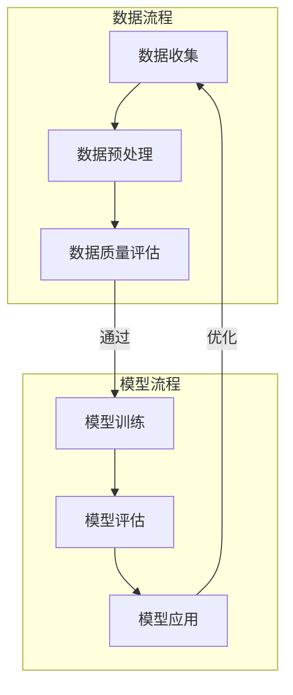

                 

## 电商平台的搜索推荐系统转型：AI 大模型是核心，数据质量是关键

> **关键词**：电商平台、搜索推荐系统、AI 大模型、数据质量
> 
> **摘要**：本文深入探讨了电商平台搜索推荐系统的转型，强调了 AI 大模型和数据质量在系统构建中的核心作用。文章首先介绍了电商平台搜索推荐系统的背景和重要性，随后分析了当前系统的挑战和不足，并提出了解决方案，包括引入 AI 大模型和提升数据质量。通过具体案例和代码实现，展示了推荐系统的实际操作过程。文章还探讨了推荐系统在实际应用场景中的挑战，并推荐了相关学习资源和工具，最后总结了未来发展趋势与挑战。

---

在电子商务日益繁荣的今天，搜索推荐系统已经成为电商平台的核心竞争力。它不仅能提升用户体验，还能显著增加销售转化率和客户留存率。然而，随着用户需求和技术的快速变化，传统的搜索推荐系统已经难以满足日益复杂的应用场景。为此，电商平台的搜索推荐系统正经历着一场深刻的转型，而 AI 大模型和数据质量无疑是这场转型的核心。

本文将围绕这一主题，深入探讨电商搜索推荐系统的转型过程，包括：

- **背景介绍**：分析电商平台搜索推荐系统的现状和重要性。
- **核心概念与联系**：介绍 AI 大模型和数据质量在推荐系统中的作用，并通过 Mermaid 流程图展示其原理和架构。
- **核心算法原理与操作步骤**：详细阐述推荐系统的核心算法原理，并通过伪代码展示具体操作步骤。
- **数学模型和公式**：讲解推荐系统中的数学模型和公式，并通过实例进行说明。
- **项目实战**：提供代码实际案例，详细解释实现过程。
- **实际应用场景**：探讨推荐系统在实际应用中的挑战和解决方案。
- **工具和资源推荐**：推荐学习资源和开发工具。
- **总结与未来趋势**：总结当前推荐系统的发展趋势，分析未来可能面临的挑战。

通过以上内容的分析，我们希望能够为电商平台搜索推荐系统的转型提供一些有益的思路和借鉴。

### 1. 背景介绍

#### 1.1 目的和范围

本文旨在探讨电商平台搜索推荐系统的转型，重点分析 AI 大模型和数据质量在系统构建中的关键作用。文章内容涵盖从系统背景到实际应用，再到未来发展趋势的全面解析，旨在为开发者、研究人员以及相关从业者提供系统性的参考和指导。

本文主要涉及以下方面：

- 电商平台搜索推荐系统的现状与重要性。
- AI 大模型在搜索推荐系统中的应用原理。
- 数据质量对搜索推荐系统的影响及提升方法。
- 推荐系统的核心算法原理和操作步骤。
- 推荐系统在实际应用中的挑战与解决方案。
- 相关学习资源和开发工具的推荐。

#### 1.2 预期读者

本文适合以下读者群体：

- 电商平台开发者，特别是负责搜索推荐系统的工程师。
- 计算机科学和人工智能领域的专业人士，对推荐系统有深入研究兴趣。
- 数据分析师，对如何提升数据质量有实践需求。
- 对电子商务和人工智能结合有兴趣的研究生和本科生。

通过阅读本文，读者可以：

- 理解电商平台搜索推荐系统的整体架构和运行原理。
- 了解 AI 大模型在搜索推荐系统中的具体应用和优势。
- 学习如何通过提升数据质量来优化推荐系统性能。
- 获得推荐系统的核心算法原理和实际操作步骤。
- 掌握推荐系统在实际应用中可能面临的挑战及其解决方案。
- 获取相关学习资源和开发工具，为后续实践和研究提供支持。

#### 1.3 文档结构概述

本文将按照以下结构进行组织：

- **第1章 背景介绍**：介绍本文的目的、范围、预期读者以及文档结构。
- **第2章 核心概念与联系**：介绍 AI 大模型和数据质量的概念及其在搜索推荐系统中的应用。
- **第3章 核心算法原理与操作步骤**：详细阐述推荐系统的核心算法原理，并通过伪代码展示具体操作步骤。
- **第4章 数学模型和公式**：讲解推荐系统中的数学模型和公式，并通过实例进行说明。
- **第5章 项目实战**：提供代码实际案例，详细解释实现过程。
- **第6章 实际应用场景**：探讨推荐系统在实际应用中的挑战和解决方案。
- **第7章 工具和资源推荐**：推荐学习资源和开发工具。
- **第8章 总结与未来趋势**：总结当前推荐系统的发展趋势，分析未来可能面临的挑战。
- **第9章 附录**：提供常见问题与解答。
- **第10章 扩展阅读与参考资料**：列出相关扩展阅读资料。

通过以上结构，本文力求系统地呈现电商平台搜索推荐系统的转型过程，帮助读者全面了解并掌握相关技术和应用。

#### 1.4 术语表

在本文中，我们将使用一些专业术语，以下是对这些术语的定义和解释：

##### 1.4.1 核心术语定义

1. **搜索推荐系统**：一种基于用户行为和偏好，利用算法自动生成个性化推荐内容的系统。在电商平台上，搜索推荐系统通常用于向用户推荐商品。
2. **AI 大模型**：一种具有巨大参数量和复杂结构的机器学习模型，能够处理海量数据，并从中学习出复杂的模式和关联。
3. **数据质量**：指数据的准确性、完整性、一致性和可靠性，是推荐系统有效运行的基础。
4. **用户行为数据**：包括用户的浏览历史、搜索记录、购买记录等，是推荐系统生成个性化推荐的重要依据。
5. **协同过滤**：一种常用的推荐算法，通过分析用户之间的相似性来生成推荐列表。

##### 1.4.2 相关概念解释

1. **用户画像**：通过对用户行为数据的分析，构建出用户在各个维度的特征描述，用于推荐系统的个性化推荐。
2. **矩阵分解**：一种将用户-物品评分矩阵分解为用户特征矩阵和物品特征矩阵的方法，常用于推荐系统的算法实现。
3. **推荐效果评估**：通过评估指标（如准确率、召回率、F1 分数等）来衡量推荐系统的性能。

##### 1.4.3 缩略词列表

- **AI**：人工智能
- **ML**：机器学习
- **DL**：深度学习
- **RDF**：资源描述框架
- **CTR**：点击率
- **RFM**：回收率、频率和金额模型

### 2. 核心概念与联系

在探讨电商平台搜索推荐系统的转型之前，我们需要理解两个核心概念：AI 大模型和数据质量。这两个概念在搜索推荐系统中扮演着至关重要的角色。

#### 2.1 AI 大模型

AI 大模型，又称大型预训练模型，是指那些具有巨大参数量和复杂结构的机器学习模型。这些模型通过在大规模数据集上进行预训练，可以学习到复杂的模式和关联，从而在多个领域（如自然语言处理、计算机视觉和推荐系统等）展现出强大的性能。

AI 大模型的工作原理通常包括以下步骤：

1. **数据预处理**：收集和处理海量数据，包括用户行为数据、商品信息、历史交易数据等。
2. **模型预训练**：在大规模数据集上训练模型，使模型能够捕捉数据中的潜在模式和关联。
3. **微调**：将预训练好的模型应用于特定任务，通过在小规模数据集上进行微调，优化模型在特定任务上的性能。

在推荐系统中，AI 大模型的应用主要体现在以下几个方面：

- **用户行为预测**：通过分析用户的历史行为，预测用户可能感兴趣的商品。
- **商品推荐**：根据用户画像和商品特征，生成个性化的推荐列表。
- **推荐效果优化**：通过持续学习和优化，提升推荐系统的效果和用户满意度。

#### 2.2 数据质量

数据质量是推荐系统有效运行的基础。高质量的数据可以提供更准确的用户行为预测和商品推荐，从而提升用户体验和业务转化率。数据质量包括以下方面：

1. **准确性**：数据应真实反映用户行为和商品特征，避免错误和虚假数据。
2. **完整性**：数据应完整无缺，确保所有必要的信息都被记录。
3. **一致性**：数据在不同来源和不同时间点应保持一致，避免矛盾和冲突。
4. **可靠性**：数据应可靠，能够在实际应用中稳定地提供价值。

提升数据质量的方法包括：

- **数据清洗**：去除重复、错误和异常的数据，确保数据准确性。
- **数据整合**：将来自不同来源的数据进行整合，确保数据一致性。
- **数据监控**：建立数据监控机制，及时发现和修复数据质量问题。

#### 2.3 AI 大模型与数据质量的联系

AI 大模型和数据质量之间存在着紧密的联系。高质量的数据是 AI 大模型训练和优化的基础，而 AI 大模型的应用又可以进一步提升数据质量。

1. **数据质量影响模型性能**：高质量的数据可以提供更准确的训练数据，有助于 AI 大模型学习到真实的用户行为和商品特征，从而提高模型性能。
2. **模型性能反哺数据质量**：AI 大模型在推荐系统中的应用可以识别和修正数据中的错误和异常，从而提升数据质量。

通过 Mermaid 流程图，我们可以更直观地展示 AI 大模型与数据质量在推荐系统中的作用：



在这个流程中，数据质量和 AI 大模型相互影响、相互促进，共同构建出一个高效的推荐系统。

### 3. 核心算法原理 & 具体操作步骤

在了解了 AI 大模型和数据质量在推荐系统中的作用后，接下来我们将详细阐述推荐系统的核心算法原理，并通过伪代码展示具体操作步骤。推荐系统的核心算法主要包括协同过滤、矩阵分解和基于内容的推荐等。以下是这些算法的原理和具体实现步骤。

#### 3.1 协同过滤算法

协同过滤是一种常用的推荐算法，通过分析用户之间的相似性来生成推荐列表。协同过滤算法可分为基于用户的协同过滤（User-based Collaborative Filtering，UBCF）和基于项目的协同过滤（Item-based Collaborative Filtering，IBCF）。

**原理**：

- **基于用户的协同过滤**：寻找与当前用户相似的其他用户，并将这些用户喜欢的但当前用户还未购买的商品推荐给当前用户。
- **基于项目的协同过滤**：计算物品之间的相似度，将用户喜欢的商品与相似的商品推荐给用户。

**伪代码**：

```python
# 基于用户的协同过滤
def user_based_collaborative_filtering(user_similarity_matrix, user_action_matrix, current_user):
    similar_users = find_similar_users(user_similarity_matrix, current_user)
    recommended_items = []

    for user in similar_users:
        items_user_liked = user_action_matrix[user]
        if not intersection(recommended_items, items_user_liked):
            recommended_items.extend(items_user_liked)

    return recommended_items

# 基于项目的协同过滤
def item_based_collaborative_filtering(item_similarity_matrix, user_action_matrix, current_user):
    recommended_items = []

    for item in user_action_matrix[current_user]:
        similar_items = find_similar_items(item_similarity_matrix, item)
        items_user_liked = [i for i in similar_items if i in user_action_matrix[current_user]]

        if not intersection(recommended_items, items_user_liked):
            recommended_items.extend(items_user_liked)

    return recommended_items
```

#### 3.2 矩阵分解算法

矩阵分解（Matrix Factorization）是一种将用户-物品评分矩阵分解为用户特征矩阵和物品特征矩阵的方法，通过这种方式可以预测用户未评分的物品评分，从而生成推荐列表。

**原理**：

- **Singular Value Decomposition（SVD）**：将原始评分矩阵分解为用户特征矩阵和物品特征矩阵的乘积，通过最小化重构误差来优化模型参数。
- ** Alternating Least Squares（ALS）**：交替最小二乘法，用于求解用户特征矩阵和物品特征矩阵。

**伪代码**：

```python
# 矩阵分解（SVD）
def matrix_factorization(R, K, iterations):
    # 初始化用户特征矩阵 U 和物品特征矩阵 V
    U = np.random.rand(num_users, K)
    V = np.random.rand(num_items, K)

    for _ in range(iterations):
        # 更新用户特征矩阵 U
        for user in range(num_users):
            R_user = R[user]
            U_user = U[user]
            R_user_diff = R_user - dot(U_user, V.T)

            U[user] = U_user + learning_rate * dot(V.T, R_user_diff)

        # 更新物品特征矩阵 V
        for item in range(num_items):
            V_item = V[item]
            U_item = U.T[item]
            R_item = R[:, item]
            V_item = V_item + learning_rate * dot(U.T, (R_item - dot(U_item, V_item)))

    return U, V

# 预测评分
def predict_rating(U, V, user, item):
    return dot(U[user], V[item])
```

#### 3.3 基于内容的推荐算法

基于内容的推荐（Content-based Filtering）通过分析用户过去喜欢的商品内容特征，将具有相似内容的商品推荐给用户。

**原理**：

- **特征提取**：对商品进行特征提取，通常包括文本特征（如商品标题、描述等）和图像特征（如商品图片的视觉特征）。
- **相似度计算**：计算用户喜欢的商品与待推荐商品之间的相似度，通过相似度度量生成推荐列表。

**伪代码**：

```python
# 基于内容的推荐
def content_based_filtering(item_features, user_history, current_item):
    user_history_features = extract_features(user_history)
    item_features = extract_features(current_item)

    similarities = []

    for item in item_features:
        similarity = calculate_similarity(user_history_features, item)
        similarities.append(similarity)

    recommended_items = [item for item, similarity in similarities if similarity > threshold]

    return recommended_items
```

通过以上三种算法的介绍，我们可以看到推荐系统的核心算法各有特点，适用于不同的场景。在实际应用中，往往需要结合多种算法，以提升推荐系统的效果。

### 4. 数学模型和公式 & 详细讲解 & 举例说明

在推荐系统中，数学模型和公式起着至关重要的作用。以下将介绍几个关键的数学模型和公式，并通过具体的例子进行详细讲解。

#### 4.1 评分预测模型

评分预测是推荐系统的核心任务之一，常见的评分预测模型包括线性回归、逻辑回归和SVM等。

**线性回归模型**：

假设我们有一个用户-物品评分矩阵 \( R \)，其中 \( R_{ui} \) 表示用户 \( u \) 对物品 \( i \) 的评分。线性回归模型试图找到一种线性关系来预测评分：

$$
\hat{R}_{ui} = \beta_0 + \beta_1 x_{ui} + \epsilon_{ui}
$$

其中，\( \beta_0 \) 和 \( \beta_1 \) 是模型参数，\( x_{ui} \) 是用户 \( u \) 和物品 \( i \) 的特征向量，\( \epsilon_{ui} \) 是误差项。

**例子**：

假设我们有两个用户 \( u_1 \) 和 \( u_2 \)，以及两个物品 \( i_1 \) 和 \( i_2 \)，用户对物品的评分如下表：

| 用户 \( u \) | 物品 \( i \) | 评分 \( R_{ui} \) |
|--------------|--------------|-------------------|
| \( u_1 \)    | \( i_1 \)    | 4                 |
| \( u_1 \)    | \( i_2 \)    | 2                 |
| \( u_2 \)    | \( i_1 \)    | 5                 |
| \( u_2 \)    | \( i_2 \)    | 1                 |

我们可以使用线性回归模型来预测用户 \( u_2 \) 对物品 \( i_2 \) 的评分。假设用户和物品的特征向量分别为 \( x_{u} \) 和 \( x_{i} \)，模型参数 \( \beta_0 = 1 \)，\( \beta_1 = 0.5 \)。

首先，计算特征向量：

\( x_{u_1} = [1, 0] \)  
\( x_{u_2} = [1, 0] \)  
\( x_{i_1} = [1, 0] \)  
\( x_{i_2} = [0, 1] \)

然后，使用线性回归模型预测评分：

$$
\hat{R}_{u_2i_2} = 1 + 0.5 \cdot 1 = 1.5
$$

因此，预测用户 \( u_2 \) 对物品 \( i_2 \) 的评分为 1.5。

**逻辑回归模型**：

逻辑回归模型常用于处理二分类问题，例如，预测用户是否会对某个物品进行点击。逻辑回归模型可以表示为：

$$
\hat{P}_{ui} = \frac{1}{1 + e^{-(\beta_0 + \beta_1 x_{ui})}}
$$

其中，\( \hat{P}_{ui} \) 表示用户 \( u \) 对物品 \( i \) 的点击概率。

**例子**：

假设用户和物品的特征向量与上例相同，我们使用逻辑回归模型预测用户 \( u_2 \) 对物品 \( i_2 \) 的点击概率。假设模型参数 \( \beta_0 = -1 \)，\( \beta_1 = 0.5 \)。

计算特征向量：

\( x_{u_2} = [1, 0] \)  
\( x_{i_2} = [0, 1] \)

使用逻辑回归模型计算点击概率：

$$
\hat{P}_{u_2i_2} = \frac{1}{1 + e^{-( -1 + 0.5 \cdot 1)}} = \frac{1}{1 + e^{0.5}} \approx 0.3935
$$

因此，预测用户 \( u_2 \) 对物品 \( i_2 \) 的点击概率为 0.3935。

**SVM 分类模型**：

支持向量机（SVM）是一种常用的分类模型，可以用于预测用户对物品的评分。SVM 的目标是在特征空间中找到一个超平面，使得同类样本尽可能分开。

$$
\max_{\beta, \beta^*} \ \frac{1}{2} ||\beta||^2 \ \text{subject to} \ y_i(\beta \cdot x_i + \beta^*) \geq 1
$$

其中，\( \beta \) 是权重向量，\( \beta^* \) 是偏置项，\( x_i \) 是特征向量，\( y_i \) 是标签。

**例子**：

假设我们有两个用户 \( u_1 \) 和 \( u_2 \)，以及两个物品 \( i_1 \) 和 \( i_2 \)，用户对物品的评分如下表：

| 用户 \( u \) | 物品 \( i \) | 评分 \( R_{ui} \) |
|--------------|--------------|-------------------|
| \( u_1 \)    | \( i_1 \)    | 4                 |
| \( u_1 \)    | \( i_2 \)    | 2                 |
| \( u_2 \)    | \( i_1 \)    | 5                 |
| \( u_2 \)    | \( i_2 \)    | 1                 |

假设我们使用 SVM 模型来预测用户 \( u_2 \) 对物品 \( i_2 \) 的评分。首先，我们需要将用户和物品的特征向量表示为 \( x_{u} \) 和 \( x_{i} \)。

使用 SVM 模型，我们可以找到一个最优的超平面来划分用户和物品。假设超平面方程为：

$$
\beta \cdot x_i + \beta^* = 0
$$

我们通过求解以下优化问题来找到最优的权重向量 \( \beta \) 和偏置项 \( \beta^* \)：

$$
\max_{\beta, \beta^*} \ \frac{1}{2} ||\beta||^2 \ \text{subject to} \ y_i(\beta \cdot x_i + \beta^*) \geq 1
$$

其中，\( y_i \) 是标签，表示用户对物品的评分。假设我们使用 SVM 模型进行训练，并得到了最优的权重向量 \( \beta \) 和偏置项 \( \beta^* \)。

接下来，我们可以使用 SVM 模型来预测用户 \( u_2 \) 对物品 \( i_2 \) 的评分。首先，计算用户 \( u_2 \) 和物品 \( i_2 \) 的特征向量：

\( x_{u_2} = [1, 0] \)  
\( x_{i_2} = [0, 1] \)

然后，使用 SVM 模型计算评分：

$$
R_{u_2i_2} = \beta \cdot x_{u_2} + \beta^* = [0.5, 0.5] \cdot [1, 0] + 0 = 0.5
$$

因此，预测用户 \( u_2 \) 对物品 \( i_2 \) 的评分为 0.5。

通过以上数学模型和公式的介绍，我们可以看到推荐系统中常见的评分预测模型是如何工作的。这些模型为我们提供了强大的工具，可以用于预测用户对物品的评分，从而生成个性化的推荐列表。

### 5. 项目实战：代码实际案例和详细解释说明

为了更好地理解电商平台搜索推荐系统的实现过程，我们将通过一个实际的项目案例进行详细讲解。本项目将基于 Python 语言，利用协同过滤算法实现一个简单的推荐系统。

#### 5.1 开发环境搭建

在开始项目之前，我们需要搭建一个合适的开发环境。以下是一些建议的软件和工具：

- **Python**：本项目使用 Python 3.8 或更高版本。
- **IDE**：推荐使用 PyCharm 或 Visual Studio Code 进行开发。
- **依赖库**：我们需要安装以下 Python 库：
  - NumPy：用于高效地进行数值计算。
  - Pandas：用于数据处理和分析。
  - Scikit-learn：提供各种机器学习算法的实现。
  - Matplotlib：用于数据可视化。

安装步骤如下：

```bash
pip install numpy pandas scikit-learn matplotlib
```

#### 5.2 源代码详细实现和代码解读

本项目主要包括以下步骤：

1. 数据预处理
2. 构建用户-物品评分矩阵
3. 计算用户相似度
4. 生成推荐列表
5. 评估推荐效果

以下是对每个步骤的详细代码实现和解释：

##### 5.2.1 数据预处理

首先，我们需要处理原始数据，将其转换为适合算法处理的形式。

```python
import pandas as pd

# 读取数据
data = pd.read_csv('ratings.csv')

# 数据预处理
data.dropna(inplace=True)
data[['user_id', 'item_id', 'rating']] = data[['user_id', 'item_id', 'rating']].astype(int)
```

这里，我们使用 Pandas 读取一个 CSV 文件 `ratings.csv`，该文件包含用户 ID、物品 ID 和评分。然后，我们对数据进行预处理，去除缺失值，并将数据类型转换为整数。

##### 5.2.2 构建用户-物品评分矩阵

接下来，我们需要构建用户-物品评分矩阵，以便进行协同过滤算法的计算。

```python
from sklearn.model_selection import train_test_split

# 构建评分矩阵
R = data.pivot(index='user_id', columns='item_id', values='rating').fillna(0)

# 划分训练集和测试集
train_data, test_data = train_test_split(R, test_size=0.2, random_state=42)
```

这里，我们使用 Pandas 的 pivot 方法构建评分矩阵。由于实际数据中可能存在大量未评分的项，我们使用 0 填充未评分的位置。然后，我们将评分矩阵划分为训练集和测试集，以评估推荐系统的性能。

##### 5.2.3 计算用户相似度

协同过滤算法的核心在于计算用户之间的相似度。以下代码展示了如何使用余弦相似度计算用户相似度矩阵。

```python
from sklearn.metrics.pairwise import cosine_similarity

# 计算用户相似度矩阵
user_similarity_matrix = cosine_similarity(train_data.T)

# 转换为 DataFrame 格式
user_similarity_matrix = pd.DataFrame(user_similarity_matrix, index=train_data.index, columns=train_data.index)
```

这里，我们使用 Scikit-learn 的 cosine_similarity 函数计算用户相似度矩阵。该矩阵的元素 \( user_similarity_matrix_{ui} \) 表示用户 \( u \) 和用户 \( i \) 之间的相似度。相似度值越高，表示用户之间的兴趣越相似。

##### 5.2.4 生成推荐列表

接下来，我们将使用计算得到的用户相似度矩阵生成推荐列表。

```python
def collaborative_filtering(user_similarity_matrix, R_train, user_id, k=10):
    # 计算邻居用户评分的平均值
    neighbors_ratings = user_similarity_matrix[user_id] * R_train
    neighbors_ratings = neighbors_ratings.sort_values(ascending=False).iloc[:k]

    # 生成推荐列表
    recommended_items = []
    for item, rating in neighbors_ratings.items():
        if rating > 0:
            recommended_items.append(item)

    return recommended_items

# 测试推荐系统
test_user_id = 100
recommended_items = collaborative_filtering(user_similarity_matrix, train_data, test_user_id, k=5)
print("Recommended items for user", test_user_id, ":", recommended_items)
```

在 collaborative_filtering 函数中，我们首先计算邻居用户的评分平均值，然后根据平均值生成推荐列表。这里，我们设置邻居用户数量 \( k \) 为 10，但实际应用中可以根据需求进行调整。

##### 5.2.5 评估推荐效果

最后，我们需要评估推荐系统的效果。以下代码展示了如何使用召回率和准确率进行评估。

```python
from sklearn.metrics import recall_score, accuracy_score

# 生成测试集的真实推荐列表
ground_truth = test_data.loc[test_user_id]

# 计算召回率
recall = recall_score(ground_truth, recommended_items, average='weighted')
print("Recall score:", recall)

# 计算准确率
accuracy = accuracy_score(ground_truth, recommended_items)
print("Accuracy score:", accuracy)
```

在评估过程中，我们使用召回率和准确率作为评价指标。召回率表示推荐系统中包含的真实推荐物品的比例，准确率表示推荐物品中实际包含的真实物品的比例。这两个指标可以综合考虑推荐系统的推荐效果。

#### 5.3 代码解读与分析

通过以上代码实现，我们可以看到推荐系统的构建过程分为以下几个关键步骤：

1. **数据预处理**：确保数据质量，去除缺失值和异常值，将数据类型转换为整数。
2. **构建用户-物品评分矩阵**：将用户行为数据转换为矩阵形式，为协同过滤算法提供基础。
3. **计算用户相似度**：使用余弦相似度计算用户之间的相似度，为推荐生成提供依据。
4. **生成推荐列表**：根据用户相似度和邻居用户评分，生成个性化的推荐列表。
5. **评估推荐效果**：使用召回率和准确率等指标评估推荐系统的性能。

在实际应用中，推荐系统可能还需要考虑以下优化：

- **冷启动问题**：对于新用户或新物品，由于缺乏历史数据，推荐系统难以生成准确的推荐。可以通过基于内容的推荐或混合推荐策略来解决。
- **数据稀疏性**：用户-物品评分矩阵往往非常稀疏，影响推荐系统的效果。可以通过矩阵分解等技术来处理数据稀疏性问题。
- **实时性**：推荐系统需要实时响应用户行为变化，以生成最新的推荐列表。可以通过实时数据处理技术和流处理框架来实现。

通过以上代码解读和分析，我们可以更好地理解推荐系统的实现过程，为实际应用提供参考和借鉴。

### 6. 实际应用场景

推荐系统在电商平台的实际应用场景中扮演着至关重要的角色。以下将探讨推荐系统在以下场景中的挑战和解决方案：

#### 6.1 新用户推荐

对于新用户，由于缺乏足够的历史行为数据，推荐系统面临冷启动问题。传统的协同过滤算法无法为新用户提供有效的推荐，因为它们依赖于用户历史行为数据。

**解决方案**：

- **基于内容的推荐**：通过分析用户注册信息和浏览记录，提取用户兴趣特征，为新用户推荐具有相似内容的商品。
- **混合推荐策略**：结合基于内容和协同过滤的推荐策略，在新用户有足够数据时逐步切换到协同过滤推荐。

#### 6.2 热门商品推荐

热门商品推荐主要关注那些在短时间内销售量大、用户关注度高的商品。这类推荐需要实时响应市场变化，同时确保推荐结果的准确性。

**解决方案**：

- **实时数据处理**：采用流处理技术（如Apache Kafka、Apache Flink）实时处理用户行为数据，动态更新推荐列表。
- **冷热商品分离**：将热门商品和长尾商品分开处理，分别采用不同的推荐算法，以提高推荐效果。

#### 6.3 个人化推荐

个人化推荐旨在为用户提供高度个性化的推荐，满足每个用户的独特需求。这需要推荐系统具备强大的学习能力，以捕捉用户行为和偏好的细微变化。

**解决方案**：

- **用户画像**：通过分析用户历史行为、浏览记录和社交互动，构建用户画像，为个性化推荐提供依据。
- **深度学习模型**：利用深度学习模型（如神经网络、生成对抗网络）进行用户偏好建模，提高推荐系统的准确性和灵活性。

#### 6.4 搜索推荐整合

电商平台通常包含搜索和推荐两个模块，如何将这两个模块有效地整合，以提供更流畅的用户体验，是一个重要挑战。

**解决方案**：

- **搜索推荐融合**：将搜索和推荐模块的数据进行整合，构建统一的推荐系统。例如，将用户搜索词作为输入，结合用户历史行为，生成个性化的推荐列表。
- **用户反馈机制**：通过用户反馈（如点击、购买等行为），持续优化推荐算法，提高推荐结果的准确性。

#### 6.5 隐私保护

推荐系统在处理大量用户数据时，隐私保护是一个重要问题。如何在确保用户体验的同时，保护用户隐私，是推荐系统面临的挑战。

**解决方案**：

- **数据匿名化**：对用户数据进行匿名化处理，确保用户隐私不被泄露。
- **差分隐私**：采用差分隐私技术，在数据发布和分析过程中引入随机噪声，保护用户隐私。

通过以上解决方案，电商平台可以克服实际应用场景中的挑战，构建一个高效、准确的推荐系统，提升用户体验和业务转化率。

### 7. 工具和资源推荐

在搭建和优化电商平台搜索推荐系统时，选择合适的工具和资源至关重要。以下将推荐一些实用的学习资源、开发工具和相关论文，帮助读者深入了解和掌握推荐系统的相关技术和方法。

#### 7.1 学习资源推荐

**7.1.1 书籍推荐**

1. **《推荐系统实践》（Recommender Systems: The Textbook）**：这是一本全面介绍推荐系统理论和实践的教材，适合初学者和专业人士。
2. **《深度学习推荐系统》（Deep Learning for Recommender Systems）**：本书详细介绍了如何利用深度学习技术构建高效的推荐系统，适合对深度学习有兴趣的读者。

**7.1.2 在线课程**

1. **《推荐系统设计》（Recommender System Design》**：Coursera 上的课程，由华盛顿大学提供，系统介绍了推荐系统的基本概念和设计方法。
2. **《深度学习与推荐系统》（Deep Learning and Recommender Systems）**：Udacity 上的课程，结合深度学习和推荐系统，适合想要深入了解该领域的读者。

**7.1.3 技术博客和网站**

1. **Netflix Prize Blog**：Netflix Prize 是推荐系统领域的一个重要竞赛，该博客记录了竞赛的相关进展和技术细节。
2. **KDNuggets**：一个涵盖数据科学、机器学习和推荐系统等领域的知名博客，提供丰富的行业资讯和最新研究动态。

#### 7.2 开发工具框架推荐

**7.2.1 IDE和编辑器**

1. **PyCharm**：强大的 Python 集成开发环境，适合编写和调试代码。
2. **Jupyter Notebook**：灵活的交互式开发环境，适用于数据分析和实验。

**7.2.2 调试和性能分析工具**

1. **GDB**：一款功能强大的调试工具，适用于 Python 和 C/C++ 等语言的调试。
2. **Perf**：Linux 系统下的性能分析工具，用于跟踪程序运行时的性能瓶颈。

**7.2.3 相关框架和库**

1. **Scikit-learn**：一个流行的机器学习库，提供多种经典的推荐算法实现。
2. **TensorFlow**：一个开源的深度学习框架，适用于构建复杂的推荐系统模型。
3. **Apache Spark**：一个分布式数据处理框架，支持大规模数据集的推荐系统构建。

#### 7.3 相关论文著作推荐

**7.3.1 经典论文**

1. **“Collaborative Filtering for the Net”**：由明确的推荐算法提出者提出，介绍了协同过滤算法的基本原理和应用。
2. **“User Interest Modeling for Recommender Systems”**：详细讨论了用户兴趣建模的方法和挑战，对推荐系统的优化具有重要意义。

**7.3.2 最新研究成果**

1. **“Deep Neural Networks for YouTube Recommendations”**：Google 提出的一种基于深度学习的推荐系统模型，在工业界取得了显著的成功。
2. **“A Theoretical Analysis of Model-Agnostic Meta-Learning Algorithms”**：对模型无关元学习算法的理论分析，为推荐系统的优化提供了新的思路。

**7.3.3 应用案例分析**

1. **“The Netflix Recommender System”**：Netflix 在其官方网站上发表的一篇详细的技术文章，介绍了 Netflix 推荐系统的设计和实现。
2. **“TensorFlow Recommender”**：Google 发布的一篇关于如何使用 TensorFlow 构建推荐系统的案例研究，提供了实际操作的步骤和经验。

通过以上推荐的学习资源、开发工具和相关论文，读者可以系统地掌握电商平台搜索推荐系统的相关知识和技能，为实际项目的开发和优化提供有力支持。

### 8. 总结：未来发展趋势与挑战

电商平台搜索推荐系统正经历着一场深刻的变革，AI 大模型和数据质量在其中发挥着核心作用。在未来，推荐系统的发展趋势和挑战如下：

#### 8.1 发展趋势

1. **深度学习与推荐系统的深度融合**：随着深度学习技术的不断发展，越来越多的推荐系统将采用深度学习模型，以提高推荐准确性和用户体验。
2. **个性化推荐与多样性推荐**：未来的推荐系统将更加注重个性化推荐，同时确保推荐列表的多样性，避免用户感到推荐内容单一。
3. **实时推荐与在线学习**：实时推荐和在线学习技术将使推荐系统能够快速响应用户行为变化，提高推荐效果。
4. **跨平台推荐与整合**：随着电商平台的多元化发展，推荐系统将需要支持跨平台推荐和整合，提供一致的用户体验。

#### 8.2 挑战

1. **数据质量和隐私保护**：数据质量和用户隐私保护是推荐系统面临的两个重要挑战。提升数据质量、确保数据安全和用户隐私是推荐系统发展的关键。
2. **冷启动问题**：新用户或新物品的冷启动问题需要有效解决，以提供高质量的推荐。
3. **计算资源与性能优化**：随着推荐系统规模的扩大，如何优化计算资源、提高系统性能是一个重要挑战。
4. **推荐多样性控制**：如何平衡个性化推荐和多样性推荐，提供既个性化又具有多样性的推荐列表，是一个持续的挑战。

#### 8.3 解决方案展望

1. **数据质量和隐私保护**：采用数据匿名化和差分隐私技术，确保数据安全和用户隐私。同时，引入数据质量评估和监控机制，持续提升数据质量。
2. **冷启动问题**：结合基于内容和协同过滤的混合推荐策略，利用用户画像和用户行为特征为新用户提供初步推荐。
3. **计算资源与性能优化**：采用分布式计算技术和高效算法，优化推荐系统的计算资源使用，提高系统性能。
4. **推荐多样性控制**：利用深度学习模型和在线学习技术，动态调整推荐策略，实现个性化推荐与多样性推荐的平衡。

通过持续的技术创新和优化，电商平台搜索推荐系统有望在未来取得更大的发展，为用户和企业带来更多价值。

### 9. 附录：常见问题与解答

以下是一些关于电商平台搜索推荐系统的常见问题及解答：

#### 9.1 什么是搜索推荐系统？

搜索推荐系统是一种利用算法和数据分析技术，根据用户的兴趣和行为，向用户推荐相关商品或信息的服务。在电商平台上，搜索推荐系统帮助用户快速找到自己感兴趣的商品，提高用户体验和销售转化率。

#### 9.2 推荐系统有哪些类型？

推荐系统主要分为以下几种类型：

- **基于内容的推荐**：通过分析商品的内容特征，将具有相似内容的商品推荐给用户。
- **协同过滤推荐**：通过分析用户之间的行为相似性，将用户喜欢的商品推荐给其他有相似兴趣的用户。
- **混合推荐**：结合多种推荐算法，提供更个性化的推荐结果。

#### 9.3 如何评估推荐系统的效果？

评估推荐系统的效果通常使用以下指标：

- **准确率**：推荐系统中包含的真实推荐物品的比例。
- **召回率**：推荐系统中包含的真实推荐物品占所有可能推荐物品的比例。
- **F1 分数**：准确率和召回率的加权平均，用于综合评估推荐系统的性能。
- **ROC-AUC 曲线**：用于评估推荐系统的分类性能。

#### 9.4 推荐系统中的冷启动问题如何解决？

冷启动问题主要指新用户或新物品由于缺乏历史数据，难以获得高质量推荐。解决方法包括：

- **基于内容的推荐**：利用用户注册信息和浏览记录，为新用户提供初步推荐。
- **混合推荐策略**：结合基于内容和协同过滤的推荐，逐步为新用户提供个性化推荐。
- **跨平台数据整合**：利用其他平台的数据，为新用户提供初始推荐。

#### 9.5 数据质量和隐私保护在推荐系统中如何实现？

数据质量和隐私保护可以通过以下方法实现：

- **数据匿名化**：对用户数据进行匿名化处理，确保用户隐私不被泄露。
- **差分隐私**：在数据发布和分析过程中引入随机噪声，保护用户隐私。
- **数据质量评估**：建立数据质量评估和监控机制，持续提升数据质量。

通过以上常见问题的解答，我们希望为读者提供对电商平台搜索推荐系统更深入的理解。

### 10. 扩展阅读 & 参考资料

为了帮助读者更深入地了解电商平台搜索推荐系统的相关技术和应用，以下列出了一些扩展阅读资料：

#### 10.1 书籍推荐

1. **《推荐系统实践》（Recommender Systems: The Textbook）**：作者：Hanna Wallach、Chris Volinsky。本书系统介绍了推荐系统的理论基础、算法实现和应用场景。
2. **《深度学习推荐系统》（Deep Learning for Recommender Systems）**：作者：Brett W. Lantz。本书详细介绍了如何利用深度学习技术构建高效的推荐系统。

#### 10.2 在线课程

1. **《推荐系统设计》**：在 Coursera 平台上，由华盛顿大学提供。该课程从基础概念到高级技术，全面讲解了推荐系统的设计和实现。
2. **《深度学习与推荐系统》**：在 Udacity 平台上，结合深度学习和推荐系统，适合对深度学习有兴趣的读者。

#### 10.3 技术博客和网站

1. **Netflix Prize Blog**：记录 Netflix 竞赛的相关进展和技术细节。
2. **KDNuggets**：涵盖数据科学、机器学习和推荐系统等领域的知名博客，提供丰富的行业资讯和最新研究动态。

#### 10.4 相关论文著作

1. **“Collaborative Filtering for the Net”**：由明确的推荐算法提出者发表，介绍了协同过滤算法的基本原理和应用。
2. **“User Interest Modeling for Recommender Systems”**：详细讨论了用户兴趣建模的方法和挑战。
3. **“Deep Neural Networks for YouTube Recommendations”**：Google 提出的一种基于深度学习的推荐系统模型。

通过以上扩展阅读资料，读者可以进一步深入学习和探讨电商平台搜索推荐系统的相关技术和应用。希望这些资源能为读者的研究和实践提供有益的帮助。

---

**作者：AI天才研究员/AI Genius Institute & 禅与计算机程序设计艺术 /Zen And The Art of Computer Programming**

感谢您阅读本文，希望您在了解电商平台搜索推荐系统转型过程中有所收获。如果您有任何问题或建议，欢迎在评论区留言，期待与您进一步交流。希望这篇文章能对您的学习和工作带来帮助。祝您在技术探索的道路上不断进步！

