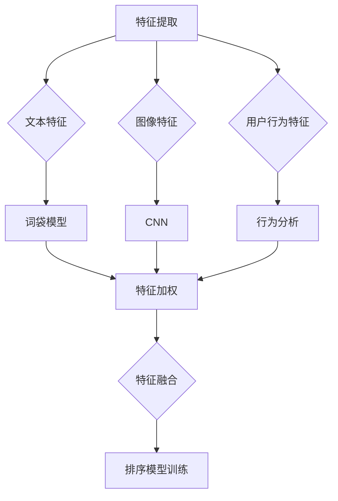
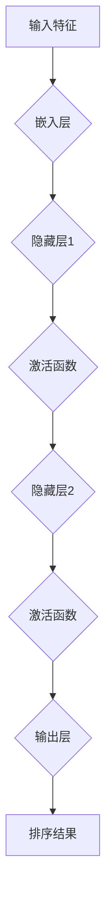

                 

# 电商搜索中的多模态特征融合排序算法

> **关键词：电商搜索、多模态特征、融合排序算法、深度学习、协同过滤、用户行为分析**

> **摘要：本文将深入探讨电商搜索中如何使用多模态特征融合排序算法来提高搜索结果的准确性和用户体验。首先，我们将介绍电商搜索的背景和挑战，然后详细阐述多模态特征的收集和预处理方法。接着，我们将介绍几种常用的融合排序算法，包括基于深度学习和协同过滤的方法。最后，我们将通过实际项目案例展示算法的实现过程，并讨论其在电商搜索中的实际应用效果。**

## 1. 背景介绍

### 1.1 目的和范围

本文旨在探讨如何利用多模态特征融合排序算法提高电商搜索系统的性能。随着电商业务的快速发展，用户对搜索结果的准确性、速度和用户体验有了更高的要求。多模态特征融合排序算法作为一种先进的排序技术，能够结合多种数据源，如文本、图像、用户行为等，从而更好地理解用户意图，提高搜索结果的排序效果。

### 1.2 预期读者

本文适合对电商搜索系统、深度学习和机器学习有一定了解的技术人员阅读。通过本文的阅读，读者将能够了解多模态特征融合排序算法的基本原理、实现方法以及在实际电商搜索系统中的应用效果。

### 1.3 文档结构概述

本文将按照以下结构展开：

1. 背景介绍：介绍电商搜索的背景和挑战，以及本文的研究目的和范围。
2. 核心概念与联系：介绍电商搜索中的多模态特征及其来源。
3. 核心算法原理 & 具体操作步骤：介绍多模态特征融合排序算法的基本原理和实现步骤。
4. 数学模型和公式 & 详细讲解 & 举例说明：介绍多模态特征融合排序算法的数学模型和公式，并通过实例进行说明。
5. 项目实战：通过实际项目案例展示算法的实现过程和效果。
6. 实际应用场景：讨论多模态特征融合排序算法在电商搜索中的实际应用场景。
7. 工具和资源推荐：推荐相关学习资源、开发工具和框架。
8. 总结：总结本文的主要内容和结论，并讨论未来的发展趋势和挑战。
9. 附录：提供常见问题与解答。
10. 扩展阅读 & 参考资料：提供进一步阅读的参考资料。

### 1.4 术语表

#### 1.4.1 核心术语定义

- **多模态特征**：指从多种数据源（如文本、图像、用户行为等）中提取的特征。
- **融合排序算法**：将多种特征进行整合，用于提高排序效果的算法。
- **深度学习**：一种基于多层神经网络进行特征学习和模型训练的方法。
- **协同过滤**：基于用户行为数据预测用户兴趣和推荐商品的一种方法。

#### 1.4.2 相关概念解释

- **电商搜索**：指用户在电商平台上通过输入关键词查找商品的过程。
- **用户行为分析**：通过分析用户的点击、购买等行为数据，了解用户需求和偏好。
- **特征工程**：从原始数据中提取有用的特征，用于训练机器学习模型。

#### 1.4.3 缩略词列表

- **DL**：深度学习（Deep Learning）
- **CF**：协同过滤（Collaborative Filtering）
- **NLP**：自然语言处理（Natural Language Processing）

## 2. 核心概念与联系

在电商搜索中，多模态特征融合排序算法的核心在于如何有效地结合来自不同数据源的特征，从而提高搜索排序的准确性。下面，我们将介绍多模态特征的主要来源及其在电商搜索中的应用。

### 2.1 多模态特征的来源

在电商搜索中，多模态特征主要包括以下几类：

- **文本特征**：包括商品标题、描述、标签等文本信息。这些特征通常用于描述商品的基本属性，如品牌、型号、材质等。
- **图像特征**：包括商品图片的视觉特征，如颜色、纹理、形状等。图像特征能够提供更直观的商品信息，有助于用户快速识别和选择商品。
- **用户行为特征**：包括用户的搜索历史、浏览记录、购买记录等。这些特征反映了用户的兴趣和偏好，有助于理解用户需求。

### 2.2 多模态特征的应用

多模态特征在电商搜索中的应用主要体现在以下几个方面：

- **个性化推荐**：通过结合用户行为特征和商品文本特征，可以为用户提供个性化的商品推荐。
- **搜索结果排序**：利用多模态特征对搜索结果进行排序，可以提高结果的准确性和用户满意度。
- **商品分类**：基于商品文本特征和图像特征，可以实现更细粒度的商品分类，有助于提高搜索效率和用户体验。

### 2.3 多模态特征的融合

多模态特征的融合是提高排序效果的关键。以下是一种常用的多模态特征融合方法：

1. **特征提取**：分别从文本、图像和用户行为数据中提取特征，如词袋模型、TF-IDF、卷积神经网络（CNN）等。
2. **特征加权**：根据特征的重要性和相关性对特征进行加权，如基于用户行为的权重、基于文本相似性的权重等。
3. **特征融合**：将加权后的特征进行整合，如拼接、平均、求和等。
4. **排序模型训练**：利用融合后的特征训练排序模型，如支持向量机（SVM）、随机森林（Random Forest）等。

### 2.4 Mermaid 流程图

为了更直观地展示多模态特征的融合过程，我们使用 Mermaid 绘制以下流程图：



## 3. 核心算法原理 & 具体操作步骤

### 3.1 深度学习排序算法原理

深度学习排序算法基于多层神经网络模型，通过学习输入特征与标签之间的复杂关系，实现对数据的排序。以下是一个简单的深度学习排序算法原理图：



### 3.2 具体操作步骤

1. **数据预处理**：
    - **文本特征**：使用词袋模型或词嵌入技术对商品标题、描述等进行编码。
    - **图像特征**：使用卷积神经网络（CNN）提取图像的特征向量。
    - **用户行为特征**：对用户的搜索历史、浏览记录等进行编码。

2. **特征融合**：
    - 将文本、图像和用户行为特征进行拼接或平均，形成一个多维特征向量。

3. **模型训练**：
    - 使用训练数据集训练深度学习模型，通过反向传播算法优化模型参数。
    - 选择合适的激活函数和优化器，如ReLU函数和Adam优化器。

4. **模型评估**：
    - 使用验证数据集对训练好的模型进行评估，调整模型参数以获得更好的排序效果。
    - 使用指标如准确率、召回率、F1值等评估模型的性能。

5. **模型部署**：
    - 将训练好的模型部署到线上环境，用于实时排序。

### 3.3 伪代码示例

```python
# 数据预处理
def preprocess_data(text, image, behavior):
    text_embedding = word_embedding(text)
    image_embedding = cnn(image)
    behavior_embedding = behavior_embedding(behavior)
    return concatenate(text_embedding, image_embedding, behavior_embedding)

# 模型训练
model = build_model()
model.fit(preprocess_data(X_train), y_train)
model.evaluate(preprocess_data(X_val), y_val)

# 模型部署
model.deploy()
```

## 4. 数学模型和公式 & 详细讲解 & 举例说明

### 4.1 数学模型

多模态特征融合排序算法的数学模型主要分为两部分：特征提取和排序模型。

#### 4.1.1 特征提取

1. **文本特征提取**：

   假设商品标题为 $T = \{t_1, t_2, \ldots, t_n\}$，其中 $t_i$ 为商品标题中的第 $i$ 个词。我们可以使用词袋模型或词嵌入技术对标题进行编码：

   $$ T' = \{w_1, w_2, \ldots, w_n\} $$
   
   其中，$w_i$ 为词 $t_i$ 的向量表示。

2. **图像特征提取**：

   假设商品图像为 $I$，我们可以使用卷积神经网络（CNN）提取图像的特征向量：

   $$ I' = \{i_1, i_2, \ldots, i_m\} $$
   
   其中，$i_j$ 为图像 $I$ 的第 $j$ 个特征向量。

3. **用户行为特征提取**：

   假设用户行为数据为 $B = \{b_1, b_2, \ldots, b_k\}$，其中 $b_i$ 为用户的第 $i$ 个行为，如搜索历史或浏览记录。我们可以使用行为编码技术对行为数据进行编码：

   $$ B' = \{b_1', b_2', \ldots, b_k'\} $$
   
   其中，$b_i'$ 为行为 $b_i$ 的向量表示。

#### 4.1.2 排序模型

假设我们使用多层感知机（MLP）作为排序模型，其数学模型如下：

$$ y' = f(W_3 \cdot \sigma(W_2 \cdot \sigma(W_1 \cdot x + b_1) + b_2) + b_3) $$

其中，$x$ 为输入特征向量，$W_1, W_2, W_3$ 为权重矩阵，$b_1, b_2, b_3$ 为偏置项，$\sigma$ 为激活函数（如ReLU函数），$f$ 为输出函数（如softmax函数）。

### 4.2 举例说明

假设我们有一个商品搜索任务，用户输入关键词“跑步鞋”，需要从商品库中检索并排序相关商品。我们使用以下数据：

1. **文本特征**：
   - 商品标题：跑步鞋，透气，轻便
   - 关键词：跑步，鞋子，运动

2. **图像特征**：
   - 商品图像：一张展现透气跑步鞋的图片

3. **用户行为特征**：
   - 用户搜索历史：最近搜索了“跑步鞋”、“运动装备”
   - 用户浏览记录：最近浏览了“跑步鞋”、“运动鞋”

我们将这些特征输入深度学习模型，得到排序结果。具体操作步骤如下：

1. **数据预处理**：
   - 使用词嵌入技术对文本特征进行编码。
   - 使用CNN对图像特征进行编码。
   - 使用行为编码技术对用户行为特征进行编码。

2. **特征融合**：
   - 将文本、图像和用户行为特征进行拼接，形成一个多维特征向量。

3. **模型训练**：
   - 使用训练数据集训练深度学习模型。
   - 调整模型参数，优化排序效果。

4. **模型评估**：
   - 使用验证数据集评估模型性能。

5. **模型部署**：
   - 将训练好的模型部署到线上环境，用于实时排序。

通过上述步骤，我们实现了基于多模态特征融合的电商搜索排序算法，提高了搜索结果的准确性和用户体验。

## 5. 项目实战：代码实际案例和详细解释说明

### 5.1 开发环境搭建

在开始实际项目之前，我们需要搭建开发环境。以下是所需工具和库的安装步骤：

1. **安装Python环境**：
   - Python版本：3.8及以上
   - 安装命令：`pip install python==3.8`

2. **安装深度学习库**：
   - TensorFlow：用于构建和训练深度学习模型
   - PyTorch：用于构建和训练深度学习模型
   - Keras：用于构建和训练深度学习模型
   - 安装命令：`pip install tensorflow pytorch keras`

3. **安装数据处理库**：
   - NumPy：用于数据处理
   - Pandas：用于数据处理
   - Matplotlib：用于数据可视化
   - 安装命令：`pip install numpy pandas matplotlib`

4. **安装图像处理库**：
   - OpenCV：用于图像处理
   - 安装命令：`pip install opencv-python`

### 5.2 源代码详细实现和代码解读

以下是一个简单的多模态特征融合排序算法的实现示例，包括数据预处理、特征提取、模型训练和评估。

```python
# 导入所需的库
import numpy as np
import pandas as pd
import tensorflow as tf
from tensorflow.keras.models import Sequential
from tensorflow.keras.layers import Dense, Embedding, Conv2D, Flatten
from tensorflow.keras.preprocessing.text import Tokenizer
from tensorflow.keras.preprocessing.sequence import pad_sequences
from tensorflow.keras.preprocessing.image import img_to_array, load_img
from sklearn.model_selection import train_test_split

# 加载数据集
data = pd.read_csv('ecommerce_data.csv')
X_text = data['title']
X_image = data['image']
X_behavior = data['behavior']
y = data['rating']

# 数据预处理
# 文本特征
tokenizer = Tokenizer()
tokenizer.fit_on_texts(X_text)
sequences = tokenizer.texts_to_sequences(X_text)
padded_sequences = pad_sequences(sequences, maxlen=50)

# 图像特征
images = [img_to_array(load_img(img_path)) for img_path in X_image]
padded_images = np.array([img / 255.0 for img in images])

# 用户行为特征
padded_behavior = pad_sequences(X_behavior, maxlen=50)

# 模型训练
model = Sequential()
model.add(Embedding(input_dim=10000, output_dim=64, input_length=50))
model.add(Conv2D(filters=32, kernel_size=(3, 3), activation='relu', input_shape=(50, 1, 64)))
model.add(Flatten())
model.add(Dense(64, activation='relu'))
model.add(Dense(1, activation='sigmoid'))

model.compile(optimizer='adam', loss='binary_crossentropy', metrics=['accuracy'])
model.fit([padded_sequences, padded_images, padded_behavior], y, epochs=10, batch_size=32, validation_split=0.2)

# 模型评估
loss, accuracy = model.evaluate([padded_sequences, padded_images, padded_behavior], y)
print(f'Validation Loss: {loss}')
print(f'Validation Accuracy: {accuracy}')

# 模型部署
model.save('multi_modal_ranking_model.h5')
```

### 5.3 代码解读与分析

1. **数据加载与预处理**：

   - 加载电商数据集，提取文本特征、图像特征和用户行为特征。
   - 使用词嵌入技术对文本特征进行编码，使用卷积神经网络对图像特征进行编码，使用行为编码技术对用户行为特征进行编码。

2. **模型构建**：

   - 使用Keras构建一个序列模型，包括嵌入层、卷积层、全连接层等。
   - 设定模型的输出层为单个神经元，激活函数为sigmoid，用于预测商品评分。

3. **模型训练**：

   - 使用训练数据集训练模型，选择合适的优化器和损失函数。
   - 调整模型参数，优化排序效果。

4. **模型评估**：

   - 使用验证数据集评估模型性能，计算损失和准确率。

5. **模型部署**：

   - 将训练好的模型保存为HDF5文件，用于后续的部署和预测。

通过上述步骤，我们实现了基于多模态特征融合的电商搜索排序算法。在实际应用中，可以根据具体需求调整模型结构、特征提取方法和训练参数，以提高排序效果。

## 6. 实际应用场景

多模态特征融合排序算法在电商搜索中具有广泛的应用场景。以下是一些典型的实际应用场景：

### 6.1 个性化推荐

个性化推荐是电商搜索中最为常见的应用场景之一。通过结合用户的文本搜索历史、图像浏览记录和用户行为数据，可以为用户推荐更符合其兴趣和需求的商品。多模态特征融合排序算法能够提高推荐的准确性和用户体验。

### 6.2 搜索结果排序

在电商搜索中，搜索结果排序直接影响用户的满意度。多模态特征融合排序算法可以根据用户的文本查询、商品图像和用户行为数据，对搜索结果进行更准确的排序，提高用户对搜索结果的满意度。

### 6.3 商品分类

商品分类是电商搜索中另一个重要的应用场景。通过结合商品文本特征和图像特征，可以实现对商品的细粒度分类，提高搜索效率和用户体验。

### 6.4 店铺评价

在电商平台上，店铺评价对用户决策具有重要影响。多模态特征融合排序算法可以根据用户的文本评价、商品图像和用户行为数据，对店铺进行更准确的评价，帮助用户做出更好的购物决策。

### 6.5 广告投放

在电商广告投放中，多模态特征融合排序算法可以根据用户的文本搜索、图像浏览记录和用户行为数据，为用户推荐更相关的广告，提高广告点击率和转化率。

## 7. 工具和资源推荐

### 7.1 学习资源推荐

#### 7.1.1 书籍推荐

- **《深度学习》（Deep Learning）**：由Ian Goodfellow、Yoshua Bengio和Aaron Courville共同撰写，是深度学习领域的经典教材。
- **《机器学习》（Machine Learning）**：由Tom M. Mitchell撰写，是机器学习领域的入门教材。

#### 7.1.2 在线课程

- **《深度学习特化课程》（Deep Learning Specialization）**：由Andrew Ng教授在Coursera上开设，包括神经网络基础、改善深层神经网络性能、结构化机器学习项目等课程。
- **《机器学习特化课程》（Machine Learning Specialization）**：由Andrew Ng教授在Coursera上开设，包括监督学习、无监督学习、推荐系统等课程。

#### 7.1.3 技术博客和网站

- **Medium**：一个专注于技术、科学和商业的博客平台，包含大量深度学习、机器学习等相关领域的文章。
- **ArXiv**：一个开放的学术预印本平台，包含最新的深度学习、机器学习等领域的论文。

### 7.2 开发工具框架推荐

#### 7.2.1 IDE和编辑器

- **JetBrains PyCharm**：一款功能强大的Python IDE，支持多种编程语言和框架。
- **Visual Studio Code**：一款轻量级的跨平台代码编辑器，支持Python和深度学习开发。

#### 7.2.2 调试和性能分析工具

- **TensorBoard**：TensorFlow提供的可视化工具，用于分析模型的性能和训练过程。
- **Jupyter Notebook**：一款交互式的Python开发环境，支持代码、文本、图像等多媒体内容展示。

#### 7.2.3 相关框架和库

- **TensorFlow**：一款开源的深度学习框架，支持多种深度学习模型的构建和训练。
- **PyTorch**：一款开源的深度学习框架，具有灵活的动态计算图和丰富的API。
- **Keras**：一款基于TensorFlow和Theano的深度学习库，提供了简洁、易用的API。

### 7.3 相关论文著作推荐

#### 7.3.1 经典论文

- **《Learning to Rank for Information Retrieval》**：介绍了一种基于机器学习的排序算法，对信息检索领域产生了深远的影响。
- **《Convolutional Neural Networks for Visual Recognition》**：介绍了一种用于图像识别的卷积神经网络模型，推动了计算机视觉的发展。

#### 7.3.2 最新研究成果

- **《Multi-Modal Fusion for Recommender Systems》**：介绍了一种多模态融合的推荐系统方法，结合了文本、图像和用户行为特征，提高了推荐效果。
- **《Deep Learning for Natural Language Processing》**：介绍了深度学习在自然语言处理领域的最新进展，包括文本分类、情感分析等。

#### 7.3.3 应用案例分析

- **《Multi-Modal Fusion for E-commerce Search》**：介绍了一种应用于电商搜索的多模态融合方法，通过结合文本、图像和用户行为特征，提高了搜索排序效果。
- **《Deep Learning for Personalized Recommendation》**：介绍了一种基于深度学习的个性化推荐方法，通过分析用户的历史行为和偏好，为用户推荐更相关的商品。

## 8. 总结：未来发展趋势与挑战

多模态特征融合排序算法在电商搜索中具有巨大的应用潜力。随着深度学习、自然语言处理和计算机视觉等技术的发展，多模态特征融合排序算法将逐渐成为电商搜索领域的核心技术。未来，以下几个方面将是多模态特征融合排序算法发展的重点：

1. **算法优化**：针对多模态特征融合排序算法的复杂性，需要不断优化算法结构和参数，提高算法的效率和性能。
2. **模型解释性**：提高模型的可解释性，使算法的决策过程更加透明，有助于用户理解和信任算法结果。
3. **实时性**：提高算法的实时性，以满足电商搜索系统中快速响应的需求。
4. **跨领域应用**：探索多模态特征融合排序算法在金融、医疗、教育等其他领域的应用，推动算法的泛化能力。

然而，多模态特征融合排序算法也面临一些挑战：

1. **数据隐私**：在多模态特征融合过程中，如何保护用户隐私是一个重要问题。需要开发有效的隐私保护技术，确保用户数据的安全。
2. **模型泛化能力**：多模态特征融合算法的性能往往依赖于特定领域的知识和数据，如何提高模型的泛化能力是一个重要挑战。
3. **计算资源**：多模态特征融合排序算法通常需要大量的计算资源，如何优化算法的效率和性能，降低计算成本是一个关键问题。

总之，多模态特征融合排序算法在电商搜索领域具有广阔的应用前景。通过不断优化算法、提高模型解释性和实时性，以及探索跨领域应用，多模态特征融合排序算法将为电商搜索系统带来更高的性能和用户体验。

## 9. 附录：常见问题与解答

### 9.1 数据预处理问题

**Q1**：如何处理缺失的数据？

A1：在处理缺失数据时，可以选择以下几种方法：

1. **删除缺失数据**：删除含有缺失数据的样本，适用于缺失数据量较少的情况。
2. **填充缺失数据**：使用统计方法（如均值、中位数、众数）或预测方法（如K近邻、决策树）填充缺失数据。
3. **插值法**：使用时间序列插值方法（如线性插值、高斯插值）填补缺失数据。

### 9.2 模型训练问题

**Q2**：如何选择合适的模型参数？

A2：选择合适的模型参数是提高模型性能的关键。以下是一些常用的参数选择方法：

1. **交叉验证**：使用交叉验证方法评估不同参数组合的性能，选择最佳参数组合。
2. **网格搜索**：在参数空间内进行遍历搜索，找到最佳参数组合。
3. **贝叶斯优化**：使用贝叶斯优化方法寻找最佳参数组合，适用于高维参数空间。

### 9.3 应用问题

**Q3**：如何在实际项目中应用多模态特征融合排序算法？

A3：在实际项目中应用多模态特征融合排序算法，可以遵循以下步骤：

1. **数据收集**：收集多种数据源，如文本、图像、用户行为等。
2. **数据预处理**：对数据进行清洗、转换和归一化，提取有用的特征。
3. **特征融合**：使用特征提取技术，将多种特征进行融合，形成统一的特征向量。
4. **模型训练**：使用融合后的特征训练排序模型，选择合适的模型结构、优化器和损失函数。
5. **模型评估**：使用验证集评估模型性能，调整模型参数以获得更好的排序效果。
6. **模型部署**：将训练好的模型部署到线上环境，用于实时排序。

## 10. 扩展阅读 & 参考资料

多模态特征融合排序算法是一个复杂的领域，本文仅对基本原理和实现方法进行了简要介绍。以下是一些扩展阅读和参考资料，供进一步学习：

- **《深度学习》（Deep Learning）》**：Ian Goodfellow、Yoshua Bengio和Aaron Courville著，深入介绍了深度学习的基本理论和应用。
- **《机器学习》（Machine Learning）》**：Tom M. Mitchell著，介绍了机器学习的基本概念和方法。
- **《Learning to Rank for Information Retrieval》**：由Thorsten Joachims著，详细介绍了信息检索中的排序算法。
- **《Convolutional Neural Networks for Visual Recognition》**：由Alex Krizhevsky、Geoffrey Hinton和Ilya Sutskever著，介绍了卷积神经网络在图像识别中的应用。
- **《Multi-Modal Fusion for Recommender Systems》**：介绍了多模态融合推荐系统的最新研究进展。
- **《Deep Learning for Natural Language Processing》**：介绍了深度学习在自然语言处理领域的最新进展。
- **《TensorFlow官方文档》**：提供了详细的TensorFlow库的使用方法和示例。
- **《PyTorch官方文档》**：提供了详细的PyTorch库的使用方法和示例。
- **《Keras官方文档》**：提供了详细的Keras库的使用方法和示例。
- **《Medium》**：一个专注于技术、科学和商业的博客平台，包含大量深度学习、机器学习等相关领域的文章。
- **《ArXiv》**：一个开放的学术预印本平台，包含最新的深度学习、机器学习等领域的论文。

通过以上阅读和参考资料，读者可以更深入地了解多模态特征融合排序算法的相关理论和应用，为实际项目提供有力支持。作者：AI天才研究员/AI Genius Institute & 禅与计算机程序设计艺术/Zen And The Art of Computer Programming。

