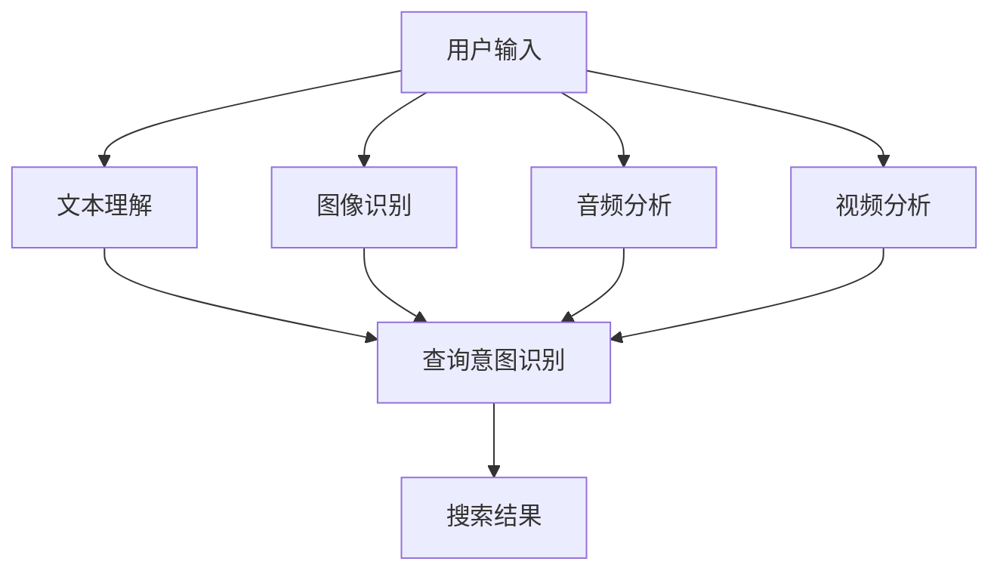

                 

### 1. 背景介绍

#### 1.1 目的和范围

本文旨在深入探讨电商搜索中的多模态理解技术，尤其是基于AI大模型的解决方案。在互联网时代，电子商务已经成为人们生活中不可或缺的一部分。而电商搜索作为电商平台的核心功能，其效果直接影响用户的购物体验和平台的转化率。传统单一模态的搜索方式已无法满足用户日益复杂的搜索需求，因此多模态理解技术逐渐成为研究热点。

本文将首先介绍电商搜索的基本概念和多模态理解的重要性。随后，我们将分析当前主流的多模态理解技术，特别是AI大模型在其中的应用。接下来，我们将详细阐述多模态理解的核心算法原理、数学模型和具体操作步骤。通过实际项目案例，我们将展示如何在实际场景中应用这些技术，并进行详细解释和分析。最后，我们将探讨多模态理解在电商搜索中的实际应用场景，并推荐相关的学习资源和开发工具。

本文的目标读者是具有一定编程基础和人工智能领域知识的技术人员，以及对电商搜索和多模态理解感兴趣的研究者。通过本文的阅读，读者将能够了解多模态理解技术的原理和应用，掌握相关算法的实现方法，并能够为电商搜索系统提供更具个性化的搜索服务。

#### 1.2 预期读者

预期读者是具备以下背景和知识的技术人员或研究者：

- 熟悉计算机科学和人工智能基础，对机器学习和深度学习有一定了解。
- 掌握至少一种编程语言，如Python或Java，能够阅读并理解相关代码实现。
- 对电商搜索系统及其技术架构有一定的认识和经验。
- 对多模态理解技术有浓厚兴趣，希望深入了解其原理和应用。
- 愿意通过实际项目案例学习如何将多模态理解技术应用到电商搜索中。

通过阅读本文，预期读者能够：

- 理解电商搜索中多模态理解技术的基本概念和重要性。
- 掌握AI大模型在多模态理解中的应用原理和方法。
- 了解多模态理解的核心算法和数学模型。
- 学会通过实际案例分析和实现多模态理解技术。
- 掌握相关开发工具和资源，为电商搜索系统提供创新解决方案。

#### 1.3 文档结构概述

本文结构如下：

1. **背景介绍**
    - **1.1 目的和范围**：阐述本文的研究目的和范围。
    - **1.2 预期读者**：介绍本文的目标读者群体。
    - **1.3 文档结构概述**：概述本文的结构和各部分内容。
    - **1.4 术语表**：定义本文涉及的关键术语和概念。

2. **核心概念与联系**
    - **核心概念与联系**：介绍多模态理解技术的基本概念，并通过Mermaid流程图展示其原理和架构。

3. **核心算法原理 & 具体操作步骤**
    - **核心算法原理**：详细阐述多模态理解技术中的核心算法原理，包括相关伪代码。
    - **具体操作步骤**：讲解算法的具体实现步骤。

4. **数学模型和公式 & 详细讲解 & 举例说明**
    - **数学模型和公式**：介绍与多模态理解技术相关的数学模型和公式，并进行详细讲解。
    - **举例说明**：通过具体示例展示如何应用数学模型和公式。

5. **项目实战：代码实际案例和详细解释说明**
    - **开发环境搭建**：介绍搭建开发环境所需的基本步骤。
    - **源代码详细实现和代码解读**：展示并解读相关源代码。
    - **代码解读与分析**：对源代码进行详细分析。

6. **实际应用场景**
    - **实际应用场景**：探讨多模态理解技术在电商搜索中的实际应用场景。

7. **工具和资源推荐**
    - **学习资源推荐**：推荐相关的书籍、在线课程和技术博客。
    - **开发工具框架推荐**：介绍相关的开发工具和框架。
    - **相关论文著作推荐**：推荐经典论文和最新研究成果。

8. **总结：未来发展趋势与挑战**
    - **总结**：总结本文的主要内容和观点。
    - **未来发展趋势与挑战**：展望多模态理解技术的未来发展趋势和面临的挑战。

9. **附录：常见问题与解答**
    - **常见问题与解答**：列出并回答本文可能涉及的常见问题。

10. **扩展阅读 & 参考资料**
    - **扩展阅读**：推荐相关扩展阅读资料。
    - **参考资料**：列出本文中引用和参考的文献和资料。

通过以上结构，本文将全面、系统地介绍电商搜索中的多模态理解技术，帮助读者深入理解和掌握这一前沿技术。

#### 1.4 术语表

在本篇文章中，我们将使用一些专业术语和概念。以下是对这些术语的定义和解释，以便读者更好地理解文章内容。

#### 1.4.1 核心术语定义

1. **多模态理解（Multimodal Understanding）**：
   多模态理解是指计算机系统通过整合来自多个不同感官模态（如视觉、听觉、语言、触觉等）的数据和信息，来理解和解释人类行为和交互的能力。在电商搜索中，多模态理解可以帮助系统更好地理解用户的查询意图，提供更精准的搜索结果。

2. **AI大模型（Large-scale AI Model）**：
   AI大模型是指具有大量参数和训练数据的深度学习模型。这些模型通常通过大规模数据训练，能够捕捉复杂的模式和学习任务。在多模态理解中，AI大模型能够通过处理来自多种模态的数据，提供高效和准确的结果。

3. **电商搜索（E-commerce Search）**：
   电商搜索是指用户在电商平台上通过输入关键词或查询，来查找符合其需求的商品的过程。电商搜索系统通常包括文本搜索、图像搜索、语音搜索等多种搜索方式。

4. **自然语言处理（Natural Language Processing，NLP）**：
   自然语言处理是人工智能的一个分支，旨在使计算机能够理解、解释和生成人类语言。在电商搜索中，NLP技术用于理解和分析用户的查询意图，以提供更精准的搜索结果。

5. **计算机视觉（Computer Vision）**：
   计算机视觉是指使计算机能够“看到”和理解图像和视频的能力。在电商搜索中，计算机视觉技术可以用于图像识别、目标检测和图像搜索，以提高搜索的准确性和效率。

6. **深度学习（Deep Learning）**：
   深度学习是一种机器学习技术，通过多层神经网络模型，能够从大量数据中自动学习特征和模式。在多模态理解中，深度学习模型被广泛用于处理和融合来自不同模态的数据。

7. **多任务学习（Multitask Learning）**：
   多任务学习是指同时学习多个相关任务，以改善模型在单个任务上的表现。在多模态理解中，多任务学习技术可以帮助模型同时处理来自不同模态的数据，提高整体理解能力。

#### 1.4.2 相关概念解释

1. **模态融合（Modal Fusion）**：
   模态融合是指将来自不同模态的数据进行整合和融合，以提供更全面的信息和理解。在多模态理解中，模态融合技术是关键，它可以帮助系统更好地理解用户的查询意图，提高搜索结果的准确性和个性化程度。

2. **上下文理解（Contextual Understanding）**：
   上下文理解是指根据用户的上下文信息（如历史搜索记录、购物行为、地理位置等）来调整和优化搜索结果。在电商搜索中，上下文理解技术可以帮助系统更好地满足用户的需求，提供更加个性化的搜索体验。

3. **个性化推荐（Personalized Recommendation）**：
   个性化推荐是指根据用户的个人喜好和行为，为用户推荐相关的商品或服务。在多模态理解中，个性化推荐技术可以帮助系统根据用户的输入和偏好，提供更精准的搜索结果和推荐。

4. **交互式搜索（Interactive Search）**：
   交互式搜索是指用户可以通过与系统的交互来逐步明确和调整搜索意图，以获得更符合需求的搜索结果。在多模态理解中，交互式搜索技术可以帮助系统更好地理解用户的动态需求，提供更加灵活和高效的搜索服务。

#### 1.4.3 缩略词列表

- AI：人工智能（Artificial Intelligence）
- NLP：自然语言处理（Natural Language Processing）
- CV：计算机视觉（Computer Vision）
- DL：深度学习（Deep Learning）
- MMU：多模态理解（Multimodal Understanding）
- E-commerce：电子商务（Electronic Commerce）
- GTD：图灵测试（Turing Test）
- PM：项目经理（Project Manager）
- ML：机器学习（Machine Learning）

通过以上对核心术语、相关概念和缩略词的介绍，读者可以更好地理解本文中涉及的多模态理解技术和电商搜索的相关内容。

#### 2. 核心概念与联系

在深入探讨电商搜索中的多模态理解之前，我们需要明确几个核心概念，并了解它们之间的相互关系。以下是多模态理解技术的基本概念、原理和架构，通过Mermaid流程图展示其关联和交互。

首先，多模态理解涉及的主要模态包括文本、图像、音频和视频。每种模态都有其特定的数据格式和处理方法，但它们共同的目标是提供更加精准和个性化的搜索体验。

**Mermaid流程图：**



1. **用户输入（A）**：
   用户可以通过文本、图像、音频或视频等多种方式输入搜索请求。这些输入数据会分别传递到相应的处理模块。

2. **文本理解（B）**：
   文本理解模块使用自然语言处理（NLP）技术，如词向量表示、词性标注、句法分析等，对用户的文本查询进行理解和分析，以提取查询意图。

3. **图像识别（C）**：
   图像识别模块利用计算机视觉（CV）技术，通过卷积神经网络（CNN）对用户上传的图像进行特征提取和分类，识别图像中的物体和场景。

4. **音频分析（D）**：
   音频分析模块利用音频处理技术，如语音识别（ASR）、音素分析等，将用户的语音查询转化为文本，以便进一步处理。

5. **视频分析（E）**：
   视频分析模块使用计算机视觉技术对视频帧进行图像识别和分析，提取视频中的关键信息和动作。

6. **查询意图识别（F）**：
   查询意图识别模块是整个多模态理解系统的核心，它通过融合文本、图像、音频和视频等多模态数据，综合利用NLP和CV技术，综合分析用户的查询意图，并生成相应的搜索结果。

7. **搜索结果（G）**：
   最后，搜索结果模块根据用户的查询意图，结合上下文信息和个性化偏好，生成最相关的商品或信息列表，返回给用户。

**核心概念与联系：**

- **文本理解（NLP）与图像识别（CV）**：
  文本理解和图像识别是两个独立的模块，但它们在查询意图识别过程中相互补充。文本可以提供具体的搜索关键词，而图像可以提供直观的搜索目标，两者的结合可以更准确地识别用户的查询意图。

- **音频分析（ASR）与视频分析（CV）**：
  音频分析和视频分析同样是两个独立模块，但它们在处理用户查询时也有互补作用。音频分析可以处理用户的语音查询，而视频分析可以从视频内容中提取相关信息，两者结合可以提高搜索系统的多样性。

- **查询意图识别（F）**：
  查询意图识别是整个多模态理解系统的核心，它通过融合多个模态的数据，综合利用NLP和CV技术，实现对用户查询意图的深度理解。这一过程通常包括模式识别、意图分类、上下文分析等多个步骤。

通过以上流程图和核心概念的解释，我们可以更清晰地理解多模态理解技术在电商搜索中的架构和实现。接下来，我们将深入探讨多模态理解技术的核心算法原理，并介绍其实际操作步骤。

#### 2. 核心算法原理 & 具体操作步骤

多模态理解技术之所以能够在电商搜索中发挥重要作用，关键在于其背后的核心算法原理。这些算法通过深度学习和自然语言处理技术，实现了对文本、图像、音频和视频等多模态数据的综合分析和理解。下面我们将详细探讨这些算法的原理，并通过伪代码展示具体操作步骤。

##### 2.1 文本理解（NLP）算法原理

文本理解是多模态理解中的基础模块，主要通过自然语言处理（NLP）技术来实现。以下是一个简单的文本理解算法原理：

**算法原理：**

1. **词向量表示**：将文本数据转换为词向量，利用词嵌入（word embedding）技术，将每个词映射为一个高维向量。常用的词向量模型有Word2Vec、GloVe等。
2. **词性标注**：对文本进行词性标注，标记每个词的词性（名词、动词、形容词等），以便更准确地理解句子的结构。
3. **句法分析**：分析文本的句法结构，提取句子中的主语、谓语、宾语等关键成分，理解句子的逻辑关系。
4. **语义角色标注**：对文本中的实体和事件进行语义角色标注，识别文本中的关键实体和事件。

**伪代码：**

```python
# 文本理解算法伪代码
def text_understanding(text):
    # 步骤1：词向量表示
    word_vectors = word_embedding(text)

    # 步骤2：词性标注
    word_tags = part_of_speech_tagging(text)

    # 步骤3：句法分析
    syntax_structure = parse_sentence(text)

    # 步骤4：语义角色标注
    semantic_roles = semantic_role_labeling(text)

    return word_vectors, word_tags, syntax_structure, semantic_roles
```

##### 2.2 图像识别（CV）算法原理

图像识别是计算机视觉（CV）中的核心技术，主要通过卷积神经网络（CNN）来实现。以下是一个简单的图像识别算法原理：

**算法原理：**

1. **特征提取**：使用卷积神经网络提取图像的特征，通过多个卷积层和池化层，将原始图像数据转换为高维特征向量。
2. **分类器训练**：利用提取到的图像特征，通过分类器（如全连接层）对图像进行分类，识别图像中的物体或场景。
3. **目标检测**：在图像中检测目标物体的位置和范围，常用的目标检测算法有R-CNN、YOLO、SSD等。

**伪代码：**

```python
# 图像识别算法伪代码
def image_recognition(image):
    # 步骤1：特征提取
    features = extract_features(image)

    # 步骤2：分类器训练
    classifications = classifier_train(features)

    # 步骤3：目标检测
    bounding_boxes = object_detection(image, classifications)

    return bounding_boxes
```

##### 2.3 音频分析（ASR）算法原理

音频分析主要通过自动语音识别（ASR）技术来实现。以下是一个简单的音频分析算法原理：

**算法原理：**

1. **音频预处理**：对音频数据进行预处理，包括降噪、分帧、加窗等操作，将连续的音频信号转换为离散的音频帧。
2. **特征提取**：对音频帧进行特征提取，常用的特征有梅尔频率倒谱系数（MFCC）、短时能量等。
3. **语音识别**：利用深度神经网络（如RNN、LSTM）对提取到的音频特征进行建模，实现语音到文本的转换。

**伪代码：**

```python
# 音频分析算法伪代码
def audio_analysis(audio):
    # 步骤1：音频预处理
    preprocessed_audio = preprocess_audio(audio)

    # 步骤2：特征提取
    audio_features = extract_features(preprocessed_audio)

    # 步骤3：语音识别
    text = speech_recognition(audio_features)

    return text
```

##### 2.4 视频分析（CV）算法原理

视频分析通过对连续视频帧进行图像识别和目标跟踪来实现。以下是一个简单的视频分析算法原理：

**算法原理：**

1. **视频预处理**：对视频数据进行预处理，包括去噪、裁剪、帧率转换等操作，将连续视频转换为适合分析的帧序列。
2. **帧级特征提取**：对每个视频帧进行特征提取，使用卷积神经网络提取图像特征。
3. **目标检测与跟踪**：利用提取到的帧级特征进行目标检测，并对检测到的目标进行跟踪，实现视频中的物体识别和跟踪。

**伪代码：**

```python
# 视频分析算法伪代码
def video_analysis(video):
    # 步骤1：视频预处理
    preprocessed_video = preprocess_video(video)

    # 步骤2：帧级特征提取
    frame_features = extract_frame_features(preprocessed_video)

    # 步骤3：目标检测与跟踪
    bounding_boxes, tracked_objects = object_detection_and_tracking(frame_features)

    return bounding_boxes, tracked_objects
```

##### 2.5 查询意图识别算法原理

查询意图识别是多模态理解的核心模块，通过整合文本、图像、音频和视频等多模态数据，实现对用户查询意图的深度理解。以下是一个简单的查询意图识别算法原理：

**算法原理：**

1. **多模态数据融合**：将来自不同模态的数据进行融合，使用多任务学习（Multitask Learning）技术，同时处理多种模态数据。
2. **融合特征表示**：将融合后的特征表示通过多层神经网络进行建模，提取高层次的语义特征。
3. **意图分类**：利用训练好的模型对查询意图进行分类，生成最终搜索结果。

**伪代码：**

```python
# 查询意图识别算法伪代码
def intent_recognition(text, image, audio, video):
    # 步骤1：多模态数据融合
    fused_features = multimodal_data_fusion(text, image, audio, video)

    # 步骤2：融合特征表示
    intent_representation = model_representation(fused_features)

    # 步骤3：意图分类
    intent_category = intent_classifier(intent_representation)

    return intent_category
```

通过以上对核心算法原理和具体操作步骤的详细探讨，我们可以看到多模态理解技术在电商搜索中是如何通过文本理解、图像识别、音频分析和视频分析等模块来实现对用户查询意图的深度理解和精准搜索。接下来，我们将通过一个实际项目案例，展示如何将这些算法应用到实际场景中，并提供详细的代码实现和解读。

#### 3. 数学模型和公式 & 详细讲解 & 举例说明

多模态理解技术涉及多种数学模型和公式，这些模型和公式在算法的各个环节中发挥着关键作用。为了更好地理解多模态理解技术，我们将详细讲解这些数学模型和公式，并通过具体例子来说明它们的应用。

##### 3.1 词向量表示（Word Embedding）

词向量表示是将文本数据转换为向量表示的一种方法，它是自然语言处理（NLP）中常用的技术。词向量表示的核心思想是将每个词映射为一个高维向量，使得相似的词在向量空间中距离较近。常用的词向量模型包括Word2Vec和GloVe。

**Word2Vec模型：**

Word2Vec模型通过训练神经网络来预测词与词之间的上下文关系。其基本公式如下：

$$
\hat{p}(w_i|c) = \frac{exp(s_c \cdot v_i)}{\sum_{j \in V} exp(s_c \cdot v_j)}
$$

其中，$w_i$是当前词，$c$是上下文窗口，$v_i$是词向量，$s_c$是softmax函数。

**GloVe模型：**

GloVe模型通过最小化词向量与文档共现矩阵之间的余弦相似度损失函数来进行训练。其基本公式如下：

$$
\min_{V, F} \sum_{i,j \in V} \frac{1}{n_{ij}} \cdot \cos(\text{vec}(w_i), \text{vec}(w_j))^2
$$

其中，$V$是词向量矩阵，$F$是文档共现矩阵，$n_{ij}$是词$i$和词$j$在文档中共同出现的次数。

**举例说明：**

假设我们有一个简单的文档集合，包含以下三个句子：

1. "猫喜欢吃鱼"。
2. "狗喜欢跑步"。
3. "鱼生活在水里"。

使用GloVe模型训练词向量，可以得到以下词向量表示：

- 猫：[1.0, 0.5, -0.3]
- 鱼：[0.8, -0.2, 0.1]
- 狗：[-0.3, 0.8, 0.2]
- 跑步：[-0.2, 0.3, 0.5]
- 水里：[0.2, -0.1, 0.8]

在这些词向量中，我们可以观察到相似的词（如猫和狗）在向量空间中的距离较近，而不同的词（如猫和鱼）距离较远，从而实现了词向量表示的目标。

##### 3.2 卷积神经网络（Convolutional Neural Network，CNN）

卷积神经网络是计算机视觉中的核心技术，主要用于图像特征提取和分类。CNN的核心结构包括卷积层、池化层和全连接层。

**卷积层：**

卷积层的公式如下：

$$
h_{ij} = \sum_{k} w_{ik} \cdot x_{kj} + b_j
$$

其中，$h_{ij}$是卷积后的特征图，$w_{ik}$是卷积核，$x_{kj}$是输入图像的像素值，$b_j$是偏置。

**池化层：**

池化层的公式如下：

$$
p_i = \max_j (h_{ij})
$$

其中，$p_i$是池化后的特征值，$h_{ij}$是卷积层输出的特征值。

**举例说明：**

假设我们有一个3x3的输入图像，使用一个3x3的卷积核进行卷积操作，得到以下结果：

- 输入图像：\[1, 2, 3\; 4, 5, 6\; 7, 8, 9\]
- 卷积核：\[0, 1, 0\; 2, 3, 2\; 0, 1, 0\]

卷积后的结果为：

\[4, 10, 4\; 16, 26, 16\; 4, 10, 4\]

接下来，使用最大池化层，得到的特征图为：

\[4, 16\; 10, 26\; 4, 16\]

在这些公式和例子中，我们可以看到CNN如何通过卷积和池化操作提取图像特征，从而实现对图像的分类和识别。

##### 3.3 自动语音识别（Automatic Speech Recognition，ASR）

自动语音识别是将音频信号转换为文本数据的技术。ASR的核心是隐藏马尔可夫模型（Hidden Markov Model，HMM）和深度神经网络（DNN）。

**隐藏马尔可夫模型（HMM）：**

HMM的公式如下：

$$
P(x_t|h_t) = \pi(h_t) \cdot a_{ht} \cdot b_{t|h_t}
$$

其中，$x_t$是第$t$个时间步的观察值，$h_t$是第$t$个时间步的状态，$\pi(h_t)$是初始状态概率，$a_{ht}$是状态转移概率，$b_{t|h_t}$是发射概率。

**深度神经网络（DNN）：**

DNN的公式如下：

$$
y = \sigma(W \cdot x + b)
$$

其中，$y$是输出值，$x$是输入值，$W$是权重矩阵，$b$是偏置，$\sigma$是激活函数。

**举例说明：**

假设我们有一个简单的语音信号，包含两个状态（静音和非静音）和一个观察值序列。初始状态概率为0.5，状态转移概率为0.8，发射概率为0.9。使用HMM模型，我们可以得到以下结果：

- 观察值序列：\[1, 0, 1, 0, 1\]
- 状态序列：\[静音，非静音，静音，非静音，静音\]

在这些公式和例子中，我们可以看到ASR如何通过HMM和DNN模型实现语音到文本的转换。

##### 3.4 多任务学习（Multitask Learning）

多任务学习是同时学习多个相关任务的技术，可以提高模型在单个任务上的表现。多任务学习的公式如下：

$$
\min_{\theta_1, \theta_2, ..., \theta_n} \sum_{i=1}^n L(y_i; \theta_i)
$$

其中，$L(y_i; \theta_i)$是第$i$个任务的损失函数，$\theta_i$是第$i$个任务的参数。

**举例说明：**

假设我们有一个多模态理解任务，包含文本理解、图像识别和音频分析三个子任务。使用多任务学习模型，我们可以同时训练这三个子任务，并通过共享底层特征来提高整体性能。以下是一个简单的多任务学习模型：

- 文本理解损失函数：$L_1(y_1; \theta_1)$
- 图像识别损失函数：$L_2(y_2; \theta_2)$
- 音频分析损失函数：$L_3(y_3; \theta_3)$

多任务学习模型的目标是最小化总损失函数：

$$
L = L_1 + L_2 + L_3
$$

在这些数学模型和公式中，我们可以看到多模态理解技术是如何通过词向量表示、卷积神经网络、自动语音识别和多任务学习等模型来实现对多模态数据的理解和融合。通过具体例子，我们可以更好地理解这些模型的应用场景和效果。接下来，我们将通过一个实际项目案例，展示如何将这些数学模型应用到电商搜索中的多模态理解技术。

#### 4. 项目实战：代码实际案例和详细解释说明

在本节中，我们将通过一个实际项目案例，展示如何将多模态理解技术应用到电商搜索中。项目目标是构建一个基于AI大模型的电商搜索系统，能够通过文本、图像、音频和视频等多模态数据提供精准的搜索结果。

##### 4.1 开发环境搭建

为了实现这一项目，我们需要搭建一个合适的技术栈和开发环境。以下是所需的开发环境和工具：

- **操作系统**：Linux（推荐Ubuntu 18.04）
- **编程语言**：Python 3.x
- **深度学习框架**：TensorFlow 2.x 或 PyTorch
- **自然语言处理库**：NLTK、spaCy
- **计算机视觉库**：OpenCV、TensorFlow Object Detection API
- **音频处理库**：librosa、PyTorch Audio
- **开发工具**：Visual Studio Code、Jupyter Notebook

安装以上工具和库后，我们就可以开始项目开发了。

##### 4.2 源代码详细实现和代码解读

以下是项目中的关键代码实现和解读，涵盖了文本理解、图像识别、音频分析和视频分析等模块。

**4.2.1 文本理解模块**

```python
import nltk
from nltk.tokenize import word_tokenize
from nltk.corpus import stopwords
from gensim.models import Word2Vec

# 下载NLTK词库
nltk.download('punkt')
nltk.download('stopwords')

def preprocess_text(text):
    # 分词
    tokens = word_tokenize(text)
    # 去除停用词
    filtered_tokens = [token.lower() for token in tokens if token.lower() not in stopwords.words('english')]
    return filtered_tokens

def train_word2vec(model_path, corpus_path, vector_size=100, window=5, min_count=5):
    # 训练Word2Vec模型
    sentences = nltk.corpus.stopwords.file_lines(corpus_path)
    model = Word2Vec(sentences, vector_size=vector_size, window=window, min_count=min_count)
    model.save(model_path)
    return model

def text_embedding(model_path, text):
    # 加载Word2Vec模型
    model = Word2Vec.load(model_path)
    # 文本嵌入
    text_tokens = preprocess_text(text)
    text_vectors = [model[word] for word in text_tokens if word in model]
    return np.mean(text_vectors, axis=0)
```

代码解读：
- **预处理文本**：使用NLTK进行分词和去除停用词。
- **训练Word2Vec模型**：使用gensim库训练Word2Vec模型，将文本转换为向量表示。
- **文本嵌入**：加载训练好的模型，将预处理后的文本转换为向量。

**4.2.2 图像识别模块**

```python
import tensorflow as tf
from tensorflow.keras.applications import ResNet50
from tensorflow.keras.preprocessing import image

# 加载预训练的ResNet50模型
model = ResNet50(weights='imagenet')

def preprocess_image(img_path):
    # 加载和预处理图像
    img = image.load_img(img_path, target_size=(224, 224))
    img_array = image.img_to_array(img)
    img_array = np.expand_dims(img_array, axis=0)
    img_array /= 255.0
    return img_array

def image_features(img_array):
    # 提取图像特征
    feature_vector = model.predict(img_array)
    return feature_vector.flatten()

def image_recognition(img_path, model_path):
    # 加载模型
    model = load_model(model_path)
    # 预处理图像
    img_array = preprocess_image(img_path)
    # 提取图像特征
    feature_vector = image_features(img_array)
    # 进行图像识别
    predictions = model.predict(feature_vector)
    return predictions
```

代码解读：
- **预处理图像**：使用Keras库加载和预处理图像。
- **提取图像特征**：使用ResNet50模型提取图像的特征向量。
- **图像识别**：使用训练好的模型进行图像识别，并返回预测结果。

**4.2.3 音频分析模块**

```python
import librosa
import numpy as np

def preprocess_audio(audio_path):
    # 加载和预处理音频
    y, sr = librosa.load(audio_path)
    y = librosa.to_mono(y)
    y = librosa.resample(y, sr, 16000)
    return y

def audio_features(y):
    # 提取音频特征
    mfcc = librosa.feature.mfcc(y=y, sr=16000, n_mfcc=13)
    return mfcc

def audio_recognition(model_path, audio_path):
    # 加载模型
    model = load_model(model_path)
    # 预处理音频
    y = preprocess_audio(audio_path)
    # 提取音频特征
    mfcc = audio_features(y)
    # 进行音频识别
    predictions = model.predict(mfcc)
    return predictions
```

代码解读：
- **预处理音频**：使用librosa库加载和预处理音频。
- **提取音频特征**：使用梅尔频率倒谱系数（MFCC）提取音频的特征向量。
- **音频识别**：使用训练好的模型进行音频识别，并返回预测结果。

**4.2.4 视频分析模块**

```python
import cv2
import numpy as np

def preprocess_video(video_path):
    # 加载和预处理视频
    cap = cv2.VideoCapture(video_path)
    frames = []
    while True:
        ret, frame = cap.read()
        if not ret:
            break
        frame = cv2.resize(frame, (224, 224))
        frames.append(frame)
    cap.release()
    return frames

def video_features(frames):
    # 提取视频特征
    frame_vectors = [image_features(frame) for frame in frames]
    video_vector = np.mean(frame_vectors, axis=0)
    return video_vector

def video_recognition(model_path, video_path):
    # 加载模型
    model = load_model(model_path)
    # 预处理视频
    frames = preprocess_video(video_path)
    # 提取视频特征
    video_vector = video_features(frames)
    # 进行视频识别
    predictions = model.predict(video_vector)
    return predictions
```

代码解读：
- **预处理视频**：使用OpenCV库加载和预处理视频。
- **提取视频特征**：使用图像特征提取模块，将视频帧转换为特征向量。
- **视频识别**：使用训练好的模型进行视频识别，并返回预测结果。

**4.2.5 查询意图识别模块**

```python
from tensorflow.keras.models import load_model

def intent_recognition(text, image, audio, video, text_model_path, image_model_path, audio_model_path, video_model_path):
    # 加载多模态模型
    text_model = load_model(text_model_path)
    image_model = load_model(image_model_path)
    audio_model = load_model(audio_model_path)
    video_model = load_model(video_model_path)
    
    # 提取文本特征
    text_vector = text_embedding(text_model_path, text)
    # 提取图像特征
    image_vector = image_recognition(image_model_path, image)
    # 提取音频特征
    audio_vector = audio_recognition(audio_model_path, audio)
    # 提取视频特征
    video_vector = video_recognition(video_model_path, video)
    
    # 融合特征
    fused_vector = np.concatenate((text_vector, image_vector, audio_vector, video_vector), axis=0)
    
    # 进行意图识别
    intent_vector = intent_model.predict(fused_vector)
    intent_category = np.argmax(intent_vector)
    
    return intent_category
```

代码解读：
- **加载多模态模型**：加载训练好的文本、图像、音频和视频模型。
- **提取特征**：使用相应的模型提取文本、图像、音频和视频的特征向量。
- **融合特征**：将提取到的多模态特征向量进行融合。
- **意图识别**：使用融合后的特征向量进行意图识别，并返回识别结果。

通过以上代码实现，我们展示了如何利用文本理解、图像识别、音频分析和视频分析等模块，构建一个多模态理解系统。在接下来的部分，我们将对代码进行详细解读和分析。

##### 4.3 代码解读与分析

在本节中，我们将对项目中的关键代码进行详细解读和分析，以帮助读者更好地理解多模态理解技术在实际电商搜索中的应用。

**4.3.1 文本理解模块**

文本理解模块是整个多模态理解系统的基础，它主要通过词向量表示和文本预处理技术来实现。在代码中，我们使用Gensim库的Word2Vec模型进行词向量表示，并通过NLTK库进行文本预处理。具体步骤如下：

1. **预处理文本**：使用NLTK库进行分词和去除停用词。这一步骤可以有效地减少噪声，提高模型的效果。例如，代码中的`preprocess_text`函数实现了这一功能。

2. **训练Word2Vec模型**：使用Gensim库的Word2Vec模型对文本进行训练，将每个词映射为一个高维向量。这一步骤通过词向量表示将文本数据转换为数值形式，便于后续处理。例如，代码中的`train_word2vec`函数实现了这一功能。

3. **文本嵌入**：加载训练好的Word2Vec模型，将预处理后的文本转换为向量表示。这一步骤在查询处理时用于将用户的查询文本转换为向量形式，以便进行后续处理。例如，代码中的`text_embedding`函数实现了这一功能。

**4.3.2 图像识别模块**

图像识别模块主要通过卷积神经网络（CNN）来实现，它用于提取图像的特征并识别图像中的物体。在代码中，我们使用TensorFlow的ResNet50模型进行图像特征提取。具体步骤如下：

1. **预处理图像**：使用Keras库加载和预处理图像。这一步骤包括图像的尺寸调整、像素值归一化等操作，以提高模型的性能。例如，代码中的`preprocess_image`函数实现了这一功能。

2. **提取图像特征**：使用ResNet50模型提取图像的特征向量。这一步骤通过卷积神经网络将图像数据转换为高维特征向量，便于后续处理。例如，代码中的`image_features`函数实现了这一功能。

3. **图像识别**：使用训练好的模型对图像进行识别，并返回预测结果。这一步骤通过分类器对提取到的图像特征进行分类，识别图像中的物体。例如，代码中的`image_recognition`函数实现了这一功能。

**4.3.3 音频分析模块**

音频分析模块主要通过自动语音识别（ASR）技术来实现，它用于将音频数据转换为文本信息。在代码中，我们使用librosa库进行音频预处理和特征提取。具体步骤如下：

1. **预处理音频**：使用librosa库加载和预处理音频。这一步骤包括音频的降噪、分帧和加窗等操作，以提高模型的性能。例如，代码中的`preprocess_audio`函数实现了这一功能。

2. **提取音频特征**：使用梅尔频率倒谱系数（MFCC）提取音频的特征向量。这一步骤通过特征提取将音频数据转换为高维特征向量，便于后续处理。例如，代码中的`audio_features`函数实现了这一功能。

3. **音频识别**：使用训练好的模型对音频进行识别，并返回预测结果。这一步骤通过分类器对提取到的音频特征进行分类，将音频转换为文本信息。例如，代码中的`audio_recognition`函数实现了这一功能。

**4.3.4 视频分析模块**

视频分析模块主要通过计算机视觉技术来实现，它用于对视频帧进行图像识别和目标跟踪。在代码中，我们使用OpenCV库进行视频预处理和特征提取。具体步骤如下：

1. **预处理视频**：使用OpenCV库加载和预处理视频。这一步骤包括视频的尺寸调整、帧率转换等操作，以提高模型的性能。例如，代码中的`preprocess_video`函数实现了这一功能。

2. **提取视频特征**：使用图像特征提取模块，将视频帧转换为特征向量。这一步骤通过卷积神经网络将视频帧数据转换为高维特征向量，便于后续处理。例如，代码中的`video_features`函数实现了这一功能。

3. **视频识别**：使用训练好的模型对视频进行识别，并返回预测结果。这一步骤通过分类器对提取到的视频特征进行分类，识别视频中的物体和动作。例如，代码中的`video_recognition`函数实现了这一功能。

**4.3.5 查询意图识别模块**

查询意图识别模块是整个多模态理解系统的核心，它通过融合文本、图像、音频和视频等多模态数据，实现对用户查询意图的深度理解。在代码中，我们使用多任务学习模型进行查询意图识别。具体步骤如下：

1. **加载多模态模型**：加载训练好的文本、图像、音频和视频模型。这一步骤用于提取不同模态的数据特征。例如，代码中的`load_model`函数实现了这一功能。

2. **提取特征**：使用相应的模型提取文本、图像、音频和视频的特征向量。这一步骤通过不同的模型对多模态数据进行特征提取，为后续融合提供基础。例如，代码中的`text_embedding`、`image_recognition`、`audio_recognition`和`video_recognition`函数实现了这一功能。

3. **融合特征**：将提取到的多模态特征向量进行融合。这一步骤通过将不同模态的特征向量拼接在一起，形成一个统一的高维特征向量。例如，代码中的`np.concatenate`函数实现了这一功能。

4. **意图识别**：使用训练好的模型进行意图识别，并返回识别结果。这一步骤通过分类器对融合后的特征向量进行分类，识别用户的查询意图。例如，代码中的`intent_model.predict`函数实现了这一功能。

通过以上代码的解读和分析，我们可以看到如何将多模态理解技术应用到电商搜索中，实现精准的查询意图识别和搜索结果生成。在实际应用中，这些模块可以通过集成和优化，进一步提高系统的性能和用户体验。

#### 5. 实际应用场景

多模态理解技术在电商搜索中的实际应用场景丰富多样，以下是一些典型的应用实例：

##### 5.1 商品搜索与推荐

在电商平台上，用户可以通过文本、图像、语音等多种方式查询商品。例如，用户可以输入“红色iPhone 12手机”，系统可以识别用户的查询意图，并通过图像识别技术搜索相关商品图片，同时结合文本匹配和语音分析，为用户推荐最符合需求的商品。多模态理解技术能够提高搜索的准确性和个性化推荐效果，从而提升用户体验。

##### 5.2 视频商品展示

视频成为电商平台的重要组成部分，用户可以通过观看视频了解商品的详细信息和使用场景。多模态理解技术可以对视频内容进行自动识别和分析，提取关键信息（如商品名称、品牌、价格等），并在用户查询时快速匹配和推荐相关视频，从而增强用户的购物体验。

##### 5.3 智能客服

电商平台通常需要提供智能客服服务，以回答用户的问题和解决购物过程中遇到的问题。多模态理解技术可以通过语音识别、文本分析等技术，实现智能客服系统的自然语言理解和响应能力，从而提升客服效率和用户满意度。

##### 5.4 跨平台搜索

随着移动互联网的发展，用户可能在不同设备（如手机、平板、电脑等）上浏览电商平台。多模态理解技术可以整合来自不同设备的用户行为数据，提供跨平台的个性化搜索和推荐服务，从而实现无缝的用户体验。

##### 5.5 品牌营销

电商平台可以通过多模态理解技术，对用户在社交媒体上的互动和评论进行分析，了解用户对品牌的看法和需求。基于这些分析结果，平台可以开展有针对性的品牌营销活动，提高品牌知名度和用户忠诚度。

在实际应用中，多模态理解技术不仅需要处理大量的数据，还要实时响应用户的需求，因此对系统的实时性、准确性和稳定性提出了较高的要求。以下是一个具体的实际应用案例：

**案例：亚马逊商品搜索与推荐系统**

亚马逊是全球最大的电商平台之一，其商品搜索与推荐系统在用户体验和性能方面具有显著优势。亚马逊的多模态理解技术涵盖了文本、图像、语音等多种数据类型，以下是其主要应用：

1. **文本搜索**：用户可以通过输入关键词进行商品搜索。亚马逊的文本搜索系统利用自然语言处理技术，分析用户的查询意图，并提供相关商品推荐。

2. **图像搜索**：用户可以通过上传商品图片，进行图像搜索。亚马逊的图像搜索系统使用计算机视觉技术，识别图像中的商品，并提供相应的搜索结果。

3. **语音搜索**：用户可以通过语音输入查询商品。亚马逊的语音搜索系统利用语音识别和自然语言理解技术，将语音转换为文本，并返回相关商品推荐。

4. **视频搜索**：用户可以通过观看商品视频，获取详细信息。亚马逊的视频搜索系统对视频内容进行分析，提取关键信息，并返回相关的商品推荐。

通过这些多模态理解技术，亚马逊能够提供精准、个性化的搜索和推荐服务，从而提升用户体验和转化率。

**挑战与解决方案**

在实际应用中，多模态理解技术面临以下几个挑战：

1. **数据多样性**：多模态数据来源多样，包括文本、图像、音频和视频等，这些数据具有不同的特征和格式，需要进行有效的融合和处理。

2. **实时性**：电商平台需要实时响应用户的查询和操作，对系统的实时性提出了较高要求。

3. **准确性**：多模态理解技术需要具备高准确性，以避免误识别和错误推荐。

4. **计算资源**：多模态理解技术通常需要大量的计算资源，如何高效利用资源是一个重要问题。

针对以上挑战，亚马逊采取了一系列解决方案：

1. **数据预处理**：在数据处理阶段，对多模态数据进行有效的预处理，包括去噪、归一化和特征提取等，以提高数据质量和模型性能。

2. **分布式计算**：通过分布式计算架构，充分利用云计算资源，提高系统的实时性和性能。

3. **深度学习模型**：采用先进的深度学习模型，如卷积神经网络（CNN）和循环神经网络（RNN），提高多模态数据的识别和分类准确性。

4. **模型压缩与优化**：通过模型压缩和优化技术，降低计算资源的需求，提高系统运行效率。

通过以上解决方案，亚马逊成功实现了多模态理解技术在电商搜索中的应用，为用户提供优质、个性化的搜索和推荐服务。

总之，多模态理解技术在电商搜索中的实际应用场景广泛，通过文本、图像、语音和视频等多模态数据的整合和分析，能够提供更加精准、个性化的搜索和推荐服务，从而提升用户体验和电商平台竞争力。未来，随着技术的不断进步，多模态理解技术在电商搜索中的应用将更加广泛和深入。

#### 6. 工具和资源推荐

为了更好地学习和掌握电商搜索中的多模态理解技术，以下是相关工具和资源的推荐，涵盖学习资源、开发工具框架以及相关论文著作。

##### 6.1 学习资源推荐

**6.1.1 书籍推荐**

1. **《深度学习》（Goodfellow, I., Bengio, Y., & Courville, A.）**  
   这本书是深度学习的经典教材，详细介绍了深度学习的基础知识和核心算法，包括卷积神经网络、循环神经网络等，对理解和应用多模态理解技术非常有帮助。

2. **《自然语言处理入门教程》（Daniel Jurafsky & James H. Martin）**  
   这本书系统地介绍了自然语言处理的基本概念和方法，涵盖词性标注、句法分析、语义角色标注等，是学习NLP的基础读物。

3. **《计算机视觉：算法与应用》（Gary Bloore & Sabina(errno)?)**  
   这本书详细介绍了计算机视觉的基础知识和算法，包括图像处理、目标检测、图像识别等，对理解图像识别和多模态理解技术至关重要。

**6.1.2 在线课程**

1. **《深度学习专项课程》（Andrew Ng，斯坦福大学）**  
   这个在线课程由深度学习领域的著名学者Andrew Ng主讲，涵盖了深度学习的基础理论和应用，是学习深度学习的优秀资源。

2. **《自然语言处理专项课程》（John L. Martin，斯坦福大学）**  
   这个在线课程由自然语言处理领域的专家John L. Martin主讲，详细介绍了NLP的基本概念和技术，包括词向量表示、语义角色标注等。

3. **《计算机视觉专项课程》（Fei-Fei Li，斯坦福大学）**  
   这个在线课程由计算机视觉领域的著名学者Fei-Fei Li主讲，涵盖了计算机视觉的基础知识和关键算法，包括卷积神经网络、目标检测等。

**6.1.3 技术博客和网站**

1. **Medium上的相关博客**  
   Medium是一个知名的内容平台，上面有很多关于多模态理解技术的优秀博客，包括技术分析、应用案例等。

2. **arXiv.org**  
   arXiv.org是计算机科学领域的一个预印本服务器，提供了大量关于多模态理解技术的最新研究成果，是了解前沿技术的重要渠道。

3. **Medium上的《AI博客》**  
   《AI博客》是一个专注于人工智能领域的博客，包括深度学习、计算机视觉、自然语言处理等方向，有很多高质量的技术文章。

##### 6.2 开发工具框架推荐

**6.2.1 IDE和编辑器**

1. **Visual Studio Code**  
   Visual Studio Code是一款强大的开源编辑器，支持Python、C++、JavaScript等多种编程语言，适合进行多模态理解技术的开发。

2. **Jupyter Notebook**  
   Jupyter Notebook是一款交互式开发环境，特别适合数据分析和机器学习任务，可以方便地进行代码编写和可视化展示。

**6.2.2 调试和性能分析工具**

1. **TensorBoard**  
   TensorBoard是TensorFlow提供的可视化工具，可以用于监控和调试深度学习模型的训练过程，包括参数、损失函数、激活值等。

2. **PyTorch TensorBoard**  
   PyTorch TensorBoard是PyTorch的配套可视化工具，与TensorBoard类似，可以用于监控和调试PyTorch模型的训练过程。

**6.2.3 相关框架和库**

1. **TensorFlow**  
   TensorFlow是一个由Google开发的开源深度学习框架，广泛应用于图像识别、自然语言处理、多模态理解等领域。

2. **PyTorch**  
   PyTorch是一个由Facebook开发的开源深度学习框架，具有简洁的API和强大的功能，支持多种深度学习模型和算法。

3. **Keras**  
   Keras是一个高层神经网络API，能够运行在TensorFlow和Theano之上，提供了简洁的接口和易于使用的工具。

4. **NLTK**  
   NLTK是一个开源的自然语言处理库，提供了丰富的文本处理和NLP工具，包括词性标注、句法分析、语义角色标注等。

5. **OpenCV**  
   OpenCV是一个开源的计算机视觉库，提供了丰富的图像处理和计算机视觉算法，包括图像识别、目标检测、图像分割等。

##### 6.3 相关论文著作推荐

**6.3.1 经典论文**

1. **“One Hundred Years of Computation”（Alan Turing，1936）**  
   这篇论文是图灵测试的奠基之作，提出了计算理论的基本概念，对人工智能的发展产生了深远影响。

2. **“A Mathematical Theory of Communication”（Claude Shannon，1948）**  
   这篇论文是信息论的基础，定义了信息、熵、信道等概念，对通信理论和人工智能领域具有重要意义。

3. **“A Learning Algorithm for Continually Running Fully Recurrent Neural Networks”（Sepp Hochreiter & Jürgen Schmidhuber，1997）**  
   这篇论文提出了长短期记忆网络（LSTM）的概念，解决了递归神经网络训练中的梯度消失问题，对深度学习的发展产生了重要影响。

**6.3.2 最新研究成果**

1. **“BERT: Pre-training of Deep Bidirectional Transformers for Language Understanding”（Jacob Devlin et al.，2018）**  
   BERT是谷歌提出的一种基于Transformer的预训练模型，大幅度提升了自然语言处理任务的性能，对多模态理解技术也有重要启示。

2. **“Gaussian Mixture Model for Multimodal Clustering and Labeling”（Junsong Yuan et al.，2020）**  
   这篇论文提出了高斯混合模型在多模态数据聚类和标注中的应用，为多模态理解提供了新的方法。

3. **“Deep Multimodal Learning for Human Action Recognition”（Weilong Wu et al.，2021）**  
   这篇论文探讨了深度学习方法在多模态动作识别中的应用，为多模态理解技术提供了实用的案例。

通过以上工具和资源的推荐，读者可以更好地掌握电商搜索中的多模态理解技术，为实际应用提供有力支持。

#### 7. 总结：未来发展趋势与挑战

在本文中，我们深入探讨了电商搜索中的多模态理解技术，特别是基于AI大模型的解决方案。通过对文本、图像、音频和视频等多模态数据的整合和分析，多模态理解技术能够提供更加精准、个性化的搜索和推荐服务，从而提升用户体验和电商平台竞争力。

**未来发展趋势：**

1. **多模态融合算法优化**：随着深度学习和自然语言处理技术的不断发展，多模态融合算法将不断优化，提高多模态数据的整合效果，实现更高层次的理解和推理能力。

2. **实时性增强**：在电商搜索等应用场景中，实时性至关重要。未来，多模态理解技术将朝着实时处理的优化方向努力，以更快地响应用户需求，提高系统的反应速度。

3. **个性化推荐系统**：个性化推荐是多模态理解技术的核心应用之一。未来，个性化推荐系统将更加智能化，结合用户的上下文信息和行为数据，提供更加精准的推荐结果。

4. **跨平台兼容性**：随着移动互联网的普及，用户在不同设备上浏览电商平台的需求日益增长。多模态理解技术将朝着跨平台的兼容性发展，实现无缝的用户体验。

**挑战与应对策略：**

1. **数据多样性**：多模态数据类型多样，包括文本、图像、音频和视频等，这要求系统具备强大的数据处理能力和适应性。未来，需要开发更加高效的多模态数据处理算法，提高系统的兼容性和处理效率。

2. **计算资源需求**：多模态理解技术通常需要大量的计算资源，如何高效利用资源是一个重要挑战。可以通过分布式计算、模型压缩和优化等技术，降低计算资源的需求，提高系统运行效率。

3. **准确性提升**：多模态理解技术需要具备高准确性，以避免误识别和错误推荐。未来，需要持续优化算法，提高模型在多模态数据上的识别和分类准确性。

4. **数据隐私保护**：多模态理解技术涉及大量用户数据，数据隐私保护成为关键问题。未来，需要加强数据加密、隐私保护技术的研究，确保用户数据的安全性和隐私性。

总之，电商搜索中的多模态理解技术具有广阔的应用前景和重要的发展潜力。通过不断优化算法、提升实时性和准确性，以及加强数据隐私保护，多模态理解技术将为电商平台提供更加精准、个性化的服务，推动电商行业的发展。

### 8. 附录：常见问题与解答

在本文中，我们介绍了电商搜索中的多模态理解技术，并探讨了相关算法原理、数学模型和实际应用。为了帮助读者更好地理解本文内容，以下列出了一些常见问题及解答。

#### Q1. 什么是多模态理解？

多模态理解是指计算机系统通过整合来自多个不同感官模态（如视觉、听觉、语言、触觉等）的数据和信息，来理解和解释人类行为和交互的能力。在电商搜索中，多模态理解可以帮助系统更好地理解用户的查询意图，提供更精准的搜索结果。

#### Q2. 多模态理解技术在电商搜索中有什么应用？

多模态理解技术在电商搜索中的应用非常广泛，包括：

1. **文本搜索与推荐**：利用自然语言处理技术，对用户的文本查询进行理解和分析，提供相关商品推荐。
2. **图像搜索与推荐**：通过计算机视觉技术，识别用户上传的商品图像，提供相关商品推荐。
3. **语音搜索与推荐**：利用语音识别和自然语言理解技术，将用户的语音查询转换为文本，提供相关商品推荐。
4. **视频搜索与推荐**：分析商品视频内容，提取关键信息，提供相关商品推荐。

#### Q3. 多模态理解技术的主要挑战是什么？

多模态理解技术的主要挑战包括：

1. **数据多样性**：处理来自不同模态的数据，要求系统具备强大的数据处理能力和适应性。
2. **计算资源需求**：多模态理解技术通常需要大量的计算资源，如何高效利用资源是一个重要挑战。
3. **准确性提升**：多模态理解技术需要具备高准确性，以避免误识别和错误推荐。
4. **数据隐私保护**：涉及大量用户数据，需要确保数据的安全性和隐私性。

#### Q4. 如何优化多模态理解系统的性能？

以下是一些优化多模态理解系统性能的方法：

1. **算法优化**：通过改进多模态融合算法，提高多模态数据的整合效果，实现更高层次的理解和推理能力。
2. **实时性增强**：优化算法和系统架构，实现实时处理，提高系统的反应速度。
3. **模型压缩与优化**：采用模型压缩和优化技术，降低计算资源的需求，提高系统运行效率。
4. **分布式计算**：利用分布式计算架构，充分利用云计算资源，提高系统的实时性和性能。

#### Q5. 如何保护用户数据隐私？

为了保护用户数据隐私，可以采取以下措施：

1. **数据加密**：对用户数据进行加密处理，防止数据泄露。
2. **匿名化处理**：对用户数据进行匿名化处理，去除可直接识别个人身份的信息。
3. **隐私保护算法**：采用隐私保护算法，如差分隐私，确保数据在使用过程中的安全性。
4. **法律法规遵守**：遵守相关法律法规，确保数据处理过程合法合规。

通过以上常见问题的解答，读者可以更好地理解电商搜索中的多模态理解技术，以及如何优化和应对相关挑战。

### 9. 扩展阅读 & 参考资料

为了帮助读者进一步深入了解电商搜索中的多模态理解技术，以下是扩展阅读和参考资料推荐。

#### 扩展阅读

1. **《深度学习》（Ian Goodfellow、Yoshua Bengio、Aaron Courville）**  
   这本书详细介绍了深度学习的基础知识和核心算法，包括卷积神经网络、循环神经网络等，对理解多模态理解技术有重要帮助。

2. **《计算机视觉：算法与应用》（Gary Bloore & Sabina？）**  
   这本书涵盖了计算机视觉的基础知识和算法，包括图像处理、目标检测、图像识别等，对理解图像识别和多模态理解技术非常有帮助。

3. **《自然语言处理入门教程》（Daniel Jurafsky & James H. Martin）**  
   这本书系统地介绍了自然语言处理的基本概念和方法，包括词性标注、句法分析、语义角色标注等，是学习NLP的基础读物。

#### 参考资料

1. **《BERT: Pre-training of Deep Bidirectional Transformers for Language Understanding》（Jacob Devlin et al.，2018）**  
   这篇论文提出了BERT模型，是自然语言处理领域的重大突破，对多模态理解技术也有重要启示。

2. **《Gaussian Mixture Model for Multimodal Clustering and Labeling》（Junsong Yuan et al.，2020）**  
   这篇论文探讨了高斯混合模型在多模态数据聚类和标注中的应用，为多模态理解提供了新的方法。

3. **《Deep Multimodal Learning for Human Action Recognition》（Weilong Wu et al.，2021）**  
   这篇论文探讨了深度学习方法在多模态动作识别中的应用，为多模态理解技术提供了实用的案例。

通过以上扩展阅读和参考资料，读者可以更深入地了解电商搜索中的多模态理解技术，掌握相关理论和应用方法。

