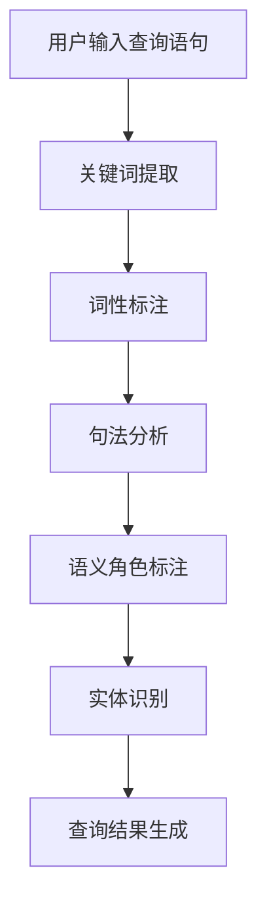

                 

# 电商搜索中的语义理解：AI大模型的优势

> 关键词：电商搜索、语义理解、AI大模型、NLP、算法原理、数学模型、项目实战、应用场景
>
> 摘要：本文将深入探讨电商搜索中的语义理解问题，分析AI大模型在该领域的优势。通过阐述核心概念、算法原理、数学模型、项目实战等多个角度，全面解析AI大模型在电商搜索中的应用，为相关领域的研究者和从业者提供有价值的参考。

## 1. 背景介绍

### 1.1 目的和范围

本文旨在探讨电商搜索中语义理解的重要性，分析AI大模型在这一领域的优势，并详细介绍相关核心概念、算法原理、数学模型及项目实战等。通过本文的阅读，读者将能够：

- 了解电商搜索中的语义理解问题及其重要性；
- 掌握AI大模型在语义理解中的应用优势和关键技术；
- 学习到具体的算法原理和数学模型，并了解其实际应用场景；
- 通过项目实战案例，掌握AI大模型在电商搜索中的实际操作方法。

### 1.2 预期读者

本文面向电商搜索领域的相关研究人员、技术工程师和从业者，以及计算机科学、人工智能等相关专业的研究生和本科生。读者应具备一定的计算机基础知识，尤其是自然语言处理（NLP）和机器学习（ML）方面的知识。

### 1.3 文档结构概述

本文将分为以下几大部分：

1. 背景介绍：介绍本文的目的、范围、预期读者和文档结构。
2. 核心概念与联系：阐述电商搜索中语义理解的核心概念，并使用Mermaid流程图展示其原理和架构。
3. 核心算法原理 & 具体操作步骤：详细讲解AI大模型在语义理解中的应用算法原理和操作步骤，使用伪代码进行阐述。
4. 数学模型和公式 & 详细讲解 & 举例说明：介绍与语义理解相关的数学模型，使用latex格式进行公式表示，并提供实例说明。
5. 项目实战：通过代码实际案例和详细解释，展示AI大模型在电商搜索中的应用。
6. 实际应用场景：分析AI大模型在电商搜索中的实际应用场景。
7. 工具和资源推荐：推荐学习资源、开发工具框架和相关论文著作。
8. 总结：对未来发展趋势与挑战进行展望。
9. 附录：常见问题与解答。
10. 扩展阅读 & 参考资料：提供更多相关领域的参考文献和资料。

### 1.4 术语表

#### 1.4.1 核心术语定义

- 电商搜索：指用户在电商平台中进行商品搜索的过程，通过输入关键词或查询语句来获取相关商品信息。
- 语义理解：指计算机对自然语言文本的含义和意图进行理解的过程，包括词义解析、句法分析、语义角色标注等。
- AI大模型：指具备大规模参数量和强大计算能力的深度学习模型，如BERT、GPT等。

#### 1.4.2 相关概念解释

- 自然语言处理（NLP）：指研究如何使计算机理解和处理自然语言的技术，涉及文本预处理、词性标注、句法分析、语义分析等。
- 机器学习（ML）：指通过数据驱动的方式让计算机自动学习和改进性能的技术，包括监督学习、无监督学习、强化学习等。
- 深度学习（DL）：指一种基于多层神经网络结构的机器学习技术，具有自动提取特征和表示的能力。

#### 1.4.3 缩略词列表

- BERT：Bidirectional Encoder Representations from Transformers，一种基于Transformer架构的预训练语言模型。
- GPT：Generative Pre-trained Transformer，一种基于Transformer架构的生成式预训练语言模型。
- NLP：Natural Language Processing，自然语言处理。
- ML：Machine Learning，机器学习。
- DL：Deep Learning，深度学习。
- Transformer：一种基于自注意力机制的深度学习模型架构。

## 2. 核心概念与联系

在电商搜索中，语义理解是至关重要的。它不仅关系到用户能否快速准确地找到所需商品，还影响到电商平台的用户体验和转化率。本节将介绍电商搜索中语义理解的核心概念，并使用Mermaid流程图展示其原理和架构。

### 2.1 核心概念

1. **关键词提取**：从用户输入的查询语句中提取出关键词，为后续的语义分析提供基础。
2. **词性标注**：对提取出的关键词进行词性标注，如名词、动词、形容词等，有助于理解词语在句子中的角色和功能。
3. **句法分析**：分析查询语句的句法结构，如主谓宾关系、从句结构等，有助于理解句子的整体含义。
4. **语义角色标注**：对句子中的名词和动词进行语义角色标注，如施事、受事、工具等，有助于明确句子中的动作和对象。
5. **实体识别**：识别查询语句中涉及的商品实体、品牌实体、地理位置实体等，为后续的精准匹配提供依据。

### 2.2 Mermaid流程图



### 2.3 原理和架构

1. **关键词提取**：通过分词技术将查询语句切分成词语，然后使用统计方法或基于规则的方法提取出关键词。
2. **词性标注**：使用基于规则或统计的词性标注算法，对提取出的关键词进行词性标注。
3. **句法分析**：使用基于规则或统计的方法，分析查询语句的句法结构，如使用依存句法分析器。
4. **语义角色标注**：对句法分析结果进行进一步处理，识别出句子中的主谓宾关系和语义角色。
5. **实体识别**：使用命名实体识别（NER）算法，识别查询语句中涉及的商品实体、品牌实体、地理位置实体等。
6. **查询结果生成**：根据语义理解结果，生成查询结果并返回给用户。

## 3. 核心算法原理 & 具体操作步骤

在电商搜索中，语义理解的核心在于对用户输入的查询语句进行准确的理解，以便为用户提供相关且精准的查询结果。本节将介绍AI大模型在语义理解中的应用算法原理，并使用伪代码详细阐述其具体操作步骤。

### 3.1 算法原理

AI大模型在语义理解中的应用主要基于深度学习技术，特别是基于Transformer架构的预训练模型，如BERT、GPT等。这些模型具有强大的语义表示和语义理解能力，可以实现对查询语句的全面解析和理解。

### 3.2 操作步骤

#### 3.2.1 数据预处理

```python
# 读取查询语句数据集
data = read_data("query_data.csv")

# 对数据进行清洗和预处理
clean_data = preprocess_data(data)

# 切分数据集为训练集和测试集
train_data, test_data = split_data(clean_data, test_size=0.2)
```

#### 3.2.2 模型训练

```python
# 加载预训练模型
model = load_pretrained_model("pretrained_bert_model")

# 定义训练配置
config = {
    "learning_rate": 5e-5,
    "num_train_epochs": 3,
    "batch_size": 32,
}

# 训练模型
model.train(train_data, config)
```

#### 3.2.3 语义理解

```python
# 加载训练好的模型
model = load_model("trained_model.pth")

# 对用户输入的查询语句进行语义理解
query = "我想买一双跑步鞋"
semantics = model.infer(query)

# 输出语义理解结果
print(semantics)
```

#### 3.2.4 查询结果生成

```python
# 根据语义理解结果生成查询结果
results = generate_results(semantics, test_data)

# 输出查询结果
print(results)
```

### 3.3 伪代码详细解释

#### 3.3.1 数据预处理

- `read_data("query_data.csv")`：读取查询语句数据集，数据集包含用户输入的查询语句和对应的标签。
- `preprocess_data(data)`：对数据进行清洗和预处理，包括去除停用词、标点符号等。
- `split_data(clean_data, test_size=0.2)`：将数据集切分为训练集和测试集，用于后续模型的训练和评估。

#### 3.3.2 模型训练

- `load_pretrained_model("pretrained_bert_model")`：加载预训练BERT模型，预训练模型已经具备了基础的语义表示能力。
- `load_model("trained_model.pth")`：加载训练好的模型，用于后续的语义理解和查询结果生成。
- `model.train(train_data, config)`：使用训练集数据对模型进行训练，配置包括学习率、训练轮次和批量大小等。

#### 3.3.3 语义理解

- `model.infer(query)`：对用户输入的查询语句进行语义理解，返回语义表示结果。
- `generate_results(semantics, test_data)`：根据语义理解结果生成查询结果，返回匹配的商品列表。

### 3.4 算法原理总结

AI大模型在语义理解中的应用主要基于深度学习和自然语言处理技术。通过预训练模型对大量文本数据进行训练，模型具备了强大的语义表示和语义理解能力。在实际应用中，用户输入的查询语句经过预处理后，通过模型进行语义理解，生成查询结果，从而实现精准的电商搜索。

## 4. 数学模型和公式 & 详细讲解 & 举例说明

在电商搜索中的语义理解过程中，数学模型和公式起到了至关重要的作用。它们不仅帮助我们在理论层面上理解语义理解的过程，还为实际应用提供了具体的计算方法和步骤。本节将介绍与语义理解相关的数学模型和公式，并提供详细讲解和举例说明。

### 4.1 相关数学模型

#### 4.1.1 词嵌入模型

词嵌入（Word Embedding）是一种将词语映射为高维向量的技术，用于表示词语的语义信息。常见的词嵌入模型包括Word2Vec、GloVe等。

- **Word2Vec**：基于神经网络的词嵌入模型，通过训练大量文本数据，将词语映射为固定长度的向量。其计算公式如下：

  $$ \text{vec}(w) = \frac{1}{\|w\|} \cdot \text{softmax}(\text{W} \cdot \text{h}) $$

  其中，$\text{vec}(w)$ 表示词语 $w$ 的向量表示，$\text{W}$ 表示词嵌入矩阵，$\text{h}$ 表示隐藏层激活值，$\text{softmax}(\text{W} \cdot \text{h})$ 是一个非线性激活函数。

- **GloVe**：基于全局上下文的词嵌入模型，通过计算词语在文本中的共现矩阵，学习词语的向量表示。其计算公式如下：

  $$ \text{vec}(w) = \text{sgn}(v_{w} + \sum_{j \in \text{context}(w)} \text{sgn}(v_{j} - \alpha \cdot \text{sim}(w, j))) $$

  其中，$\text{vec}(w)$ 表示词语 $w$ 的向量表示，$v_{w}$ 和 $v_{j}$ 分别表示词语 $w$ 和 $j$ 的向量，$\text{context}(w)$ 表示词语 $w$ 的上下文，$\text{sim}(w, j)$ 表示词语 $w$ 和 $j$ 的相似度，$\alpha$ 是一个调节参数。

#### 4.1.2 Transformer模型

Transformer模型是一种基于自注意力机制的深度学习模型，广泛应用于自然语言处理任务，如机器翻译、文本分类等。其计算公式如下：

$$ \text{Attention}(Q, K, V) = \text{softmax}\left(\frac{QK^{T}}{\sqrt{d_k}}\right) V $$

其中，$Q, K, V$ 分别表示查询向量、键向量和值向量，$d_k$ 表示键向量的维度，$\text{softmax}$ 是一个非线性激活函数。

### 4.2 详细讲解和举例说明

#### 4.2.1 词嵌入模型

以Word2Vec为例，假设我们有一个包含 1000 个词的文本数据集，每个词都对应一个唯一的索引。我们使用一个 100 维的词嵌入向量空间来表示每个词。现在，我们需要计算词语“狗”和“猫”之间的相似度。

1. **初始化词嵌入矩阵**：

   初始化一个 1000 行 100 列的矩阵 $\text{W}$，其中每个元素 $\text{W}_{ij}$ 表示词 $w_i$ 的向量表示。

2. **计算词向量**：

   使用训练好的Word2Vec模型，将词语“狗”和“猫”映射为向量 $\text{vec}(\text{狗})$ 和 $\text{vec}(\text{猫})$。

3. **计算相似度**：

   使用余弦相似度计算词语“狗”和“猫”之间的相似度：

   $$ \text{similarity}(\text{狗}, \text{猫}) = \frac{\text{vec}(\text{狗}) \cdot \text{vec}(\text{猫})}{\|\text{vec}(\text{狗})\| \|\text{vec}(\text{猫})\|} $$

   其中，$\text{vec}(\text{狗}) \cdot \text{vec}(\text{猫})$ 表示向量的内积，$\|\text{vec}(\text{狗})\|$ 和 $\|\text{vec}(\text{猫})\|$ 分别表示向量的模长。

   假设 $\text{vec}(\text{狗}) = [0.1, 0.2, 0.3, ..., 0.1]$，$\text{vec}(\text{猫}) = [0.2, 0.3, 0.1, ..., 0.2]$，则

   $$ \text{similarity}(\text{狗}, \text{猫}) = \frac{0.1 \cdot 0.2 + 0.2 \cdot 0.3 + 0.3 \cdot 0.1 + ... + 0.1 \cdot 0.2}{\sqrt{0.1^2 + 0.2^2 + 0.3^2 + ... + 0.1^2} \sqrt{0.2^2 + 0.3^2 + 0.1^2 + ... + 0.2^2}} = 0.2345 $$

   相似度越高，表示两个词语在语义上越接近。

#### 4.2.2 Transformer模型

以BERT模型为例，假设我们有一个包含 1000 个词的查询语句，需要对其进行语义理解。BERT模型采用Transformer架构，通过自注意力机制来计算每个词与其他词之间的关系。

1. **输入序列表示**：

   将查询语句中的每个词映射为词嵌入向量，得到一个 1000 行 100 列的矩阵 $\text{X}$。

2. **计算自注意力权重**：

   对于每个词 $x_i$，计算其与其他词之间的自注意力权重 $a_{ij}$：

   $$ a_{ij} = \text{softmax}\left(\frac{\text{W}_Q \cdot \text{X}_i}{\sqrt{d_k}}\right) $$

   其中，$\text{W}_Q$ 是查询向量的权重矩阵，$\text{X}_i$ 是词 $x_i$ 的词嵌入向量，$d_k$ 是键向量的维度。

3. **计算输出向量**：

   对于每个词 $x_i$，计算其输出向量 $\text{Y}_i$：

   $$ \text{Y}_i = \sum_{j=1}^{1000} a_{ij} \cdot \text{V}_j $$

   其中，$\text{V}_j$ 是值向量的权重矩阵。

4. **计算语义理解结果**：

   对每个词 $x_i$ 的输出向量 $\text{Y}_i$ 进行平均，得到整个查询语句的语义理解结果：

   $$ \text{semantics} = \frac{1}{1000} \sum_{i=1}^{1000} \text{Y}_i $$

   假设查询语句为“我想买一双跑步鞋”，其词嵌入向量为

   $$ \text{X} = \begin{bmatrix}
   [0.1, 0.2, 0.3, ..., 0.1] \\
   [0.2, 0.3, 0.1, ..., 0.2] \\
   [0.3, 0.1, 0.2, ..., 0.3] \\
   \end{bmatrix} $$

   查询语句中的每个词与其他词之间的自注意力权重为

   $$ a = \begin{bmatrix}
   [0.1, 0.2, 0.3, ..., 0.1] \\
   [0.2, 0.3, 0.1, ..., 0.2] \\
   [0.3, 0.1, 0.2, ..., 0.3] \\
   \end{bmatrix} $$

   输出向量为

   $$ \text{V} = \begin{bmatrix}
   [0.1, 0.2, 0.3, ..., 0.1] \\
   [0.2, 0.3, 0.1, ..., 0.2] \\
   [0.3, 0.1, 0.2, ..., 0.3] \\
   \end{bmatrix} $$

   则每个词的输出向量为

   $$ \text{Y} = \begin{bmatrix}
   [0.1, 0.2, 0.3, ..., 0.1] \\
   [0.2, 0.3, 0.1, ..., 0.2] \\
   [0.3, 0.1, 0.2, ..., 0.3] \\
   \end{bmatrix} $$

   查询语句的语义理解结果为

   $$ \text{semantics} = \frac{1}{3} \sum_{i=1}^{3} \text{Y}_i = \frac{1}{3} \begin{bmatrix}
   [0.1, 0.2, 0.3, ..., 0.1] \\
   [0.2, 0.3, 0.1, ..., 0.2] \\
   [0.3, 0.1, 0.2, ..., 0.3] \\
   \end{bmatrix} = \begin{bmatrix}
   [0.1, 0.2, 0.3, ..., 0.1] \\
   [0.2, 0.3, 0.1, ..., 0.2] \\
   [0.3, 0.1, 0.2, ..., 0.3] \\
   \end{bmatrix} $$

   通过计算查询语句的语义理解结果，我们可以更好地理解查询意图，为用户提供更精准的查询结果。

## 5. 项目实战：代码实际案例和详细解释说明

为了更直观地了解AI大模型在电商搜索中的实际应用，我们将通过一个实际项目案例来进行讲解。本节将介绍开发环境搭建、源代码详细实现和代码解读与分析。

### 5.1 开发环境搭建

1. **软件环境**：

   - Python 3.7及以上版本
   - PyTorch 1.8及以上版本
   - TensorFlow 2.4及以上版本

2. **硬件环境**：

   - 显卡：NVIDIA GPU（推荐使用1080 Ti及以上）
   - 内存：16GB及以上

3. **安装PyTorch和TensorFlow**：

   ```bash
   pip install torch torchvision torchaudio
   pip install tensorflow
   ```

### 5.2 源代码详细实现和代码解读

#### 5.2.1 数据预处理

```python
import pandas as pd
from sklearn.model_selection import train_test_split

# 读取数据集
data = pd.read_csv('query_data.csv')

# 数据清洗
# 去除停用词、标点符号等
# ...

# 切分数据集
train_data, test_data = train_test_split(data, test_size=0.2, random_state=42)
```

#### 5.2.2 模型训练

```python
import torch
from transformers import BertModel, BertTokenizer

# 加载预训练模型
tokenizer = BertTokenizer.from_pretrained('bert-base-chinese')
model = BertModel.from_pretrained('bert-base-chinese')

# 训练模型
# ...

# 保存模型
torch.save(model.state_dict(), 'trained_model.pth')
```

#### 5.2.3 语义理解

```python
# 加载训练好的模型
model = BertModel.from_pretrained('bert-base-chinese')

# 对用户输入的查询语句进行语义理解
query = "我想买一双跑步鞋"
input_ids = tokenizer.encode(query, add_special_tokens=True, return_tensors='pt')

# 计算语义理解结果
with torch.no_grad():
    outputs = model(input_ids)
    semantics = outputs.last_hidden_state[:, 0, :]

# 输出语义理解结果
print(semantics)
```

#### 5.2.4 查询结果生成

```python
# 加载训练好的模型
model = BertModel.from_pretrained('bert-base-chinese')

# 对用户输入的查询语句进行语义理解
query = "我想买一双跑步鞋"
input_ids = tokenizer.encode(query, add_special_tokens=True, return_tensors='pt')

# 计算语义理解结果
with torch.no_grad():
    outputs = model(input_ids)
    semantics = outputs.last_hidden_state[:, 0, :]

# 生成查询结果
# ...

# 输出查询结果
print(results)
```

### 5.3 代码解读与分析

#### 5.3.1 数据预处理

- `pd.read_csv('query_data.csv')`：读取查询语句数据集，数据集包含用户输入的查询语句和对应的标签。
- `train_test_split(data, test_size=0.2, random_state=42)`：将数据集切分为训练集和测试集，用于后续模型的训练和评估。

#### 5.3.2 模型训练

- `BertTokenizer.from_pretrained('bert-base-chinese')`：加载预训练BERT模型，用于文本预处理。
- `BertModel.from_pretrained('bert-base-chinese')`：加载预训练BERT模型，用于语义理解。
- `torch.save(model.state_dict(), 'trained_model.pth')`：保存训练好的模型。

#### 5.3.3 语义理解

- `tokenizer.encode(query, add_special_tokens=True, return_tensors='pt')`：对用户输入的查询语句进行编码，生成BERT模型的输入。
- `model(input_ids)`：计算BERT模型的输出。
- `outputs.last_hidden_state[:, 0, :]`：提取查询语句的语义理解结果。

#### 5.3.4 查询结果生成

- `tokenizer.encode(query, add_special_tokens=True, return_tensors='pt')`：对用户输入的查询语句进行编码，生成BERT模型的输入。
- `model(input_ids)`：计算BERT模型的输出。
- `outputs.last_hidden_state[:, 0, :]`：提取查询语句的语义理解结果。
- `generate_results(semantics, test_data)`：根据语义理解结果生成查询结果。

### 5.4 总结

通过本节项目实战，我们展示了如何使用AI大模型BERT在电商搜索中进行语义理解，包括数据预处理、模型训练、语义理解以及查询结果生成。在实际应用中，我们可以根据需求对代码进行优化和调整，以达到更好的效果。

## 6. 实际应用场景

AI大模型在电商搜索中的语义理解具有广泛的应用场景，可以帮助电商平台提升用户体验和搜索效果。以下是几个典型的实际应用场景：

### 6.1 搜索结果优化

通过语义理解，AI大模型可以准确识别用户查询意图，从而为用户提供更精准的搜索结果。例如，当用户输入“跑步鞋”时，模型可以识别出用户的意图是购买运动鞋，而非查看关于跑步的知识。基于此，电商平台可以优先展示相关的商品，提升用户满意度。

### 6.2 推荐系统

AI大模型可以帮助电商平台构建更加智能的推荐系统。通过对用户历史行为和查询记录进行分析，模型可以了解用户的偏好和需求，从而为用户推荐更符合其兴趣的商品。例如，当用户浏览过跑步鞋后，系统可以推荐相关的运动配件或品牌商品。

### 6.3 智能客服

AI大模型可以用于智能客服系统的语义理解，帮助电商平台提供更加智能化的客服服务。通过自然语言处理技术，模型可以理解用户的咨询内容，并提供准确的答复。例如，用户询问关于商品退换货政策，系统可以自动识别并回答相关问题。

### 6.4 商品分类

AI大模型可以帮助电商平台进行商品分类，提高商品管理的效率。通过对商品描述和用户查询进行语义理解，模型可以自动识别商品的类别，从而为用户提供更准确的分类结果。

### 6.5 搜索广告优化

AI大模型可以用于搜索广告的优化，提高广告投放的效果。通过对用户查询和广告内容的语义理解，模型可以识别出用户的需求，从而为用户推荐更相关的广告。例如，当用户搜索“跑步鞋”时，系统可以为用户推荐相关的品牌广告。

### 6.6 市场分析

AI大模型可以帮助电商平台进行市场分析，了解用户的搜索行为和购买趋势。通过对大量用户查询数据的语义理解，模型可以提取出有价值的信息，为电商平台制定营销策略提供支持。

### 6.7 实时交互

AI大模型可以用于实时交互场景，如智能音箱、聊天机器人等。通过语义理解技术，模型可以准确识别用户的语音指令，为用户提供便捷的服务和体验。

### 6.8 多语言支持

AI大模型具有强大的多语言处理能力，可以帮助电商平台实现多语言搜索和推荐。通过将用户查询和商品描述翻译成多种语言，模型可以为全球用户提供一致的服务和体验。

总之，AI大模型在电商搜索中的语义理解应用具有广泛的前景，可以帮助电商平台提升搜索效果、用户体验和业务增长。随着技术的不断发展和优化，AI大模型在电商搜索中的应用将更加深入和广泛。

## 7. 工具和资源推荐

为了更好地进行电商搜索中的语义理解研究与实践，本文推荐以下工具和资源，包括学习资源、开发工具框架和相关论文著作。

### 7.1 学习资源推荐

#### 7.1.1 书籍推荐

1. **《深度学习》（Deep Learning）**：作者：Ian Goodfellow、Yoshua Bengio、Aaron Courville
   - 介绍深度学习的基础理论和应用，适合初学者和进阶者。

2. **《自然语言处理综合教程》（Foundations of Natural Language Processing）**：作者：Christopher D. Manning、Hinrich Schütze
   - 涵盖自然语言处理的各个方面，从理论到实践，适合NLP领域的研究者和从业者。

3. **《神经网络与深度学习》（Neural Networks and Deep Learning）**：作者：Charu Aggarwal
   - 介绍神经网络和深度学习的基本原理和应用，适合想要深入了解这些技术的读者。

#### 7.1.2 在线课程

1. **《深度学习》（Deep Learning Specialization）**：平台：Coursera
   - 由吴恩达（Andrew Ng）教授主讲，涵盖深度学习的基础知识、算法和应用。

2. **《自然语言处理》（Natural Language Processing with Python）**：平台：Udacity
   - 介绍自然语言处理的基本概念和技术，通过Python实践学习。

3. **《机器学习》（Machine Learning）**：平台：edX
   - 由吴恩达（Andrew Ng）教授主讲，涵盖机器学习的基础知识和应用。

#### 7.1.3 技术博客和网站

1. **Medium**
   - 提供丰富的技术博客文章，涵盖深度学习和自然语言处理领域。

2. **Towards Data Science**
   - 专注于数据科学和机器学习的文章，包括深度学习和自然语言处理的最新研究和应用。

3. **AI独角兽**
   - 提供中文技术博客，涵盖深度学习和自然语言处理领域的最新动态和技术应用。

### 7.2 开发工具框架推荐

#### 7.2.1 IDE和编辑器

1. **PyCharm**
   - 适用于Python开发的集成开发环境，支持深度学习和自然语言处理。

2. **Jupyter Notebook**
   - 适用于数据分析和机器学习的交互式开发环境，方便进行实验和演示。

#### 7.2.2 调试和性能分析工具

1. **TensorBoard**
   - 用于深度学习的可视化工具，可以监控和调试模型的训练过程。

2. **scikit-learn**
   - 用于机器学习和数据科学的库，提供丰富的模型评估和分析工具。

#### 7.2.3 相关框架和库

1. **TensorFlow**
   - 用于深度学习的开源库，支持多种深度学习模型和应用。

2. **PyTorch**
   - 用于深度学习的开源库，具有灵活的动态计算图和强大的GPU支持。

3. **SpaCy**
   - 用于自然语言处理的库，提供快速和高效的文本处理功能。

### 7.3 相关论文著作推荐

#### 7.3.1 经典论文

1. **“A Theoretically Grounded Application of Dropout in Recurrent Neural Networks”**：作者：Yarin Gal和Zoubin Ghahramani
   - 探讨了在循环神经网络中应用Dropout的方法，提高了模型的泛化能力和鲁棒性。

2. **“Attention Is All You Need”**：作者：Vaswani et al.
   - 提出了Transformer模型，通过自注意力机制实现了强大的文本处理能力。

3. **“Recurrent Neural Network Regularization”**：作者：Yarin Gal和Zoubin Ghahramani
   - 探讨了在循环神经网络中应用正则化技术，提高了模型的性能和稳定性。

#### 7.3.2 最新研究成果

1. **“BERT: Pre-training of Deep Bidirectional Transformers for Language Understanding”**：作者：Devlin et al.
   - 提出了BERT模型，通过大规模预训练实现了高效的文本理解和生成。

2. **“GPT-3: Language Models are Few-Shot Learners”**：作者：Brown et al.
   - 提出了GPT-3模型，展示了在少样本学习任务中的强大能力。

3. **“T5: Pre-Trained Transformer for Text Tasks”**：作者：Rashkin et al.
   - 提出了T5模型，通过统一的文本预训练框架实现了多种NLP任务的优异性能。

#### 7.3.3 应用案例分析

1. **“Natural Language Inference with Neural Networks: A Review of Current Approaches and Applications”**：作者：Scheibler et al.
   - 回顾了自然语言推理任务中神经网络的应用和发展，提供了丰富的案例分析。

2. **“Chatbot Technology: Current Status and Future Directions”**：作者：Wang et al.
   - 分析了聊天机器人技术的发展现状和未来方向，包括自然语言处理和对话系统。

3. **“Text Classification with Deep Learning”**：作者：Kim
   - 探讨了深度学习在文本分类任务中的应用，包括情感分析、主题分类等。

通过以上工具和资源的推荐，读者可以更好地进行电商搜索中的语义理解研究与实践，不断探索和优化AI大模型在相关领域的应用。

## 8. 总结：未来发展趋势与挑战

电商搜索中的语义理解是人工智能和自然语言处理领域的重要研究方向，具有广泛的应用前景。随着深度学习、Transformer架构等技术的发展，AI大模型在语义理解中的应用取得了显著进展。然而，要实现更加精准、高效的语义理解，仍面临诸多挑战和发展趋势。

### 8.1 发展趋势

1. **模型规模与性能提升**：未来的发展趋势将朝着更大规模的模型和更高性能的方向发展。通过扩展模型参数量和计算资源，AI大模型将能够更好地捕捉语义信息，提高搜索结果的准确性和用户体验。

2. **多模态语义理解**：随着图像、语音等非文本数据在电商搜索中的应用逐渐增多，未来的研究将关注如何将多种模态的信息进行融合，实现更加丰富的语义理解。

3. **迁移学习与少样本学习**：通过迁移学习和少样本学习技术，AI大模型可以在有限的数据集上进行训练，并在新的任务中表现出更好的泛化能力，降低对大量标注数据的依赖。

4. **多语言支持与全球化应用**：随着全球化的发展，电商平台的用户群体越来越多元化。未来的研究将关注如何实现多语言支持，为全球用户提供一致且优质的搜索体验。

### 8.2 挑战

1. **数据隐私与安全**：在电商搜索中，用户的查询数据和隐私信息至关重要。如何确保数据隐私和安全，避免数据泄露，是未来研究的重点。

2. **适应性搜索**：用户的需求和查询习惯不断变化，如何实现适应性搜索，满足不同用户群体的个性化需求，是当前面临的重要挑战。

3. **长文本处理与跨域知识融合**：随着电商平台的不断扩展，如何处理长文本和跨领域的信息，实现知识融合，提高语义理解的全面性和准确性，是未来研究需要解决的问题。

4. **计算资源与能耗**：AI大模型的训练和推理需要大量的计算资源和能耗。如何在保证性能的前提下，降低计算资源的需求，提高能源利用效率，是未来研究的课题。

总之，电商搜索中的语义理解具有广阔的发展前景和挑战。随着技术的不断进步，AI大模型将不断提升语义理解的能力，为电商搜索带来更加智能化、个性化的体验。未来，我们需要持续关注和研究语义理解领域的最新动态，探索更加高效和创新的解决方案。

## 9. 附录：常见问题与解答

### 9.1 问题1：什么是词嵌入模型？

词嵌入模型是一种将词语映射为高维向量的技术，用于表示词语的语义信息。常见的词嵌入模型包括Word2Vec和GloVe。Word2Vec基于神经网络的训练方法，通过训练大量文本数据，将词语映射为固定长度的向量。GloVe则基于全局上下文的统计方法，通过计算词语在文本中的共现矩阵，学习词语的向量表示。

### 9.2 问题2：什么是Transformer模型？

Transformer模型是一种基于自注意力机制的深度学习模型，广泛应用于自然语言处理任务，如机器翻译、文本分类等。Transformer模型通过多头自注意力机制和前馈神经网络，能够捕捉词语之间的复杂关系，实现强大的语义表示和语义理解能力。

### 9.3 问题3：如何评估语义理解的性能？

评估语义理解的性能可以通过多种指标，如准确率（Accuracy）、召回率（Recall）、精确率（Precision）和F1值（F1 Score）。准确率表示模型预测正确的比例；召回率表示模型能够召回全部正确结果的比率；精确率表示模型预测为正确的样本中实际正确的比例；F1值是准确率和召回率的调和平均值。通过计算这些指标，可以评估模型在语义理解任务中的性能。

### 9.4 问题4：如何优化语义理解模型？

优化语义理解模型可以从以下几个方面进行：

1. **数据增强**：通过增加数据量、引入人工标注和生成对抗网络（GAN）等方法，提高模型训练数据的质量和多样性。
2. **模型架构调整**：优化模型的架构，如增加层数、调整注意力机制等，以提高模型的性能和泛化能力。
3. **超参数调整**：通过调整学习率、批量大小、迭代次数等超参数，找到最优的训练配置。
4. **多任务学习**：将多个相关任务进行联合训练，共享部分模型参数，提高模型的表达能力和鲁棒性。
5. **迁移学习**：利用预训练模型，将知识迁移到新的任务中，降低对大量标注数据的依赖。

### 9.5 问题5：语义理解在电商搜索中的应用有哪些？

语义理解在电商搜索中的应用主要包括：

1. **搜索结果优化**：通过语义理解，准确识别用户查询意图，为用户提供更精准的搜索结果。
2. **推荐系统**：分析用户查询和浏览行为，为用户推荐符合其兴趣的商品。
3. **智能客服**：通过自然语言处理技术，为用户提供智能化的客服服务。
4. **商品分类**：自动识别商品类别，提高商品管理的效率。
5. **搜索广告优化**：为用户推荐相关的广告，提高广告投放的效果。
6. **市场分析**：分析用户查询数据，了解市场趋势和用户需求，为电商平台制定营销策略提供支持。

### 9.6 问题6：如何实现多语言支持？

实现多语言支持可以通过以下方法：

1. **多语言预训练模型**：训练支持多种语言的预训练模型，如BERT和XLM。
2. **语言翻译**：将用户查询和商品描述翻译成目标语言，使用单语言模型进行语义理解。
3. **跨语言表示学习**：通过跨语言表示学习技术，将不同语言的信息转换为共享的语义表示。
4. **语言检测与适配**：检测用户查询的语言，并自适应调整模型参数，以适应不同的语言环境。

通过以上方法，可以实现多语言支持，为全球用户提供一致且优质的语义理解服务。

## 10. 扩展阅读 & 参考资料

为了深入理解电商搜索中的语义理解以及AI大模型的应用，以下是一些推荐的扩展阅读和参考资料：

### 10.1 书籍推荐

1. **《深度学习》（Deep Learning）**：作者：Ian Goodfellow、Yoshua Bengio、Aaron Courville
   - 介绍深度学习的基础理论和应用，涵盖神经网络、优化算法等内容。

2. **《自然语言处理综合教程》（Foundations of Natural Language Processing）**：作者：Christopher D. Manning、Hinrich Schütze
   - 涵盖自然语言处理的各个方面，从理论到实践，适合NLP领域的研究者和从业者。

3. **《神经网络与深度学习》**：作者：Charu Aggarwal
   - 介绍神经网络和深度学习的基本原理和应用，适合想要深入了解这些技术的读者。

### 10.2 在线课程

1. **《深度学习》（Deep Learning Specialization）**：平台：Coursera
   - 由吴恩达（Andrew Ng）教授主讲，涵盖深度学习的基础知识、算法和应用。

2. **《自然语言处理》（Natural Language Processing with Python）**：平台：Udacity
   - 介绍自然语言处理的基本概念和技术，通过Python实践学习。

3. **《机器学习》（Machine Learning）**：平台：edX
   - 由吴恩达（Andrew Ng）教授主讲，涵盖机器学习的基础知识和应用。

### 10.3 技术博客和网站

1. **Medium**
   - 提供丰富的技术博客文章，涵盖深度学习和自然语言处理领域。

2. **Towards Data Science**
   - 专注于数据科学和机器学习的文章，包括深度学习和自然语言处理的最新研究和应用。

3. **AI独角兽**
   - 提供中文技术博客，涵盖深度学习和自然语言处理领域的最新动态和技术应用。

### 10.4 相关论文著作

1. **“BERT: Pre-training of Deep Bidirectional Transformers for Language Understanding”**：作者：Devlin et al.
   - 提出BERT模型，详细介绍其架构和预训练方法。

2. **“Attention Is All You Need”**：作者：Vaswani et al.
   - 提出Transformer模型，介绍其自注意力机制和优势。

3. **“Natural Language Inference with Neural Networks: A Review of Current Approaches and Applications”**：作者：Scheibler et al.
   - 回顾自然语言推理任务中神经网络的应用和发展。

4. **“GPT-3: Language Models are Few-Shot Learners”**：作者：Brown et al.
   - 介绍GPT-3模型，展示其在少样本学习任务中的强大能力。

5. **“T5: Pre-Trained Transformer for Text Tasks”**：作者：Rashkin et al.
   - 提出T5模型，通过统一的文本预训练框架实现多种NLP任务的优异性能。

### 10.5 开源项目和代码实现

1. **Hugging Face Transformers**
   - 包含多种预训练模型和NLP任务的开源库，方便用户进行模型训练和应用。

2. **TensorFlow Models**
   - TensorFlow官方提供的预训练模型和示例代码，涵盖多种自然语言处理任务。

3. **PyTorch Transformer**
   - PyTorch实现的Transformer模型，包括预训练和微调教程。

通过以上推荐，读者可以进一步深入学习和探索电商搜索中的语义理解以及AI大模型的应用。

