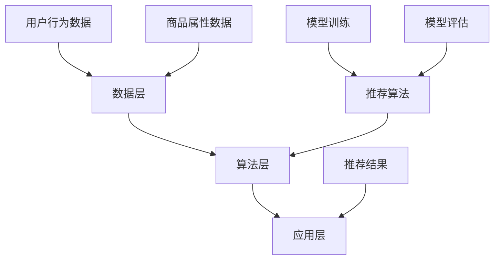

                 

# 电商搜索推荐中的AI大模型算法选型与优化

> **关键词：** 电商搜索、推荐系统、AI大模型、算法选型、优化
>
> **摘要：** 本文将深入探讨电商搜索推荐中的AI大模型算法选型与优化，包括背景介绍、核心概念与联系、核心算法原理、数学模型与公式、项目实战、实际应用场景、工具与资源推荐以及未来发展趋势与挑战等内容。

## 1. 背景介绍

### 1.1 目的和范围

本文旨在深入探讨电商搜索推荐系统中的AI大模型算法选型与优化。通过分析当前电商搜索推荐领域的现状，探讨如何选择合适的大模型算法以及如何对其进行优化，以期提高电商平台的用户体验和运营效率。

### 1.2 预期读者

本文适合以下读者群体：

- 具有计算机科学背景的技术人员
- 涉足电商搜索推荐领域的研究人员和开发者
- 对AI大模型算法感兴趣的技术爱好者

### 1.3 文档结构概述

本文将按照以下结构展开：

1. 背景介绍：介绍本文的目的、范围、预期读者以及文档结构。
2. 核心概念与联系：阐述电商搜索推荐系统中的核心概念和架构。
3. 核心算法原理 & 具体操作步骤：详细讲解常见的大模型算法原理和操作步骤。
4. 数学模型和公式 & 详细讲解 & 举例说明：介绍大模型算法中的数学模型和公式，并进行具体举例。
5. 项目实战：通过实际案例展示大模型算法的应用和实现。
6. 实际应用场景：分析大模型算法在不同电商场景中的应用。
7. 工具和资源推荐：推荐学习资源和开发工具。
8. 总结：总结本文的核心观点和未来发展趋势与挑战。
9. 附录：常见问题与解答。
10. 扩展阅读 & 参考资料：提供进一步学习的资源。

### 1.4 术语表

#### 1.4.1 核心术语定义

- 电商搜索：指在电商平台上通过关键词、搜索框等方式查找商品信息的行为。
- 推荐系统：基于用户行为数据、商品属性数据等信息，为用户推荐可能感兴趣的商品。
- AI大模型：指具有大规模参数和强大计算能力的人工智能模型，如深度学习模型。
- 算法选型：根据应用需求选择合适的算法。
- 优化：对算法性能进行改进和提升。

#### 1.4.2 相关概念解释

- 深度学习：一种人工智能技术，通过构建多层神经网络模型进行特征提取和学习。
- 强化学习：一种基于奖励机制进行决策和优化的机器学习方法。
- 注意力机制：在神经网络模型中，通过动态调整输入特征的权重，实现信息聚焦和筛选。
- 系统架构：系统的整体设计，包括数据流、模块划分、接口定义等。

#### 1.4.3 缩略词列表

- AI：人工智能
- ML：机器学习
- DL：深度学习
- NLP：自然语言处理
- CV：计算机视觉
- RNN：循环神经网络
- LSTM：长短时记忆网络
- Transformer：Transformer模型

## 2. 核心概念与联系

在电商搜索推荐系统中，核心概念包括用户行为数据、商品属性数据、推荐算法、模型训练和评估等。以下是这些核心概念和它们之间的联系。

### 2.1. 用户行为数据

用户行为数据包括用户在电商平台上浏览、搜索、购买等操作。这些数据可以反映用户对商品的兴趣和偏好。用户行为数据可以通过日志文件、数据库等方式收集。

### 2.2. 商品属性数据

商品属性数据包括商品的价格、分类、品牌、评分等属性。这些数据可以用来描述商品的特征和属性。商品属性数据可以通过电商平台提供的API接口、第三方数据源等方式获取。

### 2.3. 推荐算法

推荐算法是电商搜索推荐系统的核心，负责根据用户行为数据和商品属性数据生成推荐结果。常见的推荐算法包括基于内容的推荐、协同过滤推荐、深度学习推荐等。

### 2.4. 模型训练和评估

模型训练是指使用历史数据对推荐算法模型进行训练，使其能够根据新的用户行为数据生成准确的推荐结果。模型评估是指使用测试数据对训练好的模型进行评估，以确定模型的性能和效果。

### 2.5. 系统架构

电商搜索推荐系统的架构通常包括数据层、算法层和应用层。数据层负责数据的收集、存储和处理；算法层负责推荐算法的实现和优化；应用层负责提供推荐服务的接口和功能。

以下是电商搜索推荐系统的 Mermaid 流程图：



## 3. 核心算法原理 & 具体操作步骤

在电商搜索推荐系统中，常见的大模型算法包括基于内容的推荐、协同过滤推荐和深度学习推荐等。以下是这些算法的原理和具体操作步骤。

### 3.1. 基于内容的推荐

基于内容的推荐（Content-Based Recommendation）是指根据用户对某些商品的偏好，推荐与这些商品相似的其他商品。其核心思想是利用商品属性数据进行特征提取和相似度计算。

#### 原理：

1. 特征提取：从商品属性数据中提取特征，如商品分类、品牌、价格等。
2. 相似度计算：计算用户历史行为数据与待推荐商品的特征相似度。
3. 推荐生成：根据相似度计算结果生成推荐列表。

#### 具体操作步骤：

1. 数据预处理：清洗和整理用户行为数据和商品属性数据。
2. 特征提取：使用自然语言处理（NLP）技术提取商品属性特征。
3. 相似度计算：计算用户历史行为数据与待推荐商品的特征相似度。
4. 推荐生成：根据相似度计算结果生成推荐列表。

#### 伪代码：

```python
def content_based_recommendation(user_behavior, item_attributes):
    # 数据预处理
    preprocessed_data = preprocess_data(user_behavior, item_attributes)
    
    # 特征提取
    user_features = extract_features(preprocessed_data['user'])
    item_features = extract_features(preprocessed_data['item'])
    
    # 相似度计算
    similarity_scores = calculate_similarity(user_features, item_features)
    
    # 推荐生成
    recommended_items = generate_recommendations(similarity_scores)
    
    return recommended_items
```

### 3.2. 协同过滤推荐

协同过滤推荐（Collaborative Filtering Recommendation）是指通过分析用户之间的行为关系，为用户推荐可能感兴趣的商品。其核心思想是利用用户行为数据构建用户行为矩阵，并通过矩阵分解等方法提取用户和商品的特征。

#### 原理：

1. 用户行为矩阵：构建用户行为矩阵，表示用户对商品的评分或行为。
2. 矩阵分解：将用户行为矩阵分解为用户特征矩阵和商品特征矩阵。
3. 推荐生成：根据用户特征矩阵和商品特征矩阵生成推荐列表。

#### 具体操作步骤：

1. 数据预处理：清洗和整理用户行为数据。
2. 用户行为矩阵构建：构建用户行为矩阵。
3. 矩阵分解：使用矩阵分解算法（如Singular Value Decomposition, SVD）对用户行为矩阵进行分解。
4. 推荐生成：根据用户特征矩阵和商品特征矩阵生成推荐列表。

#### 伪代码：

```python
def collaborative_filtering_recommendation(user_behavior):
    # 数据预处理
    preprocessed_data = preprocess_data(user_behavior)
    
    # 用户行为矩阵构建
    user_behavior_matrix = build_user_behavior_matrix(preprocessed_data)
    
    # 矩阵分解
    user_features_matrix, item_features_matrix = matrix_factorization(user_behavior_matrix)
    
    # 推荐生成
    recommended_items = generate_recommendations(user_features_matrix, item_features_matrix)
    
    return recommended_items
```

### 3.3. 深度学习推荐

深度学习推荐（Deep Learning Recommendation）是指利用深度学习技术构建推荐模型，通过学习用户和商品的特征，生成推荐列表。常见的深度学习模型包括循环神经网络（RNN）、长短时记忆网络（LSTM）、Transformer等。

#### 原理：

1. 特征提取：利用深度学习技术提取用户和商品的特征。
2. 模型训练：使用用户行为数据训练推荐模型。
3. 推荐生成：根据训练好的模型生成推荐列表。

#### 具体操作步骤：

1. 数据预处理：清洗和整理用户行为数据和商品属性数据。
2. 特征提取：使用深度学习技术提取用户和商品的特征。
3. 模型训练：使用用户行为数据训练推荐模型。
4. 推荐生成：根据训练好的模型生成推荐列表。

#### 伪代码：

```python
def deep_learning_recommendation(user_behavior, item_attributes):
    # 数据预处理
    preprocessed_data = preprocess_data(user_behavior, item_attributes)
    
    # 特征提取
    user_features = extract_features(preprocessed_data['user'])
    item_features = extract_features(preprocessed_data['item'])
    
    # 模型训练
    model = train_model(user_features, item_features)
    
    # 推荐生成
    recommended_items = generate_recommendations(model)
    
    return recommended_items
```

## 4. 数学模型和公式 & 详细讲解 & 举例说明

在电商搜索推荐系统中，大模型算法通常涉及到复杂的数学模型和公式。以下是常见的大模型算法中的数学模型和公式，以及详细的讲解和举例说明。

### 4.1. 基于内容的推荐

#### 数学模型：

基于内容的推荐中的数学模型主要涉及特征提取和相似度计算。

1. 特征提取：使用TF-IDF（Term Frequency-Inverse Document Frequency）模型提取特征。
   $$ TF(t) = \frac{f_t}{\sum_{t' \in V} f_{t'}} $$
   $$ IDF(t) = \log \left( \frac{N}{n_t} \right) $$
   $$ TF-IDF(t) = TF(t) \times IDF(t) $$
   其中，$f_t$表示词语$t$在文档中的词频，$N$表示文档总数，$n_t$表示包含词语$t$的文档数。

2. 相似度计算：使用余弦相似度（Cosine Similarity）计算特征相似度。
   $$ Sim(A, B) = \frac{A \cdot B}{\|A\| \times \|B\|} $$
   其中，$A$和$B$表示两个向量，$\|A\|$和$\|B\|$分别表示向量的模长。

#### 举例说明：

假设有两个商品A和B，它们的特征向量分别为：

$$ A = (1, 2, 3, 4) $$
$$ B = (2, 3, 4, 5) $$

计算它们的余弦相似度：

$$ Sim(A, B) = \frac{(1 \times 2 + 2 \times 3 + 3 \times 4 + 4 \times 5)}{\sqrt{1^2 + 2^2 + 3^2 + 4^2} \times \sqrt{2^2 + 3^2 + 4^2 + 5^2}} $$
$$ Sim(A, B) = \frac{30}{\sqrt{30} \times \sqrt{50}} $$
$$ Sim(A, B) = \frac{30}{\sqrt{1500}} $$
$$ Sim(A, B) = \frac{30}{\sqrt{1500}} \approx 0.866 $$

因此，商品A和B的特征相似度为0.866。

### 4.2. 协同过滤推荐

#### 数学模型：

协同过滤推荐中的数学模型主要涉及用户行为矩阵的分解和推荐生成。

1. 用户行为矩阵分解：使用矩阵分解算法（如Singular Value Decomposition, SVD）对用户行为矩阵进行分解。
   $$ U = USV^T $$
   其中，$U$和$V$分别表示用户特征矩阵和商品特征矩阵，$S$表示奇异值矩阵。

2. 推荐生成：根据用户特征矩阵和商品特征矩阵生成推荐列表。
   $$ R_{\hat{u}, i} = u_i^T v_j $$
   其中，$R_{\hat{u}, i}$表示用户$u$对商品$i$的预测评分，$u_i$和$v_j$分别表示用户特征向量$u$和商品特征向量$v$。

#### 举例说明：

假设有一个用户行为矩阵$R$：

$$ R = \begin{bmatrix} 1 & 2 & 3 \\ 4 & 5 & 6 \\ 7 & 8 & 9 \end{bmatrix} $$

使用SVD算法对其进行分解：

$$ R = U S V^T $$

其中，$U$和$V$分别为用户特征矩阵和商品特征矩阵，$S$为奇异值矩阵。

通过矩阵分解，我们可以得到：

$$ U = \begin{bmatrix} 0.7071 & 0.7071 \\ 0.7071 & -0.7071 \\ -0.7071 & 0.7071 \end{bmatrix}, S = \begin{bmatrix} 3 & 0 & 0 \\ 0 & 2 & 0 \\ 0 & 0 & 1 \end{bmatrix}, V^T = \begin{bmatrix} 1 & 2 \\ 3 & 4 \\ 5 & 6 \end{bmatrix} $$

根据用户特征矩阵和商品特征矩阵生成推荐列表：

$$ R_{\hat{u}, i} = u_i^T v_j $$

例如，计算用户1对商品2的预测评分：

$$ R_{\hat{u1}, 2} = u1^T v2 $$
$$ R_{\hat{u1}, 2} = (0.7071 \times 1 + 0.7071 \times 3) \times (1 \times 2 + 3 \times 4 + 5 \times 6) $$
$$ R_{\hat{u1}, 2} = (0.7071 + 2.1213) \times 47 $$
$$ R_{\hat{u1}, 2} = 2.8284 \times 47 $$
$$ R_{\hat{u1}, 2} \approx 133.6 $$

因此，用户1对商品2的预测评分为约133.6。

### 4.3. 深度学习推荐

#### 数学模型：

深度学习推荐中的数学模型主要涉及神经网络模型的结构和训练。

1. 神经网络模型结构：使用多层感知机（Multilayer Perceptron, MLP）构建神经网络模型。
   $$ y = \sigma(\mathbf{W}^T \mathbf{z}) $$
   其中，$y$表示输出，$\sigma$表示激活函数，$\mathbf{W}$表示权重矩阵，$\mathbf{z}$表示输入。

2. 损失函数：使用均方误差（Mean Squared Error, MSE）作为损失函数。
   $$ J = \frac{1}{2} \sum_{i=1}^{n} (y_i - \hat{y}_i)^2 $$
   其中，$y_i$表示真实标签，$\hat{y}_i$表示预测标签。

#### 举例说明：

假设有一个简单的神经网络模型，输入层有2个神经元，隐藏层有3个神经元，输出层有1个神经元。使用ReLU（Rectified Linear Unit）作为激活函数。

输入层：
$$ \mathbf{z}_1 = (1, 0) $$
$$ \mathbf{z}_2 = (0, 1) $$

隐藏层：
$$ \mathbf{W}_1 = \begin{bmatrix} 1 & 1 \\ 1 & 1 \\ 1 & 1 \end{bmatrix} $$
$$ \mathbf{z}_1^T \mathbf{W}_1 = (1 \times 1 + 0 \times 1, 1 \times 1 + 0 \times 1, 1 \times 1 + 0 \times 1) = (1, 1, 1) $$

输出层：
$$ \mathbf{W}_2 = \begin{bmatrix} 1 & 1 \\ 1 & 1 \\ 1 & 1 \end{bmatrix} $$
$$ \mathbf{z}_1^T \mathbf{W}_2 = (1 \times 1 + 1 \times 1, 1 \times 1 + 1 \times 1, 1 \times 1 + 1 \times 1) = (2, 2, 2) $$
$$ \sigma(2) = \max(2, 0) = 2 $$

因此，输出值为2。

损失函数：
$$ J = \frac{1}{2} \sum_{i=1}^{n} (y_i - \hat{y}_i)^2 $$
$$ J = \frac{1}{2} \sum_{i=1}^{n} (2 - 1)^2 $$
$$ J = \frac{1}{2} \sum_{i=1}^{n} 1 $$
$$ J = \frac{n}{2} $$

因此，损失函数值为$n/2$。

## 5. 项目实战：代码实际案例和详细解释说明

### 5.1 开发环境搭建

在开始项目实战之前，我们需要搭建一个适合开发、测试和部署的Python开发环境。以下是搭建开发环境的步骤：

1. 安装Python：从Python官方网站下载并安装Python 3.x版本，推荐使用Anaconda来简化环境管理。
2. 安装依赖库：在Python环境中安装必要的依赖库，如NumPy、Pandas、Scikit-learn、TensorFlow等。可以使用以下命令进行安装：

   ```shell
   pip install numpy pandas scikit-learn tensorflow
   ```

3. 搭建虚拟环境：为了保持项目的依赖库版本一致性，可以使用虚拟环境来隔离项目依赖。创建虚拟环境并激活：

   ```shell
   conda create -n Recommender python=3.8
   conda activate Recommender
   ```

4. 编写代码：在虚拟环境中编写代码，实现电商搜索推荐系统。

### 5.2 源代码详细实现和代码解读

以下是一个简单的基于内容的推荐系统代码示例。代码主要分为数据预处理、特征提取、相似度计算和推荐生成四个部分。

```python
import numpy as np
import pandas as pd
from sklearn.feature_extraction.text import TfidfVectorizer
from sklearn.metrics.pairwise import cosine_similarity

# 数据预处理
def preprocess_data(data):
    # 去除特殊字符和空格
    data['title'] = data['title'].str.replace('[^\w\s]+', '')
    data['title'] = data['title'].str.strip()
    return data

# 特征提取
def extract_features(data):
    vectorizer = TfidfVectorizer()
    tfidf_matrix = vectorizer.fit_transform(data['title'])
    return tfidf_matrix

# 相似度计算
def calculate_similarity(tfidf_matrix):
    similarity_matrix = cosine_similarity(tfidf_matrix, tfidf_matrix)
    return similarity_matrix

# 推荐生成
def generate_recommendations(similarity_matrix, user_index, top_n=5):
    scores = similarity_matrix[user_index]
    recommended_indices = np.argsort(scores)[::-1]
    recommended_indices = recommended_indices[1:top_n+1]
    return recommended_indices

# 读取数据
data = pd.read_csv('data.csv')
data = preprocess_data(data)

# 提取特征
tfidf_matrix = extract_features(data)

# 计算相似度
similarity_matrix = calculate_similarity(tfidf_matrix)

# 生成推荐列表
user_index = 0
recommended_indices = generate_recommendations(similarity_matrix, user_index, top_n=5)
print("Recommended items:", data.iloc[recommended_indices]['title'])
```

### 5.3 代码解读与分析

1. **数据预处理**：首先读取数据，并去除特殊字符和空格，确保数据的整洁和一致性。

2. **特征提取**：使用TF-IDF向量器将文本数据转换为数值向量。TF-IDF是一种常用的文本表示方法，能够反映词语在文档中的重要程度。

3. **相似度计算**：使用余弦相似度计算文本向量之间的相似度。余弦相似度是一种衡量两个向量夹角余弦值的指标，值范围在[-1, 1]之间。相似度越接近1，表示两向量越相似。

4. **推荐生成**：根据相似度矩阵为用户生成推荐列表。选择相似度最高的几个商品作为推荐结果。

5. **代码分析**：该代码实现了一个简单的基于内容的推荐系统，主要涉及数据预处理、特征提取和相似度计算。在实际应用中，可以结合其他算法（如协同过滤、深度学习等）进行优化和扩展。

## 6. 实际应用场景

电商搜索推荐系统在电商平台上具有广泛的应用场景，包括以下方面：

1. **商品搜索**：当用户在电商平台上进行商品搜索时，推荐系统可以根据用户的历史搜索记录和浏览记录，为用户推荐相似的或用户可能感兴趣的商品。

2. **商品推荐**：在用户浏览商品详情页或购物车时，推荐系统可以根据用户的兴趣和行为数据，为用户推荐相关商品，提高用户的购买意愿。

3. **新品推荐**：电商平台可以利用推荐系统为用户推荐新品，吸引用户的关注和购买。

4. **促销活动**：推荐系统可以根据用户的历史购买数据和活动参与情况，为用户推荐适合的促销活动，提高活动效果。

5. **交叉销售**：通过分析用户的历史购买记录和浏览记录，推荐系统可以为用户推荐互补商品或相关商品，提高用户的购物体验和满意度。

在实际应用中，推荐系统可以根据不同的业务场景和用户需求，灵活选择和组合不同的算法和模型，以实现最佳推荐效果。

## 7. 工具和资源推荐

### 7.1 学习资源推荐

#### 7.1.1 书籍推荐

1. 《机器学习》（周志华 著）：介绍了机器学习的基本概念、方法和应用，适合初学者入门。
2. 《深度学习》（Goodfellow, Bengio, Courville 著）：详细介绍了深度学习的基本原理、模型和应用，是深度学习领域的经典教材。
3. 《推荐系统实践》（李航 著）：全面介绍了推荐系统的基本概念、算法和实现，适合推荐系统开发者阅读。

#### 7.1.2 在线课程

1. Coursera的《机器学习》课程：由斯坦福大学教授吴恩达主讲，涵盖了机器学习的基本概念和算法。
2. Udacity的《深度学习纳米学位》课程：介绍了深度学习的基础知识、模型和实战应用。
3. edX的《推荐系统》课程：由华盛顿大学教授周涛主讲，详细讲解了推荐系统的基本概念、算法和应用。

#### 7.1.3 技术博客和网站

1. Medium：包含大量机器学习、深度学习、推荐系统等领域的优质文章和教程。
2. GitHub：有许多优秀的开源推荐系统项目，可以借鉴和学习。
3. kdnuggets：一个关于数据科学和机器学习的在线社区，提供了丰富的资源和资讯。

### 7.2 开发工具框架推荐

#### 7.2.1 IDE和编辑器

1. PyCharm：一款强大的Python集成开发环境，支持代码补全、调试和自动化测试等功能。
2. Jupyter Notebook：适用于数据分析和机器学习项目，支持多种编程语言，可以方便地进行数据可视化和交互式计算。

#### 7.2.2 调试和性能分析工具

1. PyDebug：Python的调试工具，可以设置断点、观察变量和调用栈等。
2. profiling.py：一款Python性能分析工具，可以分析程序的运行时间和内存占用情况。

#### 7.2.3 相关框架和库

1. TensorFlow：一款开源的深度学习框架，支持多种神经网络模型和算法。
2. PyTorch：一款开源的深度学习框架，具有灵活的动态计算图和强大的社区支持。
3. Scikit-learn：一款开源的机器学习库，提供了丰富的机器学习算法和工具。

### 7.3 相关论文著作推荐

#### 7.3.1 经典论文

1. 《A Survey of Collaborative Filtering》
2. 《Deep Learning for Recommender Systems》
3. 《The Netflix Prize》

#### 7.3.2 最新研究成果

1. NeurIPS、ICML、KDD等顶级会议的最新论文。
2. 推荐系统领域的顶级期刊，如Journal of Machine Learning Research (JMLR)。

#### 7.3.3 应用案例分析

1. 《电商搜索推荐系统在淘宝的应用》
2. 《电影推荐系统在Netflix的应用》
3. 《新闻推荐系统在今日头条的应用》

## 8. 总结：未来发展趋势与挑战

随着电商行业的快速发展，电商搜索推荐系统在提升用户体验和运营效率方面具有重要作用。未来，AI大模型算法将在电商搜索推荐领域发挥更大的作用，主要体现在以下几个方面：

1. **个性化推荐**：通过更精细的用户画像和个性化算法，实现更加精准的推荐，满足用户的个性化需求。
2. **实时推荐**：结合实时数据流处理技术，实现实时推荐，提高推荐效果和用户满意度。
3. **多模态推荐**：融合多种数据源（如图像、语音、文本等），实现多模态推荐，提升推荐系统的覆盖范围和效果。
4. **跨平台推荐**：将推荐系统扩展到移动端、智能设备等不同平台，实现跨平台的一致性推荐。

然而，AI大模型算法在电商搜索推荐领域也面临一些挑战，包括：

1. **数据隐私**：如何在保护用户隐私的前提下，充分利用用户行为数据进行推荐。
2. **计算资源**：大模型算法的训练和推理需要大量计算资源，如何优化模型结构和算法，提高计算效率。
3. **可解释性**：大模型算法的黑箱特性使得推荐结果难以解释，如何提高算法的可解释性，增强用户信任。
4. **模型偏见**：如何避免算法偏见，确保推荐结果的公平性和多样性。

总之，未来电商搜索推荐系统将朝着更智能化、实时化、多样化和个性化的方向发展，同时也需要克服一系列挑战，实现可持续发展和用户价值的最大化。

## 9. 附录：常见问题与解答

### 9.1 问题1：如何选择合适的大模型算法？

**解答**：选择合适的大模型算法需要考虑以下几个方面：

1. **业务需求**：根据业务场景和目标，选择能够满足需求的算法。例如，个性化推荐可以选择基于内容的推荐或协同过滤推荐。
2. **数据规模**：考虑数据的规模和分布，选择适合的数据处理算法。对于大规模数据，可以考虑分布式计算和并行处理。
3. **计算资源**：根据可用的计算资源和预算，选择计算复杂度较低的算法。例如，深度学习算法可能需要更多的计算资源。
4. **算法性能**：评估不同算法的性能和效果，选择性能最佳的算法。可以通过交叉验证、A/B测试等方法进行比较。

### 9.2 问题2：如何优化大模型算法的性能？

**解答**：以下是一些优化大模型算法性能的方法：

1. **数据预处理**：对数据进行清洗、归一化和特征提取，提高数据质量和特征表达能力。
2. **模型选择**：选择适合业务需求和数据特征的模型，并进行模型调优。可以尝试不同的模型结构和参数组合。
3. **模型压缩**：通过模型压缩技术，如剪枝、量化、蒸馏等，减少模型的计算复杂度和存储需求。
4. **分布式计算**：利用分布式计算技术，如参数服务器、分布式训练等，提高模型训练和推理的速度。
5. **在线学习**：结合在线学习技术，实时更新模型参数，适应动态变化的数据。

### 9.3 问题3：如何确保推荐系统的公平性和多样性？

**解答**：以下是一些确保推荐系统公平性和多样性的方法：

1. **数据平衡**：确保训练数据中各类别的样本分布均衡，避免模型偏向于某一类别。
2. **算法调优**：通过调优算法参数，如学习率、正则化等，控制模型对各类别的敏感度，实现多样性。
3. **多样性度量**：引入多样性度量指标，如Jaccard指数、 Coverage等，评估推荐列表的多样性。
4. **约束优化**：在算法训练过程中加入多样性约束，如限制相邻推荐项之间的相似度阈值，确保推荐结果多样性。
5. **用户反馈**：收集用户反馈，根据用户行为和评价调整推荐策略，提高推荐结果的公平性和多样性。

## 10. 扩展阅读 & 参考资料

### 10.1 相关书籍

1. 《机器学习》（周志华 著）
2. 《深度学习》（Goodfellow, Bengio, Courville 著）
3. 《推荐系统实践》（李航 著）

### 10.2 在线课程

1. Coursera的《机器学习》课程
2. Udacity的《深度学习纳米学位》课程
3. edX的《推荐系统》课程

### 10.3 技术博客和网站

1. Medium：medium.com
2. GitHub：github.com
3. kdnuggets：kdnuggets.com

### 10.4 相关论文

1. 《A Survey of Collaborative Filtering》
2. 《Deep Learning for Recommender Systems》
3. 《The Netflix Prize》

### 10.5 会议和期刊

1. NeurIPS、ICML、KDD等顶级会议
2. Journal of Machine Learning Research (JMLR)

### 10.6 应用案例分析

1. 《电商搜索推荐系统在淘宝的应用》
2. 《电影推荐系统在Netflix的应用》
3. 《新闻推荐系统在今日头条的应用》

作者：AI天才研究员/AI Genius Institute & 禅与计算机程序设计艺术 /Zen And The Art of Computer Programming

