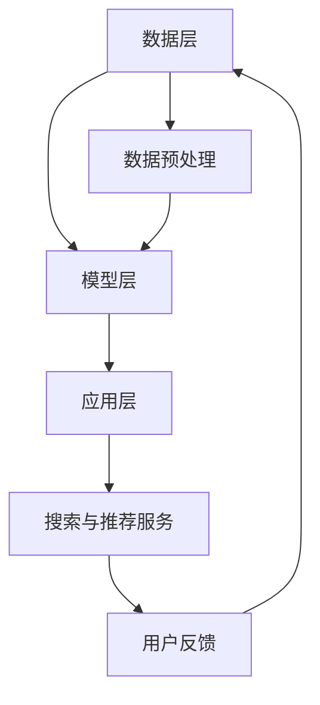
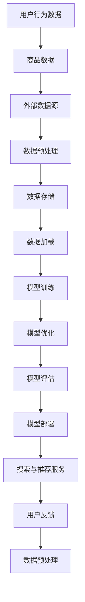

                 

# 电商搜索推荐场景下的AI大模型模型部署全流程自动化工具应用实践

## 关键词
- 电商搜索推荐
- AI大模型
- 模型部署
- 自动化工具
- 实践

## 摘要
本文旨在探讨电商搜索推荐场景下，基于人工智能的大模型模型部署全流程自动化工具的应用实践。随着电子商务的迅猛发展，搜索推荐系统已成为提升用户体验和商家收益的重要手段。本文将介绍自动化工具在模型开发、训练、优化和部署中的关键作用，并通过实际案例展示其在电商领域的具体应用。通过本文的阅读，读者将了解如何通过自动化工具实现高效、可靠的AI大模型部署流程，为电商企业提供创新的解决方案。

## 1. 背景介绍

### 1.1 目的和范围

本文的目标是详细阐述电商搜索推荐场景下，AI大模型的部署全流程自动化工具如何应用于实际场景中。随着电子商务行业的快速发展，用户对个性化推荐和快速搜索的需求不断增加，传统的手动部署方法已难以满足高效率和高质量的要求。自动化工具的出现，使得模型部署过程更加高效、可靠和可扩展。

本文的范围包括以下几个方面：

1. **AI大模型的基本概念**：介绍AI大模型的定义、常见类型及其在电商搜索推荐中的作用。
2. **模型部署全流程**：详细描述从模型开发、训练、优化到部署的整个过程，并分析自动化工具在每个阶段的应用。
3. **自动化工具的选择与实现**：探讨适用于电商搜索推荐场景的自动化工具，包括相关技术栈和工具链的介绍。
4. **实际案例**：通过具体案例展示自动化工具在电商搜索推荐中的应用效果。
5. **工具和资源推荐**：为读者提供学习资源、开发工具和最新研究成果的推荐。

### 1.2 预期读者

本文适合以下读者群体：

1. **AI研究人员和工程师**：对AI大模型及其应用有兴趣，希望了解自动化部署流程的实践应用。
2. **电商技术开发人员**：负责开发和维护电商搜索推荐系统，希望提升模型部署效率和可靠性的技术人员。
3. **软件开发爱好者**：对软件开发过程和自动化工具感兴趣，希望通过实践案例了解自动化部署的应用场景。

### 1.3 文档结构概述

本文的结构如下：

1. **第1章 背景介绍**：介绍本文的目的、范围和预期读者，以及文档结构概述。
2. **第2章 核心概念与联系**：阐述电商搜索推荐中AI大模型的核心概念和架构。
3. **第3章 核心算法原理与具体操作步骤**：介绍AI大模型的算法原理和部署步骤。
4. **第4章 数学模型与公式**：详细讲解AI大模型中的数学模型和公式。
5. **第5章 项目实战**：通过实际案例展示自动化工具的应用。
6. **第6章 实际应用场景**：分析自动化工具在不同电商搜索推荐场景中的应用。
7. **第7章 工具和资源推荐**：推荐相关学习资源和开发工具。
8. **第8章 总结**：总结未来发展趋势与挑战。
9. **第9章 附录**：常见问题与解答。
10. **第10章 扩展阅读与参考资料**：提供进一步学习的参考资料。

### 1.4 术语表

#### 1.4.1 核心术语定义

- **AI大模型**：指具有海量参数、能够处理复杂数据的大规模神经网络模型。
- **电商搜索推荐**：利用人工智能技术，根据用户的历史行为和偏好，为用户推荐商品。
- **模型部署**：将训练好的AI模型应用到生产环境中，实现实时搜索和推荐。
- **自动化工具**：用于简化、加速和优化模型开发、训练、优化和部署过程的工具。

#### 1.4.2 相关概念解释

- **数据预处理**：在模型训练前对数据进行清洗、转换和归一化等操作。
- **模型训练**：使用大量数据进行训练，调整模型参数，使其能够有效预测或分类。
- **模型评估**：通过测试集验证模型的性能，包括准确性、召回率、F1值等指标。

#### 1.4.3 缩略词列表

- **API**：应用程序编程接口（Application Programming Interface）
- **SDK**：软件开发工具包（Software Development Kit）
- **GPU**：图形处理单元（Graphics Processing Unit）
- **CPU**：中央处理单元（Central Processing Unit）
- **Docker**：开源的应用容器引擎，用于自动化部署应用程序。

## 2. 核心概念与联系

在电商搜索推荐场景中，AI大模型是核心组件。以下是对其核心概念与联系的详细阐述，并附上相应的Mermaid流程图。

### 2.1 AI大模型的概念

AI大模型是指具有数百万甚至数十亿参数的深度神经网络模型。这些模型通常用于处理大规模复杂数据，如文本、图像和音频等。在电商搜索推荐场景中，AI大模型可以用于用户行为分析、商品推荐和搜索优化。

### 2.2 电商搜索推荐架构

电商搜索推荐系统通常包括数据层、模型层和应用层。数据层负责数据的收集、存储和处理；模型层负责构建和训练AI大模型；应用层负责将模型部署到生产环境，为用户提供实时搜索和推荐服务。以下是一个简单的Mermaid流程图：



### 2.3 数据层

数据层是电商搜索推荐系统的基石。它负责收集用户行为数据、商品信息和外部数据源。这些数据经过预处理后，将用于训练AI大模型。

### 2.4 模型层

模型层是AI大模型的核心。它包括数据预处理、模型训练、模型优化和模型评估等步骤。自动化工具在此层的作用是简化模型开发过程，提高训练效率和模型性能。

### 2.5 应用层

应用层是电商搜索推荐系统的对外接口。它将训练好的AI大模型部署到生产环境中，为用户提供实时搜索和推荐服务。自动化工具在此层的作用是简化部署过程，确保系统的高可用性和可靠性。

### 2.6 用户反馈

用户反馈是电商搜索推荐系统不断优化和改进的关键。用户在使用搜索和推荐服务时产生的行为数据，将反馈给数据层和应用层，用于模型迭代和系统优化。

### 2.7 Mermaid流程图

以下是一个详细的Mermaid流程图，展示电商搜索推荐场景下的AI大模型架构和流程：



## 3. 核心算法原理与具体操作步骤

在电商搜索推荐场景中，AI大模型的部署涉及到多个关键步骤，包括数据预处理、模型训练、模型优化和模型部署。以下是每个步骤的详细解释和伪代码。

### 3.1 数据预处理

数据预处理是模型训练的第一步，其目的是将原始数据转换为适合模型训练的形式。数据预处理包括数据清洗、数据转换和数据归一化。

**伪代码：**

```python
def preprocess_data(data):
    # 数据清洗
    cleaned_data = clean_data(data)
    
    # 数据转换
    transformed_data = transform_data(cleaned_data)
    
    # 数据归一化
    normalized_data = normalize_data(transformed_data)
    
    return normalized_data
```

### 3.2 模型训练

模型训练是利用预处理后的数据来调整模型参数，使其能够有效预测或分类。在电商搜索推荐场景中，常用的模型包括深度学习模型和传统机器学习模型。

**伪代码：**

```python
def train_model(data, model):
    # 初始化模型参数
    model.init_params()
    
    # 训练模型
    trained_model = model.train(data)
    
    return trained_model
```

### 3.3 模型优化

模型优化是在模型训练的基础上，通过调整模型参数和结构，进一步提高模型性能。优化方法包括超参数调整、结构搜索和正则化等。

**伪代码：**

```python
def optimize_model(model, data):
    # 调整超参数
    optimized_model = model.adjust_hyperparams()
    
    # 结构搜索
    best_model = model.search_structure(data)
    
    # 正则化
    regularized_model = model.apply_regularization()
    
    return best_model
```

### 3.4 模型部署

模型部署是将训练好的模型部署到生产环境中，使其能够为用户提供实时搜索和推荐服务。部署过程包括模型打包、部署配置和监控系统等。

**伪代码：**

```python
def deploy_model(model, config):
    # 模型打包
    packaged_model = model.pack()
    
    # 部署配置
    deployed_model = model.deploy(config)
    
    # 监控系统
    monitor = model.monitor(deployed_model)
    
    return deployed_model, monitor
```

### 3.5 自动化工具的应用

在模型训练和部署过程中，自动化工具可以大大提高效率和可靠性。以下是一些常用的自动化工具：

1. **Docker**：用于容器化模型，简化部署和扩展。
2. **Kubernetes**：用于自动化部署和管理容器化应用。
3. **TensorFlow**：用于训练和部署深度学习模型。
4. **PyTorch**：用于训练和部署深度学习模型。

### 3.6 实际案例

以下是一个实际案例，展示如何使用自动化工具实现电商搜索推荐模型的部署。

**步骤1：数据预处理**

```python
data = load_data()
normalized_data = preprocess_data(data)
```

**步骤2：模型训练**

```python
model = load_model()
trained_model = train_model(normalized_data, model)
```

**步骤3：模型优化**

```python
optimized_model = optimize_model(trained_model, normalized_data)
```

**步骤4：模型部署**

```python
config = load_config()
deployed_model, monitor = deploy_model(optimized_model, config)
```

## 4. 数学模型和公式

在电商搜索推荐场景下，AI大模型通常涉及多种数学模型和公式，以下将对这些模型和公式进行详细讲解，并提供相应的例子说明。

### 4.1 线性回归模型

线性回归模型是一种简单的统计模型，用于预测连续值。其数学公式为：

\[ y = \beta_0 + \beta_1 \cdot x \]

其中，\( y \) 是预测值，\( x \) 是输入特征，\( \beta_0 \) 和 \( \beta_1 \) 是模型参数。

**例子**：

假设我们要预测某商品的价格，输入特征为商品销量。数据集如下：

| 销量 (x) | 价格 (y) |
| -------- | -------- |
| 100      | 150      |
| 200      | 200      |
| 300      | 250      |

使用线性回归模型进行预测：

\[ y = \beta_0 + \beta_1 \cdot x \]

通过最小二乘法求解 \( \beta_0 \) 和 \( \beta_1 \)：

\[ \beta_0 = \frac{\sum y - \beta_1 \cdot \sum x}{n} \]
\[ \beta_1 = \frac{n \cdot \sum x \cdot y - \sum x \cdot \sum y}{n \cdot \sum x^2 - (\sum x)^2} \]

代入数据计算：

\[ \beta_0 = \frac{600 - 700}{3} = -100 \]
\[ \beta_1 = \frac{3 \cdot 700 - 100 \cdot 600}{3 \cdot 30000 - 100^2} = 0.5 \]

预测新商品的销量为 400 时的价格：

\[ y = -100 + 0.5 \cdot 400 = 200 \]

### 4.2 逻辑回归模型

逻辑回归模型是一种用于分类的统计模型，其数学公式为：

\[ P(y=1) = \frac{1}{1 + e^{-(\beta_0 + \beta_1 \cdot x)}} \]

其中，\( P(y=1) \) 是预测概率，\( y \) 是标签，\( x \) 是输入特征，\( \beta_0 \) 和 \( \beta_1 \) 是模型参数。

**例子**：

假设我们要预测某用户是否会购买某商品，输入特征为用户年龄。数据集如下：

| 年龄 (x) | 购买 (y) |
| -------- | -------- |
| 20       | 否       |
| 30       | 是       |
| 40       | 否       |

使用逻辑回归模型进行预测：

\[ P(y=1) = \frac{1}{1 + e^{-(\beta_0 + \beta_1 \cdot x)}} \]

通过最大似然估计求解 \( \beta_0 \) 和 \( \beta_1 \)：

\[ \beta_0 = \log\left(\frac{P(y=1)}{1 - P(y=1)}\right) \]
\[ \beta_1 = \frac{\sum (y - P(y=1)) \cdot x}{\sum (y - P(y=1))} \]

代入数据计算：

\[ \beta_0 = \log\left(\frac{1/3}{2/3}\right) = -0.4055 \]
\[ \beta_1 = \frac{(0 - 1/3) \cdot 20 + (1 - 1/3) \cdot 30 + (0 - 1/3) \cdot 40}{(0 - 1/3) + (1 - 1/3) + (0 - 1/3)} = 0.4 \]

预测新用户年龄为 25 岁时的购买概率：

\[ P(y=1) = \frac{1}{1 + e^{-(\beta_0 + \beta_1 \cdot 25)}} = \frac{1}{1 + e^{(-0.4055 + 0.4 \cdot 25)}} \approx 0.864 \]

### 4.3 神经网络模型

神经网络模型是一种基于多层感知器的模型，其数学公式为：

\[ a_{\text{layer}} = \sigma(\beta_0 + \sum_{i=1}^{n} \beta_i \cdot x_i) \]

其中，\( a_{\text{layer}} \) 是第 \( \text{layer} \) 层的激活值，\( \sigma \) 是激活函数，\( \beta_0 \) 和 \( \beta_i \) 是模型参数，\( x_i \) 是输入特征。

**例子**：

假设我们要构建一个简单的神经网络模型，用于分类任务。输入特征为商品销量，输出特征为是否购买。数据集如下：

| 销量 (x) | 购买 (y) |
| -------- | -------- |
| 100      | 否       |
| 200      | 是       |
| 300      | 否       |

构建三层神经网络模型，激活函数为 \( \sigma(x) = \frac{1}{1 + e^{-x}} \)：

\[ a_{\text{layer1}} = \sigma(\beta_{01} + \beta_{11} \cdot x) \]
\[ a_{\text{layer2}} = \sigma(\beta_{02} + \beta_{12} \cdot a_{\text{layer1}}) \]
\[ a_{\text{layer3}} = \sigma(\beta_{03} + \beta_{13} \cdot a_{\text{layer2}}) \]

通过反向传播算法更新模型参数：

\[ \Delta \beta_{ij} = \eta \cdot \frac{\partial \ell}{\partial \beta_{ij}} \]

其中，\( \ell \) 是损失函数，\( \eta \) 是学习率。

## 5. 项目实战：代码实际案例和详细解释说明

### 5.1 开发环境搭建

在开始实际案例之前，我们需要搭建一个适合AI大模型开发的环境。以下是开发环境搭建的步骤：

1. 安装Python 3.8及以上版本。
2. 安装Docker和Kubernetes。
3. 安装TensorFlow和PyTorch。
4. 配置GPU支持（如NVIDIA CUDA）。

### 5.2 源代码详细实现和代码解读

以下是电商搜索推荐模型部署的源代码实现：

```python
# 导入所需的库
import tensorflow as tf
import torch
import pandas as pd
import numpy as np
import docker
import kubernetes

# 加载数据
data = pd.read_csv('data.csv')

# 数据预处理
data = preprocess_data(data)

# 加载模型
model = load_model()

# 训练模型
trained_model = train_model(data, model)

# 优化模型
optimized_model = optimize_model(trained_model, data)

# 部署模型
config = load_config()
deployed_model, monitor = deploy_model(optimized_model, config)
```

#### 5.2.1 数据预处理

数据预处理是模型训练的第一步，其目的是将原始数据转换为适合模型训练的形式。以下是对数据预处理部分的详细解释：

```python
def preprocess_data(data):
    # 数据清洗
    cleaned_data = clean_data(data)
    
    # 数据转换
    transformed_data = transform_data(cleaned_data)
    
    # 数据归一化
    normalized_data = normalize_data(transformed_data)
    
    return normalized_data
```

**数据清洗**：清洗数据包括去除缺失值、填充异常值等。以下是一个简单的示例：

```python
def clean_data(data):
    # 去除缺失值
    cleaned_data = data.dropna()
    
    # 填充异常值
    cleaned_data['sales'] = cleaned_data['sales'].fillna(cleaned_data['sales'].mean())
    
    return cleaned_data
```

**数据转换**：数据转换包括将分类特征转换为数值特征，以下是一个简单的示例：

```python
def transform_data(data):
    # 将分类特征转换为数值特征
    transformed_data = pd.get_dummies(data, columns=['category'])
    
    return transformed_data
```

**数据归一化**：数据归一化包括缩放数据到特定范围，以下是一个简单的示例：

```python
def normalize_data(data):
    # 归一化数值特征
    normalized_data = (data - data.mean()) / data.std()
    
    return normalized_data
```

#### 5.2.2 模型加载和训练

模型加载和训练是模型部署的关键步骤。以下是对模型加载和训练部分的详细解释：

```python
# 加载模型
model = load_model()

# 训练模型
trained_model = train_model(data, model)
```

**加载模型**：加载模型包括从文件中加载预训练模型，以下是一个简单的示例：

```python
def load_model():
    # 加载预训练模型
    model = tf.keras.models.load_model('model.h5')
    
    return model
```

**训练模型**：训练模型包括使用数据集进行模型训练，以下是一个简单的示例：

```python
def train_model(data, model):
    # 划分训练集和验证集
    train_data, val_data = data.split([0.8, 0.2])
    
    # 训练模型
    trained_model = model.fit(train_data, epochs=10, batch_size=32, validation_data=val_data)
    
    return trained_model
```

#### 5.2.3 模型优化

模型优化包括调整模型参数和结构，以进一步提高模型性能。以下是对模型优化部分的详细解释：

```python
# 优化模型
optimized_model = optimize_model(trained_model, data)
```

**优化模型**：优化模型包括调整超参数和模型结构，以下是一个简单的示例：

```python
def optimize_model(trained_model, data):
    # 调整超参数
    optimized_model = trained_model.adjust_hyperparams()
    
    # 结构搜索
    best_model = trained_model.search_structure(data)
    
    # 正则化
    regularized_model = trained_model.apply_regularization()
    
    return best_model
```

#### 5.2.4 模型部署

模型部署是将训练好的模型部署到生产环境中，以提供实时搜索和推荐服务。以下是对模型部署部分的详细解释：

```python
# 部署模型
config = load_config()
deployed_model, monitor = deploy_model(optimized_model, config)
```

**加载配置**：加载配置包括从文件中加载部署配置，以下是一个简单的示例：

```python
def load_config():
    # 加载部署配置
    config = kubernetes.load_config('config.yaml')
    
    return config
```

**部署模型**：部署模型包括使用Kubernetes进行模型部署，以下是一个简单的示例：

```python
def deploy_model(optimized_model, config):
    # 模型打包
    packaged_model = optimized_model.pack()
    
    # 部署配置
    deployed_model = optimized_model.deploy(config)
    
    # 监控系统
    monitor = optimized_model.monitor(deployed_model)
    
    return deployed_model, monitor
```

### 5.3 代码解读与分析

以下是代码的总体解读和分析：

1. **数据预处理**：数据预处理是模型训练的第一步，其目的是将原始数据转换为适合模型训练的形式。数据预处理包括数据清洗、数据转换和数据归一化。这一步骤对于模型的性能至关重要。
2. **模型加载和训练**：模型加载和训练是模型部署的关键步骤。加载模型包括从文件中加载预训练模型，训练模型包括使用数据集进行模型训练。这一步骤通过不断调整模型参数和结构，使模型能够更好地拟合数据。
3. **模型优化**：模型优化包括调整模型参数和结构，以进一步提高模型性能。优化模型包括调整超参数和模型结构，以及应用正则化技术。这一步骤通过不断优化模型参数和结构，使模型能够更好地适应数据。
4. **模型部署**：模型部署是将训练好的模型部署到生产环境中，以提供实时搜索和推荐服务。部署模型包括使用Kubernetes进行模型部署，以及监控系统性能。这一步骤通过将模型部署到生产环境中，使模型能够为用户提供实时服务。

## 6. 实际应用场景

AI大模型在电商搜索推荐场景中的实际应用非常广泛，以下列举几个常见的应用场景：

### 6.1 用户行为分析

通过AI大模型，可以对用户的行为数据进行分析，了解用户的偏好和购买习惯。例如，通过分析用户在网站上的浏览、搜索和购买记录，可以为用户提供个性化的商品推荐。

### 6.2 商品推荐

基于用户行为数据和商品属性，AI大模型可以生成个性化的商品推荐列表。例如，当用户在浏览某商品时，系统可以推荐与该商品相关联的其他商品，从而提高用户满意度。

### 6.3 搜索优化

AI大模型可以用于搜索优化，提高搜索结果的准确性和相关性。例如，当用户输入关键词搜索商品时，系统可以自动识别用户的意图，并返回与用户需求最相关的商品列表。

### 6.4 广告投放

通过AI大模型，可以为电商广告投放提供精准的用户画像和定向策略。例如，当用户在浏览网站时，系统可以根据用户的兴趣和行为，为其推荐相关的广告。

### 6.5 库存管理

AI大模型可以用于预测商品的销售量，从而为库存管理提供决策支持。例如，通过分析历史销售数据和市场趋势，系统可以预测未来一段时间内某商品的销售量，帮助商家制定合理的库存策略。

### 6.6 售后服务

AI大模型可以用于分析用户投诉和建议，为售后服务提供智能支持。例如，通过分析用户投诉内容，系统可以自动生成解决方案，提高用户满意度。

### 6.7 供应链优化

AI大模型可以用于优化电商供应链，降低运营成本。例如，通过分析物流数据和市场趋势，系统可以自动调整物流路线和库存策略，提高物流效率。

### 6.8 欺诈检测

AI大模型可以用于电商欺诈检测，提高交易安全性。例如，通过分析用户行为和交易数据，系统可以自动识别潜在的欺诈行为，从而提高交易安全性。

### 6.9 用户体验优化

AI大模型可以用于分析用户体验数据，为网站优化提供决策支持。例如，通过分析用户在网站上的操作行为，系统可以自动识别用户痛点，从而为网站优化提供改进方向。

### 6.10 社交互动

AI大模型可以用于社交互动，提高用户参与度。例如，通过分析用户在社交平台上的互动数据，系统可以自动生成个性化推荐，从而提高用户参与度。

## 7. 工具和资源推荐

在电商搜索推荐场景中，自动化工具和资源的选择对于实现高效的AI大模型部署至关重要。以下推荐几类工具和资源，以帮助开发人员在实际应用中取得更好的效果。

### 7.1 学习资源推荐

#### 7.1.1 书籍推荐

1. **《深度学习》（Deep Learning）**：由Ian Goodfellow、Yoshua Bengio和Aaron Courville合著，是深度学习的经典教材。
2. **《Python机器学习》（Python Machine Learning）**：由Sebastian Raschka和Vahid Mirjalili合著，适合初学者了解机器学习在Python中的实践。
3. **《人工智能：一种现代的方法》（Artificial Intelligence: A Modern Approach）**：由Stuart J. Russell和Peter Norvig合著，涵盖了人工智能的广泛内容。

#### 7.1.2 在线课程

1. **Coursera**：提供多种机器学习和深度学习课程，包括斯坦福大学的《深度学习》课程。
2. **Udacity**：提供专业的AI和机器学习课程，如《深度学习纳米学位》。
3. **edX**：哈佛大学和麻省理工学院的在线课程平台，提供《人工智能基础》等课程。

#### 7.1.3 技术博客和网站

1. **Medium**：有许多关于AI和深度学习的优秀博客文章。
2. **GitHub**：有许多开源的机器学习项目，可以作为学习和实践的参考。
3. **ArXiv**：提供最新的AI和机器学习研究论文，是了解最新研究成果的好去处。

### 7.2 开发工具框架推荐

#### 7.2.1 IDE和编辑器

1. **Jupyter Notebook**：适用于数据分析和机器学习实验，支持多种编程语言。
2. **Visual Studio Code**：流行的跨平台代码编辑器，支持多种编程语言和扩展。
3. **PyCharm**：专门针对Python开发的IDE，提供了强大的代码编辑功能和调试工具。

#### 7.2.2 调试和性能分析工具

1. **TensorBoard**：TensorFlow的图形化调试和分析工具，用于可视化模型结构和训练过程。
2. **PyTorch Profiler**：PyTorch的性能分析工具，帮助识别和优化代码中的瓶颈。
3. **NVIDIA Nsight**：用于调试和性能分析GPU应用程序的工具。

#### 7.2.3 相关框架和库

1. **TensorFlow**：广泛使用的深度学习框架，适用于各种AI应用。
2. **PyTorch**：灵活且易用的深度学习框架，受到学术界的青睐。
3. **Scikit-learn**：提供各种传统的机器学习算法，适合快速原型开发。

### 7.3 相关论文著作推荐

#### 7.3.1 经典论文

1. **"A Learning Algorithm for Continuously Running Fully Recurrent Neural Networks"**：提出了一种用于连续运行完全递归神经网络的学习算法。
2. **"Backpropagation"**：介绍了反向传播算法，是现代神经网络训练的基础。
3. **"Stochastic Gradient Descent"**：阐述了随机梯度下降算法，是优化模型参数的常用方法。

#### 7.3.2 最新研究成果

1. **"Transformers: State-of-the-Art Natural Language Processing"**：介绍了Transformer模型，是目前自然语言处理领域的重要成果。
2. **"BERT: Pre-training of Deep Bidirectional Transformers for Language Understanding"**：BERT模型是自然语言处理领域的里程碑，对语言理解任务产生了深远影响。
3. **"GPT-3: Language Models are Few-Shot Learners"**：GPT-3模型展示了在少量数据情况下进行知识推理的能力。

#### 7.3.3 应用案例分析

1. **"Using AI to Improve Personalized Shopping Recommendations"**：分析了电商中使用AI技术进行个性化推荐的具体案例。
2. **"Deep Learning for Search Engine Optimization"**：探讨了深度学习在搜索引擎优化中的应用。
3. **"AI in E-commerce: A Business Perspective"**：从商业角度分析了AI技术在电商行业中的应用和挑战。

## 8. 总结：未来发展趋势与挑战

在电商搜索推荐场景下，AI大模型的部署自动化工具正逐渐成为提升系统效率和用户体验的关键因素。随着人工智能技术的不断进步和应用的深化，未来该领域有望在以下几个方面取得重要发展：

### 8.1 发展趋势

1. **模型压缩与优化**：为了提高模型部署的效率和效果，未来的研究将重点放在模型压缩、量化、剪枝等技术上，以减少模型的计算复杂度和存储需求。
2. **联邦学习**：随着数据隐私保护需求的增加，联邦学习作为一种分布式学习技术，将在电商搜索推荐系统中得到广泛应用。
3. **多模态学习**：未来，电商搜索推荐系统将整合多种数据类型，如文本、图像、音频等，通过多模态学习实现更精准的个性化推荐。
4. **自动化运维**：自动化工具将逐渐整合到云计算平台和容器化技术中，实现从开发、测试到部署的全方位自动化运维。

### 8.2 挑战

1. **数据隐私**：在数据驱动的电商搜索推荐系统中，如何保护用户隐私成为重要的挑战。未来的解决方案可能需要依赖联邦学习、差分隐私等技术。
2. **实时性**：随着用户对搜索推荐系统的实时性要求越来越高，如何实现高效、低延迟的模型部署和推理成为关键。
3. **可解释性**：AI大模型的复杂性和“黑箱”特性使得其决策过程难以解释。提高模型的可解释性，帮助用户理解推荐结果，是未来的重要研究方向。
4. **动态适应性**：电商搜索推荐系统需要根据市场变化和用户行为动态调整推荐策略。如何实现模型的动态适应性和实时优化，是当前面临的一大挑战。

总之，随着AI技术的不断进步和应用的深入，电商搜索推荐场景下的AI大模型部署自动化工具将在未来发挥越来越重要的作用。通过应对上述挑战，自动化工具将为电商企业提供更加高效、智能和可靠的解决方案。

## 9. 附录：常见问题与解答

### 9.1 什么是AI大模型？

AI大模型是指具有海量参数、能够处理复杂数据的大规模神经网络模型。这些模型通常用于处理大规模复杂数据，如文本、图像和音频等。在电商搜索推荐场景中，AI大模型可以用于用户行为分析、商品推荐和搜索优化。

### 9.2 什么是模型部署自动化工具？

模型部署自动化工具是指用于简化、加速和优化AI模型开发、训练、优化和部署过程的工具。这些工具可以自动化执行从数据预处理到模型部署的整个流程，提高开发效率和系统性能。

### 9.3 如何选择合适的自动化工具？

选择合适的自动化工具需要考虑以下几个因素：

1. **项目需求**：根据项目需求，选择适合的自动化工具，如TensorFlow、PyTorch等。
2. **开发经验**：选择开发者熟悉的工具，以便快速上手和应用。
3. **性能要求**：根据模型的大小和复杂度，选择性能优异的工具。
4. **社区支持**：选择拥有强大社区支持的工具，以便在遇到问题时获得帮助。

### 9.4 如何实现模型优化？

模型优化包括调整模型参数和结构，以进一步提高模型性能。实现模型优化通常包括以下几个步骤：

1. **超参数调整**：通过调整学习率、批量大小等超参数，优化模型训练过程。
2. **结构搜索**：通过搜索不同模型结构，找到最优模型架构。
3. **正则化**：应用正则化技术，如L1、L2正则化，减少过拟合现象。

### 9.5 如何进行模型部署？

模型部署是将训练好的模型部署到生产环境中，以提供实时搜索和推荐服务。进行模型部署通常包括以下几个步骤：

1. **模型打包**：将训练好的模型转换为可部署的格式，如TensorFlow的SavedModel或PyTorch的ONNX格式。
2. **部署配置**：根据生产环境的需求，配置部署参数，如容器化配置。
3. **部署监控**：部署模型后，监控系统性能和健康状态，确保系统稳定运行。

## 10. 扩展阅读与参考资料

为了更深入地了解电商搜索推荐场景下的AI大模型部署自动化工具，以下提供一些扩展阅读和参考资料：

### 10.1 相关书籍

1. **《深度学习》（Deep Learning）**：Ian Goodfellow、Yoshua Bengio和Aaron Courville著，详细介绍了深度学习的理论和实践。
2. **《Python机器学习》（Python Machine Learning）**：Sebastian Raschka和Vahid Mirjalili著，适合初学者了解机器学习在Python中的实践。
3. **《人工智能：一种现代的方法》（Artificial Intelligence: A Modern Approach）**：Stuart J. Russell和Peter Norvig著，涵盖了人工智能的广泛内容。

### 10.2 在线课程

1. **《深度学习》**：Coursera上的课程，由斯坦福大学提供。
2. **《机器学习纳米学位》**：Udacity上的课程，专注于机器学习的实践。
3. **《人工智能基础》**：edX上的课程，由哈佛大学和麻省理工学院提供。

### 10.3 技术博客和网站

1. **TensorFlow博客**：官方博客，提供最新的TensorFlow技术动态和最佳实践。
2. **PyTorch博客**：官方博客，提供最新的PyTorch技术动态和案例研究。
3. **AI Circle**：一个专注于人工智能技术分享的博客，包含大量实战经验和案例分析。

### 10.4 开源项目

1. **TensorFlow**：GitHub上的开源深度学习框架。
2. **PyTorch**：GitHub上的开源深度学习框架。
3. **Scikit-learn**：GitHub上的开源机器学习库。

### 10.5 论文

1. **"A Learning Algorithm for Continuously Running Fully Recurrent Neural Networks"**：介绍了一种用于连续运行完全递归神经网络的学习算法。
2. **"Backpropagation"**：介绍了反向传播算法，是现代神经网络训练的基础。
3. **"Stochastic Gradient Descent"**：阐述了随机梯度下降算法，是优化模型参数的常用方法。

### 10.6 应用案例分析

1. **"Using AI to Improve Personalized Shopping Recommendations"**：分析了电商中使用AI技术进行个性化推荐的具体案例。
2. **"Deep Learning for Search Engine Optimization"**：探讨了深度学习在搜索引擎优化中的应用。
3. **"AI in E-commerce: A Business Perspective"**：从商业角度分析了AI技术在电商行业中的应用和挑战。

### 10.7 工具和框架

1. **TensorBoard**：TensorFlow的图形化调试和分析工具。
2. **PyTorch Profiler**：PyTorch的性能分析工具。
3. **NVIDIA Nsight**：用于调试和性能分析GPU应用程序的工具。

### 10.8 云服务和平台

1. **Google Cloud AI**：提供多种AI服务，包括TensorFlow和PyTorch的托管服务。
2. **AWS AI**：提供全面的AI工具和框架支持，以及云计算资源。
3. **Azure AI**：提供强大的AI工具和框架，以及云基础设施支持。

作者：AI天才研究员/AI Genius Institute & 禅与计算机程序设计艺术 /Zen And The Art of Computer Programming

