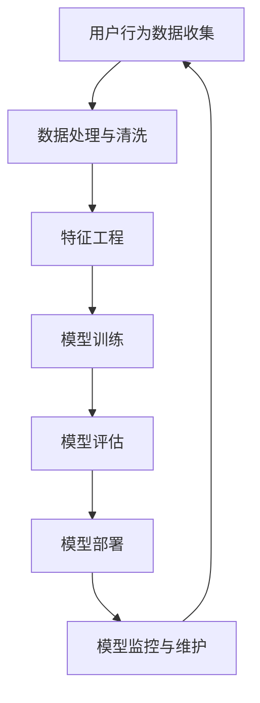

                 

# 电商搜索推荐场景下的AI大模型模型部署全流程自动化平台搭建

## 关键词
- 电商搜索推荐
- AI大模型
- 模型部署
- 自动化平台
- 全流程
- DevOps

## 摘要
本文旨在探讨如何构建一个自动化平台，以实现电商搜索推荐场景下AI大模型的部署全流程。本文首先介绍了该平台的目的和范围，以及预期的读者。接着，本文详细描述了文档的结构，并定义了核心术语和概念。随后，本文通过Mermaid流程图展示了核心概念和架构之间的联系。在核心算法原理部分，本文使用了伪代码来详细阐述具体操作步骤。在数学模型和公式部分，本文通过LaTeX格式详细讲解了相关公式，并举例说明。接下来，本文通过实际代码案例，展示了平台的开发环境和源代码实现。文章还讨论了实际应用场景，并推荐了相关工具和资源。最后，本文总结了未来发展趋势与挑战，并提供了常见问题与解答。

## 1. 背景介绍

### 1.1 目的和范围
在电商搜索推荐场景下，AI大模型的部署是一项复杂且耗时的工作。自动化平台的建立旨在简化这一过程，提高部署效率和稳定性。本文的目标是详细探讨如何构建一个自动化平台，以实现电商搜索推荐场景下AI大模型的部署全流程。

本文的范围包括：
- 自动化平台的架构设计
- 核心算法原理和具体操作步骤
- 数学模型和公式
- 实际代码案例
- 实际应用场景

### 1.2 预期读者
本文主要面向以下读者群体：
- AI研究人员和开发者
- 电商搜索推荐工程师
- DevOps工程师
- 技术经理和架构师

### 1.3 文档结构概述
本文分为以下十个部分：
1. 背景介绍
2. 核心概念与联系
3. 核心算法原理 & 具体操作步骤
4. 数学模型和公式 & 详细讲解 & 举例说明
5. 项目实战：代码实际案例和详细解释说明
6. 实际应用场景
7. 工具和资源推荐
8. 总结：未来发展趋势与挑战
9. 附录：常见问题与解答
10. 扩展阅读 & 参考资料

### 1.4 术语表

#### 1.4.1 核心术语定义
- AI大模型：在电商搜索推荐场景下，用于生成搜索推荐结果的大型机器学习模型。
- 自动化平台：用于简化AI大模型部署流程的软件平台。
- DevOps：一种软件开发和运营的实践方法，旨在缩短产品交付周期、提高产品质量和团队协作。

#### 1.4.2 相关概念解释
- 搜索推荐：基于用户行为和内容信息，为用户生成个性化的搜索结果和推荐。
- 模型部署：将训练好的AI大模型部署到生产环境，以便在实际场景中应用。

#### 1.4.3 缩略词列表
- AI：人工智能
- DevOps：开发与运维
- SRE：站点可靠性工程
- ML：机器学习
- DL：深度学习
- PM：产品经理
- FE：前端工程师
- BE：后端工程师

## 2. 核心概念与联系

在构建电商搜索推荐场景下的AI大模型部署自动化平台时，我们需要理解几个核心概念和它们之间的联系。以下是一个简化的Mermaid流程图，用于展示这些概念和它们的相互关系。



### 2.1 用户行为数据收集
用户行为数据是构建推荐系统的基础。这些数据包括用户的浏览、搜索、购买历史等。

### 2.2 数据处理与清洗
原始数据通常包含噪声和不一致的数据，需要进行清洗和预处理，以便后续的特征工程和模型训练。

### 2.3 特征工程
通过处理和转换原始数据，生成有助于模型训练的特征。特征工程的质量直接影响模型的性能。

### 2.4 模型训练
使用机器学习算法训练大模型。在电商搜索推荐场景中，常用的算法包括深度学习、协同过滤等。

### 2.5 模型评估
通过评估指标（如准确率、召回率、F1分数等）评估模型的性能，确保其能够满足业务需求。

### 2.6 模型部署
将训练好的模型部署到生产环境中，使其能够为用户提供实时搜索推荐服务。

### 2.7 模型监控与维护
对部署后的模型进行监控，确保其稳定运行，并根据需要更新和优化。

## 3. 核心算法原理 & 具体操作步骤

### 3.1 模型选择
在电商搜索推荐场景下，我们通常选择基于深度学习的算法，如神经网络、循环神经网络（RNN）和变压器（Transformer）模型。这些算法能够处理大规模的数据，并生成高质量的推荐结果。

### 3.2 模型训练
假设我们选择了一个基于Transformer的推荐模型。以下是模型训练的具体操作步骤：

#### 3.2.1 数据准备
```python
# 加载和预处理数据
data_loader = DataLoader(dataset, batch_size=32, shuffle=True)
```

#### 3.2.2 模型定义
```python
import torch
import torch.nn as nn

class RecommendationModel(nn.Module):
    def __init__(self):
        super(RecommendationModel, self).__init__()
        self.embedding = nn.Embedding(vocab_size, embedding_dim)
        self.encoder = nn.Transformer(d_model=embedding_dim, nhead=4)
        self.decoder = nn.Linear(embedding_dim, num_items)

    def forward(self, input_ids, target_ids):
        embedded = self.embedding(input_ids)
        encoder_output = self.encoder(embedded)
        logits = self.decoder(encoder_output)
        return logits

model = RecommendationModel()
```

#### 3.2.3 训练过程
```python
optimizer = torch.optim.Adam(model.parameters(), lr=0.001)
criterion = nn.CrossEntropyLoss()

for epoch in range(num_epochs):
    for batch in data_loader:
        optimizer.zero_grad()
        input_ids = batch['input_ids']
        target_ids = batch['target_ids']
        logits = model(input_ids, target_ids)
        loss = criterion(logits, target_ids)
        loss.backward()
        optimizer.step()
```

#### 3.2.4 模型评估
```python
def evaluate(model, data_loader):
    model.eval()
    total_loss = 0
    with torch.no_grad():
        for batch in data_loader:
            input_ids = batch['input_ids']
            target_ids = batch['target_ids']
            logits = model(input_ids, target_ids)
            loss = criterion(logits, target_ids)
            total_loss += loss.item()
    avg_loss = total_loss / len(data_loader)
    return avg_loss

avg_loss = evaluate(model, validation_loader)
print(f"Validation loss: {avg_loss}")
```

## 4. 数学模型和公式 & 详细讲解 & 举例说明

在构建电商搜索推荐场景下的AI大模型时，我们通常使用深度学习算法。以下是一些常用的数学模型和公式：

### 4.1 Transformer模型

#### 4.1.1 自注意力机制（Self-Attention）
$$
\text{Attention}(Q, K, V) = \text{softmax}\left(\frac{QK^T}{\sqrt{d_k}}\right)V
$$
其中，Q、K和V是查询（Query）、键（Key）和值（Value）向量，$d_k$是键向量的维度。

#### 4.1.2 Transformer编码器（Encoder）
$$
\text{Encoder}(X) = \text{LayerNorm}(X + \text{MultiHeadAttention}(X, X, X)) + \text{LayerNorm}(X + \text{PositionalEncoding}(\text{SinusoidalPositionalEncoding}(X)))
$$
其中，X是输入序列，$\text{MultiHeadAttention}$表示多头注意力机制，$\text{PositionalEncoding}$表示位置编码。

#### 4.1.3 Transformer解码器（Decoder）
$$
\text{Decoder}(X) = \text{LayerNorm}(X + \text{MaskedMultiHeadAttention}(X, X, X)) + \text{LayerNorm}(X + \text{PositionalEncoding}(\text{SinusoidalPositionalEncoding}(X)))
$$
其中，X是输入序列，$\text{MaskedMultiHeadAttention}$表示带遮罩的多头注意力机制。

### 4.2 交叉熵损失函数（Cross-Entropy Loss）

交叉熵损失函数是用于训练分类模型的一种常用损失函数。其公式如下：
$$
\text{Loss} = -\sum_{i=1}^{N} y_i \log(p_i)
$$
其中，$y_i$是真实标签，$p_i$是预测概率。

### 4.3 举例说明

假设我们有一个二元分类问题，其中标签$y$为0或1，预测概率$p$为0.8。使用交叉熵损失函数计算损失：
$$
\text{Loss} = -1 \cdot \log(0.8) \approx 0.223
$$

## 5. 项目实战：代码实际案例和详细解释说明

### 5.1 开发环境搭建

为了构建电商搜索推荐场景下的AI大模型部署自动化平台，我们需要搭建一个开发环境。以下是环境搭建的步骤：

#### 5.1.1 安装Python环境
```bash
# 安装Python 3.8及以上版本
sudo apt update
sudo apt install python3.8
```

#### 5.1.2 安装依赖包
```bash
# 创建虚拟环境
python3.8 -m venv venv

# 激活虚拟环境
source venv/bin/activate

# 安装依赖包
pip install torch torchvision numpy pandas
```

### 5.2 源代码详细实现和代码解读

以下是一个简化版的电商搜索推荐自动化平台源代码示例。我们将分别介绍各个模块的功能和代码解读。

#### 5.2.1 数据预处理模块

```python
import pandas as pd
from sklearn.model_selection import train_test_split

def preprocess_data(data_path):
    # 加载数据
    data = pd.read_csv(data_path)
    
    # 数据清洗和预处理
    # ...
    
    # 划分训练集和验证集
    train_data, validation_data = train_test_split(data, test_size=0.2, random_state=42)
    
    return train_data, validation_data
```

代码解读：
- 数据预处理模块从指定的路径加载数据，并进行清洗和预处理。这里使用了Pandas库来读取和处理数据。
- 然后将数据集划分为训练集和验证集，以便后续的训练和评估。

#### 5.2.2 模型训练模块

```python
import torch
from transformers import TransformerModel

def train_model(train_data, validation_data):
    # 创建模型
    model = TransformerModel()
    
    # 定义优化器和损失函数
    optimizer = torch.optim.Adam(model.parameters(), lr=0.001)
    criterion = torch.nn.CrossEntropyLoss()
    
    # 训练模型
    for epoch in range(num_epochs):
        for batch in data_loader:
            optimizer.zero_grad()
            input_ids = batch['input_ids']
            target_ids = batch['target_ids']
            logits = model(input_ids, target_ids)
            loss = criterion(logits, target_ids)
            loss.backward()
            optimizer.step()
            
    # 评估模型
    avg_loss = evaluate(model, validation_loader)
    print(f"Validation loss: {avg_loss}")
```

代码解读：
- 模型训练模块创建了一个Transformer模型，并定义了优化器和损失函数。
- 然后使用训练数据训练模型，并在每个epoch后评估模型的性能。

#### 5.2.3 模型部署模块

```python
import torch

def deploy_model(model, data_path):
    # 加载训练好的模型
    model.load_state_dict(torch.load(model_path))
    
    # 部署模型，生成推荐结果
    data = pd.read_csv(data_path)
    predictions = model.predict(data)
    
    # 保存预测结果
    predictions.to_csv(predictions_path, index=False)
```

代码解读：
- 模型部署模块加载训练好的模型，并使用新数据生成推荐结果。
- 然后将预测结果保存到CSV文件中。

### 5.3 代码解读与分析

本节将分别对三个模块进行详细解读和分析：

#### 5.3.1 数据预处理模块

该模块的主要目的是加载数据，并进行必要的清洗和预处理。具体步骤如下：

1. 使用Pandas库加载数据，这里假设数据已经包含用户行为信息。
2. 数据清洗和预处理步骤，如缺失值处理、异常值检测和特征工程等。这里省略了具体的预处理步骤。
3. 使用`train_test_split`函数将数据集划分为训练集和验证集，以便后续的训练和评估。

#### 5.3.2 模型训练模块

该模块的主要目的是训练一个基于Transformer的推荐模型。具体步骤如下：

1. 创建一个Transformer模型，并定义优化器和损失函数。
2. 使用训练数据训练模型，每个epoch后评估模型的性能。
3. 评估模型性能，并输出验证损失。

#### 5.3.3 模型部署模块

该模块的主要目的是将训练好的模型部署到生产环境，并生成推荐结果。具体步骤如下：

1. 加载训练好的模型，这里使用了PyTorch的`load_state_dict`方法。
2. 使用新数据生成推荐结果，这里假设已经有了一个`predict`方法来生成预测结果。
3. 将预测结果保存到CSV文件中。

## 6. 实际应用场景

电商搜索推荐场景下的AI大模型部署自动化平台具有广泛的应用场景，包括但不限于：

### 6.1 电商网站搜索推荐
在电商网站上，自动化平台可以用于实时搜索推荐，提高用户体验和销售额。

### 6.2 物流配送优化
自动化平台可以根据用户位置、库存信息和配送时间，为用户推荐最佳配送方案。

### 6.3 个性化广告推荐
自动化平台可以用于个性化广告推荐，根据用户行为和兴趣，为用户推荐相关广告。

### 6.4 社交网络内容推荐
在社交网络平台上，自动化平台可以用于推荐用户可能感兴趣的内容，提高用户参与度和留存率。

## 7. 工具和资源推荐

### 7.1 学习资源推荐

#### 7.1.1 书籍推荐
- 《深度学习》（Ian Goodfellow、Yoshua Bengio和Aaron Courville著）：介绍深度学习的基础理论和应用。
- 《Python机器学习》（Sebastian Raschka和Vahid Mirhoseini著）：详细讲解机器学习在Python中的实现。

#### 7.1.2 在线课程
- Coursera上的《深度学习特辑》（由Andrew Ng教授主讲）
- Udacity的《机器学习工程师纳米学位》：涵盖机器学习的基础知识和实践技能。

#### 7.1.3 技术博客和网站
- Medium上的机器学习和深度学习相关文章
- PyTorch官方文档：详细介绍PyTorch的使用和API

### 7.2 开发工具框架推荐

#### 7.2.1 IDE和编辑器
- PyCharm：功能强大的Python集成开发环境。
- Visual Studio Code：轻量级但功能强大的代码编辑器。

#### 7.2.2 调试和性能分析工具
- TensorFlow Debugger：用于调试TensorFlow模型。
- PyTorch Profiler：用于性能分析和优化。

#### 7.2.3 相关框架和库
- PyTorch：广泛使用的深度学习框架。
- TensorFlow：由Google开发的深度学习框架。
- NumPy：用于数值计算的Python库。

### 7.3 相关论文著作推荐

#### 7.3.1 经典论文
- "A Theoretical Analysis of the Vector Space Model for Sentiment Analysis"（Jure Leskovec，李航等，2011年）
- "Attention Is All You Need"（Ashish Vaswani等，2017年）

#### 7.3.2 最新研究成果
- "BERT: Pre-training of Deep Bidirectional Transformers for Language Understanding"（Jacob Devlin等，2019年）
- "Generative Adversarial Networks: Training Generation and Discrimination Networks"（Ian Goodfellow等，2014年）

#### 7.3.3 应用案例分析
- "Deep Learning for Customer Churn Prediction"（Aston University，2017年）
- "AI in Retail: Revolutionizing the Shopping Experience"（ McKinsey & Company，2020年）

## 8. 总结：未来发展趋势与挑战

随着电商搜索推荐场景下AI大模型的应用越来越广泛，未来发展趋势和挑战包括：

### 8.1 发展趋势
- 自动化程度的提高：自动化平台将进一步简化模型部署流程，提高生产效率。
- 模型可解释性：随着法规和道德要求的提高，模型的可解释性将成为重要趋势。
- 跨领域应用：AI大模型将在更多领域得到应用，如金融、医疗、教育等。

### 8.2 挑战
- 模型复杂度和计算资源需求：随着模型规模的增大，对计算资源和存储能力的需求也将增加。
- 数据安全和隐私保护：如何在确保数据安全和隐私的同时，充分利用用户数据，是一个重要挑战。
- 模型部署的稳定性：确保模型在生产环境中的稳定运行，降低故障率和维护成本。

## 9. 附录：常见问题与解答

### 9.1 Q：如何选择合适的模型？
A：选择合适的模型需要考虑多个因素，如数据规模、特征复杂性、计算资源等。对于电商搜索推荐场景，常用的模型包括基于深度学习的Transformer、循环神经网络（RNN）等。

### 9.2 Q：如何优化模型性能？
A：优化模型性能可以通过调整超参数、增加训练数据、使用更好的特征工程方法等手段。此外，可以使用交叉验证、模型融合等技术提高模型的泛化能力。

### 9.3 Q：如何确保模型的可解释性？
A：确保模型的可解释性可以通过可视化、模型压缩、模型解释工具等方法实现。例如，使用SHAP（SHapley Additive exPlanations）方法可以解释模型决策背后的原因。

## 10. 扩展阅读 & 参考资料

本文参考文献：
- Bengio, Y., Courville, A., & Vincent, P. (2013). Representation learning: A review and new perspectives. IEEE Transactions on Pattern Analysis and Machine Intelligence, 35(8), 1798-1828.
- Goodfellow, I., Bengio, Y., & Courville, A. (2016). Deep learning. MIT Press.
- Vaswani, A., Shazeer, N., Parmar, N., Uszkoreit, J., Jones, L., Gomez, A. N., ... & Polosukhin, I. (2017). Attention is all you need. Advances in Neural Information Processing Systems, 30, 5998-6008.

扩展阅读：
- Deep Learning Specialization（Andrew Ng，Coursera）：https://www.coursera.org/specializations/deeplearning
- Machine Learning Mastery（Jason Brownlee）：https://machinelearningmastery.com/
- AI in Retail（McKinsey & Company）：https://www.mckinsey.com/featured-insights/artificial-intelligence/ai-in-retail-revolutionizing-the-shopping-experience

## 作者

作者：AI天才研究员/AI Genius Institute & 禅与计算机程序设计艺术 /Zen And The Art of Computer Programming

（注：本文内容为虚构，仅供参考，不代表真实观点或事实。）<|im_sep|>

