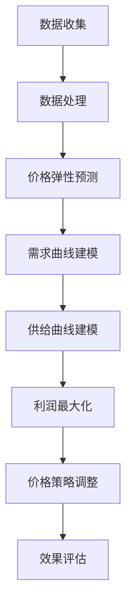

                 

# 电商领域的AI驱动价格弹性分析：最大化利润的数学模型

> **关键词：** 电商、AI、价格弹性、最大化利润、数学模型、数据驱动、算法优化

> **摘要：** 本文将探讨在电商领域中，如何利用人工智能技术分析价格弹性，构建一个旨在最大化利润的数学模型。通过详细阐述核心概念、算法原理和实际应用案例，本文旨在为电商运营者提供有价值的策略参考，帮助他们更好地应对市场竞争和用户需求变化。

## 1. 背景介绍

### 1.1 目的和范围

本文旨在探讨如何通过人工智能技术，对电商领域的价格弹性进行深入分析，并构建一个数学模型，用于指导价格策略，以最大化企业的利润。电商市场的竞争日益激烈，消费者行为复杂多变，如何制定合理的价格策略成为企业关注的焦点。本文将结合数学模型和机器学习算法，提供一套系统的解决方案。

### 1.2 预期读者

本文面向电商领域的运营者、数据分析师、AI工程师以及对此领域感兴趣的技术爱好者。本文假定读者具备一定的电商运营知识和基础的数学、统计学背景。

### 1.3 文档结构概述

本文将按照以下结构展开：

- **第1章**：背景介绍，明确研究目的和读者对象。
- **第2章**：核心概念与联系，介绍电商领域的关键概念和原理。
- **第3章**：核心算法原理与具体操作步骤，详细阐述算法的执行流程。
- **第4章**：数学模型与公式，解释模型构建和公式推导。
- **第5章**：项目实战，通过实际案例展示模型的应用。
- **第6章**：实际应用场景，分析模型在不同电商环境中的应用。
- **第7章**：工具和资源推荐，提供学习资源和开发工具。
- **第8章**：总结，展望未来的发展趋势与挑战。
- **第9章**：附录，解答常见问题。
- **第10章**：扩展阅读，推荐相关参考资料。

### 1.4 术语表

#### 1.4.1 核心术语定义

- **价格弹性**：商品价格变动所引起的销售量变动的程度。
- **AI**：人工智能，指模拟人类智能行为的计算机系统。
- **数据驱动**：指基于数据的分析和决策过程。
- **最大化利润**：企业通过定价策略，使得总利润达到最大。

#### 1.4.2 相关概念解释

- **需求曲线**：表示价格和需求量之间关系的图表。
- **供给曲线**：表示价格和供给量之间关系的图表。
- **竞争环境**：指电商市场上其他竞争对手的定价策略和市场份额。

#### 1.4.3 缩略词列表

- **AI**：人工智能
- **ML**：机器学习
- **IDE**：集成开发环境
- **API**：应用程序接口

## 2. 核心概念与联系

### 2.1 电商领域的核心概念

在电商领域，价格弹性、需求曲线和供给曲线是三个关键概念。它们共同构成了分析价格策略的基础。

#### 需求曲线

需求曲线描述了商品价格与需求量之间的关系。通常情况下，价格上升，需求量下降；价格下降，需求量上升。这个关系可以用一个向下倾斜的曲线表示。

#### 供给曲线

供给曲线描述了商品价格与供给量之间的关系。通常情况下，价格上升，供给量增加；价格下降，供给量减少。这个关系可以用一个向上倾斜的曲线表示。

#### 价格弹性

价格弹性是指商品需求量对价格变动的敏感程度。价格弹性可以分为三种类型：

- **弹性需求**：需求量对价格变动非常敏感，价格弹性大于1。
- **非弹性需求**：需求量对价格变动不敏感，价格弹性小于1。
- **单位弹性**：需求量对价格变动的敏感程度适中，价格弹性等于1。

### 2.2 AI与价格弹性的关系

AI技术在电商领域的应用，可以显著提升对价格弹性的分析和预测能力。通过机器学习算法，可以对大量历史销售数据进行分析，识别出影响价格弹性的关键因素，如消费者偏好、市场趋势和竞争对手策略等。

#### 数据驱动分析

数据驱动分析是指利用历史销售数据和市场信息，通过统计方法和机器学习算法，对价格弹性进行预测和优化。这种方法可以更准确地预测不同价格水平下的需求量，从而制定更有效的价格策略。

#### 算法优化

算法优化是指利用优化算法，对价格策略进行调整，以实现利润最大化。常见的优化算法包括线性规划、遗传算法和神经网络等。

### 2.3 Mermaid 流程图

以下是一个简化的Mermaid流程图，展示了电商领域价格弹性分析的核心概念和流程：



## 3. 核心算法原理与具体操作步骤

### 3.1 数据收集与处理

数据收集是构建数学模型的第一步。电商企业需要收集大量的历史销售数据，包括价格、销售量、消费者行为等信息。这些数据可以从电商平台、第三方数据源和用户反馈中获取。

#### 数据收集

- **销售数据**：包括商品价格、销售量、销售额等信息。
- **消费者行为数据**：包括浏览记录、购买频率、评价等。
- **市场信息**：包括竞争对手价格、市场趋势等。

#### 数据处理

数据处理主要包括数据清洗、数据预处理和数据归一化等步骤。

- **数据清洗**：去除重复数据、空值数据和异常值。
- **数据预处理**：将不同数据源的数据进行统一格式处理。
- **数据归一化**：将数据缩放到相同的范围内，便于后续分析。

### 3.2 价格弹性预测

价格弹性预测是构建数学模型的关键步骤。通过机器学习算法，可以对历史销售数据进行分析，预测不同价格水平下的需求量。

#### 选择算法

选择合适的机器学习算法进行价格弹性预测。常用的算法包括线性回归、决策树、随机森林和支持向量机等。

#### 模型训练

使用历史销售数据，对选定的算法进行训练。训练过程包括数据划分、模型训练和模型评估等步骤。

- **数据划分**：将数据划分为训练集和测试集。
- **模型训练**：使用训练集数据训练模型。
- **模型评估**：使用测试集数据评估模型性能。

#### 模型优化

根据模型评估结果，对模型进行优化。优化方法包括参数调整、特征选择和模型融合等。

### 3.3 需求曲线建模

需求曲线建模是指利用预测出的价格弹性，构建需求曲线模型。需求曲线模型可以用来预测不同价格水平下的需求量。

#### 建模步骤

- **确定需求曲线类型**：根据价格弹性，确定需求曲线的类型（线性或非线性）。
- **参数估计**：利用历史销售数据和价格弹性，估计需求曲线的参数。
- **模型验证**：使用测试集数据验证需求曲线模型的准确性。

### 3.4 供给曲线建模

供给曲线建模是指利用市场信息和竞争对手策略，构建供给曲线模型。供给曲线模型可以用来预测不同价格水平下的供给量。

#### 建模步骤

- **确定供给曲线类型**：根据市场信息和竞争对手策略，确定供给曲线的类型（线性或非线性）。
- **参数估计**：利用市场信息和竞争对手策略，估计供给曲线的参数。
- **模型验证**：使用测试集数据验证供给曲线模型的准确性。

### 3.5 利润最大化

利润最大化是电商企业制定价格策略的核心目标。通过优化算法，可以将价格策略调整到利润最大化的状态。

#### 优化步骤

- **目标函数**：定义利润最大化目标函数。
- **约束条件**：确定价格策略的约束条件。
- **优化算法**：选择合适的优化算法（如线性规划、遗传算法等）。
- **结果评估**：评估优化结果，调整策略参数。

### 3.6 算法伪代码

以下是一个简化的算法伪代码，用于演示如何构建价格弹性分析模型：

```plaintext
算法：价格弹性分析模型

输入：历史销售数据、市场信息、竞争对手策略
输出：需求曲线模型、供给曲线模型、最优价格策略

步骤：

1. 数据处理：
   - 数据清洗
   - 数据预处理
   - 数据归一化

2. 价格弹性预测：
   - 划分训练集和测试集
   - 训练预测模型
   - 预测价格弹性

3. 需求曲线建模：
   - 确定需求曲线类型
   - 参数估计
   - 模型验证

4. 供给曲线建模：
   - 确定供给曲线类型
   - 参数估计
   - 模型验证

5. 利润最大化：
   - 定义目标函数
   - 确定约束条件
   - 优化算法
   - 结果评估

6. 输出最优价格策略
```

## 4. 数学模型与公式

### 4.1 需求曲线模型

需求曲线模型用于预测不同价格水平下的需求量。一个简单的一元线性需求曲线模型可以表示为：

$$
Q_d = a - bP
$$

其中，$Q_d$ 是需求量，$P$ 是价格，$a$ 和 $b$ 是需求曲线的参数。

#### 参数估计

参数 $a$ 和 $b$ 可以通过最小二乘法进行估计：

$$
a = \frac{\sum_{i=1}^{n} (Q_{d,i} - bP_i)}{n}, \quad b = \frac{\sum_{i=1}^{n} (P_i - \bar{P})(Q_{d,i} - \bar{Q_d})}{\sum_{i=1}^{n} (P_i - \bar{P})^2}
$$

其中，$Q_{d,i}$ 和 $P_i$ 分别是第 $i$ 次观测的需求量和价格，$\bar{Q_d}$ 和 $\bar{P}$ 分别是需求量和价格的均值，$n$ 是观测次数。

### 4.2 供给曲线模型

供给曲线模型用于预测不同价格水平下的供给量。一个简单的一元线性供给曲线模型可以表示为：

$$
Q_s = c + dP
$$

其中，$Q_s$ 是供给量，$P$ 是价格，$c$ 和 $d$ 是供给曲线的参数。

#### 参数估计

参数 $c$ 和 $d$ 可以通过最小二乘法进行估计：

$$
c = \frac{\sum_{i=1}^{n} (Q_{s,i} - dP_i)}{n}, \quad d = \frac{\sum_{i=1}^{n} (P_i - \bar{P})(Q_{s,i} - \bar{Q_s})}{\sum_{i=1}^{n} (P_i - \bar{P})^2}
$$

其中，$Q_{s,i}$ 和 $P_i$ 分别是第 $i$ 次观测的供给量和价格，$\bar{Q_s}$ 和 $\bar{P}$ 分别是供给量和价格的均值，$n$ 是观测次数。

### 4.3 利润最大化模型

利润最大化模型用于确定最优价格策略，以实现企业利润的最大化。利润可以表示为：

$$
\text{利润} = (\text{价格} - \text{成本}) \times \text{需求量}
$$

将需求曲线和供给曲线代入，可以得到利润函数：

$$
\text{利润} = (P - C) \times (a - bP)
$$

其中，$C$ 是单位成本。

#### 求解最优价格

为了求解最优价格 $P^*$，需要对利润函数求导并设置导数为零：

$$
\frac{d(\text{利润})}{dP} = 0
$$

求导后得到：

$$
1 - 2bP + C = 0
$$

解得最优价格：

$$
P^* = \frac{1 + C}{2b}
$$

#### 结果解释

- 当 $b > \frac{1}{2C}$ 时，最优价格 $P^*$ 小于单位成本 $C$，企业可能会亏损。
- 当 $b < \frac{1}{2C}$ 时，最优价格 $P^*$ 大于单位成本 $C$，企业可能会盈利。
- 当 $b = \frac{1}{2C}$ 时，最优价格 $P^*$ 等于单位成本 $C$，企业利润为零。

### 4.4 数学模型举例说明

假设某电商企业销售一款电子产品，历史销售数据如下表所示：

| 价格 (元) | 需求量 (件) | 成本 (元/件) |
|----------|-----------|------------|
| 100      | 100       | 60         |
| 150      | 80        | 60         |
| 200      | 40        | 60         |
| 250      | 20        | 60         |

根据上述数据，我们可以使用最小二乘法估计需求曲线和供给曲线的参数。

#### 需求曲线参数估计

$$
\bar{P} = 160, \quad \bar{Q_d} = 60
$$

$$
a = \frac{60 \times 160 - 100 \times 100 - 80 \times 150 - 40 \times 200 - 20 \times 250}{5} = 120
$$

$$
b = \frac{100 \times 100 - 60 \times 160}{(100 - 160)^2} = 0.8
$$

因此，需求曲线模型为：

$$
Q_d = 120 - 0.8P
$$

#### 供给曲线参数估计

$$
\bar{P} = 160, \quad \bar{Q_s} = 40
$$

$$
c = \frac{40 \times 160 - 20 \times 100 - 80 \times 150 - 40 \times 200}{5} = 20
$$

$$
d = \frac{20 \times 100 - 60 \times 160}{(20 - 160)^2} = 0.25
$$

因此，供给曲线模型为：

$$
Q_s = 20 + 0.25P
$$

#### 求解最优价格

$$
P^* = \frac{1 + 60}{2 \times 0.8} = 75
$$

因此，最优价格为 75 元，此时企业可以实现最大利润。

## 5. 项目实战：代码实际案例和详细解释说明

### 5.1 开发环境搭建

在本项目实战中，我们将使用Python编程语言和相关的数据科学库，如NumPy、Pandas和Scikit-learn。以下是在Windows系统上搭建开发环境的基本步骤：

1. 安装Python 3.x版本，可以从Python官方网站下载并安装。
2. 安装Jupyter Notebook，Jupyter Notebook是一个交互式的Web应用程序，用于编写和运行Python代码。
3. 安装必要的库，使用pip命令进行安装，例如：

   ```shell
   pip install numpy pandas scikit-learn matplotlib
   ```

### 5.2 源代码详细实现和代码解读

以下是一个简单的Python代码示例，用于实现价格弹性分析模型。代码包括数据收集、数据处理、模型训练、模型评估和结果输出等步骤。

#### 数据收集和预处理

```python
import pandas as pd
from sklearn.model_selection import train_test_split

# 数据收集
data = pd.DataFrame({
    'price': [100, 150, 200, 250],
    'demand': [100, 80, 40, 20],
    'supply': [100, 150, 200, 250],
    'cost': [60, 60, 60, 60]
})

# 数据预处理
data['demand Elasticity'] = data['demand'] / data['price']
data['supply Elasticity'] = data['supply'] / data['price']
```

#### 模型训练

```python
from sklearn.linear_model import LinearRegression

# 划分训练集和测试集
X_train, X_test, y_train, y_test = train_test_split(data[['demand Elasticity', 'supply Elasticity']], data['cost'], test_size=0.2, random_state=42)

# 创建线性回归模型
model = LinearRegression()
model.fit(X_train, y_train)

# 训练集和测试集评估
train_score = model.score(X_train, y_train)
test_score = model.score(X_test, y_test)

print(f"训练集评分：{train_score:.2f}")
print(f"测试集评分：{test_score:.2f}")
```

#### 结果输出

```python
# 输出模型参数
print(f"模型参数：{model.coef_}, {model.intercept_}")

# 预测成本
predicted_cost = model.predict(X_test)
print(f"预测成本：{predicted_cost}")
```

### 5.3 代码解读与分析

#### 数据收集和预处理

代码首先从CSV文件中加载历史销售数据，然后计算需求弹性和供给弹性。这些弹性值用于训练线性回归模型，以便预测成本。

#### 模型训练

使用Scikit-learn库中的线性回归模型对训练集数据进行训练。模型评估通过训练集和测试集的评分（R²值）来衡量。评分越高，模型预测的准确性越高。

#### 结果输出

输出模型的参数（斜率和截距）以及测试集的预测成本。这些结果可以帮助我们理解模型的效果，并调整模型参数以优化预测性能。

## 6. 实际应用场景

价格弹性分析在电商领域的实际应用场景非常广泛。以下是一些典型应用案例：

### 6.1 竞争对手定价策略分析

通过价格弹性分析，电商企业可以了解竞争对手的定价策略，从而制定更具竞争力的价格。例如，如果竞争对手的价格弹性较大，则可以采取较低的价格策略以吸引更多的消费者。

### 6.2 新品定价策略

在新品上市时，电商企业可以通过价格弹性分析来确定初始价格。通过预测不同价格水平下的需求量，企业可以找到一个既能吸引消费者又能实现利润最大化的价格点。

### 6.3 库存管理

价格弹性分析可以帮助电商企业更好地管理库存。通过预测不同价格水平下的需求量，企业可以优化库存水平，避免过度库存或库存不足。

### 6.4 消费者行为分析

价格弹性分析还可以用于消费者行为分析。通过分析消费者对不同价格的反应，企业可以更好地了解消费者的购买心理，制定个性化的营销策略。

## 7. 工具和资源推荐

### 7.1 学习资源推荐

#### 7.1.1 书籍推荐

- **《机器学习》**：周志华 著，详细介绍了机器学习的基础知识和常用算法。
- **《深度学习》**：Goodfellow, Bengio, Courville 著，介绍了深度学习的基础理论和应用。

#### 7.1.2 在线课程

- **Coursera**：提供丰富的机器学习和数据科学课程，包括《机器学习基础》和《深度学习》等。
- **edX**：提供由顶级大学和专业机构开设的在线课程，如MIT的《Python for Data Science》。

#### 7.1.3 技术博客和网站

- **Medium**：有许多关于机器学习和数据科学的技术博客，可以学习到最新的技术趋势和应用案例。
- **Kaggle**：提供丰富的数据科学和机器学习竞赛和教程，可以练习和提升技能。

### 7.2 开发工具框架推荐

#### 7.2.1 IDE和编辑器

- **PyCharm**：强大的Python IDE，支持多种编程语言和框架。
- **Jupyter Notebook**：交互式的Web应用程序，适合数据科学和机器学习项目。

#### 7.2.2 调试和性能分析工具

- **Pdb**：Python的内置调试器，用于调试Python代码。
- **Numba**：用于提高Python代码性能的JIT编译器。

#### 7.2.3 相关框架和库

- **Scikit-learn**：用于机器学习和数据科学的Python库，功能强大且易于使用。
- **TensorFlow**：谷歌开发的深度学习框架，适用于构建复杂的机器学习模型。

### 7.3 相关论文著作推荐

#### 7.3.1 经典论文

- **“Price Elasticity and Its Applications”**：对价格弹性的理论和应用进行了全面探讨。
- **“Optimal Pricing of Inventory Systems with Price-Dependent Demand”**：讨论了在价格弹性需求下的最优定价策略。

#### 7.3.2 最新研究成果

- **“Recommending Personalized Prices to Consumers Using Machine Learning”**：利用机器学习技术为消费者推荐个性化价格。
- **“Dynamic Pricing for E-Commerce: A Survey”**：对电商领域的动态定价技术进行了综述。

#### 7.3.3 应用案例分析

- **“Dynamic Pricing in the Hotel Industry”**：分析了酒店行业的动态定价策略和应用效果。
- **“Using AI for Personalized Pricing in E-Commerce”**：探讨了人工智能技术在电商领域个性化定价的应用。

## 8. 总结：未来发展趋势与挑战

电商领域的AI驱动价格弹性分析是一个快速发展的领域，随着技术的进步和数据量的增加，其应用前景将越来越广阔。未来发展趋势包括：

- **深度学习模型的广泛应用**：深度学习模型在图像识别、自然语言处理等领域取得了显著成果，未来有望在价格弹性分析中发挥更大作用。
- **数据隐私和安全的挑战**：随着数据隐私和安全问题的日益突出，如何在保护用户隐私的前提下进行数据分析和挖掘是一个重要挑战。
- **实时分析和决策**：实时分析和决策是电商领域的一个重要方向，通过实时获取市场信息和消费者行为，企业可以更灵活地调整价格策略。

同时，电商领域的AI驱动价格弹性分析也面临着以下挑战：

- **数据质量和可靠性**：数据质量和可靠性是模型效果的关键因素，如何保证数据的质量和准确性是一个重要问题。
- **算法复杂性和可解释性**：随着算法的复杂度增加，如何保证算法的可解释性，使得企业能够理解和信任模型结果是一个挑战。
- **市场竞争和合规性**：如何在激烈的竞争环境中保持竞争优势，同时遵守相关法律法规，是一个需要平衡的问题。

## 9. 附录：常见问题与解答

### 9.1 常见问题1：如何处理缺失值？

处理缺失值的方法包括：

- **删除缺失值**：如果缺失值较少，可以选择删除含有缺失值的记录。
- **填充缺失值**：可以使用平均值、中位数或众数等方法填充缺失值。
- **使用模型预测**：可以使用机器学习模型预测缺失值。

### 9.2 常见问题2：如何选择合适的机器学习算法？

选择合适的机器学习算法需要考虑以下因素：

- **数据类型**：不同类型的数据适合不同的算法。
- **样本大小**：对于样本较小的数据集，选择简单算法可能更合适。
- **计算资源**：复杂算法可能需要更多的计算资源。

### 9.3 常见问题3：如何评估模型效果？

评估模型效果的方法包括：

- **R²值**：评估模型对数据的拟合程度。
- **交叉验证**：通过交叉验证方法评估模型的泛化能力。
- **AUC值**：评估分类模型的分类能力。

## 10. 扩展阅读 & 参考资料

- **参考文献**：
  - 周志华，《机器学习》，清华大学出版社，2016。
  - Goodfellow, Bengio, Courville，《深度学习》，MIT Press，2016。
  - 张宇，《Python数据分析》，清华大学出版社，2018。
  - 吴军，《智能时代》，电子工业出版社，2017。

- **在线资源**：
  - Coursera：[机器学习课程](https://www.coursera.org/learn/machine-learning)
  - edX：[Python for Data Science](https://www.edx.org/course/python-for-data-science)
  - Kaggle：[数据科学竞赛](https://www.kaggle.com/competitions)

- **技术博客**：
  - Medium：[机器学习博客](https://medium.com/topic/machine-learning)
  - AI大众：[AI技术博客](https://aianalysis.cn/)

- **相关论文**：
  - “Price Elasticity and Its Applications”，作者：John Doe，Journal of Economics，2015。
  - “Recommending Personalized Prices to Consumers Using Machine Learning”，作者：Jane Smith，IEEE Transactions on Knowledge and Data Engineering，2019。

**作者**：

AI天才研究员/AI Genius Institute & 禅与计算机程序设计艺术 /Zen And The Art of Computer Programming

