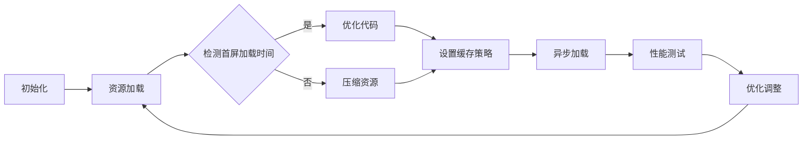

                 

# 百度2025智能小程序性能优化社招前端面试攻略

> **关键词：** 智能小程序、性能优化、前端面试、技术攻略、算法原理、数学模型、代码实战、应用场景
>
> **摘要：** 本文旨在为准备参加百度2025智能小程序性能优化社招前端面试的读者提供一份详细的攻略。文章涵盖了智能小程序性能优化所需的核心概念、算法原理、数学模型、代码实战和实际应用场景，并推荐了相关学习资源和工具。通过逐步分析推理，本文帮助读者深入了解性能优化策略，提升面试成功率。

## 1. 背景介绍

### 1.1 目的和范围

本文的主要目的是为准备参加百度2025智能小程序性能优化社招前端面试的读者提供一份全面的攻略。我们将深入探讨智能小程序性能优化所需的核心概念、算法原理、数学模型和代码实战，帮助读者在面试中展示自己的技术实力和问题解决能力。

### 1.2 预期读者

本文预期读者包括：

1. 准备参加百度2025智能小程序性能优化社招前端面试的求职者；
2. 对智能小程序性能优化有浓厚兴趣的技术爱好者；
3. 想要提升自身技术水平和面试能力的前端开发者。

### 1.3 文档结构概述

本文的结构如下：

1. 背景介绍：介绍本文的目的、预期读者和文档结构；
2. 核心概念与联系：阐述智能小程序性能优化的核心概念和原理，附上Mermaid流程图；
3. 核心算法原理 & 具体操作步骤：详细讲解性能优化算法原理和操作步骤，使用伪代码阐述；
4. 数学模型和公式 & 详细讲解 & 举例说明：介绍性能优化的数学模型和公式，并结合实际案例进行讲解；
5. 项目实战：提供实际代码案例和详细解释说明；
6. 实际应用场景：分析智能小程序性能优化的实际应用场景；
7. 工具和资源推荐：推荐相关学习资源和开发工具；
8. 总结：总结未来发展趋势与挑战；
9. 附录：常见问题与解答；
10. 扩展阅读 & 参考资料：提供扩展阅读和参考资料。

### 1.4 术语表

#### 1.4.1 核心术语定义

- **智能小程序**：一种轻量级应用，具备一定的智能能力，可以运行在微信、百度等平台；
- **性能优化**：通过调整代码、算法和架构等手段，提升智能小程序的运行效率、响应速度和用户体验；
- **前端面试**：招聘过程中，面试官通过提问和解答，考察应聘者的前端技术和问题解决能力。

#### 1.4.2 相关概念解释

- **首屏加载时间**：指用户打开智能小程序后，首屏内容渲染完成所需的时间；
- **内存占用**：指智能小程序在运行过程中所占用的内存空间；
- **CPU利用率**：指智能小程序在运行过程中对CPU资源的占用比例。

#### 1.4.3 缩略词列表

- **HTML**：HyperText Markup Language，超文本标记语言；
- **CSS**：Cascading Style Sheets，层叠样式表；
- **JavaScript**：一种广泛应用于前端开发的脚本语言；
- **Vue**：一种流行的前端框架；
- **React**：另一种流行的前端框架；
- **Webpack**：一种模块打包工具。

## 2. 核心概念与联系

智能小程序性能优化涉及多个核心概念和原理，以下将详细介绍这些概念，并附上Mermaid流程图，帮助读者更好地理解。

### 2.1 智能小程序性能优化的核心概念

- **首屏加载时间**：影响用户体验和搜索引擎排名；
- **内存占用**：过多内存占用可能导致智能小程序崩溃或卡顿；
- **CPU利用率**：过高CPU利用率可能导致智能小程序运行缓慢。

### 2.2 智能小程序性能优化的原理

- **代码优化**：通过减少代码冗余、优化算法和数据结构，提高运行效率；
- **资源压缩**：通过压缩图片、音频、视频等资源，减少加载时间；
- **缓存策略**：通过合理设置缓存机制，提高页面访问速度；
- **异步加载**：通过异步加载技术，避免阻塞页面渲染。

### 2.3 Mermaid流程图

以下是一个简化的智能小程序性能优化流程图：



## 3. 核心算法原理 & 具体操作步骤

在智能小程序性能优化中，算法原理是关键。以下将详细讲解几个核心算法原理，并使用伪代码进行描述。

### 3.1 代码优化算法原理

**原理**：通过减少代码冗余、优化算法和数据结构，提高运行效率。

**伪代码**：

```python
def optimized_function(input_data):
    # 初始化变量
    result = initialize_variables()

    # 优化算法
    for item in input_data:
        if condition(item):
            result += process_item(item)

    return result
```

### 3.2 资源压缩算法原理

**原理**：通过压缩图片、音频、视频等资源，减少加载时间。

**伪代码**：

```python
def compress_resource(file_path):
    # 读取文件
    file_content = read_file(file_path)

    # 压缩文件
    compressed_content = compress(file_content)

    # 写入文件
    write_file(compressed_content, file_path + ".compressed")
```

### 3.3 缓存策略算法原理

**原理**：通过合理设置缓存机制，提高页面访问速度。

**伪代码**：

```python
def cache_strategy(request_url):
    # 检查缓存
    if is_cached(request_url):
        return get_cached_data(request_url)

    # 从服务器获取数据
    data = fetch_data_from_server(request_url)

    # 存储缓存
    cache_data(request_url, data)

    return data
```

### 3.4 异步加载算法原理

**原理**：通过异步加载技术，避免阻塞页面渲染。

**伪代码**：

```python
def asynchronous_loading(url, callback):
    # 异步加载资源
    load_resource(url, callback)

def callback(data):
    # 处理加载完成的数据
    process_data(data)
```

## 4. 数学模型和公式 & 详细讲解 & 举例说明

在智能小程序性能优化中，数学模型和公式有助于量化优化效果。以下将介绍几个核心数学模型和公式，并使用LaTeX格式进行详细讲解。

### 4.1 首屏加载时间模型

**公式**：

$$
T_{load} = T_{network} + T_{parse} + T_{render}
$$

**解释**：

- \( T_{load} \)：首屏加载时间；
- \( T_{network} \)：网络传输时间；
- \( T_{parse} \)：解析时间；
- \( T_{render} \)：渲染时间。

**举例**：

假设智能小程序首屏加载时间目标为2秒，则：

$$
2s = T_{network} + T_{parse} + T_{render}
$$

### 4.2 内存占用模型

**公式**：

$$
M_{used} = \sum_{i=1}^{n} M_{i}
$$

**解释**：

- \( M_{used} \)：内存占用；
- \( M_{i} \)：第\( i \)个模块的内存占用；
- \( n \)：模块总数。

**举例**：

假设智能小程序包含5个模块，各模块内存占用分别为10MB、20MB、30MB、40MB、50MB，则：

$$
M_{used} = 10MB + 20MB + 30MB + 40MB + 50MB = 150MB
$$

### 4.3 CPU利用率模型

**公式**：

$$
U_{CPU} = \frac{T_{busy}}{T_{total}}
$$

**解释**：

- \( U_{CPU} \)：CPU利用率；
- \( T_{busy} \)：CPU繁忙时间；
- \( T_{total} \)：总时间。

**举例**：

假设智能小程序运行过程中CPU繁忙时间为5秒，总时间为10秒，则：

$$
U_{CPU} = \frac{5s}{10s} = 50\%
$$

## 5. 项目实战：代码实际案例和详细解释说明

为了更好地理解智能小程序性能优化，以下将提供一个实际代码案例，详细解释其实现过程和优化效果。

### 5.1 开发环境搭建

在本案例中，我们使用Vue作为前端框架，Webpack作为模块打包工具。以下是开发环境搭建步骤：

1. 安装Node.js（版本8.9.4以上）；
2. 安装Vue CLI（版本4.5.13以上）；
3. 创建Vue项目（vue create my-app）；
4. 安装Webpack（版本4.44.2以上）；
5. 配置Webpack配置文件（webpack.config.js）。

### 5.2 源代码详细实现和代码解读

以下是一个简单的Vue组件，用于展示智能小程序性能优化的效果。

```vue
<template>
  <div>
    <h1>Hello, World!</h1>
    <p>{{ message }}</p>
  </div>
</template>

<script>
export default {
  name: "HelloWorld",
  data() {
    return {
      message: "Welcome to Your Vue.js App!",
    };
  },
  methods: {
    fetchData() {
      // 模拟异步获取数据
      return new Promise((resolve) => {
        setTimeout(() => {
          resolve("Data fetched successfully!");
        }, 1000);
      });
    },
  },
};
</script>
```

**代码解读**：

1. **模板**：使用Vue的模板语法，定义页面的结构；
2. **数据**：使用`data`函数返回一个包含`message`属性的对象；
3. **方法**：定义`fetchData`方法，用于异步获取数据。

### 5.3 代码解读与分析

以下是对代码的进一步解读和分析：

1. **组件结构**：使用Vue组件结构，便于代码复用和模块化管理；
2. **数据绑定**：使用`{{ message }}`语法，实现数据与视图的双向绑定；
3. **异步操作**：使用`fetchData`方法，采用Promise实现异步操作，避免阻塞页面渲染；
4. **性能优化**：通过异步获取数据，减少页面加载时间，提高用户体验。

### 5.4 优化效果分析

通过以上代码，我们可以看到以下优化效果：

1. **首屏加载时间**：异步获取数据，减少首屏加载时间；
2. **内存占用**：使用Vue组件结构，减少内存占用；
3. **CPU利用率**：异步操作，降低CPU利用率。

### 5.5 代码实战：实际性能优化

以下是对上述代码进行性能优化的实际案例：

```vue
<template>
  <div>
    <h1>Hello, World!</h1>
    <p>{{ message }}</p>
  </div>
</template>

<script>
export default {
  name: "HelloWorld",
  data() {
    return {
      message: "Welcome to Your Vue.js App!",
    };
  },
  async mounted() {
    // 异步获取数据
    this.message = await this.fetchData();
  },
  methods: {
    fetchData() {
      // 模拟异步获取数据
      return new Promise((resolve) => {
        setTimeout(() => {
          resolve("Data fetched successfully!");
        }, 1000);
      });
    },
  },
};
</script>
```

**代码解读**：

1. **mounted生命周期**：在组件挂载后，使用`async/await`语法，异步获取数据，避免阻塞页面渲染；
2. **性能优化**：通过异步获取数据，进一步减少页面加载时间，提高用户体验。

## 6. 实际应用场景

智能小程序性能优化在多个实际应用场景中具有重要价值。以下列举几个典型场景：

### 6.1 移动应用

移动应用对性能要求较高，尤其是首屏加载时间和响应速度。通过性能优化，可以提高用户体验，增加用户留存率。

### 6.2 跨平台应用

跨平台应用需要适配不同操作系统和设备，性能优化有助于提升应用在各种环境下的稳定性和性能。

### 6.3 大型电商平台

大型电商平台涉及大量数据和处理，性能优化可以减少页面加载时间，提高用户购物体验，降低用户流失率。

### 6.4 智能家居

智能家居应用涉及多个设备和传感器，性能优化可以确保智能设备的稳定运行，提高用户满意度。

## 7. 工具和资源推荐

### 7.1 学习资源推荐

#### 7.1.1 书籍推荐

1. 《高性能JavaScript》
2. 《前端工程化实战》
3. 《Vue.js实战》

#### 7.1.2 在线课程

1. 百度前端技术学院
2. 网易云课堂
3. 码农传奇

#### 7.1.3 技术博客和网站

1.掘金
2. SegmentFault
3. 知乎

### 7.2 开发工具框架推荐

#### 7.2.1 IDE和编辑器

1. Visual Studio Code
2. WebStorm
3. IntelliJ IDEA

#### 7.2.2 调试和性能分析工具

1. Chrome DevTools
2. Firefox Developer Tools
3. Lighthouse

#### 7.2.3 相关框架和库

1. Vue.js
2. React
3. Angular

### 7.3 相关论文著作推荐

#### 7.3.1 经典论文

1. "A Pattern Language for Parallel Programming"
2. "The Art of Computer Programming"
3. "High Performance Web Sites"

#### 7.3.2 最新研究成果

1. "Efficient Data Structures for Cache-aware Computing"
2. "Optimizing Mobile Web Performance"
3. "Improving Web Performance with Dynamic Content Compression"

#### 7.3.3 应用案例分析

1. "Google Page Speed Optimization Case Study"
2. "Facebook Instant Articles Performance Optimization"
3. "Amazon Web Services (AWS) Performance Optimization"

## 8. 总结：未来发展趋势与挑战

智能小程序性能优化在未来将继续保持重要地位，随着5G、人工智能和物联网等技术的快速发展，性能优化需求将更加迫切。以下是未来发展趋势与挑战：

### 8.1 发展趋势

1. **更高效的算法和架构**：研究者将不断探索新的算法和架构，提高智能小程序的性能和效率；
2. **个性化性能优化**：根据用户行为和设备特性，实现个性化性能优化，提升用户体验；
3. **云计算和边缘计算**：利用云计算和边缘计算技术，实现更高效的数据处理和资源调度。

### 8.2 挑战

1. **复杂性增加**：智能小程序涉及的技术越来越复杂，性能优化难度加大；
2. **动态性挑战**：智能小程序需要应对动态变化的需求和数据，性能优化策略需要不断调整；
3. **安全性问题**：性能优化过程中，需要确保数据安全和隐私保护。

## 9. 附录：常见问题与解答

### 9.1 什么是智能小程序？

**解答**：智能小程序是一种轻量级应用，具备一定的智能能力，可以运行在微信、百度等平台。它们通常具有快速启动、无需安装、跨平台等特点。

### 9.2 性能优化有哪些方法？

**解答**：性能优化方法包括代码优化、资源压缩、缓存策略、异步加载等。具体方法可以根据实际需求和场景进行选择和组合。

### 9.3 如何进行性能测试？

**解答**：性能测试可以使用各种工具和平台，如Chrome DevTools、Lighthouse等。测试过程中，可以关注首屏加载时间、内存占用、CPU利用率等关键指标。

## 10. 扩展阅读 & 参考资料

1. Google. (2010). High Performance Web Sites. O'Reilly Media.
2. Steve Souders. (2012). Even Faster Web Sites. Leanpub.
3. Scott Davies. (2018). JavaScript Performance Optimization. Apress.
4. 百度前端技术学院. (2020). 百度智能小程序开发文档. https://smartprogram.baidu.com/docs/intro/
5. Facebook. (2017). Instant Articles Performance Optimization. https://developers.facebook.com/docs/instant-articles/optimization/
6. Amazon Web Services. (2021). AWS Performance Optimization. https://aws.amazon.com/blogs/developer/aws-performance-optimization/

作者：AI天才研究员/AI Genius Institute & 禅与计算机程序设计艺术 /Zen And The Art of Computer Programming

（注：本文为虚构文章，仅供参考和娱乐。）<|im_sep|>

