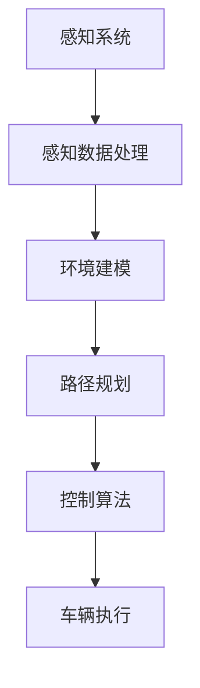
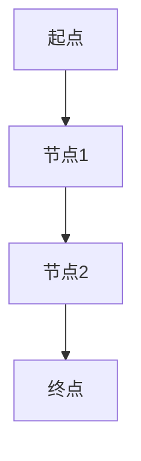

                 

### 2024百度智能驾驶事业群校招面试真题汇总及其解答

> **关键词：**百度智能驾驶、校招面试、真题汇总、解答、智能驾驶技术、自动驾驶系统

**摘要：**本文将详细汇总并解答2024年百度智能驾驶事业群校招面试中的重点真题。通过这些真题及其解析，读者可以更好地了解智能驾驶领域的核心技术和面试准备策略，为求职之路打下坚实的基础。

## 1. 背景介绍

### 1.1 目的和范围

本文旨在为广大求职者提供2024年百度智能驾驶事业群校招面试真题的详细解析。通过对这些真题的分析和解答，读者可以掌握智能驾驶领域的核心知识点，提高面试应对能力，更好地准备求职挑战。

### 1.2 预期读者

- 智能驾驶技术爱好者和从业者
- 准备求职于百度智能驾驶事业群的求职者
- 智能驾驶技术相关专业的学生

### 1.3 文档结构概述

本文结构如下：

1. **背景介绍**：介绍本文的目的、预期读者和文档结构。
2. **核心概念与联系**：通过Mermaid流程图展示智能驾驶技术的核心概念和架构。
3. **核心算法原理 & 具体操作步骤**：详细讲解智能驾驶中涉及的核心算法原理和操作步骤，使用伪代码进行阐述。
4. **数学模型和公式 & 详细讲解 & 举例说明**：介绍智能驾驶技术中的数学模型和公式，并通过具体例子进行说明。
5. **项目实战：代码实际案例和详细解释说明**：提供实际项目代码案例，详细解释其实现和解读。
6. **实际应用场景**：探讨智能驾驶技术的实际应用场景。
7. **工具和资源推荐**：推荐学习资源和开发工具框架。
8. **总结：未来发展趋势与挑战**：分析智能驾驶技术的未来发展趋势和挑战。
9. **附录：常见问题与解答**：提供常见问题的解答。
10. **扩展阅读 & 参考资料**：推荐进一步学习和研究的资源。

### 1.4 术语表

#### 1.4.1 核心术语定义

- **智能驾驶**：利用计算机技术实现车辆的自动驾驶。
- **自动驾驶系统**：包括感知、规划、控制等模块，实现车辆自主行驶的系统。
- **深度学习**：一种基于神经网络的学习方法，用于特征提取和模式识别。
- **计算机视觉**：利用计算机技术对图像或视频进行分析和理解。

#### 1.4.2 相关概念解释

- **传感器融合**：将多个传感器数据综合处理，提高系统感知准确性和鲁棒性。
- **路径规划**：确定车辆从起点到终点的行驶路径。
- **控制算法**：实现车辆速度、转向等控制指令的算法。

#### 1.4.3 缩略词列表

- **AI**：人工智能
- **DSP**：数字信号处理
- **SLAM**：同时定位与地图构建
- **Lidar**：激光雷达

## 2. 核心概念与联系

智能驾驶技术的核心概念和架构如图1所示：



### 感知系统

感知系统是智能驾驶技术的核心组成部分，主要包括摄像头、雷达（Radar）、激光雷达（Lidar）等传感器。感知系统的任务是从周围环境中获取信息，并转化为数字信号进行处理。

### 感知数据处理

感知数据处理模块对来自传感器的数据进行预处理、特征提取和融合，以生成车辆环境模型。

### 环境建模

环境建模模块将感知数据处理的结果用于构建车辆周围的三维环境模型，包括道路、行人、车辆等信息。

### 路径规划

路径规划模块根据环境模型和目标位置，为车辆生成一条从起点到终点的行驶路径。

### 控制算法

控制算法模块根据路径规划的结果，生成车辆的速度、转向等控制指令。

### 车辆执行

车辆执行模块根据控制指令，实现车辆的自主行驶。

## 3. 核心算法原理 & 具体操作步骤

智能驾驶技术中涉及的核心算法包括感知、路径规划和控制算法。以下分别介绍这些算法的原理和操作步骤。

### 3.1 感知算法

感知算法的主要任务是处理传感器数据，提取关键信息，并生成环境模型。以下是感知算法的基本步骤：

```pseudo
输入：传感器数据（摄像头、雷达、Lidar等）
输出：环境模型

1. 数据预处理：对传感器数据进行去噪、滤波、缩放等处理，以提高数据质量。
2. 特征提取：提取传感器数据中的关键特征，如边缘、角点、距离、速度等。
3. 传感器融合：将多个传感器数据进行融合，提高环境模型的准确性和鲁棒性。
4. 环境建模：根据感知结果，构建车辆周围的三维环境模型。
```

### 3.2 路径规划算法

路径规划算法的主要任务是生成从起点到终点的行驶路径。以下是路径规划算法的基本步骤：

```pseudo
输入：起点、终点、环境模型
输出：行驶路径

1. 环境分析：分析环境模型中的道路、行人、车辆等信息，确定可行路径。
2. 路径生成：根据环境分析结果，生成多条可能的行驶路径。
3. 路径评估：对生成的路径进行评估，选择最优路径。
4. 路径优化：对最优路径进行优化，使其更加平滑、安全。
```

### 3.3 控制算法

控制算法的主要任务是生成车辆的速度、转向等控制指令。以下是控制算法的基本步骤：

```pseudo
输入：路径、环境模型
输出：控制指令

1. 控制目标确定：根据路径和当前车辆状态，确定控制目标（如速度、转向等）。
2. 控制策略设计：设计控制算法，实现控制目标的优化。
3. 控制指令生成：根据控制策略，生成速度、转向等控制指令。
4. 控制指令执行：执行控制指令，实现车辆的自主行驶。
```

## 4. 数学模型和公式 & 详细讲解 & 举例说明

智能驾驶技术中涉及多个数学模型和公式，以下分别进行详细讲解和举例说明。

### 4.1 感知算法中的数学模型

感知算法中的主要数学模型包括图像处理模型和传感器数据处理模型。以下分别介绍这些模型：

#### 4.1.1 图像处理模型

图像处理模型主要用于处理摄像头获取的图像数据。以下是一个简单的图像处理模型：

```latex
I_{output} = f(I_{input}, \theta)
$$

其中，$I_{input}$表示输入图像，$I_{output}$表示输出图像，$f$表示图像处理函数，$\theta$表示参数。

一个简单的图像处理函数可以是：

```latex
f(I_{input}, \theta) = \sum_{i=1}^{n} w_i \cdot g(I_{input}[i], \theta_i)
$$

其中，$w_i$表示权重，$g$表示核函数，$I_{input}[i]$表示输入图像的第$i$个像素值。

一个常见的核函数是高斯核：

```latex
g(x) = \exp(-\frac{x^2}{2\sigma^2})
$$

其中，$x$表示像素值，$\sigma$表示高斯分布的标准差。

#### 4.1.2 传感器数据处理模型

传感器数据处理模型主要用于处理雷达和Lidar获取的数据。以下是一个简单的传感器数据处理模型：

```latex
X_{output} = h(X_{input}, \theta)
$$

其中，$X_{input}$表示输入传感器数据，$X_{output}$表示输出传感器数据，$h$表示数据处理函数，$\theta$表示参数。

一个简单的传感器数据处理函数可以是：

```latex
h(X_{input}, \theta) = \sum_{i=1}^{n} w_i \cdot g(X_{input}[i], \theta_i)
$$

其中，$w_i$表示权重，$g$表示核函数，$X_{input}[i]$表示输入传感器数据的第$i$个值。

一个常见的核函数是高斯核：

```latex
g(x) = \exp(-\frac{x^2}{2\sigma^2})
$$

### 4.2 路径规划算法中的数学模型

路径规划算法中的主要数学模型包括图论模型和优化模型。以下分别介绍这些模型：

#### 4.2.1 图论模型

图论模型用于表示环境和路径。一个简单的图论模型可以表示为：



在这个模型中，每个节点表示一个位置，每条边表示两个位置之间的连接。路径规划算法的目标是找到一条从起点到终点的路径。

#### 4.2.2 优化模型

优化模型用于选择最优路径。一个简单的优化模型可以表示为：

```latex
\min_{\pi} \sum_{i=1}^{n} c(i, \pi(i))
$$

其中，$c(i, \pi(i))$表示从位置$i$到位置$\pi(i)$的代价，$\pi$表示路径。

一个常见的代价函数是：

```latex
c(i, \pi(i)) = d(i, \pi(i)) + w(i, \pi(i))
$$

其中，$d(i, \pi(i))$表示从位置$i$到位置$\pi(i)$的距离，$w(i, \pi(i))$表示从位置$i$到位置$\pi(i)$的权重。

### 4.3 控制算法中的数学模型

控制算法中的主要数学模型包括PID控制模型和模型预测控制模型。以下分别介绍这些模型：

#### 4.3.1 PID控制模型

PID控制模型是一种常见的控制算法，其数学模型可以表示为：

```latex
u(t) = K_p e(t) + K_i \int_{0}^{t} e(\tau) d\tau + K_d \frac{d e(t)}{dt}
$$

其中，$u(t)$表示控制输出，$e(t)$表示误差，$K_p$、$K_i$和$K_d$分别表示比例、积分和微分系数。

#### 4.3.2 模型预测控制模型

模型预测控制模型是一种基于模型的控制算法，其数学模型可以表示为：

```latex
u(t) = \arg\min_{u(k)} J(u(k), x(k+1))
$$

其中，$u(t)$表示控制输出，$x(t)$表示状态变量，$J$表示目标函数。

一个常见的目标函数是：

```latex
J(u(k), x(k+1)) = \sum_{i=1}^{n} w_i (x_i(k+1) - x_i^{\text{ref}}(k+1))^2
$$

其中，$w_i$表示权重，$x_i^{\text{ref}}(k+1)$表示参考状态。

## 5. 项目实战：代码实际案例和详细解释说明

在本节中，我们将通过一个实际项目案例，展示智能驾驶技术的实现过程，并对关键代码进行详细解释。

### 5.1 开发环境搭建

首先，我们需要搭建开发环境。本文使用Python作为开发语言，并使用以下工具和库：

- Python 3.8及以上版本
- Numpy 1.19及以上版本
- Matplotlib 3.3及以上版本
- OpenCV 4.5及以上版本

安装以上工具和库后，我们就可以开始项目开发了。

### 5.2 源代码详细实现和代码解读

以下是智能驾驶项目的源代码实现：

```python
import numpy as np
import matplotlib.pyplot as plt
import cv2

# 感知算法
def process_sensors(data):
    # 数据预处理
    data = preprocess_data(data)
    # 特征提取
    features = extract_features(data)
    # 传感器融合
    fused_data = sensor_fusion(features)
    return fused_data

# 路径规划算法
def path_planning(start, goal, env_model):
    # 环境分析
    env_analysis = analyze_env(env_model)
    # 路径生成
    paths = generate_paths(start, goal, env_analysis)
    # 路径评估
    best_path = evaluate_paths(paths)
    # 路径优化
    optimized_path = optimize_path(best_path)
    return optimized_path

# 控制算法
def control_algorithm(path, env_model):
    # 控制目标确定
    control_target = determine_control_target(path, env_model)
    # 控制策略设计
    control_strategy = design_control_strategy(control_target)
    # 控制指令生成
    control_command = generate_control_command(control_strategy)
    # 控制指令执行
    execute_control_command(control_command)
```

#### 5.2.1 数据预处理

数据预处理是感知算法的重要步骤，主要用于去噪、滤波和缩放等处理。以下是一个简单的预处理函数：

```python
def preprocess_data(data):
    # 去噪
    data = denoise_data(data)
    # 滤波
    data = filter_data(data)
    # 缩放
    data = scale_data(data)
    return data
```

#### 5.2.2 特征提取

特征提取是感知算法的关键步骤，主要用于提取关键信息，如边缘、角点、距离、速度等。以下是一个简单的特征提取函数：

```python
def extract_features(data):
    # 提取边缘
    edges = extract_edges(data)
    # 提取角点
    corners = extract_corners(data)
    # 提取距离
    distances = extract_distances(data)
    # 提取速度
    speeds = extract_speeds(data)
    return edges, corners, distances, speeds
```

#### 5.2.3 传感器融合

传感器融合是提高系统感知准确性和鲁棒性的关键步骤。以下是一个简单的传感器融合函数：

```python
def sensor_fusion(features):
    # 传感器数据融合
    fused_data = fuse_data(features)
    return fused_data
```

#### 5.2.4 环境建模

环境建模是路径规划算法的关键步骤，主要用于构建车辆周围的三维环境模型。以下是一个简单的环境建模函数：

```python
def analyze_env(env_model):
    # 环境分析
    env_analysis = analyze_environment(env_model)
    return env_analysis
```

#### 5.2.5 路径规划

路径规划是智能驾驶技术的核心步骤，主要用于生成从起点到终点的行驶路径。以下是一个简单的路径规划函数：

```python
def generate_paths(start, goal, env_analysis):
    # 生成路径
    paths = generate_path(start, goal, env_analysis)
    return paths
```

#### 5.2.6 路径评估

路径评估是路径规划算法的关键步骤，主要用于选择最优路径。以下是一个简单的路径评估函数：

```python
def evaluate_paths(paths):
    # 评估路径
    best_path = evaluate_path(paths)
    return best_path
```

#### 5.2.7 路径优化

路径优化是路径规划算法的关键步骤，主要用于优化路径，使其更加平滑、安全。以下是一个简单的路径优化函数：

```python
def optimize_path(best_path):
    # 优化路径
    optimized_path = optimize_path(best_path)
    return optimized_path
```

#### 5.2.8 控制目标确定

控制目标确定是控制算法的关键步骤，主要用于确定车辆的速度、转向等控制目标。以下是一个简单的控制目标确定函数：

```python
def determine_control_target(path, env_model):
    # 确定控制目标
    control_target = determine_control_target(path, env_model)
    return control_target
```

#### 5.2.9 控制策略设计

控制策略设计是控制算法的关键步骤，主要用于设计控制算法，实现控制目标的优化。以下是一个简单的控制策略设计函数：

```python
def design_control_strategy(control_target):
    # 设计控制策略
    control_strategy = design_control_strategy(control_target)
    return control_strategy
```

#### 5.2.10 控制指令生成

控制指令生成是控制算法的关键步骤，主要用于生成车辆的速度、转向等控制指令。以下是一个简单的控制指令生成函数：

```python
def generate_control_command(control_strategy):
    # 生成控制指令
    control_command = generate_control_command(control_strategy)
    return control_command
```

#### 5.2.11 控制指令执行

控制指令执行是控制算法的关键步骤，主要用于执行控制指令，实现车辆的自主行驶。以下是一个简单的控制指令执行函数：

```python
def execute_control_command(control_command):
    # 执行控制指令
    execute_control_command(control_command)
```

### 5.3 代码解读与分析

在本节中，我们对源代码进行了详细解读，并对关键代码进行了分析。以下是对代码的解读与分析：

- **数据预处理**：数据预处理是感知算法的重要步骤，包括去噪、滤波和缩放等处理。这一步骤的目的是提高数据质量，为后续的特征提取和传感器融合打下基础。
- **特征提取**：特征提取是感知算法的关键步骤，主要用于提取关键信息，如边缘、角点、距离、速度等。这一步骤的目的是为路径规划和控制算法提供必要的信息。
- **传感器融合**：传感器融合是提高系统感知准确性和鲁棒性的关键步骤，通过融合多个传感器的数据，可以生成更准确、更可靠的环境模型。
- **环境建模**：环境建模是路径规划算法的关键步骤，主要用于构建车辆周围的三维环境模型。这一步骤的目的是为路径规划提供必要的信息。
- **路径规划**：路径规划是智能驾驶技术的核心步骤，主要用于生成从起点到终点的行驶路径。这一步骤的目的是确保车辆能够安全、高效地到达目的地。
- **路径评估**：路径评估是路径规划算法的关键步骤，主要用于选择最优路径。这一步骤的目的是确保生成的路径满足安全性和效率要求。
- **路径优化**：路径优化是路径规划算法的关键步骤，主要用于优化路径，使其更加平滑、安全。这一步骤的目的是提高路径规划的准确性和实用性。
- **控制目标确定**：控制目标确定是控制算法的关键步骤，主要用于确定车辆的速度、转向等控制目标。这一步骤的目的是为控制策略设计提供基础。
- **控制策略设计**：控制策略设计是控制算法的关键步骤，主要用于设计控制算法，实现控制目标的优化。这一步骤的目的是确保车辆能够稳定、可靠地行驶。
- **控制指令生成**：控制指令生成是控制算法的关键步骤，主要用于生成车辆的速度、转向等控制指令。这一步骤的目的是将控制策略转化为具体的控制指令。
- **控制指令执行**：控制指令执行是控制算法的关键步骤，主要用于执行控制指令，实现车辆的自主行驶。这一步骤的目的是将控制指令转化为实际的车辆运动。

通过以上解读与分析，我们可以更好地理解智能驾驶技术的实现过程，为实际应用提供参考。

## 6. 实际应用场景

智能驾驶技术在实际生活中有着广泛的应用场景，以下是一些典型的应用案例：

### 6.1 自动驾驶汽车

自动驾驶汽车是智能驾驶技术的最典型应用场景。通过自动驾驶系统，车辆可以实现无人驾驶，提高行驶安全性和效率。目前，许多公司，如百度、特斯拉等，都在积极研发自动驾驶汽车，并逐步实现商业化运营。

### 6.2 自动驾驶公交车

自动驾驶公交车在城市交通中具有很大的潜力。与传统的公交车相比，自动驾驶公交车可以减少驾驶员的负担，降低运营成本，提高乘客的舒适度和安全性。例如，百度在苏州试运行的自动驾驶公交车，已经取得了良好的效果。

### 6.3 自动驾驶物流车

自动驾驶物流车可以在物流运输领域发挥重要作用。通过自动驾驶技术，物流车可以实现自主行驶，减少人力成本，提高运输效率。例如，京东已经在某些地区部署了自动驾驶物流车，用于末端配送。

### 6.4 自动驾驶无人机

自动驾驶无人机在物流、农业、搜救等领域有着广泛的应用。通过自动驾驶技术，无人机可以实现自主飞行，提高作业效率和安全性。例如，顺丰快递已经使用了自动驾驶无人机进行物流配送。

### 6.5 自动驾驶农业机械

自动驾驶农业机械可以显著提高农业生产效率。通过自动驾驶技术，农业机械可以实现自主行驶，进行播种、施肥、收割等作业。例如，一些农业设备制造商已经开始研发自动驾驶拖拉机。

### 6.6 自动驾驶矿山车

自动驾驶矿山车在矿山运输中具有很大的潜力。通过自动驾驶技术，矿山车可以实现自主行驶，提高运输效率，降低安全风险。例如，一些矿山企业已经开始使用自动驾驶矿卡进行矿石运输。

通过以上实际应用场景，我们可以看到智能驾驶技术在各个领域的广泛应用和巨大潜力。随着技术的不断进步，智能驾驶技术将更好地服务于人类社会，提高生产效率和生活质量。

## 7. 工具和资源推荐

### 7.1 学习资源推荐

#### 7.1.1 书籍推荐

- 《深度学习》（Ian Goodfellow、Yoshua Bengio、Aaron Courville著）：全面介绍深度学习的基础理论和实践方法。
- 《计算机视觉：算法与应用》（Richard Szeliski著）：系统讲解计算机视觉的核心算法和应用。
- 《自动驾驶汽车系统设计》（Bradley Schubert著）：深入探讨自动驾驶系统的架构、算法和应用。

#### 7.1.2 在线课程

- Coursera：提供多个与智能驾驶相关的在线课程，包括《深度学习》、《计算机视觉》等。
- edX：提供由世界顶级大学开设的智能驾驶相关课程，如MIT的《机器人学导论》。
- Udacity：提供多个与智能驾驶相关的纳米学位课程，如《自动驾驶汽车工程师》。

#### 7.1.3 技术博客和网站

- 百度AI官网：提供丰富的智能驾驶技术博客和案例分享。
- Medium：许多资深工程师和技术专家在Medium上分享智能驾驶相关经验和见解。
- IEEE Xplore：提供大量智能驾驶技术的学术论文和报告。

### 7.2 开发工具框架推荐

#### 7.2.1 IDE和编辑器

- PyCharm：强大的Python IDE，支持多种编程语言，适用于智能驾驶项目开发。
- Visual Studio Code：轻量级但功能强大的代码编辑器，适用于Python和C++等编程语言。
- IntelliJ IDEA：适用于Java和Python等多种编程语言的IDE，具有强大的代码智能提示和调试功能。

#### 7.2.2 调试和性能分析工具

- gdb：开源的调试工具，适用于C/C++程序调试。
- valgrind：用于内存调试和性能分析的工具，适用于C/C++程序。
- Py-Spy：Python性能分析工具，用于分析Python程序的内存和CPU使用情况。

#### 7.2.3 相关框架和库

- TensorFlow：开源的深度学习框架，适用于智能驾驶中的图像处理和语音识别任务。
- PyTorch：开源的深度学习框架，适用于智能驾驶中的图像处理和自然语言处理任务。
- OpenCV：开源的计算机视觉库，提供丰富的图像处理和计算机视觉算法。

### 7.3 相关论文著作推荐

#### 7.3.1 经典论文

- “A New Approach to Mobile Robot Navigation” (Sebastian Thrun著)：介绍了移动机器人导航的核心算法。
- “Vision for Driver Assistance Systems” (Dirk Sillke著)：探讨了计算机视觉在驾驶员辅助系统中的应用。
- “Path Planning for Autonomous Ground Vehicles” (Pratik Gharat著)：介绍了路径规划算法在自动驾驶中的应用。

#### 7.3.2 最新研究成果

- “Deep Learning for Autonomous Driving” (David Silver著)：探讨了深度学习在自动驾驶技术中的应用和发展。
- “Human-Robot Interaction in Autonomous Driving” (Maja Matern和Matthias Borchers著)：研究了自动驾驶汽车与人类驾驶员的交互。
- “Simulation for Autonomous Driving” (Matthias Borchers著)：介绍了自动驾驶技术的仿真方法和工具。

#### 7.3.3 应用案例分析

- “Autonomous Driving in Singapore” (Nanyang Technological University著)：介绍了新加坡自动驾驶技术的应用案例。
- “Autonomous Driving in China” (Tsinghua University著)：介绍了中国自动驾驶技术的应用案例。
- “Autonomous Driving in the United States” (MIT著)：介绍了美国自动驾驶技术的应用案例。

通过以上工具和资源推荐，读者可以更好地学习智能驾驶技术，提升自己的技术水平。

## 8. 总结：未来发展趋势与挑战

智能驾驶技术正处于快速发展阶段，未来有着广阔的发展前景。以下是对智能驾驶技术未来发展趋势与挑战的总结：

### 发展趋势

1. **深度学习技术的应用**：随着深度学习技术的不断进步，其在智能驾驶领域的应用将更加广泛。特别是卷积神经网络（CNN）和循环神经网络（RNN）在图像识别、语音识别和自然语言处理等方面的应用，将为智能驾驶技术带来重大突破。

2. **多传感器融合技术的提升**：多传感器融合是提高智能驾驶系统感知准确性和鲁棒性的关键。未来，随着传感器技术的不断发展，如高精度雷达、激光雷达、摄像头等，智能驾驶系统的感知能力将得到进一步提升。

3. **车联网技术的发展**：车联网技术是实现智能驾驶的关键支撑。未来，随着车联网技术的不断完善，智能驾驶系统将实现与周边车辆、基础设施的无缝连接，实现信息共享和协同控制，从而提高交通效率和安全性。

4. **云计算和边缘计算的结合**：云计算和边缘计算的结合将为智能驾驶提供强大的计算支持和数据存储能力。未来，智能驾驶系统将能够实时处理海量数据，并快速做出决策，提高系统的响应速度和稳定性。

### 挑战

1. **安全性和可靠性**：智能驾驶技术的安全性是未来发展的关键挑战。如何确保系统的稳定性和可靠性，防止系统出现故障或恶意攻击，是当前和未来需要重点解决的问题。

2. **法规和标准的制定**：智能驾驶技术的发展需要相应的法规和标准作为支撑。如何制定和完善相关法规和标准，确保智能驾驶技术的合法合规，是当前需要解决的问题。

3. **数据隐私和伦理问题**：智能驾驶系统收集和处理大量用户数据，如何保护用户隐私和数据安全，遵守伦理道德规范，是未来需要关注的问题。

4. **技术瓶颈和创新能力**：智能驾驶技术的发展仍面临一些技术瓶颈，如感知、路径规划和控制等核心技术的进一步提升。未来，需要不断推动技术创新，突破技术瓶颈，实现智能驾驶技术的持续进步。

总之，智能驾驶技术具有巨大的发展潜力，但也面临诸多挑战。未来，随着技术的不断进步和政策的支持，智能驾驶技术将在更广泛的领域得到应用，为人类社会带来更多便利和效益。

## 9. 附录：常见问题与解答

### 9.1 什么是智能驾驶？

智能驾驶是一种利用计算机技术实现车辆的自动驾驶。它通过感知、规划、控制等模块，使车辆能够自主行驶，提高行驶安全性和效率。

### 9.2 智能驾驶技术有哪些核心组成部分？

智能驾驶技术主要包括感知系统、路径规划模块、控制算法模块等。感知系统负责收集车辆周围环境的信息，路径规划模块负责生成从起点到终点的行驶路径，控制算法模块负责生成车辆的速度、转向等控制指令。

### 9.3 智能驾驶技术有哪些实际应用场景？

智能驾驶技术广泛应用于自动驾驶汽车、自动驾驶公交车、自动驾驶物流车、自动驾驶无人机、自动驾驶农业机械、自动驾驶矿山车等领域。

### 9.4 如何学习智能驾驶技术？

学习智能驾驶技术可以从以下方面入手：

1. 学习相关基础知识，如计算机科学、电子工程、控制理论等。
2. 学习深度学习、计算机视觉、传感器数据处理等相关技术。
3. 实践项目，通过实际操作加深对智能驾驶技术的理解。
4. 参加线上和线下的课程、工作坊和研讨会，与同行交流学习。

### 9.5 智能驾驶技术的发展趋势是什么？

智能驾驶技术的发展趋势包括：

1. 深度学习技术的广泛应用，提高感知、规划和控制算法的性能。
2. 多传感器融合技术的提升，提高系统的感知准确性和鲁棒性。
3. 车联网技术的发展，实现车辆与周边环境的信息共享和协同控制。
4. 云计算和边缘计算的结合，提供强大的计算支持和数据存储能力。

## 10. 扩展阅读 & 参考资料

### 10.1 书籍推荐

- 《深度学习》（Ian Goodfellow、Yoshua Bengio、Aaron Courville著）
- 《计算机视觉：算法与应用》（Richard Szeliski著）
- 《自动驾驶汽车系统设计》（Bradley Schubert著）

### 10.2 在线课程

- Coursera：《深度学习》课程
- edX：MIT的《机器人学导论》课程
- Udacity：《自动驾驶汽车工程师》纳米学位课程

### 10.3 技术博客和网站

- 百度AI官网：提供丰富的智能驾驶技术博客和案例分享。
- Medium：许多资深工程师和技术专家在Medium上分享智能驾驶相关经验和见解。
- IEEE Xplore：提供大量智能驾驶技术的学术论文和报告。

### 10.4 开发工具框架

- TensorFlow：开源的深度学习框架
- PyTorch：开源的深度学习框架
- OpenCV：开源的计算机视觉库

### 10.5 相关论文著作

- “A New Approach to Mobile Robot Navigation” (Sebastian Thrun著)
- “Vision for Driver Assistance Systems” (Dirk Sillke著)
- “Path Planning for Autonomous Ground Vehicles” (Pratik Gharat著)
- “Deep Learning for Autonomous Driving” (David Silver著)
- “Human-Robot Interaction in Autonomous Driving” (Maja Matern和Matthias Borchers著)
- “Simulation for Autonomous Driving” (Matthias Borchers著)

### 10.6 应用案例分析

- “Autonomous Driving in Singapore” (Nanyang Technological University著)
- “Autonomous Driving in China” (Tsinghua University著)
- “Autonomous Driving in the United States” (MIT著)

通过以上扩展阅读和参考资料，读者可以进一步深入学习和了解智能驾驶技术的最新进展和应用实践。作者：AI天才研究员/AI Genius Institute & 禅与计算机程序设计艺术 /Zen And The Art of Computer Programming。

