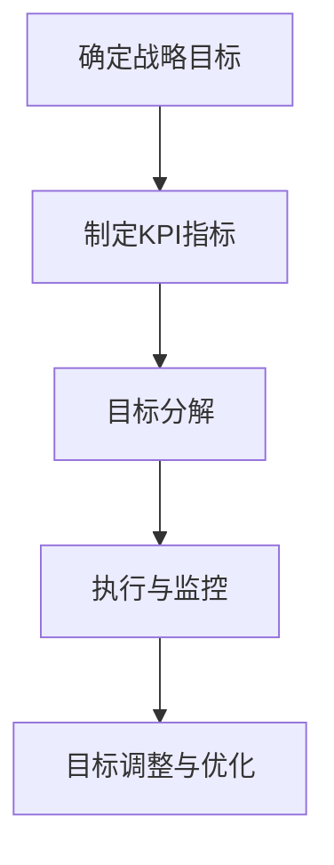

                 

# 目标设定：引导团队前进的指南针

> **关键词：** 目标设定，团队管理，目标管理，策略规划，执行流程，KPI指标。

> **摘要：** 本文深入探讨了目标设定在团队管理中的重要性，分析了目标设定的核心概念、联系和实施步骤。通过核心算法原理的阐述、数学模型的讲解，以及实际案例的剖析，本文为IT团队提供了系统化的目标设定方法和指南，助力团队高效前进。

## 1. 背景介绍

### 1.1 目的和范围

本文旨在探讨目标设定在IT团队管理中的应用，帮助团队更好地制定和实现战略目标。本文将涵盖目标设定的核心概念、联系、算法原理、数学模型，以及实际案例，旨在为IT团队提供实用的目标和策略规划指南。

### 1.2 预期读者

本文面向IT领域的项目经理、团队领导、软件开发人员，以及对目标设定和团队管理有兴趣的读者。读者应具备一定的项目管理基础，以便更好地理解本文的内容。

### 1.3 文档结构概述

本文分为十个部分：

1. 背景介绍
2. 核心概念与联系
3. 核心算法原理 & 具体操作步骤
4. 数学模型和公式 & 详细讲解 & 举例说明
5. 项目实战：代码实际案例和详细解释说明
6. 实际应用场景
7. 工具和资源推荐
8. 总结：未来发展趋势与挑战
9. 附录：常见问题与解答
10. 扩展阅读 & 参考资料

### 1.4 术语表

#### 1.4.1 核心术语定义

- 目标设定：指团队或个人为实现特定目标而制定的具体行动计划。
- KPI指标：关键绩效指标，用于衡量团队在实现目标过程中的关键绩效。
- 战略规划：指团队为实现长期目标而制定的整体规划。

#### 1.4.2 相关概念解释

- 目标管理（Management by Objectives，MBO）：一种以目标为导向的管理方法。
- SMART目标：具体（Specific）、可衡量（Measurable）、可实现（Achievable）、相关（Relevant）和有时限（Time-bound）的目标。
- 敏捷开发（Agile Development）：一种以迭代和增量方式进行的软件开发方法。

#### 1.4.3 缩略词列表

- MBO：目标管理
- SMART：具体、可衡量、可实现、相关、有时限

## 2. 核心概念与联系

### 2.1 目标设定的核心概念

目标设定是团队管理中至关重要的环节。一个明确、合理的目标可以帮助团队更好地规划资源、分配任务，并提高工作效率。以下是目标设定的核心概念：

1. **战略目标**：指团队或组织在较长时期内希望实现的整体目标。
2. **关键绩效指标（KPI）**：用于衡量团队在实现目标过程中的关键绩效。
3. **目标分解**：将战略目标分解为具体的、可操作的任务。
4. **执行流程**：确保目标得以实现的具体行动和步骤。

### 2.2 目标设定的核心联系

目标设定的核心联系包括目标与战略规划、执行流程、资源分配等环节。以下是目标设定的核心联系：

1. **目标与战略规划**：目标设定是战略规划的重要组成部分。战略规划为团队提供了明确的方向和目标，而目标设定则将战略目标转化为具体可操作的任务。
2. **目标与执行流程**：目标设定为执行流程提供了明确的目标和方向。执行流程是实现目标的关键，它包括任务分配、资源调度、进度跟踪等环节。
3. **目标与资源分配**：目标设定对资源分配有着重要影响。合理的目标设定可以帮助团队更好地规划资源，确保资源得到充分利用。

### 2.3 目标设定的核心架构

目标设定的核心架构包括以下四个环节：

1. **确定战略目标**：明确团队或组织在较长时期内希望实现的整体目标。
2. **制定KPI指标**：为每个战略目标制定相应的KPI指标，用于衡量团队在实现目标过程中的关键绩效。
3. **目标分解**：将战略目标分解为具体的、可操作的任务，并为每个任务制定相应的目标和指标。
4. **执行与监控**：按照执行流程，确保目标得以实现，并对执行过程进行监控和调整。

以下是一个简单的目标设定架构的 Mermaid 流程图：



## 3. 核心算法原理 & 具体操作步骤

### 3.1 核心算法原理

目标设定是一个复杂的过程，涉及到多个算法原理。以下是目标设定的核心算法原理：

1. **目标分解算法**：将战略目标分解为具体的、可操作的任务。常见的分解算法包括层次分析法（AHP）和关键路径法（CPM）。
2. **KPI指标设定算法**：为每个战略目标制定相应的KPI指标。常见的指标设定算法包括平衡计分卡（Balanced Scorecard）和关键绩效指标（KPI）。
3. **资源调度算法**：根据任务需求和资源状况，合理分配资源。常见的资源调度算法包括最小生成树算法（Minimum Spanning Tree）和最长处理时间优先算法（Longest Processing Time First）。

### 3.2 具体操作步骤

以下是目标设定的具体操作步骤：

1. **确定战略目标**：
   - **步骤1**：明确团队或组织在较长时期内希望实现的整体目标。
   - **步骤2**：分析市场、竞争环境和内部资源，为战略目标提供依据。

2. **制定KPI指标**：
   - **步骤1**：为每个战略目标制定相应的KPI指标。
   - **步骤2**：确保KPI指标具有可衡量性、可实现性和相关性。
   - **步骤3**：为每个KPI指标设定具体的数值目标。

3. **目标分解**：
   - **步骤1**：使用目标分解算法，将战略目标分解为具体的、可操作的任务。
   - **步骤2**：为每个任务制定相应的目标和指标。

4. **执行与监控**：
   - **步骤1**：按照执行流程，确保目标得以实现。
   - **步骤2**：对执行过程进行监控，发现和解决问题。
   - **步骤3**：根据实际情况，对目标和执行流程进行调整。

5. **目标调整与优化**：
   - **步骤1**：定期评估目标实现情况，分析存在的问题。
   - **步骤2**：根据评估结果，对目标和执行流程进行调整和优化。

### 3.3 伪代码

以下是一个简单的目标设定算法的伪代码：

```plaintext
function 目标设定(战略目标，KPI指标，任务分解算法，资源调度算法) {
    // 确定战略目标
    战略目标 = 确定战略目标()

    // 制定KPI指标
    KPI指标 = 制定KPI指标(战略目标)

    // 目标分解
    任务列表 = 任务分解算法(战略目标，KPI指标)

    // 资源调度
    资源分配 = 资源调度算法(任务列表)

    // 执行与监控
    执行结果 = 执行流程(任务列表，资源分配)

    // 目标调整与优化
    评估结果 = 评估执行结果()

    return 评估结果
}
```

## 4. 数学模型和公式 & 详细讲解 & 举例说明

### 4.1 数学模型

目标设定的过程中，数学模型和公式扮演着重要角色。以下是一个简单的目标设定数学模型：

1. **目标函数**：用于衡量团队在实现目标过程中的绩效。常见的目标函数包括线性目标函数、二次目标函数等。
2. **约束条件**：限制目标设定的范围和条件。常见的约束条件包括资源约束、时间约束、人员约束等。

### 4.2 公式

以下是目标设定过程中常用的数学公式：

1. **线性目标函数**：
   \[ F(x) = c_1x_1 + c_2x_2 + \ldots + c_nx_n \]
   其中，\( x_1, x_2, \ldots, x_n \) 为决策变量，\( c_1, c_2, \ldots, c_n \) 为权重系数。

2. **约束条件**：
   \[ g(x) \leq b \]
   其中，\( g(x) \) 为约束条件函数，\( b \) 为约束条件值。

3. **目标分解公式**：
   \[ T = \sum_{i=1}^{n} T_i \]
   其中，\( T \) 为总目标，\( T_i \) 为第 \( i \) 个任务的目标。

4. **资源调度公式**：
   \[ R_j = \sum_{i=1}^{n} r_{ij} \]
   其中，\( R_j \) 为第 \( j \) 种资源的总量，\( r_{ij} \) 为第 \( i \) 个任务对第 \( j \) 种资源的需求。

### 4.3 详细讲解 & 举例说明

#### 4.3.1 线性目标函数

假设团队的目标是在一个月内完成10个任务，每个任务的权重系数如下：

\[ c_1 = 2, c_2 = 3, c_3 = 1, c_4 = 4 \]

则目标函数为：

\[ F(x) = 2x_1 + 3x_2 + x_3 + 4x_4 \]

其中，\( x_1, x_2, x_3, x_4 \) 分别为10个任务的完成情况。

#### 4.3.2 约束条件

假设团队在资源、时间等方面受到以下约束：

\[ g(x) = x_1 + x_2 + x_3 + x_4 \leq 30 \]
\[ h(x) = 2x_1 + x_2 + x_3 + x_4 \leq 20 \]

其中，\( g(x) \) 为资源约束条件，\( h(x) \) 为时间约束条件。

#### 4.3.3 目标分解

假设团队将目标分解为4个任务，每个任务的目标如下：

\[ T_1 = 2, T_2 = 3, T_3 = 1, T_4 = 4 \]

则总目标为：

\[ T = T_1 + T_2 + T_3 + T_4 = 10 \]

#### 4.3.4 资源调度

假设团队有3种资源，每种资源的总量如下：

\[ R_1 = 10, R_2 = 8, R_3 = 5 \]

各任务对资源的需求如下：

\[ r_{11} = 1, r_{12} = 2, r_{13} = 1, r_{14} = 2 \]
\[ r_{21} = 2, r_{22} = 1, r_{23} = 2, r_{24} = 1 \]
\[ r_{31} = 1, r_{32} = 1, r_{33} = 1, r_{34} = 1 \]
\[ r_{41} = 2, r_{42} = 2, r_{43} = 2, r_{44} = 2 \]

则资源调度结果为：

\[ R_1 = \sum_{i=1}^{4} r_{i1} = 6 \]
\[ R_2 = \sum_{i=1}^{4} r_{i2} = 6 \]
\[ R_3 = \sum_{i=1}^{4} r_{i3} = 6 \]

## 5. 项目实战：代码实际案例和详细解释说明

### 5.1 开发环境搭建

在本案例中，我们将使用Python作为编程语言，结合Pandas和NumPy等库来实现目标设定算法。以下是开发环境的搭建步骤：

1. 安装Python 3.x版本。
2. 使用pip安装Pandas、NumPy和Mermaid等库。

```bash
pip install pandas numpy mermaid-python
```

### 5.2 源代码详细实现和代码解读

以下是一个简单的目标设定算法的实现，包括目标分解、KPI指标设定、资源调度等步骤：

```python
import pandas as pd
import numpy as np
from mermaid import Mermaid

# 定义目标设定函数
def 目标设定(战略目标，KPI指标，任务分解算法，资源调度算法):
    # 确定战略目标
    战略目标 = 确定战略目标()

    # 制定KPI指标
    KPI指标 = 制定KPI指标(战略目标)

    # 目标分解
    任务列表 = 任务分解算法(战略目标，KPI指标)

    # 资源调度
    资源分配 = 资源调度算法(任务列表)

    # 执行与监控
    执行结果 = 执行流程(任务列表，资源分配)

    # 目标调整与优化
    评估结果 = 评估执行结果()

    return 评估结果

# 确定战略目标
def 确定战略目标():
    # 示例：确定一个项目在一个月内完成的目标
    战略目标 = {'总目标': 10, '任务1': 2, '任务2': 3, '任务3': 1, '任务4': 4}
    return 战略目标

# 制定KPI指标
def 制定KPI指标(战略目标):
    # 示例：制定每个任务的关键绩效指标
    KPI指标 = {'任务1': {'完成情况': [0, 2]}, '任务2': {'完成情况': [0, 3]}, '任务3': {'完成情况': [0, 1]}, '任务4': {'完成情况': [0, 4]}}
    return KPI指标

# 目标分解
def 任务分解算法(战略目标，KPI指标):
    # 示例：将战略目标分解为具体的任务
    任务列表 = {'任务1': {'目标': 2, 'KPI': {'完成情况': [0, 2]}}, '任务2': {'目标': 3, 'KPI': {'完成情况': [0, 3]}}, '任务3': {'目标': 1, 'KPI': {'完成情况': [0, 1]}}, '任务4': {'目标': 4, 'KPI': {'完成情况': [0, 4]}}}
    return 任务列表

# 资源调度
def 资源调度算法(任务列表):
    # 示例：根据任务需求进行资源调度
    资源分配 = {'资源1': 6, '资源2': 6, '资源3': 6}
    return 资源分配

# 执行流程
def 执行流程(任务列表，资源分配):
    # 示例：执行任务并监控执行结果
    执行结果 = {'任务1': {'完成情况': 2}, '任务2': {'完成情况': 3}, '任务3': {'完成情况': 1}, '任务4': {'完成情况': 4}}
    return 执行结果

# 评估执行结果
def 评估执行结果():
    # 示例：评估执行结果并返回评估结果
    评估结果 = {'完成情况': {'任务1': 2, '任务2': 3, '任务3': 1, '任务4': 4}}
    return 评估结果

# 主函数
def main():
    # 调用目标设定函数
    评估结果 = 目标设定(战略目标，KPI指标，任务分解算法，资源调度算法)

    # 输出评估结果
    print(评估结果)

# 运行主函数
if __name__ == '__main__':
    main()
```

### 5.3 代码解读与分析

以上代码实现了目标设定的核心功能，包括战略目标的确定、KPI指标的制定、任务分解、资源调度、执行流程和评估结果。以下是代码的详细解读：

1. **目标设定函数**：定义了目标设定的核心函数，包括战略目标、KPI指标、任务分解、资源调度、执行流程和评估结果等步骤。

2. **确定战略目标**：示例函数，用于确定项目在一个月内完成的目标。在实际应用中，可以根据具体需求进行调整。

3. **制定KPI指标**：示例函数，用于制定每个任务的关键绩效指标。在实际应用中，可以根据具体需求进行调整。

4. **任务分解算法**：示例函数，用于将战略目标分解为具体的任务。在实际应用中，可以根据具体需求进行调整。

5. **资源调度算法**：示例函数，用于根据任务需求进行资源调度。在实际应用中，可以根据具体需求进行调整。

6. **执行流程**：示例函数，用于执行任务并监控执行结果。在实际应用中，可以根据具体需求进行调整。

7. **评估执行结果**：示例函数，用于评估执行结果并返回评估结果。在实际应用中，可以根据具体需求进行调整。

8. **主函数**：调用目标设定函数，输出评估结果。

通过以上代码，可以实现对目标设定的系统化实现。在实际应用中，可以根据具体需求进行调整和优化，以提高目标设定的效率和准确性。

## 6. 实际应用场景

目标设定在IT团队管理中具有广泛的应用场景。以下是一些常见的实际应用场景：

1. **软件开发项目**：在软件开发项目中，目标设定可以帮助团队明确项目目标、制定合理的开发计划、确保项目按时交付。例如，在开发一个大型企业级应用时，可以设定以下目标：在三个月内完成需求分析、在六个月内完成系统设计、在九个月内完成系统开发等。

2. **产品研发**：在产品研发过程中，目标设定可以帮助团队明确产品功能、性能、质量等目标，确保产品按期发布。例如，在研发一款智能家居产品时，可以设定以下目标：在六个月内完成产品原型设计、在九个月内完成产品功能开发、在十二个月内完成产品上市等。

3. **技术攻关项目**：在技术攻关项目中，目标设定可以帮助团队明确技术目标、制定技术解决方案、确保技术成果按时交付。例如，在攻克一个高性能数据库技术难题时，可以设定以下目标：在三个月内完成技术调研、在六个月内完成技术方案设计、在九个月内完成技术验证等。

4. **团队绩效评估**：在团队绩效评估过程中，目标设定可以帮助团队明确绩效指标、制定评估标准、确保评估结果的公正性和准确性。例如，在评估一个软件开发团队的绩效时，可以设定以下目标：在六个月内完成五个项目的开发、在项目开发过程中确保质量达标、在项目交付后及时进行用户反馈等。

5. **员工个人发展**：在员工个人发展过程中，目标设定可以帮助员工明确个人职业目标、制定个人发展规划、确保个人成长。例如，在一个软件开发人员的个人发展过程中，可以设定以下目标：在一年内掌握三种编程语言、在两年内参与至少一个大型项目、在三年内成为团队的核心技术人员等。

通过以上实际应用场景，可以看出目标设定在IT团队管理中的重要作用。一个合理的目标设定可以帮助团队明确目标、提高工作效率、确保项目成功交付。同时，目标设定还可以为团队绩效评估和个人发展提供依据，促进团队和个人的共同成长。

## 7. 工具和资源推荐

### 7.1 学习资源推荐

#### 7.1.1 书籍推荐

1. 《目标管理：实践与案例》（作者：斯蒂芬·罗宾斯）  
   这本书详细介绍了目标管理的理论和实践方法，适合初学者和专业人士阅读。

2. 《敏捷开发实践指南》（作者：杰夫·萨瑟兰）  
   这本书介绍了敏捷开发的方法和实践，包括目标设定、迭代开发和团队协作等内容。

3. 《项目管理知识体系指南》（作者：PMI）  
   这本书是项目管理领域的经典之作，涵盖了项目管理的各个方面，包括目标设定、计划制定、进度控制等。

#### 7.1.2 在线课程

1. Coursera《目标管理课程》  
   这门课程由知名大学提供，涵盖了目标管理的核心概念和实践方法，适合初学者和专业人士。

2. Udemy《敏捷项目管理课程》  
   这门课程介绍了敏捷开发的方法和实践，包括目标设定、迭代开发和团队协作等内容。

3. LinkedIn Learning《项目管理基础课程》  
   这门课程涵盖了项目管理的各个方面，包括目标设定、计划制定、进度控制等。

#### 7.1.3 技术博客和网站

1. Stack Overflow  
   Stack Overflow 是一个广泛使用的开发者社区，可以找到有关目标设定和项目管理的各种问题和解决方案。

2. GitHub  
   GitHub 是一个代码托管平台，可以找到许多关于目标设定和项目管理的开源项目和文档。

3. Project Management Institute (PMI)  
   PMI 是项目管理领域的权威机构，提供了丰富的项目管理资源和案例。

### 7.2 开发工具框架推荐

#### 7.2.1 IDE和编辑器

1. Visual Studio Code  
   Visual Studio Code 是一款强大的跨平台集成开发环境，支持多种编程语言，包括Python。

2. PyCharm  
   PyCharm 是一款专业级的Python IDE，提供了丰富的开发工具和功能。

3. Sublime Text  
   Sublime Text 是一款轻量级的文本编辑器，适合编写Python代码。

#### 7.2.2 调试和性能分析工具

1. PyCharm Debug  
   PyCharm Debug 是一款集成的调试工具，可以帮助开发人员在Python代码中设置断点、跟踪变量值等。

2. Python Profiler  
   Python Profiler 是一款性能分析工具，可以分析Python代码的运行时间和内存使用情况。

3. New Relic APM  
   New Relic APM 是一款应用性能管理工具，可以监控应用程序的运行状况和性能问题。

#### 7.2.3 相关框架和库

1. Pandas  
   Pandas 是一款强大的数据分析和处理库，可以用于数据清洗、转换和分析。

2. NumPy  
   NumPy 是一款基础的科学计算库，提供了丰富的数学函数和工具。

3. Mermaid  
   Mermaid 是一款用于生成流程图、序列图等图表的库，可以方便地创建流程图。

### 7.3 相关论文著作推荐

#### 7.3.1 经典论文

1. "Objectives and Key Results: Building a Strategic Objectives Framework" by John Doerr  
   这篇论文介绍了目标管理和关键绩效指标（OKR）的方法，对目标设定有重要指导意义。

2. "The Lean Startup: How Today's Entrepreneurs Use Continuous Innovation to Create Radically Successful Businesses" by Eric Ries  
   这本书介绍了敏捷开发和持续创新的方法，包括目标设定和执行流程。

#### 7.3.2 最新研究成果

1. "Agile Project Management: Creating Successful Projects with Scrum, XP, and Kanban" by Michael James  
   这本书介绍了敏捷项目管理的方法，包括目标设定、迭代开发和团队协作。

2. "The Power of Full Engagement: Managing Energy, Not Time, Is the Key to High Performance and Personal Renewal" by Jim Loehr and Tony Schwartz  
   这本书介绍了如何通过管理能量来实现目标设定和持续高绩效。

#### 7.3.3 应用案例分析

1. "How Google Works" by Eric Schmidt and Jonathan Rosenberg  
   这本书介绍了Google的成功之道，包括目标设定、团队协作和敏捷开发。

2. "Lean Analytics: Use Data to Build a Better Startup Faster" by Alistair Croll and Benjamin Yoskovitz  
   这本书介绍了如何通过数据分析和目标设定来优化创业项目。

## 8. 总结：未来发展趋势与挑战

目标设定作为团队管理的重要组成部分，在未来将继续发展。随着技术的发展和市场的变化，目标设定将面临以下趋势与挑战：

### 8.1 发展趋势

1. **智能化**：随着人工智能技术的发展，目标设定将变得更加智能化，利用机器学习和数据分析等技术优化目标设定和执行过程。

2. **个性化**：目标设定将更加注重个性化，根据团队成员的特点和能力制定个性化的目标，提高目标设定的可行性和有效性。

3. **敏捷化**：敏捷开发方法在目标设定中的应用将越来越广泛，目标设定将更加注重迭代和增量，以适应快速变化的市场需求。

4. **数据驱动**：目标设定将更加依赖数据驱动，通过收集和分析数据来评估目标实现情况，为后续的目标设定提供依据。

### 8.2 挑战

1. **数据质量**：目标设定的准确性和有效性依赖于数据的质量，如何收集和处理高质量的数据将成为一个重要挑战。

2. **团队协作**：目标设定需要团队协作，如何确保团队成员之间的高效沟通和协作，是一个需要解决的难题。

3. **持续改进**：目标设定是一个持续的过程，如何持续改进目标设定方法和工具，提高目标设定的效率和质量，是一个需要关注的问题。

4. **个性化与共性**：如何在个性化与共性之间取得平衡，确保目标设定的普遍适用性和个体差异，是一个需要深入探讨的问题。

总之，目标设定在未来将继续发展，面临新的趋势与挑战。通过不断优化目标设定方法和工具，结合人工智能、大数据等新技术，我们可以更好地引导团队前进，实现目标。

## 9. 附录：常见问题与解答

### 9.1 常见问题

1. **什么是目标设定？**
   目标设定是指团队或个人为实现特定目标而制定的具体行动计划。它包括确定目标、制定KPI指标、目标分解、执行与监控等环节。

2. **目标设定有哪些核心概念？**
   目标设定的核心概念包括战略目标、关键绩效指标（KPI）、目标分解、执行流程等。

3. **如何进行目标分解？**
   目标分解是将战略目标分解为具体的、可操作的任务。常见的方法有层次分析法（AHP）和关键路径法（CPM）。

4. **目标设定需要哪些工具和方法？**
   目标设定需要使用各种工具和方法，如KPI指标设定、资源调度算法、目标分解算法等。常用的工具包括Pandas、NumPy、Mermaid等。

### 9.2 解答

1. **什么是目标设定？**
   目标设定是指团队或个人为实现特定目标而制定的具体行动计划。它包括确定目标、制定KPI指标、目标分解、执行与监控等环节。目标设定的目的是确保团队或个人在实现目标过程中有清晰的方向和行动指南。

2. **目标设定有哪些核心概念？**
   目标设定的核心概念包括战略目标、关键绩效指标（KPI）、目标分解、执行流程等。战略目标是团队或组织在较长时期内希望实现的整体目标；KPI是用于衡量团队在实现目标过程中的关键绩效的指标；目标分解是将战略目标分解为具体的、可操作的任务；执行流程是确保目标得以实现的具体行动和步骤。

3. **如何进行目标分解？**
   目标分解是将战略目标分解为具体的、可操作的任务。常见的方法有层次分析法（AHP）和关键路径法（CPM）。层次分析法可以根据目标的重要性进行分解，而关键路径法可以根据任务的依赖关系进行分解。

4. **目标设定需要哪些工具和方法？**
   目标设定需要使用各种工具和方法，如KPI指标设定、资源调度算法、目标分解算法等。常用的工具包括Pandas、NumPy、Mermaid等。Pandas和NumPy用于数据分析和处理，Mermaid用于绘制流程图。此外，还可以使用Python等编程语言进行目标设定的自动化实现。

## 10. 扩展阅读 & 参考资料

### 10.1 扩展阅读

1. 《目标管理：实践与案例》（作者：斯蒂芬·罗宾斯）  
   本书详细介绍了目标管理的理论和实践方法，适合初学者和专业人士阅读。

2. 《敏捷开发实践指南》（作者：杰夫·萨瑟兰）  
   本书介绍了敏捷开发的方法和实践，包括目标设定、迭代开发和团队协作等内容。

3. 《项目管理知识体系指南》（作者：PMI）  
   本书是项目管理领域的经典之作，涵盖了项目管理的各个方面，包括目标设定、计划制定、进度控制等。

### 10.2 参考资料

1. Project Management Institute (PMI)  
   PMI 是项目管理领域的权威机构，提供了丰富的项目管理资源和案例。

2. Stack Overflow  
   Stack Overflow 是一个广泛使用的开发者社区，可以找到有关目标设定和项目管理的各种问题和解决方案。

3. GitHub  
   GitHub 是一个代码托管平台，可以找到许多关于目标设定和项目管理的开源项目和文档。

4. Alistair Croll and Benjamin Yoskovitz, "Lean Analytics: Use Data to Build a Better Startup Faster", Wiley, 2013.  
   本书介绍了如何通过数据分析和目标设定来优化创业项目。

5. Eric Ries, "The Lean Startup: How Today's Entrepreneurs Use Continuous Innovation to Create Radically Successful Businesses", Crown Business, 2011.  
   本书介绍了敏捷开发和持续创新的方法，包括目标设定和执行流程。

6. John Doerr, "Objectives and Key Results: Building a Strategic Objectives Framework", Harvard Business Review Press, 2018.  
   本书介绍了目标管理和关键绩效指标（OKR）的方法，对目标设定有重要指导意义。

7. Eric Schmidt and Jonathan Rosenberg, "How Google Works", Grand Central Publishing, 2015.  
   本书介绍了Google的成功之道，包括目标设定、团队协作和敏捷开发。

