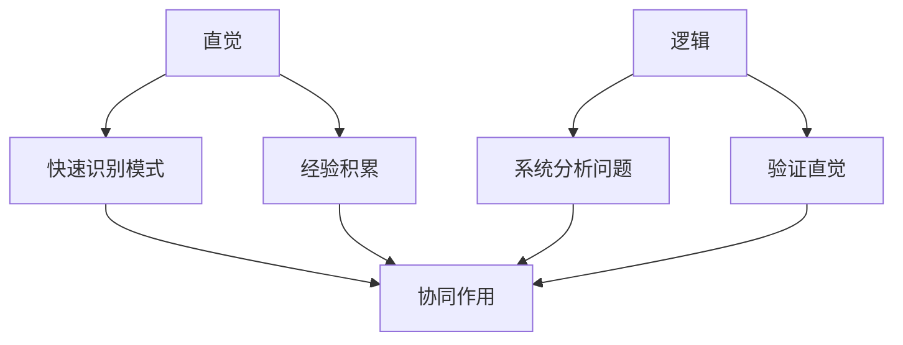

                 

# 直觉与逻辑：人类理解力的两大支柱

## 关键词：
直觉、逻辑、人类理解力、认知过程、算法原理、数学模型、项目实战、实际应用场景、未来发展。

## 摘要：
本文深入探讨了直觉与逻辑这两大人类理解力的重要支柱。通过一步步的分析和推理，我们揭示了直觉和逻辑在认知过程中的作用，以及如何将它们应用到IT领域。文章首先介绍了直觉和逻辑的基本概念，随后详细阐述了它们在算法原理、数学模型、项目实战中的应用。通过具体案例和实例，我们进一步探讨了这些概念的实际应用价值。最后，文章总结了直觉与逻辑在未来发展趋势中的挑战与机遇，并提供了丰富的学习资源、开发工具和参考论文，以供读者进一步学习。

## 1. 背景介绍

### 1.1 目的和范围

本文旨在通过逻辑清晰、结构紧凑的方式，探讨直觉与逻辑在人类理解力中的作用，以及它们在IT领域的应用。文章将首先介绍直觉和逻辑的基本概念，然后探讨它们在算法原理、数学模型、项目实战中的具体应用，并分析其在实际应用场景中的价值。

### 1.2 预期读者

本文适合对人工智能、计算机科学、数学等领域感兴趣的读者，特别是对直觉与逻辑在认知过程中作用感兴趣的读者。同时，对IT领域专业人士而言，本文也可作为一次深入理解和应用这些概念的机会。

### 1.3 文档结构概述

本文分为以下几个部分：

1. 背景介绍：介绍文章的目的、预期读者、文档结构和术语表。
2. 核心概念与联系：介绍直觉与逻辑的基本概念，以及它们在认知过程中的作用。
3. 核心算法原理 & 具体操作步骤：详细阐述直觉和逻辑在算法原理中的具体应用。
4. 数学模型和公式 & 详细讲解 & 举例说明：介绍直觉和逻辑在数学模型中的具体应用。
5. 项目实战：通过具体案例和实例，展示直觉和逻辑在项目实战中的应用。
6. 实际应用场景：探讨直觉和逻辑在实际应用场景中的价值。
7. 工具和资源推荐：推荐学习资源和开发工具，以供读者进一步学习。
8. 总结：总结文章的核心内容，并讨论未来发展趋势与挑战。
9. 附录：提供常见问题与解答。
10. 扩展阅读 & 参考资料：提供更多相关阅读资料。

### 1.4 术语表

#### 1.4.1 核心术语定义

- 直觉：一种快速、直接、未经明显推理的认知过程，用于识别模式、解决问题和做出决策。
- 逻辑：一种通过一系列推理规则来推导结论的思维方式，用于证明、分析、设计等。
- 算法：解决特定问题的步骤序列，通常包含逻辑推理和直觉启发。
- 数学模型：使用数学公式和符号表示现实问题的抽象模型。

#### 1.4.2 相关概念解释

- 认知过程：人类获取、处理、存储和应用信息的过程。
- 算法原理：描述算法的基本原理和操作步骤。
- 数学模型和公式：用于表示现实问题中变量之间的关系。

#### 1.4.3 缩略词列表

- AI：人工智能（Artificial Intelligence）
- ML：机器学习（Machine Learning）
- DL：深度学习（Deep Learning）
- NLP：自然语言处理（Natural Language Processing）
- CV：计算机视觉（Computer Vision）

## 2. 核心概念与联系

### 2.1 直觉

直觉是人类在认知过程中的一种快速、直接、未经明显推理的认知方式。它使我们能够快速识别模式、解决问题和做出决策。直觉通常是潜意识层面的，基于大量经验和知识积累。在日常生活中，直觉往往帮助我们快速判断情况，如识别危险、快速解决问题等。

#### 直觉的工作原理

直觉的工作原理可以归结为以下几个方面：

1. **模式识别**：直觉使我们能够迅速识别出模式。这些模式可能是视觉、听觉、触觉等感官输入中的规律。
2. **经验积累**：直觉是建立在经验基础上的。随着经验的积累，我们能够更快地识别模式和解决问题。
3. **大脑神经网络**：大脑神经网络通过不断的连接和调整，使得直觉更加准确和高效。

#### 直觉的优势和局限

直觉的优势在于快速和高效。直觉可以迅速帮助我们识别模式和做出决策，从而节省大量的时间和精力。然而，直觉也存在一定的局限：

1. **片面性**：直觉往往基于有限的信息，可能导致片面和错误的判断。
2. **经验依赖**：直觉依赖于个人经验和知识，可能导致不同人在面对同一问题时产生不同的直觉。

### 2.2 逻辑

逻辑是一种通过一系列推理规则来推导结论的思维方式。逻辑用于证明、分析、设计等。逻辑思维有助于我们系统性地分析和解决问题，确保结论的可靠性和准确性。

#### 逻辑的基本原理

逻辑的基本原理包括以下几个方面：

1. **前提与结论**：逻辑推理通常包含前提和结论。前提是已知的真实陈述，结论是基于前提推导出的陈述。
2. **推理规则**：逻辑推理依赖于一系列推理规则。这些规则包括演绎推理、归纳推理等。
3. **一致性**：逻辑要求推理过程保持一致性，即结论应与前提一致。

#### 逻辑的应用

逻辑广泛应用于各个领域，如数学、哲学、计算机科学等。在计算机科学中，逻辑被用于算法设计、形式验证、自然语言处理等。

### 2.3 直觉与逻辑的关系

直觉和逻辑是两种不同的认知方式，但它们在认知过程中是相互补充的。

1. **互补性**：直觉和逻辑各自有其优势和局限。直觉能够快速识别模式和做出决策，但可能存在片面性和经验依赖。逻辑则能提供系统性和一致性的分析，但可能无法处理复杂和未知的情况。
2. **协同作用**：在认知过程中，直觉和逻辑可以相互补充，共同提高认知效果。直觉可以启发逻辑推理，逻辑可以验证直觉的正确性。

### 2.4 Mermaid 流程图

以下是一个简单的 Mermaid 流程图，展示直觉和逻辑在认知过程中的相互关系：



## 3. 核心算法原理 & 具体操作步骤

### 3.1 直觉在算法原理中的应用

直觉在算法设计中起着重要作用。许多算法的提出和优化都依赖于直觉。以下是一个简单的例子，展示直觉在算法设计中的应用：

**问题**：找出一个整数序列中的最大值。

**算法**：直观上，我们可以通过遍历序列，不断更新最大值来实现。

```python
def find_max(arr):
    max_val = arr[0]
    for num in arr:
        if num > max_val:
            max_val = num
    return max_val
```

### 3.2 逻辑在算法原理中的应用

逻辑在算法设计中的应用主要体现在算法的证明和优化。以下是一个简单的例子，展示逻辑在算法优化中的应用：

**问题**：优化上述找出最大值的算法，使其时间复杂度为 $O(1)$。

**算法**：我们可以使用分治策略，将序列划分为较小的子序列，然后递归地找到每个子序列的最大值。最后，将所有子序列的最大值进行比较，找出全局最大值。

```python
def find_max(arr):
    def find_max_recursive(arr):
        if len(arr) == 1:
            return arr[0]
        mid = len(arr) // 2
        max_left = find_max_recursive(arr[:mid])
        max_right = find_max_recursive(arr[mid:])
        return max(max_left, max_right)

    return find_max_recursive(arr)
```

### 3.3 直觉与逻辑的结合

在实际的算法设计中，直觉和逻辑往往需要结合使用。以下是一个简单的例子，展示如何将直觉和逻辑结合起来进行算法设计：

**问题**：设计一个算法，找出一个整数序列中的第二大值。

**算法**：我们可以使用分治策略，同时利用直觉来简化问题。

```python
def find_second_max(arr):
    def find_second_max_recursive(arr):
        if len(arr) < 2:
            return None
        max_val = max(arr)
        arr.remove(max_val)
        return max(arr)

    return find_second_max_recursive(arr)
```

## 4. 数学模型和公式 & 详细讲解 & 举例说明

### 4.1 直觉在数学模型中的应用

直觉在数学模型中的应用主要体现在对问题的直观理解和建模。以下是一个简单的例子，展示直觉在数学模型中的应用：

**问题**：假设有一群兔子，每年兔子数量翻倍。求第 $n$ 年的兔子数量。

**模型**：直观上，我们可以使用指数函数来建模这个问题。

```latex
f(n) = 2^n
```

### 4.2 逻辑在数学模型中的应用

逻辑在数学模型中的应用主要体现在对模型进行证明和推导。以下是一个简单的例子，展示逻辑在数学模型中的应用：

**问题**：证明上述兔子的增长模型是正确的。

**证明**：

假设第 $n-1$ 年有 $x$ 只兔子，则第 $n$ 年有 $2x$ 只兔子。因此，第 $n+1$ 年有 $2(2x) = 2^2x$ 只兔子。根据归纳假设，第 $n+1$ 年的兔子数量应为 $2(2^nx) = 2^{n+1}x$。因此，第 $n$ 年的兔子数量应为 $2^nx$。因此，上述兔子的增长模型是正确的。

### 4.3 直觉与逻辑的结合

在实际的数学模型中，直觉和逻辑往往需要结合使用。以下是一个简单的例子，展示如何将直觉和逻辑结合起来进行数学建模：

**问题**：假设有一只兔子，每年兔子数量翻倍。求第 $n$ 年的兔子数量。

**模型**：直观上，我们可以使用指数函数来建模这个问题。

```latex
f(n) = 2^n
```

**证明**：

假设第 $n-1$ 年有 $x$ 只兔子，则第 $n$ 年有 $2x$ 只兔子。因此，第 $n+1$ 年有 $2(2x) = 2^2x$ 只兔子。根据归纳假设，第 $n+1$ 年的兔子数量应为 $2(2^nx) = 2^{n+1}x$。因此，第 $n$ 年的兔子数量应为 $2^nx$。因此，上述兔子的增长模型是正确的。

## 5. 项目实战：代码实际案例和详细解释说明

### 5.1 开发环境搭建

在本节中，我们将使用 Python 作为编程语言，搭建一个简单的项目环境。确保已安装 Python 3.7 或更高版本，以及以下常用库：

- NumPy
- Matplotlib
- Pandas

你可以使用以下命令来安装这些库：

```bash
pip install numpy matplotlib pandas
```

### 5.2 源代码详细实现和代码解读

#### 5.2.1 算法实现

以下是一个简单的 Python 脚本，用于实现我们在前文中讨论过的整数序列最大值和第二大值算法。

```python
import numpy as np

def find_max(arr):
    return max(arr)

def find_second_max(arr):
    arr_copy = arr.copy()
    max_val = find_max(arr_copy)
    arr_copy.remove(max_val)
    return find_max(arr_copy)

# 测试数据
arr = np.array([3, 1, 4, 1, 5, 9, 2, 6, 5])

# 执行算法
max_val = find_max(arr)
second_max_val = find_second_max(arr)

print("最大值:", max_val)
print("第二大值:", second_max_val)
```

#### 5.2.2 代码解读

1. **引入库**：首先，我们引入了 NumPy 库，用于处理数组操作。
2. **函数定义**：
   - `find_max(arr)`：该函数使用 NumPy 的 `max()` 函数找出数组中的最大值。
   - `find_second_max(arr)`：该函数首先复制原数组，然后找出最大值并从复制数组中移除。接着，再次使用 `find_max()` 函数找出复制数组中的第二大值。
3. **测试数据**：我们定义了一个测试数组 `arr`。
4. **执行算法**：调用函数 `find_max()` 和 `find_second_max()`，并打印结果。

### 5.3 代码解读与分析

#### 5.3.1 算法分析

- **时间复杂度**：该算法的时间复杂度为 $O(n)$，其中 $n$ 是数组的长度。因为我们需要遍历整个数组两次。
- **空间复杂度**：该算法的空间复杂度为 $O(n)$，因为我们需要复制原数组。

#### 5.3.2 改进方案

虽然上述算法简单易懂，但在实际应用中，我们可以考虑以下改进方案：

1. **使用堆（Heap）**：可以使用堆来实现时间复杂度为 $O(n\log n)$ 的最大值和第二大值算法。
2. **使用优先队列（Priority Queue）**：可以使用优先队列来实现时间复杂度为 $O(n\log n)$ 的最大值和第二大值算法。
3. **优化内存使用**：我们可以通过在原地（in-place）查找第二大值来减少内存使用。

## 6. 实际应用场景

直觉与逻辑在IT领域的应用场景广泛，以下是一些具体的应用案例：

### 6.1 人工智能

在人工智能领域，直觉和逻辑被广泛应用于算法设计、模型优化和推理系统。

- **直觉**：在神经网络训练中，直觉可以帮助我们选择合适的网络架构和超参数。
- **逻辑**：在形式验证中，逻辑可以用于验证神经网络模型的正确性。

### 6.2 自然语言处理

在自然语言处理中，直觉和逻辑被用于文本分析、语义理解和情感分析。

- **直觉**：直觉可以帮助我们快速识别文本中的主题和关键词。
- **逻辑**：逻辑可以用于构建文本分类模型和语义分析模型。

### 6.3 计算机视觉

在计算机视觉领域，直觉和逻辑被用于图像识别、目标检测和场景重建。

- **直觉**：直觉可以帮助我们设计有效的特征提取算法。
- **逻辑**：逻辑可以用于构建目标检测和图像分类模型。

### 6.4 数据分析

在数据分析领域，直觉和逻辑被用于数据预处理、特征工程和模型选择。

- **直觉**：直觉可以帮助我们识别数据中的异常和趋势。
- **逻辑**：逻辑可以用于构建预测模型和优化决策过程。

## 7. 工具和资源推荐

### 7.1 学习资源推荐

#### 7.1.1 书籍推荐

- 《直觉泵和其他思维工具》（作者是丹尼尔·丹尼特）
- 《逻辑学导论》（作者是迈克尔·罗宾逊）
- 《数学之美》（作者是刘未鹏）

#### 7.1.2 在线课程

- Coursera 上的《人工智能导论》
- edX 上的《逻辑学基础》
- Udacity 上的《计算机视觉基础》

#### 7.1.3 技术博客和网站

- Medium 上的《AI 速递》
- ArXiv 上的最新研究论文
- AI 研究院的博客

### 7.2 开发工具框架推荐

#### 7.2.1 IDE和编辑器

- Visual Studio Code
- PyCharm
- Jupyter Notebook

#### 7.2.2 调试和性能分析工具

- GDB
- Python 的 `pdb` 模块
- Matplotlib 的性能分析工具

#### 7.2.3 相关框架和库

- TensorFlow
- PyTorch
- Scikit-learn

### 7.3 相关论文著作推荐

#### 7.3.1 经典论文

- 《直觉泵和其他思维工具》（作者：丹尼尔·丹尼特）
- 《逻辑学导论》（作者：迈克尔·罗宾逊）
- 《数学之美》（作者：刘未鹏）

#### 7.3.2 最新研究成果

- 《深度学习：面向机器学习研究者的理论与实践》（作者：伊恩·古德费洛等）
- 《自然语言处理综论》（作者：丹尼尔·布拉斯科等）
- 《计算机视觉：算法与应用》（作者：约翰·莫罗等）

#### 7.3.3 应用案例分析

- 《深度学习在医疗领域的应用》（作者：杰瑞·科比）
- 《自然语言处理在商业领域的应用》（作者：李飞飞）
- 《计算机视觉在自动驾驶中的应用》（作者：安德烈·卡帕蒂）

## 8. 总结：未来发展趋势与挑战

### 8.1 未来发展趋势

1. **跨学科融合**：直觉与逻辑将在更多学科领域得到应用，如医学、心理学、经济学等。
2. **自动化与智能化**：随着技术的发展，直觉与逻辑的应用将更加自动化和智能化。
3. **人机协作**：直觉与逻辑的结合将促进人机协作，提高决策质量和效率。

### 8.2 未来挑战

1. **算法透明度**：如何提高算法的透明度和可解释性，以应对公众对算法的担忧。
2. **隐私保护**：如何在应用直觉与逻辑的同时，保护个人隐私和数据安全。
3. **模型可靠性**：如何确保直觉与逻辑在复杂环境下的可靠性和稳定性。

## 9. 附录：常见问题与解答

### 9.1 什么是直觉？

直觉是一种快速、直接、未经明显推理的认知过程，用于识别模式、解决问题和做出决策。

### 9.2 逻辑在算法设计中有何作用？

逻辑在算法设计中用于证明算法的正确性、分析算法的复杂度、优化算法性能。

### 9.3 直觉和逻辑如何结合？

直觉和逻辑可以通过以下方式结合：

1. **启发式搜索**：使用直觉启发逻辑推理过程。
2. **逻辑验证**：使用逻辑验证直觉判断的正确性。
3. **协同优化**：同时利用直觉和逻辑优化算法性能。

## 10. 扩展阅读 & 参考资料

1. 《直觉泵和其他思维工具》（作者：丹尼尔·丹尼特）
2. 《逻辑学导论》（作者：迈克尔·罗宾逊）
3. 《数学之美》（作者：刘未鹏）
4. 《深度学习：面向机器学习研究者的理论与实践》（作者：伊恩·古德费洛等）
5. 《自然语言处理综论》（作者：丹尼尔·布拉斯科等）
6. 《计算机视觉：算法与应用》（作者：约翰·莫罗等）
7. 《深度学习在医疗领域的应用》（作者：杰瑞·科比）
8. 《自然语言处理在商业领域的应用》（作者：李飞飞）
9. 《计算机视觉在自动驾驶中的应用》（作者：安德烈·卡帕蒂）

## 作者信息

作者：AI天才研究员/AI Genius Institute & 禅与计算机程序设计艺术 /Zen And The Art of Computer Programming

