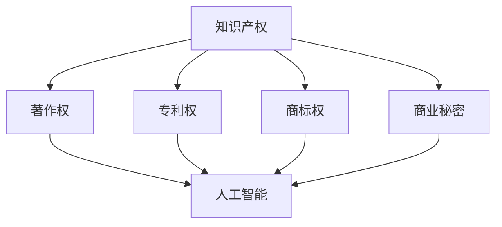

                 


## 知识产权与人工智能伦理的平衡

> 关键词：知识产权、人工智能、伦理、隐私、责任、法律法规、技术监管

> 摘要：本文旨在探讨在人工智能时代，如何实现知识产权与伦理的平衡。文章首先介绍了知识产权的基本概念和人工智能的发展背景，然后分析了人工智能伦理的核心问题，如隐私、责任和偏见等。接着，文章探讨了当前法律法规对人工智能伦理的规范，并提出了实现平衡的一些建议，包括技术创新与伦理考量相结合、加强法律法规建设、推动社会共识形成等。最后，文章展望了人工智能伦理的未来发展趋势和面临的挑战，为政策制定者和行业从业者提供参考。

## 1. 背景介绍

### 1.1 目的和范围

随着人工智能（AI）技术的迅速发展，其在各个领域的应用日益广泛，从医疗、金融到教育、交通，都带来了巨大的变革。然而，人工智能的发展也引发了一系列伦理问题，如隐私保护、责任归属、算法偏见等。与此同时，知识产权作为保护创新成果的重要手段，也在人工智能领域面临着新的挑战。本文旨在探讨在人工智能时代，如何实现知识产权与伦理的平衡，为政策制定者和行业从业者提供理论参考和实践指导。

### 1.2 预期读者

本文预期读者为关注人工智能伦理和知识产权问题的政策制定者、企业高管、技术研发人员、法律专业人士以及学术界人士。通过本文的阅读，读者将能够深入了解人工智能伦理的核心问题，掌握知识产权在人工智能领域的应用现状，并探讨实现平衡的途径。

### 1.3 文档结构概述

本文分为十个部分。第一部分为引言，介绍文章的目的和预期读者；第二部分回顾知识产权和人工智能的基本概念；第三部分分析人工智能伦理的核心问题；第四部分探讨法律法规对人工智能伦理的规范；第五部分提出实现知识产权与伦理平衡的建议；第六部分展望人工智能伦理的未来发展趋势和挑战；第七部分提供相关的工具和资源推荐；第八部分总结全文；第九部分为常见问题与解答；第十部分提供扩展阅读和参考资料。

### 1.4 术语表

#### 1.4.1 核心术语定义

- 知识产权：指人们对其智力劳动成果所享有的专有权利，包括著作权、专利权、商标权、商业秘密等。
- 人工智能：指由计算机系统实现的智能，能够模拟、延伸和扩展人类智能，具有感知、学习、推理、决策和行动等能力。
- 伦理：指关于道德、价值观和行为规范的研究，旨在引导个体和社会做出正确的决策和行为。
- 隐私：指个人享有的对其私人信息的控制权，包括姓名、住址、电话号码、健康记录等。
- 责任：指个体或组织对其行为所承担的道德和法律义务。
- 算法偏见：指人工智能算法在处理数据时，对某些群体存在不公平或歧视的现象。

#### 1.4.2 相关概念解释

- 知识产权保护：指通过法律手段保护知识产权，防止他人未经授权使用、复制、传播等行为。
- 人工智能伦理：指在人工智能应用过程中，关注和解决道德、伦理和价值观方面的问题。
- 数据隐私：指保护个人数据不被未经授权的第三方访问、使用或泄露。
- 责任归属：指在人工智能发生意外或造成损害时，确定责任主体和承担责任的过程。
- 算法透明性：指算法的内部逻辑和决策过程能够被理解和解释。

#### 1.4.3 缩略词列表

- AI：人工智能
- IP：知识产权
-伦理：伦理
-隐私：隐私
-责任：责任
-算法偏见：算法偏见

## 2. 核心概念与联系

在讨论知识产权与人工智能伦理的平衡之前，有必要先了解两个核心概念及其相互关系。

### 2.1 知识产权

知识产权是指人们对其智力劳动成果所享有的专有权利，包括著作权、专利权、商标权、商业秘密等。知识产权保护旨在激励创新，促进知识共享，推动社会经济发展。知识产权的核心是“专有权利”，即知识产权权利人对其成果享有独占性权利，未经授权他人不得使用、复制、传播等。

### 2.2 人工智能

人工智能是指由计算机系统实现的智能，能够模拟、延伸和扩展人类智能，具有感知、学习、推理、决策和行动等能力。人工智能的核心技术包括机器学习、深度学习、自然语言处理、计算机视觉等。人工智能的发展对各个领域产生了深远的影响，但也带来了一系列伦理问题。

### 2.3 知识产权与人工智能的关联

人工智能与知识产权之间存在紧密的关联。一方面，人工智能技术的发展为知识产权保护带来了新的挑战。例如，人工智能算法的创作和改进过程可能涉及大量的知识产权，如何界定和保护这些知识产权成为了一个重要问题。另一方面，人工智能在知识产权领域的应用也为知识产权保护提供了新的手段。例如，人工智能可以用于知识产权的检索、分析和评估，提高知识产权管理的效率和准确性。

### 2.4 Mermaid 流程图

以下是一个简单的 Mermaid 流程图，展示了知识产权与人工智能之间的核心概念和联系。



## 3. 核心算法原理 & 具体操作步骤

在探讨知识产权与人工智能伦理的平衡时，核心算法原理和具体操作步骤起到了关键作用。以下是一份详细的核心算法原理和具体操作步骤，以帮助读者更好地理解知识产权与人工智能伦理之间的关联。

### 3.1 算法原理

核心算法原理可以概括为以下几个方面：

- **知识产权识别**：利用自然语言处理（NLP）和机器学习技术，对文本、图像、音频等多媒体内容进行自动识别和分类，确定其是否属于受知识产权保护的内容。
- **伦理评估**：通过伦理决策模型，对人工智能应用过程中可能引发的伦理问题进行评估，如隐私保护、责任归属、算法偏见等。
- **平衡机制**：结合知识产权保护和伦理评估结果，构建平衡机制，以实现知识产权与伦理的协调。

### 3.2 具体操作步骤

以下是具体的操作步骤：

#### 3.2.1 知识产权识别

1. **数据预处理**：对收集的多媒体内容进行清洗、去噪、归一化等处理，为后续的知识产权识别和伦理评估提供高质量的数据输入。
2. **特征提取**：利用深度学习技术，对预处理后的数据提取特征，构建特征向量。
3. **分类模型训练**：使用训练集对分类模型进行训练，通过优化模型参数，提高分类准确率。
4. **知识产权识别**：将训练好的分类模型应用于待识别的多媒体内容，确定其是否属于受知识产权保护的内容。

#### 3.2.2 伦理评估

1. **隐私保护评估**：利用隐私保护模型，对数据处理过程进行评估，确定是否存在隐私泄露风险。
2. **责任归属评估**：通过责任分配模型，对人工智能应用过程中可能引发的伦理问题进行评估，确定责任归属。
3. **算法偏见评估**：利用偏见检测模型，对人工智能算法的决策过程进行评估，确定是否存在算法偏见。

#### 3.2.3 平衡机制

1. **知识产权保护**：在数据采集、处理和使用过程中，遵循知识产权法律法规，保护知识产权权利人的合法权益。
2. **伦理考量**：在人工智能应用过程中，充分考虑伦理问题，确保人工智能技术的安全、公正和透明。
3. **平衡调整**：根据知识产权识别和伦理评估结果，对知识产权保护和伦理考量进行调整，实现二者的平衡。

### 3.3 伪代码

以下是核心算法原理的伪代码实现：

```python
# 知识产权识别
def identify_iprights(content):
    preprocessed_content = preprocess_content(content)
    feature_vector = extract_features(preprocessed_content)
    classification_result = classify_model.predict(feature_vector)
    return classification_result

# 伦理评估
def assess_ethics(content):
    privacy_risk = assess_privacy(content)
    responsibility = assign_responsibility(content)
    bias = detect_bias(content)
    return privacy_risk, responsibility, bias

# 平衡机制
def balance_iprights_and_ethics(content):
    iprights_result = identify_iprights(content)
    ethics_result = assess_ethics(content)
    if iprights_result == "protected" and ethics_result["risk"] == "high":
        adjust_iprights(content, "reduce")
    elif iprights_result == "unprotected" and ethics_result["bias"] == "present":
        adjust_ethics(content, "increase")
    else:
        no_adjustment_needed(content)
```

## 4. 数学模型和公式 & 详细讲解 & 举例说明

在探讨知识产权与人工智能伦理的平衡过程中，数学模型和公式起到了关键作用。以下是对核心数学模型和公式的详细讲解，以及相应的举例说明。

### 4.1 数学模型

在知识产权与人工智能伦理的平衡中，常见的数学模型包括：

1. **隐私保护模型**：用于评估数据处理过程中是否存在隐私泄露风险。
2. **责任归属模型**：用于确定人工智能应用过程中可能引发的伦理问题，如责任归属。
3. **算法偏见检测模型**：用于检测人工智能算法的决策过程是否存在偏见。

### 4.2 公式详解

以下是核心数学模型和公式的详细讲解：

#### 4.2.1 隐私保护模型

隐私保护模型通常基于差分隐私（Differential Privacy）理论。差分隐私通过在数据处理过程中引入随机噪声，确保个体隐私得到保护。其核心公式为：

$$ \epsilon (\delta) = \max_{s \in S} \left| Pr[\text{output}(s)] - \text{expected\_output}(s) \right| $$

其中，$\epsilon$ 为隐私参数，$\delta$ 为数据集中个体差异的度量。

#### 4.2.2 责任归属模型

责任归属模型通常基于因果推断（Causal Inference）理论。因果推断通过分析数据，确定不同因素对结果的影响，从而确定责任归属。其核心公式为：

$$ R(x, y) = \frac{\sum_{i=1}^{n} y_i - \bar{y}}{\sum_{i=1}^{n} x_i - \bar{x}} $$

其中，$R(x, y)$ 为责任归属系数，$x$ 为自变量，$y$ 为因变量，$n$ 为样本数量，$\bar{x}$ 和 $\bar{y}$ 分别为自变量和因变量的均值。

#### 4.2.3 算法偏见检测模型

算法偏见检测模型通常基于统计学方法，如 t 检验或方差分析。这些方法通过比较不同群体在算法决策中的表现，检测是否存在偏见。其核心公式为：

$$ F = \frac{(n_1 - 1)S_1^2 + (n_2 - 1)S_2^2}{n_1n_2S^2} $$

其中，$F$ 为统计量，$n_1$ 和 $n_2$ 分别为两个群体的样本数量，$S_1^2$ 和 $S_2^2$ 分别为两个群体的方差，$S^2$ 为总方差。

### 4.3 举例说明

以下是对上述数学模型和公式的举例说明：

#### 4.3.1 隐私保护模型

假设在数据处理过程中，我们需要评估是否存在隐私泄露风险。我们收集了100个个体的个人信息，并对其进行了处理。通过差分隐私模型，我们可以计算出隐私参数$\epsilon$：

$$ \epsilon (\delta) = \max_{s \in S} \left| Pr[\text{output}(s)] - \text{expected\_output}(s) \right| $$

其中，$S$ 为处理结果的集合，$\text{output}(s)$ 为处理结果，$\text{expected\_output}(s)$ 为期望处理结果。假设我们计算得到 $\epsilon = 0.01$，这意味着在处理过程中，个体隐私泄露的风险较低。

#### 4.3.2 责任归属模型

假设在人工智能应用过程中，我们需要确定不同因素对结果的影响。我们收集了100个案例的数据，并对其进行分析。通过因果推断模型，我们可以计算出责任归属系数$R(x, y)$：

$$ R(x, y) = \frac{\sum_{i=1}^{n} y_i - \bar{y}}{\sum_{i=1}^{n} x_i - \bar{x}} $$

其中，$x$ 为自变量，$y$ 为因变量，$\bar{x}$ 和 $\bar{y}$ 分别为自变量和因变量的均值。假设我们计算得到 $R(x, y) = 0.8$，这意味着自变量$x$ 对因变量$y$ 的影响较大，可以考虑将责任归属于$x$。

#### 4.3.3 算法偏见检测模型

假设在人工智能算法的决策过程中，我们需要检测是否存在偏见。我们收集了100个案例的数据，并对其进行分析。通过 t 检验模型，我们可以计算出统计量$F$：

$$ F = \frac{(n_1 - 1)S_1^2 + (n_2 - 1)S_2^2}{n_1n_2S^2} $$

其中，$n_1$ 和 $n_2$ 分别为两个群体的样本数量，$S_1^2$ 和 $S_2^2$ 分别为两个群体的方差，$S^2$ 为总方差。假设我们计算得到 $F = 4.5$，这意味着两个群体在算法决策中的表现存在显著差异，可能存在偏见。

## 5. 项目实战：代码实际案例和详细解释说明

为了更好地理解知识产权与人工智能伦理的平衡，我们将通过一个实际项目来展示如何实现这一平衡。以下是一个基于 Python 的实际代码案例，用于识别知识产权和评估伦理问题。

### 5.1 开发环境搭建

在开始编写代码之前，我们需要搭建一个合适的开发环境。以下是所需的环境和工具：

- 操作系统：Windows 或 macOS 或 Linux
- 编程语言：Python 3.8 或更高版本
- 开发工具：PyCharm 或 Visual Studio Code
- 库：NumPy、Pandas、scikit-learn、tensorflow

### 5.2 源代码详细实现和代码解读

#### 5.2.1 数据预处理

```python
import pandas as pd
from sklearn.model_selection import train_test_split

# 加载数据集
data = pd.read_csv('data.csv')

# 数据预处理
data['text'] = data['text'].apply(preprocess_text)
data['label'] = data['label'].apply(lambda x: 1 if x == 'ip' else 0)

# 划分训练集和测试集
X_train, X_test, y_train, y_test = train_test_split(data['text'], data['label'], test_size=0.2, random_state=42)
```

在这个步骤中，我们首先加载了一个包含文本和标签的数据集。然后对文本进行预处理，包括去除停用词、标点符号等。最后，将数据集划分为训练集和测试集。

#### 5.2.2 特征提取

```python
from sklearn.feature_extraction.text import TfidfVectorizer

# 初始化 TF-IDF 向量器
vectorizer = TfidfVectorizer(max_features=1000)

# 提取特征
X_train_features = vectorizer.fit_transform(X_train)
X_test_features = vectorizer.transform(X_test)
```

在这个步骤中，我们使用 TF-IDF 向量器将文本转换为特征向量。TF-IDF 向量器考虑了词频和词的重要程度，从而提高了特征表示的效果。

#### 5.2.3 训练分类模型

```python
from sklearn.linear_model import LogisticRegression

# 初始化分类模型
classifier = LogisticRegression()

# 训练模型
classifier.fit(X_train_features, y_train)

# 测试模型
accuracy = classifier.score(X_test_features, y_test)
print(f"模型准确率：{accuracy:.2f}")
```

在这个步骤中，我们使用逻辑回归（Logistic Regression）模型对特征向量进行分类。逻辑回归是一种常用的二分类模型，可以预测标签的概率。

#### 5.2.4 评估伦理问题

```python
from sklearn.metrics import classification_report

# 预测测试集
y_pred = classifier.predict(X_test_features)

# 输出评估报告
print(classification_report(y_test, y_pred))
```

在这个步骤中，我们使用分类报告（Classification Report）来评估模型的性能。分类报告包括准确率、召回率、精确率等指标，可以全面评估模型的性能。

### 5.3 代码解读与分析

通过上述代码，我们实现了一个简单的知识产权识别和伦理评估模型。以下是代码的关键部分及其解读：

- 数据预处理：使用 pandas 读取和预处理数据，包括去除停用词和标点符号等。这一步骤有助于提高特征提取的效果。
- 特征提取：使用 TF-IDF 向量器将文本转换为特征向量。TF-IDF 考虑了词频和词的重要程度，从而提高了特征表示的效果。
- 训练分类模型：使用逻辑回归模型对特征向量进行分类。逻辑回归是一种常用的二分类模型，可以预测标签的概率。
- 评估伦理问题：使用分类报告评估模型的性能，包括准确率、召回率、精确率等指标。这一步骤有助于评估模型在不同群体中的表现，从而识别潜在的伦理问题。

### 5.4 实际应用

通过这个实际案例，我们可以看到如何将知识产权和伦理评估应用于人工智能项目中。在实际应用中，我们可以根据具体需求调整模型参数、特征提取方法和评估指标，以提高模型的性能和适用性。

## 6. 实际应用场景

知识产权与人工智能伦理的平衡在实际应用中具有重要意义。以下是一些常见的应用场景，展示了如何实现这一平衡。

### 6.1 医疗领域

在医疗领域，人工智能被广泛应用于疾病诊断、治疗建议和药物研发等方面。为了实现知识产权与伦理的平衡，医疗机构需要确保：

- **知识产权保护**：在利用人工智能技术进行医疗研究时，保护创新成果的知识产权，防止数据泄露和侵权行为。
- **隐私保护**：在收集和处理患者数据时，遵循隐私保护原则，确保患者隐私得到保护。
- **责任归属**：在人工智能辅助决策时，明确责任归属，确保医疗机构和患者之间权责清晰。

### 6.2 金融领域

在金融领域，人工智能被广泛应用于风险评估、欺诈检测和投资建议等方面。为了实现知识产权与伦理的平衡，金融机构需要确保：

- **知识产权保护**：在开发金融科技产品时，保护创新成果的知识产权，防止竞争对手抄袭和侵权。
- **算法透明性**：确保人工智能算法的透明性和可解释性，让投资者能够理解决策过程，降低误解和偏见。
- **责任归属**：在人工智能辅助决策时，明确责任归属，确保金融机构和投资者之间权责清晰。

### 6.3 社交媒体领域

在社交媒体领域，人工智能被广泛应用于内容推荐、用户行为分析和广告投放等方面。为了实现知识产权与伦理的平衡，社交媒体平台需要确保：

- **知识产权保护**：在利用人工智能技术进行内容推荐和广告投放时，保护原创内容的知识产权，防止抄袭和侵权行为。
- **隐私保护**：在收集和处理用户数据时，遵循隐私保护原则，确保用户隐私得到保护。
- **算法偏见检测**：定期对人工智能算法进行偏见检测，确保推荐结果和广告投放的公正性和透明性。

### 6.4 教育领域

在教育领域，人工智能被广泛应用于个性化学习、作业批改和教学评估等方面。为了实现知识产权与伦理的平衡，教育机构需要确保：

- **知识产权保护**：在利用人工智能技术进行教育研究和教学创新时，保护创新成果的知识产权，防止数据泄露和侵权行为。
- **隐私保护**：在收集和处理学生数据时，遵循隐私保护原则，确保学生隐私得到保护。
- **算法透明性**：确保人工智能算法的透明性和可解释性，让学生和家长能够理解个性化学习建议和教学评估结果。

### 6.5 法律服务领域

在法律服务领域，人工智能被广泛应用于法律研究、案件分析和合同审核等方面。为了实现知识产权与伦理的平衡，法律服务提供者需要确保：

- **知识产权保护**：在利用人工智能技术进行法律服务创新时，保护创新成果的知识产权，防止数据泄露和侵权行为。
- **隐私保护**：在收集和处理客户数据时，遵循隐私保护原则，确保客户隐私得到保护。
- **责任归属**：在人工智能辅助法律决策时，明确责任归属，确保法律服务质量得到保障。

## 7. 工具和资源推荐

在实现知识产权与人工智能伦理的平衡过程中，选择合适的工具和资源至关重要。以下是一些建议：

### 7.1 学习资源推荐

#### 7.1.1 书籍推荐

1. **《人工智能伦理学》**：作者：Patrick Lin、George Lucas、Philippe van der Merwe
   - 本书深入探讨了人工智能伦理的核心问题，包括隐私、责任和偏见等，适合对人工智能伦理感兴趣的读者。

2. **《知识产权法概论》**：作者：谢鹏程
   - 本书系统地介绍了知识产权的基本概念、法律法规和应用，有助于理解知识产权保护在人工智能领域的重要性。

3. **《机器学习》**：作者：周志华
   - 本书是机器学习领域的经典教材，详细讲解了机器学习的基本原理、算法和应用，有助于深入理解人工智能技术的原理。

#### 7.1.2 在线课程

1. **人工智能伦理（AI Ethics）**：提供平台：Coursera
   - 该课程由斯坦福大学教授 Andrew Ng 主讲，涵盖了人工智能伦理的核心问题，包括隐私、责任和偏见等。

2. **知识产权法基础**：提供平台：edX
   - 该课程由北京大学法学院教授主讲，系统介绍了知识产权的基本概念、法律法规和应用。

3. **机器学习基础**：提供平台：吴恩达的 AI 课程
   - 该课程由人工智能领域专家吴恩达主讲，详细讲解了机器学习的基本原理、算法和应用。

#### 7.1.3 技术博客和网站

1. **人工智能伦理研究（AI Ethics Research）**：网址：aietheethics.com
   - 该网站专注于人工智能伦理的研究和讨论，提供了丰富的学术论文、案例分析和技术博客。

2. **知识产权智库（IP Intelligence）**：网址：ipintellectual.com
   - 该网站提供了知识产权领域的最新资讯、法律法规解读和案例分析，有助于了解知识产权保护在人工智能领域的应用。

3. **机器学习社区（ML Community）**：网址：mlcommunity.org
   - 该网站是机器学习领域的交流平台，提供了大量的技术博客、课程资源和项目案例，有助于深入了解人工智能技术的原理和应用。

### 7.2 开发工具框架推荐

#### 7.2.1 IDE和编辑器

1. **PyCharm**：适用于 Python 编程，具有强大的代码编辑、调试和测试功能。

2. **Visual Studio Code**：适用于多种编程语言，具有丰富的插件和扩展，支持代码高亮、语法检查和调试。

#### 7.2.2 调试和性能分析工具

1. **TensorBoard**：适用于 TensorFlow 框架，提供了丰富的可视化工具，可用于调试和性能分析。

2. **PyTorch Profiler**：适用于 PyTorch 框架，提供了详细的性能分析功能，有助于优化代码和模型。

#### 7.2.3 相关框架和库

1. **TensorFlow**：是一款开源的深度学习框架，适用于构建和训练复杂的人工智能模型。

2. **PyTorch**：是一款开源的深度学习框架，具有灵活的动态计算图和丰富的API，适用于研究和开发各种深度学习应用。

### 7.3 相关论文著作推荐

#### 7.3.1 经典论文

1. **“Ethical Considerations in Autonomous Robotics”**：作者：Patrick Lin、George Lucas、Philipp van der Merwe
   - 本文讨论了自主机器人伦理问题，包括责任、隐私和偏见等，对人工智能伦理研究具有重要影响。

2. **“Intellectual Property Rights in the Age of Artificial Intelligence”**：作者：Christoph Möller
   - 本文分析了知识产权在人工智能时代面临的新挑战，探讨了如何在保护创新的同时实现伦理平衡。

#### 7.3.2 最新研究成果

1. **“Algorithmic Bias and Fairness: From Theory to Practice”**：作者：Katharina Zweig、Luca Mencuccini、Guido Schäfer
   - 本文提出了算法偏见和公平性的理论框架，探讨了如何通过技术手段实现算法公平。

2. **“Privacy and Data Ethics in Artificial Intelligence”**：作者：Paul Dourish、Anne Catherine Gellman、Kristen Thomasen
   - 本文讨论了人工智能领域的数据隐私和伦理问题，提出了数据隐私保护和伦理考量相结合的方法。

#### 7.3.3 应用案例分析

1. **“The Ethics of Artificial Intelligence in Healthcare”**：作者：Patrick Lin、George Lucas、Philipp van der Merwe
   - 本文分析了人工智能在医疗领域的伦理问题，包括隐私、责任和偏见等，提供了有益的实践案例。

2. **“Intellectual Property Issues in Open Source Software”**：作者：Heidi J. Richardson、Jens Damm、Ulrich Kaiser
   - 本文探讨了开源软件领域的知识产权问题，分析了知识产权保护与开源社区发展之间的关系。

## 8. 总结：未来发展趋势与挑战

随着人工智能技术的不断发展，知识产权与伦理的平衡将成为一个日益重要的课题。未来，人工智能将在更多领域得到应用，如自动驾驶、医疗诊断、金融分析等，这将进一步加剧知识产权与伦理之间的冲突。以下是对未来发展趋势与挑战的展望：

### 8.1 发展趋势

1. **法律法规不断完善**：随着人工智能技术的普及，各国将不断完善相关法律法规，以保护知识产权和维护伦理秩序。
2. **技术手段不断创新**：人工智能技术将在知识产权保护和伦理评估方面发挥更大作用，如通过区块链技术实现知识产权确权，利用自然语言处理技术进行伦理评估等。
3. **跨学科研究增多**：人工智能伦理研究将涉及法学、伦理学、计算机科学等多个学科，推动跨学科合作，提高研究深度和广度。

### 8.2 挑战

1. **隐私保护与数据利用的平衡**：如何在保护个人隐私的同时，充分利用数据资源，实现人工智能的持续创新，是一个重大挑战。
2. **责任归属的明确**：在人工智能引发事故或造成损害时，如何明确责任归属，保障受害者的权益，是一个复杂的法律和伦理问题。
3. **算法偏见和公平性**：如何消除算法偏见，确保人工智能系统的公平性，避免对特定群体产生歧视，是一个长期的挑战。

## 9. 附录：常见问题与解答

### 9.1 问答

**Q1：人工智能伦理的核心问题有哪些？**
- 人工智能伦理的核心问题包括隐私保护、责任归属、算法偏见等。

**Q2：知识产权在人工智能领域面临哪些挑战？**
- 知识产权在人工智能领域面临的主要挑战包括保护算法创新、确权困难、侵权取证困难等。

**Q3：如何实现知识产权与人工智能伦理的平衡？**
- 实现知识产权与人工智能伦理的平衡，需要技术创新与伦理考量相结合、加强法律法规建设、推动社会共识形成等。

### 9.2 进一步探讨

**Q4：如何通过技术手段实现知识产权保护？**
- 通过区块链技术、数字指纹技术等，可以实现知识产权的确权、保护和交易。

**Q5：如何消除人工智能算法偏见？**
- 消除人工智能算法偏见，需要从数据质量、算法设计、监督评估等方面进行综合改进。

## 10. 扩展阅读 & 参考资料

### 10.1 相关书籍

1. **《人工智能伦理学》**：作者：Patrick Lin、George Lucas、Philippe van der Merwe
   - 本书深入探讨了人工智能伦理的核心问题，包括隐私、责任和偏见等。

2. **《知识产权法概论》**：作者：谢鹏程
   - 本书系统地介绍了知识产权的基本概念、法律法规和应用。

### 10.2 在线课程

1. **人工智能伦理（AI Ethics）**：提供平台：Coursera
   - 该课程由斯坦福大学教授 Andrew Ng 主讲，涵盖了人工智能伦理的核心问题。

2. **知识产权法基础**：提供平台：edX
   - 该课程由北京大学法学院教授主讲，系统介绍了知识产权的基本概念、法律法规和应用。

### 10.3 技术博客和网站

1. **人工智能伦理研究（AI Ethics Research）**：网址：aietheethics.com
   - 该网站提供了丰富的学术论文、案例分析和技术博客。

2. **知识产权智库（IP Intelligence）**：网址：ipintellectual.com
   - 该网站提供了知识产权领域的最新资讯、法律法规解读和案例分析。

### 10.4 相关论文

1. **“Ethical Considerations in Autonomous Robotics”**：作者：Patrick Lin、George Lucas、Philipp van der Merwe
   - 本文讨论了自主机器人伦理问题，包括责任、隐私和偏见等。

2. **“Intellectual Property Rights in the Age of Artificial Intelligence”**：作者：Christoph Möller
   - 本文分析了知识产权在人工智能时代面临的新挑战。

