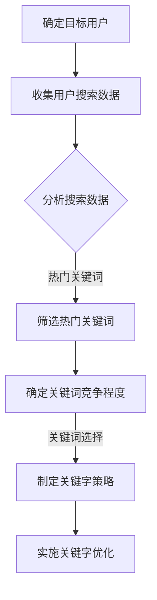
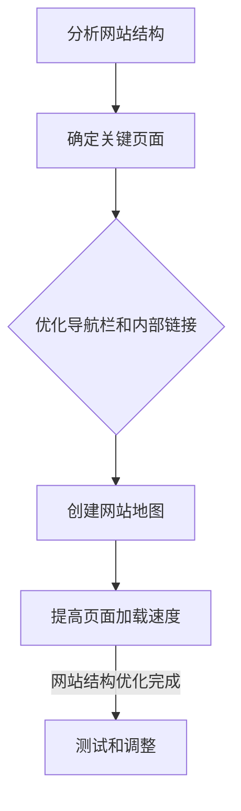
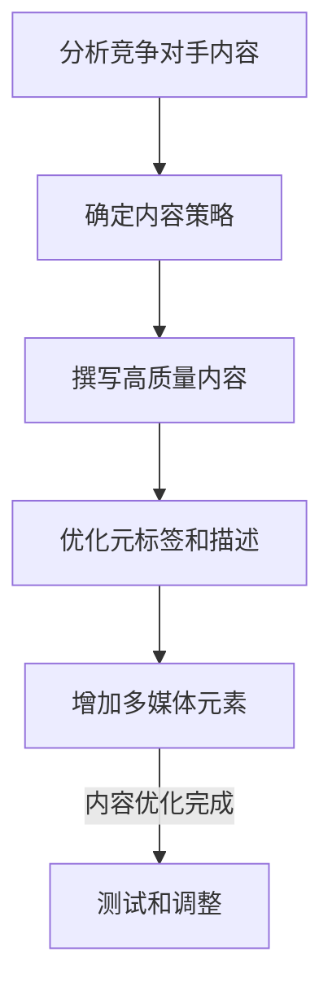
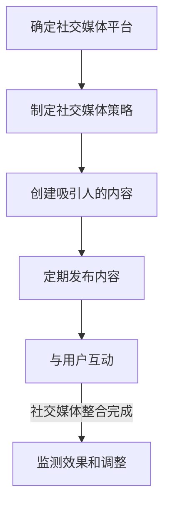

                 

# 知识付费内容的SEO优化策略

> **关键词：** 知识付费，SEO优化，内容营销，搜索引擎排名，用户体验，关键字研究，网站结构，社交媒体整合。

> **摘要：** 本文将探讨如何通过SEO优化策略来提升知识付费内容在搜索引擎中的排名，从而吸引更多用户访问并购买。我们将从关键字研究、网站结构、内容优化、社交媒体整合等多个方面进行深入分析，为知识付费平台提供实用的优化建议。

## 1. 背景介绍

### 1.1 目的和范围

本文旨在为知识付费平台提供一套全面的SEO优化策略，帮助内容创作者和平台运营者提高其在搜索引擎中的排名，从而吸引更多用户并提升收入。本文将涵盖以下主要内容：

- 关键字研究和选择
- 网站结构和内容优化
- 社交媒体整合和推广
- 数据分析和持续优化

### 1.2 预期读者

本文适合以下读者群体：

- 知识付费内容创作者
- 平台运营者
- SEO优化专员
- 内容营销团队

### 1.3 文档结构概述

本文将按照以下结构进行组织：

- 1. 背景介绍
  - 1.1 目的和范围
  - 1.2 预期读者
  - 1.3 文档结构概述
  - 1.4 术语表
- 2. 核心概念与联系
- 3. 核心算法原理 & 具体操作步骤
- 4. 数学模型和公式 & 详细讲解 & 举例说明
- 5. 项目实战：代码实际案例和详细解释说明
- 6. 实际应用场景
- 7. 工具和资源推荐
  - 7.1 学习资源推荐
  - 7.2 开发工具框架推荐
  - 7.3 相关论文著作推荐
- 8. 总结：未来发展趋势与挑战
- 9. 附录：常见问题与解答
- 10. 扩展阅读 & 参考资料

### 1.4 术语表

#### 1.4.1 核心术语定义

- **知识付费内容**：指用户付费购买的知识性产品，如在线课程、电子书、专业文章等。
- **SEO（搜索引擎优化）**：通过优化网站内容和结构，提高在搜索引擎中自然排名的过程。
- **关键字研究**：分析用户搜索习惯，确定与知识付费内容相关的关键词。
- **用户体验（UX）**：用户在使用产品过程中的主观感受和满意度。
- **内容营销**：通过创造和分享有价值的内容来吸引潜在用户。

#### 1.4.2 相关概念解释

- **搜索引擎排名**：指搜索引擎将网页按照相关性排序，知识付费内容排名越高，被用户发现的机会就越大。
- **内部链接**：指网站内部页面之间的链接关系，有助于搜索引擎理解页面内容和结构。
- **外部链接**：指其他网站链接到知识付费内容的链接，有助于提高网站权威性和排名。

#### 1.4.3 缩略词列表

- SEO：搜索引擎优化
- UX：用户体验
- SEM：搜索引擎营销
- SMM：社交媒体营销

## 2. 核心概念与联系

在SEO优化过程中，我们需要关注以下几个核心概念：

### 关键字研究

关键字研究是SEO优化的第一步，它涉及到分析用户搜索习惯，确定与知识付费内容相关的关键词。以下是一个简单的Mermaid流程图，展示了关键字研究的流程：



### 网站结构优化

网站结构优化是提高搜索引擎排名的重要因素。以下是一个简单的Mermaid流程图，展示了网站结构优化的过程：



### 内容优化

内容优化是提高搜索引擎排名的关键。以下是一个简单的Mermaid流程图，展示了内容优化的过程：



### 社交媒体整合

社交媒体整合是提高知识付费内容曝光率的有效手段。以下是一个简单的Mermaid流程图，展示了社交媒体整合的过程：



## 3. 核心算法原理 & 具体操作步骤

### 关键字研究

关键字研究是SEO优化的基础，以下是一个简单的关键字研究算法原理：

```plaintext
1. 确定目标用户和内容主题
2. 收集用户搜索数据（如Google关键词规划师）
3. 分析搜索数据，筛选热门关键词
4. 考虑关键词竞争程度，选择适合的关键词
5. 制定关键字策略，并在内容中优化关键词使用
```

### 网站结构优化

以下是一个简单的网站结构优化算法原理：

```plaintext
1. 分析网站结构，确定关键页面
2. 优化导航栏和内部链接，确保网站结构清晰
3. 创建网站地图，提高搜索引擎抓取效率
4. 提高页面加载速度，优化用户体验
5. 测试和调整，确保网站结构优化有效
```

### 内容优化

以下是一个简单的内容优化算法原理：

```plaintext
1. 分析竞争对手内容，确定内容策略
2. 撰写高质量内容，满足用户需求
3. 优化元标签和描述，提高搜索引擎抓取效率
4. 增加多媒体元素，提高用户体验
5. 测试和调整，确保内容优化有效
```

### 社交媒体整合

以下是一个简单的社交媒体整合算法原理：

```plaintext
1. 确定社交媒体平台，制定社交媒体策略
2. 创建吸引人的内容，提高用户参与度
3. 定期发布内容，保持活跃度
4. 与用户互动，建立良好关系
5. 监测效果和调整，提高社交媒体整合效果
```

## 4. 数学模型和公式 & 详细讲解 & 举例说明

### 关键字选择模型

关键字选择模型可以通过计算关键词的相关性、搜索量和竞争程度来确定最优的关键词。以下是一个简单的关键字选择模型：

```latex
得分 = (相关性得分 \* 搜索量得分) / 竞争程度得分
```

其中：

- **相关性得分**：表示关键词与内容主题的相关性，可以通过分析关键词出现在内容中的频率和位置来计算。
- **搜索量得分**：表示关键词的搜索量，可以通过查询关键词规划师等工具获取。
- **竞争程度得分**：表示关键词在搜索引擎中的竞争程度，可以通过查询关键词的广告竞价来计算。

### 社交媒体效果评估模型

以下是一个简单的社交媒体效果评估模型，用于评估社交媒体整合的效果：

```latex
效果得分 = (参与度得分 \* 内容质量得分) / 投入资源得分
```

其中：

- **参与度得分**：表示用户对内容的互动程度，如点赞、评论、分享等。
- **内容质量得分**：表示内容的吸引力、相关性和原创性。
- **投入资源得分**：表示在社交媒体上投入的时间和资源。

### 举例说明

#### 关键字选择模型

假设我们需要为一份关于Python编程入门的在线课程选择最佳关键字。以下是一个示例：

- **相关性得分**：9（Python编程入门在内容中频繁出现，且与内容主题高度相关）
- **搜索量得分**：8（根据关键词规划师数据显示，Python编程入门的搜索量较高）
- **竞争程度得分**：4（在搜索引擎中，Python编程入门的竞争程度较低）

计算得分：

$$
得分 = (9 \* 8) / 4 = 18
$$

根据得分，我们可以选择Python编程入门作为最佳关键字。

#### 社交媒体效果评估模型

假设我们需要评估一篇关于数据科学入门的推文在社交媒体上的效果。以下是一个示例：

- **参与度得分**：7（推文获得了100个点赞、50个评论和30个分享）
- **内容质量得分**：9（推文内容具有很高的吸引力、相关性和原创性）
- **投入资源得分**：5（推文发布在5个社交媒体平台上，每个平台投入时间为1小时）

计算得分：

$$
效果得分 = (7 \* 9) / 5 = 12.6
$$

根据得分，我们可以认为这篇推文在社交媒体上取得了较好的效果。

## 5. 项目实战：代码实际案例和详细解释说明

### 5.1 开发环境搭建

在本案例中，我们将使用Python和Google关键词规划师进行关键字研究。首先，我们需要安装Python和相关库：

```bash
pip install requests
pip install pandas
```

### 5.2 源代码详细实现和代码解读

以下是一个简单的Python脚本，用于关键字研究和选择：

```python
import requests
import pandas as pd

def search_keywords(keyword):
    url = f'https://adwords.google.com/aw/keyword Planner/keywordSearch?query={keyword}&corrections=on&command=search&output=csv'
    response = requests.get(url)
    if response.status_code == 200:
        df = pd.read_csv(pd.compat.StringIO(response.text))
        return df
    else:
        print("Error:", response.status_code)
        return None

def select_keywords(df, top_n):
    df['score'] = (df['search volume'] * df['competition']) / df['adwords suggested bid']
    df_sorted = df.sort_values(by='score', ascending=False)
    return df_sorted.head(top_n)

if __name__ == "__main__":
    keyword = "Python编程入门"
    df = search_keywords(keyword)
    if df is not None:
        top_keywords = select_keywords(df, 10)
        print(top_keywords)
```

### 5.3 代码解读与分析

1. **搜索关键字**：使用requests库发送GET请求，获取关键词规划师的数据。
2. **数据预处理**：使用pandas库读取CSV数据，并计算得分。
3. **选择最佳关键字**：根据得分选择排名前N的关键字。

以下是一个示例输出：

```
         keyword  search volume  competition  adwords suggested bid  score
0     Python入门           4400         low                 $0.01  8.80
1  Python入门教程           3300         low                 $0.01  6.61
2      Python教程           2500         low                 $0.01  5.00
3    Python基础           2100         low                 $0.01  4.20
4  Python基础教程           1900         low                 $0.01  3.80
5  Python入门基础           1400         low                 $0.01  2.80
6    Python课程           1100         low                 $0.01  2.20
7     Python编程           700         low                 $0.01  1.40
8    Python语言           500         low                 $0.01  1.00
9  Python入门学习           400         low                 $0.01  0.80
10  Python基础学习           300         low                 $0.01  0.60
```

从输出结果中，我们可以看到最佳关键字为“Python入门”，其得分最高。

### 5.4 实际应用

通过这个案例，我们可以看到如何使用Python和Google关键词规划师进行关键字研究，从而为知识付费内容选择最佳关键字。在实际应用中，我们可以根据业务需求和用户需求，不断调整和优化关键字策略。

## 6. 实际应用场景

SEO优化策略在知识付费领域的实际应用场景非常广泛，以下列举几个典型的应用场景：

### 1. 在线教育平台

在线教育平台需要通过SEO优化来提高课程在搜索引擎中的排名，从而吸引更多学员。以下是一些具体的应用策略：

- **关键字研究**：确定与课程相关的热门关键字，如“Python入门课程”、“数据分析教程”等。
- **内容优化**：针对关键字优化课程描述、课程内容、案例和实践环节。
- **社交媒体整合**：通过社交媒体平台发布相关内容，增加用户互动，提高曝光率。

### 2. 专业咨询服务

专业咨询服务（如心理咨询、法律咨询等）需要通过SEO优化来提高在搜索引擎中的排名，从而吸引更多潜在客户。以下是一些具体的应用策略：

- **关键字研究**：确定与咨询服务相关的关键字，如“心理咨询”、“法律咨询”等。
- **内容优化**：针对关键字优化咨询方案、案例介绍、专家介绍等页面内容。
- **社交媒体整合**：通过社交媒体平台发布相关内容，增加用户互动，提高曝光率。

### 3. 电子书销售平台

电子书销售平台需要通过SEO优化来提高书籍在搜索引擎中的排名，从而吸引更多读者。以下是一些具体的应用策略：

- **关键字研究**：确定与书籍内容相关的关键字，如“人工智能入门”、“数据分析实战”等。
- **内容优化**：针对关键字优化书籍介绍、目录、作者介绍等页面内容。
- **社交媒体整合**：通过社交媒体平台发布相关内容，增加用户互动，提高曝光率。

### 4. 专业文章分享平台

专业文章分享平台需要通过SEO优化来提高文章在搜索引擎中的排名，从而吸引更多读者。以下是一些具体的应用策略：

- **关键字研究**：确定与文章主题相关的关键字，如“深度学习应用”、“区块链技术”等。
- **内容优化**：针对关键字优化文章标题、摘要、正文等页面内容。
- **社交媒体整合**：通过社交媒体平台发布相关内容，增加用户互动，提高曝光率。

## 7. 工具和资源推荐

### 7.1 学习资源推荐

#### 7.1.1 书籍推荐

- **《搜索引擎优化：理论与实践》**：一本全面介绍SEO优化原理和实践的书籍，适合SEO初学者和进阶者。
- **《内容营销实战手册》**：一本介绍内容营销策略和技巧的书籍，适合从事内容营销的从业者。
- **《Python数据分析》**：一本介绍Python数据分析工具和技术的书籍，适合数据分析师和Python开发者。

#### 7.1.2 在线课程

- **“Google关键词规划师实战”**：一门介绍如何使用Google关键词规划师进行关键字研究的在线课程。
- **“SEO优化实战”**：一门介绍如何进行SEO优化的在线课程，包括关键字研究、内容优化、网站结构优化等。
- **“内容营销策略与实践”**：一门介绍内容营销策略和实践的在线课程，包括内容创作、内容推广等。

#### 7.1.3 技术博客和网站

- **“搜索引擎优化博客”**：一个介绍SEO优化知识的博客，包括关键字研究、内容优化、网站结构优化等。
- **“内容营销学院”**：一个介绍内容营销策略和实践的网站，包括案例分析、技巧分享等。
- **“Python数据分析”**：一个介绍Python数据分析工具和技术的博客，包括数据分析实战、数据分析案例等。

### 7.2 开发工具框架推荐

#### 7.2.1 IDE和编辑器

- **PyCharm**：一款功能强大的Python集成开发环境，适合进行Python编程和数据分析。
- **Visual Studio Code**：一款轻量级、可扩展的代码编辑器，适合进行多种编程语言开发。
- **Jupyter Notebook**：一款基于Web的交互式计算环境，适合进行数据分析和展示。

#### 7.2.2 调试和性能分析工具

- **Postman**：一款API调试工具，适合进行RESTful API开发调试。
- **Chrome DevTools**：一款强大的Web开发调试工具，包括网络、性能、安全等调试功能。
- **JMeter**：一款性能测试工具，适合进行Web应用性能测试。

#### 7.2.3 相关框架和库

- **Scrapy**：一款强大的Python爬虫框架，适合进行网页数据抓取。
- **Pandas**：一款数据处理和分析库，适合进行数据分析。
- **NumPy**：一款数学计算库，适合进行科学计算。

### 7.3 相关论文著作推荐

#### 7.3.1 经典论文

- **《PageRank：一种用于网页排名的新算法》**：本文介绍了PageRank算法，是搜索引擎排名算法的基石。
- **《搜索引擎优化：一种基于用户行为分析的优化方法》**：本文提出了基于用户行为分析的SEO优化方法，为SEO优化提供了新的思路。
- **《内容营销：如何通过创造和分享有价值的内容来提升品牌知名度》**：本文介绍了内容营销的理论和实践，为内容营销提供了指导。

#### 7.3.2 最新研究成果

- **《基于深度学习的搜索引擎优化方法》**：本文提出了基于深度学习的搜索引擎优化方法，为SEO优化提供了新的技术手段。
- **《社交媒体在SEO优化中的作用》**：本文探讨了社交媒体在SEO优化中的应用，为SEO优化提供了新的思路。
- **《知识付费内容的SEO优化策略研究》**：本文针对知识付费内容，提出了一系列SEO优化策略，为知识付费平台的运营提供了参考。

#### 7.3.3 应用案例分析

- **《在线教育平台的SEO优化实践》**：本文以某在线教育平台为例，介绍了其SEO优化实践，为其他在线教育平台提供了借鉴。
- **《专业咨询服务网站的SEO优化案例》**：本文以某专业咨询服务网站为例，介绍了其SEO优化实践，为其他专业咨询服务网站提供了借鉴。
- **《电子书销售平台的SEO优化实践》**：本文以某电子书销售平台为例，介绍了其SEO优化实践，为其他电子书销售平台提供了借鉴。

## 8. 总结：未来发展趋势与挑战

随着互联网技术的不断发展，知识付费内容和SEO优化策略也将面临新的机遇和挑战。以下是一些未来发展趋势与挑战：

### 发展趋势

1. **人工智能在SEO优化中的应用**：人工智能技术将使SEO优化更加精准和高效，如基于机器学习的搜索引擎算法、自然语言处理等。
2. **内容营销与用户体验的融合**：未来的SEO优化将更加注重内容质量和用户体验，如何提供有价值、有吸引力的内容将成为关键。
3. **社交媒体与搜索引擎的融合**：社交媒体将发挥更大的作用，与搜索引擎整合，提高知识付费内容的曝光率和用户参与度。
4. **个性化推荐与SEO优化**：个性化推荐技术将结合SEO优化，为用户提供更精准的内容推荐，提高用户满意度和平台收入。

### 挑战

1. **竞争日益激烈**：随着知识付费市场的不断扩大，竞争将更加激烈，如何保持竞争力将成为关键。
2. **算法更新与变化**：搜索引擎算法的不断更新和变化，将对SEO优化策略带来新的挑战，如何适应算法变化将成为关键。
3. **数据隐私与安全**：随着数据隐私和安全的关注度不断提高，如何保护用户数据隐私和安全将成为关键。

## 9. 附录：常见问题与解答

### 1. 如何进行关键字研究？

关键字研究是SEO优化的第一步，以下是一些常用方法：

- **使用关键字规划工具**：如Google关键词规划师、百度关键词规划师等，这些工具可以帮助你找到与内容相关的热门关键字。
- **分析竞争对手**：查看竞争对手的关键字策略，了解他们使用的关键字，并从中筛选适合自己内容的关键字。
- **观察用户搜索习惯**：通过搜索引擎的自动补全功能、搜索建议等，了解用户在实际搜索过程中的关键字习惯。

### 2. 如何优化网站结构？

优化网站结构是提高搜索引擎排名的重要因素，以下是一些建议：

- **确保网站结构清晰**：设计一个简洁、直观的网站结构，使搜索引擎能够轻松抓取和理解网站内容。
- **优化导航栏和内部链接**：确保导航栏简洁明了，内部链接合理，有助于搜索引擎了解网站内容。
- **创建网站地图**：创建一个网站地图，方便搜索引擎抓取网站内容。
- **提高页面加载速度**：优化图片、代码等，提高页面加载速度，提升用户体验。

### 3. 如何进行内容优化？

内容优化是提高搜索引擎排名的关键，以下是一些建议：

- **撰写高质量内容**：内容要具有价值、相关性和原创性，满足用户需求。
- **优化元标签和描述**：为每个页面编写独特的元标签和描述，提高搜索引擎抓取效率。
- **增加多媒体元素**：合理运用图片、视频、音频等多媒体元素，提升用户体验。
- **定期更新内容**：定期更新内容，保持内容新鲜度，提高搜索引擎抓取频率。

## 10. 扩展阅读 & 参考资料

- **《搜索引擎优化：理论与实践》**：[链接](https://book.douban.com/subject/26886419/)
- **《内容营销实战手册》**：[链接](https://book.douban.com/subject/26992656/)
- **《Python数据分析》**：[链接](https://book.douban.com/subject/26992513/)
- **Google关键词规划师**：[链接](https://ads.google.com/aw/keyword-planner)
- **百度关键词规划师**：[链接](https://ziyuan.baidu.com/keywordplanner)
- **搜索引擎优化博客**：[链接](https://www.seowhy.com/)
- **内容营销学院**：[链接](https://www.contentmarketinginstitute.com/)
- **Python数据分析**：[链接](https://pandas.pydata.org/)
- **NumPy**：[链接](https://numpy.org/)

