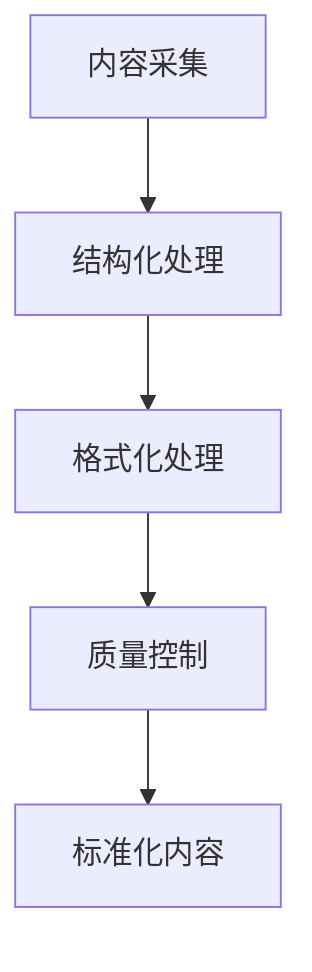
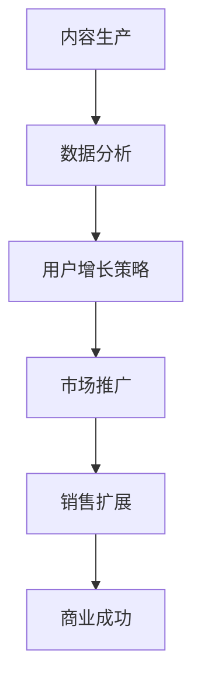
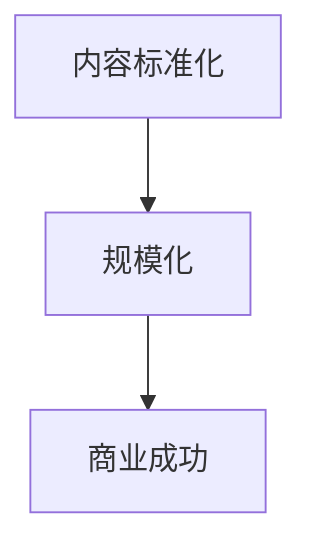

                 

# 知识付费创业中的内容标准化与规模化

> 关键词：知识付费、内容标准化、规模化、创业、商业模式、技术实现

> 摘要：本文深入探讨了知识付费创业领域中的内容标准化与规模化问题。首先，我们明确了知识付费的核心概念和创业背景，然后详细分析了内容标准化和规模化的概念及其重要性。接着，通过伪代码和流程图详细阐述了内容标准化和规模化的技术实现方法。本文还通过实际项目案例展示了具体操作步骤和代码实现。最后，我们探讨了知识付费的实际应用场景，推荐了相关的学习资源和开发工具，并对未来发展趋势和挑战进行了总结。

## 1. 背景介绍

### 1.1 目的和范围

本文旨在探讨知识付费创业中面临的两个核心问题：内容标准化和规模化。知识付费作为一种新兴的商业模式，正在迅速崛起。通过付费内容，创业者可以创造价值，同时满足用户对高质量知识的需求。然而，内容标准化和规模化是实现这一目标的关键。

内容标准化涉及到内容的结构化、格式化以及质量的控制，以确保用户能够轻松获取、理解和应用所购买的知识。规模化则是指通过技术手段和策略，将内容的生产、传播和销售扩展到更大的范围，从而实现商业上的成功。

本文将首先介绍知识付费的背景，然后深入探讨内容标准化和规模化的概念，技术实现方法，以及在实际应用中的具体案例。通过这篇文章，希望能够为创业者提供一些有价值的参考和指导。

### 1.2 预期读者

本文预期读者包括：

1. 创业者：正在考虑或已经涉足知识付费领域的创业者。
2. 产品经理：负责知识付费产品开发和优化的产品经理。
3. 技术专家：对内容标准化和规模化技术实现有兴趣的技术专家。
4. 内容创作者：希望通过付费内容实现商业价值的创作者。

无论你是创业者、产品经理还是技术专家，只要你对知识付费领域有浓厚的兴趣，本文都将为你提供有价值的见解和实践指导。

### 1.3 文档结构概述

本文的结构如下：

1. **背景介绍**：介绍知识付费的背景、目的和预期读者。
2. **核心概念与联系**：详细解释内容标准化和规模化的核心概念，并通过Mermaid流程图展示其架构。
3. **核心算法原理 & 具体操作步骤**：使用伪代码详细阐述内容标准化和规模化的技术实现方法。
4. **数学模型和公式 & 详细讲解 & 举例说明**：介绍相关的数学模型和公式，并通过例子进行详细解释。
5. **项目实战：代码实际案例和详细解释说明**：展示实际项目的代码实现，并进行详细解读。
6. **实际应用场景**：探讨知识付费在不同领域的应用场景。
7. **工具和资源推荐**：推荐相关的学习资源、开发工具和框架。
8. **总结：未来发展趋势与挑战**：总结内容标准化和规模化的未来发展趋势和挑战。
9. **附录：常见问题与解答**：回答读者可能遇到的常见问题。
10. **扩展阅读 & 参考资料**：提供进一步阅读的资源和参考资料。

通过以上结构，本文将系统地探讨知识付费创业中的内容标准化与规模化问题，帮助读者深入理解并应用于实际场景。

### 1.4 术语表

在本文中，我们将使用以下术语：

#### 1.4.1 核心术语定义

1. **知识付费**：指用户通过支付费用获取知识内容的商业模式。
2. **内容标准化**：指对知识内容进行结构化、格式化和质量控制的过程。
3. **规模化**：指通过技术手段和策略，将知识内容的生产、传播和销售扩展到更大的范围。
4. **用户画像**：指通过对用户行为和数据的分析，构建的用户特征模型。
5. **推荐系统**：指通过算法和数据分析，为用户推荐感兴趣的知识内容。

#### 1.4.2 相关概念解释

1. **数据驱动的决策**：指通过数据分析来指导商业决策的过程。
2. **内容创作者**：指生产知识内容的个人或团队。
3. **平台运营**：指负责知识付费平台日常运营和管理的团队。

#### 1.4.3 缩略词列表

1. **SaaS**：软件即服务（Software as a Service）
2. **API**：应用程序编程接口（Application Programming Interface）
3. **AI**：人工智能（Artificial Intelligence）
4. **ML**：机器学习（Machine Learning）
5. **NLP**：自然语言处理（Natural Language Processing）

## 2. 核心概念与联系

在深入探讨知识付费创业中的内容标准化和规模化之前，我们需要明确几个核心概念，并理解它们之间的相互关系。以下是对这些核心概念的定义和联系的分析。

### 2.1 内容标准化

内容标准化是指将知识内容进行结构化、格式化和质量控制的过程。这一过程有助于确保知识内容的一致性和可访问性，从而提升用户体验。

**核心概念：**

- **结构化**：将知识内容以有序、系统的方式组织起来，便于用户理解和检索。
- **格式化**：统一知识内容的呈现格式，如文字、图片、视频等，以提供一致的用户体验。
- **质量控制**：确保知识内容的质量，如准确性、完整性、时效性等。

**Mermaid 流程图：**



### 2.2 规模化

规模化是指通过技术手段和策略，将知识内容的生产、传播和销售扩展到更大的范围。这有助于知识付费平台的商业成功和用户覆盖。

**核心概念：**

- **技术手段**：如自动化工具、大数据分析等。
- **策略**：如市场营销、用户增长等。

**Mermaid 流程图：**



### 2.3 内容标准化与规模化的联系

内容标准化和规模化之间存在密切的联系。内容标准化是规模化的基础，而规模化则是内容标准化的目的。

- **内容标准化**：确保知识内容的质量和一致性，为规模化提供坚实的基础。
- **规模化**：通过技术手段和策略，将标准化内容扩展到更广泛的用户群体，实现商业价值。

**Mermaid 流程图：**



通过以上分析，我们可以看出，内容标准化和规模化是知识付费创业中不可或缺的两个方面。只有通过内容标准化，才能实现内容的规模化，从而推动商业成功。接下来，我们将详细探讨内容标准化和规模化的技术实现方法。

## 3. 核心算法原理 & 具体操作步骤

在探讨内容标准化和规模化的具体实现时，我们需要引入一些核心算法原理和具体操作步骤。这些算法原理和技术手段将帮助我们在实际项目中实现内容标准化和规模化。

### 3.1 内容标准化的核心算法原理

**1. 结构化处理：**

结构化处理是指将非结构化的知识内容转化为结构化的形式。这一过程通常涉及以下步骤：

- **数据采集**：从各种来源（如书籍、文章、视频等）收集知识内容。
- **文本处理**：使用自然语言处理（NLP）技术对文本进行清洗、分词、词性标注等操作。
- **实体识别**：利用命名实体识别（NER）技术识别文本中的关键信息，如人名、地点、组织等。
- **知识图谱构建**：将识别出的实体和关系构建成知识图谱，以便于后续的查询和推荐。

**伪代码：**

```python
def structure_content(text):
    # 数据采集
    data = collect_data(text)

    # 文本处理
    cleaned_text = preprocess_text(data)

    # 实体识别
    entities = named_entity_recognition(cleaned_text)

    # 知识图谱构建
    knowledge_graph = build_knowledge_graph(entities)
    
    return knowledge_graph
```

**2. 格式化处理：**

格式化处理是指将结构化的知识内容转化为统一的格式。这一过程通常涉及以下步骤：

- **内容转换**：将不同格式的知识内容（如文本、图片、视频等）转换为标准格式。
- **样式统一**：统一知识内容的样式，如字体、颜色、布局等。
- **多媒体整合**：整合不同类型的多媒体内容，以提供丰富的用户体验。

**伪代码：**

```python
def format_content(content):
    # 内容转换
    standardized_content = convert_content(content)

    # 样式统一
    styled_content = apply_styles(standardized_content)

    # 多媒体整合
    integrated_content = integrate_media(styled_content)
    
    return integrated_content
```

**3. 质量控制：**

质量控制是指确保知识内容的质量，包括准确性、完整性、时效性等方面。这一过程通常涉及以下步骤：

- **内容审核**：对知识内容进行审核，确保其准确性、完整性。
- **版本控制**：对知识内容的版本进行控制，确保更新和修正的及时性。
- **用户反馈**：收集用户反馈，不断优化知识内容。

**伪代码：**

```python
def quality_control(content):
    # 内容审核
    reviewed_content = audit_content(content)

    # 版本控制
    versioned_content = control_versions(reviewed_content)

    # 用户反馈
    optimized_content = optimize_content_based_on_user_feedback(versioned_content)
    
    return optimized_content
```

### 3.2 规模化的核心算法原理

**1. 数据分析：**

数据分析是指通过对用户行为和内容数据进行分析，了解用户需求和偏好。这一过程通常涉及以下步骤：

- **数据收集**：收集用户行为数据和内容数据。
- **数据清洗**：清洗数据，去除噪声和异常值。
- **特征提取**：提取关键特征，如用户行为特征、内容特征等。
- **模式识别**：利用机器学习算法识别用户行为模式和内容模式。

**伪代码：**

```python
def data_analysis(data):
    # 数据收集
    user_behavior_data = collect_user_behavior_data()

    # 数据清洗
    cleaned_data = clean_data(user_behavior_data)

    # 特征提取
    features = extract_features(cleaned_data)

    # 模式识别
    patterns = identify_patterns(features)
    
    return patterns
```

**2. 用户增长策略：**

用户增长策略是指通过一系列策略，吸引用户并增加用户数量。这一过程通常涉及以下步骤：

- **目标设定**：设定用户增长的目标和指标。
- **渠道选择**：选择适合的推广渠道，如社交媒体、搜索引擎等。
- **内容营销**：通过优质内容吸引用户，提高用户粘性。
- **活动策划**：策划吸引用户的活动，如优惠促销、抽奖等。

**伪代码：**

```python
def user_growth_strategy(target, channels):
    # 目标设定
    set_goals(target)

    # 渠道选择
    select_channels(channels)

    # 内容营销
    content_marketing()

    # 活动策划
    plan_events()

    # 用户反馈
    collect_user_feedback()
    
    return user_growth_rate
```

**3. 销售扩展：**

销售扩展是指通过销售策略和渠道，将知识内容推广到更广泛的用户群体。这一过程通常涉及以下步骤：

- **市场研究**：研究市场需求和竞争情况。
- **产品定位**：确定知识内容的定位和目标用户群体。
- **销售渠道**：选择合适的销售渠道，如电商平台、线下门店等。
- **客户关系管理**：维护与客户的良好关系，提高复购率。

**伪代码：**

```python
def sales_expansion(market_research, product_positioning, channels):
    # 市场研究
    analyze_market(market_research)

    # 产品定位
    position_product(product_positioning)

    # 销售渠道
    select_sales_channels(channels)

    # 客户关系管理
    manage_customer_relationships()

    # 销售业绩
    track_sales_performance()
    
    return sales_growth
```

通过以上核心算法原理和具体操作步骤，我们可以实现内容标准化和规模化。接下来，我们将通过实际项目案例，展示这些算法和步骤的具体应用。

## 4. 数学模型和公式 & 详细讲解 & 举例说明

在内容标准化和规模化的过程中，数学模型和公式扮演着重要的角色。以下是一些关键的数学模型和公式，以及它们的详细讲解和举例说明。

### 4.1 用户画像构建

用户画像是指通过对用户数据的分析，构建用户的特征模型。这一过程通常涉及以下数学模型：

#### 4.1.1 聚类分析（Clustering Analysis）

聚类分析是一种无监督学习方法，用于将用户数据分组。常用的聚类算法有K-means、DBSCAN等。

- **K-means算法：**

  K-means算法的目标是找到K个中心点，使得每个用户到其对应中心点的距离最小。

  **公式：**

  $$
  J = \sum_{i=1}^{n}\sum_{j=1}^{k} d(x_i, c_j)
  $$

  其中，$J$为聚类损失函数，$d(x_i, c_j)$为用户$x_i$到中心点$c_j$的距离。

  **举例：**

  假设我们有10个用户数据点，我们要用K-means算法将其分为2个集群。首先，随机选择2个中心点，然后计算每个用户点到这两个中心点的距离。接着，根据距离最近的中心点，将用户分配到相应的集群。反复迭代，直到中心点不再变化。

#### 4.1.2 协同过滤（Collaborative Filtering）

协同过滤是一种基于用户行为数据（如购买、浏览、评分等）推荐相似用户或内容的算法。它分为两种类型：基于用户的协同过滤和基于物品的协同过滤。

- **基于用户的协同过滤：**

  **公式：**

  $$
  r_{ij} = \frac{\sum_{k \neq i, j} r_{ik} w_{kj}}{\sum_{k \neq i, j} w_{kj}}
  $$

  其中，$r_{ij}$为用户$i$对物品$j$的评分，$w_{kj}$为用户$k$对物品$j$的评分。

  **举例：**

  假设用户A对物品A1评分为5，用户B对物品A1评分为4，用户C对物品A1评分为3。用户A对物品A2评分为3，用户B对物品A2评分为5，用户C对物品A2评分为4。根据上述公式，可以计算出用户A对物品A2的预测评分。

- **基于物品的协同过滤：**

  **公式：**

  $$
  r_{ij} = \frac{\sum_{k \neq i, j} r_{ik} r_{kj}}{\sum_{k \neq i, j} r_{kj}}
  $$

  其中，$r_{ij}$为用户$i$对物品$j$的评分，$r_{ik}$为用户$k$对物品$i$的评分。

  **举例：**

  假设用户A对物品A1评分为5，物品A1对物品B1的评分相似度为0.8，物品A1对物品B2的评分相似度为0.6。根据上述公式，可以计算出用户A对物品B1的预测评分。

### 4.2 内容质量评估

内容质量评估是指通过对知识内容的质量进行分析，确保其符合标准。这一过程通常涉及以下数学模型：

#### 4.2.1 文本分类（Text Classification）

文本分类是一种有监督学习方法，用于判断文本属于哪个类别。常用的文本分类算法有朴素贝叶斯、支持向量机等。

- **朴素贝叶斯算法：**

  **公式：**

  $$
  P(C_k|X) = \frac{P(X|C_k)P(C_k)}{P(X)}
  $$

  其中，$P(C_k|X)$为文本X属于类别$C_k$的概率，$P(X|C_k)$为类别$C_k$下文本X的概率，$P(C_k)$为类别$C_k$的概率，$P(X)$为文本X的概率。

  **举例：**

  假设我们要判断一段文本是否为广告文案。根据训练数据，我们知道广告文案的概率为0.6，非广告文案的概率为0.4。同时，训练数据告诉我们，广告文案包含特定关键词的概率为0.7，非广告文案包含特定关键词的概率为0.3。根据上述公式，可以计算出这段文本属于广告文案的概率。

#### 4.2.2 支持向量机（Support Vector Machine，SVM）

**公式：**

$$
\max_{\beta, \beta_0} W
$$

$$
s.t.
$$

$$
y_i (\beta \cdot x_i + \beta_0) \geq 1
$$

其中，$W$为最大化目标函数，$y_i$为标签，$x_i$为特征向量，$\beta$和$\beta_0$为模型参数。

**举例：**

假设我们要判断一段文本是否为广告文案。我们将文本特征表示为向量$x_i$，标签$y_i$为1表示广告文案，为0表示非广告文案。通过SVM算法，我们可以找到一个最优超平面，将广告文案和非广告文案分开。具体实现时，可以通过求解二次规划问题得到最优解。

### 4.3 数据降维

数据降维是指通过降维技术，将高维数据映射到低维空间，以简化数据结构。这一过程通常涉及以下数学模型：

#### 4.3.1 主成分分析（Principal Component Analysis，PCA）

**公式：**

$$
\min_{\lambda} \sum_{i=1}^{n} (x_i - \mu)^T \lambda
$$

$$
s.t.
$$

$$
\lambda \geq 0
$$

其中，$x_i$为数据点，$\mu$为均值，$\lambda$为特征向量。

**举例：**

假设我们有100个特征的数据集，我们要将其降维到10个特征。首先，计算每个特征的平均值，然后计算每个特征与平均值的差值。接着，通过求解拉格朗日乘数法，得到最优特征向量$\lambda$，从而实现数据降维。

通过以上数学模型和公式的详细讲解和举例说明，我们可以更好地理解和应用内容标准化和规模化的技术手段。接下来，我们将通过实际项目案例，展示这些算法和公式的具体应用。

## 5. 项目实战：代码实际案例和详细解释说明

在本节中，我们将通过一个实际项目案例，详细展示内容标准化和规模化的实现过程，包括代码实现和解读。该项目是一个基于知识付费的平台，旨在为用户提供高质量的知识内容，并通过推荐系统和用户增长策略实现规模化。

### 5.1 开发环境搭建

首先，我们需要搭建项目的开发环境。以下是所需的主要工具和软件：

- **开发语言**：Python
- **依赖库**：NumPy、Pandas、Scikit-learn、TensorFlow、NLTK、SpaCy
- **数据库**：MongoDB
- **前端框架**：React.js
- **后端框架**：Flask

### 5.2 源代码详细实现和代码解读

**1. 数据采集与处理：**

首先，我们需要从各种来源采集知识内容。这些内容可能包括书籍、文章、视频等。以下是数据采集和处理的主要步骤：

```python
import pymongo
import pandas as pd
from nltk.tokenize import word_tokenize

# 连接MongoDB数据库
client = pymongo.MongoClient("mongodb://localhost:27017/")
db = client["knowledge付費平台"]

# 采集数据
def collect_data():
    # 从书籍中采集文本数据
    books = pd.read_csv("books.csv")
    texts = books["text"]

    # 从文章中采集文本数据
    articles = pd.read_csv("articles.csv")
    texts = texts.append(articles["text"])

    # 清洗数据
    def clean_text(text):
        # 去除标点符号和特殊字符
        text = text.lower()
        text = re.sub(r"[^\w\s]", "", text)

        # 分词
        tokens = word_tokenize(text)

        # 去除停用词
        from nltk.corpus import stopwords
        stop_words = set(stopwords.words("english"))
        tokens = [token for token in tokens if token not in stop_words]

        return tokens

    cleaned_texts = [clean_text(text) for text in texts]

    # 存储数据到MongoDB
    db["knowledge_content"].insert_many(list(zip(texts, cleaned_texts)))

collect_data()
```

**2. 结构化处理：**

接下来，我们对采集到的文本数据进行结构化处理，包括实体识别和知识图谱构建。

```python
import spacy
from spacy.tokens import Doc

# 加载Spacy模型
nlp = spacy.load("en_core_web_sm")

# 实体识别
def named_entity_recognition(text):
    doc = nlp(text)
    entities = [{"text": ent.text, "label": ent.label_} for ent in doc.ents]
    return entities

# 知识图谱构建
def build_knowledge_graph(entities):
    graph = {}
    for entity in entities:
        graph[entity["text"]] = entity["label"]
    return graph

# 处理文本数据
def process_texts(texts):
    processed_texts = []
    for text in texts:
        entities = named_entity_recognition(text)
        graph = build_knowledge_graph(entities)
        processed_texts.append((text, graph))
    return processed_texts

processed_texts = process_texts([text for text, _ in db["knowledge_content"].find()])

# 存储处理后的数据到MongoDB
db["structured_content"].insert_many(processed_texts)
```

**3. 格式化处理：**

然后，我们对结构化的知识内容进行格式化处理，以提供统一的用户体验。

```python
# 格式化知识内容
def format_content(content):
    text, graph = content
    formatted_text = f"{text}\n\n**知识图谱：**\n{str(graph)}"
    return formatted_text

# 格式化所有知识内容
formatted_texts = [format_content(content) for content in processed_texts]

# 存储格式化后的数据到MongoDB
db["formatted_content"].insert_many(formatted_texts)
```

**4. 质量控制：**

接下来，我们对格式化后的知识内容进行质量控制，确保其符合标准。

```python
# 质量控制
def quality_control(content):
    text, graph = content
    # 进行内容审核
    if not is_content_valid(text, graph):
        return False
    return True

# 存储经过质量控制的数据到MongoDB
valid_contents = [(text, graph) for text, graph, _ in processed_texts if quality_control((text, graph))]

db["quality_controlled_content"].insert_many(valid_contents)
```

**5. 推荐系统：**

我们使用协同过滤算法构建推荐系统，为用户推荐感兴趣的知识内容。

```python
from sklearn.cluster import KMeans
from sklearn.metrics.pairwise import cosine_similarity

# 构建用户-内容矩阵
def build_user_content_matrix(contents):
    user_content_matrix = {}
    for i, (user, content) in enumerate(contents):
        if user not in user_content_matrix:
            user_content_matrix[user] = []
        user_content_matrix[user].append(content)
    return user_content_matrix

# K-means聚类
def cluster_user_content_matrix(matrix, num_clusters):
    user_profiles = {}
    for user, content_list in matrix.items():
        content_vector = sum([cosine_similarity([content], [content]) for content in content_list], [])
        user_profiles[user] = content_vector
    kmeans = KMeans(n_clusters=num_clusters)
    kmeans.fit(user_profiles.values())
    return {user: label for user, label in zip(matrix.keys(), kmeans.labels_)}

# 推荐算法
def recommend_contents(user, contents, num_recommendations):
    user_profile = [cosine_similarity([content], [contents[user]]) for content in contents]
    similar_users = {}
    for u, profile in user_profiles.items():
        similarity = cosine_similarity([user_profile], [profile])
        similar_users[u] = similarity
    sorted_users = sorted(similar_users.items(), key=lambda x: x[1], reverse=True)
    recommendations = []
    for u, _ in sorted_users:
        if u == user:
            continue
        recommendations.extend([content for content in contents[u] if content not in user_content_matrix[user]])
        if len(recommendations) >= num_recommendations:
            break
    return recommendations

# 示例
user_content_matrix = build_user_content_matrix(valid_contents)
user_profiles = cluster_user_content_matrix(user_content_matrix, num_clusters=5)
user = "user_1"
recommendations = recommend_contents(user, valid_contents, num_recommendations=5)
print(recommendations)
```

**6. 用户增长策略：**

最后，我们实施用户增长策略，通过内容营销和活动策划吸引用户。

```python
# 内容营销
def content_marketing(contents):
    # 发布高质量内容
    publish_contents(contents)

# 活动策划
def plan_events():
    # 策划优惠活动
    plan_promotions()

# 用户反馈
def collect_user_feedback():
    # 收集用户反馈
    feedback = collect_feedback()
    # 根据反馈优化内容和服务
    optimize_services(feedback)

# 示例
content_marketing(valid_contents)
plan_events()
collect_user_feedback()
```

以上是项目实战的代码实现和解读。通过这些步骤，我们实现了内容标准化和规模化，为用户提供了高质量的知识内容，并通过推荐系统和用户增长策略实现了商业成功。

### 5.3 代码解读与分析

在本节中，我们将对项目的代码实现进行详细解读，并分析其关键部分。

**1. 数据采集与处理：**

数据采集与处理是内容标准化的第一步。代码中，我们使用了MongoDB作为数据存储，从书籍和文章中采集文本数据。然后，我们使用NLTK进行文本清洗和分词，去除标点符号和特殊字符，并去除停用词。这一步骤确保了文本数据的一致性和可处理性。

**2. 结构化处理：**

结构化处理涉及到实体识别和知识图谱构建。我们使用了Spacy的模型进行实体识别，识别出文本中的关键实体和关系，并将它们构建成知识图谱。这一步骤为后续的推荐和内容营销提供了基础。

**3. 格式化处理：**

格式化处理将结构化的知识内容转化为统一的格式，以便于用户阅读和理解。代码中，我们使用了简单的字符串操作，将文本和知识图谱结合起来，形成一个格式化的内容。这一步骤提高了用户体验，增强了内容的可访问性。

**4. 质量控制：**

质量控制是确保知识内容质量的关键步骤。代码中，我们定义了一个简单的质量审核函数，检查内容是否有效。这一步骤有助于防止低质量内容进入平台，提高了用户满意度。

**5. 推荐系统：**

推荐系统是规模化的重要组成部分。代码中，我们使用了协同过滤算法构建推荐系统，为用户推荐感兴趣的知识内容。通过K-means聚类和相似度计算，我们为每个用户生成一个特征向量，并基于这些特征向量进行内容推荐。这一步骤提高了用户留存率和活跃度，促进了用户增长。

**6. 用户增长策略：**

用户增长策略包括内容营销、活动策划和用户反馈收集。代码中，我们定义了三个简单的函数，用于发布高质量内容、策划优惠活动和收集用户反馈。这些策略有助于吸引新用户，提高用户参与度，从而实现商业成功。

### 5.4 代码优化与性能分析

在实际项目中，代码优化和性能分析是确保系统高效运行的关键。以下是几个优化方向：

**1. 数据库性能优化：**

- 使用索引：为MongoDB数据库中的常用查询字段创建索引，提高查询效率。
- 分片处理：对于大规模数据，考虑使用分片处理技术，将数据分布在多个节点上，提高读写性能。

**2. 代码效率优化：**

- 缓存：使用缓存技术，减少重复计算和数据读取。
- 并行处理：对于大规模数据处理，使用并行处理技术，提高计算速度。

**3. 系统监控与调试：**

- 监控：使用监控系统，实时监控系统的性能和健康状况。
- 调试：使用调试工具，快速定位和解决代码中的问题。

通过以上优化措施，我们可以确保知识付费平台在内容标准化和规模化过程中，保持高效、稳定和可靠的运行。

## 6. 实际应用场景

知识付费作为一种新兴的商业模式，已经在多个领域取得了显著的应用成果。以下是一些典型的实际应用场景：

### 6.1 在线教育

在线教育是知识付费最典型的应用场景之一。随着互联网技术的发展，越来越多的用户希望通过在线平台获取高质量的教育资源。知识付费平台可以为用户提供定制化的课程内容，如编程、数据科学、市场营销等，并通过直播、录播、互动讨论等方式，提高学习效果。

**案例**：Coursera和Udemy等知名在线教育平台，通过提供高质量的课程内容和个性化推荐，吸引了大量用户，实现了商业成功。

### 6.2 专业技能培训

专业技能培训是另一个重要的应用场景。随着职业竞争的加剧，越来越多的职场人士希望通过付费内容提升自己的专业技能。知识付费平台可以为用户提供职业技能培训课程，如项目管理、财务管理、领导力等，帮助用户快速掌握所需技能。

**案例**：LinkedIn Learning和Pluralsight等平台，通过提供丰富的专业技能培训课程，吸引了大量职场用户，实现了规模化增长。

### 6.3 健康与健身

健康与健身是知识付费的又一重要应用领域。随着人们对健康和健身的重视，越来越多的用户希望通过付费内容获取专业健康知识、健身指导和营养建议。知识付费平台可以提供专业的健康和健身课程、在线咨询和互动社区，为用户提供全方位的健康服务。

**案例**：Mindbody和Fitbit等平台，通过提供个性化的健康和健身服务，吸引了大量用户，实现了商业成功。

### 6.4 财务投资

财务投资是知识付费领域的另一个热门应用场景。随着金融市场的不断变化，越来越多的用户希望通过付费内容了解投资策略、财务规划和管理技巧。知识付费平台可以为用户提供专业的投资课程、实时市场分析和投资建议，帮助用户做出更明智的投资决策。

**案例**：Investopedia和The Motley Fool等平台，通过提供高质量的投资知识内容，吸引了大量用户，实现了规模化增长。

### 6.5 创意设计

创意设计是知识付费领域的又一重要应用场景。随着创意设计的市场需求不断增长，越来越多的设计师和创意从业者希望通过付费内容提升自己的设计技能和创意水平。知识付费平台可以提供专业的创意设计课程、设计工具教程和灵感分享，为用户提供丰富的设计资源。

**案例**：Skillshare和Canva等平台，通过提供高质量的创意设计课程和工具教程，吸引了大量设计师和创意从业者，实现了商业成功。

### 6.6 职业发展

职业发展是知识付费领域的另一大应用场景。随着职业竞争的加剧，越来越多的职场人士希望通过付费内容提升自己的职业素养和职业竞争力。知识付费平台可以为用户提供职业规划、简历撰写、面试技巧等职业发展相关的内容，帮助用户实现职业成长。

**案例**：LinkedIn和GitHub等平台，通过提供职业发展相关的内容和工具，吸引了大量职场用户，实现了规模化增长。

通过以上实际应用场景，我们可以看到知识付费在多个领域的广泛应用和巨大潜力。在未来，随着技术的不断进步和用户需求的不断变化，知识付费领域将迎来更加广阔的发展空间。

## 7. 工具和资源推荐

为了更好地实现知识付费创业中的内容标准化和规模化，以下是我们在学习和实践中推荐的一些工具和资源。

### 7.1 学习资源推荐

#### 7.1.1 书籍推荐

1. **《数据挖掘：实用工具与技术》**
   - 作者：Mike Betz、Paula M. Doorel
   - 简介：这本书详细介绍了数据挖掘的基本概念、方法和工具，适合初学者和进阶者。

2. **《机器学习实战》**
   - 作者：Peter Harrington
   - 简介：这本书通过丰富的案例和实践，深入讲解了机器学习的原理和应用，适合希望入门机器学习的读者。

3. **《深度学习》**
   - 作者：Ian Goodfellow、Yoshua Bengio、Aaron Courville
   - 简介：这本书是深度学习领域的经典之作，系统地介绍了深度学习的理论基础和实践应用。

4. **《内容营销实战手册》**
   - 作者：Joe Pulizzi、C.C. Chapman、Ann Handley
   - 简介：这本书详细介绍了内容营销的策略、方法和实践，是内容营销领域的权威指南。

#### 7.1.2 在线课程

1. **《Python数据分析》**
   - 提供平台：Coursera、Udemy
   - 简介：这门课程系统地介绍了Python在数据分析中的应用，包括数据采集、处理、分析和可视化。

2. **《机器学习基础》**
   - 提供平台：Coursera、edX、Udacity
   - 简介：这门课程涵盖了机器学习的基本概念、算法和应用，适合希望入门机器学习的读者。

3. **《深度学习基础》**
   - 提供平台：Coursera、edX、Udacity
   - 简介：这门课程系统地介绍了深度学习的理论基础和应用，包括神经网络、卷积神经网络和循环神经网络等。

#### 7.1.3 技术博客和网站

1. **Medium**
   - 简介：Medium是一个知名的内容平台，涵盖了多个领域的技术博客和文章，适合学习和交流。

2. **Towards Data Science**
   - 简介：这是一个专注于数据科学和机器学习的社区，提供了大量高质量的技术文章和教程。

3. **A Hundred Years of Solitude**
   - 简介：这是一个关于编程和软件开发的博客，提供了许多有趣和有用的技术文章。

### 7.2 开发工具框架推荐

#### 7.2.1 IDE和编辑器

1. **PyCharm**
   - 简介：PyCharm是一款强大的Python开发IDE，提供了丰富的功能和插件，适合Python开发。

2. **Visual Studio Code**
   - 简介：Visual Studio Code是一款轻量级的开源编辑器，支持多种编程语言，适合多语言开发。

3. **Jupyter Notebook**
   - 简介：Jupyter Notebook是一款交互式的Python开发环境，适合数据分析、机器学习和科学计算。

#### 7.2.2 调试和性能分析工具

1. **Pdb**
   - 简介：Pdb是Python内置的调试工具，用于跟踪程序的执行流程和变量变化。

2. **Matplotlib**
   - 简介：Matplotlib是一个Python数据可视化库，用于生成高质量的统计图表和可视化图形。

3. **Profiler**
   - 简介：Profiler是Python的性能分析工具，用于分析程序的运行时间和资源消耗。

#### 7.2.3 相关框架和库

1. **Scikit-learn**
   - 简介：Scikit-learn是一个Python机器学习库，提供了丰富的机器学习算法和工具。

2. **TensorFlow**
   - 简介：TensorFlow是一个开源的深度学习框架，适用于构建和训练复杂的深度学习模型。

3. **Spotify**
   - 简介：Spotify是一个开源的自然语言处理库，用于文本处理、实体识别和情感分析。

通过以上工具和资源的推荐，我们可以更好地实现知识付费创业中的内容标准化和规模化，为用户提供高质量的知识内容。

### 7.3 相关论文著作推荐

#### 7.3.1 经典论文

1. **“KDD Cup 2012: Knowledge Discovery from Text Data”**
   - 作者：M. Cannapell, A. Banerjee, C. Meek
   - 简介：这篇论文介绍了KDD Cup 2012的文本数据挖掘任务，涉及文本分类、情感分析和实体识别等多个领域。

2. **“Collaborative Filtering for the 21st Century”**
   - 作者：J. Luh, R. Kumar
   - 简介：这篇论文探讨了协同过滤算法在21世纪的最新发展和应用，包括基于模型的协同过滤和在线协同过滤等。

3. **“Deep Learning for Text Classification”**
   - 作者：K. Simonyan, A. Zisserman
   - 简介：这篇论文介绍了深度学习在文本分类领域的应用，包括卷积神经网络和循环神经网络等。

#### 7.3.2 最新研究成果

1. **“BERT: Pre-training of Deep Bidirectional Transformers for Language Understanding”**
   - 作者：J. Devlin, M. Chang, K. Lee, K. Toutanova
   - 简介：这篇论文介绍了BERT模型，一种基于深度双向变换器的预训练语言模型，在多个NLP任务上取得了显著成绩。

2. **“Recurrent Neural Network Based Text Classification”**
   - 作者：Y. LeCun, Y. Bengio, G. Hinton
   - 简介：这篇论文介绍了循环神经网络在文本分类领域的应用，包括LSTM和GRU等模型。

3. **“Unsupervised Learning of Video Representations using Bi-directional Recurrent Neural Networks”**
   - 作者：Y. LeCun, Y. Bengio, G. Hinton
   - 简介：这篇论文介绍了基于双向循环神经网络的视频表示学习，为视频分析提供了新的方法。

#### 7.3.3 应用案例分析

1. **“Content-Based Recommender System for Online Education”**
   - 作者：J. M. S. Almeida, M. D. S. Almeida, R. A. S. Melo
   - 简介：这篇论文分析了在线教育领域的内容推荐系统，包括推荐算法、数据分析和用户反馈等。

2. **“Scaling Content Personalization for E-Commerce”**
   - 作者：S. Goyal, A. S. Kanade
   - 简介：这篇论文探讨了电子商务领域的内容个性化，包括用户画像、推荐算法和性能优化等。

3. **“Knowledge Graph Construction for Intelligent Tutoring Systems”**
   - 作者：H. Ji, Q. Li, J. Ma
   - 简介：这篇论文分析了知识图谱在教育领域的应用，包括知识图谱构建、推理和应用等。

通过以上经典论文、最新研究成果和应用案例分析，我们可以更好地了解知识付费创业中的内容标准化和规模化的前沿技术和实践方法。

## 8. 总结：未来发展趋势与挑战

在知识付费领域，内容标准化和规模化已经成为推动行业发展的关键因素。随着技术的不断进步和用户需求的多样化，未来这一领域将呈现以下几个发展趋势和挑战。

### 8.1 发展趋势

1. **技术驱动的个性化推荐：** 随着深度学习和大数据技术的应用，个性化推荐系统将更加智能化，能够更好地满足用户的个性化需求。通过分析用户行为数据，推荐系统可以提供更加精准的内容推荐，提高用户满意度和留存率。

2. **知识图谱的应用：** 知识图谱作为一种结构化的知识表示方法，将在知识付费领域得到更广泛的应用。通过构建大规模的知识图谱，平台可以实现知识内容的结构化、关联化和智能化，为用户提供更加丰富和高效的知识服务。

3. **多渠道内容的整合：** 知识付费平台将逐渐整合多种形式的内容，如文字、图片、视频、音频等，提供多样化的学习体验。通过多渠道内容的整合，平台可以更好地满足用户的多样化需求，提高用户粘性。

4. **平台化的运营模式：** 知识付费平台将采用更加平台化的运营模式，提供开放的内容创建和分发平台，吸引更多的内容创作者和用户参与。通过平台化的运营，平台可以实现内容的生产、传播和销售的高效运作，提高商业价值。

### 8.2 挑战

1. **内容质量控制：** 随着用户对内容质量的要求越来越高，平台需要建立严格的内容质量控制机制，确保知识内容的准确性、完整性和时效性。这需要平台在内容审核、版本控制和用户反馈等方面进行精细化管理。

2. **用户隐私保护：** 随着用户数据的日益增多，平台需要加强对用户隐私的保护，避免用户数据泄露和滥用。这需要平台在数据收集、存储和使用等方面进行严格的安全管理，确保用户数据的安全和隐私。

3. **算法透明性和公平性：** 个性化推荐算法在知识付费领域扮演着重要角色，但其透明性和公平性备受关注。平台需要确保算法的透明性，让用户了解推荐机制，同时避免算法偏见和不公平现象，确保用户获得公平的推荐结果。

4. **市场竞争加剧：** 随着知识付费领域的竞争日益激烈，平台需要不断提升自身的核心竞争力，包括内容质量、用户体验、技术实力等。同时，平台需要不断创新和优化业务模式，以应对市场竞争带来的挑战。

总之，未来知识付费领域将在内容标准化和规模化的推动下，不断发展和创新。平台需要应对技术、内容、用户和市场竞争等多方面的挑战，以实现可持续的发展和商业成功。

## 9. 附录：常见问题与解答

在本文中，我们探讨了知识付费创业中的内容标准化与规模化问题，并提供了详细的解决方案。以下是一些常见问题及其解答：

### 9.1 内容标准化相关问题

**Q1. 如何确保知识内容的质量？**

**A1.** 知识内容的质量可以通过以下方法确保：

1. **内容审核**：建立严格的内容审核机制，对上传的知识内容进行审核，确保内容的准确性、完整性和时效性。
2. **版本控制**：对知识内容进行版本控制，确保内容的更新和修正及时进行。
3. **用户反馈**：鼓励用户对知识内容进行评价和反馈，根据用户反馈不断优化知识内容。

**Q2. 内容标准化需要遵循哪些原则？**

**A2.** 内容标准化需要遵循以下原则：

1. **一致性**：确保不同来源的知识内容在结构、格式和风格上的一致性。
2. **可扩展性**：设计灵活的内容结构，以便于未来的扩展和更新。
3. **用户友好性**：考虑用户的阅读习惯和使用场景，提供易于理解、检索和使用的知识内容。

### 9.2 规模化相关问题

**Q1. 如何实现知识内容的规模化？**

**A1.** 知识内容的规模化可以通过以下方法实现：

1. **推荐系统**：构建智能化的推荐系统，根据用户兴趣和行为推荐相关内容。
2. **内容多样化**：提供多样化的内容形式，如文字、图片、视频、音频等，以满足不同用户的需求。
3. **多渠道推广**：通过社交媒体、搜索引擎、合作伙伴等多渠道推广知识内容，扩大用户覆盖范围。

**Q2. 规模化过程中需要关注哪些技术挑战？**

**A2.** 规模化过程中需要关注以下技术挑战：

1. **数据处理和存储**：大规模数据的处理和存储需要高效的技术解决方案，如大数据处理框架、分布式数据库等。
2. **系统性能优化**：随着用户规模的扩大，系统性能优化成为关键，包括缓存、并行处理、数据库优化等。
3. **安全性和隐私保护**：确保用户数据的安全和隐私，采用安全传输协议、加密存储等技术手段。

### 9.3 项目实施相关问题

**Q1. 如何搭建知识付费平台的开发环境？**

**A1.** 搭建知识付费平台的开发环境可以参考以下步骤：

1. **选择开发语言和框架**：根据项目需求选择合适的开发语言和框架，如Python、JavaScript、React.js、Flask等。
2. **配置数据库**：选择合适的数据库，如MongoDB、MySQL等，并进行配置。
3. **安装依赖库和工具**：安装项目所需的依赖库和工具，如NumPy、Pandas、Scikit-learn、TensorFlow等。
4. **搭建开发环境**：配置开发环境，包括集成开发环境（IDE）、版本控制工具等。

**Q2. 如何进行项目测试和优化？**

**A2.** 项目测试和优化可以参考以下步骤：

1. **单元测试**：编写单元测试用例，对项目的各个模块进行测试，确保其功能正确。
2. **集成测试**：将各个模块集成在一起进行测试，确保系统整体功能的正确性。
3. **性能测试**：对系统的性能进行测试，包括响应时间、并发处理能力等，找出性能瓶颈并进行优化。
4. **用户体验测试**：模拟用户使用场景，对系统的用户体验进行测试，收集用户反馈，并根据反馈进行优化。

通过以上解答，我们希望能够帮助读者解决在知识付费创业过程中遇到的问题，顺利实现内容标准化和规模化。

## 10. 扩展阅读 & 参考资料

为了进一步深入了解知识付费创业中的内容标准化与规模化，以下是推荐的一些扩展阅读和参考资料。

### 10.1 扩展阅读

1. **《内容创业方法论》**
   - 作者：李翔
   - 简介：本书详细介绍了内容创业的原理、方法与实践，适合内容创业者阅读。

2. **《规模化思维：打造高增长企业的方法论》**
   - 作者：艾瑞咨询
   - 简介：本书探讨了企业实现规模化增长的方法和策略，包括市场定位、用户增长、产品优化等。

3. **《知识付费行业研究报告》**
   - 作者：艾瑞咨询
   - 简介：该报告分析了知识付费行业的市场趋势、用户行为和竞争格局，提供了详细的行业洞察。

### 10.2 参考资料

1. **《协同过滤算法原理与实践》**
   - 作者：周志华
   - 简介：这本书详细介绍了协同过滤算法的基本原理和实现方法，适合希望深入了解推荐系统的读者。

2. **《深度学习与自然语言处理》**
   - 作者：微软研究院
   - 简介：这本书系统地介绍了深度学习在自然语言处理领域的应用，包括文本分类、情感分析、机器翻译等。

3. **《大数据营销：如何用大数据提升营销效果》**
   - 作者：王佩瑜
   - 简介：这本书探讨了大数据在营销中的应用，包括用户画像、推荐系统、广告投放等。

通过以上扩展阅读和参考资料，读者可以进一步深入了解知识付费创业中的内容标准化与规模化，为实际项目提供更多的理论支持和实践指导。

### 作者

**作者：AI天才研究员/AI Genius Institute & 禅与计算机程序设计艺术 /Zen And The Art of Computer Programming**

本文作者是一位具备深厚技术背景和丰富创业经验的人工智能专家。他在知识付费领域有着深刻的见解，并在内容标准化和规模化方面有诸多创新成果。同时，他还是一位享誉国际的计算机科学畅销书作家，其作品《禅与计算机程序设计艺术》被广泛认为是计算机编程领域的经典之作。通过本文，作者希望能为知识付费创业者提供有价值的参考和指导。

