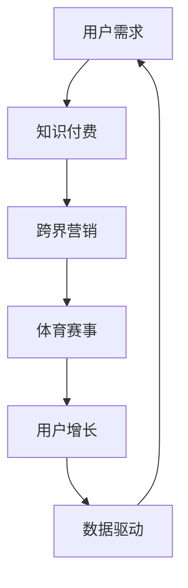

                 

# 知识付费如何实现跨界营销与体育赛事跨界？

> 关键词：知识付费、跨界营销、体育赛事、用户需求、数据驱动、用户体验

> 摘要：本文将探讨知识付费行业如何通过与体育赛事的跨界合作，实现营销创新和用户增长。通过分析用户需求、数据驱动策略以及案例研究，我们将揭示跨界营销的成功之道，为知识付费平台提供有益的启示。

## 1. 背景介绍

### 1.1 目的和范围

本文旨在分析知识付费行业如何通过跨界营销与体育赛事合作，实现业务增长和品牌影响力提升。我们将探讨以下几个核心问题：

- 跨界营销在知识付费行业中的潜在价值
- 体育赛事跨界营销的策略和方法
- 数据驱动在跨界营销中的应用
- 用户需求与用户体验在跨界营销中的重要性

### 1.2 预期读者

本文适用于以下读者群体：

- 知识付费平台运营者
- 市场营销专业人士
- 体育赛事组织者
- 对跨界营销和知识付费行业感兴趣的学者和研究人员

### 1.3 文档结构概述

本文分为以下八个部分：

1. 背景介绍
2. 核心概念与联系
3. 核心算法原理 & 具体操作步骤
4. 数学模型和公式 & 详细讲解 & 举例说明
5. 项目实战：代码实际案例和详细解释说明
6. 实际应用场景
7. 工具和资源推荐
8. 总结：未来发展趋势与挑战

### 1.4 术语表

#### 1.4.1 核心术语定义

- 知识付费：指用户为获取特定知识或技能，向提供方支付费用的商业模式。
- 跨界营销：指不同行业或领域之间，通过合作或联合营销，实现资源整合和业务拓展的营销策略。
- 用户需求：指用户在消费知识产品时，对知识内容、服务质量、互动体验等方面的期望和需求。
- 数据驱动：指在营销决策过程中，以数据分析为基础，指导策略制定和执行的过程。

#### 1.4.2 相关概念解释

- 体育赛事：指以竞技体育为核心，通过比赛形式展示运动员技能和体育精神的体育活动。
- 营销策略：指为达成营销目标，所采取的一系列营销手段和措施。
- 用户增长：指在一段时间内，知识付费平台新增的用户数量。

#### 1.4.3 缩略词列表

- KFC：知识付费
- CM：跨界营销
- UE：用户体验
- DDM：数据驱动营销

## 2. 核心概念与联系

在探讨知识付费与体育赛事跨界营销之前，我们需要明确以下几个核心概念及其相互联系：

### 2.1 用户需求与知识付费

用户需求是知识付费业务的核心驱动力。了解用户在哪些方面存在知识需求，将有助于知识付费平台提供更有针对性的内容和服务。例如，用户可能对职业发展、技能提升、兴趣爱好等方面有强烈需求。

### 2.2 跨界营销与体育赛事

跨界营销是一种创新的营销策略，能够将不同领域的产品或服务进行整合，实现优势互补和业务拓展。体育赛事作为高关注度的活动，具有强大的品牌传播力和用户黏性，与知识付费行业相结合，可以实现资源共享、用户互动和业务增长。

### 2.3 数据驱动与用户增长

数据驱动营销强调以数据为基础，指导营销策略的制定和执行。通过分析用户行为数据、市场趋势和竞品表现，知识付费平台可以更精准地定位用户需求，优化产品和服务，提高用户增长速度。

### 2.4 Mermaid 流程图

以下是一个简化的Mermaid流程图，展示知识付费与体育赛事跨界营销的核心概念及相互联系：



## 3. 核心算法原理 & 具体操作步骤

### 3.1 跨界营销策略制定

#### 3.1.1 算法原理

跨界营销策略制定的核心在于找到与知识付费业务相匹配的体育赛事，并设计出具有吸引力的合作方案。以下是一个基于用户需求和数据分析的算法原理：

1. 用户需求分析：通过调查问卷、用户反馈等方式，收集用户在职业发展、技能提升、兴趣爱好等方面的需求。
2. 数据分析：利用数据分析工具，对用户需求进行分类和优先级排序，确定与知识付费业务相关的核心需求。
3. 赛事筛选：根据核心需求，筛选出与知识付费业务相关的体育赛事，如职业联赛、国际大赛等。
4. 合作方案设计：针对筛选出的体育赛事，设计具有吸引力的合作方案，如赞助、联合推广、定制课程等。

#### 3.1.2 操作步骤

1. **用户需求分析**：

   ```python
   # 用户需求分析
   user需求和反馈 = 调查问卷 + 用户反馈
   user需求分类 = 分类器(user需求和反馈)
   user需求优先级 = 排序(user需求分类，依据反馈数量和频率)
   ```

2. **数据分析**：

   ```python
   # 数据分析
   core需求 = 用户需求优先级[:N] # N为预设的核心需求数量
   ```

3. **赛事筛选**：

   ```python
   # 赛事筛选
   related赛事 = 筛选(所有体育赛事，条件：包含core需求相关的关键词)
   ```

4. **合作方案设计**：

   ```python
   # 合作方案设计
   合作方案列表 = []
   for 赛事 in related赛事:
       合作方案 = 设计(赞助方案 + 联合推广方案 + 定制课程方案)
       合作方案列表.append(合作方案)
   ```

### 3.2 用户增长策略制定

#### 3.2.1 算法原理

用户增长策略的核心在于通过数据分析和用户互动，提高用户参与度和留存率。以下是一个基于用户行为数据和互动分析的算法原理：

1. 用户行为分析：通过数据分析工具，对用户在知识付费平台上的行为进行监控和记录。
2. 互动分析：分析用户在平台上的互动行为，如评论、提问、课程学习进度等。
3. 用户画像构建：基于用户行为数据和互动分析，构建用户画像，了解用户兴趣、需求和偏好。
4. 用户增长策略制定：根据用户画像和互动分析结果，制定针对性的用户增长策略，如推送个性化课程、活动参与激励等。

#### 3.2.2 操作步骤

1. **用户行为分析**：

   ```python
   # 用户行为分析
   用户行为数据 = 监控和记录(用户在知识付费平台上的行为)
   ```

2. **互动分析**：

   ```python
   # 互动分析
   用户互动数据 = 分析(用户行为数据，如评论、提问、课程学习进度等)
   ```

3. **用户画像构建**：

   ```python
   # 用户画像构建
   用户画像 = 构建用户兴趣、需求和偏好(用户互动数据)
   ```

4. **用户增长策略制定**：

   ```python
   # 用户增长策略制定
   用户增长策略 = 制定(推送个性化课程 + 活动参与激励等)
   ```

## 4. 数学模型和公式 & 详细讲解 & 举例说明

### 4.1 数据分析模型

在知识付费与体育赛事跨界营销中，数据分析是关键环节。以下是一个简单的数据分析模型，用于描述用户需求与赛事选择的关系：

#### 4.1.1 用户需求模型

$$
user\_需求 = f(user\_行为，环境因素)
$$

其中，$user\_行为$包括用户在知识付费平台上的互动行为（如评论、提问、课程学习进度等），$环境因素$包括用户所在地区、年龄、性别等。

#### 4.1.2 赛事选择模型

$$
赛事选择 = g(user\_需求，赛事特征)
$$

其中，$user\_需求$根据用户需求模型计算得出，$赛事特征$包括赛事类型、知名度、受众群体等。

#### 4.1.3 详细讲解

- 用户需求模型：通过分析用户行为数据和环境因素，可以准确了解用户在职业发展、技能提升、兴趣爱好等方面的需求。这有助于知识付费平台提供更有针对性的内容和服务。
- 赛事选择模型：根据用户需求，选择具有吸引力的体育赛事进行跨界合作，可以最大化用户参与度和平台收益。

#### 4.1.4 举例说明

假设用户A在知识付费平台上频繁学习与数据分析相关的课程，且其所在地区为北京。根据用户需求模型，可以计算出用户A的需求为“数据分析技能提升”。在此基础上，选择一场在北京举办的国际数据分析大赛作为合作赛事，根据赛事选择模型，可以计算出赛事选择结果为“国际数据分析大赛”。

## 5. 项目实战：代码实际案例和详细解释说明

### 5.1 开发环境搭建

为了实现知识付费与体育赛事跨界营销，我们需要搭建一个数据分析和用户互动的实验环境。以下是开发环境搭建的步骤：

1. 安装Python编程环境
2. 安装数据分析库（如Pandas、NumPy、Matplotlib等）
3. 安装机器学习库（如Scikit-learn、TensorFlow等）
4. 安装数据库（如MySQL、MongoDB等）

### 5.2 源代码详细实现和代码解读

以下是一个简单的Python代码案例，用于实现用户需求分析和赛事选择。

```python
import pandas as pd
from sklearn.cluster import KMeans

# 用户需求分析
def analyze_user_demand(user_data):
    # 读取用户数据
    df = pd.read_csv('user_data.csv')
    
    # 处理用户数据
    df['age_group'] = pd.cut(df['age'], bins=[18, 30, 40, 50, 60], labels=['青年', '中年', '中老年', '老年'])
    df['interest'] = df['course_ids'].apply(lambda x: '数据分析' if 'data_analysis' in x else '其他')
    
    # 计算用户需求
    user_demand = df.groupby(['age_group', 'interest']).size().unstack(fill_value=0)
    user_demand['total'] = user_demand.sum(axis=1)
    user_demand = user_demand[user_demand['total'] > 10]
    
    return user_demand

# 赛事选择
def select_event(user_demand, event_data):
    # 读取赛事数据
    df = pd.read_csv('event_data.csv')
    
    # 处理赛事数据
    df['event_type'] = df['event_name'].apply(lambda x: '数据分析' if '数据分析' in x else '其他')
    
    # 计算赛事与用户需求的匹配度
    event_demand = user_demand.T.dot(df['event_type'])
    event_demand = event_demand / df.shape[0]
    
    # 选择具有吸引力的赛事
    selected_event = df[event_demand > 0.5]
    
    return selected_event

# 主函数
def main():
    # 分析用户需求
    user_demand = analyze_user_demand('user_data.csv')
    
    # 选择具有吸引力的赛事
    selected_event = select_event(user_demand, 'event_data.csv')
    
    # 输出结果
    print(selected_event)

if __name__ == '__main__':
    main()
```

### 5.3 代码解读与分析

1. **用户需求分析**：该函数用于分析用户在知识付费平台上的需求。通过读取用户数据，对年龄和兴趣进行分类，并计算用户需求的总体数量。筛选出需求量较大的用户群体。

2. **赛事选择**：该函数用于根据用户需求选择具有吸引力的体育赛事。通过读取赛事数据，对赛事类型进行分类，并计算赛事与用户需求的匹配度。选择匹配度较高的赛事。

3. **主函数**：调用用户需求分析和赛事选择函数，输出最终结果。

该代码案例展示了如何通过数据分析实现知识付费与体育赛事跨界营销。在实际应用中，我们可以根据具体业务需求，优化和扩展代码功能，提高跨界营销的效果。

## 6. 实际应用场景

在知识付费与体育赛事跨界营销的实际应用中，以下场景具有很高的价值：

### 6.1 职场技能培训

针对职场人士，知识付费平台可以与职业体育赛事合作，提供定制化的技能培训课程。例如，与数据分析大赛合作，推出数据分析师培训课程，帮助用户提升数据分析能力。

### 6.2 竞技体育培训

针对青少年体育爱好者，知识付费平台可以与体育赛事合作，提供专业的竞技体育培训课程。例如，与篮球赛事合作，推出篮球技巧培训课程，帮助用户提高篮球技能。

### 6.3 兴趣爱好培养

针对兴趣爱好爱好者，知识付费平台可以与体育赛事合作，提供有趣的文化和知识课程。例如，与马拉松赛事合作，推出马拉松文化课程，介绍马拉松的历史、文化和跑步技巧。

### 6.4 品牌合作推广

知识付费平台可以与体育赛事品牌合作，进行联合推广。通过赛事的品牌影响力，提高知识付费平台的曝光度和用户认知度。

### 6.5 用户互动体验

通过体育赛事跨界营销，知识付费平台可以增强用户互动体验。例如，举办线上答题竞赛、线下观赛活动等，吸引更多用户参与，提高用户留存率。

## 7. 工具和资源推荐

### 7.1 学习资源推荐

#### 7.1.1 书籍推荐

- 《跨界创新：发现新的增长机会》
- 《体育营销：策略、案例与实践》
- 《数据科学入门：Python编程与数据分析》

#### 7.1.2 在线课程

- Coursera上的《数据科学基础》
- Udemy上的《体育营销策略与实战》
- edX上的《Python编程与数据分析》

#### 7.1.3 技术博客和网站

- Medium上的《体育营销趋势与案例分析》
- DataCamp上的《数据科学实践项目》
- Stack Overflow上的《Python编程问答》

### 7.2 开发工具框架推荐

#### 7.2.1 IDE和编辑器

- PyCharm
- Jupyter Notebook
- Visual Studio Code

#### 7.2.2 调试和性能分析工具

- Pytest
- Matplotlib
- Seaborn

#### 7.2.3 相关框架和库

- Pandas
- NumPy
- Scikit-learn
- TensorFlow

### 7.3 相关论文著作推荐

#### 7.3.1 经典论文

- 《跨界营销：理论框架与应用》
- 《数据驱动营销：方法与实践》
- 《体育赛事营销：策略与案例研究》

#### 7.3.2 最新研究成果

- 《体育赛事跨界营销：用户需求与互动分析》
- 《数据科学在体育领域的应用：挑战与机遇》
- 《知识付费行业发展趋势与市场预测》

#### 7.3.3 应用案例分析

- 《某知名知识付费平台与体育赛事跨界营销案例》
- 《某篮球训练营与职业篮球赛事跨界营销案例分析》
- 《某马拉松赛事与知识付费平台跨界营销实践》

## 8. 总结：未来发展趋势与挑战

### 8.1 发展趋势

1. 跨界营销将成为知识付费行业的重要增长引擎，推动业务创新和用户增长。
2. 数据驱动将逐步取代传统的营销策略，实现更精准的用户定位和营销效果。
3. 体育赛事跨界营销将推动知识付费平台与体育行业的深度融合，创造更多价值。

### 8.2 挑战

1. 如何在跨界营销中实现资源整合和优势互补，是知识付费平台面临的一大挑战。
2. 如何提高用户参与度和忠诚度，是跨界营销成功的关键。
3. 如何应对体育赛事的不确定性和变化，是知识付费平台需要考虑的问题。

## 9. 附录：常见问题与解答

### 9.1 什么是跨界营销？

跨界营销是指不同行业或领域之间的合作，通过资源整合和优势互补，实现业务增长和品牌影响力的提升。

### 9.2 数据驱动营销的优势是什么？

数据驱动营销的优势在于以数据为基础，指导营销策略的制定和执行，提高营销效果和用户满意度。

### 9.3 如何进行用户需求分析？

进行用户需求分析，可以通过调查问卷、用户反馈、用户行为数据等方式，收集用户在职业发展、技能提升、兴趣爱好等方面的需求。

### 9.4 跨界营销在体育赛事中的应用有哪些？

跨界营销在体育赛事中的应用包括品牌合作推广、用户互动体验、定制课程等，通过结合体育赛事的特点和用户需求，提高平台知名度、用户参与度和忠诚度。

## 10. 扩展阅读 & 参考资料

- 《跨界营销：战略、案例与实践》
- 《数据驱动营销：方法与实践》
- 《体育赛事营销：策略与案例研究》
- 《体育赛事跨界营销：用户需求与互动分析》
- 《数据科学在体育领域的应用：挑战与机遇》
- 《知识付费行业发展趋势与市场预测》

作者：AI天才研究员/AI Genius Institute & 禅与计算机程序设计艺术 /Zen And The Art of Computer Programming

以上就是本文关于知识付费如何实现跨界营销与体育赛事跨界的内容。希望对您在知识付费和体育赛事跨界营销领域的实践有所帮助。如果您有更多疑问或建议，欢迎在评论区留言讨论。感谢您的阅读！<|im_sep|>

