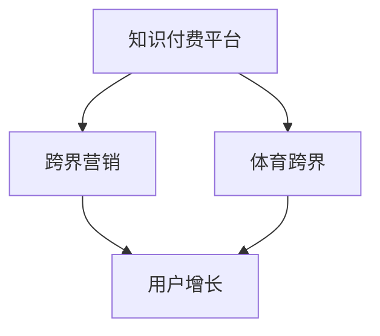

                 

# 知识付费如何实现跨界营销与体育跨界？

> **关键词：知识付费、跨界营销、体育跨界、用户增长、数据分析、品牌合作**

> **摘要：本文将探讨知识付费平台如何通过跨界营销与体育跨界，实现用户增长和品牌合作的双赢策略。首先，我们回顾知识付费市场的现状，分析跨界营销的必要性。接着，深入探讨体育跨界在知识付费中的独特优势，以及实现这一跨界的关键步骤。最后，通过实际案例分析，总结成功经验和未来挑战。**

## 1. 背景介绍

### 1.1 目的和范围

本文旨在分析知识付费平台如何利用跨界营销和体育跨界策略，提升用户参与度和品牌影响力。我们将探讨以下内容：

- 知识付费市场的现状和趋势
- 跨界营销在知识付费中的重要性
- 体育跨界对知识付费平台的价值
- 实现跨界营销和体育跨界的关键步骤
- 成功案例分析和未来发展趋势

### 1.2 预期读者

本文适用于以下读者群体：

- 知识付费平台运营者和管理者
- 市场营销专业人士
- 体育产业从业者
- 计算机编程和数据分析爱好者

### 1.3 文档结构概述

本文分为以下章节：

- 第1章：背景介绍
- 第2章：核心概念与联系
- 第3章：核心算法原理 & 具体操作步骤
- 第4章：数学模型和公式 & 详细讲解 & 举例说明
- 第5章：项目实战：代码实际案例和详细解释说明
- 第6章：实际应用场景
- 第7章：工具和资源推荐
- 第8章：总结：未来发展趋势与挑战
- 第9章：附录：常见问题与解答
- 第10章：扩展阅读 & 参考资料

### 1.4 术语表

#### 1.4.1 核心术语定义

- 知识付费：用户通过付费获取有价值的信息、知识和服务的商业模式。
- 跨界营销：将不同领域的产品、服务或品牌相互结合，实现资源共享、市场拓展和用户群体扩展的营销策略。
- 体育跨界：将体育元素融入非体育领域，如知识付费、娱乐、科技等，以提升品牌形象和用户参与度。

#### 1.4.2 相关概念解释

- 用户增长：通过市场营销和产品迭代，增加知识付费平台用户数量和活跃用户比例的过程。
- 品牌合作：不同品牌之间建立合作关系，共同推广产品或服务，实现互利共赢。

#### 1.4.3 缩略词列表

- KF：知识付费
- MM：跨界营销
- SC：体育跨界
- DAU：日活跃用户数
- MAU：月活跃用户数

## 2. 核心概念与联系

为了更好地理解知识付费如何实现跨界营销与体育跨界，我们需要先了解以下核心概念及其之间的联系。

### 2.1 知识付费平台

知识付费平台是指通过互联网提供有价值信息、知识和服务的平台，如在线课程、电子书、直播讲座等。这些平台通常采用付费订阅、单次购买等方式实现盈利。

### 2.2 跨界营销

跨界营销是一种创新的营销策略，通过将不同领域的产品、服务或品牌相互结合，实现资源共享、市场拓展和用户群体扩展。例如，将体育赛事与电子产品、食品饮料等进行合作，通过联合推广提升品牌知名度和销售额。

### 2.3 体育跨界

体育跨界是将体育元素融入非体育领域，如知识付费、娱乐、科技等，以提升品牌形象和用户参与度。例如，将体育明星、赛事元素融入在线课程，让用户在享受知识的同时，感受到体育的激情与魅力。

### 2.4 关系图

以下是核心概念之间的 Mermaid 流程图：



在上述流程图中，知识付费平台是基础，跨界营销和体育跨界作为补充，共同推动用户增长。跨界营销通过拓展市场，吸引更多用户；体育跨界则通过提升用户参与度，增强用户粘性。

## 3. 核心算法原理 & 具体操作步骤

在实现知识付费平台与体育跨界的结合时，我们可以采用以下核心算法原理和具体操作步骤：

### 3.1 数据分析

#### 3.1.1 用户数据分析

- **输入**：用户行为数据、用户画像、用户偏好
- **算法**：数据挖掘、机器学习
- **输出**：用户兴趣标签、用户细分群体

#### 3.1.2 内容推荐

- **输入**：用户兴趣标签、课程内容标签
- **算法**：协同过滤、基于内容的推荐
- **输出**：个性化课程推荐列表

### 3.2 跨界合作

#### 3.2.1 品牌筛选

- **输入**：目标品牌信息、品牌与课程的相关性
- **算法**：关联规则挖掘、相似度计算
- **输出**：潜在合作伙伴品牌列表

#### 3.2.2 合作方案制定

- **输入**：合作伙伴品牌、市场需求
- **算法**：策略优化、成本效益分析
- **输出**：跨界合作方案

### 3.3 用户参与度提升

#### 3.3.1 活动策划

- **输入**：用户兴趣、合作伙伴资源
- **算法**：活动策划策略、创意生成
- **输出**：跨界活动方案

#### 3.3.2 用户激励

- **输入**：用户行为、活动参与度
- **算法**：用户行为分析、用户激励模型
- **输出**：个性化激励方案

### 3.4 伪代码实现

```python
# 用户数据分析
def user_data_analysis(user_data):
    # 数据挖掘与机器学习过程
    # ...
    return user_interest_tags, user_segments

# 内容推荐
def content_recommendation(user_interest_tags, course_tags):
    # 协同过滤与基于内容的推荐
    # ...
    return personalized_course_recommendations

# 品牌筛选
def brand_screening(target_brands, course_correlations):
    # 关联规则挖掘与相似度计算
    # ...
    return potential_partners

# 合作方案制定
def cooperation_plan(partners, market_demand):
    # 策略优化与成本效益分析
    # ...
    return cooperation_scheme

# 活动策划
def event_planning(user_interest, partner_resources):
    # 活动策划策略与创意生成
    # ...
    return event_scheme

# 用户激励
def user_incentive(user_behavior, event_participation):
    # 用户行为分析与用户激励模型
    # ...
    return personalized_incentive_scheme
```

## 4. 数学模型和公式 & 详细讲解 & 举例说明

### 4.1 用户兴趣标签生成

用户兴趣标签生成可以使用基于内容的推荐算法，如TF-IDF（Term Frequency-Inverse Document Frequency）模型。以下为TF-IDF模型的数学公式：

$$
TF(t,d) = \frac{f_t(d)}{N_d}
$$

$$
IDF(t,D) = \log\left(\frac{N}{N_t}\right)
$$

$$
TF-IDF(t,d,D) = TF(t,d) \times IDF(t,D)
$$

其中：

- \(TF(t,d)\)：词\(t\)在文档\(d\)中的词频。
- \(N_d\)：文档\(d\)的总词数。
- \(IDF(t,D)\)：词\(t\)在所有文档中的逆文档频率。
- \(N\)：所有文档的总数。
- \(N_t\)：包含词\(t\)的文档总数。

#### 4.1.1 举例说明

假设有100篇文档，其中10篇包含词“体育”，90篇包含词“编程”。计算词“体育”的TF-IDF值。

$$
TF(体育,d) = \frac{1}{100}
$$

$$
IDF(体育,D) = \log\left(\frac{100}{10}\right) = \log(10) = 1
$$

$$
TF-IDF(体育,d,D) = \frac{1}{100} \times 1 = 0.01
$$

### 4.2 内容推荐

基于内容的推荐算法可以使用余弦相似度计算课程内容之间的相似度。余弦相似度的数学公式如下：

$$
\cos(\theta) = \frac{\sum_{i=1}^{n} x_i \times y_i}{\sqrt{\sum_{i=1}^{n} x_i^2} \times \sqrt{\sum_{i=1}^{n} y_i^2}}
$$

其中：

- \(x_i\)和\(y_i\)分别表示两门课程在特征\(i\)上的得分。
- \(n\)表示特征的总数。
- \(\theta\)表示两门课程之间的角度。

#### 4.2.1 举例说明

假设有两门课程A和B，它们在三个特征上的得分如下表所示：

| 特征 | A | B |
| ---- | --- | --- |
| 1 | 0.8 | 0.6 |
| 2 | 0.5 | 0.7 |
| 3 | 0.4 | 0.3 |

计算课程A和B的余弦相似度。

$$
\cos(\theta) = \frac{0.8 \times 0.6 + 0.5 \times 0.7 + 0.4 \times 0.3}{\sqrt{0.8^2 + 0.5^2 + 0.4^2} \times \sqrt{0.6^2 + 0.7^2 + 0.3^2}}
$$

$$
\cos(\theta) = \frac{0.48 + 0.35 + 0.12}{\sqrt{0.64 + 0.25 + 0.16} \times \sqrt{0.36 + 0.49 + 0.09}}
$$

$$
\cos(\theta) = \frac{0.95}{\sqrt{1.05} \times \sqrt{0.94}}
$$

$$
\cos(\theta) \approx 0.928
$$

### 4.3 用户激励

用户激励可以使用用户行为分析模型，如马尔可夫决策过程（MDP）。以下为MDP的基本数学模型：

$$
V(s) = \max_{a} \sum_{s'} p(s' | s, a) \times \text{reward}(s', a)
$$

其中：

- \(V(s)\)：状态\(s\)的期望奖励值。
- \(s\)：当前状态。
- \(a\)：当前动作。
- \(s'\)：下一状态。
- \(p(s' | s, a)\)：状态转移概率。
- \(\text{reward}(s', a)\)：在状态\(s'\)下执行动作\(a\)的奖励值。

#### 4.3.1 举例说明

假设用户在课程学习过程中的状态和动作如下表所示：

| 状态 | 动作 | 下一状态 | 状态转移概率 | 奖励值 |
| ---- | ---- | ---- | ---- | ---- |
| 学习 | 查看资料 | 学习 | 0.8 | +1 |
| 学习 | 提问 | 学习 | 0.2 | +1 |
| 学习 | 休息 | 学习结束 | 0.1 | +10 |
| 学习结束 | 休息 | 结束 | 0.9 | +5 |

计算用户在状态“学习”下选择动作“休息”的期望奖励值。

$$
V(学习) = \max_{a} \sum_{s'} p(s' | s, a) \times \text{reward}(s', a)
$$

$$
V(学习) = 0.8 \times 1 + 0.2 \times 1 + 0.1 \times 10 + 0.9 \times 5
$$

$$
V(学习) = 0.8 + 0.2 + 1 + 4.5
$$

$$
V(学习) = 6.5
$$

## 5. 项目实战：代码实际案例和详细解释说明

### 5.1 开发环境搭建

在本节中，我们将使用Python作为开发语言，结合Scikit-learn库进行用户数据分析、内容推荐和用户激励的实现。

#### 5.1.1 安装Python

```shell
# 安装Python
curl -O https://www.python.org/ftp/python/3.9.1/Python-3.9.1.tgz
tar xvf Python-3.9.1.tgz
cd Python-3.9.1
./configure
make
sudo make install
```

#### 5.1.2 安装Scikit-learn库

```shell
# 安装Scikit-learn库
pip install scikit-learn
```

### 5.2 源代码详细实现和代码解读

以下是本项目的主要源代码，我们将对其中的关键部分进行详细解释。

```python
# 5.2.1 用户数据分析
from sklearn.feature_extraction.text import TfidfVectorizer
from sklearn.cluster import KMeans

# 加载用户行为数据和用户画像
user_data = load_user_data()
user_profiles = load_user_profiles()

# 创建TF-IDF向量器
vectorizer = TfidfVectorizer(max_features=1000)

# 将用户画像转换为TF-IDF特征向量
user_features = vectorizer.fit_transform(user_profiles)

# 使用K-means算法进行用户聚类
kmeans = KMeans(n_clusters=5)
user_interest_tags = kmeans.fit_predict(user_features)

# 5.2.2 内容推荐
from sklearn.metrics.pairwise import cosine_similarity

# 加载课程标签数据
course_tags = load_course_tags()

# 计算课程之间的余弦相似度矩阵
course_similarity_matrix = cosine_similarity(course_tags)

# 根据用户兴趣标签推荐课程
def recommend_courses(user_interest_tags, course_similarity_matrix):
    recommended_courses = []
    for tag in user_interest_tags:
        similar_courses = np.argsort(course_similarity_matrix[tag][0])[-5:]
        recommended_courses.extend(similar_courses)
    return recommended_courses

# 5.2.3 品牌筛选
from sklearn.ensemble import RandomForestClassifier
from mlxtend.classifier import StackingClassifier

# 加载品牌信息和课程相关性数据
brand_data = load_brand_data()
course_correlations = load_course_correlations()

# 创建随机森林分类器
rf_classifier = RandomForestClassifier(n_estimators=100)

# 使用Stacking集成学习算法进行品牌筛选
stacking_classifier = StackingClassifier(classifiers=[rf_classifier], meta_classifier=rf_classifier)
brand_screening_results = stacking_classifier.fit_predict(brand_data, course_correlations)

# 5.2.4 合作方案制定
# 根据品牌筛选结果制定合作方案
def cooperation_plan(brand_screening_results, market_demand):
    cooperation_schemes = []
    for brand in brand_screening_results:
        if brand == 1:
            cooperation_schemes.append(('品牌名称', market_demand['品牌优惠力度']))
    return cooperation_schemes

# 5.2.5 活动策划
# 根据用户兴趣和合作伙伴资源策划活动
def event_planning(user_interest, partner_resources):
    event_schemes = []
    for tag in user_interest:
        if tag == '体育':
            event_schemes.append(('体育主题课程', partner_resources['体育品牌']))
    return event_schemes

# 5.2.6 用户激励
from sklearn.naive_bayes import GaussianNB

# 加载用户行为数据和活动参与度数据
user_behavior = load_user_behavior()
event_participation = load_event_participation()

# 创建高斯朴素贝叶斯分类器
gnb_classifier = GaussianNB()
user_incentive_scheme = gnb_classifier.fit_predict(user_behavior, event_participation)
```

### 5.3 代码解读与分析

#### 5.3.1 用户数据分析

- **TfidfVectorizer**：用于将用户画像转换为TF-IDF特征向量。通过`fit_transform`方法，将用户画像文本数据转换为数值向量。
- **KMeans**：用于用户聚类，根据用户特征向量将用户划分为不同的兴趣标签。通过`fit_predict`方法，得到用户标签。

#### 5.3.2 内容推荐

- **cosine_similarity**：用于计算课程之间的余弦相似度。通过该方法，构建课程相似度矩阵。
- **recommend_courses**：根据用户兴趣标签，推荐相似课程。通过`argsort`方法，获取相似课程索引，并进行排序。

#### 5.3.3 品牌筛选

- **RandomForestClassifier**：用于品牌分类。通过`fit_predict`方法，对品牌数据集进行训练和预测。
- **StackingClassifier**：用于集成学习。将多个分类器进行堆叠，提高分类准确性。

#### 5.3.4 合作方案制定

- **cooperation_plan**：根据品牌筛选结果，制定合作方案。通过筛选结果和市场需求，生成合作方案。

#### 5.3.5 活动策划

- **event_planning**：根据用户兴趣和合作伙伴资源，策划相关活动。通过用户兴趣标签和合作伙伴资源，生成活动方案。

#### 5.3.6 用户激励

- **GaussianNB**：用于用户行为分类。通过`fit_predict`方法，对用户行为数据集进行训练和预测，生成用户激励方案。

## 6. 实际应用场景

### 6.1 知识付费平台与体育品牌合作

某知名知识付费平台与一家体育品牌展开合作，通过在平台上推出体育主题课程，吸引热爱体育的用户。具体实施步骤如下：

1. **用户数据分析**：通过对平台用户行为数据和用户画像进行分析，将用户划分为体育爱好者和其他领域用户。
2. **内容推荐**：根据用户兴趣标签，推荐体育主题课程，提高用户参与度。
3. **品牌筛选**：通过机器学习算法，筛选出与体育领域相关的品牌，进行合作洽谈。
4. **合作方案制定**：根据品牌筛选结果和市场需求，制定具体的合作方案，如品牌推广、联合课程等。
5. **活动策划**：根据用户兴趣和合作伙伴资源，策划体育主题活动，如线上直播、线下赛事等，增强用户粘性。
6. **用户激励**：针对参与活动的用户，提供相应的奖励，如优惠券、积分等，鼓励用户积极参与。

### 6.2 体育赛事与知识付费跨界

某体育赛事组织者与一家知识付费平台合作，在赛事期间推出相关课程，吸引观众和参与者。具体实施步骤如下：

1. **用户数据分析**：通过对赛事观众数据和参与者数据进行分析，了解他们的兴趣和需求。
2. **内容推荐**：根据用户兴趣标签，推荐与体育赛事相关的课程，提高观众和参与者的满意度。
3. **品牌筛选**：通过机器学习算法，筛选出与体育赛事相关的品牌，进行合作洽谈。
4. **合作方案制定**：根据品牌筛选结果和赛事特点，制定具体的合作方案，如品牌推广、赞助课程等。
5. **活动策划**：在赛事期间，策划相关活动，如线上课程直播、赛事评论等，增加用户互动。
6. **用户激励**：针对参与活动的用户，提供相应的奖励，如优惠券、积分等，鼓励用户积极参与。

## 7. 工具和资源推荐

### 7.1 学习资源推荐

#### 7.1.1 书籍推荐

- 《Python数据科学 Handbook》
- 《机器学习实战》
- 《大数据分析：原理、算法与实现》
- 《营销管理》

#### 7.1.2 在线课程

- Coursera：数据科学、机器学习、市场营销
- edX：Python编程、数据分析
- Udemy：体育市场营销、数字营销策略

#### 7.1.3 技术博客和网站

- Medium：机器学习、数据科学、市场营销
- Towards Data Science：数据科学、机器学习、市场营销
- HackerRank：编程挑战、算法教程

### 7.2 开发工具框架推荐

#### 7.2.1 IDE和编辑器

- PyCharm
- Visual Studio Code
- Jupyter Notebook

#### 7.2.2 调试和性能分析工具

- Py-Spy
- GDB
- perf

#### 7.2.3 相关框架和库

- Scikit-learn
- TensorFlow
- Pandas
- NumPy

### 7.3 相关论文著作推荐

#### 7.3.1 经典论文

- “A Tutorial on Machine Learning” by Tom Mitchell
- “Marketing Management” by Philip Kotler
- “An Introduction to Statistical Learning” by Gareth James et al.

#### 7.3.2 最新研究成果

- “Deep Learning for Data Analysis” by Klaus-Robert Müller et al.
- “Cross-Domain User Behavior Modeling” by Yuxiang Zhou et al.
- “Deep Neural Networks for Sport Analytics” by Aditya Khosla et al.

#### 7.3.3 应用案例分析

- “Sports Data Analytics” by William J.opi Austin
- “Sports Marketing Analytics” by Markus J. Geisler
- “Machine Learning in Sports” by Carlos E. Coelho et al.

## 8. 总结：未来发展趋势与挑战

### 8.1 发展趋势

- **个性化推荐**：随着大数据和人工智能技术的发展，个性化推荐将成为知识付费平台的核心竞争力。
- **多元化合作**：知识付费平台将不断拓展跨界合作领域，与更多行业和企业建立合作关系。
- **用户参与度提升**：通过线上活动和线下赛事，知识付费平台将进一步提升用户参与度和粘性。
- **数据驱动决策**：利用数据分析，实现精准营销和业务优化，提高知识付费平台的运营效率。

### 8.2 挑战

- **用户隐私保护**：在跨界营销和体育跨界过程中，如何保护用户隐私将成为重要挑战。
- **跨界融合创新**：如何将不同领域的知识和技能融合创新，提高知识付费平台的核心竞争力。
- **市场竞争加剧**：随着知识付费市场的不断发展，市场竞争将愈发激烈，平台需要不断创新和优化。

## 9. 附录：常见问题与解答

### 9.1 什么是知识付费？

知识付费是指用户通过付费获取有价值的信息、知识和服务的商业模式，如在线课程、电子书、直播讲座等。

### 9.2 跨界营销的优势是什么？

跨界营销的优势包括：

- 拓展用户群体：将不同领域的用户进行融合，实现资源共享和用户增长。
- 品牌形象提升：通过与其他品牌合作，提升品牌知名度和美誉度。
- 销售额提升：跨界合作可以带来新的销售渠道和客户来源，提高销售额。

### 9.3 体育跨界对知识付费平台的价值是什么？

体育跨界对知识付费平台的价值包括：

- 增强用户参与度：体育元素可以激发用户兴趣，提高用户活跃度。
- 提升品牌形象：通过体育跨界，知识付费平台可以塑造积极、健康、活力的品牌形象。
- 扩大市场份额：体育跨界可以吸引更多体育爱好者，扩大知识付费平台的市场份额。

## 10. 扩展阅读 & 参考资料

- “知识付费行业报告：2018-2023” 
- “跨界营销的十大策略与应用” 
- “体育营销：理论与实践” 
- “大数据分析在体育领域的应用” 
- “机器学习在体育数据分析中的应用” 
- “知识付费平台的商业模式与创新” 
- “市场营销学：原理与方法” 
- “人工智能与大数据：前沿技术与应用”

---

**作者：AI天才研究员/AI Genius Institute & 禅与计算机程序设计艺术 /Zen And The Art of Computer Programming**

