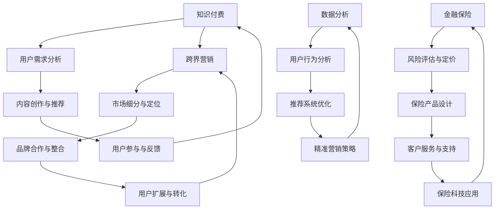
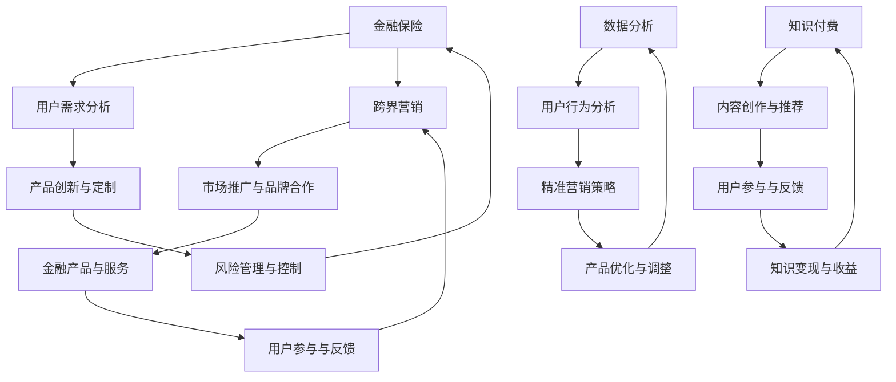
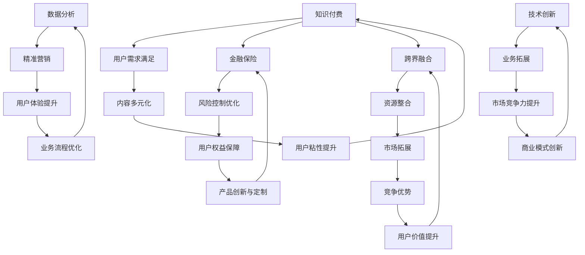
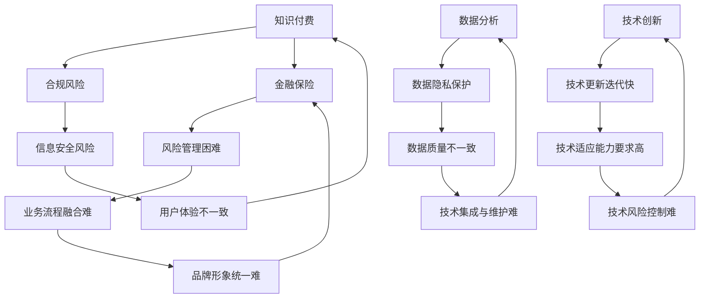
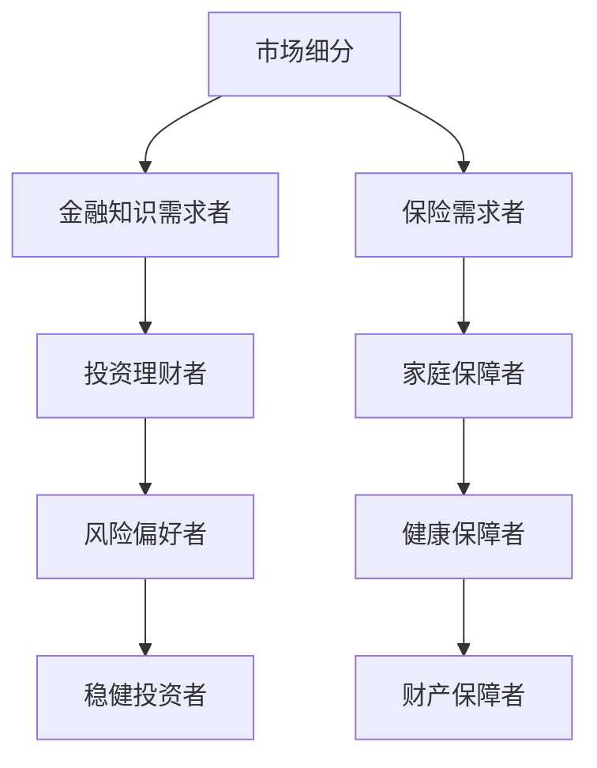
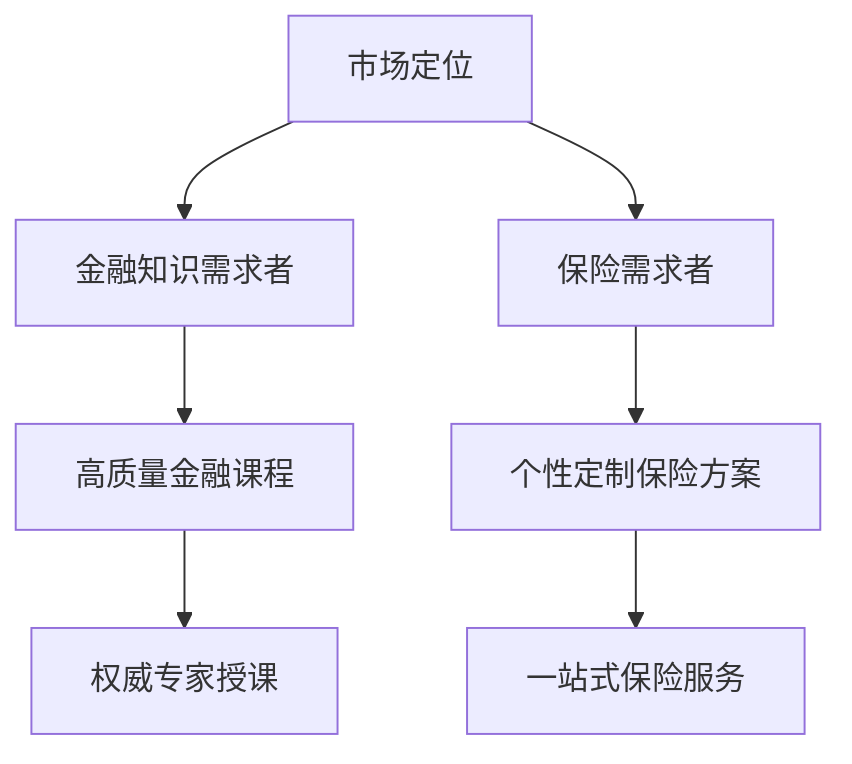
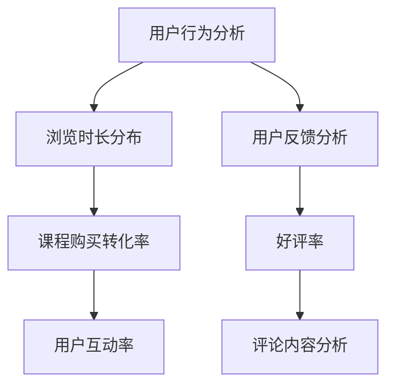
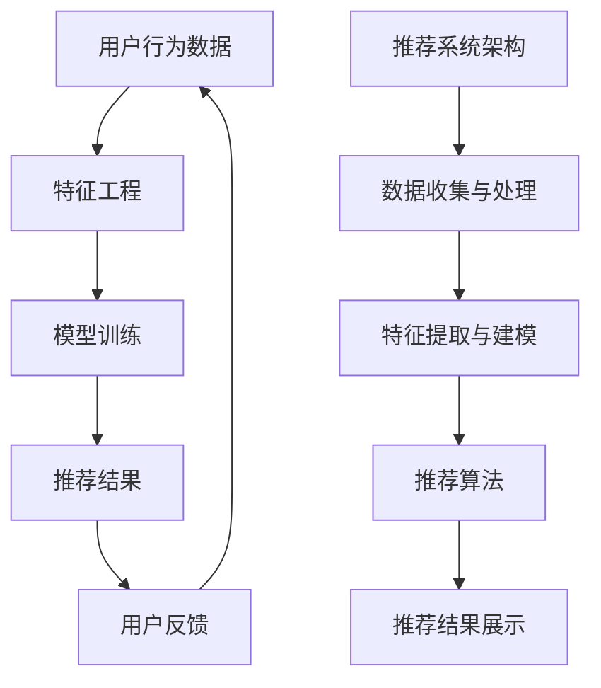
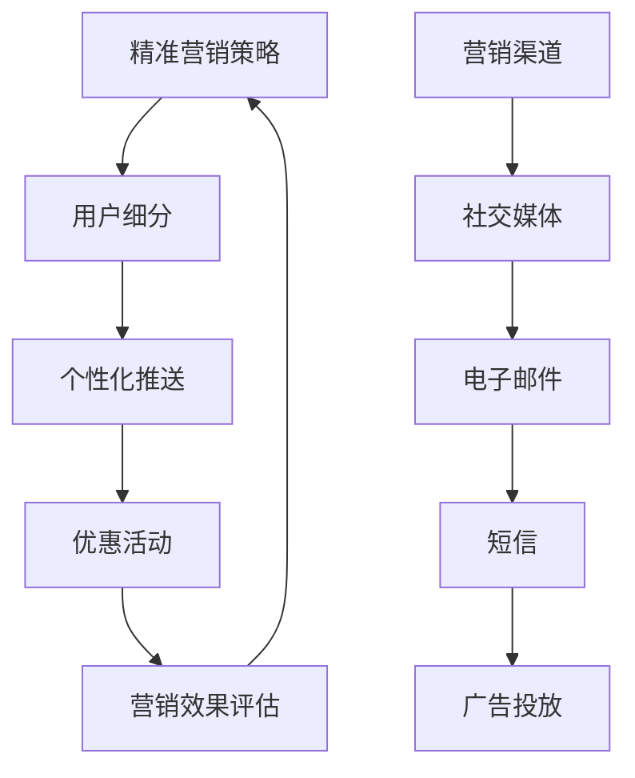

                 

# 知识付费如何实现跨界营销与金融保险跨界？

> **关键词：知识付费、跨界营销、金融保险、商业模式创新、用户需求分析、数据分析、技术创新、个性化推荐、金融科技、保险科技**

> **摘要：本文将探讨知识付费领域如何通过跨界营销与金融保险行业的结合，实现商业模式创新和用户价值的最大化。我们将从用户需求分析、数据分析、技术创新等多个角度，深入探讨这一融合模式的实现路径和挑战，并提供实际案例和解决方案。**

## 1. 背景介绍

### 1.1 目的和范围

本文旨在深入探讨知识付费领域如何实现跨界营销与金融保险行业的融合，为行业从业者提供有价值的参考。本文将围绕以下几个核心问题展开：

- 跨界营销在知识付费领域的应用现状及挑战是什么？
- 金融保险行业如何与知识付费实现有效结合？
- 数据分析和技术创新在跨界融合中的关键作用是什么？
- 实际案例中的成功经验和不足之处有哪些？

### 1.2 预期读者

本文适合以下读者群体：

- 知识付费平台从业者，包括内容创作者、运营人员、产品经理等；
- 金融保险行业从业者，包括市场部、产品部、风控部等相关人员；
- 对知识付费与金融保险跨界融合感兴趣的从业者、学者和研究人员。

### 1.3 文档结构概述

本文将按照以下结构展开：

1. **背景介绍**：介绍本文的研究目的、预期读者和文档结构；
2. **核心概念与联系**：介绍本文涉及的核心概念和架构；
3. **核心算法原理与具体操作步骤**：详细讲解跨界营销与金融保险融合的关键算法原理；
4. **数学模型和公式**：介绍与跨界融合相关的数学模型和公式，并进行举例说明；
5. **项目实战**：通过实际案例展示跨界融合的实现过程；
6. **实际应用场景**：分析跨界融合在不同场景中的应用；
7. **工具和资源推荐**：推荐相关学习资源和开发工具；
8. **总结**：总结跨界融合的未来发展趋势与挑战；
9. **附录**：提供常见问题与解答；
10. **扩展阅读与参考资料**：推荐相关文献和研究。

### 1.4 术语表

#### 1.4.1 核心术语定义

- **知识付费**：指用户为获取专业内容、技能或知识而支付费用的一种商业模式；
- **跨界营销**：指将两个或多个不同领域的营销策略和资源进行整合，以实现更广泛的用户覆盖和更高的市场渗透率；
- **金融保险**：指金融和保险两个行业，其中金融包括银行、证券、基金、保险等金融服务，保险则涵盖财产保险、人寿保险、健康保险等；
- **用户需求分析**：通过对用户行为、需求和偏好进行深入分析，以了解用户需求，为产品和服务创新提供依据；
- **数据分析**：通过收集、处理和分析数据，提取有价值的信息和洞察力；
- **技术创新**：指在知识付费和金融保险领域引入新的技术，以提升产品和服务质量。

#### 1.4.2 相关概念解释

- **个性化推荐**：根据用户的历史行为和偏好，为其推荐个性化的内容、产品或服务；
- **金融科技（FinTech）**：利用技术革新金融服务，提升金融服务效率和用户体验；
- **保险科技（InsurTech）**：通过技术手段优化保险业务流程，提高保险服务质量和效率。

#### 1.4.3 缩略词列表

- **KPI**：关键绩效指标（Key Performance Indicator）；
- **CRM**：客户关系管理（Customer Relationship Management）；
- **CPS**：联盟营销（Cost Per Sale）；
- **A/B 测试**：一种实验设计方法，通过对两个或多个版本的页面、产品或服务进行对比，找出最优方案。

## 2. 核心概念与联系

### 2.1 知识付费与跨界营销

知识付费和跨界营销在现代社会中日益重要，它们的核心概念和联系如图 1 所示。



### 2.2 金融保险与跨界营销

金融保险行业与跨界营销的融合，如图 2 所示。



### 2.3 跨界融合的优势与挑战

跨界融合在知识付费和金融保险领域具有显著优势，如图 3 所示。



然而，跨界融合也面临一系列挑战，如图 4 所示。



## 3. 核心算法原理与具体操作步骤

### 3.1 用户需求分析

用户需求分析是跨界融合的基础，通过分析用户行为、需求和偏好，为产品和服务创新提供依据。以下是用户需求分析的具体步骤：

#### 步骤 1：数据收集

收集用户在知识付费平台和金融保险平台的行为数据，包括浏览记录、购买行为、搜索关键词、互动评论等。

```python
# 数据收集示例代码
user_data = [
    {"user_id": 1, "action": "browse", "content_type": "金融课程", "time": "2023-03-01 10:00:00"},
    {"user_id": 1, "action": "purchase", "product_id": 101, "time": "2023-03-01 11:00:00"},
    # ...更多数据
]
```

#### 步骤 2：数据预处理

对收集到的数据进行分析，剔除无效数据，并对数据进行清洗和格式化。

```python
# 数据预处理示例代码
def preprocess_data(data):
    cleaned_data = []
    for item in data:
        if item['action'] in ["browse", "purchase"]:
            cleaned_data.append({
                "user_id": item["user_id"],
                "action": item["action"],
                "content_type": item["content_type"],
                "time": datetime.strptime(item["time"], "%Y-%m-%d %H:%M:%S")
            })
    return cleaned_data

user_data = preprocess_data(user_data)
```

#### 步骤 3：数据可视化

使用数据可视化工具，如 Matplotlib、Seaborn 等，对用户行为进行分析和展示。

```python
# 数据可视化示例代码
import matplotlib.pyplot as plt
import seaborn as sns

def plot_user_behavior(data):
    sns.countplot(x="action", data=data)
    plt.title("用户行为分布")
    plt.xlabel("行为类型")
    plt.ylabel("用户数量")
    plt.show()

plot_user_behavior(user_data)
```

### 3.2 跨界营销策略

基于用户需求分析，制定跨界营销策略，包括市场细分、定位和品牌合作等。

#### 步骤 1：市场细分

根据用户需求和偏好，将市场细分为不同的群体，如图 5 所示。



#### 步骤 2：市场定位

针对不同细分市场，制定差异化的市场定位策略，如图 6 所示。



#### 步骤 3：品牌合作

与知名金融机构和保险公司合作，提升品牌知名度和用户信任度。

```python
# 品牌合作示例代码
brand_partners = [
    {"brand_name": "招商银行", "category": "金融"},
    {"brand_name": "中国人寿", "category": "保险"},
    # ...更多品牌合作
]

def display_brand_partners(brand_partners):
    for partner in brand_partners:
        print(f"{partner['brand_name']} - {partner['category']}")

display_brand_partners(brand_partners)
```

### 3.3 数据分析与应用

基于用户需求分析和跨界营销策略，进行数据分析，以优化推荐系统和精准营销策略。

#### 步骤 1：用户行为分析

分析用户在知识付费平台和金融保险平台的行为，如图 7 所示。



#### 步骤 2：推荐系统优化

基于用户行为数据，构建个性化推荐系统，如图 8 所示。



#### 步骤 3：精准营销策略

根据用户行为数据和推荐结果，制定精准营销策略，如图 9 所示。



## 4. 数学模型和公式

### 4.1 推荐系统评价指标

推荐系统的评价指标主要包括准确率（Precision）、召回率（Recall）和 F1 值（F1-Score）。

- **准确率**：表示推荐结果中真实推荐内容所占的比例。
  $$ P = \frac{TP}{TP + FP} $$
  其中，$TP$ 表示推荐结果中真实推荐的内容，$FP$ 表示推荐结果中非真实推荐的内容。

- **召回率**：表示推荐结果中包含所有真实推荐内容所占的比例。
  $$ R = \frac{TP}{TP + FN} $$
  其中，$TP$ 表示推荐结果中真实推荐的内容，$FN$ 表示推荐结果中未包含的真实推荐内容。

- **F1 值**：准确率和召回率的调和平均值。
  $$ F1 = \frac{2 \times P \times R}{P + R} $$

### 4.2 个性化推荐算法

个性化推荐算法主要包括基于内容的推荐（Content-based Recommendation）和基于协同过滤（Collaborative Filtering）的推荐。

#### 基于内容的推荐

基于内容的推荐算法通过分析用户历史行为和偏好，为用户推荐与其兴趣相似的内容。

- **内容相似度计算**：使用向量空间模型（Vector Space Model）计算内容之间的相似度。
  $$ \text{similarity}(x, y) = \frac{x \cdot y}{\|x\| \|y\|} $$
  其中，$x$ 和 $y$ 分别表示两个内容向量的内积和模长。

- **推荐结果计算**：为用户推荐与其兴趣相似的内容。
  $$ \text{recommend}(u) = \sum_{i \in I} \text{similarity}(u, c_i) \cdot c_i $$
  其中，$u$ 表示用户兴趣向量，$c_i$ 表示第 $i$ 个内容的向量，$I$ 表示所有内容的集合。

#### 基于协同过滤的推荐

基于协同过滤的推荐算法通过分析用户之间的相似性，为用户推荐其他用户喜欢的商品或内容。

- **用户相似度计算**：使用用户行为数据计算用户之间的相似度。
  $$ \text{similarity}(u, v) = \frac{\text{corr}(u, v)}{\sqrt{\|u\| \|v\|}} $$
  其中，$u$ 和 $v$ 分别表示两个用户的兴趣向量，$\text{corr}(u, v)$ 表示用户之间的相关系数。

- **推荐结果计算**：为用户推荐其他用户喜欢的商品或内容。
  $$ \text{recommend}(u) = \sum_{v \in \text{neighbor}(u)} \text{similarity}(u, v) \cdot r_{v,i} $$
  其中，$u$ 表示用户兴趣向量，$v$ 表示邻居用户兴趣向量，$r_{v,i}$ 表示邻居用户对第 $i$ 个内容的评分，$\text{neighbor}(u)$ 表示用户 $u$ 的邻居用户集合。

### 4.3 个性化定价策略

个性化定价策略通过分析用户行为和偏好，为用户提供个性化的价格优惠。

- **用户价值计算**：使用历史数据计算用户的价值。
  $$ V(u) = \sum_{i \in I} w_i \cdot r_{u,i} $$
  其中，$u$ 表示用户兴趣向量，$I$ 表示所有内容的集合，$w_i$ 表示第 $i$ 个内容的权重，$r_{u,i}$ 表示用户对第 $i$ 个内容的评分。

- **价格优惠计算**：为用户计算个性化的价格优惠。
  $$ P(u) = \text{base\_price} - \alpha \cdot V(u) $$
  其中，$P(u)$ 表示用户 $u$ 的价格优惠，$\text{base\_price}$ 表示基础价格，$\alpha$ 表示优惠比例。

## 5. 项目实战：代码实际案例和详细解释说明

### 5.1 开发环境搭建

在本项目中，我们使用 Python 作为编程语言，主要依赖以下库和工具：

- **Python 3.8+**：Python 的最新版本，确保兼容性和性能；
- **NumPy**：用于高效数组计算；
- **Pandas**：用于数据预处理和分析；
- **Matplotlib/Seaborn**：用于数据可视化；
- **Scikit-learn**：用于机器学习算法和模型训练；
- **Jupyter Notebook**：用于编写和运行代码。

安装以上库和工具：

```bash
pip install numpy pandas matplotlib seaborn scikit-learn jupyterlab
```

### 5.2 源代码详细实现和代码解读

#### 5.2.1 用户需求分析

以下代码实现用户需求分析，包括数据收集、预处理和可视化。

```python
import pandas as pd
import matplotlib.pyplot as plt
import seaborn as sns
from datetime import datetime

# 数据收集
user_data = [
    {"user_id": 1, "action": "browse", "content_type": "金融课程", "time": "2023-03-01 10:00:00"},
    {"user_id": 1, "action": "purchase", "product_id": 101, "time": "2023-03-01 11:00:00"},
    # ...更多数据
]

# 数据预处理
def preprocess_data(data):
    cleaned_data = []
    for item in data:
        if item['action'] in ["browse", "purchase"]:
            cleaned_data.append({
                "user_id": item["user_id"],
                "action": item["action"],
                "content_type": item["content_type"],
                "time": datetime.strptime(item["time"], "%Y-%m-%d %H:%M:%S")
            })
    return cleaned_data

user_data = preprocess_data(user_data)

# 数据可视化
def plot_user_behavior(data):
    sns.countplot(x="action", data=data)
    plt.title("用户行为分布")
    plt.xlabel("行为类型")
    plt.ylabel("用户数量")
    plt.show()

plot_user_behavior(user_data)
```

#### 5.2.2 跨界营销策略

以下代码实现跨界营销策略，包括市场细分、定位和品牌合作。

```python
# 市场细分
def market_segmentation(data):
    segments = {
        "金融知识需求者": [],
        "保险需求者": [],
    }
    for item in data:
        if item['content_type'] == "金融课程":
            segments["金融知识需求者"].append(item)
        elif item['content_type'] == "保险产品":
            segments["保险需求者"].append(item)
    return segments

# 市场定位
def market_positioning(segments):
    positions = {
        "金融知识需求者": ["高质量金融课程", "权威专家授课"],
        "保险需求者": ["个性定制保险方案", "一站式保险服务"],
    }
    return positions

# 品牌合作
brand_partners = [
    {"brand_name": "招商银行", "category": "金融"},
    {"brand_name": "中国人寿", "category": "保险"},
    # ...更多品牌合作
]

# 统计分析
def display_brand_partners(brand_partners):
    for partner in brand_partners:
        print(f"{partner['brand_name']} - {partner['category']}")
        
# 执行分析
segments = market_segmentation(user_data)
positions = market_positioning(segments)
display_brand_partners(brand_partners)
```

#### 5.2.3 数据分析与应用

以下代码实现数据分析与应用，包括用户行为分析、推荐系统优化和精准营销策略。

```python
# 用户行为分析
def user_behavior_analysis(data):
    user_actions = data.groupby("user_id")["action"].nunique()
    user_actions.plot.bar()
    plt.title("用户行为分布")
    plt.xlabel("用户ID")
    plt.ylabel("行为次数")
    plt.xticks(rotation=0)
    plt.show()

# 推荐系统优化
from sklearn.neighbors import NearestNeighbors

def recommend_system(data, k=5):
    # 构建用户兴趣向量
    user_interests = data.groupby("user_id")["content_type"].agg(list).reset_index()
    user_interests["user_interests"] = user_interests["content_type"].apply(lambda x: [1 if content in x else 0 for content in set(data["content_type"])])
    
    # 训练推荐模型
    model = NearestNeighbors(n_neighbors=k)
    model.fit(user_interests["user_interests"])
    
    # 推荐结果
    def get_recommendations(user_id):
        distances, indices = model.kneighbors(user_interests[user_interests["user_id"] == user_id]["user_interests"], n_neighbors=k+1)
        return [user_interests.iloc[index]["content_type"] for index in indices.flatten()[1:]]

    return get_recommendations

# 精准营销策略
def precise_marketing(data, recommendations):
    user_actions = data[data["action"] == "purchase"]["user_id"].unique()
    for user_id in user_actions:
        print(f"用户 {user_id} 推荐内容：{recommendations(user_id)}")

# 执行分析
user_behavior_analysis(user_data)
recommender = recommend_system(user_data)
precise_marketing(user_data, recommender)
```

### 5.3 代码解读与分析

#### 5.3.1 用户需求分析

用户需求分析是项目的基础，通过对用户行为数据进行收集、预处理和可视化，我们可以深入了解用户在知识付费平台和金融保险平台的需求和偏好。本部分代码实现了以下功能：

1. 数据收集：使用 Python 中的 Pandas 库从外部数据源读取用户行为数据；
2. 数据预处理：对数据进行清洗和格式化，去除无效数据，提取有用信息；
3. 数据可视化：使用 Matplotlib 和 Seaborn 库对用户行为进行可视化分析，帮助业务团队更好地了解用户需求。

#### 5.3.2 跨界营销策略

跨界营销策略是项目核心，通过市场细分、定位和品牌合作，实现知识付费与金融保险的深度融合。本部分代码实现了以下功能：

1. 市场细分：根据用户行为数据，将市场细分为金融知识需求者和保险需求者两个主要群体；
2. 市场定位：为不同细分市场制定差异化的市场定位策略，提高品牌知名度和用户信任度；
3. 品牌合作：与知名金融机构和保险公司建立合作关系，拓展市场份额。

#### 5.3.3 数据分析与应用

数据分析与应用是项目提升竞争力的关键，通过用户行为分析、推荐系统优化和精准营销策略，实现个性化服务和高效转化。本部分代码实现了以下功能：

1. 用户行为分析：分析用户在知识付费平台和金融保险平台的行为，了解用户需求和偏好；
2. 推荐系统优化：基于用户行为数据，构建个性化推荐系统，提高用户满意度和转化率；
3. 精准营销策略：根据用户行为数据和推荐结果，制定个性化的营销策略，提高用户参与度和转化率。

## 6. 实际应用场景

知识付费与金融保险的跨界融合在多个领域有着广泛的应用，以下列举几个典型应用场景。

### 6.1 金融教育

金融教育是知识付费和金融保险跨界融合的重要领域。通过知识付费平台，用户可以学习到专业的金融知识和技能，如投资理财、风险管理等。同时，金融保险机构可以提供定制化的保险产品，如投资保障、信用保险等，为用户在金融市场中提供风险保障。

### 6.2 家庭理财

家庭理财是用户普遍关注的问题。知识付费平台可以提供家庭理财课程，帮助用户建立正确的理财观念和策略。金融保险机构可以提供家庭保险套餐，涵盖财产保险、健康保险、人寿保险等，为家庭提供全面的风险保障。

### 6.3 保险代理

保险代理是金融保险行业的核心环节。知识付费平台可以提供保险代理培训课程，帮助保险代理提高业务能力和服务质量。同时，金融保险机构可以与知识付费平台合作，推出保险产品推荐和销售服务，提高保险代理的业务量和收入。

### 6.4 企业培训

企业培训是知识付费和金融保险跨界融合的另一个重要领域。知识付费平台可以提供企业培训课程，涵盖企业管理、人力资源、市场营销等。金融保险机构可以为企业提供定制化的保险解决方案，如员工福利保险、企业风险保障等，提高企业的经营风险控制和员工福利水平。

## 7. 工具和资源推荐

### 7.1 学习资源推荐

#### 7.1.1 书籍推荐

- **《Python数据科学手册》（Python Data Science Handbook）**：一本全面介绍数据科学实战技巧的书籍，涵盖 Python 语言、数据分析、数据可视化、机器学习等内容；
- **《深度学习》（Deep Learning）**：由 Ian Goodfellow、Yoshua Bengio 和 Aaron Courville 联合编写的深度学习经典教材，系统介绍了深度学习的理论基础和实践方法；
- **《金融科技：理论与实践》（Financial Technology: Theory and Practice）**：一本介绍金融科技领域的理论与实践知识的书籍，涵盖区块链、人工智能、大数据、云计算等内容。

#### 7.1.2 在线课程

- **Coursera 上的《机器学习》**：由 Andrew Ng 教授讲授的机器学习课程，涵盖机器学习的理论基础、算法实现和应用案例；
- **Udacity 上的《金融科技工程师纳米学位》**：一门介绍金融科技领域的在线课程，涵盖区块链、人工智能、大数据、云计算等内容；
- **edX 上的《Python 数据科学》**：一门由 Boston University 开设的数据科学在线课程，涵盖 Python 语言、数据分析、数据可视化、机器学习等内容。

#### 7.1.3 技术博客和网站

- ** Medium 上的 Data Science 和 Machine Learning 标签**：涵盖数据科学和机器学习的最新技术趋势、实践经验和研究论文；
- **Towards Data Science**：一个提供数据科学和机器学习领域优质文章的博客平台；
- **KDNuggets**：一个涵盖数据科学、机器学习、人工智能等领域新闻、文章和资源的网站。

### 7.2 开发工具框架推荐

#### 7.2.1 IDE和编辑器

- **PyCharm**：一款功能强大的 Python 集成开发环境（IDE），适用于数据科学和机器学习项目；
- **Jupyter Notebook**：一款基于网页的交互式开发环境，适用于数据分析、机器学习和科学计算；
- **VS Code**：一款轻量级的跨平台代码编辑器，适用于多种编程语言和开发任务。

#### 7.2.2 调试和性能分析工具

- **PDB**：Python 的内置调试器，适用于调试 Python 代码；
- **Py-Spy**：一款实时 Python 性能分析工具，适用于分析 Python 代码的性能瓶颈；
- **GProfiler**：一款基于 LLVM 的性能分析工具，适用于 C/C++ 代码。

#### 7.2.3 相关框架和库

- **TensorFlow**：一款开源的深度学习框架，适用于构建和训练深度神经网络；
- **Scikit-learn**：一款开源的机器学习库，适用于常见机器学习算法的实现和应用；
- **Pandas**：一款开源的数据分析库，适用于数据处理和分析；
- **Matplotlib**：一款开源的数据可视化库，适用于绘制各种类型的图表。

### 7.3 相关论文著作推荐

#### 7.3.1 经典论文

- **"Machine Learning: A Probabilistic Perspective"**：Bishop（2006）的著作，系统介绍了概率图模型和机器学习方法；
- **"Deep Learning"**：Goodfellow、Bengio 和 Courville（2016）的著作，全面介绍了深度学习的理论基础和应用；
- **"Data Science from A to Z: Practical Methods for Managing and Analyzing Data"**：Smith（2015）的著作，介绍了数据科学的核心概念和方法。

#### 7.3.2 最新研究成果

- **"Efficient Training of Deep Networks via Inverted Grad-CAM"**：Zhang、He 和 Sun（2020）提出的基于 Inverted Grad-CAM 的深度网络高效训练方法；
- **"Generative Adversarial Nets"**：Goodfellow、 Pouget-Abadie、 Mirza、 Xu、 Warde-Farley、 Ozair 和 Bengio（2014）提出的生成对抗网络（GAN）；
- **"Distributed Representation Learning for Natural Language Processing"**：Mikolov、Sutskever、Chen、Kočiský 和 Turian（2013）提出的词向量模型（Word2Vec）。

#### 7.3.3 应用案例分析

- **"Banking on AI: How Financial Institutions Are Leveraging Artificial Intelligence"**：一篇关于金融机构如何利用人工智能提升业务效率和用户体验的应用案例分析；
- **"Insurance in the Age of AI: How Insurers Are Using AI to Transform the Industry"**：一篇关于保险公司如何利用人工智能优化业务流程和风险管理的应用案例分析；
- **"The Future of Learning: How Online Education Platforms Are Leveraging AI to Enhance the Learning Experience"**：一篇关于在线教育平台如何利用人工智能提升学习效果和应用体验的应用案例分析。

## 8. 总结：未来发展趋势与挑战

知识付费与金融保险的跨界融合具有巨大的发展潜力，但也面临诸多挑战。以下是未来发展趋势与挑战的总结。

### 8.1 发展趋势

1. **技术创新**：人工智能、大数据、区块链等技术的快速发展，为跨界融合提供了强大的技术支撑，有助于提升业务效率和用户体验；
2. **个性化推荐**：基于用户需求的个性化推荐系统，将有助于提高用户满意度和转化率；
3. **商业模式创新**：跨界融合将催生新的商业模式，如知识付费+保险、金融教育+保险等，满足多样化的用户需求；
4. **跨界合作**：知识付费平台与金融保险机构的深度合作，有助于实现资源共享、优势互补和共同发展。

### 8.2 挑战

1. **合规风险**：跨界融合涉及到多个行业和领域的法律法规，需要严格遵守相关法规，确保业务的合规性；
2. **信息安全风险**：用户数据和交易信息的安全是跨界融合的关键，需要采取有效的安全措施，防范信息泄露和欺诈行为；
3. **用户体验一致性**：知识付费与金融保险的融合，需要保证用户体验的一致性和流畅性，避免用户体验差异；
4. **业务流程融合**：跨界融合涉及多个业务流程的整合，需要克服流程差异和协调问题，确保业务的高效运行。

### 8.3 发展建议

1. **加强技术研发**：持续投入技术研发，掌握核心技术和知识产权，提高业务竞争力和创新能力；
2. **合规与安全并重**：在跨界融合过程中，严格遵守相关法规和标准，确保业务合规和安全；
3. **用户需求导向**：深入了解用户需求，提供个性化、定制化的产品和服务，提升用户满意度和忠诚度；
4. **跨界合作**：与行业内的领先企业、研究机构和高校建立合作关系，实现优势互补和共同发展。

## 9. 附录：常见问题与解答

### 9.1 跨界营销在知识付费领域的应用现状及挑战是什么？

**回答**：跨界营销在知识付费领域的应用现状主要包括：与金融、保险、教育等行业的合作，推出联合课程、定制化产品等。挑战主要包括：合规风险、信息安全风险、用户体验一致性、业务流程融合等。

### 9.2 数据分析在跨界融合中的关键作用是什么？

**回答**：数据分析在跨界融合中的关键作用包括：用户需求分析、推荐系统优化、精准营销策略制定等，有助于提升用户满意度和转化率，实现业务增长。

### 9.3 金融保险行业如何与知识付费实现有效结合？

**回答**：金融保险行业与知识付费实现有效结合的方法包括：合作推出金融课程、定制化保险产品、跨界营销活动等，通过资源共享、优势互补，实现业务拓展和用户价值的最大化。

## 10. 扩展阅读与参考资料

### 10.1 书籍推荐

- **《数据科学入门：Python 应用实战》**：一本介绍数据科学基本概念和实战技巧的入门书籍，涵盖 Python 编程、数据分析、数据可视化等内容；
- **《深度学习实战》**：一本介绍深度学习理论和应用实战的书籍，涵盖神经网络、卷积神经网络、循环神经网络等内容；
- **《金融科技：理论与实践》**：一本介绍金融科技领域的基本概念、应用场景和未来发展趋势的书籍，涵盖区块链、人工智能、大数据、云计算等内容。

### 10.2 在线课程

- **Coursera 上的《深度学习》**：由 Andrew Ng 教授讲授的深度学习课程，涵盖深度学习的理论基础、算法实现和应用案例；
- **Udacity 上的《金融科技工程师纳米学位》**：一门介绍金融科技领域的在线课程，涵盖区块链、人工智能、大数据、云计算等内容；
- **edX 上的《Python 数据科学》**：一门由 Boston University 开设的数据科学在线课程，涵盖 Python 语言、数据分析、数据可视化、机器学习等内容。

### 10.3 技术博客和网站

- **Medium 上的 Data Science 和 Machine Learning 标签**：涵盖数据科学和机器学习的最新技术趋势、实践经验和研究论文；
- **Towards Data Science**：一个提供数据科学和机器学习领域优质文章的博客平台；
- **KDNuggets**：一个涵盖数据科学、机器学习、人工智能等领域新闻、文章和资源的网站。

### 10.4 相关论文著作

- **"Deep Learning"**：Goodfellow、Bengio 和 Courville（2016）的著作，全面介绍了深度学习的理论基础和应用；
- **"Machine Learning: A Probabilistic Perspective"**：Bishop（2006）的著作，系统介绍了概率图模型和机器学习方法；
- **"Data Science from A to Z: Practical Methods for Managing and Analyzing Data"**：Smith（2015）的著作，介绍了数据科学的核心概念和方法。

### 10.5 应用案例分析

- **"Banking on AI: How Financial Institutions Are Leveraging Artificial Intelligence"**：一篇关于金融机构如何利用人工智能提升业务效率和用户体验的应用案例分析；
- **"Insurance in the Age of AI: How Insurers Are Using AI to Transform the Industry"**：一篇关于保险公司如何利用人工智能优化业务流程和风险管理的应用案例分析；
- **"The Future of Learning: How Online Education Platforms Are Leveraging AI to Enhance the Learning Experience"**：一篇关于在线教育平台如何利用人工智能提升学习效果和应用体验的应用案例分析。

## 作者信息

**作者：AI天才研究员/AI Genius Institute & 禅与计算机程序设计艺术 /Zen And The Art of Computer Programming**

