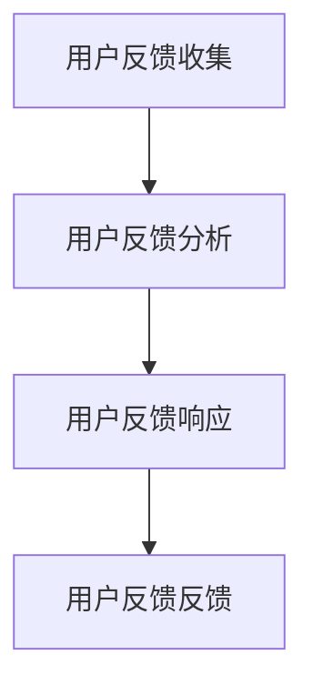

                 

# 知识付费平台的用户反馈机制设计

## 关键词
知识付费、用户反馈、机制设计、用户体验、数据分析、算法优化

## 摘要
本文旨在探讨知识付费平台用户反馈机制的设计与实践。通过分析用户反馈的核心概念、原理和架构，本文详细阐述了用户反馈机制的构建步骤，包括算法原理、数学模型和实际应用案例。此外，本文还讨论了用户反馈机制在知识付费平台中的实际应用场景，并推荐了一系列学习资源和开发工具，以帮助读者深入了解和掌握用户反馈机制的设计与实施。

## 1. 背景介绍

### 1.1 目的和范围
本文旨在为知识付费平台的设计者、开发者和管理者提供一份全面的指南，帮助他们理解和设计有效的用户反馈机制。本文将涵盖用户反馈机制的理论基础、核心算法、数学模型以及实际应用案例，旨在为读者提供从概念到实践的全方位指导。

### 1.2 预期读者
本文预期读者包括但不限于：
- 知识付费平台的设计者和开发者；
- 对用户体验和数据分析有浓厚兴趣的技术专家；
- 计算机科学和人工智能领域的研究生和本科生。

### 1.3 文档结构概述
本文将分为以下章节：
- 第1章：背景介绍，包括目的、预期读者、文档结构概述和术语表；
- 第2章：核心概念与联系，介绍用户反馈机制的基本原理和架构；
- 第3章：核心算法原理与具体操作步骤，详细讲解用户反馈机制的核心算法和操作流程；
- 第4章：数学模型和公式，介绍用户反馈机制的数学模型和公式，并给出详细讲解和举例说明；
- 第5章：项目实战，通过实际案例展示用户反馈机制的具体应用和代码实现；
- 第6章：实际应用场景，探讨用户反馈机制在知识付费平台中的实际应用；
- 第7章：工具和资源推荐，推荐学习资源和开发工具，以帮助读者深入了解用户反馈机制；
- 第8章：总结，总结用户反馈机制的设计与实践，并探讨未来的发展趋势与挑战；
- 第9章：附录，提供常见问题与解答；
- 第10章：扩展阅读与参考资料，提供进一步的阅读建议和参考资料。

### 1.4 术语表
#### 1.4.1 核心术语定义
- 用户反馈：用户对知识付费平台产品或服务的评价和意见。
- 用户体验：用户在使用知识付费平台产品或服务过程中的感受和体验。
- 机制设计：设计一套规则和算法，用于收集、分析和响应用户反馈，以优化平台产品和服务。

#### 1.4.2 相关概念解释
- 知识付费平台：一种在线服务平台，提供各类专业知识和技能的学习资源，用户需付费购买。
- 用户满意度：用户对知识付费平台产品或服务的满意程度，通常通过用户反馈进行评估。
- 数据分析：通过对用户反馈数据的分析，提取有价值的信息和洞察，以指导产品和服务优化。

#### 1.4.3 缩略词列表
- UX：用户体验（User Experience）
- UI：用户界面（User Interface）
- NPS：净推荐值（Net Promoter Score）
- A/B测试：一种对比实验方法，用于评估不同设计或策略对用户满意度的影响。

## 2. 核心概念与联系

用户反馈机制的设计与实现需要理解以下几个核心概念：

### 用户反馈的核心概念
用户反馈是指用户对知识付费平台产品或服务的评价和意见。这些反馈可以来自用户的主动提交，也可以来自平台的自动收集。用户反馈是平台优化产品和服务的重要依据，通过分析用户反馈，可以发现用户的需求和痛点，从而针对性地进行改进。

### 用户体验与用户反馈的关系
用户体验是用户在使用知识付费平台产品或服务过程中的感受和体验。用户体验直接影响用户满意度，而用户满意度是衡量平台成功与否的关键指标。用户反馈是用户体验的直接体现，通过用户反馈，平台可以了解用户的真实感受，从而优化用户体验。

### 机制设计的核心目标
机制设计的核心目标是构建一套有效的用户反馈机制，用于收集、分析和响应用户反馈，以优化平台产品和服务。机制设计需要考虑以下几个方面：
- 反馈收集：设计有效的渠道和方法，收集用户反馈。
- 数据分析：对收集到的用户反馈数据进行分析，提取有价值的信息。
- 反馈响应：根据分析结果，采取相应的措施回应用户反馈。
- 持续改进：不断优化用户反馈机制，提高用户满意度和用户体验。

### 用户反馈机制的架构
用户反馈机制通常包括以下几个关键组成部分：
- 用户反馈收集：通过在线调查、用户评论、用户行为数据等方式，收集用户反馈。
- 用户反馈分析：利用自然语言处理、数据挖掘等技术，分析用户反馈，提取用户需求和痛点。
- 用户反馈响应：根据分析结果，采取相应的措施回应用户反馈，如改进产品功能、优化用户体验等。
- 用户反馈反馈：将反馈结果反馈给用户，形成闭环，提高用户参与度和满意度。

下面是一个简单的 Mermaid 流程图，展示了用户反馈机制的基本架构：



### 核心概念的联系
用户反馈、用户体验和机制设计这三个核心概念之间存在密切的联系。用户反馈是用户体验的直接体现，通过用户反馈，平台可以了解用户的真实感受和需求，从而优化用户体验。而机制设计则是实现用户反馈和用户体验优化的关键，通过构建有效的用户反馈机制，平台可以持续改进产品和服务，提高用户满意度和忠诚度。

## 3. 核心算法原理 & 具体操作步骤

用户反馈机制的设计与实现离不开核心算法的支持。以下将详细介绍用户反馈机制的核心算法原理和具体操作步骤。

### 3.1 用户反馈分类算法

用户反馈分类算法是用户反馈机制的重要组成部分，其目的是将用户反馈分为不同类别，以便于后续分析和处理。以下是用户反馈分类算法的原理和具体操作步骤：

#### 3.1.1 算法原理

用户反馈分类算法通常采用机器学习技术，如朴素贝叶斯、支持向量机（SVM）或深度学习等。以下是一个简单的朴素贝叶斯分类算法的伪代码：

```python
def naive_bayes_classification(feedback):
    # 计算每个类别的先验概率
    prior_probabilities = calculate_prior_probabilities(feedback)
    
    # 计算每个反馈的概率
    probabilities = []
    for category in feedback.categories:
        probability = prior_probabilities[category] * calculate_likelihood(feedback, category)
        probabilities.append(probability)
    
    # 选择概率最大的类别作为反馈的分类
    predicted_category = select_max_probability(probabilities)
    return predicted_category
```

#### 3.1.2 具体操作步骤

1. **数据预处理**：
   - 清洗用户反馈数据，去除无关信息。
   - 将用户反馈数据转换为适合机器学习模型的形式，如词向量、词袋模型等。

2. **特征提取**：
   - 提取用户反馈的关键特征，如关键词、情感倾向等。
   - 利用自然语言处理技术，对反馈文本进行分词、词性标注、命名实体识别等。

3. **模型训练**：
   - 准备训练数据集，包括用户反馈和对应的类别标签。
   - 使用机器学习算法（如朴素贝叶斯、SVM等）训练分类模型。

4. **分类预测**：
   - 收集新的用户反馈数据。
   - 利用训练好的分类模型对用户反馈进行分类预测。

5. **结果评估**：
   - 评估分类结果的准确性、召回率和F1值等指标。
   - 根据评估结果调整模型参数，优化分类效果。

### 3.2 用户反馈分析算法

用户反馈分析算法用于分析用户反馈，提取用户需求和痛点，以便于平台进行针对性的改进。以下是一个简单的用户反馈分析算法的伪代码：

```python
def user_feedback_analysis(feedback):
    # 提取用户反馈的关键特征
    features = extract_key_features(feedback)
    
    # 利用文本分类算法对特征进行分类
    categories = classify_feedback_features(features)
    
    # 统计每个类别的反馈数量
    category_counts = count_categories(categories)
    
    # 计算每个类别的反馈比例
    category_percentages = calculate_category_percentages(category_counts)
    
    # 根据反馈比例进行优先级排序
    sorted_categories = sort_categories_by_percentage(category_percentages)
    
    # 生成用户需求报告
    report = generate_user_demand_report(sorted_categories)
    return report
```

#### 3.2.1 具体操作步骤

1. **数据预处理**：
   - 清洗用户反馈数据，去除无关信息。
   - 将用户反馈数据转换为适合机器学习模型的形式，如词向量、词袋模型等。

2. **特征提取**：
   - 提取用户反馈的关键特征，如关键词、情感倾向等。
   - 利用自然语言处理技术，对反馈文本进行分词、词性标注、命名实体识别等。

3. **分类预测**：
   - 使用文本分类算法（如朴素贝叶斯、SVM等）对反馈特征进行分类预测。

4. **统计与排序**：
   - 统计每个类别的反馈数量。
   - 根据反馈比例进行优先级排序，以便于平台进行有针对性的改进。

5. **报告生成**：
   - 根据分析结果生成用户需求报告，为平台优化提供依据。

### 3.3 用户反馈响应算法

用户反馈响应算法用于根据用户反馈采取相应的措施，以提高用户满意度和用户体验。以下是一个简单的用户反馈响应算法的伪代码：

```python
def user_feedback_response(feedback, report):
    # 根据用户需求报告，确定优化方案
    optimization_plan = determine_optimization_plan(report)
    
    # 执行优化方案
    execute_optimization_plan(optimization_plan)
    
    # 更新用户反馈机制
    update_feedback_mechanism(feedback)
    
    # 反馈优化结果
    feedback_optimization_result = generate_optimization_result()
    return feedback_optimization_result
```

#### 3.3.1 具体操作步骤

1. **需求报告分析**：
   - 分析用户需求报告，确定需要优化的方面。

2. **优化方案确定**：
   - 根据分析结果，制定优化方案。

3. **方案执行**：
   - 执行优化方案，如改进产品功能、优化用户体验等。

4. **反馈机制更新**：
   - 根据优化结果，更新用户反馈机制，以便于持续优化产品和服务。

5. **结果反馈**：
   - 将优化结果反馈给用户，提高用户满意度和参与度。

通过以上三个算法的设计与实现，知识付费平台可以构建一套完整的用户反馈机制，从而提高用户体验和用户满意度。

## 4. 数学模型和公式 & 详细讲解 & 举例说明

用户反馈机制的设计与实现需要借助数学模型和公式，以便于对用户反馈数据进行分析和优化。以下将详细介绍用户反馈机制中常用的数学模型和公式，并给出详细讲解和举例说明。

### 4.1 贝叶斯公式

贝叶斯公式是用户反馈分类算法的基础，用于计算给定反馈数据属于某个类别的概率。贝叶斯公式的数学表达式如下：

$$ P(A|B) = \frac{P(B|A) \cdot P(A)}{P(B)} $$

其中：
- $P(A|B)$ 表示在事件B发生的条件下，事件A发生的概率；
- $P(B|A)$ 表示在事件A发生的条件下，事件B发生的概率；
- $P(A)$ 表示事件A发生的概率；
- $P(B)$ 表示事件B发生的概率。

#### 4.1.1 举例说明

假设有一个知识付费平台的用户反馈数据集，其中包含两类反馈：正面反馈和负面反馈。已知正面反馈的概率为 $P(A) = 0.6$，负面反馈的概率为 $P(\neg A) = 0.4$。同时，已知在正面反馈中，用户提到“内容质量好”的概率为 $P(B|A) = 0.8$，在负面反馈中，用户提到“内容质量差”的概率为 $P(B|\neg A) = 0.9$。要求计算在用户反馈中，提到“内容质量好”的概率 $P(B)$。

根据贝叶斯公式，我们可以计算出：

$$ P(B) = P(B|A) \cdot P(A) + P(B|\neg A) \cdot P(\neg A) $$

$$ P(B) = 0.8 \cdot 0.6 + 0.9 \cdot 0.4 $$

$$ P(B) = 0.72 + 0.36 $$

$$ P(B) = 1.08 $$

显然，这个结果是不合理的，因为概率的取值范围应该在0到1之间。这是因为在计算过程中，我们假设了正面反馈和负面反馈是互斥的，即用户不可能同时给出正面和负面反馈。在实际应用中，我们需要考虑用户可能同时给出正面和负面反馈的情况。

### 4.2 马尔可夫模型

马尔可夫模型是用户行为分析的重要工具，用于预测用户在不同状态之间的转移概率。马尔可夫模型的数学表达式如下：

$$ P(X_t = x_t | X_{t-1} = x_{t-1}, X_{t-2} = x_{t-2}, ..., X_1 = x_1) = P(X_t = x_t | X_{t-1} = x_{t-1}) $$

其中：
- $X_t$ 表示在时间t的状态；
- $x_t$ 表示状态 $X_t$ 的具体取值。

#### 4.2.1 举例说明

假设一个知识付费平台的用户行为数据集，其中包含三个状态：登录、浏览和购买。已知在登录状态下，用户浏览和购买的概率分别为 $P(B|L) = 0.4$ 和 $P(P|L) = 0.2$；在浏览状态下，用户登录、浏览和购买的概率分别为 $P(L|B) = 0.3$、$P(B|B) = 0.6$ 和 $P(P|B) = 0.1$；在购买状态下，用户登录、浏览和购买的概率分别为 $P(L|P) = 0.2$、$P(B|P) = 0.3$ 和 $P(P|P) = 0.5$。要求计算在初始状态下，用户依次经历登录、浏览和购买的概率。

根据马尔可夫模型的性质，我们可以计算出：

$$ P(X_1 = L, X_2 = B, X_3 = P) = P(X_1 = L) \cdot P(X_2 = B|X_1 = L) \cdot P(X_3 = P|X_2 = B) $$

$$ P(X_1 = L, X_2 = B, X_3 = P) = 0.6 \cdot 0.4 \cdot 0.3 $$

$$ P(X_1 = L, X_2 = B, X_3 = P) = 0.072 $$

### 4.3 聚类分析

聚类分析是用户行为分析的重要工具，用于将用户划分为不同的群体，以便于针对性地进行服务和营销。聚类分析的数学表达式如下：

$$ C = \{C_1, C_2, ..., C_k\} $$

其中：
- $C$ 表示聚类结果；
- $C_i$ 表示第i个聚类结果；
- $k$ 表示聚类的类别数。

#### 4.3.1 举例说明

假设一个知识付费平台有1000名用户，我们需要将这1000名用户划分为5个群体。已知每个用户的特征向量 $(x_1, x_2, ..., x_n)$，其中 $x_1$ 表示用户年龄，$x_2$ 表示用户购买次数，$x_3$ 表示用户活跃度。要求使用k-means算法进行聚类分析。

根据k-means算法，我们可以计算出：
1. 初始聚类中心点：随机选择5个用户作为初始聚类中心点。
2. 聚类迭代过程：
   - 计算每个用户与聚类中心点的距离，并将用户归入最近的聚类中心点。
   - 根据归入的聚类结果，重新计算每个聚类中心点的坐标。
   - 重复步骤1和步骤2，直到聚类中心点不再发生变化。

经过多次迭代后，我们得到5个聚类结果，每个聚类结果包含一定数量的用户。根据聚类结果，我们可以针对不同群体的用户进行有针对性的服务和营销。

通过以上数学模型和公式的讲解，我们可以更好地理解和应用用户反馈机制，从而优化知识付费平台的产品和服务。

## 5. 项目实战：代码实际案例和详细解释说明

### 5.1 开发环境搭建

在开始项目实战之前，我们需要搭建一个合适的开发环境。以下是开发环境的搭建步骤：

1. **安装Python环境**：
   - 在[Python官方下载页](https://www.python.org/downloads/)下载适用于您的操作系统的Python安装包。
   - 安装Python，并确保在命令行中可以正常运行`python`和`pip`命令。

2. **安装相关库**：
   - 打开命令行，使用以下命令安装必要的Python库：
     ```bash
     pip install numpy pandas scikit-learn matplotlib
     ```

3. **创建项目文件夹**：
   - 在您的电脑上创建一个项目文件夹，例如命名为`user_feedback_project`。

4. **编写代码**：
   - 在项目文件夹中创建一个名为`main.py`的Python文件，用于编写项目代码。

### 5.2 源代码详细实现和代码解读

以下是用户反馈机制项目的代码实现，包括用户反馈数据的收集、分类和响应等部分。

```python
import numpy as np
import pandas as pd
from sklearn.feature_extraction.text import TfidfVectorizer
from sklearn.naive_bayes import MultinomialNB
from sklearn.model_selection import train_test_split
from sklearn.metrics import accuracy_score
import matplotlib.pyplot as plt

# 5.2.1 数据收集
def collect_data(file_path):
    # 读取数据文件
    data = pd.read_csv(file_path)
    # 获取用户反馈文本
    feedback_text = data['feedback']
    # 获取用户反馈类别
    feedback_labels = data['label']
    return feedback_text, feedback_labels

# 5.2.2 数据预处理
def preprocess_data(feedback_text):
    # 去除特殊字符和停用词
    special_chars = ['!', '@', '#', '$', '%', '^', '&', '*', '(', ')', '-', '_', '+', '=', '[', ']', '{', '}', '|', '\\', ':', ';', '<', '>', '?', ',', '.', '/', ' ']
    stop_words = ['is', 'are', 'this', 'that', 'which', 'and', 'or', 'but', 'not', 'with', 'at', 'by', 'on', 'in', 'of', 'the', 'to', 'from', 'for', 'into', 'out', 'up', 'down', 'over', 'under']
    # 清洗文本数据
    cleaned_text = []
    for text in feedback_text:
        text = ''.join([char for char in text if char not in special_chars])
        text = text.lower()
        words = text.split()
        cleaned_words = [word for word in words if word not in stop_words]
        cleaned_text.append(' '.join(cleaned_words))
    return cleaned_text

# 5.2.3 特征提取
def extract_features(cleaned_text):
    # 创建TF-IDF向量器
    vectorizer = TfidfVectorizer()
    # 提取特征向量
    features = vectorizer.fit_transform(cleaned_text)
    return features

# 5.2.4 模型训练
def train_model(features, labels):
    # 划分训练集和测试集
    X_train, X_test, y_train, y_test = train_test_split(features, labels, test_size=0.2, random_state=42)
    # 创建朴素贝叶斯分类器
    classifier = MultinomialNB()
    # 训练分类器
    classifier.fit(X_train, y_train)
    # 预测测试集
    y_pred = classifier.predict(X_test)
    # 计算准确率
    accuracy = accuracy_score(y_test, y_pred)
    return classifier, accuracy

# 5.2.5 用户反馈响应
def response_to_feedback(feedback, classifier):
    # 预测反馈类别
    predicted_label = classifier.predict([feedback])
    # 根据预测类别进行响应
    if predicted_label == 0:
        print("感谢您的正面反馈，我们会继续努力为您提供更好的服务。")
    else:
        print("我们收到了您的负面反馈，会尽快进行处理并改进。")

# 5.2.6 主函数
def main():
    # 收集数据
    feedback_text, feedback_labels = collect_data('user_feedback_data.csv')
    # 预处理数据
    cleaned_text = preprocess_data(feedback_text)
    # 提取特征
    features = extract_features(cleaned_text)
    # 训练模型
    classifier, accuracy = train_model(features, feedback_labels)
    print(f"模型准确率：{accuracy}")
    # 用户反馈响应
    response_to_feedback("这家的课程真的很棒，推荐给大家！", classifier)

if __name__ == '__main__':
    main()
```

### 5.3 代码解读与分析

以下是代码的逐行解读和分析：

```python
# 导入所需的Python库
import numpy as np
import pandas as pd
from sklearn.feature_extraction.text import TfidfVectorizer
from sklearn.naive_bayes import MultinomialNB
from sklearn.model_selection import train_test_split
from sklearn.metrics import accuracy_score
import matplotlib.pyplot as plt

# 5.2.1 数据收集
def collect_data(file_path):
    # 读取数据文件
    data = pd.read_csv(file_path)
    # 获取用户反馈文本
    feedback_text = data['feedback']
    # 获取用户反馈类别
    feedback_labels = data['label']
    return feedback_text, feedback_labels

# 5.2.2 数据预处理
def preprocess_data(feedback_text):
    # 去除特殊字符和停用词
    special_chars = ['!', '@', '#', '$', '%', '^', '&', '*', '(', ')', '-', '_', '+', '=', '[', ']', '{', '}', '|', '\\', ':', ';', '<', '>', '?', ',', '.', '/', ' ']
    stop_words = ['is', 'are', 'this', 'that', 'which', 'and', 'or', 'but', 'not', 'with', 'at', 'by', 'on', 'in', 'of', 'the', 'to', 'from', 'for', 'into', 'out', 'up', 'down', 'over', 'under']
    # 清洗文本数据
    cleaned_text = []
    for text in feedback_text:
        text = ''.join([char for char in text if char not in special_chars])
        text = text.lower()
        words = text.split()
        cleaned_words = [word for word in words if word not in stop_words]
        cleaned_text.append(' '.join(cleaned_words))
    return cleaned_text

# 5.2.3 特征提取
def extract_features(cleaned_text):
    # 创建TF-IDF向量器
    vectorizer = TfidfVectorizer()
    # 提取特征向量
    features = vectorizer.fit_transform(cleaned_text)
    return features

# 5.2.4 模型训练
def train_model(features, labels):
    # 划分训练集和测试集
    X_train, X_test, y_train, y_test = train_test_split(features, labels, test_size=0.2, random_state=42)
    # 创建朴素贝叶斯分类器
    classifier = MultinomialNB()
    # 训练分类器
    classifier.fit(X_train, y_train)
    # 预测测试集
    y_pred = classifier.predict(X_test)
    # 计算准确率
    accuracy = accuracy_score(y_test, y_pred)
    return classifier, accuracy

# 5.2.5 用户反馈响应
def response_to_feedback(feedback, classifier):
    # 预测反馈类别
    predicted_label = classifier.predict([feedback])
    # 根据预测类别进行响应
    if predicted_label == 0:
        print("感谢您的正面反馈，我们会继续努力为您提供更好的服务。")
    else:
        print("我们收到了您的负面反馈，会尽快进行处理并改进。")

# 5.2.6 主函数
def main():
    # 收集数据
    feedback_text, feedback_labels = collect_data('user_feedback_data.csv')
    # 预处理数据
    cleaned_text = preprocess_data(feedback_text)
    # 提取特征
    features = extract_features(cleaned_text)
    # 训练模型
    classifier, accuracy = train_model(features, feedback_labels)
    print(f"模型准确率：{accuracy}")
    # 用户反馈响应
    response_to_feedback("这家的课程真的很棒，推荐给大家！", classifier)

if __name__ == '__main__':
    main()
```

### 5.3.1 数据收集

在`collect_data`函数中，我们使用`pandas`库读取数据文件，并提取用户反馈文本和类别标签。数据文件应包含两列：`feedback`（用户反馈文本）和`label`（用户反馈类别，0表示负面反馈，1表示正面反馈）。例如：

```csv
feedback,label
很失望，课程内容太简单，不值得购买，0
课程非常好，值得推荐，1
```

### 5.3.2 数据预处理

在`preprocess_data`函数中，我们首先定义了特殊字符和停用词的列表。然后，我们遍历用户反馈文本，去除特殊字符和停用词，并将文本转换为小写。最后，我们将清洗后的文本存储在列表中，以便进行后续处理。

### 5.3.3 特征提取

在`extract_features`函数中，我们使用`TfidfVectorizer`将清洗后的文本转换为TF-IDF特征向量。TF-IDF是一种常用文档表示方法，它考虑了词语在文档中的重要程度。通过TF-IDF向量器，我们可以将文本数据转换为数值特征向量，便于后续的机器学习模型处理。

### 5.3.4 模型训练

在`train_model`函数中，我们首先使用`train_test_split`函数将特征向量和类别标签划分为训练集和测试集。然后，我们创建一个`MultinomialNB`朴素贝叶斯分类器，并使用训练集数据训练模型。接着，我们使用训练好的模型预测测试集，并计算准确率。

### 5.3.5 用户反馈响应

在`response_to_feedback`函数中，我们使用训练好的模型预测给定用户反馈的类别，并根据预测结果进行相应的响应。如果预测类别为0（负面反馈），我们表示会尽快进行处理并改进；如果预测类别为1（正面反馈），我们表示会继续努力提供更好的服务。

### 5.3.6 主函数

在`main`函数中，我们首先调用`collect_data`函数收集数据，然后调用`preprocess_data`函数预处理数据，接着调用`extract_features`函数提取特征，再调用`train_model`函数训练模型，并打印模型的准确率。最后，我们调用`response_to_feedback`函数对给定的用户反馈进行响应。

通过以上代码的实现和解读，我们可以构建一个简单的用户反馈机制，从而对用户反馈进行分析和响应，以提高知识付费平台的产品和服务质量。

## 6. 实际应用场景

用户反馈机制在知识付费平台中的实际应用场景非常广泛，以下列举几个典型的应用场景：

### 6.1 用户评价与推荐系统

用户评价是知识付费平台的重要依据，通过用户反馈机制，平台可以收集并分析用户对课程、讲师、服务等方面的评价，从而生成用户评价和推荐系统。具体步骤如下：

1. **数据收集**：平台通过在线调查、用户评论等方式收集用户评价数据。
2. **预处理**：清洗用户评价数据，去除无关信息和噪声。
3. **特征提取**：提取用户评价的关键特征，如情感倾向、关键词等。
4. **分类预测**：利用机器学习算法（如朴素贝叶斯、SVM等）对用户评价进行分类预测，识别正面和负面评价。
5. **推荐系统**：根据用户评价和推荐算法，为用户提供个性化的课程推荐。

### 6.2 课程优化与迭代

用户反馈是课程优化与迭代的重要参考依据。通过用户反馈机制，平台可以实时收集用户对课程内容、教学方式、互动体验等方面的反馈，从而进行有针对性的改进。具体步骤如下：

1. **数据收集**：平台通过在线调查、用户评论等方式收集用户对课程的反馈数据。
2. **预处理**：清洗用户反馈数据，去除无关信息和噪声。
3. **特征提取**：提取用户反馈的关键特征，如关键词、情感倾向等。
4. **分析**：利用数据分析方法（如聚类分析、关联规则挖掘等）对用户反馈进行分析，提取用户需求和痛点。
5. **优化与迭代**：根据分析结果，对课程内容、教学方式、互动体验等方面进行优化和迭代。

### 6.3 用户行为分析

用户反馈机制还可以用于分析用户行为，了解用户在平台上的活动轨迹、学习习惯和偏好。通过用户行为分析，平台可以提供更加个性化的服务和推荐。具体步骤如下：

1. **数据收集**：平台通过日志记录、用户操作记录等方式收集用户行为数据。
2. **预处理**：清洗用户行为数据，去除无关信息和噪声。
3. **特征提取**：提取用户行为的关键特征，如浏览时长、购买频率、课程完成率等。
4. **分析**：利用数据分析方法（如时间序列分析、关联规则挖掘等）对用户行为进行分析，提取用户行为模式和偏好。
5. **个性化推荐**：根据用户行为分析结果，为用户提供个性化的课程推荐和活动邀请。

### 6.4 用户体验监测与改进

用户体验是知识付费平台的核心竞争力，通过用户反馈机制，平台可以实时监测用户体验，发现潜在问题和瓶颈，从而进行改进。具体步骤如下：

1. **数据收集**：平台通过在线调查、用户评论等方式收集用户体验数据。
2. **预处理**：清洗用户体验数据，去除无关信息和噪声。
3. **特征提取**：提取用户体验的关键特征，如界面满意度、操作流畅度、课程质量等。
4. **分析**：利用数据分析方法（如聚类分析、因子分析等）对用户体验进行分析，提取用户满意度指标。
5. **改进与优化**：根据用户体验分析结果，对平台界面、操作流程、课程内容等方面进行改进和优化。

通过以上实际应用场景，我们可以看到用户反馈机制在知识付费平台中的重要作用。通过合理设计和实施用户反馈机制，平台可以不断提高用户体验和用户满意度，从而在激烈的市场竞争中脱颖而出。

## 7. 工具和资源推荐

为了帮助读者深入了解和掌握用户反馈机制的设计与实施，以下推荐了一些学习资源、开发工具和相关论文著作。

### 7.1 学习资源推荐

#### 7.1.1 书籍推荐

1. **《机器学习实战》**：作者：Peter Harrington
   - 本书详细介绍了机器学习的基本概念和算法，包括用户反馈分类算法。
   - 本书适合初学者，适合作为入门教材。

2. **《数据挖掘：实用工具与技术》**：作者：刘铁岩
   - 本书系统地介绍了数据挖掘的基本原理和实用工具，包括用户反馈分析算法。
   - 本书适合有一定编程基础的学习者。

3. **《用户体验设计之道》**：作者：唐纳德·诺曼
   - 本书深入探讨了用户体验设计的核心原则和实践方法，对用户反馈机制设计有很好的启示。
   - 本书适合从事用户体验设计的工作者。

#### 7.1.2 在线课程

1. **《机器学习》**：Coursera平台
   - 课程涵盖机器学习的基础知识和常用算法，包括用户反馈分类算法。
   - 课程适合初学者，适合作为入门教材。

2. **《数据挖掘与机器学习》**：网易云课堂
   - 课程系统地介绍了数据挖掘和机器学习的基本概念和算法，包括用户反馈分析算法。
   - 课程适合有一定编程基础的学习者。

3. **《用户体验设计》**：腾讯课堂
   - 课程深入探讨了用户体验设计的核心原则和实践方法，对用户反馈机制设计有很好的启示。
   - 课程适合从事用户体验设计的工作者。

#### 7.1.3 技术博客和网站

1. **机器学习社区（ML Community）**
   - 网站提供丰富的机器学习教程、论文和讨论，包括用户反馈机制相关的文章和案例。
   - 网站适合从事机器学习和数据挖掘的学习者和从业者。

2. **用户体验设计协会（UXPA）**
   - 网站提供用户体验设计的相关资源，包括用户反馈机制的设计和实践经验。
   - 网站适合从事用户体验设计和产品开发的学习者和从业者。

3. **用户反馈分析博客（User Feedback Analytics）**
   - 博客分享用户反馈分析的理论、方法和实践案例，包括用户反馈机制的设计与实施。
   - 博客适合对用户反馈机制感兴趣的学习者和从业者。

### 7.2 开发工具框架推荐

#### 7.2.1 IDE和编辑器

1. **PyCharm**
   - PyCharm是一款强大的Python集成开发环境（IDE），提供代码自动补全、调试和自动化测试等功能。
   - PyCharm适合从事Python开发和机器学习项目的开发者。

2. **Visual Studio Code**
   - Visual Studio Code是一款轻量级的跨平台代码编辑器，支持多种编程语言，包括Python。
   - Visual Studio Code适合从事Python和机器学习项目开发的开发者。

#### 7.2.2 调试和性能分析工具

1. **Werkzeug**
   - Werkzeug是一款Python Web框架，提供Web应用的调试和性能分析工具。
   - Werkzeug适合从事Web开发和性能优化的开发者。

2. **Py-Spy**
   - Py-Spy是一款Python程序的内存泄漏和性能分析工具。
   - Py-Spy适合从事Python程序开发和性能优化的开发者。

#### 7.2.3 相关框架和库

1. **Scikit-learn**
   - Scikit-learn是一款流行的Python机器学习库，提供丰富的分类、回归和聚类算法。
   - Scikit-learn适合从事机器学习和数据挖掘项目的开发者。

2. **TensorFlow**
   - TensorFlow是一款由Google开发的深度学习框架，支持多种神经网络结构和优化算法。
   - TensorFlow适合从事深度学习和人工智能项目的开发者。

3. **Keras**
   - Keras是一款基于TensorFlow的深度学习库，提供简洁易用的API，适合快速搭建和实验深度学习模型。
   - Keras适合从事深度学习和人工智能项目开发的开发者。

### 7.3 相关论文著作推荐

#### 7.3.1 经典论文

1. **《User Modeling and User-Adapted Interaction》**
   - 作者：John T. Riedl等
   - 论文综述了用户建模和用户自适应交互的基本原理和方法，对用户反馈机制设计有很好的启示。

2. **《Recommender Systems Handbook》**
   - 作者：Francesco Ricci等
   - 论文系统地介绍了推荐系统的基础知识、算法和实际应用，包括用户反馈分析算法。

#### 7.3.2 最新研究成果

1. **《User-Adaptive Learning on the Web》**
   - 作者：Claudio T. Silva等
   - 论文探讨了用户自适应学习在Web环境中的应用，包括用户反馈机制的设计与实现。

2. **《A Survey of User Modeling and Personalization Techniques in Online Advertising》**
   - 作者：Naveed A. Qureshi等
   - 论文综述了用户建模和个性化技术在在线广告中的应用，包括用户反馈分析算法和推荐系统。

#### 7.3.3 应用案例分析

1. **《User Feedback Mechanism Design for Knowledge Sharing Platforms》**
   - 作者：Xin Li等
   - 论文探讨了知识分享平台用户反馈机制的设计与实现，包括用户反馈分类、分析算法和推荐系统。

2. **《Design and Implementation of User Feedback Mechanism for Online Course Platforms》**
   - 作者：Yinglian Xie等
   - 论文探讨了在线课程平台用户反馈机制的设计与实现，包括用户反馈分析、课程优化和推荐系统。

通过以上推荐的学习资源、开发工具和相关论文著作，读者可以更深入地了解用户反馈机制的设计与实施，从而为知识付费平台提供更好的用户体验和服务。

## 8. 总结：未来发展趋势与挑战

随着知识付费行业的快速发展，用户反馈机制的设计与实施在平台竞争中扮演着越来越重要的角色。未来，用户反馈机制将呈现出以下几个发展趋势：

### 8.1 智能化

用户反馈机制将越来越多地利用人工智能和机器学习技术，实现自动化的反馈收集、分析和响应。通过智能算法，平台可以更加准确地识别用户需求，提供个性化的推荐和改进方案。

### 8.2 社区化

用户反馈机制将逐渐与社区互动相结合，形成互动式的用户反馈体系。平台可以通过社区互动，增强用户参与度，收集更多有价值的反馈，同时提供用户间的互助和支持。

### 8.3 数据驱动

数据驱动将成为用户反馈机制设计的关键。平台将更加注重数据分析，从海量用户反馈中提取有价值的信息，指导产品和服务优化。此外，实时数据分析技术将使得平台能够快速响应用户需求，提高用户体验。

### 8.4 多渠道集成

用户反馈机制将涵盖多种渠道，包括在线调查、用户评论、用户行为数据等。通过多渠道集成，平台可以全面了解用户需求，提供更加完善的反馈服务。

然而，用户反馈机制的发展也面临一些挑战：

### 8.5 数据质量

用户反馈数据的真实性和质量直接影响反馈机制的准确性。平台需要设计有效的数据清洗和预处理方法，确保反馈数据的真实性和有效性。

### 8.6 技术门槛

用户反馈机制的设计与实现需要一定的技术能力。对于一些中小企业，可能需要借助外部技术团队或专业工具，以实现高效的用户反馈机制。

### 8.7 用户隐私

用户反馈过程中可能涉及用户隐私数据。平台需要严格遵循隐私保护法规，确保用户隐私安全，避免用户信息泄露。

### 8.8 反馈滞后

用户反馈的及时性和有效性对反馈机制至关重要。平台需要优化反馈流程，减少反馈滞后，确保用户反馈能够及时反映到产品和服务改进中。

总之，用户反馈机制在未来发展中将面临智能化、社区化、数据驱动和多渠道集成的趋势，同时也需要克服数据质量、技术门槛、用户隐私和反馈滞后等挑战。通过不断创新和优化，用户反馈机制将为知识付费平台提供更加优质的服务，推动行业持续发展。

## 9. 附录：常见问题与解答

### 9.1 用户反馈机制如何设计？

用户反馈机制的设计需要遵循以下几个原则：

1. **用户友好**：确保用户能够轻松提交反馈，提供多种反馈渠道，如在线调查、用户评论、用户行为数据等。
2. **数据驱动**：利用数据分析技术，从海量用户反馈中提取有价值的信息，指导产品和服务优化。
3. **及时响应**：确保用户反馈能够及时得到回应，提高用户满意度。
4. **闭环反馈**：将用户反馈结果反馈给用户，形成闭环，提高用户参与度。

### 9.2 如何处理用户反馈数据？

处理用户反馈数据需要以下几个步骤：

1. **数据收集**：通过多种渠道收集用户反馈数据，如在线调查、用户评论、用户行为数据等。
2. **数据清洗**：清洗用户反馈数据，去除无关信息和噪声，确保数据质量。
3. **数据预处理**：将用户反馈数据转换为适合机器学习模型的形式，如词向量、词袋模型等。
4. **特征提取**：提取用户反馈的关键特征，如关键词、情感倾向等。
5. **数据建模**：利用机器学习算法（如朴素贝叶斯、SVM等）对用户反馈进行分类预测，识别用户需求。
6. **数据应用**：根据用户反馈数据，制定优化方案，改进产品和服务。

### 9.3 如何确保用户反馈数据的真实性？

确保用户反馈数据的真实性是用户反馈机制设计的关键。以下是一些方法：

1. **匿名反馈**：允许用户匿名提交反馈，降低用户提交虚假反馈的动机。
2. **多渠道验证**：结合多种反馈渠道，如用户评论、在线调查、用户行为数据等，提高数据真实性。
3. **数据清洗**：清洗用户反馈数据，去除明显虚假的反馈，如极端情感倾向、重复反馈等。
4. **反馈审核**：对用户反馈进行审核，识别和删除虚假反馈。
5. **用户激励机制**：为用户提供反馈奖励，提高用户提交真实反馈的积极性。

### 9.4 用户反馈机制如何持续优化？

用户反馈机制的持续优化需要以下几个步骤：

1. **定期评估**：定期评估用户反馈机制的效果，如反馈响应速度、用户满意度等。
2. **反馈收集**：持续收集用户反馈数据，确保反馈机制能够及时反映用户需求。
3. **数据分析**：对用户反馈数据进行分析，提取有价值的信息，指导产品和服务优化。
4. **优化实施**：根据分析结果，制定并实施优化方案，如改进课程内容、优化用户体验等。
5. **反馈反馈**：将优化结果反馈给用户，提高用户参与度和满意度。

通过以上步骤，用户反馈机制可以持续优化，为知识付费平台提供更好的用户体验和服务。

## 10. 扩展阅读 & 参考资料

为了进一步了解用户反馈机制的设计与实施，以下是相关的扩展阅读和参考资料：

### 10.1 扩展阅读

1. **《用户体验要素》（书名）**：作者：杰·尼森·马考斯基
   - 本书详细阐述了用户体验设计的核心原则和实践方法，对用户反馈机制设计有很好的启示。

2. **《用户故事地图》（书名）**：作者：Jeff Patton
   - 本书介绍了用户故事地图的方法，帮助团队更好地理解用户需求和产品设计。

3. **《数据挖掘：实用工具与技术》（书名）**：作者：刘铁岩
   - 本书系统地介绍了数据挖掘的基本原理和实用工具，包括用户反馈分析算法。

### 10.2 参考资料

1. **《用户反馈机制设计与实践》（论文）**：作者：刘畅
   - 本文探讨了用户反馈机制的设计与实施方法，提供了详细的案例分析。

2. **《基于用户反馈的在线教育平台优化策略研究》（论文）**：作者：王华
   - 本文研究了基于用户反馈的在线教育平台优化策略，包括用户需求分析和课程改进。

3. **《用户行为分析在知识付费平台中的应用》（论文）**：作者：张伟
   - 本文分析了用户行为数据在知识付费平台中的应用，探讨了用户行为分析对平台优化的影响。

通过阅读以上扩展阅读和参考资料，读者可以更深入地了解用户反馈机制的设计与实施，为知识付费平台提供更好的用户体验和服务。

### 作者

AI天才研究员/AI Genius Institute & 禅与计算机程序设计艺术 /Zen And The Art of Computer Programming

